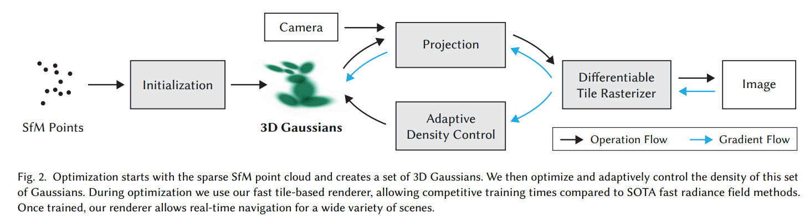
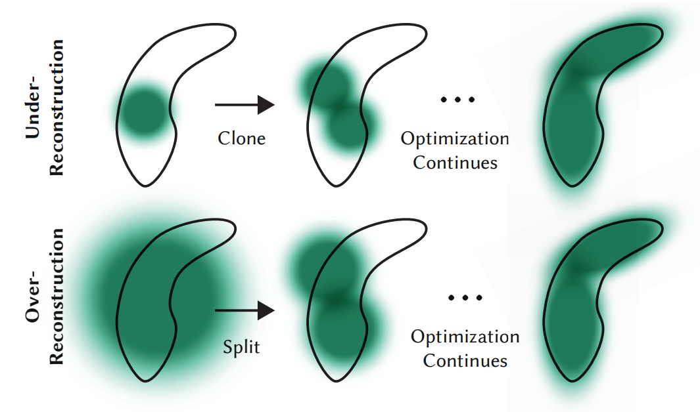
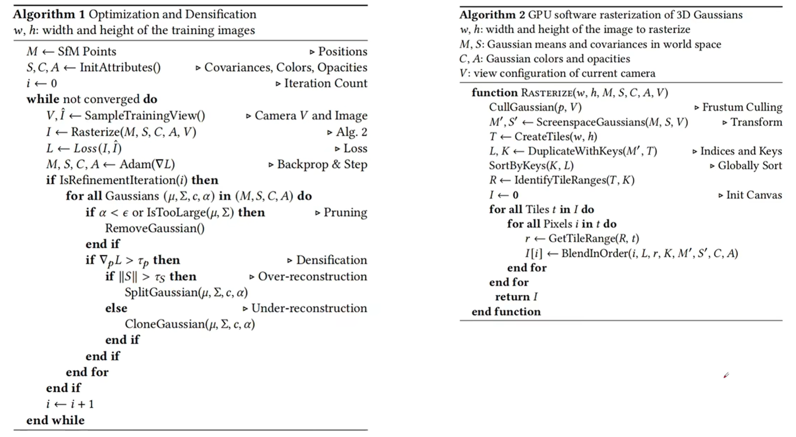

# 3DGS 

> 3D Gaussian Splatting for Real-Time Radiance Field Rendering
>
> > [论文链接](https://arxiv.org/abs/2308.04079)

## Motivation

> However, achieving high visual quality still requires neural networks that are costly to train and render, while recent faster methods inevitably trade off speed for quality.

辐射场发展迅速，但是神经网络总是面临着quality(拟合程度)与时间的trade-off，而时间与fps又息息相关。于是能不能快速地进行3D环境重建呢？这篇工作的目标便是如此：

> We introduce ***three key elements*** that allow us to achieve state-of-the-art visual quality while maintaining competitive training times and importantly allow ***high-quality real-time (≥ 30 fps) novel-view synthesis at 1080p resolution.*** 

三个key elements分别是什么呢？

- Represent the scene with ***3D Gaussians*** that preserve desirable properties of continuous volumetric radiance fields for scene optimization.
- Interleaved optimization/density control of the 3D Gaussians, notably ***optimizing anisotropic covariance*** to achieve an accurate representation of the scene.
- Develop a ***fast visibility-aware rendering algorithm*** that supports anisotropic splatting and both accelerates training and allows real-time rendering.

## 3D Gaussian Ellipsoid

在CG geometry中提到过Constructive Solid Geometry(CSG)，尝试用基本几何形体之间的Boolean operations去合成复杂的几何体，但是如果基本几何形体太多，肯定不方便网络和优化。那么有没有一种高度参数化的、方便优化的基本几何形体呢？论文中创新性地使用了3D Gaussian Ellipsoid来作为基本几何形体。中心点定为μ (x, y, z)，然后通过一个***协方差矩阵（covariance matrix）***去定义椭球的大小和形状。高斯用真实世界坐标系下的协方差矩阵∑来进行定义：
$$
G(x) = e^{-\frac{1}{2} \left( x \right)^\top \Sigma^{-1} \left( x \right)}
$$

但是在渲染成2D的时候，要以摄像机为原点的笛卡尔坐标系，因此需要对协方差矩阵进行变换，从而得到摄像机视角下的、将进行光栅化的3D高斯椭球：（变换有两点：一个是frustum->cuboid，i.e.，projective transformation；另一个是translation，即viewing transformation）

$$
\Sigma' = J W \Sigma W^\top J^\top
\\
where\ W\ is\ the\ viewing\ transformation\ and\  
J\ is\  Jacobian\ \\ of\ the\ affine\ approximation\ of\ projective\ transformation
$$

至于为什么公式长成这样，这是因为涉及到保持协方差矩阵的**半正定**性质。这在协方差矩阵变换的上下文中非常重要，确保变换后的矩阵依然是一个合法的协方差矩阵。那么正定矩阵长什么样子呢？假设有一个单位球，然后我在三个坐标轴方向放缩，然后进行旋转，那么一个大致的椭球就出来了，虽然不是高斯分布。因此：Given a scaling matrix 𝑆 and rotation matrix 𝑅, we can find the corresponding Σ:

$$
\Sigma = R S S^\top R^\top
$$

注意到这个矩阵也是半正定的。R S矩阵定义了方向，和椭球的三个轴向的长度，然后配合第一个G(x)公式对表面进行高斯分布。论文中用一个三维向量s来表示放缩（xyz轴放缩系数）和一个四元数q来表示旋转。因此，对于高斯椭球来说，这个是explicit representation，但是用高斯椭球表示geometry又是implicit representation。在上述的定义之后，基本几何体——高斯椭球终于定义完毕，高度的参数化使得它容易被优化（optimized），且表面的explicit representation公式可微，使得它可以进行梯度下降。

## Spherical Harmonic for Color

一个高斯椭球应该有哪些property？除了3D Position，协方差矩阵，还应该有什么？首先想到应该是类似于NeRF中的density，而论文中，不透明度用opacity α表示。通常情况下，对于一个基本单位的高斯椭球，只有一个opacity值。那么还有颜色呢？这就有些麻烦了，因为椭球上有很多的点，不像NeRF那样用光线方向向量就能知道一个点的RGB值（5D函数）。那么如何给椭球上的点来一个"5D Function"呢？论文中就使用了球谐函数的方法拟合颜色。

球谐函数可以把复杂的颜色变化用一些数学函数来表示，就是把颜色变化分解成几个简单的“波形”。球谐函数的阶数 ll和次数 m决定了描述颜色的细节。例如，低阶球谐函数可以描述大的颜色变化（如球面上的颜色渐变），而高阶球谐函数可以描述小的、细微的颜色变化（如高光或反射细节）。通过一些数学公式（通常是积分）来计算球谐系数 $c_l^m$。这些系数告诉***每个球谐函数对颜色的贡献***。这相当于是泰勒展开：一个椭球上的颜色变化用一个函数很难写出来，我就用多个频率不同的函数去表达，然后记录的是各自函数的表达式与各自函数对应的权重。

计算球谐系数的公式：$c_{l}^{m} = \int_{0}^{2\pi} \int_{0}^{\pi} C(\theta, \phi) \, Y_{l}^{m*}(\theta, \phi) \, \sin \theta \, d\theta \, d\phi$

其中，球谐公式$Y_{l}^{m}(\theta, \phi)$的实数形式：
$$
Y_{l}^{m}(\theta, \phi) = \sqrt{\frac{4\pi}{2l + 1}} \cdot \frac{(l + m)!}{(l - m)!} \cdot P_{l}^{m}(\cos \theta) \cdot 
\begin{cases}
\cos(m \phi) & \text{if } m \geq 0 \\
\sin(-m \phi) & \text{if } m < 0
\end{cases}
$$
用球谐系数计算表达最后颜色：$C(\theta, \phi) \approx \sum_{l=0}^{L} \sum_{m=-l}^{l} c_{l}^{m} Y_{l}^{m}(\theta, \phi)$

用$C(\theta, \phi)$上查阅xyz坐标就能得到RGB值，因此这种类似于“5D函数”的东西终于表达出来了。论文中，$l=4$，因此一共有1+3+5+7 = 16个球谐基函数，而RGB每一个通道都有一个$C(\theta, \phi)$，因此关于颜色的表达将会使用3*16 = 48个参数（当然所有的3D高斯椭球共用一套球谐基函数）

## Tile-Rasterization & α-Rendering

有了一堆的高斯椭球，我还知道一条光线视角下穿过点的opacity与RGB，如何综合它们得到一个最终的RGB值呢？论文中没有使用NeRF的density那一套逐pixel的公式，而是使用了逐tile(瓦片)的Alpha Rendering。

我们的方法首先将屏幕划分为 16×16 的瓦片，然后对 3D 高斯点进行视锥体和每个瓦片的剔除。具体来说，我们只保留那些在视锥体中具有 99% 置信区间的高斯点。此外，我们使用一个保护带来简化地剔除那些位置极端的高斯点（即那些均值接近近裁剪面并且远离视锥体的点），因为计算它们的投影 2D 协方差可能会不稳定。然后，我们根据每个高斯点与瓦片的重叠数量实例化每个高斯点，并为每个实例分配一个结合了视空间深度和瓦片 ID 的键。接着，我们使用快速的 GPU 基数排序（Radix Sort）对高斯点进行排序。注意，没有额外的每像素排序，而是根据这种初始排序进行混合。因此，我们的 α-blending 在某些配置下可能是近似的。然而，当高斯点的尺寸接近单个像素时，这些近似变得微不足道。我们发现，这种选择极大地提高了训练和渲染性能，同时在收敛场景中没有产生明显的伪影。

排序后，我们为每个瓦片生成一个列表，通过确定第一个和最后一个按深度排序的条目，这些条目投影到给定的瓦片上。对于光栅化，我们为每个瓦片启动一个线程块。每个块首先协作地将高斯点包加载到共享内存中，然后，对于每个像素，按前到后遍历列表，累积颜色和 α 值，从而最大化数据加载/共享和处理的并行性。***当像素的 α 达到目标饱和度时，相应的线程停止。定期查询瓦片中的线程，当所有像素的 α 饱和（即 α 达到 1）时，整个瓦片的处理终止。***

在光栅化过程中，α 的饱和度是唯一的停止标准。与之前的工作不同，我们不限制接收梯度更新的混合原语的数量。我们强制执行这一属性，以便我们的方法能够处理具有任意深度复杂性的场景，并准确学习这些场景，而无需进行场景特定的超参数调优。在反向传播过程中，我们必须恢复前向传播中每个像素的完整混合点序列。一种解决方案是将任意长的混合点列表存储在全局内存中。为了避免动态内存管理的开销，我们选择再次遍历每个瓦片的列表；我们可以重用前向传播中的高斯点排序数组和瓦片范围。为了方便梯度计算，我们现在从后向前遍历这些列表。

## Pipeline

见上图。网络输入为一堆的照片以及对应的相机方向与位置，首先通过SfV(Structure from Motion)方法拟合出三维空间中的一系列点，然后各自为中心点初始化高斯椭球，包括它们的球谐系数，opacity，以及s向量(负责scale)与四元数q（负责旋转）。然后根据这个三维场景在一个摄像机视角下进行投影，然后用可微分tile-rasterizer进行光栅化成像，得到image，然后与ground truth进行比较算出loss，然后反向传播，更新Rasterizer, Projection, 3D Gaussians参数。

Loss为两张图片的$L1\ Loss$ 与$D-SSIM\ Loss$（Structural Similarity Index Measure）的结合：
$$
L = (1 - \lambda) L_{1} + \lambda L_{\text{D-SSIM}},\hspace{1cm}\lambda=0.2
$$
基于梯度自适应改变点云分布方式(Adaptive Density Control)：在每隔一定epoch数量之后进行一次，决定是否更新点云的分布。第一种是Pruning，减少伪影的出现：其中不透明底低于阈值的，或者离相机太近的会被删掉。

第二种是Densification，过度重构或欠采样（这一部分就会基于梯度来进行判断）。有的时候，高斯椭球会不会过少或过多？当然有可能，如果完全依赖初始化的点云，那么就有些不合适了。如下图：两个

对于上下两个原来的高斯椭球来说，它们的梯度无疑是***很大的***。那么这个时候就判断这个高斯椭球的方差：如果过小，就说明是第一行的情况，需要clone出另外一个高斯椭球帮忙进行拟合；如果过小，说明是第二种情况，需要这个大高斯椭球分裂成两个小的，从而更好地拟合。

那么上述就是3D高斯泼溅的大致流程了。下面是关于它的伪代码图([source link](https://www.bilibili.com/video/BV1FC4y1k79X/?spm_id_from=333.788&vd_source=c406de5972d410030d8cf03e6e60de6e))：

