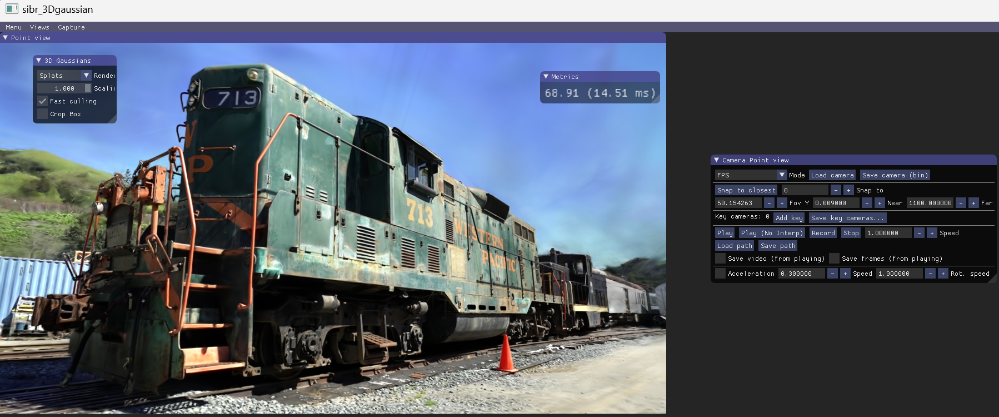

# 3DGS_reproduction

## dateset -> training

理论上, `conda env create --file environment.yml`命令即可实现环境的配置. 然后数据集选择的是`https://repo-sam.inria.fr/fungraph/3d-gaussian-splatting/`的Scenes. 其中, 一个文件夹含有两个子文件夹: `images sparse`. 

环境配置没遇到什么大问题, 然后有了环境和数据集, 那么就可以运行试验了: 

`python train.py -s data -m data/output - 1`

其中, `-r`代表分辨率乘以$\frac{1}{s}$, 不输入的话默认是1. 如果训练的时候遇到了`CUDA_OUT_OF_MEMORY`(如果使用自己的数据而且数据很大; 一般官网提供的数据, 12GB显存就可以run), 那么就可以设置这个参数进行压缩. 而`-s`是含有images和sparse子文件夹的文件夹.

训练结果如下:


## training_result->demo

使用SIBR软件可视化训练的结果, 这里推荐在WINDOWS上面下载: https://repo-sam.inria.fr/fungraph/3d-gaussian-splatting/binaries/viewers.zip

把训练结果文件夹搬回到WINDOWS, 然后运行命令(要先进入工作目录): `.\bin\SIBR_gaussianViewer_app -m output`

然后就可以可视化了!



## raw mp4->dataset

如果要把mp4处理成代码能够利用的数据集, 需要经过两个步骤: 第一步是mp4截取出一帧帧照片, 第二步是根据图片生成点云.

想要把mp4截取出图片, 需要使用ffmpeg命令. 通过以下的bash就可以在***root管理权限***下安装了:

````bash
apt-get remove ffmpeg
apt-get purge ffmpeg
conda remove ffmpeg # 如果conda里面已经有了
apt-get install ffmpeg
````

那么之后如何调用***colmap***库从而生成点云是最麻烦的步骤: 安装colmap. 首先安装一下的dependencies:

````bash
apt-get install \
    git \
    cmake \
    build-essential \
    libboost-program-options-dev \
    libboost-filesystem-dev \
    libboost-graph-dev \
    libboost-system-dev \
    libboost-test-dev \
    libeigen3-dev \
    libsuitesparse-dev \
    libfreeimage-dev \
    libmetis-dev \
    libgoogle-glog-dev \
    libgflags-dev \
    libglew-dev \
    qtbase5-dev \
    libqt5opengl5-dev \
    libcgal-dev \
    libcgal-qt5-dev \
    libflann-dev \
    libsqlite3-dev \
    libatlas-base-dev
````

然后把colmap的repo下到服务器里面. 这里我选的是[colmap:COLMAP - Structure-from-Motion and Multi-View Stereo - GitCode](https://gitcode.com/gh_mirrors/co/colmap/overview?utm_source=csdn_github_accelerator&isLogin=1)链接进行下载.

之后是安装Ceres优化库: 具体教程链接: [Installation — Ceres Solver (ceres-solver.org)](http://ceres-solver.org/installation.html#linux)  以及在这个官网里面可以下载压缩包. 注意这个`ceres-solver`安装包要放在`colmap`里面. 

> 或者参考该链接: [依赖库：Ceres-solver-2.0.0安装_ceres2.0.0-CSDN博客](https://blog.csdn.net/qq_32761549/article/details/134545635)

那么源码编译中, 需要在`CMakeList`中手动加入`CUDA_COMPILER`的信息: `set(CMAKE_CUDA_COMPILER /usr/local/cuda-11.6/bin/nvcc) `(注意是把nvcc指定进去)

那么`ceres`源码编译完成之后, 就可以源码编译`colmap`了. 同样, 需要在`colmap`的CMakeList中加入`CUDA_COMPILER`路径的指定. 除此之外, 还有部分的地方需要修改:

1. `CMakeList`中需要加入: `set(CMAKE_CUDA_ARCHITECTURES "native")`
2. `/usr/local/lib/cmake/Ceres/FindGlog.cmake`中, `#add glog::glog target`部分全部注释掉
2. `colmap/cmake/CMakeHelper.cmake`文件中，需要在`macro(COLMAP_ADD_LIBRARY)`一段中， 在`set(multiValueArgs NAME SRCS PRIVATE_LINK_LIBS PUBLIC_LINK_LIBS)`之后加入`find_package(CUDAToolkit REQUIRED)`。

那么`colmap`编译完成之后, 铺垫就完成了. 第一步是mp4处理成图片: 

`ffmpeg -i input.mp4 -vf "setpts=0.2*PTS" input/input_%4d.jpg`

然后, 调用`convert.py`程序: `python convert.py -s data`

之后就能看到data文件夹里面出现了`images sparse`两个子文件夹. 那么之后的步骤同上.