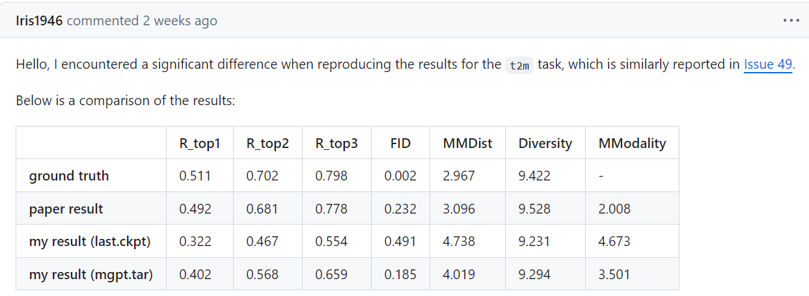
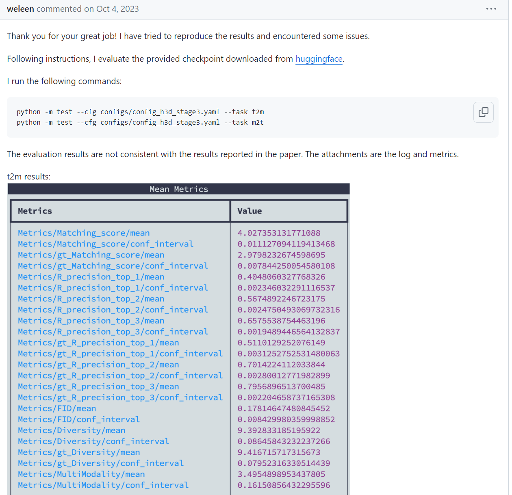
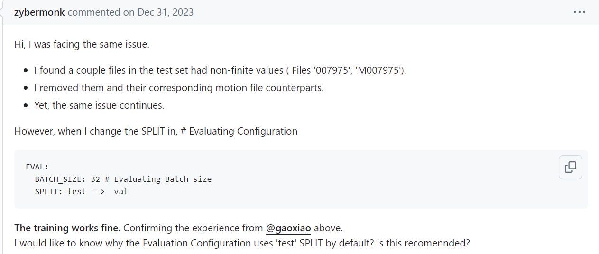
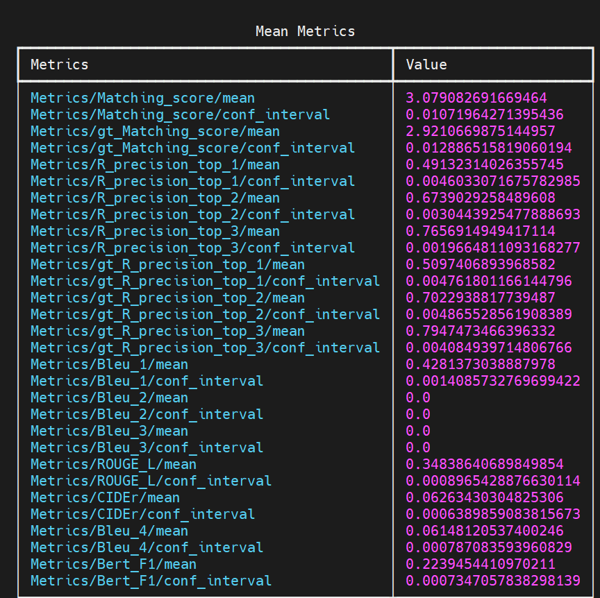
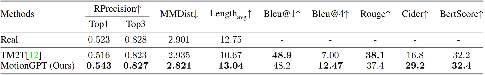
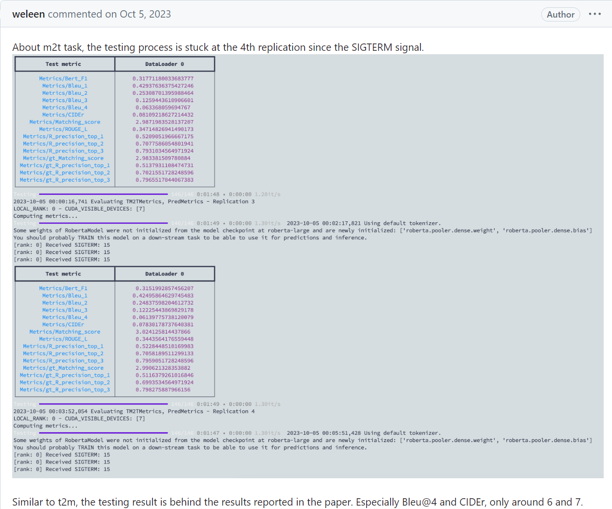
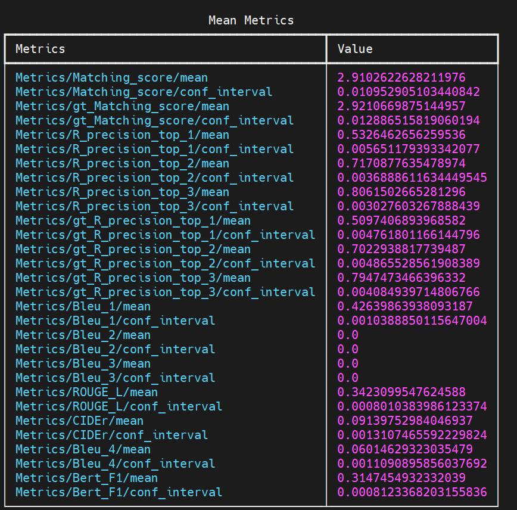

# Log

## 6.22

之前MotionGPT实验复现的iteration数量不够, 于是加大了训练量. 但是在pretrain为260轮, 总迭代将近300K的实验之后, 依然, 在不finetune的情况下, R3准确度还是不尽人意. 不好不坏的消息是, 这个数据现在是0.57(t2m), 和之前的finetune后的模型水平差不多一样; 还有另一个不好不坏的消息, 那就是issue里面两个帖子反馈了实验复现数据和论文数据不一样的问题. 





没有finetune的`epoch=260`的模型的t2m的测试结果: 


而且从huggingface下下来了模型, test t2m的结果也是0.66左右(这一点在上面的issue里面也反映过), 也远低于论文里面的数据. 所以说不清除是什么原因, 可能是服务器的不同? 

同时, test数据集的corrupt问题也是亟待解决的. 非常奇妙的是, 训练的时候, config文件里面默认的eval阶段用的是test split. 而且测试的时候也是test. 

test数据集有corruption的问题, 也是issue里面有人反应的. 



现在`epoch=260(300K iteration)`的`pretrain model`在进行finetuning, 但是我认为情况仍然不是很乐观. 


关于m2t的test, 发现了很多程序上的bug和工作. 首先就是从hugging face上面下载 distilbert-base-uncased 以及 roberta-large. 然后就是nlgmetricverse里面load_metric("bleu")的时候, _download_and_prepare是从网上下载bleu.py的. 于是我手动下载, 然后上传到了服务器: 具体更改如下:

````python
# 原来: 
def _download_and_prepare(self, dl_manager) -> None:
        nmt_source = "https://raw.githubusercontent.com/tensorflow/nmt/0be864257a76c151eef20ea689755f08bc1faf4e/nmt/scripts/bleu.py"
        self.external_module_path = dl_manager.download(nmt_source)
# 后来: 
def _download_and_prepare(self, dl_manager) -> None:
        nmt_source = "https://raw.githubusercontent.com/tensorflow/nmt/0be864257a76c151eef20ea689755f08bc1faf4e/nmt/scripts/bleu.py"
        pre_source = "/(......)/MotionGPT-main/mGPT/metrics/bleu/bleu.py"
        self.external_module_path = dl_manager.download(pre_source)
````

然后就是nlg相关的评价metric(这里真的是很抽象):

````python
# 原来: 
for k in range(1, self.bleu_k + 1):
            metrics[f"Bleu_{str(k)}"] = torch.tensor(scores[f'bleu_{str(k)}'], 
                                                     device=self.device)
# 后来:
for k in range(1, self.bleu_k + 1):
            metrics[f"Bleu_{str(k)}"] = torch.tensor(scores[f'bleu_{str(k)}'], dtype=torch.float32,
                                                     device=self.device)
# 再后来:
metrics[f"Bleu_{str(1)}"] = torch.tensor(scores[f'bleu_{str(1)}']['score'], dtype=torch.float32,
                                                     device=self.device)
        metrics[f"Bleu_{str(4)}"] = torch.tensor(scores[f'bleu_{str(4)}']['score'], dtype=torch.float32,
                                                     device=self.device) 
````

因为论文里面只显示了bleu@1 4的数据, 因此在上面的修改中我也只录入了这两个数据; 按照原来的代码, 那么就应该在m2t.py里面的对应内容, 将四种数据都进行录入(见下):

````python
if self.cfg.model.params.task == 'm2t':
            from nlgmetricverse import NLGMetricverse, load_metric
            metrics = [
                load_metric("bleu", resulting_name="bleu_1", compute_kwargs={"max_order": 1}),
                load_metric("bleu", resulting_name="bleu_2", compute_kwargs={"max_order": 2}),
                load_metric("bleu", resulting_name="bleu_3", compute_kwargs={"max_order": 3}),
                load_metric("bleu", resulting_name="bleu_4", compute_kwargs={"max_order": 4}),
                load_metric("rouge"),
                load_metric("cider"),
            ]
            self.nlg_evaluator = NLGMetricverse(metrics)
````

修好了这些bug, 我来测试一下没有finetune的`epoch=260`的pretrain model. 这一次结果非常接近实验结果, 但是仍然, bert@4score和cider数据相比于论文数据有差距: 



下面是论文的数据(单位要注意一下)



但是同样, issue里面有人反映过: 



同样的, 我再测试了一下hugging face上面给出的模型参数(m2t), 数据如下: 



## 6.24

今天实现数据仿真. 需要将一个smpl模型转化为身体全部6890个点还原出来, 然后模拟一个激光雷达去扫这个人. 得到的数据是384个点, 而且都是雷达扫到的一面的点. 一开始扫到的点大约是300左右(激光雷达离人距离设为了8), 然后经过FPS采样选出384个点. 说实话, 这些点比较抽象, 我都有点难通过一串这样的点云猜测这个人在干什么. 

关于仿真代码, 感谢薛学长的工作, 在他的代码基础上, 可以很方便的去批量转换smpl的npy文件(这些文件格式是`(T, 22, 3)# T为时间步长`), 转化为点云的npy文件(`(T, 384, 3)`). 前面代表的是22个关节点的旋转矩阵, 后面是384个点的三维坐标. 

有关joint的细节, 原代码中是24个关节, 而humanml3D的是22个关节, 少了手腕的旋转矩阵(可能). 所以说会在22维的基础上进行padding, 补成24维.

然后就是数据集本身的问题了. 7975文件是corrupted, 然后没有9707与11059文件(M开头的对应文件也没有). 目前以我所了解, 我负责的网络中, 将会是: 输入提示语, 这些提取出token; 然后输入点云, 通过我们组设计的网络提取384维的token, 然后两个token concat, 一同进入MotionGPT工作中所使用的flan-t5-base网络, 最后输出token. 关于loss, dataloader, optimizer的事情, 等考完试再说. 

## 6.29

最近double check了一下数据仿真, 然后发现数据仿真结果是错误的. 因为humanml3d数据集里面的new_joints文件夹里面的张量虽然是(timestep, 22, 3)但是并不是轴角表示, 而是22个关节点的坐标. 所以说之前的数据仿真失败了.

最近一直在尝试. 一开始想利用new_joint_vec里面的(timestep, 263)中的一部分6D rotation数据来进行换元, 但是后来通过实验与github上面讨论的内容证明, 这里的rot_data是用不了的. 所以说现在陷入了一个僵局. 虽然部分工作, 例如motion diffusion model, 以及motiongpt中带有可视化的代码, 但是这些可视化都是通过22个关节的坐标点去拟合smpl文件形式, 更关键的是, 耗费的时间相当长. 因此现在, 只能尝试用AMASS数据里面的正规smpl文件去可视化了, 因为AMASS是humanml3d数据集的来源之一. 但是如何将AMASS中的文件和humanml3d中的文件进行对应呢? 这是一件麻烦事. 

## 6.30

终于是柳暗花明又一村. 如果humanml3d数据集里面的数据是利用不了的, 那么能不能从Humanml3d数据集的来源数据集下手: `AMASS`以及`humanact12`. 结果发现`humanact12`数据集也是出自Prof.EricGuo之手, 数据全都是22个关节的三维坐标. 还好`humanact12`仅仅占数据集的1/7, 因此不用管它们是可以的. 如何处理amass数据集呢? amass的axis-rotation到底储存在哪里呢? 截取哪些frame呢? 花了几小时读了humanml3d中的代码, 终于理解了究竟如何处理数据集以获得text所对应的motion点云. 下午敲了处理的代码, 在薛学长的mesh2lidar代码和humanml3d代码中揭露的处理规则的基础之上, 在补全了amass数据集之后, 终于得到了数据仿真后的Motion点云. 代码和处理后的数据集储存在我的AI集群账号里面.

以下是我编写的代码部分:

````python
if __name__ == "__main__" :
    simulator = Simulator(128).cuda()
    shape = torch.zeros(1, 10).float() # default shape 
    directory = "???"
    cam_pose = torch.zeros(1, 3).float()
    # index.csv: read in the npz file(npy in the file, but actually wanting npz)
    index_file = pd.read_csv("/public/home/xiongzhzh2023/code-xue/index.csv")
    # how many files to deal with
    total_amount = index_file.shape[0]
    ex_fps = 20 # expected fps
    for i in tqdm(range(total_amount)):
        source_path = index_file.loc[i]['source_path'][:-4] + ".npz"
        new_name = index_file.loc[i]['new_name']
        start_frame = index_file.loc[i]['start_frame']
        end_frame = index_file.loc[i]['end_frame']
        

        if 'humanact12' in source_path:
            with open('no.txt', 'a') as file:
              file.write("%s\n" % new_name.split('.')[0])
            # Because the humanact12 format is the coordinates of key joints, we cannot use these file to operate
            # What we want is axis-rotation information
            # Record the file index that will be discarded
            continue
        if 'humanact12' not in source_path:
            with open('yes.txt', 'a') as file:
                file.write("%s\n" % new_name.split('.')[0])
            # Record the file index that will be enrolled
            data = np.load(source_path)
            try:
                fps = data['mocap_framerate']
            except:
                print("No mocap_framerate")
                assert 0
            down_sample = int(fps / ex_fps)
            # Downsampling, making it a np array containing axie-rot info
            data = data['poses'][::down_sample,...]
            '''
            According to the code from https://github.com/EricGuo5513/HumanML3D, when dealing with the AMASS dataset,
            the following segmentation is necessary: 
            '''
            if 'Eyes_Japan_Dataset' in source_path:
                data = data[3*20:]
            if 'MPI_HDM05' in source_path:
                data = data[3*20:]
            if 'TotalCapture' in source_path:
                data = data[1*20:]
            if 'MPI_Limits' in source_path:
                data = data[1*20:]
            if 'Transitions_mocap' in source_path:
                data = data[int(0.5*20):]

            # Segment again, using the start and end frame information
            data = data[start_frame:end_frame]

            # Extract all the axis-rotation info  
            data = data[:,:66].reshape(-1, 22, 3) 
            # np.array(T, 22, 3) where 3 stands for the axis-rot information
            timestep = data.shape[0] # timestep

            # For hands, no rot and using zeros to pad data into smpl format: (T, 24, 3)
            pad = np.zeros((timestep, 2, 3))
            pose = torch.from_numpy(np.concatenate((data, pad), axis = 1)).float()

            # Using default betas/shape, we use the axis-rot info to generate smpl model
            smpl_out = smpl(betas=shape, body_pose=pose[:, 1:], global_orient=pose[:, :1])
            
            # smpl_put.vertices: torch.Size([T, 6890, 3]) where 3 stands for the xyz coordinate
            # We will use this point cloud to simulate the scanned point cloud
            pts, kps, new_pose = simulator.mesh2lidar(smpl_out.vertices.cuda(), smpl_out.joints.cuda(), cam_pose.cuda(), timestep)
            # pts = smpl_out.vertices
            if pts.is_cuda:
                pts = pts.cpu() # To preserve the file, have to make sure that it's in the cpu
            # pts: The scanned point cloud, [T, 384, 3] where 384 is the number of points and 3 is the xyz coordinates
            savepath = os.path.join("???", new_name)
            np.save(savepath, pts.numpy())

    print("mesh2lidar done!")
````

 ## 7.5

最近好久没有抽空写Log了. 在数据仿真结束之后, 一开始发现数据里面的人是横过来的, 然后和薛学长沟通之后, 不再对人体仿真结果进行旋转矩阵的乘法, 所以最后第二版的数据是真正的数据仿真数据, 并且已经本地进行了备份.

之后发现, MotionGPT的训练范式和我们的特征提取器貌似并不是完全契合. MotionGPT在的VQVAE组件由encoder和decoder共同组成, 然后在第一阶段的训练中, 用Motion数据进行自监督训练. 训练完成之后, 之后的训练中只使用encoder, 并且里面的权重是固定的, 用来将motion转化为离散(discrete)token. (类似于codebook). 如果直接上我们的特征提取器, 那么无法用自监督的方法训练我们的encoder, 必须要在训练语言模型的时候把encoder的权重和语言模型的权重一同训练出来. 所以说要换一种方式, 使我们的encoder兼容进来. 所以根据许学长的想法: 用Point-BERT过渡.

Point-BERT中也有一套配对的encoder decoder, 而且encoder训练出来的token是discrete的. 这和VQVAE十分接近. 于是先尝试在Point-BERT上面跑通humanml3d的仿真数据. 

艰难的是, 输入的data直接是(npoints, 3), 但是我们的数据都是(T, 384, 3), 所以要把T时间步长给拆开来. 这就需要程序对数据进行预处理了: 

````python
# handling_index.py
import numpy as np
from tqdm import tqdm

file_path = ""
file1_path = ""
file2_path = ""
with open(file1_path, 'r') as file1, open(file2_path, 'a') as file2:
    for line in tqdm(file1):
        line = line.strip() 
        frame = np.load(file_path + line + '.npy').shape[0]
        for i in range(frame):
            index = str(i).zfill(3) 
            file2.write(line + "_" + index + "\n") 
# handling_npy.py
import numpy as np
from tqdm import tqdm

file_path = ""
res_path = ""
index_path = ""
count = 0
with open(index_path, 'r') as file:
    for line in tqdm(file, total = 13425):
        index = line.strip()
        data = np.load(file_path + index + ".npy")
        frame = data.shape[0]
        for i in range(frame):
            sub_data = data[i]
            assert sub_data.ndim == 2
            np.save(res_path + index + "_" + str(i).zfill(3) + ".npy", sub_data)
print("npy operation done!")
````

最后总共转化出来了总共近180万份数据, 耗时将近三个半小时, 大小将近是ShapeNet55数据集的37倍! ShapeNet55数据集压缩包就将近7个G, 转化出来的180万份npy的大小我不敢想象. 最后为了权衡模型走的step数量, 原来的300个epoch变成了8个epoch. 以及还好过渡阶段连validation都不是必要的, 因为一次validation都要将近一个小时, 以及我们的目的是过渡代码(虽然我也不理解过渡的意义, 但是听学长的). 至于为什么, 可能和val_bs有关, 作者设置成了1, 而且在issue里面回复道: 如果改了1, 那么可能chamferdist计算会出错. 而且第二阶段的validation使用的是ModelNet数据集, 之前复现实验的时候遇到了这个数据集就头疼, 总是卡住不动. 正好, 不用validate了, 既省了时间又避免了bug. 

为了能够在我们的数据集上面跑pointbert, dataloader, yaml(config)文件, runner.py(运行程序)都需要对应的修改. 还好是两年前的代码, 并不是特别复杂, 而且和自己在github上面学的深度学习程序范式十分接近. 已经在AI集群验证过可以跑通了, 即将把代码数据集搬到另一个服务器上并跑通. 

感叹道: 有的时候, 换一台服务器可能就解决问题了. 之前在一个队列里面跑代码, 总是`packet_write_wait broken pipe` error, 还有概率报其他的错. 但是换一个队列我就能顺利跑通, 而且也不会报broken pipe的问题了. 

## 7.8

最近在pointbert上面跑通humanml3d-lidar的数据集. 180万份文件当然能work, 但是后来发现, 由于文件数量过多, 因此训练的速度并不如想象中的那么快. 因此需要数据集还需要再预处理. 为了减少文件数量, 每32个文件合并成为一个(32, 384, 3)的npy(打乱顺序的), 然后bs除以32, 然后对于每一个(1, 384, 3)的点云都进行一边原来pointbert中做的归一化和打乱. 

````python
# handling_random.py
import random

def shuffle_text_file(input_file_path, output_file_path):
    with open(input_file_path, 'r', encoding='utf-8') as file:
        lines = file.readlines()
    
    random.shuffle(lines)
    
    with open(output_file_path, 'w', encoding='utf-8') as file:
        file.writelines(lines)


input_path = 'path_to_your_input_file.txt' 
output_path = 'path_to_your_output_file.txt' 
shuffle_text_file(input_path, output_path)
# handling_32.py
import numpy as np
from tqdm import tqdm
# read 32 lines at one time, and create a (32, 384, 3) npy file

train_file_path = "?"
test_file_path = "?"
train_file_res = "?"
test_file_res = "?"
idx = 0

with open(train_file_path, 'r') as file, open(train_file_res, 'a') as result:
    while True:
        lines = [file.readline() for _ in range(32)]
        if len(lines) < 32:
            break
        paths = ["?" + line.strip() + ".npy" for line in lines]
        array_list = []
        for path in paths:
            array = np.load(path)
            array_list.append(array)
        merged_array = np.stack(array_list)
        assert merged_array.shape == (32, 384, 3), "not (32, 384, 3)"
        np.save("?" + str(idx).zfill(7) + ".npy", merged_array)
        result.write(str(idx).zfill(7) + ".npy" + "\n")
        if idx % 500 == 0:
            print("Currently " + str(idx).zfill(6) + ".npy" + " done")
        idx += 1
````


然后dataloader给出的是(32, 384, 3)的内容. 在网络中, enumerate返回的是(bs, 32, 384, 3), 只需要reshape为(32*bs, 384, 3)就完美解决问题了. 最后实验, 四台3090的速度是四台2080ti的1.7倍左右. 

接下来就是需要将两个阶段训练出来的ckpt和pointbert运用到motiongpt中, 为的就是代替motiongpt中的vqvae. 更具体的, 我们运用到的可能只有encoder用来嵌入t5语言模型. 


## 7.15

最近关于路径的方案一改再改: 一开始注意到了连续还是离散的重要区别, 因为我们的encoder输出的是连续的特征, 但是VQVAE训练的范式是codebook式, 即离散, 因此MotionGPT中充斥着处理codebook的内容. 后来想, 能不能encoder和语言模型一起训练, 但是怕收敛效果不佳, 而且需要耗费大量时间, 因此还是需要二段式的训练, 即单独用自监督方式训练ours, 再训练语言模型. 于是最终决定在ULIP上面通过监督训练encoder, 得到带有权重的模型, 然后再用这个模型处理所有的点云序列, 得到token, 然后单独保存起来. 最后自己设计一个网络, 输入这些token, 经过几个mapping层, 转化到t5训练时输入的特征维度, 然后监督信息就是text, 计算bleu@1~4得分. 

此外, 还用姚学长的代码处理了所有的点云数据, 得到了segmented的数据, 使其可以进入ours. 接下来的路线就是:跑通ULIP, 摸清数据流; encoder换ours, 数据换ours;  训练好了权重, 用它处理所有的点云数据得到token; 用这些token过mapping + t5, 训练; test, 并且可视化. segmented后的数据总量, 从原先的13000左右, 下降到了10000.

关于自己设计mapping + t5的网络, 只能说还好有Chat同学的帮助, 至少不是从头开始孤军奋战~ 

## 7.23

时间已经不是很充裕了. 在此, 补充下为什么放弃了pointbert和motiongpt:

至于pointbert, 用我们的encoder替换掉原工作的transformer encoder, 相当于是利用我们的组件帮助pointbert的encoder进行预训练, 最后实质上利用的还是pointbert自带的encoder输出离散token, 那么其实我们组件的作用并不重要, 没有体现我们组件的强大.

至于motiongpt, 它接受离散的token, 进入t5, 并且会扩充vocab, 来真正literally把Motion当作一种foreign language去进行处理. 如果仅仅是这样的话, 那么还有机会修改motiongpt, 让它接受连续的特征, 即使用input_embed参数. 但是问题在于, 只有train的时候是这这样操作的, 而在val test的时候, 却并不是这样, 拿过来的依然是263维信息, 过它的motion encoder(vae), 进行了一大堆的操作. 因此修改起来难度奇高, 一是代码用pytorch lightning封装, 封装性极强; 二是metric上的修改非常麻烦; 三是网络和dataloader也需要改动, debug成本非常高.

所以在chat姓氏同学的帮助下, 设计了第二阶段的网络. 由于t5封装性很高, 调库式使用很方便, 因此设计难度不高. 值得注意的是, DP的时候, 网络的组件都封装在了module里面. 至于网络的细节, 参考pointllm, 需要将encoder输出的维度从1024维度变化到768维, 具体而言是: 1024->1024->768->768, 其中只有前两个箭头有GeLU激活函数. 

接下来会考虑加上断点续传的设计和一些详细的注释, 或者是README. 

## 8.20

时光飞逝, 已经一个月过去了, 而今天AAAI appendix正式截稿, 我们的任务也顺利完成. 这么一说跳跃性有点大, 还是让时间回到一个月之前. 一个月之前, 是我要参加学校必修的社会实践的时间, 要外出进两周. 在和吴学长交接了一下后续的实验之后, 我就参与不了工作了. 在那时, 我们发现了自己设计的benchmark的训练阶段中的一个大问题: 训练过程中总是会训着训着就最终变成说同一句话了. 这个问题就十分难办了, 因为是不知道ULIP对齐出了问题, 还是t5使用出现了问题. 于是在出发的前一天下午, 最终讨论一下后续的措施: description经过分词器和第一层embedding layer的结果和ULIP输出的结果concat输入进网络. 就这样, 我踏上了社会实践之旅途. 

在前往建水的过程中, 我很遗憾的从吴学长哪里知道了实验再次失败的消息: 输出的竟然又变成了同一句话. 再次情境之下, 我的下游任务被迫放弃, 全组all in Mesh Completion的下游任务. 那一刻我内心的感受是复杂的, 但是总之, 以组内实验进度为主. 之后在社会实践期间, 也收到了做可视化和task & experiment部分的撰写任务. 因此社会实践回来之后, 我马不停蹄的赶到实验室完成最后冲刺收尾的任务. 谢天谢地, Mesh Completion任务顺利完成(虽然是15号截稿前一天才惊险地跑出结果). 于是八月十号赶回来之后, 主要忙于可视化和benchmark介绍的任务, 以及跑了两个对比实验. 其中, 八叉树的对比试验是真的难跑, 光是摸清楚网络组件和数据流就花了近十个小时. 但是总之, 工作圆满完成.

现在键盘上敲下这段文字, 心里有一种莫名的感动. 也许这也算是一种截断反应? 在五个月的学习和实习中, 我认识了很多优秀的学长学姐, 也积累了一些工程能力, 也很荣幸能向教授汇报两次工作. 这些经历, 我永生难忘. 虽然最后我的下游任务失败了, 但是很感激学长能够给我相当宽容的研究空间. 这个benchmark绝非我之前所说的那样简单, 也许几年以后, 哦不, 甚至一年之后, 就会有工作尝试去实现"motion sequence video -> captioning"的benchmark. 如果真的有这种工作能够横空出世, 那我一定要拜读那份论文, 看他的网络是怎么设计的, 哈哈~

总之, 旅程在此终究是告一段落了, 而这却又仅仅是开始......

## 后记

虽然工作是暂时告一段落了, 但是我还是有很多关于motion captioning这个benchmark的思考. 之前都是一直听学长的, 于是忽略了很多的内容. 首先问题就是: 有没有related work? 进行了搜索, 发现只有MotionGPT设计了关于motion captioning(m2t)的benchmark, 核心是用VQVAE作motion的分词器, 将每一个动作都用一个整数表示, 然后用特殊的标记扩充到vocab里面. 这种范式我们工作是利用不了了, 但是思路确是很straight forward. 

那有没有encoder范式的呢? 而不是tokenizer(VQVAE就是一种变相的动作的分词器). To my knowledge, 没有. 那么退而求其次, 有没有vider captioning呢? 很惊讶的发现, 相关的工作有很多, 最早可以追述到2015年. 以下内容摘录自知乎: 

- 这里只记录了最常规的video captioning task, 即，一条视频生成一个句子。
- 2015： 最朴素的 encoder-decoder 的结构；decoder 引入 attention机制
- 2016：考虑对视频的时域建模
- 2017：引入一些其余可用的信息: 属性，音频，光流
- 2018：这一年魔改比较多：reconstructor, multimodal memory
- 2019: 这一年文章数量很多呀：xinwang 提出了VATEX数据集；引入句法信息；使用object information；使用motion feature；grouned video captioning;
- 2020: 利用构建的scene-graph knowledge; 使用 object information；使用句法信息
- 2021：模块化；非自回归；dense captioning 有好多篇文章；clip-based captioning; 检索增强
- 2022: swinbert e2e; zero-shot； 预训练相关的 speific for video captioning；支持集；检索增强；

最早的工作是S2VT, sequence to sequence - video to text: 


这里是对每一帧的照片进行encode, 然后输入进LSTM网络中. 这个思路其实很朴实无华, 但是提供了非常重要的思路: 将continuos的motion feature输入进语言模型(不过embedding layer)可能对于模型来说就是很难学习, 而这种朴实无华的方法可能就会很work. 当然, 在这种pipeline下, 用ULIP对齐feature和motion的方法依然可能是可取的(二段式训练). 

但是转头一想: 这么直白的pipeline, 为什么没有人尝试呢? 后来我想了想, 原因有二: 

一: 数据集问题. video-text pair数据集很方便制作, 但是4D-text pair数据集却十分稀缺. (4D: 3D(空间点坐标) + 1D(时序信息)). 我之前仿真数据都非常地麻烦, 而且仅仅是humen-centric的dataset. 

二: 工业界转化问题. 在现实中, 我们貌似对于这种4D视频接触的十分少(绝大部分都是视频为主). 而且即使motion captioning能够实现, 转化为工业界的可能性也有待商榷, 理论上只有人机交互, 或者是具身智能, 才需要这方面的功能. 当然, 我目前对工业界相关需求的了解肯定是很少的, 因此我的想象力可能会被局限住. 

无论如何, 这一次宝贵的经历, 我永生难忘. 


