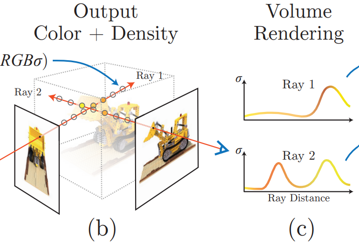
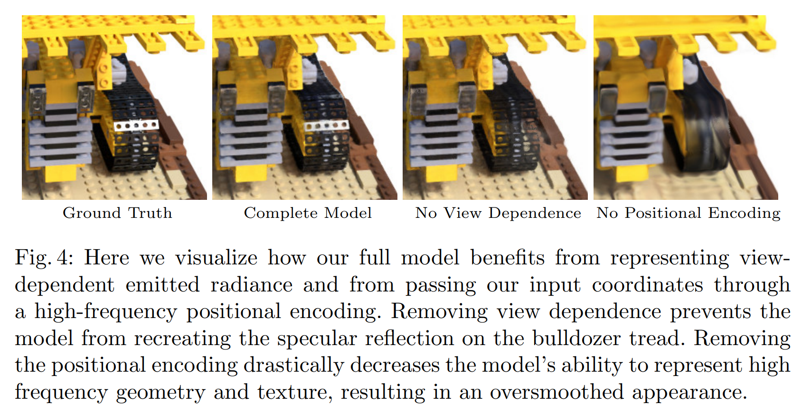
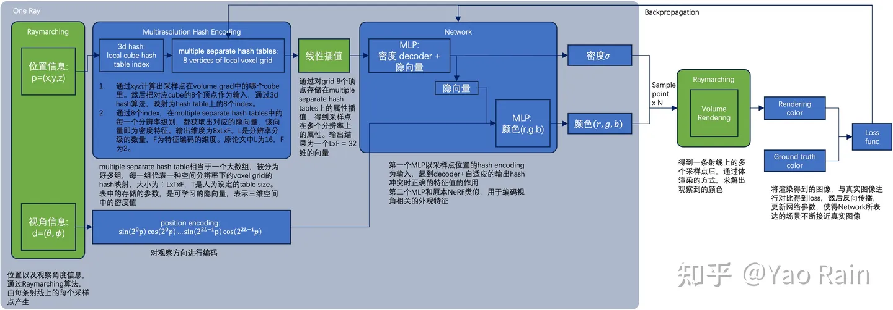

# NeRF

> Representing Scenes as Neural Radiance Fields for View Synthesis

> > [论文链接](https://arxiv.org/abs/2003.08934)

## Motivation

要真正理解工作究竟干了什么，逻辑上，要先了解一个3D物体模型摆在那里，是如何成像到屏幕上的。传统CG上，是真实物体用frustum框住，经过透视投影到2D，然后通过光栅化赋予像素颜色，通过Shading打上光，通过纹理赋予其他属性，等等。但是这种方法高度不可参数化，而且工作量复杂，因为需要获取texture，geometry等信息。有什么好的方法去 represent a ***static*** scene呢？论文中提出了一种***continuous 5D function***来进行表示，并配合了***Volume Rendering***进行2D成像。那么有了如此高度化参数化的表达形式，我们可不可以用来干一些创新的操作呢？神经网络就很喜欢参数，并且喜欢拟合函数进行“猜测”。因此，作者用神经网络强大 的“猜测”能力，解决了一个实际应用问题： ***synthesizing novel views of complex scenes***。

## Technical Contribution

- An approach for representing continuous scenes ***with complex geometry and materials as 5D neural radiance fields***, parameterized as basic ***MLP*** networks.
- A ***hierarchical sampling strategy*** to allocate the MLP’s capacity ***towards space with visible scene content.*** （这一点后面会说）
- A ***positional encoding*** to map each input 5D coordinate into a higher dimensional space, which enables us to successfully optimize neural radiance fields to represent high-frequency scene content.（之后也会说）

## 5D & Volume Rendering

以下的内容，还***没涉及***到down-streaming task相关的内容。在task-specific application的时候，逻辑会和下面介绍的略有不同。

### Detailed Definition of 5D Function

在定义函数之前，先说明一些背景。假设一个物体在**原点**，然后距离半径为R的半球里面，分布了很多的camera，面向这个物体，能够拍摄照片，i.e.，能够发出大量的光线。光线拥有单位方向向量，用笛卡尔坐标系下的标准球坐标系进行表示，因此只需要两个参数：$\theta$  $\phi$进行表示。

那么可以来看这个5D函数到底干什么了：输入的是***一个点的坐标***$\textbf{x}（x, y, z）$，以及一个经过***该点的光线***的单位方向向量的笛卡尔单位球的***角度表示***($\theta$,  $\phi$)，输出的是这个输入下该点的***RGB值***$\textbf{c} = (r,g,b)$和***密度***(density)$\sigma$。这一句话里面最难理解的是密度$\sigma$了，它代表该点的对光的阻挡效果，密度越高，光越透不过去，反之则光很容易透过去。这很容易理解，阳光下举起一片薄树叶，依然能够看到树叶后的部分景色；而如果举起一块鹅卵石，根本看不见。另外，为什么RGB值还需要输出，一个点的RGB直觉中不应该一样吗？但是其实细想发现不是如此。一个物体在不同视角下，因为光线的不同，颜色是会发生略微的变化的，即使是这个物体上的同一个点。

这便是Technical Contribution第一点。

### Volume Rendering

那么我们现在可以高度参数化一个模型了：在一个视角下，即在一堆散发出来的光线下，会经过现实模型中的一系列点，然后都能通过函数知道在这条（些）光线的视角下，它们各自的density与RGB是多少。那么如何成像呢？我总不能再走一遍Graphics Pipeline了，要利用上这些参数。因此，这里沿用了传统的体渲染技术：use ***classical volume rendering technique***s to accumulate those colors and densities into a 2D image（论文原文）。在这条光线上，***假设***我知道经过了哪些点，那么这些点的xyz坐标和光线的density和RGB我都知道。这条光线将会代表的颜色是什么呢？体渲染公式如下：
$$
C(r) = \int_{t_n}^{t_f} T(t) \cdot \sigma(r(t)) \cdot c(r(t)) \, dt
,\ where:
\\

T(t) = \exp\left(-\int_{t_n}^{t} \sigma(r(s)) \, ds \right)
$$
其中：

- $C(r) $是光线 $r $的最终颜色，有红绿蓝三个颜色的分量。
- $t_n $和$ t_f $分别是光线的近裁剪面和远裁剪面的参数。
- $T(t) $是从起点到当前点t的透明度积累（通常为 $T(t) = \exp\left(-\int_{t_n}^{t} \sigma(r(s)) \, ds \right)$）。
- $\sigma(r(t))$ 是点 $r(t)$处的体积密度。
- $c(r(t))$是点 $r(t)$处的颜色。

那么这样一个光线最后呈现的颜色知道了，一个摄像头就是知道了不同方向的光线的颜色，也就知道了最后如何像素上面填颜色了。

## Training and Inferencing for Task

### Pipeline

那么接下来将会详细讲解网络的pipeline。首先输入进网络的是一个视角下拍摄的照片，以及摄像机的位置和方向。网络一共有两个：粗网络和细网络。粗网络上：首先，一条光线上，会通过粗采样在近点和远点之间***选出一堆空间中的（不是物体上的！）点***（没错，原本物体的3D信息是不知道的），输入进5D函数（这个函数使用一堆全连接层去拟合的）（一开始不知道，任意初始化的），***“得到”***（“得到”这一块的网络也会细讲）这些点的density and RGB，然后；然后对于相机来说，用这些密度和颜色信息进行体渲染，得到一张图片，pixel-wise地和ground truth图片进行颜色上的比较，计算出***MSE Loss***并反向传播更新梯度。拿到了粗网络提供的点的密度信息，更新采样策略，进行细采样，得到新的一堆采样点，和粗采样出来的点集进行和并，再一次一起输入进5D函数，***“得到”***了一堆的颜色和密度信息，进行体渲染，得到图片并计算***MSE Loss***，最后用粗网络的loss和细网络自己刚刚算出来的loss相加，用这个***合并后的Loss***去反向传播。

Loss公式：$L = \sum_{r \in R} \left( \left\| \hat{C}_c(r) - C(r) \right\|_2^2 + \left\| \hat{C}_f(r) - C(r) \right\|_2^2 \right)$

下图很好地展示了上述的流程：

当然，上述还不够细节，网络流程如下图（图来自原论文）。上图中红箭头后面的流程，就如上述所说；而红箭头之前的部分，就是在尝试拟合5D函数，但是仍有几个细节需要补充。

### Multi-view Consistent Representation

> We encourage the representation to be multiview consistent by restricting the network to predict the volume density σ as a function of only the location x, while allowing the RGB color c to be predicted as a function of both location and viewing direction. (from NeRF)

第一点：为什么红箭头后面先单独出密度，输出它之后才再结合光线方向信息，经过MLP得到颜色值呢？因为直觉上：不同角度观察下的同一个点，虽然说它的颜色是不同的，但是density应该是相同的！因此，直到输出density之前，网络中不能知道方向信息的存在。

谁先输入，谁先输出，谁后输入，谁后输出，[下图](https://blog.csdn.net/qq_45752541/article/details/130072505)演示的很清楚：

### Positional Encoding

> This is consistent with recent work by Rahaman et al. , which shows that deep networks are biased towards learning lower frequency function. (from NeRF)

第二点：$\gamma$是什么玩意儿？其实这代表Positional Encoding坐标和方向向量之后结果。为什么要位置编码？因为实际中，点之间的距离变化较短，但是蕴含的信息的变化可能“较快”，即，sampling频率不够，容易造成输出图像颜色和密度变化较为平缓的现象。Positional Encoding公式如下：
$$
\gamma(x) = \left[ \sin(2^0 \pi x), \cos(2^0 \pi x), \ldots, \sin(2^{L-1} \pi x), \cos(2^{L-1} \pi x) \right] \\
where\ \gamma is\ a\ mapping\ from\ R\ into\ R^{2L}
$$
这样通过双射将低频的信息投射到高频的信息，让它能够感知高频的变化，从而增加鲁棒性。这在transformer中也有应用。在本篇工作中，xyz信息和view信息都进行了位置编码。

这便是technical contribution第二点。

### Hierarchical Volume Sampling

> Our rendering strategy of densely evaluating the neural radiance field network at N query points along each camera ray is inefficient: free space and occluded regions that do not contribute to the rendered image are still sampled repeatedly. (from NeRF)

为什么要设计Coarse and Fine Sampling（粗采样和细采样）？原因在上面这段论文中的原话已经说的很清楚了。均匀采样这种coarse的采样很容易把注意力分塞在那些density巨低的地方。因此在粗采样后大概知道那一片部分分布的点多之后，需要一种机制在有点的地方多采样。就如下一张图所示：检测到的密度值随距离变化的函数，发现有很多地方由于没有点，而密度非常非常低，那么均匀采样就显得不是那么合适了。

$$
t_i \sim \mathcal{U} \left( t_n + \frac{i - 1}{N} (t_f - t_n), \; t_n + \frac{i}{N} (t_f - t_n) \right)  \\
\hat{C}(r) = \sum_{i=1}^{N} T_i \left(1 - \exp(-\sigma_i \delta_i)\right) c_i,\ where\ T_i = \exp\left(-\sum_{j=1}^{i-1} \sigma_j \delta_j\right)
$$
上面的两个公式：第一行表示在范围 $[tn,tf]$区间中均匀采样，第二行表示根据密度信息细采样。

这便是technical contribution第三点。

### Concatenation

为什么xyz坐标信息经过位置编码之后变成了256的高维信息之后，仍然需要和原来的位置编码concate呢？原论文中没细说，但是通常认为这种方法有助于提高网络对细节的捕捉能力，因为网络能够接收到更多的频率成分，这对于表示复杂的场景和细节非常重要。

## Conclusion

5D函数表示，位置编码，继承式采样（细采样）非常work。下图展示了：如果没有视角信息（5D缺失方向角度的2D）、没有位置编码的效果是较差的。直观看出：没有视角信息，很难产生高光（specularity）效果；没有位置编码，模型不robust，inference结果pixel之间的颜色变化很保守。

于是乎地，一篇伟大的工作诞生了：

# Instant NGP

> Neural graphics primitives, parameterized by fully connected neural networks, can be costly to train and evaluate

Instant-NPG和NeRF有很多的相似之处，但是NeRF原来的MLP网络训练时间很长。为了能高质量重建场景，往往需要一个比较大的网络，每个采样点过一遍网络就会耗费大量时间。因此论文中提出了使用grid来解决，即voxel。把整个空间用一个个的立方体，每一个顶点都对应一个高维特征，那么对于任何一个点，找到包围它的八个定点，利用它们的xyz坐标用一种***数据结构引索***出八个高维特征，然后通过Interpolation就可以实现点的高维特征的表达了。

那么什么数据结构能够通过点的坐标信息引索值呢？哈希表应运而生。将xyz坐标通过哈希函数映射到整数，然后在数组里面引索出高维特征，就可以了。而立方体的大小如果是固定的话，那么就不够robust，因此需要不同分辨率下的立方体划分。来多重表达这个高维向量。论文中，一共有8种分辨率，然后最后会对八个属性结果再一次进行插值。

在论文中，数组的容量有限，因此可能会产生哈希冲突，即不同的立方体顶点索引到的高维向量可能是一样的。但是论文中认为，这并不是问题，因为有八个分辨率的结果，足以克服这种小扰动。

因此Instant NGP的pipeline[如上](https://zhuanlan.zhihu.com/p/631284285)，和NeRF非常相似。对于一个点，在一个分辨率下，找到立方体的八个顶点，这八个顶点xyz坐标各自经过哈希函数得到引索，从哈希表中以$O(1)$的时间复杂度得到各自的高维特征向量，然后进行插值，这个操作重复八次（因为有八个分辨率）。得到了八个高维向量之后，再次插值得到向量，输入MLP（这里使用的不是NeRF的MLP，而是很小的MLP，因为输入向量的参数数量不多）；而之后的一切和NeRF非常相似。

关于$point\rightarrow vector_{input}$的生动化过程如下（来自原论文；用2D的演示图来演示3D中的实际操作）

