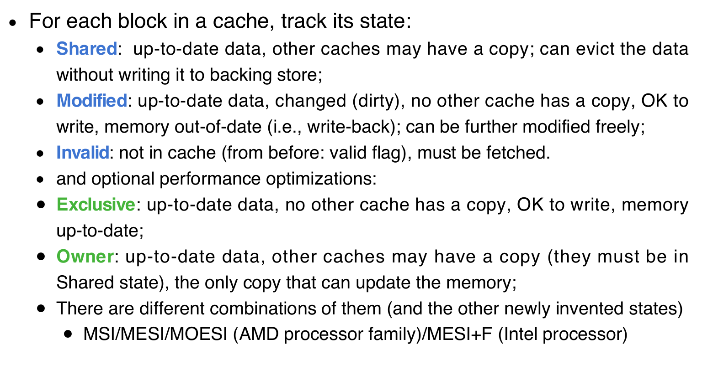
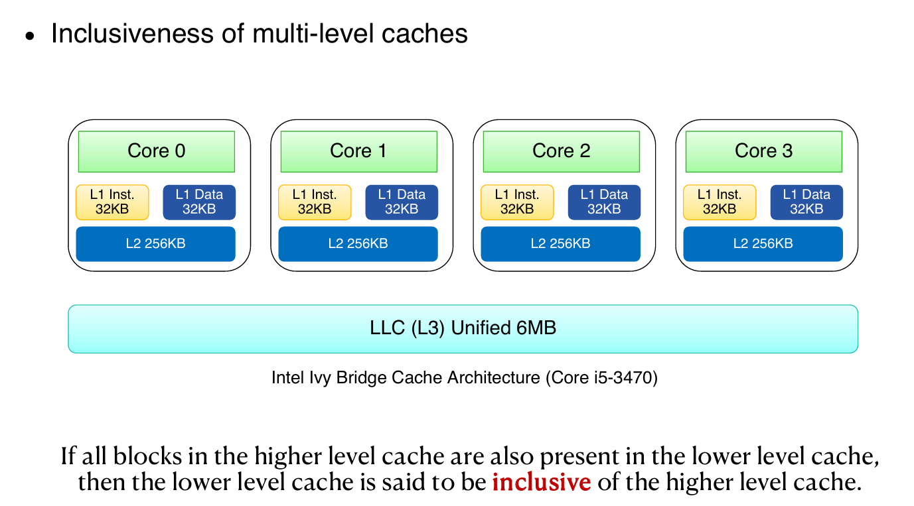
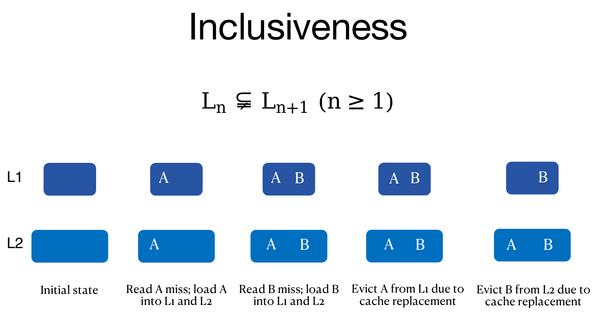
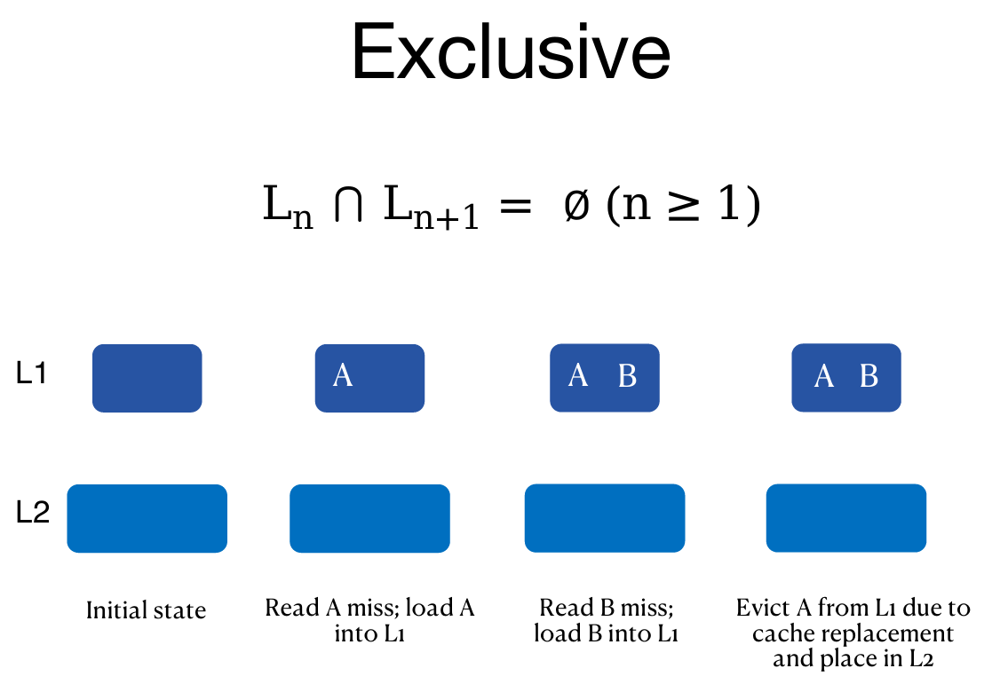
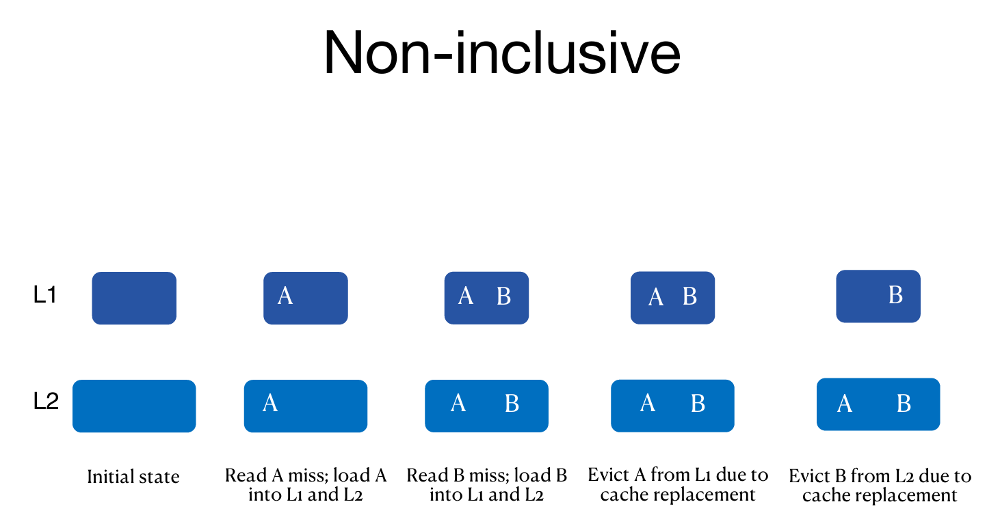

# Advanced Cache

## Processors with Shared Memory

A multiprocessor with shared-memory offers multiple cores / processors a single, shared, coherent memory. Should be called ***shared-address*** multiprocessor, because all  processors share single physical address space.

光看一个处理器，对于它来说，内存访问依然是性能的瓶颈。因此对于每一个处理器来说，最好，现实中也是，有自己的private cache来减少对于内存的demand次数。对于每一个处理器本身来说，只有它们的private cache miss了之后，才会access shared common memory。

考虑这样的一个情况：处理器1访问地址A，cache1中存了地址A的值；处理器2也访问了地址A，cache2中也存了地址A的值。这两个cache中的值是一样的。但是如果再之后，处理器1在地址A写入了一个新值，且因为write through，cache中存的也是新值。这样就发生了cache incoherence。

## Cache Coherence

New cache miss type: coherence  miss (a.k.a. communication miss),  caused by writes to shared data  made by other processors.

在上述发生的情况，加入再之后处理器2访问地址A，那么将不会访问内存中的地址A的新值，而是直接看cache2中的旧值了。这就不妙了。

那么什么是一致，coherent? 任何一次读取操作都必须返回该数据项最近写入的值。多个处理器共享内存，各自拥有本地缓存，如果不加控制，就会出现缓存中的数据**彼此不一致**的情况。解决思路是什么？当某个处理器发生**缓存未命中（miss）或进行写操作**时，要通过**总线（Bus）通知其他处理器**。通知的逻辑：

- 如果是“读取”操作（read）：多个处理器可以同时拥有相同副本（不会有冲突）。
- 如果是“写入”操作（write）：必须让其他缓存中的副本**失效（invalidate）**，确保一致性。

缓存一致性协议（Cache Coherence Protocol）：每个缓存控制器都会“监听（snoop）”总线上发生的写操作，总线是**广播媒介**（broadcast medium），所有处理器都能看到总线上的消息。

总结的工作流程如下：某处理器写数据 → 发出写请求到总线。其他缓存控制器监听到这个写请求。如果某控制器发现自己也有这块缓存数据的副本：**立即让它失效（invalidate）**，以防使用旧数据。更详细的来说，这种解决方式叫做：Snoopy Protocols

## Snoopy Cache

核心思想：缓存要“观察”（snoop）总线上其它处理器的内存事务；监听后要“做出正确的反应”（do the right thing）：比如：监听到写操作，就使自己缓存的对应块失效。Snoopy Cache 是双端口的（dual-ported）：一个端口用于处理器正常读写，一个端口用于监听总线事务。

一般来说，在L2 cache上进行优化比较好。因为L1比较小，而L2比较大。而且它们都在chip上。Furthermore，在L1的数据必定在L2中也有。因此如果L2中的缓冲块被失效了，那么要确保L1中的也失效。更重要的是，在传输信息的bandwidth角度上，L1的位宽十分珍贵，让L2来允出位宽来监听总线是很合理的。

还有一个重要的点：缓存一致性协议是**以缓存块（block）为单位追踪的**，而不是变量。一个缓存块中可能包含多个变量（如 D0, D1），那么假如core0写D0，core1写D1，而且core 0 and 1的一个cache block上面都有D0 and D1，那么它们都会invalidate两次。明明没共享的数据，却频繁失效，这就是“False Sharing”。

解决建议：从硬件角度，缓存块比较小；从软件开发角度，**应把频繁访问的变量之间保持足够距离**（至少一个缓存块大小以上）：比如使用 padding 或 struct 对齐等技术。

### Write Invalidate

1. 处理器 k 想写某个地址时：
   - 抢占总线的使用权；
   - 发送一个 **写失效（write invalidate）** 消息。
2. 其他处理器监听到此消息后：
   - 失效（invalidate）自己缓存中对应的缓存行（cache line）副本。
3. 处理器 k 在自己的缓存中写入数据（假设写通内存）。
4. 其他处理器在之后访问这个地址时：
   - 由于缓存行失效，会出现缓存未命中（cache miss）；
   - 重新从内存加载最新数据。

优点：

- **节省宝贵的带宽**，避免频繁广播写数据。
- 这是目前普遍采用的**首选写策略**。

### Optimized Snoop with WAW

使用**有效位（valid bit）**卸载缓存行，减少无效缓存。

对于写回缓存（write-back cache），每个缓存行有一个**脏位（dirty bit）**：

- 脏位表示：当前缓存行只被一个处理器使用；
- 当处理器 0 第二次写该缓存行时，不需要再广播消息，减少总线负担。

### Write Update

CPU 想写时，抢占总线，**广播新的数据**（而不是失效消息）；所有监听缓存的处理器都**更新自己缓存中的数据副本**。

### Implementation Issue

1. 如何知道缓存值是否被共享？

- 如果知道缓存值没有被其他缓存复制（即不共享），可以避免发送无用的消息，减少总线带宽占用。
- 但如果结合“写回（write-back）”策略使用：
  - 其他处理器可能重新获取的是**旧值**，因为写回意味着数据只写回主存时才更新。

2. 需要协议来处理这个问题

- 缓存一致性协议必须解决缓存行的迁移和复制问题，确保数据的一致视图。

3. 缓存行具有状态

- 每个缓存行在缓存中会有一个状态，表明其当前数据是共享的、独占的、修改的还是无效的等。

一下是MOESI协议的例子：

## Advanced Cache

### Example

图中展示了Intel Ivy Bridge架构：

- 每个核心有独立的L1指令缓存（32KB）和L1数据缓存（32KB）；
- 共有的L2缓存（256KB）；
- 以及统一的三级缓存（LLC，6MB）。

### Cache Relationships

### Sneaky LRU

在包容性(inclusive)缓存中（LLC 包含 L1 中所有块），LRU策略会存在“悄悄的”副作用。

过程说明

1. A块频繁在L1中被命中，成为L1中最近使用（MRU）块。
2. 但在LLC中，A块却是最近最少使用（LRU）块。
3. 由于LLC中的LRU块会被驱逐，A块可能被错误地驱逐。
4. 这样，MRU块反而被剔除，造成性能损失。

###  Last-Level Cache (LLC) is not Monolithic

传统观点认为LLC对所有核心是统一整体，任何核心访问缓存块成本相同。

新观点（Intel Xeon E5-2667 v3）:

- LLC被划分为多个切片（slice），比如8个slice。
- 每个切片分布在不同物理位置，访问延迟和带宽可能不同。

基于切片的内存管理（Slice-aware Memory Management）:

理念

- 将数据尽量放置到接近程序运行核心（core）的内存切片中，减少访问延迟。

实践难点

- 缓存管理复杂，尤其是对细粒度切片的管理。
- 缺乏详细文档，研究难度大。

研究成果

- 研究团队通过优化切片感知管理，提升了键值存储GET操作的平均性能12.2%。
- 这个提升在大规模应用（如Google、淘宝、腾讯、京东等）中非常显著。

总结

| 主题                | 关键点                                     |
| ------------------- | ------------------------------------------ |
| 包容性缓存的LRU问题 | LLC中的LRU可能误驱逐L1中频繁使用的数据     |
| LLC非单片设计       | LLC由多个物理切片组成，访问延迟不均等      |
| 切片感知内存管理    | 数据放置更靠近核心，但管理复杂，需研究支持 |