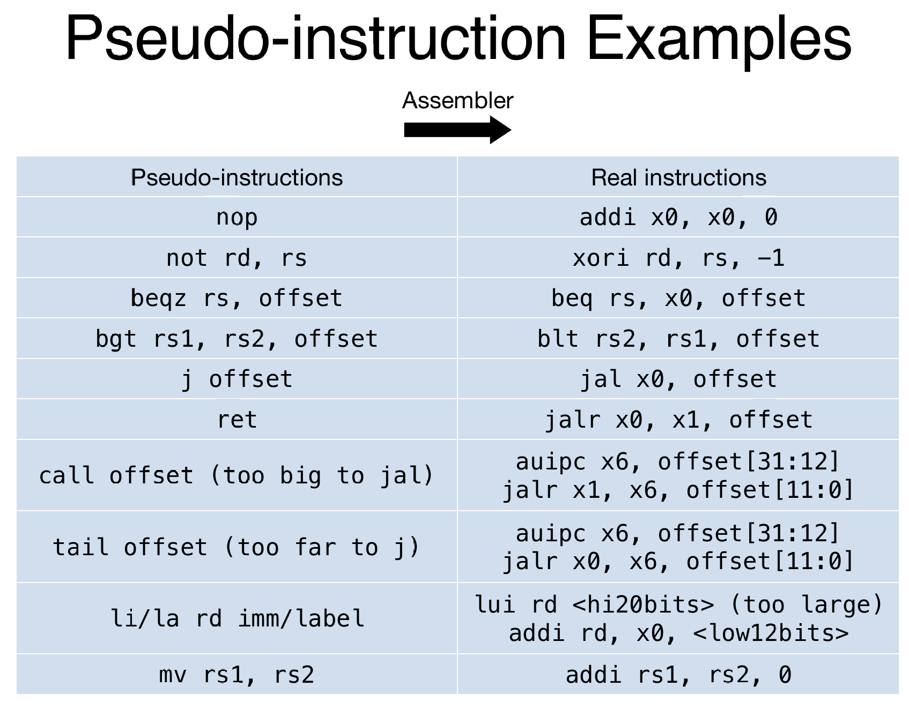
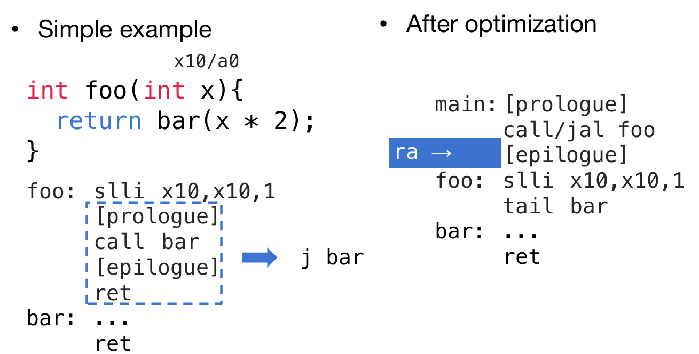
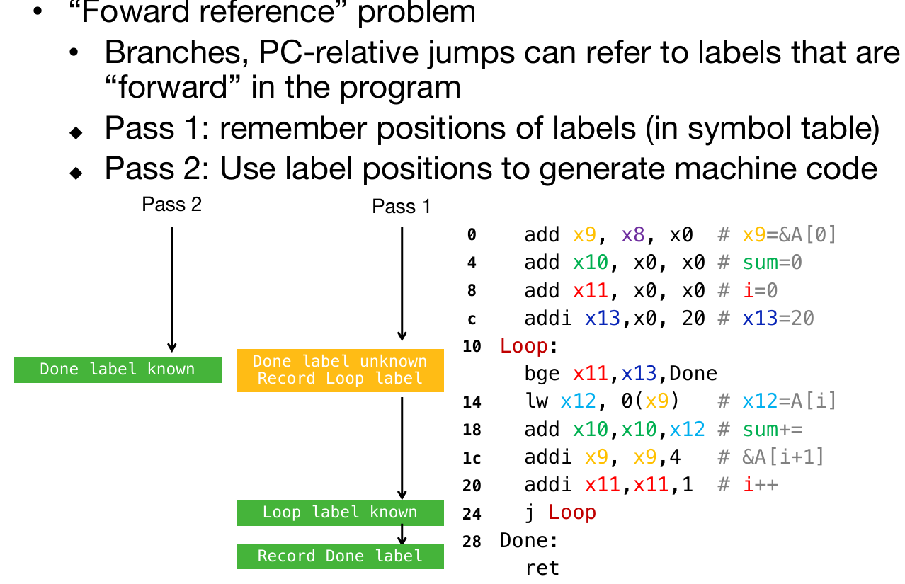
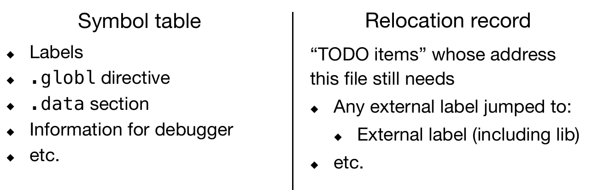
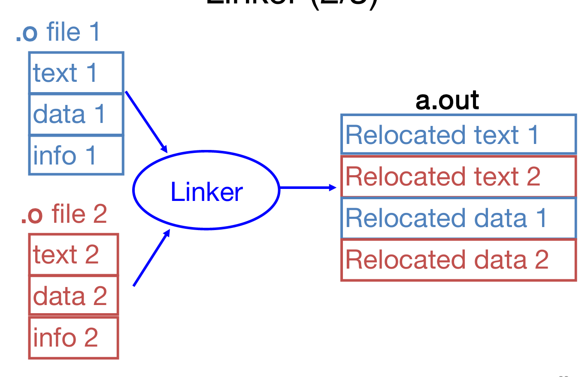
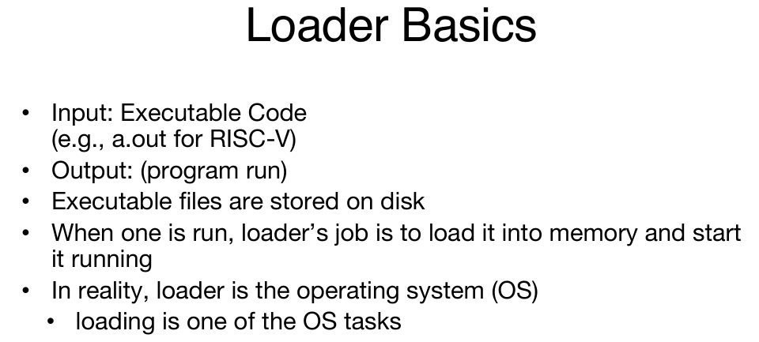
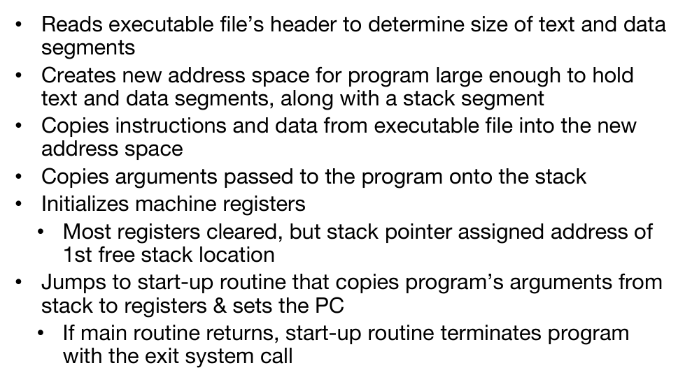
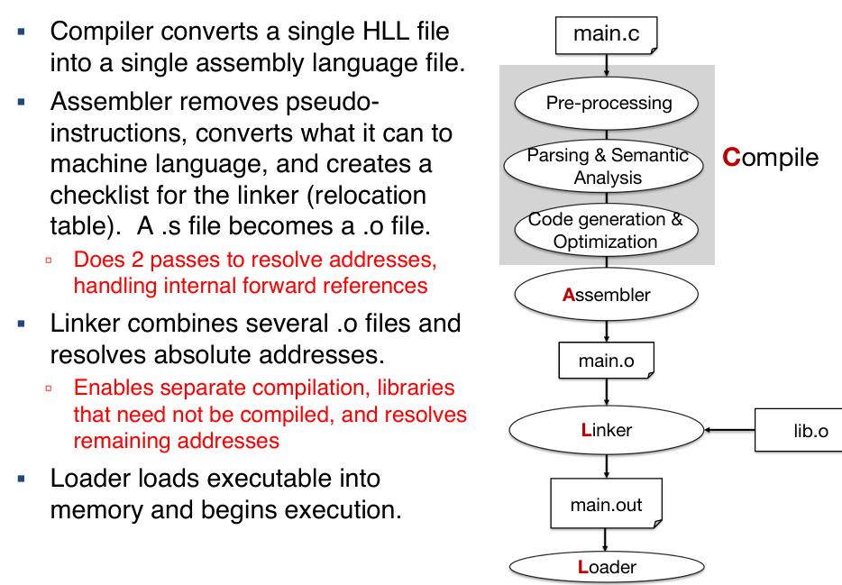

# CALL

call其实是compiler, assembler, linker & loader四个单词的首字母。在RISC-V中，详细介绍了代码转化为汇编语言后，是如何转化为机器码的，以及汇编语言是如何运转的，包括寄存器这个特殊的存在，以及通过地址跳转实现函数调用等。

## Assembler

编译器的输入是语言代码（language code, generated by compiler, usually contains peuso-instructions），那么最终的输出就是object code，包含以下的信息：

**目标文件头（Object file header）**：包含目标文件中各个部分的大小和位置。

**代码段（Text segment）**：包含机器代码。

**数据段（Data segment）**：包含静态数据。

**符号表（Symbol table）**：列出程序中使用的标签和符号，供其他程序引用。

**重定位表（Relocation table）**：列出需要在链接时（通过 **链接器**，linker）修正的代码部分。

**调试信息（Debugging info）**：包含程序调试所需的信息。

在这个过程中，编译器会读入和使用指令（directives），然后替换掉伪指令，产生机器看得懂的语言，产生目标文件（object file）。下面将详细介绍这方面的内容。

### Directives

Directives，指令，是汇编器Compiler给Assembler的指令，但是这并不会直接产生机器指令。比如说：

- .text: Subsequent items put in user text segment  (instructions) 这条指令告诉汇编器，接下来所有的内容将被放入 **文本段（text segment）**，也就是存放 **程序指令（机器指令）** 的地方。该部分会包含实际的代码，通常是用来执行操作的指令。

- .data: Subsequent items put in user data segment (binary  rep of data in source file) 这条指令告诉汇编器，接下来的内容将被放入 **数据段（data segment）**，也就是存放 **数据** 的地方。在这个段中存储的是程序中使用到的静态数据（例如：常量、全局变量等）。

- .globl sym: declares sym global and can be referenced  from other files 这条指令用于声明一个符号（变量或标签）为 **全局的**，这意味着该符号不仅能在当前文件中访问，也能在其他文件中被引用。如果其他程序或文件需要访问这个符号，就可以使用该指令声明。

- .asciiz str: Store the string str in memory and null terminate it 该指令将一个 **字符串（str）** 存储到内存中，并在字符串末尾添加 **空字符（null character）** 来结束字符串。这样可以在汇编代码中存储文本数据。

- .word w1,...,wn: Store the n 32-bit quantities in  successive memory words 这个指令会将多个 **32位字（32-bit words）** 存储到内存中。比如说，`w1, w2, ..., wn` 就是你要存储的一组数字。每个数字会按 32 位（即 4 字节）进行存储。

- .align [int]: align to power of 2该指令用于指定对齐要求，即将数据按 **2 的幂（power of 2）** 来对齐存储。例如，如果指定 `.align 4`，那么数据会按 4 字节对齐（通常是 32 位对齐）。数据对齐是为了提高内存访问的效率和兼容性。

- .option: specify options such as arch, rvc这条指令用于指定一些汇编器的选项，比如 **架构（arch）** 和 **RVC（compressed instructions）** 等。这些选项通常用来控制汇编器如何处理目标代码，或者如何生成特定平台或处理器架构的代码。

### Replace Pesudo-Instruction

其实这就是按照下标进行伪指令的转化：



其中值得注意的是tail call命令，是一种特殊的函数调用方式，其目的是优化函数调用的性能，避免不必要的栈帧切换。

````assembly
auipc x6, offset[32:12]
jalr x0, x6, offset[11:0]
````

这里的 `auipc` 指令用于将目标地址的高 20 位加载到寄存器 `x6` 中，而 `jalr` 指令则用于跳转到目标地址的低 12 位偏移量。通过这种方式，`tail call` 可以实现远距离的跳转，而无需像普通函数调用那样保存返回地址



### Produce Machine Code

对于一些较为简单的case，比如说logic and arithmetic operations，那么在compiler给到assembler的时候，就能转化为机器码；但是有些PC-related branches and jumps，比如说跳转到后面的label，甚至是其他文件中的label，那么就需要额外的操作了。因此，转化为机器码需要two-pass。



展开来说，在机器码第一次翻译的过程中，有些情况是需要等到second pass的：function call(multiple files, library, etc)，static data(global)， assembler会把这些不清楚的内容记录到symbol table and relocation record；而Linker就是来处理这些的。



## Linker

1. 输入object code files，information table，输出executable code。所做的是将.o文件进行连接，最终组装成一个执行文件
2. 拿到.o文件，然后将每一个文件中的text data info zone进行拼接，如下图：



3.  如下：

   • Step 1: Take text segment from each .o file and put them  together; Take data segment from each .o file, put them together,  and concatenate this onto end of text segments 

   • Step 2: Determine the addresses of data and instruction labels 

   • Step 3: Resolve references 

   ​	• Go through relocation records; handle each entry

   ​	• That is, fill in all absolute addresses

可见在assembly过程中，有三种地址：PC-Related Addressing(beq, bne, jal)，这些地址不需要relocate；而External Function Reference (usually jal)与Static Data Reference (often auipc/lui and addi)，它们的地址都需要relocate（second pass）

Linker知道每一段text and data的长度，以及它们的顺序，因此Linker就会计算每一个label和data的绝对地址；而为了resolve reference，需要搜索reference (data or label) in symbol tables，如果没找到，就找library files（eg, printf, malloc）；而绝对地址一旦找到，那么就会被用于转化为机器码。

> Output of linker: executable file containing text and data (plus  header)

## Caller





## Conclusion


