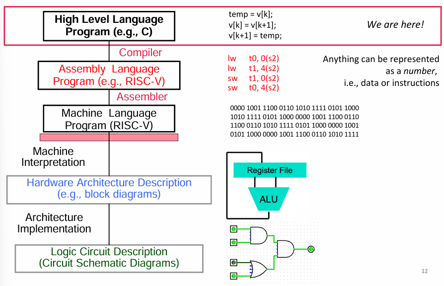
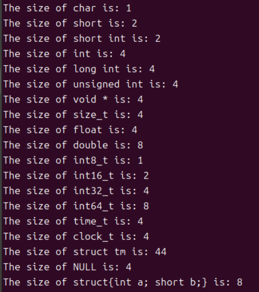
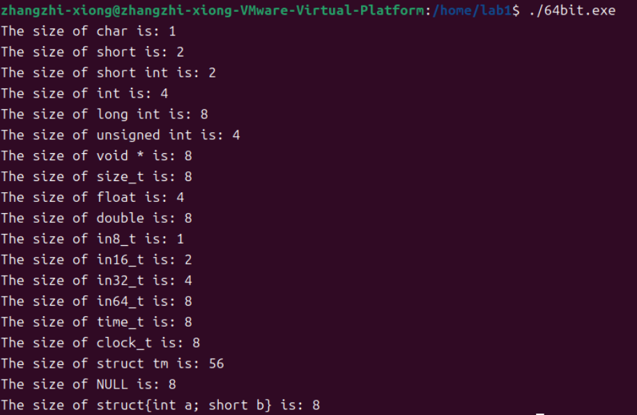
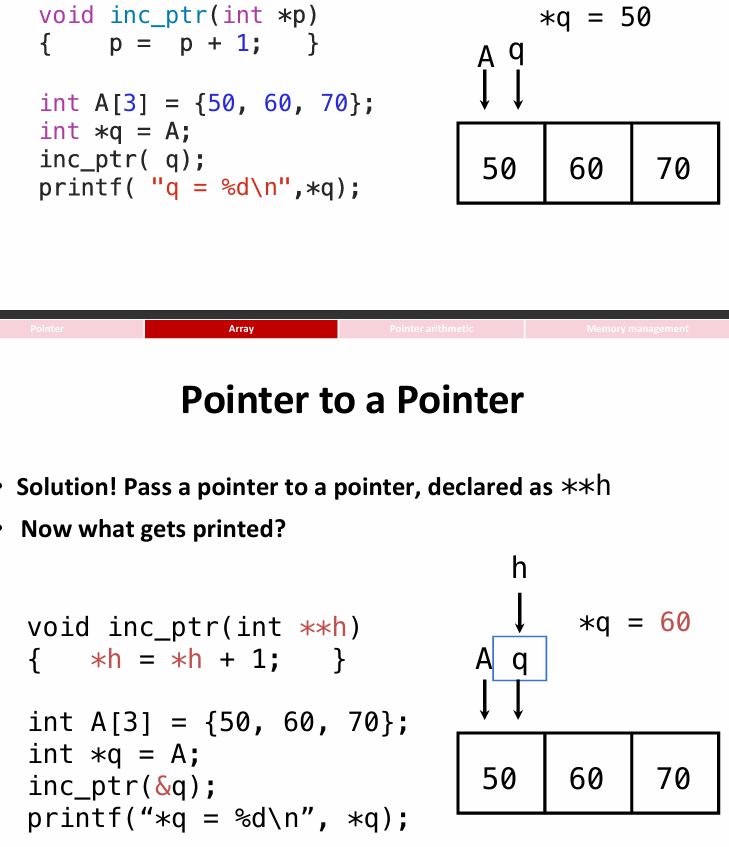
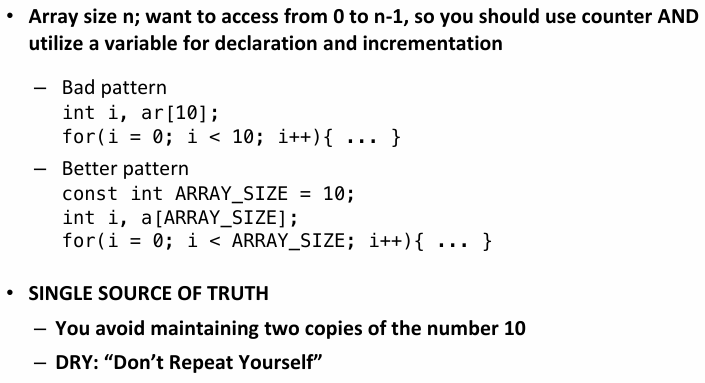
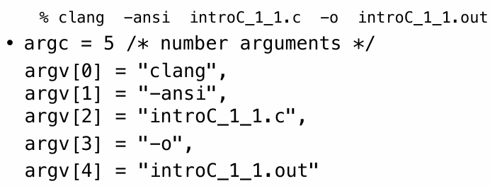

# C_Language

## How C works



一个高级语言的程序首先会经过编译器，然后变成汇编语言，其核心是任何内容都可以用数字进行表达；然后汇编语言将会转化为机器看得懂的二进制语言，输送给机器；机器解读之后，将会转化为硬件结构表述语言，最后由计算机结构执行。

> C compilers map C programs into architecture (OS & ISA)-specific  machine code (strings of 1s and 0s)

C编译器将会把.c文件转化为.o文件，然后将所有的.o文件进行linking，变成可执行文件。更完整的流程如下图：首先.c文件将会被预加工，如宏定义、头文件的引入；然后会进行程序语法解析，生成抽象语法树（AST）；然后AST将会被转化为中间表达，然后生成汇编语言；之后，将汇编语言转化为机器看得懂的二进制语言，然后生成.o文件，最后根据linker将.o文件汇编为一个可执行文件。


需要注意的是：宏定义的预处理就是完完全全原封不动地将程序中的东西替换为另一个东西。如：`\#define MAG(x, y) (sqrt(x*x + y*y))`，那么程序中如果有：`MAG(1+2, 1+2)`，那么实际上执行的是`sqrt(1+2*1+2+1+2*1+2)`；而如果希望是正常的平方和，那么需要修改宏定义：`#define MAG(x, y) (sqrt((x)*(x) + (y)*(y)))`。可见宏定义并不是百分之百可靠的，因为编程者可能会碰到各种各样的corner case，所以应该尽可能避免写宏定义

> 一个很好的传统就是：如果要写宏定义，尽量把括号补上

在构建AST的时候，将会将代码中的每一个单词都视作一个token，并且将会记住所有token的位置；然后组织这些token组件AST树，并且如果发现错误将会报告。

To wrap up:


## C Review

在声明变量的时候提前加上一个const，那么将会确保在程序执行的过程中，这个变量将不会发生改变；任何C语言中的变量类型，在前面都可以加上const。

在C语言中，什么等于FALSE呢？首先是0，一个整数；其次是NULL，这是一种十分特殊的指针。值得注意的是，C里面是没有显性的布尔类型，除非加上`#include <stdbool.h>`；而什么等于TRUE呢？其实，只要是任何不等于FALSE的就是TRUE！

一类特殊的C运算符是位运算符：&是‘与’逻辑，将两个二进制数字每一位进行比较，只有当两位都是1，结果才为1；|是‘或’逻辑；^是‘异或’逻辑，只有两位不同的时候才为1；~是对一个二进制每一位取反；<< >> 分别为左移和右移，注意溢出的时候会直接空位用0填补。

````c
int a = 0b1011; // 二进制表示：11（十进制）
int b = 0b1100; // 二进制表示：12（十进制）
int result = a & b; // 结果为 0b1000，即 8（十进制）

int a = 0b1011; // 二进制表示：11（十进制）
int b = 0b1100; // 二进制表示：12（十进制）
int result = a | b; // 结果为 0b1111，即 15（十进制）

int a = 0b1011; // 二进制表示：11（十进制）
int b = 0b1100; // 二进制表示：12（十进制）
int result = a ^ b; // 结果为 0b0111，即 7（十进制）

int a = 0b1011; // 二进制表示：11（十进制）
int result = ~a; // 结果为 0b0100（假设是4位系统）

int a = 0b0001; // 二进制表示：1（十进制）
int result = a << 2; // 结果为 0b0100，即 4（十进制）

int a = 0b1000; // 二进制表示：8（十进制）
int result = a >> 2; // 结果为 0b0010，即 2（十进制）
````

## Pointer

计算机的内存其实一个巨大的字节矩阵。以32位计算机为例，一块内存矩阵的每一行有四个字节，一个字节8位，所以说一行是32位；每一个小字节都有一个地址。重要的是，地址的范围是0-$(111...111)_2$，其中1一共有32个。


地址是一个指定的内存地址，而Pointer就是一个变量，它储存的是一个地址。***可见，指针的内存大小应该和地址的range高度相关***。在C程序中，比如说函数，那么传递参数其实是值传递；传递完一个参数之后，其实是新建一个变量，然后用传进来的变量进行赋值。因此十分重要的是指针传递。

指针的类型有很多种，一般来说一种指针只能指向一个type；其中void*指针是一种能够指向任何东西的指针，但是需要对它十分的小心。

之前提到指针其实是一个变量，存的是一个地址；那么加入说我声明一个指针，但是却没给他传地址，而是传值呢？那么这就是undefined behavior，甚至有时无法编译。如下图：

````c
 void f(void)
 {
 	int *ptr;
 	*ptr = 5;
 }
````

那么最后，之前提到指针的大小和计算机的range，i.e.，32位还是64位，十分相关，可见下面各种类型的变量的内存大小：





值得探的是：首先，在数据类型上面，唯一的不同是long int的内存大小不同；其次，size_t，NULL and void*内存大小不同，本质上是它们其实都是指针，然后指针的地址范围不同。最后，struct的大小并不是int and short两个大小的和！这其实是因为alignment rule，马上就会提及

## Array

`int arr[2];` `int arr[] = {533, 146}`，通过这样的语句就能够声明一个含有两个整数的数组，并且在内存中留出位置。值得注意的是：必须要声明大小！通过刚刚关于内存的介绍，这一点也能够理解。而C中的字符串其实就是一系列的字符，而非常重要的是：内存上这一传字符的结尾，将会有一个‘\0’占位符。这其实也合理，不然的话内存如何知道什么时候读取字符串结束。

Array/Pointer Duality：数组变量其实是一个指向第一个元素的指针，所以数组变量几乎和指针是相同的，指针运算也是可以用在它身上的。

但是指针和数组又不是完全不一样的，也就是：数组能当指针用，但是指针不能当数组用。如下面的例子：可以用string1[x]修改字符串内容，可以用string2[x]访问字符，但是不能进行修改。

````c
char string1[] = "abc";
char *string2 = "abc";
````

需要注意的是，定义函数中，如果希望对指针指向的地址进行修改，那么应该传入指针的指针。



C语言中一个数组的长度并不知道，而且它的边界并不会被检查！因此需要十分小心，避免越界访问数组。有一些良好的习惯如下：



最后，拓展对main传入命令行参数：`int main(int argc, char *argv[])`对于这样一行的代码，那么argc将会代表命令行字符串的数量，而后面是一个数组的指针，指向这些字符串。



## Pointer Arithmetic

在内存中如何储存不同数据类型的数据？（下面所有情景为32为机器）正如之前所介绍的：不同数据类型，内存占用大小不同，有的是4个字节，有的是1个字节，有的是两个，但是一行只有四个字节！因此可想而知地，内部数据的安放将会有alignment rule。

可以设想，如果一个int数据需要存放，那么如果第一个字节没有顶着放，那么四个字节将会占两行，这非常的memory unfriendly！

可以用sizeof() ***operator***（不是函数！）来获得一种数据类型或者一个变量的内存占用大小.

concise strlen()

````c
int strlen(char *s){
    char *p = s;
    while (*p++){
        ...
    }
    return (p-s-1)
}
````

同时在遍历array的时候，假如说是10个元素的array `int arr[10] = {}`，那么可以创建一个`p = &arr[0];q = &arr[10]`，遍历的条件就是`while(p != q)`。上述的两个例子全都在说一个核心思想：array bounds are not checked, we must check them ourselves!

## Memory Management

