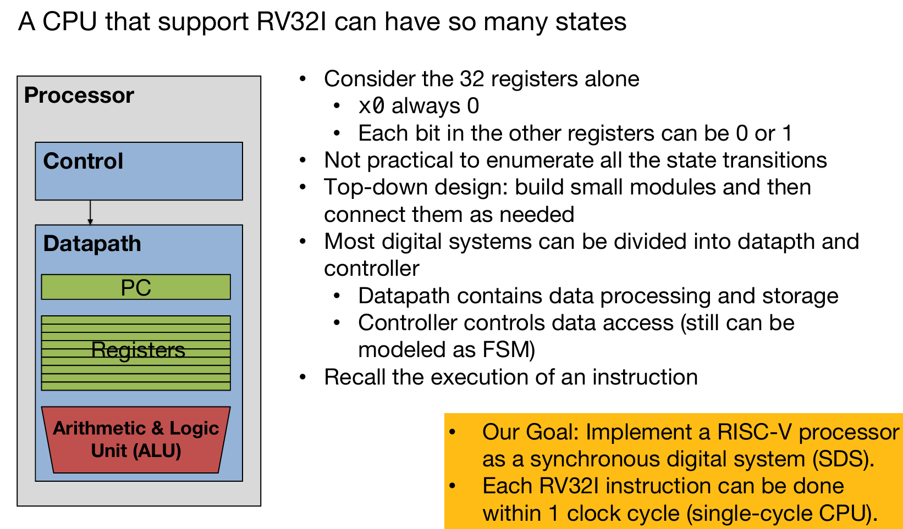
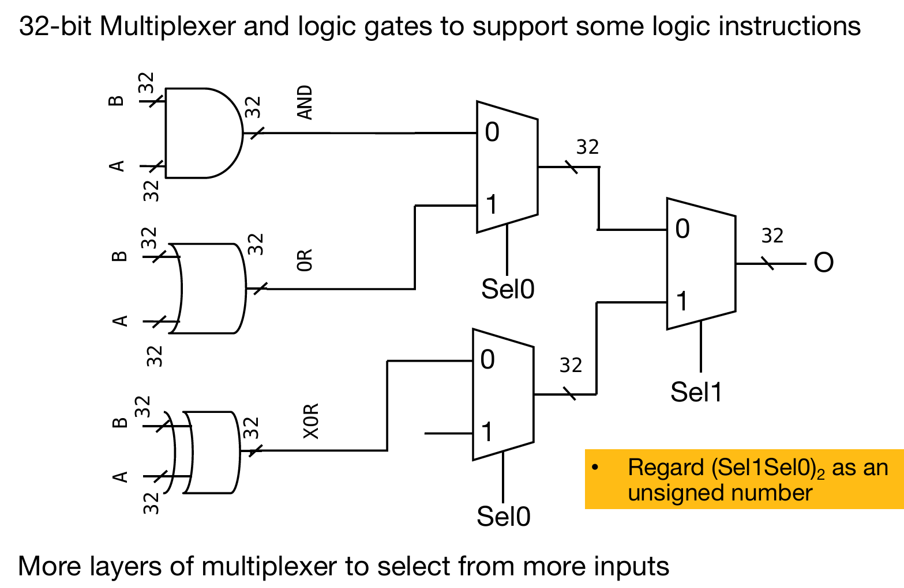
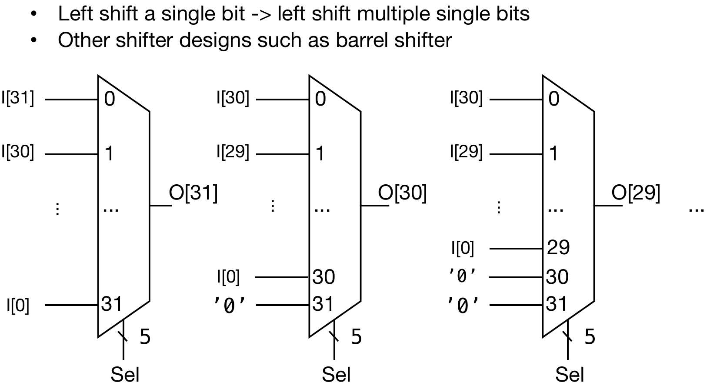
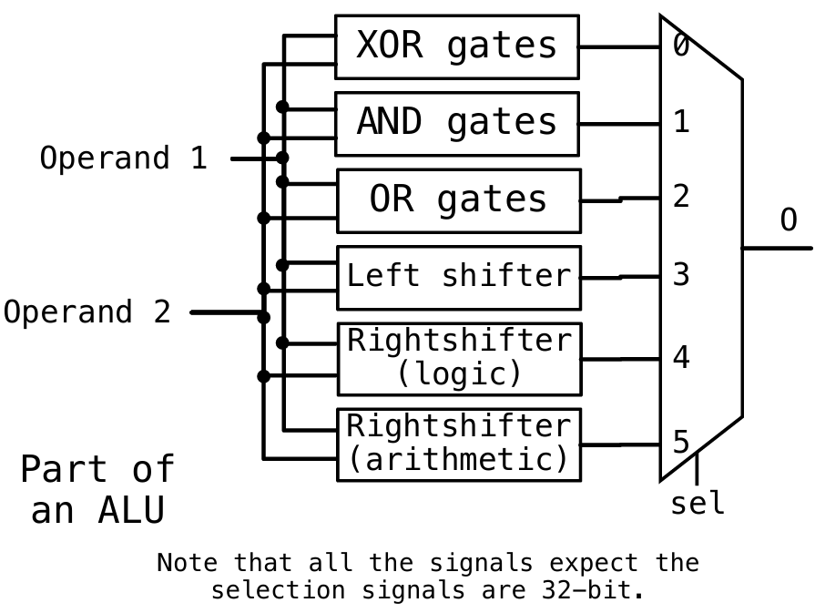
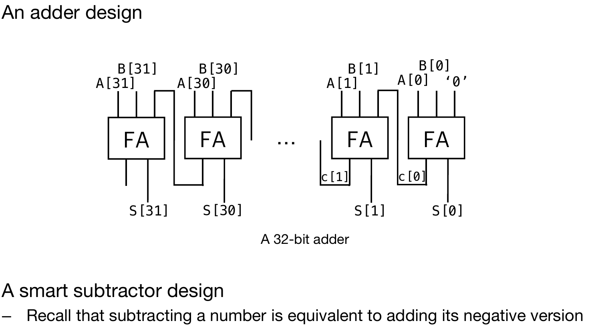
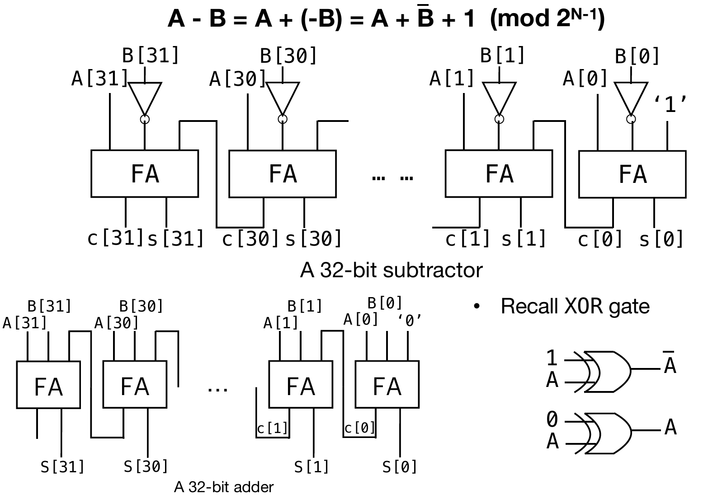
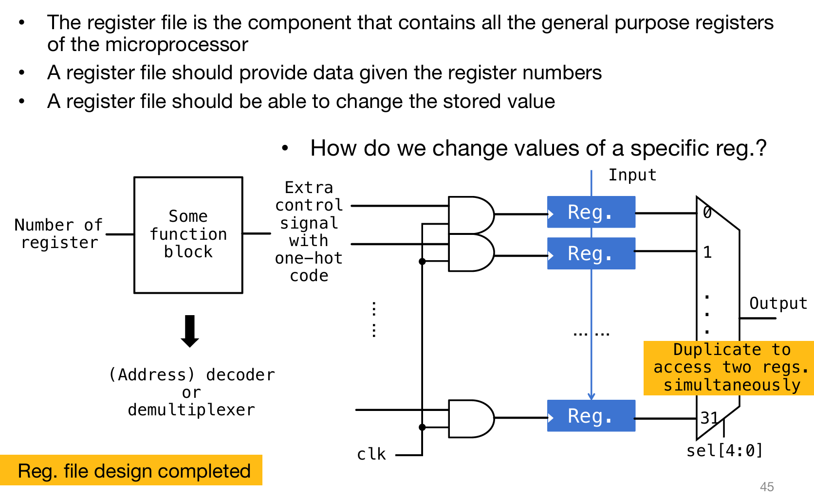
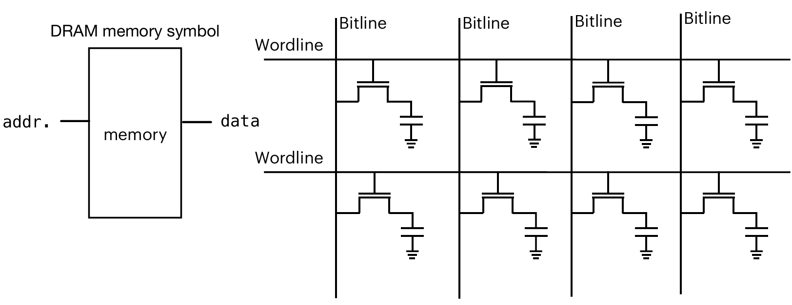
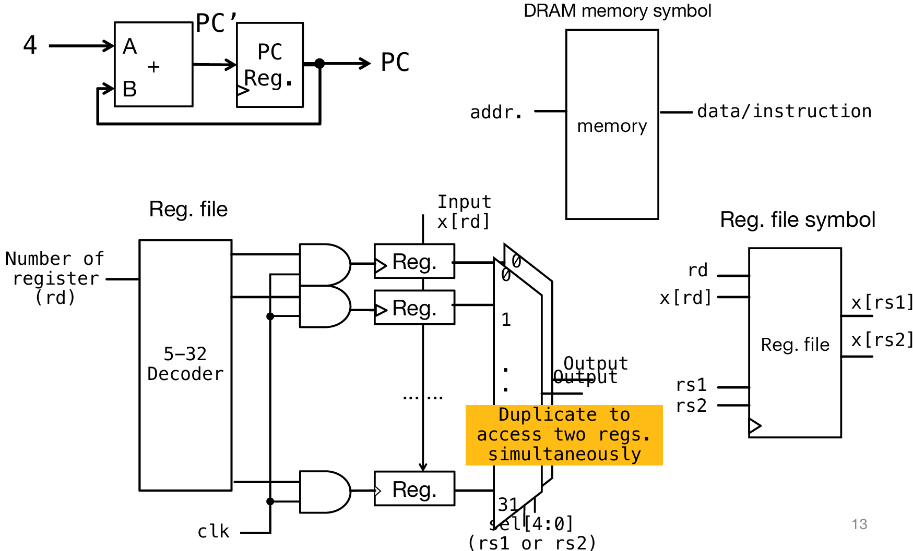

# Datapath and Controller

## Useful Building Blocks-ALU

>  An ALU should be able to execute all the arithmetic and logic operations

比如说加法，一个AND接受两个32位的输入，最终输出一个32位数，这样的组件还有OR XOR等。那么目标就应该是使用这些组件来实现所有的arithmetic instructions in RISC-V，比如说：ADDI, SLTI, SLTIU, XORI, ORI, ANDI.

还有一些其他需要用到的有用的组合电路：比如说Multiplexer，能够根据Sel信号来选择输出的是哪一个输入，这样就能够利用instruction machine code中的arithmetic operation type来output accordingly，也就是利用Multiplexer能够实现logic instructions。

当然Multiplexer可以不是二选一，也可以是n-to-1 type。同时，它也可以用作shifter（部分的指令需要这个功能），如下图：由于每一次值选择一个数字，那么通过输入的排布和sel数字，就能够起到shifter的作用，如下图：output 31位是input 26位，output 30位是input 25位，以此类推。

那么之前提到，Multiplexer可以用作‘知晓处理的命令是哪一个’，因此就可以实现下图的电路，来根据指令的算数类型，输出对应的结果：

而其中更复杂的arithmetic logic circuit则需要更为精细的设计，例如下图的adder：之前提到过，对于每一位的计算上需要接受三个输出：A B，以及上一位的进位；同时也输出两个东西，一个是该位的结果，一个是下一位的进位。因此这FA逻辑其实先前已经推过，那么就可以在这里实现了。

至于减法：$A-B = A+(-B) = A + \overline{B} + 1 (mod\ 2^{N-1})$

## Useful Building Blocks-Reg

对于寄存器中储存的32位数值，毋庸置疑我们肯定是需要Register的。RISC-V中有32个寄存器，因此显然实现它们至少需要32个register。但是如何选择哪些register进行操作呢？比如说，addi x1, x0, 2，我需要拿出x0里面的值然后加上imm存在x1，那么我怎么知道需要选择哪些operating registers？那么就需要Multiplexer了，对于32个reg，sel signal为4位，代表的是哪一个，就选哪一个进行输出。另外，这32个reg显然要接在一个clock上面。

那么又应该如何控制特定的寄存器储存数值呢？解决方案如下图：input流水式会输入给所有的reg，但是clk和特定的control signal过与门，再输给clock portal；如果clk为0，那么全都不存值，这是合理的；如果clk是1，那么只有拥有特定control signal 1的reg的clock portal被激活，进而进行采样。下图的block中的multiplexer可以复制一个出来，也接上32个reg，这样相当于是能够同时拿出两个寄存器的内容，用于后续的操作。

## Useful Building Blocks-Memory

 Memory similar to register file except that the basic cell design is different.

- **addr.**：表示地址输入，用于指定要访问的内存位置。
- **memory**：表示存储单元，存储实际的数据。
- **data**：表示数据输出，从内存中读取的数据通过这里输出。

## DataPath

The useful blocks we've gotten so far:

左上角：我们知道PC运行的Machine Code Address是有一个专门的寄存器储存的，而无特殊的jump情况下，PC自动加4。右上角的组件可以根据地址去memory中获取对应的数据。下面一层展示了如何拿取对应的reg中的值（一般最多只需要取两个reg中的值）。

### Datapath for R-type

