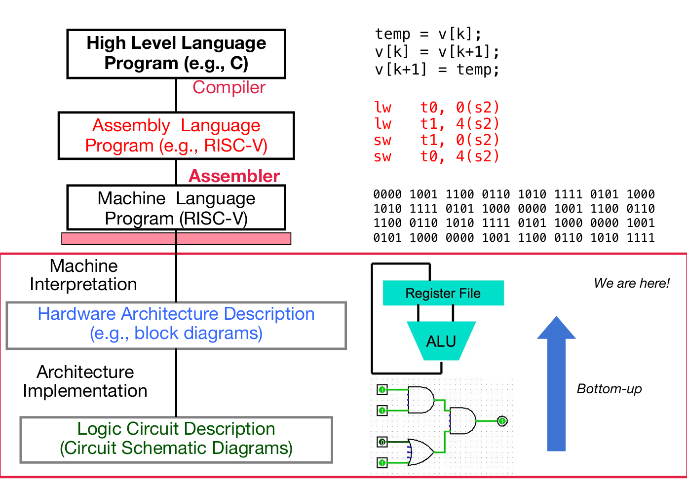

# Digital Circuit

## Digital System

首先要介绍的是两种晶体管：NMOS PMOS。前者是Gate高电压，接通；后者反之。

> NMOS无圈，PMOS有圈；没有圈的是高电压接通

电路根据是否同步分为两种：Combinational logic circuit and State Elements。此处主要介绍的是前者。通过上述两种晶体管，就能建造一些简单的逻辑电路了，比如说与门，如下图所示。

又如下图所示的非门的构建：

常见的logic gates的符号（其实一个gate又是由晶体管组成的）：

那么假如说我拿到了完整的真值表，如何设计布尔逻辑电路呢？转化规则为：如果是最后为1的项，那么相乘（其中为0的单元加上非），这样的一个个项最后相加。

当然，也可以使用卡诺图：卡诺图（Karnaugh Map，简称K-map）是布尔代数中一种用于简化逻辑表达式的图形化工具。它通过将布尔函数的真值表以二维表格的形式表示，帮助我们直观地找到相邻的最小项，从而简化逻辑表达式。以下是卡诺图的使用方法：

1. **确定变量个数和卡诺图的大小**

- 卡诺图的大小取决于布尔函数的变量个数。例如：

  > 一个含有两个变量的一行或一列，有四个元素，因为每一个变量是1或0

  - 2变量的卡诺图是2×2的表格。
  - 3变量的卡诺图是2×4的表格。
  - 4变量的卡诺图是4×4的表格。

- 每个单元格代表一个最小项，其位置由变量的组合决定。

2. **填写卡诺图**

- 根据布尔函数的真值表，将输出值填入卡诺图的对应单元格中。
- 通常，卡诺图的行和列分别表示不同变量的组合，且相邻的单元格之间只有一位变量不同（格雷码排列）。

3. **寻找相邻的1（或0）**

- 在卡诺图中，相邻的单元格（包括水平、垂直、环绕边界）可能包含相同的逻辑值。
- 寻找尽可能大的矩形或正方形区域，这些区域内的单元格全部为1（或0），且矩形的边长必须是2的幂（1、2、4、8等）。
- 每个矩形区域代表一个简化后的乘积项。

4. **提取简化后的乘积项**

- 对于每个矩形区域，观察其中变量的变化情况：
  - 如果某个变量在区域内保持不变（始终为0或始终为1），则该变量出现在乘积项中。
  - 如果某个变量在区域内变化（0和1都有），则该变量不出现在乘积项中。
- 例如，在一个矩形区域内，变量A始终为1，变量B变化，则乘积项为A。

5. **合并所有乘积项**

- 将所有矩形区域对应的乘积项相加（逻辑或运算），得到简化后的布尔表达式。

6. **验证结果**

- 最后，将简化后的布尔表达式与原始表达式进行比较，确保它们在所有输入组合下具有相同的输出。

> Reference: kimi.moonshot.cn

如下例：

这样，就形成了关于组合逻辑的多种表现形式的转化关系：

