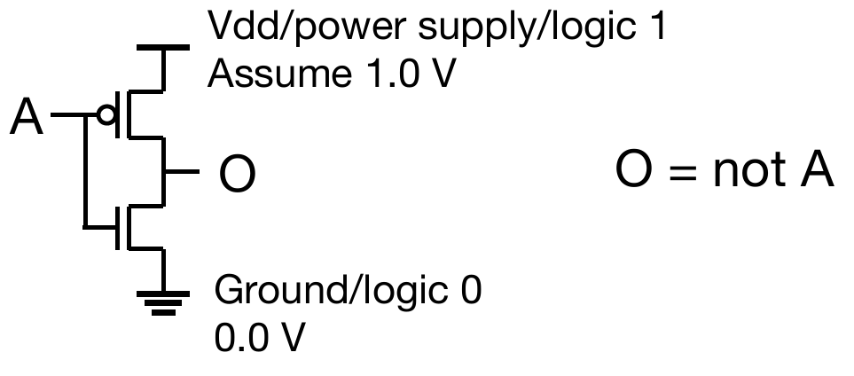
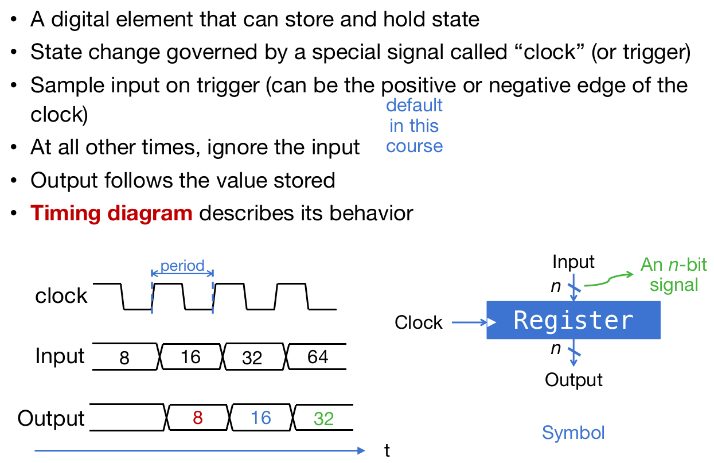
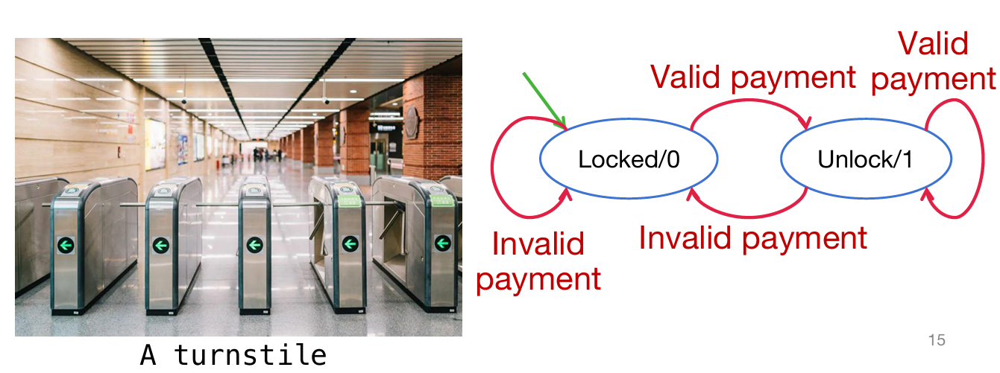

# Digital Circuit

## Digital System

首先要介绍的是两种晶体管：NMOS PMOS。前者是Gate高电压，接通；后者反之。

> NMOS无圈，PMOS有圈；没有圈的是高电压接通

电路根据是否同步分为两种：Combinational logic circuit and State Elements。此处主要介绍的是前者。通过上述两种晶体管，就能建造一些简单的逻辑电路了，比如说与门，如下图所示。

又如下图所示的非门的构建：

常见的logic gates的符号（其实一个gate又是由晶体管组成的）：

## Logic gates to Combinational Circuit

那么假如说我拿到了完整的真值表，如何设计布尔逻辑电路呢？转化规则为：如果是最后为1的项，那么相乘（其中为0的单元加上非），这样的一个个项最后相加。

当然，也可以使用卡诺图：卡诺图（Karnaugh Map，简称K-map）是布尔代数中一种用于简化逻辑表达式的图形化工具。它通过将布尔函数的真值表以二维表格的形式表示，帮助我们直观地找到相邻的最小项，从而简化逻辑表达式。以下是卡诺图的使用方法：

1. **确定变量个数和卡诺图的大小**

- 卡诺图的大小取决于布尔函数的变量个数。例如：

  > 一个含有两个变量的一行或一列，有四个元素，因为每一个变量是1或0

  - 2变量的卡诺图是2×2的表格。
  - 3变量的卡诺图是2×4的表格。
  - 4变量的卡诺图是4×4的表格。

- 每个单元格代表一个最小项，其位置由变量的组合决定。

2. **填写卡诺图**

- 根据布尔函数的真值表，将输出值填入卡诺图的对应单元格中。
- 通常，卡诺图的行和列分别表示不同变量的组合，且相邻的单元格之间只有一位变量不同（格雷码排列）。

3. **寻找相邻的1（或0）**

- 在卡诺图中，相邻的单元格（包括水平、垂直、环绕边界）可能包含相同的逻辑值。
- 寻找尽可能大的矩形或正方形区域，这些区域内的单元格全部为1（或0），且矩形的边长必须是2的幂（1、2、4、8等）。
- 每个矩形区域代表一个简化后的乘积项。

4. **提取简化后的乘积项**

- 对于每个矩形区域，观察其中变量的变化情况：
  - 如果某个变量在区域内保持不变（始终为0或始终为1），则该变量出现在乘积项中。
  - 如果某个变量在区域内变化（0和1都有），则该变量不出现在乘积项中。
- 例如，在一个矩形区域内，变量A始终为1，变量B变化，则乘积项为A。

5. **合并所有乘积项**

- 将所有矩形区域对应的乘积项相加（逻辑或运算），得到简化后的布尔表达式。

6. **验证结果**

- 最后，将简化后的布尔表达式与原始表达式进行比较，确保它们在所有输入组合下具有相同的输出。

> Reference: kimi.moonshot.cn

如下例：

对于2-bit adder的真值表，我们可以列出如下的布尔逻辑：将真值为1的项目加起来，然后通过布尔逻辑进行合并，得到了最终的简化的布尔逻辑，因此考虑+为或门而×为与门就能够搭建组合电路了。

一下是布尔逻辑定律，非常重要：

同样，如果聚焦于一位的加法，并且考虑上一位到这里的进位，那么逻辑如下：

因此对于这样的一个组合电路，总而言之实现的功能是：接受两个该位上的数字，接受上一位总过来的进位，然后输出给下一位的进位与这一位的sum结果。这样的结果可以成为Forward Adder(FA).

最后再举一个例子：对于一个multiplexer来说，假设电子器件如果select data是0，就输出A，如果是1，则输出B，那么输出的真值逻辑如下：那么组合电路的设计就十分简单了
$$
Sel B + \overline{Sel}A
$$
这样，就形成了关于组合逻辑的多种表现形式的转化关系：

## State Elements

### Register

寄存器这个电子器件总而言之：输入接口为D，输出接口为Q，也有一个时钟接口；当时钟信号迎来上升阶段时，寄存器将会对D信号进行采样，然后存起来，并且一种通过Q进行输出。如下图：

> 注意采样后Q输出有延时效应，只不过延时的时间很短

如下图的结构演示了一个n位二进制数字的寄存：每一位的寄存用一个寄存器实现，有n个，重要的是都是接在一个时钟上。如图，当C中的时钟信号迎来上升，那么就会采样D信号的值，然后短暂的延时之后将会储存并通过Q输出。

通过使用组合电路和寄存器能够实现一些特殊的功能。比如说我想要对一个数字不断加四，那么就可以这样的逻辑来实现：将adder的输出结果通过寄存器储存起来，并且能够输出会adder；这样在每一个clock signal上升式时，寄存器将会得到adder结果并且返回给adder，adder计算完之后把结果给到D，但是此时寄存器将不会采样D结果，直到迎来下一个上升。如下图所示：

> 注意没有加上寄存器的那个图，这样的电路是不合法的，因为输出值又会瞬间回到adder的输入；这样的信号是''震荡''的

甚至可以用这样的机制创造下面的这一个电路，实现'signal run'：需要注意的是，假如说第二个DFF迎来上升的时候，是接受之前的A信号，还是第一个DFF更新后的信号？应该是之前的，因为延时效应！

可以看出，这种利用寄存器的电路能够很好的实现特殊的功能，这种使用combinational function block与register的电路称为同步电路（synchronous circuits）。

### FSM

Finite State Machine，顾名思义，这个机器的状态数量是有限的，只不过在不同的时间步时状态不同。

如下图是一个地铁闸机的状态图：其中状态的转移情况十分容易理解（其中绿色箭头代表的是初始状态）

可见对于FSM的关键是：当前状态如何？FSM接受的外界的信号如何？通过这两点，将会决定FSM下一个时间步的状态与输出。如下图：

如果默认下一状态和输出是相同的，那么下一状态值可以视为当前状态值和输入的组合逻辑，对应combinational functional block；而输出的下一状态值将作为决定下下一状态的输入之一，因此通过寄存器之后，返回到组合功能block的输入。

通过上述对于案例的分析，我们能够总结出同步电路的特征，如上图：用A和B代表前组合电路的输出和后组合电路的输入，那么不难发现：
$$
A_{i} = B_{i+1} \\
B_{i+1} = f(B_i,input) = A_{i}\\
$$
第一个式子是因为i+1时刻寄存器对i时刻的A采样；第二个式子是因为Ai的结果是送回来的Bi和input_i的组合。因此可见：前后两个组合电路的逻辑其实就是$f(B_i,input) = A_{i}$ and $Output = g(B_i)$。在列举出FSM的这张表之后，利用布尔逻辑或者是卡诺图来计算出逻辑电路的逻辑，然后就可以搭建电路了。

另外地，可以将FSM分为两种：

- Moore machine: Output depends ***solely*** on the current state and is controlled by  the clock
- Mealy machine: Output depends on ***both the current state and input*** and is ***uncontrolled*** by the clock

> Mealy and Moore machines are interchangable. Mealy and Moore outputs can co-exist in one  synchromous circuit 

那么如下总结如何利用FSM来设计电路去进行模拟：

### Timing in synchronous circuits

时钟的频率能无限快吗？如果上升沿趋近于时间上为0，而且采样等等器件操作的时间都是0，那么也许频率可以非常高。但是现实是：它们需要操作时间。

在上升沿前，有一段setup时间，那么就需要信号稳定住了，便于采样稳定；在上升沿之后，有一段时间hold time，依然需要信号稳定。***同时还需要注意到，输出Q在采样之后将会上升至目标信号值***，***但是这也是需要时间的***，而且时间从图片来看可能甚至略微长于hold time。

不仅仅是寄存器，组合电路乃至电子器件都有这样的需求。如下图所示：在Q1改变至目标信号，进入了comb组合电路，那么依然需要一小段时间，才能在D2看到值的变化，而且D值变化也是需要time span的。那么如下图的时钟频率就是合理的，因为在下一次上升沿的time window范围内，D2的值已经完全改变至目标值并且并且稳定。

如下图，这个是时钟频率就不合理了，因为下一次上升沿time window时，D2正在其中发生改变，不稳定；甚至，如果下一次time window期间卡在了Q1进入组合电路和D2开始发生变化之间，那么这时的采样虽然是稳定的，但是相当于采了一遍之前的D2值，这就完全乱套了。

> In summary: Signal $D_2^{(t+1)}$ should  arrive before the setup  time window

**A synchronous circuit may contain multiple stages of combinational block-and-register, while the slowest path decide the max frequency**. The corresponding path is also called critical path. 根据这个定义，那么上图例子中的critical path显而易见，而且应该满足：
$$
t_{clk-to-Q}+t_{comb} \leq min\ clock\ period-setup\ time
$$
例子：对于下面的这个电路，critical path应该是Reg -> Q -> And1 -> And 2 -> And3->Reg。那么这个所需要的时间是：clock-to-Q+3*AND Delay$\leq$period-setup。

那么最终的结果是：period应该大于等于5ns，所以频率最快是200MHz。