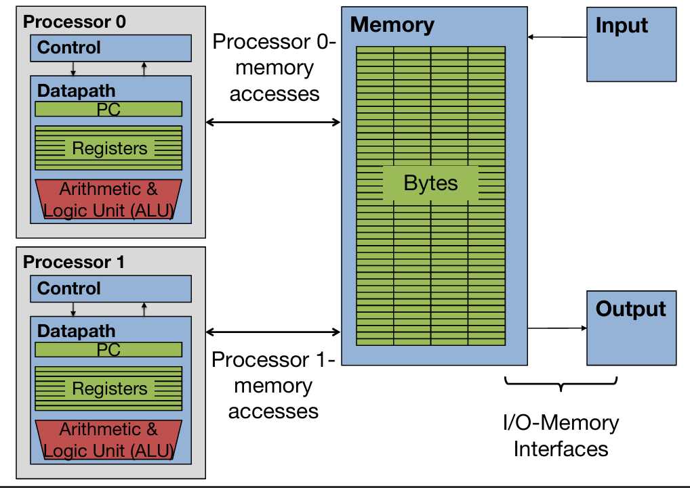
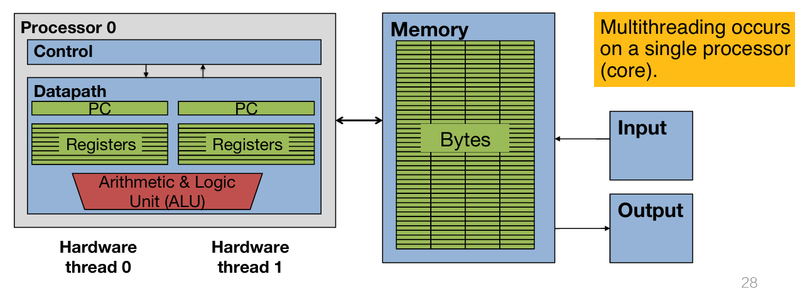
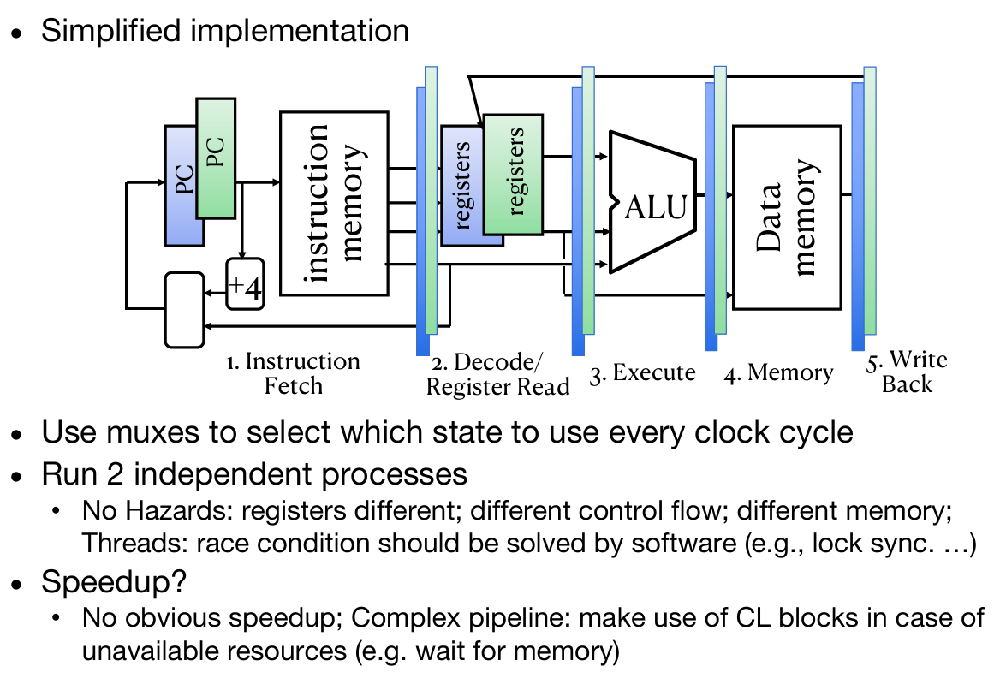

# Hardware Multithreading

## multicore processor

A multicore processor contains multiple processors (“cores”) in a  single integrated circuit.

比如说上述的结构中，一个processor core中包含了datapath, PC and Registers, ALU, etc。而这样的核心可以有很多个，但是他们都是在同一块内存上面工作的。它们共同执行任务的模型叫做execution model：每一个处理器会有独立的指令流，同时很重要的：每个核心也拥有自己的high-level caches，如L1 L2。所有的处理器都会解出同一块内存。

使用场景：

1. 并行处理程序（Parallel-processing program）

- **目标**：提升一个程序的运行速度，前提是该程序被专门设计用于在多处理器上运行。
- **示例**：多线程程序（Multithreaded program）
   比如：浏览器、视频编码器等可以把一个任务拆成多个线程，让多个核心并行处理，提高效率。

2. 进程级并行（Process-level parallelism）

- 又称“作业级并行”，课程CS110中不包含，但实际中非常常见。
- **目标**：为多个独立任务提供高吞吐量（High throughput）。
- **示例**：你的操作系统同时运行多个程序（比如你一边听音乐，一边写文档，一边下载文件），每个核心可以处理一个独立的程序，提高整体效率。

问题一：应该在一个多核处理器中放多少个核心？

- **取决于目标工作负载（target workload）**
  - 如果你的应用是轻量型的，可能2-4个核心足够。
  - 如果是需要高性能的服务器任务，可能需要几十甚至上百个核心。
- **大多数系统的做法**：
  - 选择多个“在约束条件下性能最好的核心”（也就是说不是单纯追求最强，而是综合考虑面积、功耗、成本）。
- **功耗敏感型系统（比如手机）**：
  - 使用“部分高性能核心 + 部分高能效核心”的策略（也就是所谓的**big.LITTLE**架构）。

问题二：不同处理器（核心）之间如何协调/通信？

- **方法一：通过内存中的共享变量，使用load/store指令访问。**
- **方法二：使用同步机制（如锁 lock）**：
  - 避免两个核心同时修改一个变量，可能会导致数据错误。
  - 加锁是常见的方式，但会影响并发性，需要精细设计。

## 硬件线程 vs 软件线程

硬件线程（Hardware Thread）

- 每个**CPU核心（Core）可以提供一个或多个硬件线程**。
- 硬件线程是**实际执行指令的实体**。

软件线程（Software Thread）

- 操作系统可以创建许多**软件线程**。
- **软件线程通过操作系统映射到硬件线程上执行**。
  - 只有被分配到硬件线程的那部分软件线程才会真正运行；
  - 其他线程处于**等待（waiting）状态**。

上下文切换（Context Switching）

操作系统通过“上下文切换”来实现“多个线程同时运行”的假象。

上下文切换的过程：

1. **把原来的线程从硬件线程中移除**：
   - 中断执行（Interrupt execution）
   - 保存上下文（包括寄存器和程序计数器 PC）到内存中
2. **加载新线程进来**：
   - 加载新的寄存器值，包括程序计数器（PC）
   - 将控制权交给新的线程

右侧图示展示了一个“进程（Process）”中包含多个线程，随着时间的推移，不同线程轮流被执行。

## SMT

核心目标：

- 利用**冗余硬件（redundant hardware）**避免频繁保存/恢复线程上下文。

实现方式：

- 多个线程共享一个CPU核心，但每个线程有自己的：
  - 程序计数器（PC）
  - 一套寄存器组
- 这样，当一个线程因为等待数据而阻塞时，CPU可以立即切换到另一个线程执行。

为什么可以做到？

- 因为根据**摩尔定律（Moore’s Law）**，晶体管越来越多、越来越便宜，允许我们在一个核心里放多个执行上下文。

 SMT 的优点总结：

- 提高硬件资源利用率
- 减少上下文切换带来的性能开销
- 在某些场景下（如高延迟内存访问）显著提升系统吞吐量

概念：

- **多线程**意味着在同一个处理器核心中，同时存在多个“活跃”线程的状态。
- 这通过为每个线程保留独立的**程序计数器（PC）**和**寄存器组（Registers）**来实现。

> 如下图所示：可以发现在每一个processor中都有多套线程装备，装备指的是PC and Registers

多线程如何工作：

- 控制逻辑会决定**下一条要发出的指令**。
- 可以混合调度来自**不同线程**的指令。
- 从软件角度来看，这就像是运行在多个“处理器”上（尽管实际上是一个核心在模拟多个硬件线程）。

同时多线程（Simultaneous Multithreading, SMT）Simplified Implementation：

- SMT的核心思想是**同时运行多个线程**，并让它们**共享同一个执行流水线（Pipeline）**。
- 通过使用**多路选择器（Muxes）**，在每个时钟周期选择一个线程的状态来执行。

