# Info-Representation

## Binary World

计算机中的数字全都是0和1，这是由于半导体设备的bi-stable states characteristic决定的。通过对半导体设备进行threshold的设定，设备可以抵抗一定的信号的波动，正确的表达0或1。

由二进制表示的数字之间的加减乘除也可以通过logic operations来进行操作。在计算机的内部，不光光是简单的数字，其实所有的东西都是用数字表示的。但是数字经常被固定大小的内存所储存，如 4-bit nibbles (rarely used), 8-bit bytes, 16-bit half words, 32-bit  words, 64-bit double words......而且一个东西如何用数字进行表示，是人类定义的。

储存数字的内存大小是固定的，那么在进行整数或浮点数的运算就可能因为数字过大或过小而发生overflow现象，即固定的固定大小已经无法精确地表示结果数字了。为了避免这种现象，解决方法可以是使用更多的bit，或者是用不同的方式来''解读''数字，从而扩大固定内存表达的‘范围’。

## Signed and Unsigned integer

在C, C++中用简单的`int x,y,z;x = 7;`就能够定义一个***带符号(signed)整数***，同样也可以支持unsigned int (e.g., address)。

> Unsigned integers in 32 bit word represent 0 to $2^{32}-1$  (4,294,967,295) (4 Gibi)

对于unsigned int来说，二进制表示和十进制的真实数字之间的对应关系为：
$$
(a_na_{n-1}\ldots a_1a_0)_2 = a_n \cdot 2^n + a_{n-1} \cdot 2^{n-1} + \cdots + a_1 \cdot 2^1 + a_0 \cdot 2^0
$$
而对于带符号的int来说，需要最前面的0/1那一位来表示这个数字是正还是负。如果最前的那一位是0，就代表还是整数，反之则为负数。因为第一位用于表示符号，因此一个n位的二进制表达表示的整数范围为：$[-2^{n-1}+1, 2^{n-1}-1]$，这对于运算来说**非*常的不友好***。

因此对于signed int，采用的是Two's-Complement Representation（补码）。如果这个整数是正的，那么就保持不动，且注意第一位应该是0；而如果是负数，那么如果是负数，那么所有的位数都取反！这样一来，表达的十进制的整数范围和之前的依然是一样的。

但是：设想两个和为0的整数，那么正好他们的和为全是1的二进制，表示的就是0；值得注意的是，通过刚刚的这个例子就能看出，这种表达方式的0有正负之分。我们不希望这样的事情发生

因此，补码的最后一个操作就是在翻转之后的数字上+1。这样的话，相反数相加，可想而知地，结果将会是全是0的二进制，表示的正好就是0。运算上十分的友好！这样一来，表示的范围就是：$[-2^{n-1}, 2^{n-1}-1]$

而且上述的表达方式也有较为直观的对应关系：
$$
\left(a_n a_{n-1} \ldots a_1 a_0\right)_2 = -a_n \cdot 2^n + a_{n-1} \cdot 2^{n-1} + \cdots + a_1 \cdot 2^1 + a_0 \cdot 2^0
$$
使用补码的情况下，在进行整数之间的加减法就非常友好了，但是需要注意是否会发生overflow！指的是结果正数很大，或者结果负数非常小。那么因此如何判断发生overflow呢？可以用最高位和符号位的进位来判断：当数值的最高位的进位和符号位的进位不同时，那么就发生了溢出。

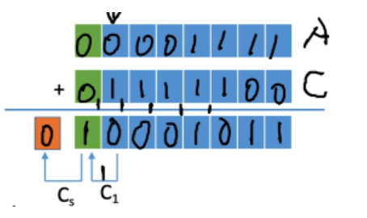

> Reference: https://blog.csdn.net/Lkskywalker/article/details/123307031

上面这张图片中，$C_s$是符号位的进位，$C_1$是最高位的进位，发现两者并不相同，那么就说明发生了溢出。

如今所有的计算机都使用二进制补码来表示带符号的整数。

## Floating-point numbers

### IEEE754

首先介绍Binary point：它是间隔整数和小数部分的边界：点前面的，按照顺序分别是1，2， 4，...；点后面的，按照顺序分别是0.5, 0.25, 0.125, ...。考虑引入binary point，那么加法就其实十分的直接了。

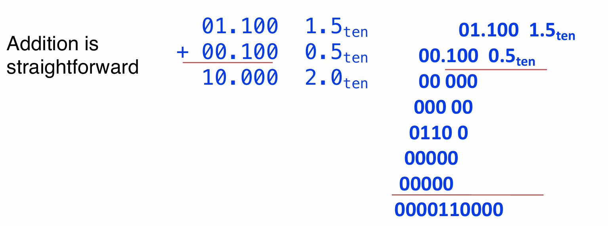

> 乘法中需要记住point在哪里

但是计算机中常用的还是科学计数法scientific notation in decimal。

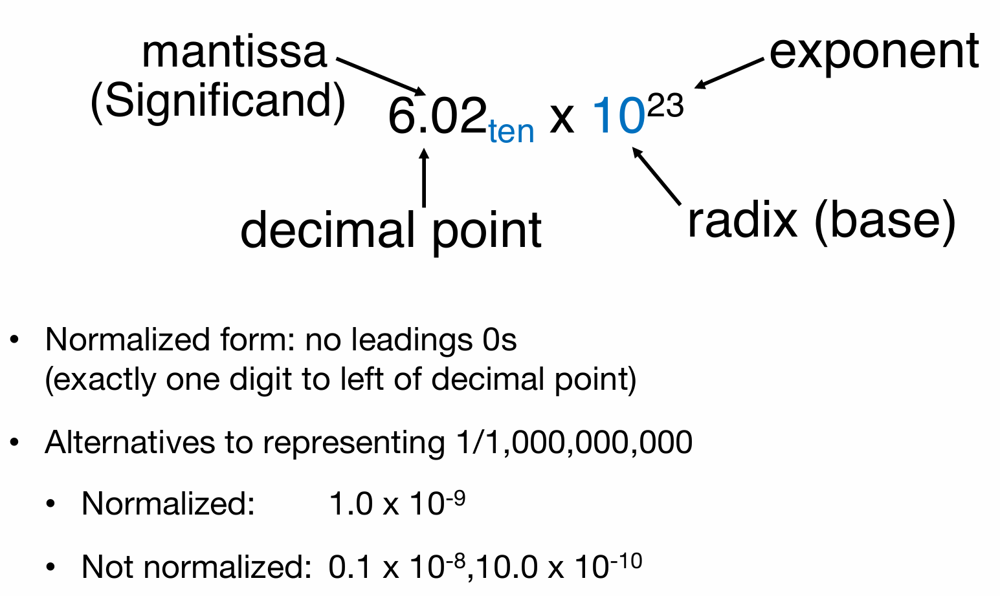

那么在二进制中，科学计数法如下图所示：

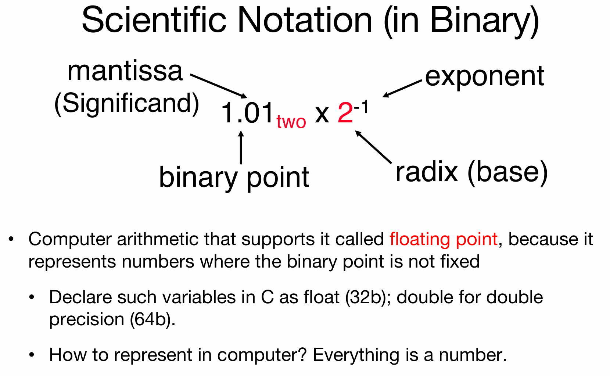

根据IEEE754规定，32位中储存浮点数的规则如下图：

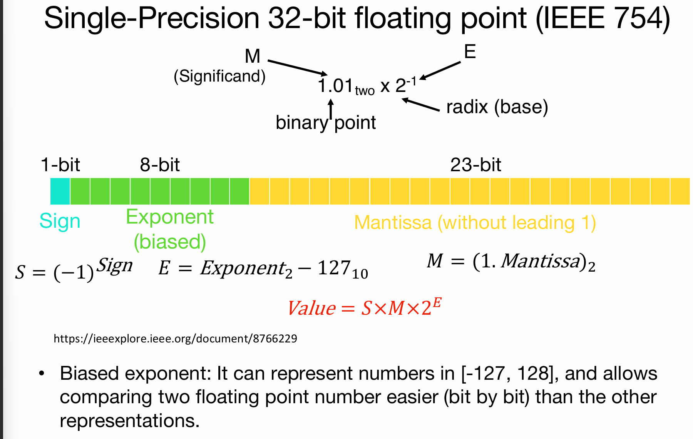

通过上面图演示图可以知道：第一位代表这个数字的正负，接下来的8位***转为十进制并减去127***的是2的指数，然后最后的23位用来表示Mantissa部分抛开小数点前的那个1的部分。接下来将演示如何将IEEE754表达转化为十进制的浮点数：

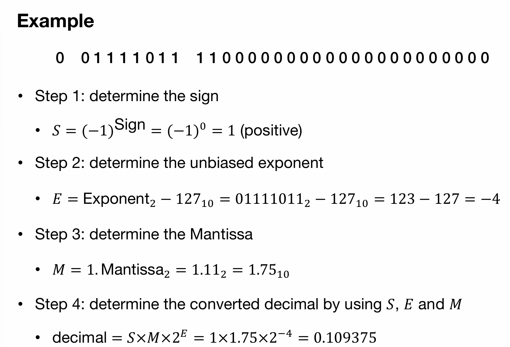

通过上面这个例子，首先第一位是0，说明是整数；然后之后的8为代表的十进制数字是123，减去127就是-4；然后后面的23位表示的是$1.11_2$，就是$1+0.5+0.25 = 1.75$。因此结果就是$1.75*2^{-4}$。下面将演示将十进制的浮点数转化为IEEE754表达：

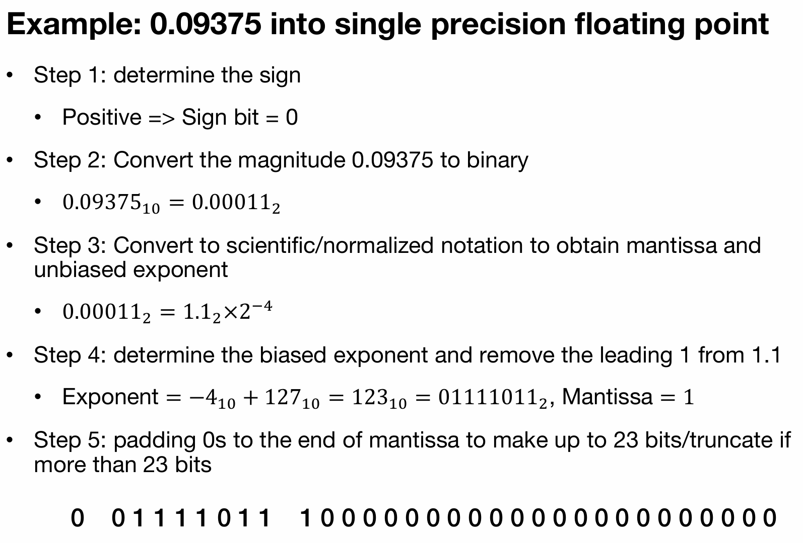

首先是将十进制的浮点数转化为二进制的浮点数，然后小数点移动，并且得到E的部分，然后E+127转化为二进制就是8位表达的部分；同时因为是正数所以第一位是0，而1.1扔掉leading 1之后的部分就是23位所表达的部分。

### Overflow and Underflow

那么如果浮点数（的绝对值）非常的大or非常的小呢？那么就会相对应地发生overflow and underflow。overflow中，2的指数部分已经用8位放不下了，那么可以考虑使用double-precision(FP64) in IEEE754 stantdard。而underflow中，指数部分补上127都比0小，而8位表示的整数打底是1，因此根本表示不出来负数（注意那8位只能表示正数！没有符号位！），那么依然可以考虑使用double-precision(FP64) in IEEE754 stantdard。

overflow and underflow的发生范围和示意图如下图所示：
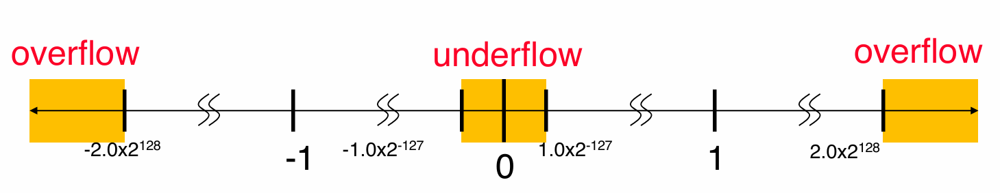

### Representations for Special Cases

用浮点数如何表示正**负无穷**呢？

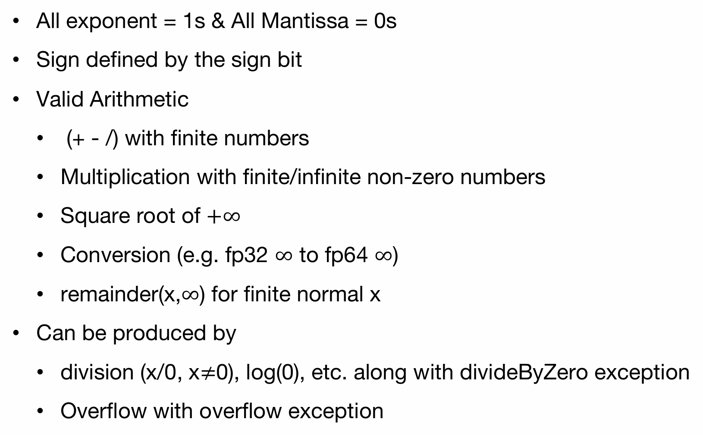

**非规格数**：在underflow中提到，如果指数非常的小，那么表示正数的八位都无法用了，那么这时候他们就被称为非规格化数(Denorm)（相对地，那些能够成功表示的FP32数字称为规格化数）。为了表示这些非常小的数字，浮点数指数部分8位全部为0，偏置依然是127，***但是实际指数的计算方式是1-bias为-126，即：非规格数的实际指数固定为-126，这是规定！***而后面的23为原本代表的是Mantissa without leading 1，***但是这里认为前面的隐藏部分不再是扔掉的1，而是0***！

**NaN:** Not a number，介绍如下：

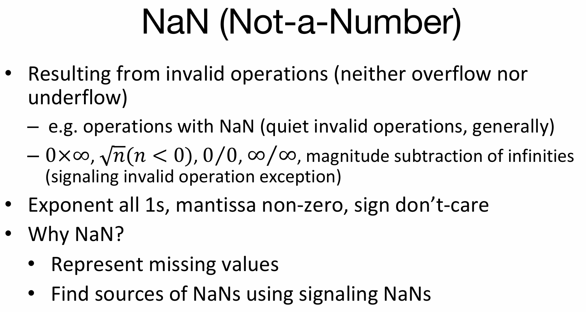

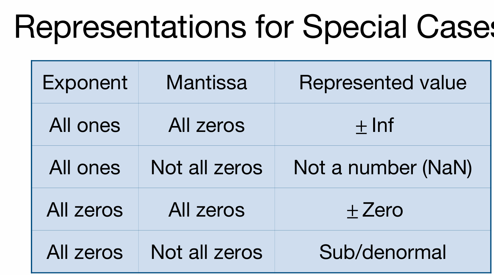

### FP Arithmetic

浮点数在做加减乘除的时候，首先让十进制的指数对齐（***而且是指数低的主动升高***），然后进行加减吗，然后之后规格化（指的是如果溢出，那么进位加到指数中），round（if necessary）。

> Reference: kimi.moonshot.cn

1. **对齐阶码**：
   - 将两个加数的指数（exponent）对齐，使得它们具有相同的指数值。这通常通过将具有较小指数的尾数（mantissa）向右移动相应的位数来实现，同时相应地调整其指数值。
2. **尾数相加**：
   - 在阶码对齐之后，将两个加数的尾数相加。如果结果产生了溢出（即尾数的最高位产生了进位），则需要将进位加到指数中，并可能需要规格化尾数。
3. **规格化结果**：
   - 如果尾数相加的结果需要规格化（即结果的有效数字部分不在IEEE 754标准要求的范围内），则需要调整指数和尾数，使得尾数重新规格化。
4. **检查溢出**：
   - 在执行加法后，需要检查结果是否超出了FP32能表示的范围。如果结果太大或太小，就会发生溢出，此时需要将结果设置为无穷大（infinity）或非规格化数。
5. **舍入结果**：
   - 在某些情况下，加法的结果可能需要舍入以适应FP32的精度限制。IEEE 754标准定义了几种舍入模式，如四舍五入到最接近的数（round to nearest）、向偶数舍入（round to even）、向正无穷大舍入（round toward positive infinity）和向负无穷大舍入（round toward negative infinity）。
6. **处理特殊值**：
   - 如果加数中包含特殊值（如NaN、无穷大等），则需要按照特定的规则处理。例如，任何数与NaN相加都得到NaN。

那么Rounding Modes也有规则：默认是四舍五入到距离最近的偶数。当然也有其他的四舍五入规则：总结如下：

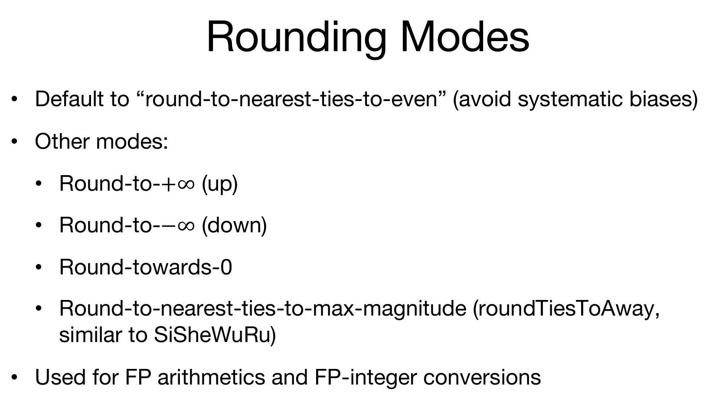

最后是FP32数字的乘法：

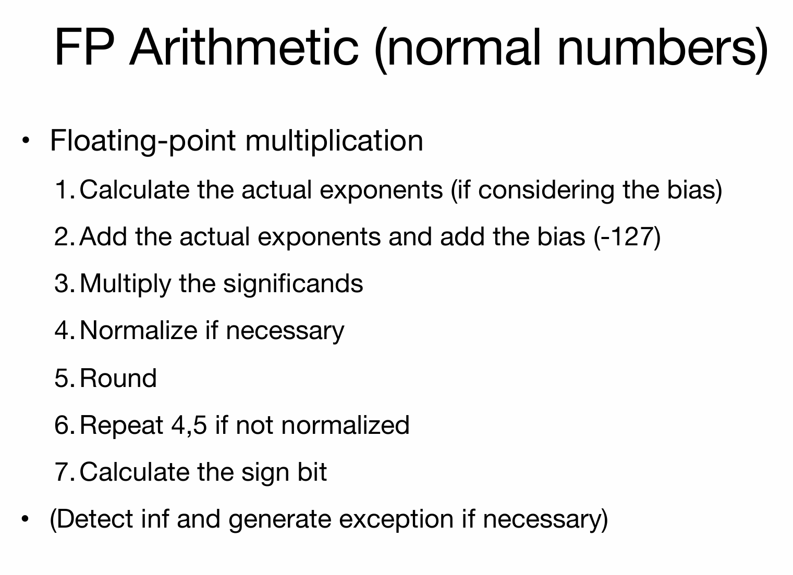

> Reference: kimi.moonshot.cn

1. **符号位处理**：
   - 首先确定结果的符号。两个数相乘，如果符号相同（都是正数或都是负数），结果为正；如果符号不同，结果为负。
2. **指数相加**：
   - 将两个加数的指数部分相加。由于指数是使用偏移量（bias）表示的，所以实际相加之前需要减去偏移量。
3. **尾数相乘**：
   - 将两个加数的尾数部分相乘。这涉及到简单的二进制乘法。
4. **规格化结果**：
   - 乘法的结果可能需要规格化，即将尾数调整到IEEE 754标准要求的范围内。这可能涉及到指数的调整和尾数的移动。
5. **检查溢出和下溢**：
   - 检查结果是否超出了FP32能表示的范围。如果结果太大，发生溢出，需要处理为无穷大或饱和值。如果结果太小，可能需要转换为非规格化数或舍入为零。
6. **舍入结果**：
   - 根据IEEE 754标准定义的舍入模式，对结果进行舍入。常见的舍入模式包括四舍五入到最接近的数（round to nearest）、向偶数舍入（round to even）、向正无穷大舍入（round toward positive infinity）和向负无穷大舍入（round toward negative infinity）。
7. **处理特殊值**：
   - 如果操作数中包含特殊值（如NaN、无穷大等），则需要按照特定的规则处理。例如，任何数与NaN相乘都得到NaN。如果一个无穷大的数与非零数相乘，结果为无穷大；如果0与任何数相乘，结果为0。