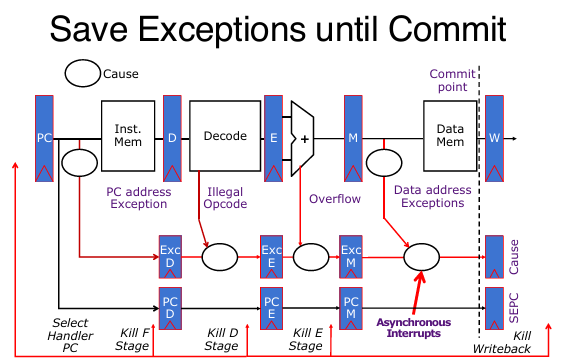

# Operation System & Input Output

从C语言到汇编语言，从汇编语言到机器码，从机器码到CPU执行机器码编码的指令流，从简单的CPU到流水CPU and pipeline，从processor access memory，从始至终，和personal computer总是有一点不一样的地方：没错，那就是和现实设备的输入和输出接轨。以及一直没提及操作系统，而电脑上面十分重要的属性之一就是操作系统使用的是什么。

## OS

操作系统（OS）是计算机系统中的一个核心软件，负责管理和控制计算机硬件和软件资源。以下是操作系统主要功能的中文详细讲解：

1. **启动时运行**：
   - 操作系统是计算机启动后首先运行的软件之一，它在固件（如BIOS或UEFI）和引导加载程序之后启动。
   - 提供各种服务，如文件系统管理、网络协议栈等。
2. **加载、运行和管理程序**：
   - 操作系统负责加载程序到内存中，并管理它们的运行。
   - 它通过系统调用（CALL）来管理程序的执行。
   - **隔离程序**：操作系统确保每个程序或进程在隔离的环境中运行，这样它们不会相互干扰。这种隔离是通过虚拟内存等技术实现的，使得每个程序都像是在自己的小世界中运行。
   - **资源复用**：操作系统能够在多个应用程序之间复用资源，例如通过硬件线程共享内存，或者管理I/O设备（如磁盘、键盘、显示器、网络等）。
3. **与计算机其他部分的输入/输出（I/O）**：
   - 操作系统提供与外部世界的交互，例如通过用户界面（UI）允许用户与计算机进行交互。
   - 它找到并控制计算机中的所有设备，以一种通用的方式进行管理，这通常是通过使用“设备驱动程序”来实现的。设备驱动程序是操作系统的一部分，它们允许操作系统与硬件设备进行通信。

总结来说，操作系统是计算机的大脑，它不仅管理着硬件资源，还提供了一个平台，让应用程序能够高效、安全地运行。通过操作系统，用户可以方便地使用计算机的各种功能，而无需直接与硬件打交道。

下面将展开上述三点，展示：OS的作用究竟是什么！

### Boot

开机之后究竟发生了什么？当电脑开机的时候，CPU执行从start address开始执行命令。当然这些指令都是在Flash ROM中的，不是什么PC寄存器。

1. **BIOS（基本输入输出系统）**：
   - 当计算机开机时，CPU首先执行存储在Flash ROM中的指令。
   - BIOS负责寻找存储设备，并加载第一个扇区（sector），这是一个数据块。
   - 这个扇区通常包含引导加载程序（Bootloader）的代码。
2. **Bootloader（引导加载程序）**：
   - 引导加载程序存储在存储设备上，例如硬盘。
   - 它的任务是将操作系统内核（OS kernel）从磁盘加载到内存中的某个位置，并跳转到该位置开始执行。
   - 这一步是操作系统启动的关键，因为它将控制权从BIOS转移到操作系统。
3. **操作系统启动（OS Boot）**：
   - 操作系统内核开始执行，初始化各种服务和驱动程序。
   - 这个阶段包括设置硬件、加载必要的驱动程序、启动系统服务等。
   - 操作系统会进行一系列的初始化操作，以确保系统能够正常运行。
4. **初始化（Init）**：
   - 操作系统启动完成后，会启动一个应用程序，该程序会等待用户输入并处于循环状态。
   - 这个应用程序通常是终端（Terminal）或桌面环境（Desktop），用户可以通过它与操作系统进行交互。
   - 这个阶段标志着操作系统已经完全启动，用户可以开始使用计算机。

总结来说，计算机启动过程是一个从硬件到软件的逐步引导过程，从BIOS开始，经过Bootloader，再到操作系统内核的加载和初始化，最后启动用户界面。这个过程确保了计算机能够从关机状态安全、稳定地过渡到可以使用的状态。

### IO

1. **程序与外部世界的交互**：

   - 假设有一个程序在CPU上运行，它需要与外部世界进行交互。
   - 需要I/O接口来连接键盘、网络、鼠标、屏幕等设备。

2. **设备连接与控制**：

   - 计算机通过各种总线（如PCI总线、SCSI总线）连接多种类型的设备。
   - 控制这些设备，响应它们，并进行数据传输。
   - 将设备呈现给用户程序，使其能够被有效利用。

   

1. **标准化接口**：
   - 可以为每种不同的I/O设备定义一个单独的方案，或者标准化接口，让I/O设备处理任何复杂性。
2. **处理器的I/O操作**：
   - 输入：读取一系列字节。
   - 输出：写入一系列字节。
3. **接口选项**：
   - 一些处理器具有特殊的输入/输出指令。
   - 内存映射输入/输出（MMIO），用于RISC-V架构：
     - 使用普通的加载/存储指令，例如lw/sw，进行输入/输出操作，以小块形式进行。
     - 一部分地址空间专门用于I/O，I/O设备寄存器位于该地址空间（该地址空间中没有实际的内存）。

内存映射I/O:

1. **定义**：
   - 这些地址不是普通内存，而是对应于I/O设备的寄存器。
   - I/O设备通过读写字节流来进行操作。
   - 这种共享接口被称为内存映射I/O。
2. **地址空间**：
   - 这是一部分地址空间，专门用于I/O，不包含“普通”内存，而是对应于I/O设备的寄存器。
   - 例如，地址`0xFFFF0000`对应于控制寄存器（ctrl reg.），地址`0xFFF00000`对应于数据寄存器（data reg.）。
3. **操作**：
   - 使用普通的加载/存储指令（如lw/sw）可以方便地操作这些寄存器。
   - 这种技术在RISC-V架构中非常常见。

速度不匹配（Speed Mismatch）

1. **理论与实践**：
   - 理论上简单，但实际上在数据速率相差9个数量级的情况下，标准化非常困难。
2. **处理器I/O吞吐量**：
   - 1 GHz微处理器的I/O吞吐量为4 GiB/s（每次加载/存储操作）。

处理器与I/O交互有两种方式：

#### Polls 轮询

1. **轮询（Polling）**：
   - 例如，每秒轮询30次。
   - 处理器在循环中从控制寄存器读取数据。
   - 等待设备在控制寄存器中设置“准备好”位（0表示“数据可用”（对于输入设备）或“准备好接收数据”（对于输出设备））。
   - 然后从/向数据寄存器加载/写入数据。
   - I/O设备重置控制寄存器（1→0）。

#### Interrupts 中断

- 避免在低数据速率设备（例如鼠标、键盘）上浪费处理器资源。
- 处理器像往常一样运行。
- 当I/O准备好时发生中断。
- 中断当前程序。
- 将控制权转移给操作系统中的陷阱处理程序。

**中断处理流程**：

1. 接收到中断，暂停当前指令流。
2. 在中断向量表（interrupt vector table）中查找处理程序地址。
3. 执行跳转（jal）到处理程序，保存必要的状态。
4. 处理程序在当前堆栈上运行，完成后返回，线程无感知。

#### Terminology

**中断（Interrupt）**：

- 由当前运行程序外部的事件触发，例如键盘按键、鼠标活动等。
- 异步（Asynchronous）于当前程序，可在任何方便的指令处处理。
- 当I/O设备准备就绪时触发，暂停当前指令流，执行中断处理程序。

**异常（Exception）**：

- 由当前程序执行某条指令时的事件触发，例如页面错误（page fault）、总线错误（bus error）或非法指令。
- 同步（Synchronous），必须在触发异常的指令处处理。

**陷阱（Trap）**：

- 指硬件通过跳转到“陷阱处理程序”（trap handler）来处理中断或异常的行为。
- 中断和异常都会导致陷阱，控制流从用户程序转移到操作系统。

#### Traps, Interrupt and Exceptions

**精确陷阱（Precise Traps, PAGE 29）**：

- 陷阱处理程序看到的机器状态是：陷阱前的所有指令已完成，陷阱后的指令未执行。
- 陷阱处理程序可通过恢复用户寄存器和跳转回中断指令（通过Supervisor Exception Program Counter, SEPC寄存器）继续执行。
- 精确陷阱简化了处理程序设计，无需了解处理器的流水线细节。
- 异常的陷阱处理比中断更复杂，尤其在流水线处理器中。

#### Pipeline中的Trap Handling

**有序流水线中的陷阱处理（PAGE 31, 33）**：

- 异常标志在流水线中保留至提交点（M阶段，Memory阶段）。
- 较早指令的异常优先于较晚指令，同一指令的早期流水线阶段异常优先于后期阶段。
- 外部异步中断在提交点注入。
- 如果在提交点检测到异常或中断：
  - 更新Cause和SEPC寄存器。
  - 清空所有流水线阶段。
  - 将处理程序的PC注入取指阶段（fetch stage）。

**多异常处理**：

- 在不同流水线阶段可能同时发生多个异常，需优先处理较早指令或较早阶段的异常。

**外部异步中断**：

- 在提交点注入，确保与流水线中的指令处理协调。

### Loads, run and manage programs

1. **加载、运行程序（PAGE 35-36）**

- 操作系统启动后的角色
  - 操作系统在固件/引导加载程序（firmware/bootloader）之后运行，负责启动计算机并初始化系统。
  - 加载、运行和管理程序是操作系统的核心功能之一。
- 进程（Process）与线程（Thread）（PAGE 36）
  - **进程**：应用程序在操作系统中称为进程，具有独立的内存空间。
  - **线程**：共享内存的执行单元。
  - 进程创建：
    - 通过另一个进程调用OS的系统调用（syscall）创建。
    - 在Linux中，使用fork创建新进程，execve加载可执行文件。
  - 加载过程：
    - 从磁盘加载可执行文件（通过文件系统服务），将指令和数据放入内存（.text和.data段）。
    - 准备堆栈（stack）和堆（heap），设置参数（argc和argv），跳转到程序的main函数。

**进程管理（PAGE 37）**

- 多程序运行（Multiprogramming）
  - 操作系统通过快速切换（上下文切换，context switch）在单一CPU上“同时”运行多个进程（时间共享）。
  - 上下文切换：保存当前进程的程序计数器（PC）、寄存器等状态，加载另一个进程的状态。
- 多处理（Multiprocessing）
  - 在多核CPU上真正并行运行多个进程。
- 进程间调用
  - 当前进程通过系统调用请求操作系统启动其他程序。
- 调度（Scheduling）
  - 操作系统决定哪个进程运行，称为调度。

**系统调用（System Call, PAGE 38-39）**

- 定义
  - 系统调用是用户进程请求操作系统服务的“软件中断”，类似于函数调用，但由内核执行。
- 服务示例
  - 文件操作：创建、删除、读写文件。
  - 设备访问：如访问扫描仪。
  - 其他：printf、malloc等（在RISC-V中通过ecall实现）。
  - 启动新进程。
- 系统调用执行流程（以启动新应用为例）
  - 用户进程（如Linux shell）调用fork，触发系统调用，陷入内核（supervisor mode）。
  - 内核加载新程序（参考CALL指令），跳转到新程序的main函数，切换回用户模式。
  - 原进程（如shell）等待新程序执行完成（join）。

**多程序运行与上下文切换（PAGE 40）**

- 时间共享（Time-sharing）
  - 操作系统通过设置定时器中断（timer interrupt）实现多程序运行。
  - 定时器到期时：
    - 保存当前进程的PC、寄存器等状态。
    - 选择另一个进程，加载其状态。
    - 设置新定时器，切换到用户模式，跳转到新进程的PC。
  - 上下文切换速度很快，在人类时间尺度上感知为“同时运行”。
- 调度
  - 操作系统决定运行哪个进程，涉及调度算法。

2. **中断、异常与陷阱（PAGE 26-34, 重叠内容简要回顾）**

**中断与异常的定义（PAGE 26-27）**

- 中断（Interrupt）
  - 外部事件触发（如键盘、鼠标），异步于当前程序。
  - 设备就绪时触发，暂停程序，执行中断处理程序。
- 异常（Exception）
  - 指令执行引发的事件（如页面错误、非法指令），同步于程序。
- 陷阱（Trap）
  - 硬件处理中断或异常的机制，跳转到陷阱处理程序。
- 中断处理流程（PAGE 26）
  - 暂停指令流，查找中断向量表中的处理程序地址，执行处理程序，完成后返回。
  - 示例代码展示如何检查设备状态，传输数据。

**精确陷阱与流水线处理（PAGE 29-31, 34）**

- 精确陷阱（Precise Traps）
  - 陷阱处理程序看到的状态：陷阱前指令完成，陷阱后指令未执行。
  - 通过Supervisor Exception Program Counter（SEPC）保存中断指令地址，便于恢复。
- 流水线中的陷阱处理
  - 异常标志保留至提交点（M阶段）。
  - 优先处理较早指令或较早流水线阶段的异常。
  - 外部中断在提交点注入，更新Cause和SEPC寄存器，清空流水线，跳转到处理程序。
- 流水线示例（PAGE 34）
  - ADD指令触发溢出异常，暂停流水线，执行陷阱处理程序。

**中断与轮询的对比（PAGE 25）**

- 轮询（Polling）
  - 处理器循环检查设备状态，浪费资源。
- 中断驱动I/O
  - 设备就绪时触发中断，处理器正常运行，效率更高，适合低数据率设备。

3. **保护与虚拟内存（PAGE 41）**

- 问题
  - 仅靠监督者模式（supervisor mode）无法完全隔离进程，进程可能覆盖彼此内存。
  - 程序可能需要比实际内存更大的地址空间（如稀疏数据结构）。
- 解决方案
  - 虚拟内存（Virtual Memory）：
    - 给每个进程提供独立的虚拟地址空间，隔离进程。
    - 后续讲座详细探讨。

4. **操作系统核心功能总结（PAGE 42）**

- 启动计算机（Boot）
  - 固件加载内核，初始化系统。
- I/O处理
  - 通过轮询或中断与设备交互。
- 异常、中断与陷阱
  - 处理外部事件和指令错误，保障系统稳定性。
- 资源管理
  - 多程序运行、调度、虚拟内存等。
- 后续学习
  - 在CS 130课程中深入探讨操作系统其他功能。

综合总结

操作系统的核心任务包括程序加载、运行与管理，以及中断、异常和陷阱处理：

1. 程序管理
   - 加载程序（fork和execve），分配内存，设置运行环境。
   - 通过上下文切换实现多程序运行（时间共享），调度决定进程执行顺序。
   - 系统调用允许用户进程请求内核服务（如文件操作、启动新进程）。
2. 中断与异常
   - 中断处理外部事件，异常处理指令错误，陷阱是硬件响应机制。
   - 精确陷阱和流水线处理确保一致性，优化中断效率。
3. 虚拟内存
   - 提供进程隔离和更大地址空间，解决内存访问冲突。
4. I/O与资源管理
   - 中断驱动I/O优于轮询，高效管理低速设备。
   - 操作系统协调CPU、内存、I/O设备等资源。

这些机制共同确保操作系统高效、安全地管理程序运行和硬件交互，为现代计算机系统提供稳定支持。后续课程（如CS 130）将进一步探讨虚拟内存和高级资源管理。