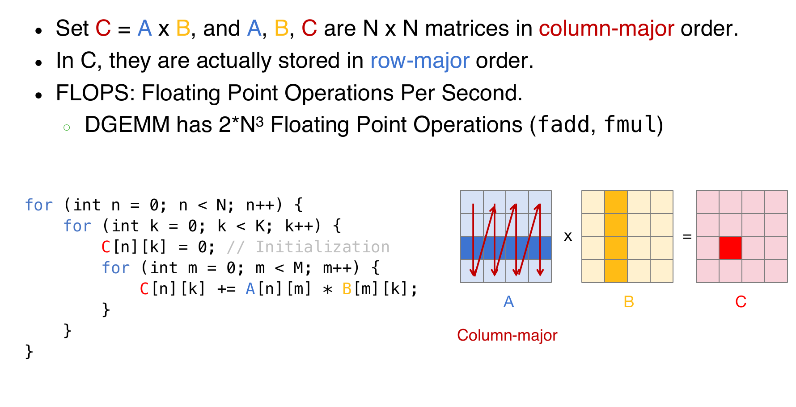

# Parallelism

## X86 SIMD Intrinsics

SIMD指令可以通过对给定的指令集架构（如x86）进行扩展来访问。这些指令集扩展通常被称为“向量指令”，使用专门的“向量寄存器”来执行数据并行计算。它们使用专门的'向量'寄存器，而且也会使用extended SIMD指令去进行load/store，计算，etc。

**内建函数**是C语言中的函数和过程，允许开发者间接使用汇编指令。通过内建函数，程序员可以利用SIMD扩展指令集的功能，进行高效的并行计算，而不需要直接编写低级的汇编代码。通过**内建函数**，开发者可以**间接地使用汇编指令**。这些内建函数背后会自动调用对应的SIMD指令（如Intel的AVX或SSE指令），但是开发者无需手动编写或了解汇编代码。

内建函数与SIMD扩展指令（如Intel的AVX或SSE指令）之间有**一一对应的关系**。也就是说，每个SIMD指令都有对应的内建函数。例如，`_mm256_add_ps` 是一个内建函数，用来执行AVX指令中的256位单精度浮点数加法操作。

## Example: SIMD Array Processing


## Loop

在这一部分中，将展示如何利用SIMD技术来优化循环。具体来说，这种技术叫做循环展开：Loop Unrolled

### Loop Unrolled

**D标准扩展**（Double Standard Extension）：

- 在RISC-V架构中，`D`扩展用于支持双精度浮点运算，它是在`F`标准扩展（支持单精度浮点运算）的基础上扩展的。

**假设**：

- `t1` 最初包含数组元素的地址，`t2`包含操作的最后一个元素的地址。
- `f0`寄存器保存标量值`s`。
- `8(t2)`表示数组的最后一个元素的地址。

````assembly
Loop:    fld f2, 0(t1)      # 加载数组元素到f2
         fadd.d f10, f2, f0  # 将数组元素与标量值s相加
         fsd f10, 0(t1)      # 将结果存回数组
         addi t1, t1, -8      # 将t1递减，指向下一个元素
         bne t1, t2, Loop     # 如果t1 != t2，跳转回循环开始
````

**循环展开的概念**：循环展开是一种优化技术，目的是减少循环控制的开销（如条件判断和跳转指令），通过增加每次循环迭代的工作量来提升程序的执行效率。

**只有每4次循环会有1次循环开销**：每展开一次循环，控制开销就减少1次，因此可以显著提高执行效率。这里循环开销(loop overhead)指的是：与循环控制相关的计算和处理所带来的性能成本

> 主要包括以下几个方面：循环条件判断开销，循环跳转开销，迭代变量更新开销，内存访问开销， 循环控制指令的消耗（每次循环迭代时，CPU都会执行一些控制指令，例如判断是否跳出循环、更新迭代变量等）

**循环展开适用于`loop_limit(mod 4)`的情况**：即循环次数可以被4整除的情况下，展开效果更好。

**使用不同的寄存器消除流水线中的数据危害**：每次迭代执行多个操作时，如果多个操作使用相同的寄存器，可能会导致数据依赖问题（数据危害）。通过使用不同的寄存器，避免这种情况，确保流水线的高效运行。

**循环展开后的代码**：
 代码展开后，增加了每次迭代的工作量，同时减少了循环控制的开销：

````assembly
fld f2, 0(t1)     # 加载第1个元素
fld f3, -8(t1)    # 加载第2个元素
fld f4, -16(t1)   # 加载第3个元素
fld f5, -24(t1)   # 加载第4个元素
fadd.d f10, f2, f0
fadd.d f11, f3, f0
fadd.d f12, f4, f0
fadd.d f13, f5, f0
fsd f10, 0(t1)
fsd f11, -8(t1)
fsd f12, -16(t1)
fsd f13, -24(t1)
addi t1, t1, -32
bne t1, t2, Loop
````

在这个展开的版本中，一次迭代处理了4个数组元素，并且通过使用4个不同的寄存器来存储临时结果，从而避免了数据依赖问题。

如果手动展开循环，每次迭代处理多个元素：

````C
for(i = 1000; i > 0; i = i - 4) {
    x[i] = x[i] + s;
    x[i-1] = x[i-1] + s;
    x[i-2] = x[i-2] + s;
    x[i-3] = x[i-3] + s;
}
````

在这个展开的版本中，4个相邻的数组元素同时被处理，从而减少了循环控制的开销。

**一般化的循环展开**：假设有一个循环需要迭代`n`次，你可以通过将每次迭代的体部分复制`k`次来实现展开。

- 其中，`k`是展开的次数，表示每次迭代处理多个数据。
- 假设`n mod k != 0`，即循环次数不能被`k`整除。在这种情况下，剩余的迭代次数将需要用一个完整的循环来处理。

### RISC-V Vector Extension

**RISC-V 向量寄存器**

- **32个向量寄存器**：RISC-V向量扩展提供了32个向量寄存器，用于存储向量数据。每个寄存器可以处理多个数据元素。
- **需要设置数据长度和并行寄存器的数量**：为了使得RISC-V的向量扩展能够工作，程序员需要设置向量长度（`vconfig`）。例如，`vl`表示加载指定长度的向量数据，`vs`表示向量长度设置，用来控制寄存器中加载多少元素。

下面的汇编代码，展示了如何每一次循环中载入四个float，每一个都加上标量s，然后返回：

````assembly
    # assume x1 contains size of array
    # assume x4 contains address of scalar s
    vconfig 0x63               # 4 vregs, 32b data (float)
    vflw.s v1., (x4)           # load scalar value into v1
loop:
    vsetvl x2, x1             # will set vl and x2 both to min(maxvl, x1)
    vflw v0, 0(t1)            # will load 'vl' elements out of 'vec'
    vfadd.s v2, v1, v0        # do the add
    vsw v2, 0(t1)             # store result back to 'vec'
    slli x5, x2, 2            # bytes consumed from 'vec' (x2 * sizeof(float))
    add t1, t1, x5            # increment 'vec' pointer
    sub x1, x1, x2            # subtract from total (x1) work done this iteration (x2)
    bne x1, x0, loop          # if x1 not yet zero, still work to do
````

其中，**`maxvl`** 代表向量长度的最大值（**vector length**），即处理器支持的最大并行数据元素的数量。它决定了每次可以并行处理多少个数据元素。具体来说，**`vsetvl`** 指令用于设置每次操作的向量长度（`vl`），而 `maxvl` 是硬件支持的最大向量长度，确保不会超出硬件的并行处理能力。当然，这里的maxvl应该是4，而取min的原因也是因为不整除情况下，最后是凑不出一个maxvl的。

硬件支持：

- **硬件的并行处理**：RISC-V向量扩展使得每个向量寄存器可以并行处理多个数据元素。硬件会根据配置自动处理不同长度的向量。
- **2-lane, 4-lane, 8-lane的实现**：硬件的实现可以是2路、4路、8路并行，每个时钟周期处理多个数据元素。这些路数是硬件实现的，程序员无需关心。

对两个单精度浮点向量进行加法运算。给出了一个例子：展示了如何对两个向量的对应元素进行加法操作，并通过SSE指令在x86汇编语言中实现。目标是对两个单精度浮点数向量进行加法操作。给定两个向量 `v1` 和 `v2`，计算它们的加法结果并存储在 `vec_res` 向量中，操作如下：

````assembly
vec_res.x = v1.x + v2.x;
vec_res.y = v1.y + v2.y;
vec_res.z = v1.z + v2.z;
vec_res.w = v1.w + v2.w;
````

这部分展示了如何使用SSE指令在x86架构中实现上述向量加法。SSE是一个SIMD指令集，可以在单个指令周期内并行处理多个数据元素。通过SIMD指令，我们可以一次性处理多个浮点数:

````assembly
movaps address-of-v1, %xmm0
// v1.w | v1.z | v1.y | v1.x -> xmm0
addps address-of-v2, %xmm0
// v1.w+v2.w | v1.z+v2.z | v1.y+v2.y | v1.x+v2.x -> xmm0
movaps %xmm0, address-of-vec_res
````

**`movaps address-of-v1, %xmm0`**：

- 这条指令将 `v1` 向量的值加载到 `xmm0` 寄存器中。`movaps` 是一个SSE指令，它从内存中加载数据到一个SSE寄存器中。
- 这时，`xmm0` 寄存器中存储了 `v1` 向量的4个单精度浮点数（即 `v1.x, v1.y, v1.z, v1.w`）。

**`addps address-of-v2, %xmm0`**：

- 这条指令将 `v2` 向量的值加载到 `xmm0` 寄存器中，并执行加法操作。`addps` 是一个SSE指令，它对寄存器中存储的4个单精度浮点数逐一执行加法。
- 计算结果是：`v1.x + v2.x`、`v1.y + v2.y`、`v1.z + v2.z`、`v1.w + v2.w`，这些结果存储在 `xmm0` 寄存器中。

**`movaps %xmm0, address-of-vec_res`**：

- 这条指令将 `xmm0` 寄存器中的结果存储回 `vec_res` 向量的内存地址。结果是，`vec_res.x = v1.x + v2.x`，`vec_res.y = v1.y + v2.y`，`vec_res.z = v1.z + v2.z`，`vec_res.w = v1.w + v2.w`。

### **SSE内建函数**

- **内建函数（Intrinsic functions）** 是可以在高级语言（如C语言）中使用的函数，提供了对底层SIMD指令的访问。通过这些内建函数，开发者可以在不直接写汇编代码的情况下使用SIMD指令。
- **SSE内建函数示例**：
  - **`_mm256_add_ps`**：这个函数用于执行并行的浮点加法操作，处理两个单精度浮点数向量。对应的SSE指令是`ADDPD`。

SSE内建函数的类型：

- **数据类型**：
  - `_m128`：表示128位的SIMD数据类型，每个寄存器包含4个32位单精度浮点数。
  - `_m256`：表示256位的SIMD数据类型，每个寄存器包含8个32位单精度浮点数。
- **加载和存储操作**：
  - **`_mm_load_pd`**：加载对齐的双精度浮点数。
  - **`_mm_store_pd`**：将双精度浮点数存储到内存。
  - **`_mm_loadu_pd`**：加载非对齐的双精度浮点数。
  - **`_mm_storeu_pd`**：将非对齐的双精度浮点数存储到内存。
- **算术操作**：
  - **`_mm_add_pd`**：并行加法操作，处理双精度浮点数。
  - **`_mm_mul_pd`**：并行乘法操作，处理双精度浮点数。

## DGEMM as an Example

**DEGMM** 通常是指 **双精度矩阵乘法**（Double Precision General Matrix Multiply），它是进行矩阵乘法运算时使用的一个术语，特别是在涉及高精度（双精度）浮点数运算的情况下。

- **D**：表示“双精度”（Double Precision），即使用64位浮点数进行计算，提供更高的数值精度。
- **GMM**：表示**通用矩阵乘法**（General Matrix Multiply）。它是矩阵运算中的一种常见操作，通常用来描述矩阵与矩阵、矩阵与向量之间的乘法运算。



比如上图中右边红色的值是由A B对应的行和列内积得来的，但是残酷的现实是，由于矩阵的元素是由数组存放的，因此A中的元素其实是跳着访问的，破坏了spatial locality。

````C
void dgemm_scalar(int N, double *A, double *B, double *C) {
    for (int i = 0; i < N; i++) {
        for (int j = 0; j < N; j++) {
            double Cij = 0;
            for (int k = 0; k < N; k++) {
                Cij += A[i + k * N] * B[k + j * N];
            }
            C[i + j * N] = Cij;
        }
    }
}
````

虽然说循环很多，而且还有跳着行访问元素的情况，但是抛开这些不谈，依然有并行化的空间：首先是`Cij+=`的这个式子，明显可以是可以使用SIMD的；另外就是每一个Cij元素的计算都是独立的。这两点给出了并行化的可能性。


上面展示了 **2x2矩阵乘法** 的实现，使用了 **SSE指令集** 进行优化。矩阵乘法的过程利用了 **XMM寄存器**，每个寄存器包含2个双精度浮点数，利用SIMD指令并行处理数据来加速运算。

**XMM寄存器**：XMM寄存器是SSE指令集中的寄存器，每个寄存器包含两个 **双精度浮点数**（64位浮点数），即每个寄存器大小为128位。这样，可以在一次操作中加载和处理多个数据元素。

通过 **`_mm_load_pd`** 和 **`_mm_store_pd`** 等指令，数据被加载到XMM寄存器中进行并行计算。

`A` 和 `B` 是要进行乘法操作的矩阵。矩阵 `A` 和 `B` 中的每个元素都对应加载到 **XMM寄存器** 中。

- **`a = _mm_load_pd(A);`**: 这条指令将矩阵 `A` 的元素（如 `A1,1` 和 `A2,1`）加载到XMM寄存器。
- **`b1 = _mm_load_pd(B);`**: 这条指令将矩阵 `B` 的元素（如 `B1,1` 和 `B2,1`）加载到另一个XMM寄存器。

**计算部分**：

- **`_mm_mul_pd(a,b1)`**：这条指令将 `a` 和 `b1` 中的元素逐个相乘，得到部分乘积。类似地，矩阵乘法中每个元素都需要乘法和加法操作。
- **`_mm_add_pd(c1,_mm_mul_pd(a,b1))`**：通过 `_mm_add_pd` 指令，将 `a` 和 `b1` 乘积的结果与其他乘积结果累加，得到最终的矩阵 `C` 中的元素。

**存储结果**：最后，通过 **`_mm_store_pd(C, c1);`** 将结果存储回内存中的矩阵 `C`。

上面的操作计算出了C11 C21；并且与此同时可以并行地计算出C21 C22。注意这里是观察了元素式子的组成，然后尽可能的进行简化运算；同时要注意ABC的分块（注意图片中的A的分块打错了，应该是$A_{i,1} \&A_{i,2}$）！