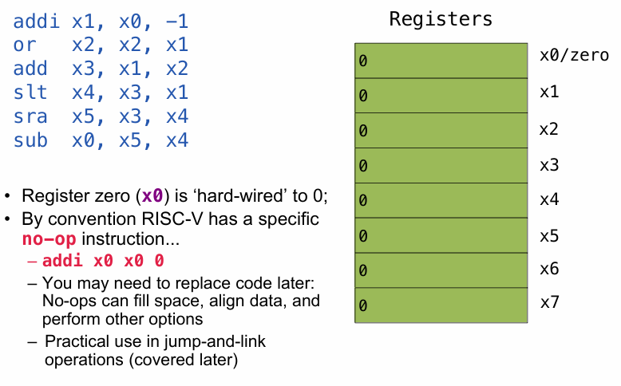
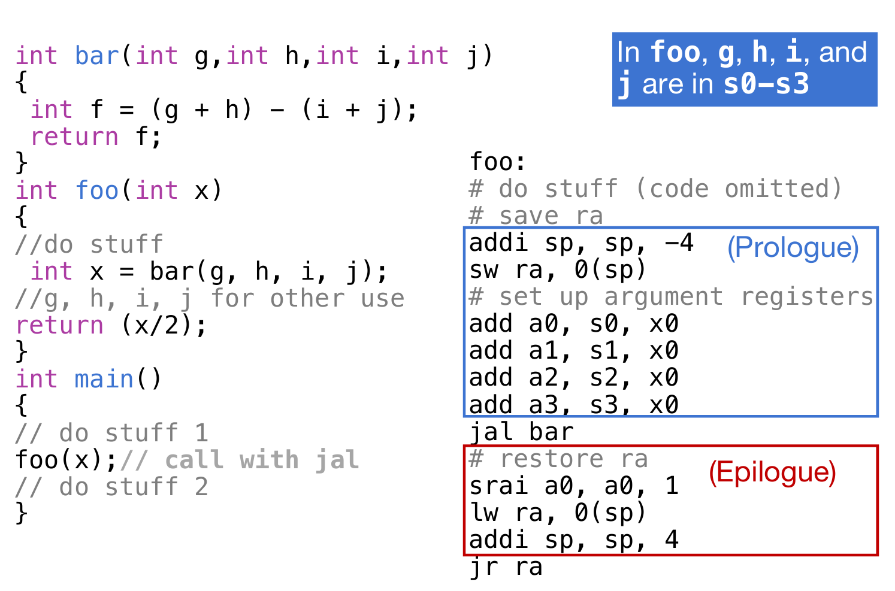

# RISC-V

## RISC-V

现在讲的这个RISC-V是干什么的？其实解决的就是如何将C语言代码，***转化为汇编语言程序，进而转化为机器语言（二进制）***！CPU的基本任务是执行一系列的指示，而指示都是一些较为基础的操作，而这些指示最最基本的其实就是改变计算机的状态。

> 注意：ARM是基于RISC（精简指令集计算机）架构，而x86是基于CISC（复杂指令集计算机）架构；这意味着ARM汇编代码中的指令和寄存器在x86 CPU上无法直接识别和执行

1. **与C或Java不同，汇编语言不能使用变量**
   - 高级编程语言如C或Java允许使用变量来存储数据和指令。变量可以是任何数据类型，如整数、浮点数、字符等，并且可以在程序中多次赋值和使用。
   - 汇编语言则不同，它是一种低级语言，直接对应于计算机的硬件指令。在汇编语言中，没有传统意义上的“变量”概念，而是使用寄存器（registers）来存储和操作数据。
2. **保持汇编/计算机硬件抽象简单**
   - 汇编语言提供了一种相对简单的硬件抽象。它比机器语言（直接用二进制或十六进制表示的指令）更易于理解和编写，但仍然非常接近硬件操作。
   - 这种简单的抽象使得程序员能够更直接地控制硬件，但同时也需要对硬件有一定的了解。
3. **汇编操作数是寄存器**
   - 在汇编语言中，操作数（operands）通常指的是参与运算的数据。与高级语言不同，汇编语言中的操作数通常是寄存器。
   - 寄存器是CPU内部的高速存储单元，用于存储指令和数据，以便快速访问和处理。
4. **有限数量的特殊位置/内存直接内置于CPU中**
   - 寄存器的数量是有限的，因为它们是CPU硬件的一部分。与内存相比，寄存器的数量较少，但访问速度更快。
   - 在RISC-V架构中，操作只能在这些寄存器上执行，这进一步强调了寄存器的重要性和高效性。


程序计数器（PC）寄存器用于存储当前正在执行的指令的地址，它在指令执行过程中自动更新，指向下一条指令。RISC-V架构中有32个通用寄存器，编号从x0到x31。x0通常用作零寄存器，其值永远是0。

**为什么选择32个寄存器？较小的寄存器集更快，但太小也不好**：寄存器的数量需要在速度和灵活性之间取得平衡。32个寄存器是一个折中选择，既保证了较快的访问速度，又提供了足够的灵活性来支持复杂的程序。每个RV32寄存器是32位宽。

在C语言中，声明一个变量的时候必须要声明类型，而且变量将会只能代表它所被声明的数值类型。但是在汇编语言中，寄存器没有类型，只是简单地储存0和1，而operation将会决定寄存器中的内容如何被对待。

在汇编语言中，每一条指示都会恰好执行a short list of simple commands，而assembly code中的每一行至多一个instruction. 

RISC-V指令集基于对立即数的处理，主要有四种核心指令类型（R-type, I-type, S-type, U-type）以及两种分支/跳转指令类型（B-type, J-type）。

## R-type（寄存器类型）

- **格式**：`funct7 | rs2 | rs1 | funct3 | rd | opcode`
- **特点**：这种类型的指令不包含立即数，操作数完全来自寄存器。
- **用途**：主要用于寄存器之间的算术和逻辑运算。

有两个操作数rs2 rs1，并且指定了输出存储的目标寄存器rd。且无法接触main memory。例如`add x5, x2, x1`就是将寄存器x5 x2中的两个数字进行相加然后放在x1。这里的函数不仅仅可以是`add`，也可以是`sub` 。`and or xor`是位运算，`and/or/xor rd, rs1, rs2`，Logically bit-wise `and/or/xor` the value stored in register `rs1` and that of  `rs2` and stores the result into register rd。

> `xor`一个全是1的二进制数字可以对另一个数字进行negation！

非常特殊地，还可以是：`sll srl sra`，代表位运算的`<< >> >>>`，其中`<< >>`的位移是`rs2`寄存器中二进制后五位所代表的数字。注意：`sra`和`srl`最大的区别是`srl`总是用0 padding，而sra使用符号位的数字padding！

`slt/sltu rd, rs1, rs2` equivalent to a = b < c ? 1 : 0, a ⇔ rd, b ⇔ rs1, c ⇔ rs2. Treat the numbers as signed/unsigned with  `slt/sltu`。

> Store if Less Than

## I-type（立即数类型）

- **格式**：`imm[11:0] | rs1 | funct3 | rd | opcode`
- **特点**：包含一个12位的立即数，用于需要立即数参与的运算，如加载、存储和算术运算。
- **用途**：适用于需要立即数的操作，如加法、减法等。

例如`addi x5, x4, 10`就是给x4寄存器中的数字加上10然后放进x5寄存器中。注意，imm是signed number，因此如果是负数的话需要补码操作再相加。`slli/srli/srai` shift rs1 by the lower  5-bits of imm, `srai` is distinguished by  using one of the higher bit of the imm (or  funct7 field).

特殊的是：**无操作指令（no-op）**：RISC-V有一个特定的无操作指令 `addi x0, x0, 0`，它不改变任何寄存器的值。这种指令可以用于填充空间、对齐数据或在跳转和链接操作中使用。

I-type还负责load的操作。处理器首先从内存中读取数据，然后将这些数据加载到寄存器中，以便快速访问和进一步处理。这是计算机执行程序时的一个基本步骤，因为程序中的指令和操作通常需要访问和操作存储在内存中的数据。下面介绍一些常见的命令：

**`lw rd, imm(rs1)`**：这条指令表示从地址`rs1 + imm`处加载一个字（32位，四字节）到寄存器`rd`中。

`lh/lhu rd, imm(rs1)`: Load signed/unsigned halfword at addr. to register rd(similar to lb/lbu)。（可见这三条命令的区别是load的大小不一样）

`lb/lbu` `rd, imm(rs1)`: Load signed/unsigned byte at `addr.` to  register `rd`



小例子：x0永远是0，所以x1是-1；然后x2和x1取或，因为x1是-1，也就是二进制全是-1，所以x2也全是-1；然后x3是-2，x4是1因为x3<x1；其次，x3右移一位，且补码为1，结果为二进制全是1，即-1，存放在x5；最后0-（-1）结果为1放在x4.

## S-type（存储类型）

- **格式**：`imm[12|11:5] | rs2 | rs1 | funct3 | imm[4:0] | opcode`
- **特点**：包含一个12位的立即数，用于存储操作（如加载和存储指令）。
- **用途**：用于加载和存储数据到内存。

 `sw rs2, imm(rs1)`: Store word at `rs2` to memory `addr.= (number in rs1) + imm`。

> 注意这里的imm的单位是字节，八位！而不是四位！

`sh`:Store lower 16 bits at `rs2`        `sb`:Store lower 8 bits at `rs2`


上面这个例子中：x12是取byte，地址是x5+1，因此是跳过了F6，剩下的数字是85，但是因为是load signed byte，作为一个8位的byte，最前面是符号位，10001001这个byte第一位是1，因此认为是负数，所以放入寄存器的时候符号位扩展是用1进行padding的，因此x12最终内容是0xFFFFFF85！

## B-type（分支类型）

- **格式**：`imm[12] | imm[10:5] | rs2 | rs1 | funct3 | imm[4:1] | imm[11] | opcode`
- **特点**：包含一个分支目标地址的立即数，用于条件分支指令。
- **用途**：用于实现条件跳转。

原来正常的操作是命令一条一条执行，但是在C语言中有if while等特殊的语句，因此B-type就是用来支持这种conditional branch的。

` beq rs1, rs2, L(imm/label`)，如果rs1中的值等于rs2中的，那么就跳转到L语句。类似地，有`bne(not equal) bge(greater or equal)`等。如下图中的例子：第三行是‘如果x2中的数不等于x3中的数，那么跳转到L1语句’；第四行是‘如果x2中的数等于x3中的数’。


接下来看一个实战中的汇编语言程序和C语言程序的对应：


首先假设A数列的首元素地址储存在了x8中，那么接下来一行一行来解释发生了什么：

1. 将x0 x8的值相加存到x9中，因为x0的值永远是零，所以相当于是x9里面也存了数列地址
2. 因为x0的值永远是零，所以相当于是将0储存到了x10的位置。这个值之后将会充当sum的角色
3. 在for循环中，i也是一个需要track的变量，所以和第二行类似，x11代表i
4. 遍历访问数组不能越界，因此需要记录下数组的长度，因此是I类型命令，将20储存在了x13，记录数组长度
5. 接下来进入了Loop: 首先判断x11数字是否大于等于x13，如果是那么就转到Done
6. 需要获取数组中对应位置的元素，因此需要lw命令，将x9地址的数据load过来存到x12里面
7. 然后x10（sum）数字和x12（数列元素）相加然后放进x10。
8. 之后x9储存的地址加4！这是因为一个int大小是32位四字节，内存中一个字节一个地址，因此是+4；这里是使用立即数类型命令
9. 最后，x11（i）需要加1，代表i，也代表循环的次数
10. j Loop，跳转会Loop
11. 如果`bge`命令那一行判断通过，那么会进入Done部分，里面的ret代表程序结束

## U-type（无符号立即数类型）

- **格式**：`imm[31:12] | rd | opcode`
- **特点**：包含一个20位的无符号立即数，用于需要大立即数的操作。
- **用途**：适用于需要大立即数的操作，如加载大立即数到寄存器。

## J-type（跳转类型）

- **格式**：`imm[20] | imm[10:1] | imm[11] | imm[19:12] | rd | opcode`
- **特点**：包含一个21位的立即数，用于跳转指令。
- **用途**：用于实现无条件跳转。

`jal rd label` 将会跳转至`label(imm+PC)`，并且返回地址`(PC+4)`给rd寄存器。如果rd是x0，那么就相当于是无条件跳转，且不会记录`(PC+4)`。

>  If you don’t want to record where you jump to: `jr rs == jalr x0 rs`

` jalr rd rs1 label`跳转到label `(imm+rs1)&~1` 并且返回地址`(PC+4)`给rd寄存器。如果rd是x0，那么就相当于是无条件跳转，且不会记录`(PC+4)`。

上述两条指令总结如下：


## Register

在之前情境中，都认为除了x0永远是0之外，其他都是一视同仁的；但是实际上，give names to registers and **conventions** on how to use them：


-  `a0–a7 (x10-x17)`: eight argument registers to pass parameters `(a0-a7)` (例如给函数的传参就可以放在这七个寄存器中) and return values `(a0-a1) `（例如函数的返回值，那么就可以放在这两个寄存器中）

- `ra`: one return address register to return to the point of origin `(x1)` ，例如0x100c地址的指令是跳转到0x2000 (call another function)，运行完那个函数之后，将会返回0x1010(移动四位)，但是CPU是如何知道呢？就是因为，在跳转之前就会把0x1010这个指令地址储存在`ra`寄存器中

-  Also `s0-s1 (x8-x9)` and `s2-s11 (x18-x27)`: saved registers 

值得注意的是：caller callee指的是什么呢？caller指的是调用其他函数的函数，负责保存和恢复某系寄存器的内容，**这些寄存器通常用于临时存储数据，调用结束后这些数据不再需要**；callee是被调用的函数，接受caller传递的参数，然后指定相应的操作，它们需要保存和恢复另一组寄存器的内容，**确保在函数调用过程中这些数据不会被破坏**。

## Function Call

### Jump

无条件跳转最重要的就是实现function call的功能：在PC中储存着32位的指令地址（instruction address），每一次执行指令的时候，根据地址在memory中读入指令，然后送到controller；然后地址自动加4，因为是4个字节32位。但是如果读到branch/jump/function call的指令，那么下一条地址将会是这个跳转指令中的function address。


如上图所示，前面的指令地址都是自动加四，但是到含有printf的函数地址的指令的时候，将会跳转到这个函数的地址。

如果调用一个函数，那么按照时间顺序，需要做哪些准备的or会发生什么呢？

- 将需要传入的参数都在寄存器中都放好，方便函数中能够调用它们
- PC跳转至函数所在的地址
- 获得（局部）的储存，方便函数使用
- 执行函数中的操作
- 将结果放在一个地方，方便后续程序对这个值的使用；并且将其他函数中占用的寄存器都进行恢复
- 执行return control，返回PC原来的地址并且继续按照顺序执行下一个指令

寄存器比内存快得多，因此要物尽其用；而寄存器有着一些使用的convention如下图：


可以注意到，有一个对于函数调用的非常重要的寄存器，那就是ra：return address。这里面专门储存的就是当初跳转至函数的地址位置。这是很容易认同的，不然的话跳转至函数，那么函数结束了之后，返回哪里呢？下图演示了ra的重要意义：


调用函数的命令，那就是jal：jump & link, jump to function。`jal rd label`跳转至label，并且将PC+4这个地址返回给rd。而按照寄存器的使用传统，最常见的rd就是x1(ra)。同样，十分特殊的是：如果rd是x0，那么它将会是简单地跳转至label***并且不会储存PC+4的地址***。

调用函数，函数结束后还需要进行返回，而返回的命令那就是：jalr：jump & link register。`jalr rd rs1 label`这个命令将会跳转至rs1的地址，并且将会把当前+4地址（PC+4）返回给rd。同样，rs1就可以是ra，因为它储存着跳转至函数的命令的下一个命令的地址；而特殊地，如果rd是x0，那么就意味着***PC+4不会进行储存***， 因为x0寄存器十分特殊，***永远是0***，不会被修改。

对于上述介绍的两个命令，有一个特殊的点：label位置的参数，可以换成offset（数字）。这样的话，Add the immediate value to the current address in the program (the  “program counter”), go to that location。与此同时，PC+4依然会返回给rd。同时，配有两个伪指令：

- `jal offset == jal x1 offset`，其中x1就是ra
- `j offset == jal x0 offset`

而返回的命令也有一个伪指令：`jr rs == jalr x0 rs`，这个命令返回原来的地方，并且不会储存当前地址。

### Stack Pointer

上面介绍了函数的跳转，那么函数中还会声明变量，需要额外的内存，那么这一部分是如何实现的呢？换而言之，register空间有限，不可避免的要和memory中的内容进行交互；在需要额外扩充内存的时候，如何控制内存腾出空间，放入内容呢？一个非常重要的寄存器叫做sp（x2），它就是**stack pointer**。传统规定，内存中存放的顺序是地址高到低，因此需要额外多出内存，那么需要sp储存的地址**下降**，反之释放内容的时候就上升。为什么需要stack pointer？因为存放方式是stack in paradigm，故按照数据结构的习惯，需要指针控制。


### Calling Convention

结合上述的内容，介绍函数跳转的calling convention。首先，寄存器可以按照被操作对象的行为差异，分为caller callee两种。由于RISC-V寄存器的个数是有限的，而函数是非常多的，调用路径可能非常长，这么多函数共用有限的寄存器，怎么样才能安全的访问寄存器呢？最安全的做法是，每次调用其它的函数前把寄存器值保存到栈中，等从子函数返回后，再将寄存器的值出栈，恢复函数调用前的状态，通过这个办法，各个函数就都可以随意使用所有寄存器了。我们将调用函数称为caller，被调用函数称为callee。

我们将寄存器分为两组：

- caller-saved （调用者保存），这是说调用者可以按照自己的需要来保存这些寄存器，如果自己使用了，那么就保存，如果没有使用，就不需要保存。
- callee-saved （被调用者保存），被调用者在执行正式的功能前前需要将这些寄存器压栈，在返回前需要将这些寄存器弹栈恢复，从caller的视角看，这些寄存器在调用前后值肯定是一样的。从而叫做保存寄存器。

**caller-saved的使用场景：**

1. **临时数据的存放**：在进行一系列计算时，编译器可能会选择使用caller saved registers来存储临时结果，因为这些结果在当前函数调用结束后不再需要。
2. **非关键性数据的处理**：对于那些不会被随后的函数调用所需的数据，使用caller saved registers可以在调用后立即丢弃。

**callee-saved的使用场景：**

1. **重要数据的保护**：当函数需要调用另一个函数时，它依赖callee saved registers来保护那些必须跨函数调用保存的关键数据。
2. **保持状态的连续性**：对于递归调用和多层嵌套调用，callee saved registers可以帮助保持调用链上每个函数的状态。

下面是一个函数的编译例子：

````c
int Leaf(int g, int h, int i, int j){
    int f; f = (g+h) - (i+j);
    return f;
}
````


通过上述的leef函数的内容，看出：因为需要`int f`，所以需要腾出四个byte，于是stack pointer向下移动四个字节，然后将s1寄存器原来储存的内容放进腾出的新空间，然后s1寄存器就可以被leaf函数使用了；函数的最后，将结果存进了a0，然后s1原本的内容需要进行恢复，并且sp向上移动4个字节。在上述的例子中，调用leaf函数的程序叫做caller，而leaf叫做callee，s1就是callee寄存器，代表着可以给调用的callee函数进行临时的使用，只不过需要通过sp的操作来进行原本caller对应数据的保存和回复。

可见，sp的操作来换取更多的可操作的寄存器，是一种十分重要的范式。对于一个函数，有prologue and epilogue，前者通过sp扩充内存，并且将寄存器里面的值储存进内存；后者通过sp回复原来的内存空间，并且将内存中的值恢复给寄存器；而中间就能够自由地操作了，并且甚至可以中间调用函数（nested call）。




## Instruction 2 Machine Code

C语言代码转化为汇编语言之后，那么汇编语言好需要转化为32位的machine code（然后用8位的十六进制去进行表示）。见下图：编码的方式依赖于命令的类型，不同的类型对于imm register funct3/7的位置摆放都有着各自的要求：

> funct3最多编码8种状态，不足以满足不同操作的区分；因此加入了func7；i.e.，funct7/3 together decide the operation


R type assembly: `operation rd, rs1, rs2`

I type Arithmetic assembly: `operation rd, rs1, imm`；imm是12位的，因此表达的范围最大是`[-2048, 2047]`；需要注意的是，在取十二位的操作的时候，实现需要sign-extend imm。对于特殊的slli srli srai，规定的是取低五位，称之为shamt(shift amount)，**但是在shift不需要sign-extend的**。

I type Load assembly: `lw/lhu/lh/lb/lbu rd, (imm)rs1`，imm如果是负数依然需要2的补码。

S type Store assembly: `sw/sh/sb rs2, imm(rs1)`，其中funct3的最后两位暗示了1是w(10)/h(01)/b(00)，而第一位总是0 。

B type Conditional Branch assembly: `bne/beq/blt/bltu/beg/begu rs1, rs2, label`. 使用PC相对地址。值得注意的是，访问的offset范围除以四，才是访问的instruction offset范围。

> If we move all of code, the branch immediate field does not change. True!

U Format assembly: `lui/auipc/li rd, imm`  ，注意li是伪指令，要拆成两个指令：lui and addi。但是有corner case：如果imm的最后三位单独领出来，二进制的第一位是1，那么addi由于认为是sign-extended，那么就会发生错误；那么对于这样的情况，lui加上的upper会先加1然后移动12位。（其实处理器会自动解决这个问题）
