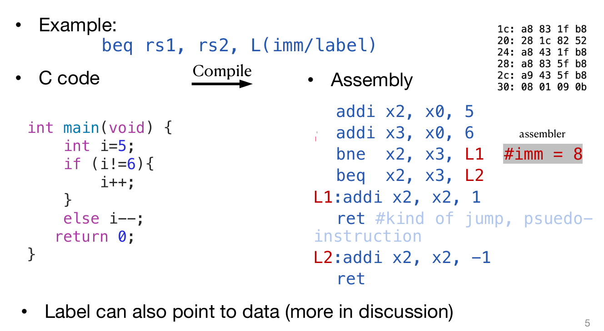

# RISC-V

## RISC-V

现在讲的这个RISC-V是干什么的？其实解决的就是如何将C语言代码，***转化为汇编语言程序，进而转化为机器语言（二进制）***！CPU的基本任务是执行一系列的指示，而指示都是一些较为基础的操作，而这些指示最最基本的其实就是改变计算机的状态。

> 注意：ARM是基于RISC（精简指令集计算机）架构，而x86是基于CISC（复杂指令集计算机）架构；这意味着ARM汇编代码中的指令和寄存器在x86 CPU上无法直接识别和执行

1. **与C或Java不同，汇编语言不能使用变量**
   - 高级编程语言如C或Java允许使用变量来存储数据和指令。变量可以是任何数据类型，如整数、浮点数、字符等，并且可以在程序中多次赋值和使用。
   - 汇编语言则不同，它是一种低级语言，直接对应于计算机的硬件指令。在汇编语言中，没有传统意义上的“变量”概念，而是使用寄存器（registers）来存储和操作数据。
2. **保持汇编/计算机硬件抽象简单**
   - 汇编语言提供了一种相对简单的硬件抽象。它比机器语言（直接用二进制或十六进制表示的指令）更易于理解和编写，但仍然非常接近硬件操作。
   - 这种简单的抽象使得程序员能够更直接地控制硬件，但同时也需要对硬件有一定的了解。
3. **汇编操作数是寄存器**
   - 在汇编语言中，操作数（operands）通常指的是参与运算的数据。与高级语言不同，汇编语言中的操作数通常是寄存器。
   - 寄存器是CPU内部的高速存储单元，用于存储指令和数据，以便快速访问和处理。
4. **有限数量的特殊位置/内存直接内置于CPU中**
   - 寄存器的数量是有限的，因为它们是CPU硬件的一部分。与内存相比，寄存器的数量较少，但访问速度更快。
   - 在RISC-V架构中，操作只能在这些寄存器上执行，这进一步强调了寄存器的重要性和高效性。

程序计数器（PC）寄存器用于存储当前正在执行的指令的地址，它在指令执行过程中自动更新，指向下一条指令。RISC-V架构中有32个通用寄存器，编号从x0到x31。x0通常用作零寄存器，其值永远是0。

**为什么选择32个寄存器？较小的寄存器集更快，但太小也不好**：寄存器的数量需要在速度和灵活性之间取得平衡。32个寄存器是一个折中选择，既保证了较快的访问速度，又提供了足够的灵活性来支持复杂的程序。每个RV32寄存器是32位宽。

在C语言中，声明一个变量的时候必须要声明类型，而且变量将会只能代表它所被声明的数值类型。但是在汇编语言中，寄存器没有类型，只是简单地储存0和1，而operation将会决定寄存器中的内容如何被对待。

在汇编语言中，每一条指示都会恰好执行a short list of simple commands，而assembly code中的每一行至多一个instruction. 

RISC-V指令集基于对立即数的处理，主要有四种核心指令类型（R-type, I-type, S-type, U-type）以及两种分支/跳转指令类型（B-type, J-type）。

## R-type（寄存器类型）

- **格式**：`funct7 | rs2 | rs1 | funct3 | rd | opcode`
- **特点**：这种类型的指令不包含立即数，操作数完全来自寄存器。
- **用途**：主要用于寄存器之间的算术和逻辑运算。

有两个操作数rs2 rs1，并且指定了输出存储的目标寄存器rd。且无法接触main memory。例如`add x5, x2, x1`就是将寄存器x5 x2中的两个数字进行相加然后放在x1。这里的函数不仅仅可以是`add`，也可以是`sub` 。`and or xor`是位运算，`and/or/xor rd, rs1, rs2`，Logically bit-wise `and/or/xor` the value stored in register `rs1` and that of  `rs2` and stores the result into register rd。

> `xor`一个全是1的二进制数字可以对另一个数字进行negation！

非常特殊地，还可以是：`sll srl sra`，代表位运算的`<< >> >>>`，其中`<< >>`的位移是`rs2`寄存器中二进制后五位所代表的数字。注意：`sra`和`srl`最大的区别是`srl`总是用0 padding，而sra使用符号位的数字padding！

`slt/sltu rd, rs1, rs2` equivalent to a = b < c ? 1 : 0, a ⇔ rd, b ⇔ rs1, c ⇔ rs2. Treat the numbers as signed/unsigned with  `slt/sltu`。

> Store if Less Than

## I-type（立即数类型）

- **格式**：`imm[11:0] | rs1 | funct3 | rd | opcode`
- **特点**：包含一个12位的立即数，用于需要立即数参与的运算，如加载、存储和算术运算。
- **用途**：适用于需要立即数的操作，如加法、减法等。

例如`addi x5, x4, 10`就是给x4寄存器中的数字加上10然后放进x5寄存器中。注意，imm是signed number，因此如果是负数的话需要补码操作再相加。`slli/srli/srai` shift rs1 by the lower  5-bits of imm, `srai` is distinguished by  using one of the higher bit of the imm (or  funct7 field).

特殊的是：**无操作指令（no-op）**：RISC-V有一个特定的无操作指令 `addi x0, x0, 0`，它不改变任何寄存器的值。这种指令可以用于填充空间、对齐数据或在跳转和链接操作中使用。

I-type还负责load的操作。处理器首先从内存中读取数据，然后将这些数据加载到寄存器中，以便快速访问和进一步处理。这是计算机执行程序时的一个基本步骤，因为程序中的指令和操作通常需要访问和操作存储在内存中的数据。下面介绍一些常见的命令：

**`lw rd, imm(rs1)`**：这条指令表示从地址`rs1 + imm`处加载一个字（32位，四字节）到寄存器`rd`中。

`lh/lhu rd, imm(rs1)`: Load signed/unsigned halfword at addr. to register rd(similar to lb/lbu)。（可见这三条命令的区别是load的大小不一样）

`lb/lbu` `rd, imm(rs1)`: Load signed/unsigned byte at `addr.` to  register `rd`

小例子：x0永远是0，所以x1是-1；然后x2和x1取或，因为x1是-1，也就是二进制全是-1，所以x2也全是-1；然后x3是-2，x4是1因为x3<x1；其次，x3右移一位，且补码为1，结果为二进制全是1，即-1，存放在x5；最后0-（-1）结果为1放在x4.

## S-type（存储类型）

- **格式**：`imm[12|11:5] | rs2 | rs1 | funct3 | imm[4:0] | opcode`
- **特点**：包含一个12位的立即数，用于存储操作（如加载和存储指令）。
- **用途**：用于加载和存储数据到内存。

 `sw rs2, imm(rs1)`: Store word at `rs2` to memory `addr.= (number in rs1) + imm`。

> 注意这里的imm的单位是字节，八位！而不是四位！

`sh`:Store lower 16 bits at `rs2`        `sb`:Store lower 8 bits at `rs2`

上面这个例子中：x12是取byte，地址是x5+1，因此是跳过了F6，剩下的数字是85，但是因为是load signed byte，作为一个8位的byte，最前面是符号位，10001001这个byte第一位是1，因此认为是负数，所以放入寄存器的时候符号位扩展是用1进行padding的，因此x12最终内容是0xFFFFFF85！

## B-type（分支类型）

- **格式**：`imm[12] | imm[10:5] | rs2 | rs1 | funct3 | imm[4:1] | imm[11] | opcode`
- **特点**：包含一个分支目标地址的立即数，用于条件分支指令。
- **用途**：用于实现条件跳转。

原来正常的操作是命令一条一条执行，但是在C语言中有if while等特殊的语句，因此B-type就是用来支持这种conditional branch的。

` beq rs1, rs2, L(imm/label`)，如果rs1中的值等于rs2中的，那么就跳转到L语句。类似地，有`bne(not equal) bge(greater or equal)`等。如下图中的例子：第三行是‘如果x2中的数不等于x3中的数，那么跳转到L1语句’；第四行是‘如果x2中的数等于x3中的数’。

接下来看一个实战中的汇编语言程序和C语言程序的对应：

首先假设A数列的首元素地址储存在了x8中，那么接下来一行一行来解释发生了什么：

1. 将x0 x8的值相加存到x9中，因为x0的值永远是零，所以相当于是x9里面也存了数列地址
2. 因为x0的值永远是零，所以相当于是将0储存到了x10的位置。这个值之后将会充当sum的角色
3. 在for循环中，i也是一个需要track的变量，所以和第二行类似，x11代表i
4. 遍历访问数组不能越界，因此需要记录下数组的长度，因此是I类型命令，将20储存在了x13，记录数组长度
5. 接下来进入了Loop: 首先判断x11数字是否大于等于x13，如果是那么就转到Done
6. 需要获取数组中对应位置的元素，因此需要lw命令，将x9地址的数据load过来存到x12里面
7. 然后x10（sum）数字和x12（数列元素）相加然后放进x10。
8. 之后x9储存的地址加4！这是因为一个int大小是32位四字节，内存中一个字节一个地址，因此是+4；这里是使用立即数类型命令
9. 最后，x11（i）需要加1，代表i，也代表循环的次数
10. j Loop，跳转会Loop
11. 如果`bge`命令那一行判断通过，那么会进入Done部分，里面的ret代表程序结束

## U-type（无符号立即数类型）

- **格式**：`imm[31:12] | rd | opcode`
- **特点**：包含一个20位的无符号立即数，用于需要大立即数的操作。
- **用途**：适用于需要大立即数的操作，如加载大立即数到寄存器。

## J-type（跳转类型）

- **格式**：`imm[20] | imm[10:1] | imm[11] | imm[19:12] | rd | opcode`
- **特点**：包含一个21位的立即数，用于跳转指令。
- **用途**：用于实现无条件跳转。

指令格式的共同点

- **rs1, rs2 和 rd 的位置**：尽管不同类型的指令格式不同，但源寄存器（rs1, rs2）和目标寄存器（rd）的位置是固定的。这种设计对硬件实现是友好的，因为它简化了硬件的解码逻辑。
