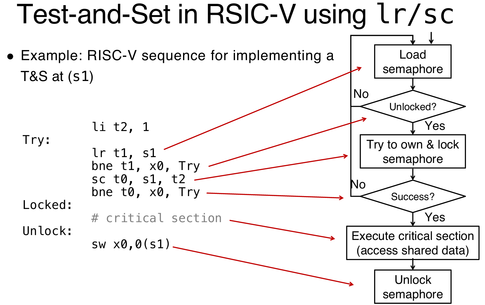

# Thread-Level Parallelism

## What is TLP?

### Overall

1. **线程的定义**

- **线程**（Thread）指的是**执行的单一指令流**，可以理解为程序执行中的最小单位。线程是进程中的一个执行流，它可以独立执行并且与其他线程并行处理。
- 一个进程可以包含多个线程，这些线程共享进程的资源（如内存、文件等）。

2. **每个线程包含的内容**

- 每个线程有自己的一些独特资源：
  - **寄存器**（Registers）：包括栈指针等，用于存储线程执行时的临时数据。
  - **程序计数器（PC）**：指示当前线程正在执行的指令的地址。
  - **共享内存**：线程之间共享堆内存（Heap）和全局变量，允许它们交换数据和通信。

3. **处理器的硬件线程**

- 每个处理器可以提供一个或多个**硬件线程**，通过多核（multi-core）或单核多线程（single-core multithreading）技术，能够同时执行多条指令流（线程）。
  - **多核处理器**：每个核心独立运行一个或多个线程，实现并行处理。
  - **单核多线程**：即使在单个处理器核心上，操作系统也能通过快速切换线程来模拟并行执行，这就是单核多线程技术。

4. **程序中的线程并发执行**

- 在同一个程序的进程中，线程可以**并发运行**。这意味着多个线程可以在同一时刻执行不同的任务，从而提高程序的效率。例如，一个线程可能在进行数据处理，另一个线程则可以处理用户输入。

5. **操作系统的线程调度**

- 操作系统（OS）会通过**多路复用**（multiplexing）将多个**软件线程**分配到可用的硬件线程上。换句话说，操作系统会将多个软件线程调度到不同的处理器线程上，确保程序中的各个任务可以尽可能同时执行。
- 操作系统的任务是管理和调度这些线程，确保它们能够有效地执行，并处理资源竞争、同步等问题。

6. **单线程与多线程的比较**

- **单线程进程**：一个进程只能执行一个线程，任务顺序执行。
- **多线程进程**：一个进程可以同时执行多个线程，允许并行处理多个任务，从而提高程序的执行效率。

下面的这张图片很好的展示了多线程：可以看到，原本的单线程中，也就是我们之前熟悉的流程中，一套的code data files储存，一套reg and stack；而在多线程中，依然是共用一套的code data files储存，但是每一个线程有自己的reg and stack for coordination


### Fork and Join

1. **Fork-Join 模型概述**

- **Fork-Join 模型**：一个程序或进程可以分裂成多个独立的线程（也叫子线程），这些线程理论上可以同时执行，从而实现并行处理。
- **工作原理**：
  - **Main thread**（主线程）：主线程会按顺序执行，直到第一个需要并行处理的任务区域。
  - **Fork**（分叉）：在执行到第一个并行任务时，主线程会创建多个并行子线程来处理这些任务。
  - **Join**（合并）：当所有子线程完成它们的并行任务区域后，它们会进行同步，并且终止，最终只剩下主线程继续执行。

2. **Fork-Join 模型的流程**

- **主线程的执行**：主线程首先按顺序执行，直到需要并行化的任务出现（例如，计算一个复杂任务时可以将其分解成多个部分，分别并行执行）。
- **Fork 操作**：主线程在到达并行任务区域时，通过**fork**操作将自己分裂成多个子线程。每个子线程负责执行任务的一个部分（例如图中的**Parallel task I**、**Parallel task II**和**Parallel task III**）。
- **Join 操作**：当所有的并行子任务（Parallel task I, II, III）完成后，它们会通过**Join**操作进行同步（也就是等待所有子线程完成它们的任务）。一旦所有子线程执行完成，它们会终止，最终仅剩下主线程继续执行后续的操作。

3. **Fork-Join 模型的图示说明**

- **Main thread（主线程）**：最开始执行的线程，负责启动并行任务。
- **Parallel task I、II、III**：表示主线程启动的并行任务区域，这些任务会由不同的子线程来执行。每个并行任务可以进一步细分为多个小任务（例如，任务A、B、C等）。这些任务会被分配到不同的子线程中进行并行执行。
- **Fork 和 Join**：图示中的**叉子**表示“Fork”操作，即主线程分裂为多个并行子线程；而**Join**则表示所有子线程完成并行任务后需要进行同步并合并的过程。

### OS Threads

操作系统（OS）在管理线程时的关键概念，特别是线程调度和上下文切换（Context Switches）的内容：

1. **操作系统（OS）线程管理的责任**

- *操作系统（OS）负责管理程序中的线程，决定哪个线程在**哪个CPU**上运行。*
  - **线程管理**是操作系统的重要任务之一，尤其在现代计算机中，操作系统需要确保多个线程在多个处理器核心（CPU）上被有效地分配和调度。

2. **现代计算机中的线程数量与核心数量的关系**

- **大多数现代计算机**中，*活跃的线程数远大于可用的处理核心数，因此大多数线程在任何给定时刻都是**空闲**的。*

3. **上下文切换（Context Switches）**

- **上下文切换**是操作系统在多线程环境下执行的一个关键操作，它允许操作系统在不同的线程之间切换，确保多个线程能在有限的处理器资源上得到执行。

- **操作系统的功能**：

  - 操作系统可以**选择**要运行的线程，并在任何时候切换到另一个线程。
  - 当操作系统决定切换线程时，它会**暂停当前线程的执行**，将该线程的**寄存器**和**程序计数器（PC）保存到内存中，这个过程叫做保存上下文**。

  > 这是十分最重要的内容！因为之前说了，每一个线程有自己的reg and stack，*这些内容又只能由对应的processor保管和处理*，因此当这个线程脱离这个processor的时候，这些内容应该保管起来

  - **寄存器**：保存线程运行时的临时数据，程序计数器（PC）存储当前执行的指令地址。
  - **内存中的共享线程数据**：来自同一程序的线程共享相同的内存空间，因此切换线程时需要确保线程数据的一致性。

4. **如何切换线程**

- 操作系统可以通过以下过程**切换线程**：
  - **移除当前线程**：操作系统会停止当前线程的执行，并将当前线程的寄存器值和程序计数器保存到内存中，等待后续恢复。
  - **共享内存**：来自同一程序的多个线程共享内存（如堆和全局变量），这使得线程切换时，线程之间的通信更加高效。
  - **激活另一个线程**：操作系统通过将另一个线程的寄存器加载到硬件线程的寄存器中，恢复该线程的执行。例如，当一个线程在等待网络访问或用户输入时，操作系统可以选择切换到另一个不被阻塞的线程，继续执行。

## OpenMP

### Overall

1. **OpenMP的概述**

- **OpenMP**（Open Multi-Processing）是一个为多线程并行处理设计的编程语言扩展，主要用于支持**共享内存并行性**。
- 它通常遵循**Fork-Join**模型，也就是程序在某一时刻会分叉出多个线程（Fork），这些线程并行执行任务，执行完毕后再合并（Join）。
- OpenMP适用于需要利用共享内存架构的并行计算，例如**多核处理器**。

2. **可移植性与标准化**

- **OpenMP**是**可移植**且**标准化**的，这意味着你可以在不同平台上使用OpenMP，只要该平台支持OpenMP标准，它就能正常工作。不同的操作系统和编译器都可以实现这个标准，从而确保OpenMP程序能够跨平台运行。

3. **易于编译**

- **OpenMP**编程非常简单，编译过程也很容易：
  - 在代码中使用`#include <omp.h>`来引入OpenMP的库。
  - 使用**`#pragma omp`**指令来指定哪些部分需要并行执行。例如，`#pragma omp parallel`是用来标记并行区域的指令。
  - 编译时，使用`cc -fopenmp name.c`命令来启用OpenMP编译，`-fopenmp`标志使编译器支持OpenMP扩展。

4. **关键概念**

- **共享变量与私有变量**：
  - OpenMP中的变量可以是**共享的**（所有线程共享同一内存空间）或者是**私有的**（每个线程有自己的副本）。理解这些变量的作用对并行编程至关重要，因为它关系到线程之间的数据同步和通信。
- **OpenMP指令**：
  - **并行化与工作共享**：OpenMP允许你用指令将代码分成多个并行执行的部分，使得不同的线程可以处理不同的任务。例如，`#pragma omp parallel`可以使一段代码在多个线程中并行执行。
  - **同步**：OpenMP还提供了一些机制来管理线程之间的同步，确保不同线程在并行执行时不会发生冲突，避免出现竞争条件。

### Code Example

````C
#include <stdio.h>
#include <omp.h>

int main() {
    /* Fork team of threads with private variable tid */
    #pragma omp parallel
    { // Note
        int tid = omp_get_thread_num(); /* get thread id */
        printf("Hello World from thread = %d\n", tid);
        
        /* Only main thread does this */
        if (tid == 0) {
            printf("Number of threads = %d\n", omp_get_num_threads());
        }
    } /* All threads join main and terminate */
    return 0;
}
````

> Note：使用了`#pragma omp parallel`之后，必须使用一对括号；***而且这个两个括号每个都必须单独一行！***

当程序执行到 `#pragma omp parallel` 时，OpenMP会将这段代码的执行分配给多个线程。在默认情况下，每个线程会执行这段代码中的所有语句。

具体来说，程序在并行区域内会为每个线程创建一个执行实例（每个线程都有一份代码的副本）。每个线程独立执行同样的代码，但每个线程会有不同的**线程ID（`tid`）**，这使得它们的行为可能有所不同。例如，每个线程打印它自己对应的线程ID。

### OpenMP: Threads

**OpenMP**根据环境变量`OMP_NUM_THREADS`指定的值创建线程。通过设置这个环境变量，用户可以指定程序在执行时使用的线程数量。

- 例如，如果你想使用最大数量的线程，可以将这个变量设置为你希望使用的线程数。操作系统和硬件可以影响这个值。

**默认线程数量**：通常，OpenMP默认的线程数是**物理核心数 × 每个核心的线程数**。例如，如果你有6个物理核心，每个核心支持2个线程，那么OpenMP会默认创建12个线程。

- 你可以使用`lscpu`命令来查看你的系统的物理核心数量以及每个核心的线程数。然后，OpenMP会根据这些信息计算线程总数。

**OpenMP线程**是操作系统管理的（软件）线程，这些线程会被**多路复用**到可用的硬件线程上。

- 操作系统会在硬件线程（如多核处理器的核心）之间分配这些软件线程，以实现并行执行。尽管硬件可能有多个核心，但操作系统会根据需要将软件线程分配给硬件线程。

几个常见的OpenMP内置函数，用于管理线程的创建、获取和线程ID。

- **`omp_set_num_threads(x)`**：该函数设置程序使用的线程数。通过调用此函数，可以指定你希望OpenMP并行区域使用多少个线程。例如，`omp_set_num_threads(4)`表示使用4个线程。
- **`num_th = omp_get_num_threads();`**：这个函数返回当前并行区域中的线程总数。你可以通过调用这个函数来查询当前正在使用的线程数量。
- **`th_ID = omp_get_thread_num();`**：这个函数返回当前线程的线程ID。每个线程在并行执行时都有一个唯一的ID，可以用来标识不同的线程。

### Shared and Private Variables in OpenMP

OpenMP中的**共享变量（Shared Variables）**和**私有变量（Private Variables）**的概念:

1. **共享变量（Shared Variables）**

- **共享变量**是指所有线程都可以**读写同一个变量**。这种类型的变量在多个线程之间是共享的，因此修改该变量的值会影响到所有线程。

- **共享变量的特性**：

  - **声明在并行区域外的变量**：如果变量在并行区域外被声明，***它默认是共享的***。
  - **堆分配的变量**：例如通过`malloc`分配的内存，这类变量通常是共享的。
  - **静态变量**：如果变量是静态的，它也会在所有线程之间共享。

- 例如，以下代码中的`var1`和`var3`是共享变量：

  ```
  int var1, var2;
  char *var3 = malloc(...);
  #pragma omp parallel private(var2)
  {
      // var1是共享的
      // var2是私有的
      // var3是共享的（堆分配）
  }
  ```

2. **私有变量（Private Variables）**

- **私有变量**是指每个线程都有自己的一份副本。每个线程在执行时会使用它自己独立的副本，互不干扰。这样，多个线程可以并行地执行代码，而不会发生变量的共享冲突。

- **私有变量的特性**：

  - **声明在并行区域内部的变量**：在`#pragma omp parallel`指令块内声明的变量，默认是私有的。
  - 每个线程会有独立的**堆栈帧**（stack frame）来存储这些私有变量的副本。

- 例如，代码中的`var2`和`var4`是私有变量：

  ```
  #pragma omp parallel private(var2)
  {
      int var4;
      // var2 是私有的
      // var4 是私有的（线程堆栈）
  }
  ```

3. **代码中的示例**

```
int var1, var2;
char *var3 = malloc(...);
#pragma omp parallel private(var2)
{
    int var4;
    // var1 shared (默认共享)
    // var2 private
    // var3 shared (堆分配)
    // var4 private (线程堆栈)
}
```

- **`var1`** 是共享的，因为它在并行区域外声明，并且没有显式指定为私有。
- **`var2`** 是私有的，因为它在`#pragma omp parallel`中被显式指定为`private`。

> 在 `private(var2)` 的情况下，线程会拥有 `var2` 的独立副本，修改这个副本时不会影响外部的共享变量 `var2`

- **`var3`** 是共享的，因为它是堆分配的，堆内存是共享的。
- **`var4`** 是私有的，因为它是在并行区域内声明的局部变量，并且每个线程都有自己的副本。

### OpenMP Work-sharing for Syntax

**`#pragma omp for` 指令**

- **`#pragma omp for`** 是用于并行化 **`for` 循环** 的 OpenMP 指令，它告诉编译器将循环的迭代任务分配给多个线程来并行执行。
- **必须放置在已经存在的并行区域内**：
  - `#pragma omp for` 必须放在 `#pragma omp parallel` 的并行区域中，即循环的并行化必须是在并行区域内完成的。
- **如果并行区域仅包含一个 `for` 循环，** 可以将 `#pragma omp parallel` 和 `#pragma omp for` 结合起来

- 要能够成功地并行化循环，循环本身必须具有相对简单的“**形状**”，这是因为 OpenMP 编译器需要知道如何将循环的迭代分配给各个线程。
- 例如，**迭代次数**必须是明确的，OpenMP 编译器才能确定将多少迭代分配给每个线程进行并行执行。
- **必要条件**：
  - 循环必须是“常规的”，即没有复杂的条件语句或跳转。循环的迭代必须是线性的，可以均匀分配给各个线程。例如，`for` 循环的结束条件应该明确且可计算。

- **不允许在循环中提前退出**，即禁止使用 `break`、`return`、`exit` 或 `goto` 等语句。这是因为 OpenMP 在并行化时需要知道每个线程需要执行多少次迭代。如果程序在循环中提前退出，编译器将无法确定如何合理分配剩余的迭代给线程。
- **示例**：如果你在并行 `for` 循环中使用了 `break`，OpenMP 可能无法正确分配剩余的循环任务，从而导致线程间的冲突或资源浪费。

````C
#pragma omp parallel
{
    #pragma omp for
    for (int i = 0; i < LENGTH; i++) {
        arr[i] = ...;
    }
}
// Equivalent Style
#pragma omp parallel for
for (int i = 0; i < LENGTH; i++) {
    arr[i] = ...;
}
````

### Data Race

1. **数据竞争（Data Race）**

- **数据竞争**发生在多个线程同时访问同一内存位置时，且至少有一个线程执行写操作。具体来说：
  - **两个内存访问来自不同线程**。
  - **至少一个线程是写操作**（即修改内存中的数据）。
  - 这两个访问操作**发生在彼此之后**（例如，一个线程先读取变量值，另一个线程稍后写入新值，导致不同线程的操作之间没有同步，造成不确定性）。
- **线程模型：共享内存**：
  - 在共享内存模型中，多个线程可以访问同一块内存区域。
  - 在这种情况下，当多个线程并发访问同一数据时，没有适当的同步机制（如锁、信号量等），就可能发生数据竞争。
- **非确定性**：
  - 由于线程调度的非确定性，不同的线程执行顺序可能不同，导致访问顺序不同，从而可能引发数据竞争。例如，线程 A 先读 `x` 的值，然后线程 B 修改 `x` 的值，但线程 A 没有获取到更新后的值，这种情况就是数据竞争。
  - 数据竞争会导致程序的执行结果不可预测，可能每次运行都产生不同的结果。

2. **数据竞争与数据危害的区别**

- **数据危害（Data Hazard）** 是在流水线并行执行（如指令级并行）中，顺序执行的指令在并行执行时发生数据依赖。数据危害通常与处理器指令的执行顺序有关，可能会导致错误的执行结果。
  - 例如，如果一个指令需要读取前一个指令的结果，但前一个指令还没有执行完毕，就会产生数据危害。
- **数据竞争与数据危害的区别**：
  - **数据竞争**发生在并行执行时，多个线程对同一数据的访问没有同步，导致结果不确定。
  - **数据危害**发生在单个程序中，指令在执行时发生依赖，且没有正确的调度和同步机制来避免错误。

3. **例子说明**

- 在多线程编程中，可能会遇到以下代码：

  ```
  int x = 0;
  #pragma omp parallel
  {
      x = x + 1;  // 多个线程同时执行这行代码
  }
  ```

  在这种情况下，如果没有适当的同步机制，每个线程都会读取 `x` 的值，增加它，然后将新值写回去。由于线程之间的执行顺序不确定，可能有一个线程读取 `x` 的值，而另一个线程修改了它的值，导致结果不一致，这就是一个典型的数据竞争。

### Example of Data Race：


## Synchronization

### Why Synchronization?

1. **同步的必要性**

- 为了保证多线程程序的正确性，我们通常需要**同步线程**，也就是协调各个线程的执行。
- **同步**是为了确保线程在并行执行时不会因访问共享资源而发生错误。例如，确保一个线程在写入数据后，另一个线程才可以读取这些数据。

2. **线程同步的常见应用**

- 最常见的同步场景是：**知道某个任务什么时候完成写入，确保另一个线程读取数据时是安全的**。
- 例如，线程 A 需要向某个共享变量写入数据，线程 B 需要读取该数据。为了确保线程 B 获取到正确的、最新的数据，必须确保线程 A 的写入操作在 B 的读取操作之前完成。这个过程需要通过同步来实现。

3. **正确的执行顺序**

- **期望的正确结果**：有一系列操作：

  ````txt
  load -> addi -> store
  ````

  - `load`：从内存读取数据。
  - `add`：执行加法操作。
  - `store`：将结果存回内存。

- 在理想情况下，应该保证以下两种操作的顺序：

  - **加载数据**（`load`）应该在执行加法操作（`add`）之前。
  - **加法操作**（`add`）应该在存储结果（`store`）之前。

- 这四个步骤（`load`、`add`、`store`）应该按照某种**顺序**进行执行，但由于多线程并行的特点，操作顺序可能会发生改变，导致不正确的结果。因此，执行这些操作时需要确保有正确的同步，以避免数据竞争。

4. **操作顺序的多种可能性**

- **理想的执行顺序**是：`load` -> `add` -> `store`，但由于多线程执行，实际上会出现这些操作的**不同排列**（`permutation`），也就是这四个操作可以有不同的执行顺序，但我们希望最终的结果是正确的。

5. **Amdahl 定律**

- **Amdahl 定律**：如果强制执行线程之间的同步，最终的执行效果会趋近于串行执行。也就是说，虽然多线程本来能加速程序的执行，但如果过多地依赖同步，程序的并行优势就会减弱，甚至可能导致性能下降。

> ***这句话直觉上是很有道理的***

- Amdahl 定律指出，如果在并行计算中存在大量的串行部分（例如同步机制），那么并行化的整体加速效果是有限的。***同步虽然保证了线程安全，但也引入了额外的开销。***

### Critical Sections with OpenMP

1. **临界区（Critical Section）的定义**

- **临界区**是指一段代码，这段代码必须由**单个线程**在某一时刻执行，确保在同一时刻只有一个线程能够执行该段代码。
- 在多线程编程中，如果多个线程需要访问共享资源，并且这些线程的操作可能会相互干扰（例如同时修改同一变量），就需要使用**临界区**来确保每次只有一个线程可以执行这段代码，避免并发问题和数据竞争。

2. **OpenMP中的临界区**

- 在OpenMP中，你可以通过特定的指令来声明代码的**临界区**。
- 例如，使用 `#pragma omp critical` 指令可以标记代码块，确保只有一个线程能够执行该部分代码。
- 这样，**每个线程**在执行临界区时，能够确保它是唯一执行该部分代码的线程，不会有其他线程同时进入该区域。

3. **用户级别的同步**

- OpenMP的临界区机制是一种**用户级别的同步**机制，它依赖于硬件的同步指令来确保线程安全。
- 例如，在RISC-V等硬件架构中，硬件提供了同步指令来确保线程按正确的顺序访问共享资源。

4. **相关指令**

- **`#pragma omp barrier`**：这个指令强制所有线程等待，直到所有线程都到达**屏障**（barrier）为止。屏障是一种同步机制，只有当所有线程都执行到屏障处，才能继续执行后续的代码。
- **`#pragma omp critical`**：这个指令在并行代码段中创建一个临界区，**确保同一时刻只有一个线程能够执行临界区中的代码**。其他线程在进入临界区时会被阻塞，直到当前线程执行完毕。

5. **临界区的作用**

- **线程同步**：临界区的目的是保证在同一时刻只有一个线程能够访问共享资源，避免不同线程同时修改同一资源时产生的竞态条件（Race Condition）。
- **性能影响**：虽然临界区确保了线程安全，但它也可能影响程序性能，因为多个线程可能会在临界区内等待，导致资源利用率下降。因此，在设计并行程序时，应谨慎使用临界区，避免过多的线程阻塞。

见下面这个例子：

````C
#include <stdio.h>
#include <omp.h>

int main() {
    int x = 0;  // shared variable
    #pragma omp parallel
    {
        int tid = omp_get_thread_num();  // private variable
        #pragma omp critical
        {
            x++;
            printf("Hello World from thread = %d, x = %d\n", tid, x);
        }
        #pragma omp barrier
        if (tid == 0) {
            printf("Number of threads = %d\n", omp_get_num_threads());
        }
    }
    return 0;
}
````

将会预期的是：前面首先全都是输出x的打印，并且x递增；然后当`x=thread数量`的时候，才会出现打印thread数量。

6. atomic instructions

- OpenMP 会将临界区中的代码编译成**原子指令（atomic instructions）**，这些指令支持线程间的同步。通过使用原子指令，可以保证多个线程安全地访问共享资源，避免并发问题。
- **同步**确保了线程之间的操作顺序，以便不同线程在正确的时机读取和写入共享数据。

7. **OpenMP 的并行限制**

- OpenMP 的并行机制具有**非常严格的并行性限制**，尤其是它通常**只适用于循环的并行化**。这意味着 OpenMP 更适合用于将程序中的循环任务并行化，以提高执行效率。
- 对于复杂的代码结构或大量的共享资源，OpenMP 的并行能力可能不足。

8. **死锁（Deadlock）的风险**

- 如果没有妥善地定义临界区，可能会导致**死锁**。死锁是指两个或多个线程在等待对方释放资源时互相阻塞，最终造成程序无法继续执行。
- 如果多个线程使用不同的锁进行同步，而这些锁没有适当的顺序或机制，可能会发生死锁，导致程序完全卡住。

## Lock Synchronization

### Concept

**锁同步（Lock Synchronization）**是实现线程同步的一种方法：

1. **锁同步的概念**

- **锁（Lock）**用于授权一个线程进入临界区（Critical Section）。只有获得锁的线程才能访问临界区，确保在任何时刻只有一个线程能够操作临界区的资源。
- **共享内存**：所有线程都需要能够访问到锁，因此通常会将锁存储在共享内存中，以便多个处理器都能访问和检查锁的状态。

2. **锁的状态**

- 线程会读取锁的状态，判断锁是否被占用。如果锁被占用，线程将会等待；如果锁没有被占用，线程会设置锁并进入临界区执行操作。
- **锁的状态值**：
  - **0**：锁是“开放的/未锁定/未关闭”。
  - **1**：锁是“已锁定/关闭”的。

锁的状态可以通过特定的内存地址来表示

3. **实现线程同步的步骤**

- **检查锁**：线程首先检查锁的状态。如果锁没有被占用，线程就可以进入临界区。如果锁已经被其他线程占用，线程将继续等待。
- **设置锁**：当线程获得锁时，它会设置锁状态为“已锁定”（通常是设置为 1），并进入临界区执行操作。
- **执行临界区操作**：线程在临界区内执行操作，通常是修改共享变量或者其他需要同步的数据。
- **释放锁**：线程执行完临界区的操作后，必须**释放锁**，将锁的状态设置为“未锁定”（通常是设置为 0），以允许其他线程进入该临界区。

4. **伪代码示例**

- 以下是一个实现锁同步的伪代码：

  ```
  检查锁
  如果锁被占用，则等待
  设置锁
  执行临界区操作（例如修改共享变量）
  释放锁
  ```

5. **注意事项**

- 锁同步确保了多个线程在执行共享资源操作时不会互相干扰，因此可以避免数据竞争（Data Race）问题。
- 然而，如果锁的粒度过大，或锁的使用不当，可能会导致性能下降。多个线程可能会因为等待锁而空闲，造成**性能瓶颈**。

### Realization

### Naive Solution

RISC-V中一种可能的实现方式：

````assembly
Get_lock: 
  addi t1,zero,1    # t1 = 锁定值
  Loop: 
  lw t0,0(s0)       # 加载锁的状态
  bne t0,zero,Loop  # 如果锁已经被占用，继续等待
  Lock: 
  sw t1,0(s0)       # 锁为空闲状态，设置锁
Unlock:
  sw zero,0(s0)    # 释放锁，设置锁为空闲状态
````

这种锁的实现方式存在问题，主要体现在两个线程并发获取锁时可能会出现冲突，导致程序无法保证排他性访问。具体的问题如下：

- **线程1**和**线程2**都尝试获取锁，它们都在各自的 `Loop` 部分检查锁的状态。
- 假设两个线程几乎同时执行，当它们都检查到锁的状态是未被占用（即锁为 0），它们都认为自己已经获取了锁并进入临界区。
- 这种情况导致**两个线程都认为自己已经设置了锁**，并且都能够进入临界区，这样就没有实现对共享资源的独占访问。

### Hardware

1. **硬件同步的必要性**

- 在并行计算中，为了避免一个线程在另一个线程的操作间隙修改共享资源的值，必须**依赖硬件支持**来保证同步。
- **同步的核心目标**是确保在对共享内存进行读取和写入操作时，不允许其他线程在此过程中介入，以保证操作的原子性。

2. **原子读/写内存操作**

> 重要！

- **原子操作**是指读写操作是不可中断的，整个操作会作为一个单独的步骤执行，不会被其他线程的操作干扰。
- 在执行原子读/写时，**所有其他操作必须严格发生在读/写操作之前或之后**，而不能与之重叠。这确保了内存的值在操作过程中不被更改。
- **禁止其他线程访问该内存位置**，直到当前线程完成对该位置的读或写操作。这意味着，如果一个线程正在执行对某个内存位置的原子操作，其他线程不能同时访问或修改该内存位置。

3. **如何在软件中实现**

- **单条指令**：通过原子指令实现寄存器和内存之间的交换。这类操作是硬件提供的原子操作，通常是特定的机器指令，能够保证数据交换是原子的。
  - 例如，通过原子交换（atomic swap）指令，可以在不被中断的情况下将寄存器中的数据和内存中的数据交换。
- **指令对**：另一种方式是使用一对指令，一条用来读取并设置锁，另一条用于写入并释放锁。通过这种方式，可以实现对内存操作的原子性。
  - 第一个指令执行读操作并锁定内存位置，第二个指令执行写操作并解锁内存位置。

4. **单处理器系统中的需求**

- 即使是在**单处理器系统**中，硬件同步也是必要的。因为即使没有多核处理器，系统也可能会因**中断**而发生线程上下文切换。中断可能会在任意时刻发生，导致当前正在执行的线程被暂停，换成其他线程继续执行，这就需要原子操作来确保数据的一致性和安全性。
- 即使是单个处理器，**线程上下文切换**也可能发生，因此需要硬件提供同步机制，确保在临界区的操作不会受到中断的影响。

### Two solutions in RISC-V

#### Read/Write Pairs

**读/写对（Read/Write Pairs）**

- 这种方法依赖于两个原子操作来实现同步：

- **加载保留指令（Load-Reserved，`lr`）**：
  - `lr rd, rs`：从由 `rs` 指向的内存地址加载一个双字（word）到寄存器 `rd` 中，并为硬件线程注册一个保留。
- **条件存储指令（Store-Conditional，`sc`）**：
  - `sc rd, rs1, rs2`：只有在先前的 `lr` 指令所保留的内存地址没有被修改时，`sc` 才会将寄存器 `rs2` 的值存储到 `rs1` 所指向的内存位置。`sc` 指令会返回一个状态到 `rd`，如果内存位置未发生改变（即保留仍然有效），则返回成功，否则返回失败。
  - `sc` 的执行成功与否取决于在 `lr` 和 `sc` 之间的内存地址没有被其他线程修改。

- **问题**：

  - 这两个指令结合使用时，通过 `lr` 和 `sc` 实现了一个基本的锁操作，但如果有其他线程在 `lr` 和 `sc` 之间修改了内存位置，`sc` 会失败。

- **示例**：

  - **原子交换**（用于测试/设置锁变量）：

    ```
    try:
        lr t1, s1          # load reserved
        sc t0, s1, s4      # store conditional
        bne t0, x0, try    # 如果 sc 失败，重新尝试
        add s4, x0, t1     # 将值加载到 s4
    ```

  - `lr` 指令加载锁状态，`sc` 指令尝试修改锁的值。如果在 `lr` 和 `sc` 之间，其他线程修改了锁的值，`sc` 会失败，程序会重试。

2. **测试与设置（Test-and-Set）**

> 其实就是一种操作的paradigm




#### Atomic Memory Operations (AMOs)

1. **RISC-V 原子内存操作（AMOs）**

- **原子内存操作（AMO）**：原子内存操作允许在内存和寄存器之间执行一个原子的操作，即在操作过程中不会被中断或干扰。
- **指令格式**：AMOs 在 RISC-V 中通过 R 类型指令格式实现，常见的操作包括：
  - `AMOSWAP rd, rs2, (rs1)`：原子交换，`rd` 会接收 `rs1` 指向的内存位置的旧值，而 `rs2` 的值会被写入到该位置。
  - `AMOADD rd, rs2, (rs1)`：原子加法，`rs1` 指向的内存值会与 `rs2` 相加，结果存回该内存地址，并将旧值存入 `rd`。
- **操作过程**：
  - 通过 AMOs 指令，可以将寄存器中的值与内存中的值进行原子操作。
  - AMOs 确保对内存的修改操作是原子的，不会被其他线程或操作打断。

2. **原子交换（Atomic Swap）作为基础操作**

- 这种方法提供了 **原子交换**（Atomic Swap）作为基础操作，允许在内存和寄存器之间交换数据。
- 除了原子交换，AMOs 还支持许多常见的**归约操作**（例如加法、最大值、最小值等），这些操作在并行程序中是非常有用的，并且能够高效地实现。

3. **AMO 示例：锁的实现**

````assembly
# 假设锁存储在内存位置 a0
li t0, 1            # 将 1 加载到寄存器 t0，用于设置锁

Try:
    amoswap.w.aq t1, t0, (a0)  # 执行原子交换，将 t0 的值（1）写入 a0 指向的内存位置，并将该位置的旧值存入 t1
    bnez t1, Try             # 如果 t1 非零，表示锁已被占用，跳转到 Try 重试
    # 锁成功获取，可以进入临界区，进行共享数据的访问操作
    # 临界区操作代码在此处编写

    amoswap.w.rl x0, x0, (a0)  # 释放锁，将 0 存回 a0 指向的内存位置，表示释放锁
````

- **假设锁存储在内存位置 `a0`** 中（这意味着锁的状态保存在 `a0` 所指向的内存地址）。
- 锁的值为 `1` 时表示锁已经设置（即线程持有锁），值为 `0` 时表示锁处于“空闲”状态（即初始状态或未被任何线程占用）。

锁获取和释放过程：

- **获取锁**：
  - `li t0, 1`：将 `1` 加载到寄存器 `t0`，用于设置锁。
  - `amoswap.w.aq t1, t0, (a0)`：使用 `AMOSWAP` 指令将 `t0` 的值（即 `1`）写入 `a0` 指向的内存位置，并将该内存位置的旧值（锁的状态）加载到 `t1`。
  - `bnez t1, Try`：如果 `t1` 的值为非零（即锁已经被设置，值为 `1`），则跳转到 `Try` 标签，重试获取锁。这是因为 `amoswap.w.aq` 会返回锁的旧值，如果该值为 `1`，说明锁已经被占用，当前线程需要重试。
  - `… critical section goes here …`：如果成功获取到锁，线程就可以进入临界区执行操作。
- **释放锁**：
  - `amoswap.w.rl x0, x0, (a0)`：使用 `AMOSWAP` 指令将 `0` 存回 `a0` 指向的内存位置，表示释放锁。这里使用 `x0` 作为寄存器，它的值是 `0`，表示释放锁。

> 在 RISC-V 架构中，`.aq` 和 `.rl` 是原子内存操作（AMO）指令的一部分，它们用于确保指令执行的**原子性**。这两个后缀代表了不同的操作模式，分别用于**获取锁**（acquire）和**释放锁**（release）。