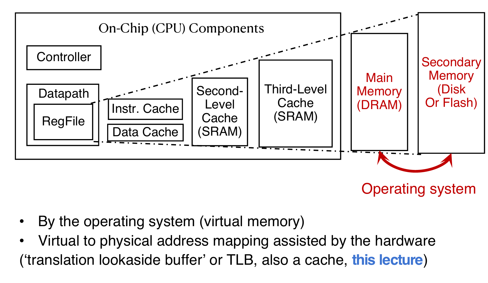

# Virtual Memory

## Intro

在操作系统中，超级模式（Supervisor Mode）是一种特权模式，用于运行操作系统内核代码。然而，这种模式并不能完全隔离应用程序（Applications）之间以及应用程序与操作系统（OS）之间的交互。一个应用程序可能会无意或恶意地覆盖另一个应用程序的内存，或者操作系统本身的内存。例如，可能会覆盖稀疏数据结构（Sparse Data Structures），导致内存不足的问题。

因此解决方案是虚拟内存：虚拟内存是一种机制，它为每个进程提供了一个独立的内存空间的假象（Illusion）。即使物理内存是有限的，每个进程都认为自己拥有一个完整的、独立的内存空间。

**核心作用**：

- **保护（Protection）**：防止进程之间相互干扰，保护操作系统不被应用程序破坏。

- **翻译（Translation）**：将进程的虚拟地址（Virtual Address）映射到物理地址（Physical Address）。
- **分页（Paging）**：将内存分成固定大小的页面（Pages），通过页面表（Page Table）管理虚拟地址到物理地址的映射。

在五级流水线中，虚拟内存的地址翻译由memory controller负责，它完成虚拟地址到物理地址的映射。

那么为什么需要VM？在现代计算机体系中，让CPU访问磁盘（magnetic disks）的速度较慢，而访问cache等非常快，那么这样效率就会非常低。而VM就是为了解决这个问题：

在内存结构中引入一个抽象层，从而解决CPU与磁盘之间的连接问题。它允许操作系统将部分数据存储在磁盘上（例如通过页面交换），但对应用程序来说，仍然像是直接访问主存（RAM）。这大大提高了内存使用的灵活性和效率。

同时，在一个直线布局的内存中，地址从00000000到FFFFFFFF，是完全连续的，但是在物理内存中并不一定是连续的。而VM的好处就是让程序员直接操作虚拟内存地址即可。并且每个进程认为自己拥有整个内存空间（0x0000 0000到0xFFFF FFFF），与其他进程完全隔离，避免了内存冲突。

总而言之，动机如下：

## Motivation

**动机1：连接内存层次结构（Adding disks to the memory hierarchy）**

- **背景**：现代计算机系统中，内存层次结构（Memory Hierarchy）包括寄存器、缓存、主存（RAM）、固态闪存和磁盘等。CPU访问寄存器很快，但访问磁盘很慢，二者速度差距巨大。
- **虚拟内存的作用**：虚拟内存通过分页机制（Paging）将磁盘作为内存的扩展，允许操作系统将不常用的页面（Pages）存储到磁盘上，弥合CPU和磁盘之间的速度差距（即“connect” memory and disk）。

**动机2：简化应用程序的内存管理（Simplifying memory for applications）**

- **直线内存布局（Straightforward memory layout）**：虚拟内存让应用程序看到一个连续的地址空间（从0x0000 0000到0xFFFF FFFF），包括代码段（Code）、静态数据段（Static Data）、堆（Heap）和栈（Stack），这在之前的PPT中已经提到。
- **用户空间隔离（User-space applications think they own all of memory）**：每个应用程序认为自己独占整个内存空间，不需要关心其他进程或物理内存的实际分布。
- **虚拟视图（Virtual view of memory）**：虚拟内存为应用程序提供了一个抽象的内存视图，简化了开发过程。

**动机3：进程之间的保护（Protection between the processes）**

- **问题**：如果没有虚拟内存（即“bare”系统），应用程序直接使用物理地址（Physical Addresses）进行加载和存储（Loads/Stores）。这意味着一个程序可以访问任何内存地址，包括不属于自己的内存区域。
- **后果**：这种缺乏隔离的方式会导致一个程序意外或恶意地访问其他程序的内存，甚至破坏操作系统的内存，引发系统崩溃或安全问题。
- **虚拟内存的解决方案**：通过为每个进程分配独立的虚拟地址空间，虚拟内存确保进程之间相互隔离，防止未经授权的内存访问。

## Address Translation

### Basics

Virtual Address Space - the set of addresses that the user program knows about

Physical Address Space - the set of addresses that map to actual physical cells in memory

1. 两种地址空间的定义：
   - 虚拟地址空间（Virtual Address Space）：
     - 这是用户程序（应用程序）看到的地址空间。
     - 应用程序操作的地址是虚拟地址（Virtual Addresses），例如0x0000 0000到0xFFFF FFFF（32位系统）。
     - 用户程序并不知道这些地址最终映射到哪里，只知道它们可以访问这个地址范围。
   - 物理地址空间（Physical Address Space）：
     - 这是实际内存硬件（RAM）使用的地址空间。
     - 物理地址（Physical Addresses）直接对应于内存中的物理存储单元。
2. 隐藏物理地址空间（Hidden from user applications）：
   - 用户程序无法直接访问物理地址，物理地址空间对应用程序是不可见的。
   - 这种隐藏机制是虚拟内存的核心，确保应用程序只能通过虚拟地址操作内存。
3. 地址翻译的必要性（Mapping between address spaces）：
   - 由于应用程序使用虚拟地址，而内存硬件需要物理地址，因此需要一种机制在虚拟地址和物理地址之间进行映射。
   - 翻译机制（Translation Mechanism）：
     - 虚拟内存系统由操作系统（OS）控制，所有的地址访问（例如加载和存储）都会经过一个翻译过程。
     - 翻译通常通过页面表（Page Table）完成，虚拟地址被映射到物理地址后，才能访问主存（DRAM）。

### Dynamic Address Translation

1. 动机（Motivation）：
   - 多任务处理（Multiprogramming, multitasking）：
     - 现代操作系统希望同时运行多个程序（more than one process can reside in main memory at the same time）。
     - 例如，多个程序（如Prog.1、Prog.2和OS）共享物理内存，需要一种机制管理这些程序的内存访问。
   - 位置无关编程（Location-independent programs）：
     - 程序应该能够独立于其在物理内存中的实际位置运行，不受其他程序位置的影响。
   - 需求：
     - **基址寄存器（base register）**：为每个程序添加一个基址，确定其在物理内存中的起始位置。
     - **边界寄存器（bound register）**：检查访问范围，确保程序不会越界访问其他内存区域。
     - **独立性（Protection）**：不同程序不应无意中相互影响。
2. 实现方式：
   - **动态地址翻译**：通过基址和边界寄存器，操作系统（OS）或超级模式（supervisor mode）软件将程序的逻辑地址（Logical Address）翻译成物理地址（Physical Address）。
   - **上下文切换（Context switches）**：在多个程序之间切换时，需更新基址和边界寄存器，以确保每个程序访问正确的内存段。

### Simple Base and Bound Translation

- 基址和边界寄存器（Base and Bounds registers）：
  - 这些寄存器仅在超级模式（supervisor mode）下可见和可访问，通常由操作系统控制。
  - **基址寄存器（Base Register）**：存储程序在物理内存中的起始地址（Base Physical Address）。
  - **边界寄存器（Bound Register）**：存储程序允许访问的内存大小或结束地址。
- 地址翻译过程：
  - **逻辑地址（Logical Address）**：程序生成的地址（例如通过Load指令）。
  - **边界检查（Bounds Violation?）**：首先检查逻辑地址是否超出边界寄存器的范围，如果越界则触发异常。
  - **加法操作（+）**：将逻辑地址与基址寄存器值相加，生成物理地址（Physical Address）。
  - **物理地址**：最终用于访问内存中的当前段（current segment of Physical Memory）。

### Memory Fragmentation

**内存碎片的定义：**

- **碎片化（Fragmented）**：随着程序的加载和卸载（come and go），内存会被分割成不连续的块。
- **问题**：这些碎片化的内存空间可能无法满足新程序的连续内存需求。

**解决方案：**

- 内存压缩（Compacting the storage）：
  - 操作系统需要移动现有程序的内存块，将碎片化的空闲空间（free space）整合成一个连续的块。
  - 图示解析：
    - 初始状态：内存包含多个程序（如User 1 16K、User 2 24K、User 3 32K）和空闲空间（free），但空闲空间分散。
    - 压缩后：通过移动程序（如User 1、User 2、User 3），将空闲空间集中到一起，形成更大的连续块（leave 2 & 5 16K）。
- **动态调整**：操作系统需要在运行时动态调整内存布局，满足新程序的内存分配需求。

### Recall on Memory Hierarchy Management

在之前的内容中介绍了cache和processor之间是如何交互的，并且当cache中没有相关数据又是如何从main memory中拿到的。但是如果想要的数据在磁盘里面呢？这一部分其实是由OS来完成的。

## Paged Memory

### Page

物理内存（DRAM）是有限的，而程序可能需要更多的内存。磁盘（Disk）可以作为内存的扩展，但直接访问磁盘很慢（A disk access loads an entire page into memory）。通过分页机制，将物理内存和磁盘分成固定大小的页面（Pages），以页面为单位进行数据交换。分页机制可以通过较少的磁盘访问（Should be large enough to amortize high access time）来加载整个页面，减少访问延迟。现代系统中，页面大小通常为4 KiB（4096字节）。这在现代操作系统（如OS）中是常见的选择。

页面偏移（Page offset）：对于4 KiB的页面，页面偏移（Page Offset）需要12位二进制来表示（因为2^12 = 4096）。

###  Blocks vs. Pages

**缓存中的块（Blocks in caches）**：

- **背景**：在缓存（Caches）中，数据以块（Blocks）为单位管理。块是缓存和主存之间数据传输的基本单位。
- **块大小**：通常为64字节（~64B on modern systems）。
- **管理方式**：缓存将内存分成一组块（set of blocks），通过块索引（Block Index）定位数据。

**虚拟内存中的页（Pages in virtual memory, VM）**：

- **背景**：在虚拟内存（VM）中，内存被分成页面（Pages）。
- **页面大小**：通常为4 KiB（~4 KB on modern systems），但也可能更大，如2 MiB或1 GiB（Larger sizes also available: 2MiB, very modern 1GiB!）。
- **管理方式**：虚拟内存将地址空间分成一组页面（set of pages），通过页面号（Page Number）定位数据。

**块与页的区别（Common point of confusion: bytes, words, blocks, pages are all just different ways of looking at memory!）**：

- **块（Blocks）**：更小，适合缓存，用于快速数据传输（缓存和主存之间）。
- **页（Pages）**：更大，适合虚拟内存，用于内存和磁盘之间的数据交换。
- **共同点**：块和页都是内存管理的方式，只是粒度和使用场景不同（bytes → words → blocks → pages）。

### Address Translation

**详细讲解：**

1. 页面表的地址翻译（A page table translates virtual addresses to physical addresses for a given process）：
   - 页面表（Page Table）：
     - 每个进程有一个页面表，记录虚拟页面号（Virtual Page Number, VPN）到物理页面号（Physical Page Number, PPN）的映射。
     - 页面表条目（Entry）：
       - 如果虚拟页面在内存中，条目记录对应的物理页面号（PPN）。
       - 如果虚拟页面不在内存中（例如在磁盘上），条目会触发页面错误（Page Fault），操作系统从磁盘加载页面。
2. 虚拟地址的分解：
   - 虚拟地址（Virtual Address）：
     - 假设虚拟地址为32位，分为两部分：
       - **虚拟页面号（VPN）**：高20位（32 - 12 = 20），表示页面号。
       - **页面偏移（Offset）**：低12位，表示页面内的偏移（因为页面大小为4 KiB，2^12 = 4096字节）。
   - 物理地址（Physical Address）：
     - 物理地址也分为两部分：
       - **物理页面号（PPN）**：高36位（假设物理地址空间也为48位）。
       - **页面偏移（Offset）**：低12位，与虚拟地址的偏移相同。
3. 翻译过程（Memory translation maps a Virtual Page Number to a Physical Page Number）：
   - 步骤：
     - 处理器生成虚拟地址（Processor-generated address）。
     - 将虚拟地址分解为虚拟页面号（VPN）和页面偏移（Offset）。
     - 使用VPN查询页面表，获取对应的物理页面号（PPN）。
     - 将PPN与页面偏移组合，生成物理地址。
   - **页面偏移保持不变**：虚拟地址和物理地址的页面偏移部分是相同的（Simply copy），因为页面大小固定，偏移直接对应页面内的字节位置。
4. 页面错误的处理：
   - 如果页面表中没有对应的物理页面（页面不在内存中），会触发页面错误（Page Fault）。
   - 操作系统会从磁盘加载页面，并更新页面表

例子：

假设需要虚拟地址是0xFFFFF004，那么根据VPN检索Page Table，发现PPN是1，存在！那么说明main memory中有该page，那么就在内存的物理页面1的对应引索拿到数据。

如果是不存在呢？比如说访问0x60000030，那么就会发生page fault。此时操作系统就会接管，从磁盘中加载页面。之后将会更新page table，在对应的PPN中存入相应的序号。

### Summary

## Page Table

### Where to store PT

Space required by the page tables (PT) is proportional to the  address space, number of users, etc. Too large to keep in CPU registers! 所以核心思想还是：储存在main memory中。每一次在PT中检索，首先是检索到基地址，然后前往基地址按照offset拿数据。因此memory reference的次数就翻倍了。示意图如下：

> 注意：现在的PT和disk中放入的位置都是main memory！

### More datail

More detail:

- **表对应一个进程/用户（One page table per process/user）**。
- **每个虚拟页面号一个条目（One entry per virtual page number）**。
- 条目内容：
  - 每个条目包含物理页面号（PPN）（if in memory as well as status/protection bits (read, write, exec, disk/physical memory, etc.)）。
  - 例如：
    - 0x00000 → 0（物理页面0）。
    - 0x06000 → 2（物理页面2）。
    - 0x0001 → disk（页面在磁盘上）。
    - 0xFFFF → 1（物理页面1）。

**页面表不是缓存（A page table is NOT a cache!!）**：

- 页面表不是缓存表（lookup table），而是直接存储映射关系的静态数据结构。
- 它不具有缓存的动态替换特性。

**完整性**：

- 所有VPN都有条目（All VPNs have an entry in the page table）：
  - 即使某些页面未分配或未使用，页面表中仍有对应的条目（可能标记为无效或指向磁盘）。

### Status and Dirty Bit

PT中除了VPN PPN，还有一些其他的signal bit：

状态位（Status Bits），用于管理页面状态和访问控制：

1. 状态位的功能：
   - 检查页面表条目是否有效（On each access, first check if page table entry is "valid"）：
     - 每次访问前，检查页面表条目是否标记为“有效”（Valid/on → In main memory, read/write data as directed by process）。
     - 如果有效，页面在主内存中，可以按进程指令读取/写入数据。
   - 无效情况（Not Valid/off → On disk）：
     - 如果条目标记为“无效”（Not Valid），表示页面在磁盘上，触发页面错误（Page fault exception, OS intervenes to allocate the page into DRAM trap handler）。
     - 操作系统介入，分配内存，替换页面。
2. 页面错误处理：
   - **内存分配**：选择一个页面，替换到DRAM。
   - **映射更新**：将VPN→PPN的映射标记为有效（Valid/on），并更新页面表条目。
   - **数据读取**：从磁盘读取请求的页面到DRAM，更新PPN。
   - **完成操作**：按进程指令读/写数据。

脏位（Dirty Bits）机制，用于优化页面替换和磁盘写入：

1. 脏位的背景：
   - 主内存作为二级存储缓存（Main memory acts like a "cache" for secondary memory/disk）：
     - 主内存缓存磁盘数据，类似于缓存机制。
   - 写入策略：
     - **直写（Write-through）**：每次写入直接更新磁盘，性能开销大。
     - **回写（Write-back）**：仅在页面被替换时写入磁盘，需跟踪哪些页面被修改。
2. 脏位的作用：
   - 跟踪修改（Should writes only go to disk when page is evicted, write-back?）：
     - 脏位标记页面是否被修改（Dirty bit = 1表示已修改，Dirty bit = 0表示未修改）。
   - 所有虚拟内存系统使用回写（All virtual memory systems use write-back）：
     - 回写减少磁盘访问次数，但需要脏位跟踪。
   - 磁盘访问开销：
     - 磁盘访问时间长（Disk accesses take way too long!），需要脏位记录修改页面。
   - 替换时的处理（When a page gets replaced）：
     - **脏位为1**：写入磁盘（Write out/going page back to disk）。
     - **脏位为0**：无需写入（No disk write）。

### Program Isolation

程序隔离的目标以及通过页面表实现的解决方案。

1. 隔离目标（Goals for protection）：
   - 隔离进程间内存（Isolate memory between processes）：
     - 防止一个进程访问其他进程的内存。
   - 专用内存（Each process gets dedicated "private" memory）：
     - 每个进程拥有独立的虚拟内存空间。
   - 防止内存损坏（Errors in one program won't corrupt memory of other programs）：
     - 避免一个程序错误影响其他程序。
   - 保护OS内存（Prevent user programs from messing with OS's memory）：
     - 防止用户程序干扰操作系统内存。
2. 通过页面表实现保护（Protection with Page Tables）：
   - 每个进程一个页面表（One page table per process, provides isolation）：
     - 每个进程有独立的页面表，确保隔离。
   - 页面表条目保护位（Memory sharing + write/read protection bits on page table entries）：
     - 页面表条目包含读/写保护位，控制访问权限。
   - OS管理（Page table managed by OS）：
     - 操作系统管理页面表，分配保护位和权限。

### Linear Page Table Summary

### Hierarchical Page Table

## TLB

> Translation Lookaside Buffer

### Motivation

1. TLB的动机：
   - 地址翻译开销（Address Translation: Avoid page table walks (PTWs)）：
     - 传统页面表遍历（PTW）涉及多次内存访问，增加周期开销（Good Virtual Memory design should be fast (~1 cycle) and space efficient）。
   - 每条指令/数据访问需要翻译（However, every instruction/data access needs address translation）：
     - 每次内存访问都需要从虚拟地址（VA）翻译到物理地址（PA），涉及页面表查询。
   - 页面表在内存中（A PTW is the process of accessing the page table in memory）：
     - 页面表存储在内存中，访问需要额外时间。
2. TLB的解决方案：
   - 缓存地址翻译（Solution: Cache some address translations in the Translation Lookaside Buffer (TLB) in a separate "cache"）：
     - TLB是一个独立的缓存，存储最近使用的VPN（虚拟页面号）到PPN（物理页面号）映射，减少PTW开销。
   - 图示解析：
     - 虚拟地址（VPN + offset）通过TLB查询（Possible page table walk?），若命中直接生成物理地址（PPN + offset）。

### TLB address lookup

1. 技术细节（Technical details）：
   - 条目数（Typically 32-128 entries）：
     - TLB通常包含32到128个条目，取决于系统设计。
   - 关联性（Fully associative (or 2-way set associative)）：
     - 采用全关联或2路组关联设计，允许灵活映射VPN到PPN。
   - 页面大小（Replacement policy: FIFO, random）：
     - 替换策略可能是先进先出（FIFO）或随机（random）。
   - 每个条目映射大页面（Each entry maps a large page, hence less spatial locality across pages => more likely that two entries conflict）：
     - 每个条目映射大页面，跨页局部性较低，可能导致冲突。
2. 多级TLB：
   - 条目数范围（Some larger TLBs (256-512 entries) are 4-8 way set-associative）：
     - 更大的TLB（256-512条目）采用4-8路组关联。
   - 多级设计（Larger systems sometimes have multi-level (L1 and L2) TLBs）：
     - 大型系统可能有L1（一级）和L2（二级）TLB。
   - 图示解析：
     - 虚拟地址（VPN）查询TLB，命中直接生成物理地址（PPN）。
     - 未命中（The TLB Miss）触发PTW，访问内存填充TLB。

**TLB Reach（TLB覆盖范围）**：

- 定义：
  - TLB Reach告诉我们TLB可以立即翻译多少虚拟地址（TLB Reach tells us how many virtual addresses can get immediately translated by the TLB）。
  - **计算公式**：TLB Reach = 条目数（# TLB entries） × 页面大小（Page size）。
- 示例：
  - 假设页面大小为4 KiB（4 KiB pages, i.e., 12-bit page offset）。
  - 假设TLB有3个条目（3 entries）。
  - TLB Reach = 3 × 2^12 = 3 × 4096 = 12288字节（12 KiB）。
  - **解释**：TLB可以立即翻译12 KiB的虚拟地址空间（I support instant lookup for up to 3 × 2^12 = 12288 virtual addresses）。

**TLB命中（TLB "hits"）**：

- 命中的意义：
  - 如果TLB命中（If the TLB “hits”），就不需要进行页面表遍历（Page Table Walk），避免额外的内存访问（avoid additional memory access）。
  - TLB命中意味着地址翻译可以在单周期内完成，大幅提升性能。
- 图示解析：
  - TLB包含3个条目：
    - VPN 0x00004 → PPN 0x6C025E6。
    - VPN 0x00005 → PPN 0x71D139。
    - VPN 0x00009 → PPN 0x45099CD。
  - 这些条目为Process 1（进程1）服务，但如果切换到Process 2，这些条目无效（This VPN translation is for Process 1. If we switch to Process 2, entry isn’t valid）。

**TLB与进程隔离**：

- 每核一个TLB（There is just one TLB per core, but recall page tables are per process：
  - 每个处理器核心（core）只有一个TLB，但页面表（Page Tables）是按进程（per process）分配的。
  - TLB缓存的是特定进程的VPN→PPN映射，进程切换可能导致TLB条目无效。

**上下文切换时的TLB管理（OS performs a context switch）**：

- 简单方法（Easier: OS flushes all/part of the TLB by invalidating its entries）：
  - 操作系统通过使TLB条目无效（invalidate）来刷新TLB。
  - **操作**：将TLB中所有或部分条目标记为无效，强制下次访问从页面表重新加载映射。
  - **优点**：简单，避免旧进程的TLB条目干扰新进程。
  - **缺点**：频繁刷新可能导致TLB未命中率增加，影响性能。
- 复杂方法（Harder: track which process corresponds to which entries）：
  - 操作系统跟踪每个TLB条目所属的进程。
  - **操作**：为TLB条目添加进程标识（Process ID, PID），仅刷新旧进程的条目。
  - **优点**：减少不必要的刷新，提高TLB命中率。
  - **缺点**：需要额外硬件支持（如添加PID字段）和管理复杂性。