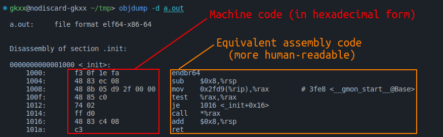
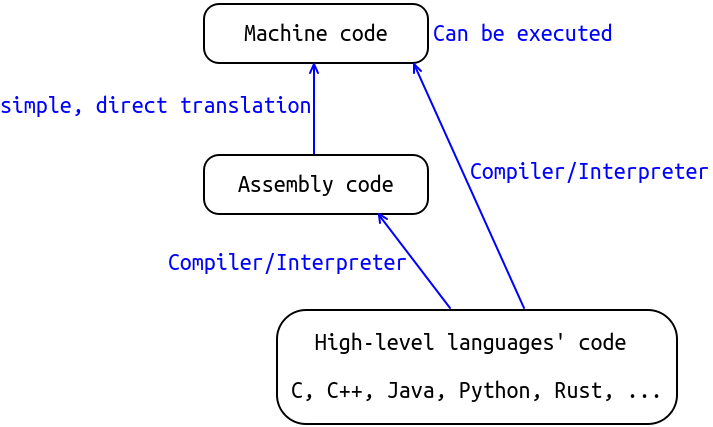
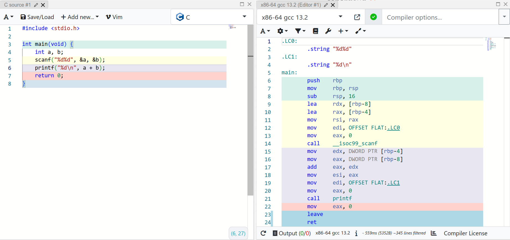

<style>
section::after {
  content: attr(data-marpit-pagination) '/' attr(data-marpit-pagination-total);
}
</style>

# CS100 Lecture 0

Introduction

---

## Contents

- Introduction to programming
- Standardization of C and C++
- Course Information

---

# Introduction to programming

What is programming?

---

## Introduction to programming

Computer programming is the process of writing instructions that get executed by computers.

The instructions, also known as **code**, are written in a **programming language** which the computer can *understand* and use to perform a task or solve a problem.

---

## Machine code

The only langauge that the computer can directly understand is the **machine code**, which is **binary**!

- For convenience, write binary code in hexadecimal form.

<a align="center">
  
</a>

---

## Assembly code

The assembly code is just a more human-readable form of the machine code.

- It can be translated into machine code straightforwardly.

<a align="center">
  
</a>

---

## High-level languages

Disadvantages of assembly code:

- Not portable: Different machines (architectures) may have different instruction sets.
- Too difficult to write and understand:
  - Instructions are very primitive and low-level, e.g. load, store, add, jump, ...
  - No high-level structures/abstractions: ~~control-flow statements, classes, ...~~

Learn more about them in senior courses (CS110, CS130, etc.)

---

## High-level languages

Examples: C, Java, Python, C++, Rust, JavaScript, ...

- Syntactically rich
- Better abstraction ability
- More structured code
- Easier to code, debug and maintain
- Easier to ensure safety

---

## High-level languages and compilers (including interpreters)

<a align="center">
  
</a>

---

## High-level languages and compilers

A **compiler** is a special program that **translates** a programming language's source code into machine code, bytecode or another programming language.

- The high-level code cannot be understood by the computer directly! It needs to be translated by a compiler.
  - The C/C++ compiler will translate the program and generate an executable (`.exe` file).
- Some languages (e.g. Python) use **interpreters**, which may be seen as a special kind of compiler.
  - An interpreter reads and executes the program directly, without earlier compiling it into machine code.
  - When executing a Python program, you don't see a `.exe` file! 

---

## High-level languages and compilers

<!-- Click on this image to see the webpage. -->
[](https://godbolt.org/z/4zWKhvd1P)

---

## High-level languages and compilers

A **compiler** is a special program that **translates** a programming language's source code into machine code, bytecode or another programming language.

```c
#include <stdio.h>
int main(void) {
  puts("hello world");
}
```

<!-- On Mac/Linux, remove ".exe" -->
`gcc hello.c -o hello.exe` $\Rightarrow$ Generates an **executable** `hello.exe`.

- `gcc` is the C compiler used here.
- `-o xxx` indicates that the name of the generated file is `xxx`.

<!-- On Mac/Linux, use "./" instead of ".\" -->
`.\hello` $\Rightarrow$ Prints `hello world`.

---

## Compilers

Popular C/C++ compilers:

- GCC (**G**NU **C**ompiler **C**ollection)
- MSVC (**M**icro**s**oft **V**isual **C** compiler)
- Clang
- ICC (**I**ntel **C**/**C**++ **C**ompiler)

---

## Why C and C++?

- C is a high-level language that is closest to assembly.
- C++ "is as close to C as possible, but no closer".
- C++ is a language that
  - is a better C,
  - supports data abstraction,
  - and supports object oriented programming.
- C and C++ are popular, powerful, general-purpose and efficient, and play an essential role in areas like systems programming, game engines development, high frequency trading, ...

---

# Standardization of C and C++

---

## Standardization of C and C++

Both C and C++ have **ISO** standards:

- C: ISO/IEC 9899, since 1990
  - C89/90, C99, C11, C17, C23, ... <!-- C89 and C90 are the same language, but C89 is an ANSI standard and C90 is an ISO standard. -->
  - Since C11 (2011), a new standard every 6 years.
- C++: ISO/IEC 14882, since 1998
  - C++98/03, C++11, C++14, C++17, C++20, C++23, ... <!-- C++03 is just C++98 amended with some corrections (a Technical Corrigendum) -->
  - Since C++11 (2011), a new standard every 3 years.

CS100 is based on **C17** and **C++17**.

---

## What is the value of a standard?

- Offers a unique, standard definition of the language.
- Every compiler should accept the programs that conform to the standard, with some possible compiler extensions.
- **If we want our code to be compiled and run with different compilers on different platforms, make it standard-conforming.**

---

## How to get the standard?

Possible ways:

- Purchase the standard documentation from ISO (or ANSI) $\Longrightarrow$ Very expensive
- Download the working drafts (free): Some working drafts are really close to the standards.
  - [Useful resources for C](https://en.cppreference.com/w/c/links) and [for C++](https://en.cppreference.com/w/cpp/links).
- [**cppreference**](https://www.cppreference.com) $\Longleftarrow$ RECOMMENDED!

---

## About [cppreference](https://www.cppreference.com)

The standard documentations are not friendly for learning:

- They aim to provide **a precise definition** of the language, instead of teaching the language.
- The chapters are not organized in a way suitable for learning.
- Changes between different standards are not shown in-place.

Cppreference is a complete online reference for the C and C++ languages and standard libraries.

- A more convenient and friendly version of the standards.

---

# Course Information

---

## Course objectives

Upon completion of the course, you should be able to:

- Know how to analyze simple problems and design programs.
- Know how to write them in C and C++.
- Know C/C++ syntax.
- Understand some basic ideas of programming.
- Understand sequential and OO programming.

---

## Course Structure

- 16 weeks teaching
  - C: Week 1 \~ 6
  - C++: Week 7 \~ 16
  - 1 midterm exam, in week 13 \~ 15
- 2 lectures every week
  - Monday 8:15-9:55
  - Wednesday 8:15-9:55
  - Room: Teaching Center 201, 202
- Weekly recitations

---

## Assessment

Homework $72\%$ + Midterm Exam $22\%$ + Quiz $4\%$ + Recitation attendance checks $2\%$.

- No final exams
- No projects
- Homework assignments make up a large proportion!

---

## Recitations

- About 15 recitations
- 2 hours every week
- Include review of important contents, some extensions, homework/quiz/exam solutions, and some coding examples.
- **Attendance mandatory!** ($2\%$ in total)
- Videos will be available on Bilibili.

---

## Homework assignments 

- 8 homework assignments:
  - $7\%+7\%+7\%+11\%+7\%+11\%+11\%+11\%=\mathbf{72}\%$ (may be adjusted)
- **Submit through Online Judge!!!**
  - Any other forms of submissions are not accepted, unless with special reasons.
  - For every problem, the score of **the last submission** will be taken as the final score.
- **No plagiarism!!!** The penalty will be heavy.
  - The TAs are really experienced. Don't take any chances.

---

## \*Academic integrity and AI (GPT, Copilot, etc.)

- Anything obtained from AI tools is treated equivalently as the contents from the Internet.
  - If two students copied the same code from the Internet and submitted them $\Longrightarrow$ **PLAGIARISM**!
  - If two students copied the same answer from AI tools and submitted them $\Longrightarrow$ **PLAGIARISM**!
- Typical excuses we **don't** accept:
  - "We used the same ChatGPT account, and ChatGPT gave me his code."
  - "Copilot generated the same code for us."

---

## Quizzes

- 1 or 2 quizzes, $4\%$ in total.
- During regular classes
- **Time will not be announced in advance!**

---

## Midterm exam

- $22\%$
- Will be held in the 13th \~ 15th week
- Covers **everything in regular classes and recitations**, unless otherwise stated.
  - Ranging from the beginning to *operator overloading* (C++).
- Will not be too difficult. Don't worry.

---

## [PIAZZA!!](https://piazza.com/class/lmucv9302vi1i3)

- All the notifications will be announced on Piazza.
- All the course materials will be available on Piazza.
- Ask and answer questions on Piazza.
- In case you miss any important notifications, we suggest **checking Piazza once every 12 hours**.

---

## Textbooks and references

Recommended textbooks:

- *C++ Primer* (5th edition) **(NOT *C++ Primer Plus*!)** (based on C++11)
- *Effective C++* (based on C++98), *Effective Modern C++* (based on C++14)
- *The C++ Programming Language* (4th edition) (based on C++11), written by **Bjarne Stroustrup**, the inventor of C++

**All of the course materials conform to the C17 and C++17 standards, based on cppreference and the standard committee's papers.**

---

## Textbooks and references

Note on textbooks:

- You are not required to read the entire books.
- We will recommend (or require) reading some of the chapters/sections when necessary.
- We will upload the materials to Piazza.

---

## Textbooks and references

Note on cppreference/standard documentations:

- You may find them difficult to read at the beginning. Don't worry!
- We will teach you how to read them (maybe during recitations).
- By the time you have learned some major aspects of the language, you should have less difficulty reading them.

---

## C/C++ environment setup

- We recommend VSCode + GCC (MinGW on Windows). Follow [this video](https://www.bilibili.com/video/BV1id4y1n7Kw/?spm_id_from=333.999.0.0).
- Advanced tools (Visual Studio, CMake, ... ) may be needed in further homework assignments.
