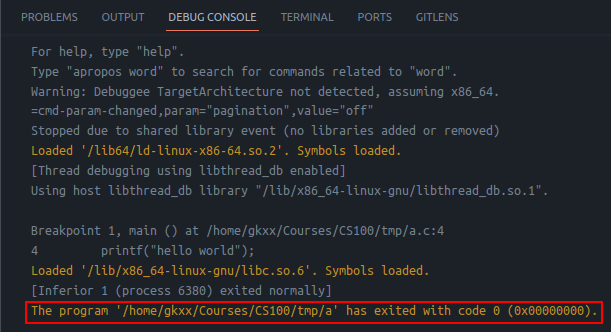
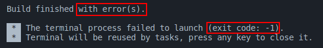
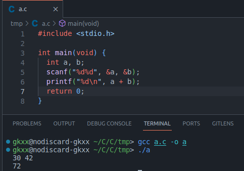
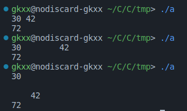
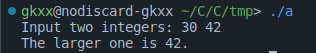

<style>
section::after {
  content: attr(data-marpit-pagination) '/' attr(data-marpit-pagination-total);
}
</style>

# CS100 Lecture 1

The First C Program

---

## Contents

- Brief history of C
- The first C program
  - Functions (basic) and the `main` function
  - `scanf` and `printf`

---

# Brief history of C

---

## The UNIX operating system and C

- In 1969, a small group of AT&T Bell Labs led by **Ken Thompson** and **Dennis Ritchie** began to develop UNIX.
- In 1973, UNIX kernel was rewritten in C.
- From 1969 to 1973, Dennis Ritchie developed C in Bell Labs.
- In 1978, Kernighan and Ritchie published **the K&R book**: *The C Programming Language*.

---

## Dennis Ritchie and the K&R book

<div style="display: grid; grid-template-columns: 1fr 1fr;">
  <div>
    <a align="center">
      
      
    </a>
  </div>
  <div>

- Dennis M. Ritchie (1941 - 2011)
  - The inventor of C
  - Co-inventor of UNIX
  - ACM Turing Award (1983) with Ken Thompson for UNIX

  </div>
</div>

---

## Standardization of C

- "K&R C": Informal specification (the K&R book)
- ANSI C: Known as "C89"
  - **A**merican **N**ational **S**tandards **I**nstitute
  - Came out in 1989
- ISO C standard: ISO/IEC 9899
  - **I**nternational **O**rganization for **S**tandardization
  - First version: "C90" in 1990, the same standard as C89 with only formatting changes
  - C99 (1999), C11 (2011), C17 (2017/2018), C23 (2023)

---

# The first C program

---

## Hello World

```c
#include <stdio.h>

int main(void) {
  printf("hello world\n");
  return 0;
}
```

- Save the code as `hello.c`.
- `gcc hello.c -o hello.exe` $\Rightarrow$ generates `hello.exe`
- `.\hello.exe` $\Rightarrow$ prints `hello world`, with a newline at the end.

---

## [The `main` function](http://en.cppreference.com/w/c/language/main_function)

Every C program coded to run in a hosted execution environment contains the definition of a **function** named **`main`**, which is the designated start of the program.

```c
// Other things (functions, structures, ...), if any ...

int main(void) {
  // The program starts here.
  statement_1;
  statement_2;
  // ...
  statement_n;
}
```

**\* What is a function?**

---

## A function in C

A function in mathematics: $f:S\mapsto T$, accepts some **arguments** and **returns** some value.

Example: $f(x)=x^2,x\in\mathbb Z$ accepts an integer argument, and **returns** its square.

Write it in C:

```c
int f(int x) {
  return x * x;
}
```

---

## A function in C

Example: $f(x, y)=x+y,x,y\in\mathbb R$

Write it in C:

```c
double f(double x, double y) { // Two arguments
  return x + y;
}
```

`double`: double-precision floating-point number $\Rightarrow$ will be covered in later lectures.

---

## A function in C

Syntax: `ReturnType FunctionName(Parameters) { FunctionBody }`

`FunctionBody` can also contain more complex statements:

```c
int max(int a, int b) {
  if (a < b)
    return b;
  else
    return a;
}
```

`if` statement $\Rightarrow$ will be covered in later lectures.

---

## A function in C

Syntax: `ReturnType FunctionName(Parameters) { FunctionBody }`

A function can have no arguments. To define such a function, write `void` in `Parameters`:

```c
int always42(void) {
  return 42;
}
```

We will introduce more on **functions** in later lectures.

---

## [The `main` function](https://en.cppreference.com/w/c/language/main_function)

Every C program coded to run in a hosted execution environment contains the definition of a **function** named **`main`**, which is the designated start of the program.

According to the standard, the `main` function **must has** one of the following signatures:

1. `int main(void) { ... }`
2. `int main(int argc, char *argv[]) { ... }`
3. `/* another implementation-defined signature */`

For now, we only use the first one: **`int main(void) { ... }`**.

> "signature": consisting of the return-type, parameters, and some other possible information

---

## The `main` function

```c
int main(void) {
  printf("hello world\n");
  return 0;
}
```

The return value of `main`: **Indicates whether the program exits successfully.**

**A program exits successfully if and only if its `main` function returns `0`.**

---

## The `main` function

**A program exits successfully if and only if its `main` function returns `0`.**

You may also see this somewhere else:

<a align="center">
  
</a>

---

## The `main` function

**A program exits successfully if and only if its `main` function returns `0`.**

You may also see this somewhere else:

<a align="center">
  
</a>

---

## The `main` function

It is ok to omit `return 0;` in `main` (*but not in other functions*):

```c
int main(void) {
  printf("hello world\n");
}
```

According to the standard:

> If the return type is compatible with `int` and control reaches the terminating `}`, the value returned to the environment is the same as if executing `return 0;`.

---

## [`printf`](https://en.cppreference.com/w/c/io/fprintf)

**Declared in the standard library header file `stdio.h`**.

- That's why we need `#include <stdio.h>` in the beginning.

Writes something to **the standard output**.

```c
printf("hello world\n");
```

- Prints `hello world`, with a newline `\n` at the end.
- Try this out: `printf("hello\nworld\n");`

---

## Output vs return

```c
int main(void) {
  printf("hello world\n");
  return 0;
}
```

- What is the output of the program?
- What is the return value of `main`?

---

## Output vs return

```c
int main(void) {
  printf("hello world\n");
  return 0;
}
```

- What is the output of the program? $\Rightarrow$ `hello world` with an ending newline.
- What is the return value of `main`? $\Rightarrow$ `0`.

---

## The "A+B" problem

Reads two integers from input (separated by whitespaces), and prints the sum of them.

```c
#include <stdio.h>

int main(void) {
  int a, b; // declares two variables of type "int", named "a" and "b".
  scanf("%d%d", &a, &b);
  printf("%d\n", a + b);
  return 0;
}
```

---

## The "A+B" problem

Reads two integers from input (separated by whitespaces), and prints the sum of them.

<a align="center">
  
</a>

---

## [`scanf`](https://en.cppreference.com/w/c/io/fscanf)

Also declared in `stdio.h`.

Reads something from **the standard input**.

Example: Reads two integers from the standard input, separated by whitespaces.

```c
scanf("%d%d", &a, &b);
```

- `%d`: Indicates that an integer is expected, and will be stored into an `int` variable.
- `&`: The **address-of** operator $\Rightarrow$ will be covered in later lectures.

For now, just remember to add `&` when passing things to `scanf`.

---

## `scanf`

```c
scanf("%d%d", &a, &b);
```

How should these two integers be separated? Try it out:

<a align="center">
  
</a>

---

## `scanf`

```c
scanf("%d%d", &a, &b);
```

`%d` will skip **any leading whitespaces**.

- "whitespace" refers to the character that looks "blank": space `' '`, newline `'\n`, tab `'\t'`, etc.

More on the rules related to `scanf` will be covered in recitations.

---

## `printf` printing an integer

Given `a` $=30$, `b` $=42$ as input:

- `printf("%d\n", a + b);`
  
  $\Rightarrow$ prints `72`, with a newline in the end.

- `printf("%d + %d equals %d\n", a, b, a + b);`
  
  What is the output?

---

## `printf` printing an integer

Given `a` $=30$, `b` $=42$ as input:

- `printf("%d\n", a + b);`
  
  $\Rightarrow$ prints `72`, with a newline in the end.

- `printf("%d + %d equals %d\n", a, b, a + b);`
  
  $\Rightarrow$ prints `30 + 42 equals 72`, with a newline in the end.

---

## Summary

Understand the following two programs:

<div style="display: grid; grid-template-columns: 1fr 1fr;">
  <div>

```c
#include <stdio.h>

int main(void) {
  printf("hello world\n");
  return 0;
}
```

```c
#include <stdio.h>

int main(void) {
  int a, b;
  scanf("%d%d", &a, &b);
  printf("%d + %d equals %d\n",
         a, b, a + b);
  return 0;
}
```

  </div>
  <div>

- Why is `#include <stdio.h>` needed?
- What does `int main(void)` mean?
- What is the meaning of `return 0;`? Can it be omitted?
- How do we represent a newline?
- What does `%d` mean?
- How are whitespaces handled when reading integers with `scanf`?

  </div>
</div>

---

## Summary

- Why is `#include <stdio.h>` needed?
  - `scanf` and `printf` are declared in the standard library header file `stdio.h`.
- What does `int main(void)` mean?
  - The `main` function is where the program starts. `int` is the return type and `void` indicates that this function accepts no arguments.
- What is the meaning of `return 0;`? Can it be omitted?
  - A program returns `0` if it exits successfully. The `main` function of C will execute `return 0` automatically at the end if we don't write it exiplicitly.

---

## Summary

- How do we represent a newline?
  - `'\n'`.
- What does `%d` mean?
  - Indicates that the type of the data being read or printed is `int`.
- How are whitespaces handled when reading integers with `scanf`?
  - When reading `int` with `%d` in `scanf`, leading whitespaces are ignored.

---

## Exercises

1. Run the following code. Try to understand what it means.
   
   ```c
   #include <stdio.h>
   
   int max(int a, int b) {
     if (a < b)
       return b;
     else
       return a;
   }

   int main(void) {
     int a, b;
     scanf("%d%d", &a, &b);
     printf("%d\n", max(a, b));
     return 0;
   }
   ```

---

## Exercises

2. Try to modify the program above. Add some prompts for input and output. For example:

<a align="center">
  
</a>
