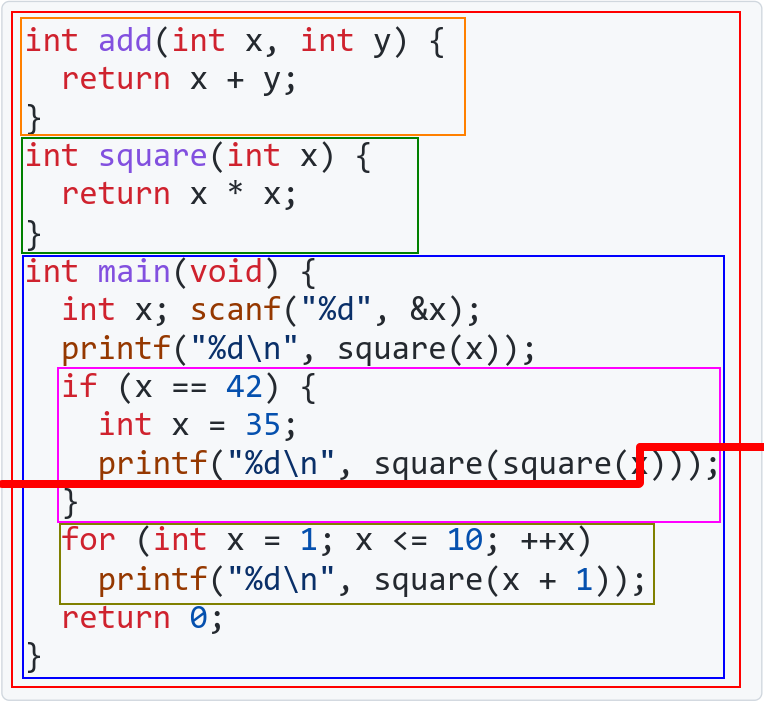

# CS100 Lecture 10

C Summary

---

## Contents

- C summary
  - Types
  - Variables
  - Expressions
  - Control flow
  - Functions
  - Standard library
  - Example: `Vector`

---

# C Summary

---

## Types

Types are fundamental to any program: They tell us what our data mean and what operations we can perform on those data.

C is a **statically-typed** language: The type of every expression (except those involving VLAs) is known at **compile-time**.

---

## Arithmetic types

<a align="center">
  
</a>

---

## Arithmetic types

- `1 == sizeof(char) <= sizeof(short) <= sizeof(int) <= sizeof(long) <= sizeof(long long)`
- `sizeof(signed T) == sizeof(unsigned T)` for every `T` $\in\{$ `char`, `short`, `int`, `long`, `long long` $\}$
- `short` and `int` are at least 16 bits. `long` is at least 32 bits. `long long` is at least 64 bits.
- Range of signed types: $\left[-2^{N-1},2^{N-1}-1\right]$. Range of unsigned types: $\left[0,2^N-1\right]$.
- Whether `char` is signed or not is **implementation-defined**.
- Signed integer overflow is **undefined behavior**.
- Unsigned arithmetic **never overflows**: It is performed modulo $2^N$, where $N$ is the number of bits of that type.

---

## Pointer types

`PointeeType *`

- For `T` $\neq$ `U`, `T *` and `U *` are **different types**.
- The value of a pointer of type `T *` is **the address of** an object of type `T`.
- **Null pointer**: The pointer holding the **null pointer value**, which is a special value indicating that the pointer is "pointing nowhere".
  - A null pointer can be obtained from `NULL`.
- `&var` returns the address of `var`. The return type is pointer to the type of `var`.
- Only when a pointer is actually pointing to an object is it **dereferenceable**.
- `*ptr`, where `ptr` is not dereferenceable, is **undefined behavior**.

---

## Array types

`ElemType [N]`

- `T [N]`, `U [N]` and `T [M]` are **different types** for `T` $\neq$ `U` and `N` $\neq$ `M`.
- `N` should be compile-time constant. Otherwise it is a VLA.
- Valid index range: $[0,N)$. Subscript out of range is **undefined behavior**.
- Decay: `a` $\to$ `&a[0]`, `T [N]` $\to$ `T *`.

Pointer to array: `T (*)[N]`. Array of pointers: `T *[N]`.

---

## `struct` types

A special data type consisting of a sequence of **members**.

- The type name is `struct StructName`.
- $\displaystyle \mathtt{sizeof(struct\ \ X)}\geqslant\sum_{\mathtt{member}\in\mathtt{X}}\mathtt{sizeof(member)}$

---

## Variables

Declare a variable: `Type varName`

- `ElemType varName[N]` for array type `ElemType[N]`.
- `T (*varName)[N]` for pointer to array type `T (*)[N]`.

Initialize a variable: `= initializer`

- Brace-enclosed list initializer for arrays and `struct`s: `= { ... }`.
- Designators for arrays: `= {[3] = 5, [7] = 4}`
- Designators for `struct`s: `= {.mem1 = x, .mem2 = y}`.

---

## Initialization

If a variable is declared without explicit initializer:

- For global or local `static` variables, they are **empty-initialized**:
  - `0` for integer types,
  - `+0.0` for floating-point types,
  - null pointer value for pointer types.
- For local non-`static` variables, they are **uninitialized**, holding indeterminate values.

These rules apply recursively to the elements of arrays and the members of `struct`s.

Any use of the value of an uninitialized variable is **undefined behavior**.

---

## Scopes and name lookup

<a align="center">
  
</a>

---

## Expressions

Expressions = operators + operands.

- Operator precedence, associativity, and evaluation order of operands
  - `f() + g() * h()`, `f() - g() + h()`
- The only four operators whose operands have deterministic evaluation order:
  - `&&` and `||`: short-circuit evaluation
  - `?:`
  - `,` (not in a function call or in an initializer list)

---

## Expressions

- If the evaluation order of `A` and `B` is unspecified, and if
  - both `A` and `B` contain a write to an object, or
  - one of them contains a write to an object, and the other one contains a read to that object
  
  then **the behavior is undefined**.

---

## Arithmetic operators

`+`, `-`, `*`, `/`, `%`

- Division: truncated towards zero.
- Remainder: `(a / b) * b + (a % b) == a` always holds.
- For `+`, `-`, `*` and `/`, the operands undergo a series of type conversions to a common type.

Bitwise operators: `~`, `&`, `|`, `^`, `<<`, `>>`

Compound assignment operators: `a op= b` is equivalent to `a = a op b`.

**Be careful with signed overflows.**

---

## Pointer arithmetic

<a align="center">
  
</a>

- Pointer arithmetic: `p++`, `++p`, `p--`, `--p`, `p + i`, `i + p`, `p - i`, `p += i`, `p -= i`, `p1 - p2`.
- Pointer arithmetic uses the units of the pointed-to type.
  - `p + i == (char *)p + i * sizeof(*p)`
- Pointer arithmetic must be performed within an array (including its past-the-end position), otherwise **the behavior is undefined**.

---

## Operators

`++`, `--`

- `++a` and `--a` returns the value of `a` after incrementation/decrementation.
- `a++` and `a--` returns the original value of `a`.

`<`, `<=`, `>`, `>=`, `==`, `!=`

- The operands undergo a series of type conversions to a common type before comparison.

---

## Operators

Member access: `obj.member`.

Member access through pointer: `ptr->member`, which is equivalent to `(*ptr).member`.

- `.` has higher precedence than `*`, so the parentheses around `*ptr` are necessary.

---

## Control flow

- `if (cond) stmt`
- `if (cond) stmt1 else stmt2`
- `for (init_expr; cond; inc_expr) stmt`
- `while (cond) stmt`
- `do stmt while (cond);`
- `switch (integral_expr) { ... }`
- `break` and `continue`

---

## Functions

Function declaration: `RetType funcName(Parameters);`

- Parameter names are not necessary, but types are required.
- A function can be declared multiple times.

Function definition: `RetType funcName(Parameters) { functionBody }`

- A function can be defined only once.

---

## Functions

- Argument passing:

  - Use the argument to initialize the parameter.
  - The semantic is **copy**.
  - **Decay** always happens: One can never declare an array parameter.

---

## The `main` function

Entry point of the program (after initialization of all global and local `static` variables).

One of the following signatures:

- `int main(void) { ... }`
- `int main(int argc, char **argv) { ... }`, for passing command-line arguments.
- `/* another implementation-defined signature */`

Return value: `0` to indicate that the program exits successfully.

---

## Standard library

- IO library `<stdio.h>`: `scanf`, `printf`, `fgets`, `puts`, `putchar`, `getchar`, ...
- String library `<string.h>`: `strlen`, `strcpy`, `strcmp`, `strchr`, ...
- Character classification `<ctype.h>`: `isdigit`, `isalpha`, `tolower`, ...
- `<stdlib.h>`: Several general-purpose functions: `malloc`/`free`, `rand`, ...
- `<limits.h>`: Defines macros like `INT_MAX` that describe the limits of built-in types.
- `<math.h>`: Mathematical functions like `sqrt`, `sin`, `acos`, `exp`, ...

---

## Example: `Vector`

A "vector" in linear algebra:

$$
\mathbf x=\begin{bmatrix}x_1\\\vdots\\x_n\end{bmatrix}.
$$

It consists of two things: A sequence of $n$ numbers, and its dimension $n$.

---

## Example: `Vector`

```c
struct Vector {
  double *entries;
  size_t dimension;
};
```

Do not name them with `x` and `n`!

**[Best practice]** <u>Use meaningful names in programs.</u>

---

## Creation and destruction

```c
struct Vector create_vector(size_t n) {
  return (struct Vector){.entries = calloc(n, sizeof(double)),
                         .dimension = n};
}
void destroy_vector(struct Vector *vec) {
  free(vec->entries);
  // Do we need to free(vec)?
}
```

Usage:

```c
struct Vector v = create_vector(10);
// some operations ...
destroy_vector(&v);
```

---

## "Deep copy" of `Vector`

The default copy semantics of `Vector` is not satisfactory:

```c
struct Vector v = something();
struct Vector u = v;
```

Now `u.entries` and `v.entries` point to the same memory block!

```c
destroy_vector(&u);
destroy_vector(&v); // undefined behavior: double free!
```

---

## "Deep copy" of `Vector`

```c
void vector_assign(struct Vector *to, const struct Vector *from) {
  to->entries = malloc(from->dimension * sizeof(double));
  memcpy(to->entries, from->entries, from->dimension * sizeof(double));
  to->dimension = from->dimension;
}
```

Is this correct?

---

## "Deep copy" of `Vector`

`free` the memory block that is not used anymore!

```c
void vector_assign(struct Vector *to, const struct Vector *from) {
  free(to->entries); // Don't forget this!!
  to->entries = malloc(from->dimension * sizeof(double));
  memcpy(to->entries, from->entries, from->dimension * sizeof(double));
  to->dimension = from->dimension;
}
```

Is this correct?

---

## "Deep copy" of `Vector`

```c
void vector_assign(struct Vector *to, const struct Vector *from) {
  free(to->entries); // Don't forget this!!
  to->entries = malloc(from->dimension * sizeof(double));
  memcpy(to->entries, from->entries, from->dimension * sizeof(double));
  to->dimension = from->dimension;
}
```

What happens if `to == from`?

- This is not impossible. Consider `vector_assign(&vecs[i], &vecs[j])` where `i` and `j` have a chance to be equal.

---

## "Deep copy" of `Vector`

```c
void vector_assign(struct Vector *to, const struct Vector *from) {
  free(to->entries); // Don't forget this!!
  to->entries = malloc(from->dimension * sizeof(double));
  memcpy(to->entries, from->entries, from->dimension * sizeof(double));
  to->dimension = from->dimension;
}
```

What happens if `to == from`?

- This is not impossible. Consider `vector_assign(&x[i], &x[j])` where `i` and `j` have a chance to be equal.
- The memory block is `free`d, and the data are gone.

---

## "Deep copy" of `Vector`

```c
void vector_assign(struct Vector *to, const struct Vector *from) {
  if (to == from)
    return;
  free(to->entries); // Don't forget this!!
  to->entries = malloc(from->dimension * sizeof(double));
  memcpy(to->entries, from->entries, from->dimension * sizeof(double));
  to->dimension = from->dimension;
}
```

Why do we declare the parameters as pointers?

---

## "Deep copy" of `Vector`

```c
void vector_assign(struct Vector *to, const struct Vector *from) {
  if (to == from)
    return;
  free(to->entries); // Don't forget this!!
  to->entries = malloc(from->dimension * sizeof(double));
  memcpy(to->entries, from->entries, from->dimension * sizeof(double));
  to->dimension = from->dimension;
}
```

Why do we declare the parameters as pointers?

- For `to`, we need to modify it.
- For `from`, this is a read-only operation. Pass the address to avoid copies.

---

## Equality comparison

```c
bool vector_equal(const struct Vector *lhs, const struct Vector *rhs) {
  if (lhs->dimension != rhs->dimension)
    return false;
  for (size_t i = 0; i != lhs->dimension; ++i)
    if (lhs->entries[i] != rhs->entries[i])
      return false;
  return true;
}
```

Here we use `!=` to compare two `double`s directly. It's better to use $|a-b|>\epsilon$, considering the floating-point errors.

`lhs` and `rhs` are pointers, to avoid unnecessary copies.

---

## Basic operations on `Vector`

```c
struct Vector vector_add(const struct Vector *lhs, const struct Vector *rhs) {
  assert(lhs->dimension == rhs->dimension);
  struct Vector result = create_vector(lhs->dimension);
  for (size_t i = 0; i != lhs->dimension; ++i)
    result.entries[i] = lhs->entries[i] + rhs->entries[i];
  return result;
}

struct Vector vector_scale(const struct Vector *lhs, double scale) {
  struct Vector result = create_vector(lhs->dimension);
  for (size_t i = 0; i != lhs->dimension; ++i)
    result.entries[i] = lhs->entries[i] * scale;
  return result;
}
```

For `vector_add`, our design is to claim that "the behavior is undefined if the vectors have different dimensions".

---

## Dot product, norm and distance ($\ell_2$)

```c
double vector_dot_product(const struct Vector *lhs, const struct Vector *rhs) {
  assert(lhs->dimension == rhs->dimension);
  double result = 0;
  for (size_t i = 0; i != lhs->dimension; ++i)
    result += lhs->entries[i] * rhs->entries[i];
  return result;
}
double vector_norm(const struct Vector *vec) {
  return sqrt(vector_dot_product(vec, vec));
}
double vector_distance(const struct Vector *lhs, const struct Vector *rhs) {
  struct Vector diff = vector_minus(lhs, rhs); // Define this on your own.
  return vector_norm(&diff);
}
```

For `vector_dot_product`, our design is to claim that "the behavior is undefined if the vectors have different dimensions".

---

## Print a `Vector`

```c
void print_vector(const struct Vector *vec) {
  putchar('(');
  if (vec->dimension > 0) {
    printf("%lf", vec->entries[0]);
    for (size_t i = 1; i != vec->dimension; ++i)
      printf(", %lf", vec->entries[i]);
  }
  putchar(')');
}
```

---

## Exercise

What if we want to increase the dimension of a `Vector`? Implement the related functionality that reallocates a larger block of memory when needed.

```c
void vector_push_back(struct Vector *vec, double x) {
  if (/* reallocation is needed */)
    vector_grow(vec); // Implement this function
  vec->entries[vec->dimension++] = x;
}
```

You may need to add members to `struct Vector`.

---

## What we have done

```c
struct Vector {
  double *entries;
  size_t dimension;
};
struct Vector create_vector(size_t n);
void destroy_vector(struct Vector *vec);
void vector_assign(struct Vector *to, const struct Vector *from);
bool vector_equal(const struct Vector *lhs, const struct Vector *rhs);
struct Vector vector_add(const struct Vector *lhs, const struct Vector *rhs);
struct Vector vector_minus(const struct Vector *lhs, const struct Vector *rhs);
struct Vector vector_scale(const struct Vector *lhs, double scale);
double vector_dot_product(const struct Vector *lhs, const struct Vector *rhs);
double vector_norm(const struct Vector *vec);
double vector_distance(const struct Vector *lhs, const struct Vector *rhs);
void print_vector(const struct Vector *vec);
```

---

## Problems of the current implementation

1. The call to `create_vector` is not mandatory. One can easily create a `Vector` with some garbage values.
2. `destroy_vector` is not called automatically. If we forget to call it manually, memory leak happens.
3. We always need to pass the address of `Vector`s to these functions. The extra `&` and `*` are annoying.
4. The "deep copy" is implemented by a function, but the default copy semantics are still there. If we forget to call `vector_assign` when copying a `Vector`, disaster will happen.
5. No prevention from modifying a `Vector`: Disaster is caused easily by a simple `free(vec->entries);`.

---

## Problems of the current implementation

6. The named functions are inconvenient: To compute $\mathbf u^T(\mathbf v+2\mathbf w)$, we need to write

   ```c
   struct Vector scaled = vector_scale(&w, 2);
   struct Vector added = vector_add(&v, &scaled);
   return vector_dot_product(&u, &added);
   ```

   Can we express it directly by `return u * (v + 2 * w);`?

7. ......

**We will see the solutions to these problems in C++, by data abstraction, and by OOP (object-oriented programming).**

---

## Enter the world of C++ ...

From *The Design and Evolution of C++*, by Bjarne Stroustrup who invented C++:

> C++ is a general-purpose programming language that
> - is a better C, and
> - supports data abstraction, and
> - supports object-oriented programming.

```cpp
#include <iostream>

int main() {
  std::cout << "Hello world\n";
  return 0;
}
```
