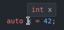

# CS100 Lecture 13

"C" in C++

---

## Contents

"C" in C++

- Type System
  - Stronger Type Checking
  - Explicit Casts
  - Type Deduction
- Functions
  - Default Arguments
  - Function Overloading
- Range-Based `for` Loops Revisited

---

## "Better C"

C++ was developed based on C.

From *The Design and Evolution of C++*:

> C++ is a general-purpose programming language that
> - **is a better C**,
> - supports data abstraction,
> - supports object-oriented programming.

C++ brought up new ideas and improvements of C, some of which also in turn influenced the development of C.

---

## "Better C"

- `bool`, `true` and `false` are built-in. No need to `#include <stdbool.h>`. `true` and `false` are of type `bool`, not `int`.
  - This is also true since C23.
- The return type of logical operators `&&`, `||`, `!` and comparison operators `<`, `<=`, `>`, `>=`, `==`, `!=` is `bool`, not `int`.
- The type of string literals `"hello"` is `const char [N+1]`, not `char [N+1]`.
  - Recall that string literals are stored in **read-only memory**. Any attempt to modify them results in undefined behavior.
- The type of character literals `'a'` is `char`, not `int`.

---

## "Better C"

- `const` variables initialized with literals are compile-time constants. They can be used as the length of arrays.
  
  ```cpp
  const int maxn = 1000;
  int a[maxn]; // a normal array in C++, but VLA in C
  ```
- `int fun()` declares a function accpeting no arguments. It is not accepting unknown arguments.
  
  - This is also true since C23.

---

# Type System

---

## Stronger type checking

Some arithmetic conversions are problematic: They are not value-preserving.

```c
int x = some_int_value();
long long y = x; // OK. Value-preserving
long long z = some_long_long_value();
int w = z;       // Is this OK?
```

- Conversion from `int` to `long long` is value-preserving, without doubt.
- Conversion from `long long` to `int` may lose precision. ("narrowing")

However, no warning or error is generated for such conversions in C.

---

## Stronger type checking

Some arithmetic conversions are problematic: They are not value-preserving.

```cpp
long long z = some_long_long_value();
int w = z; // "narrowing" conversion
```

Stroustrup had decided to ban all implicit narrowing conversions in C++. However,

> The experiment failed miserably. Every C program I looked at contained large numbers of assignments of `int`s to `char` variables. Naturally, since these were **working programs**, most of these assignments were perfectly safe. That is, either the value was small enough not to become truncated, or the truncation was expected or at least harmless in that particular context.

In the end, narrowing conversions are not banned completely in C++. They are not allowed only in a special context in modern C++. We will see it soon.

---

## Stronger type checking

Some type conversions (casts) can be very dangerous:

```c
const int x = 42, *pci = &x;
int *pi = pci; // Warning in C, Error in C++
++*pi;         // undefined behavior
char *pc = pi; // Warning in C, Error in C++
void *pv = pi; char *pc2 = pv; // Even no warning in C! Error in C++.
int y = pc;    // Warning in C, Error in C++
```

- For `T` $\neq$ `U`, `T *` and `U *` are different types. Treating a `T *` as `U *` leads to undefined behavior in most cases, but the C compiler gives only a warning!
- `void *` is a hole in the type system. You can cast anything to and from it **without even a warning**.

C++ does not allow the dangerous type conversions to happen ***implicitly***.

---

## Explicit Casts

C++ provides four **named cast operators**:

- `static_cast<Type>(expr)`
- `const_cast<Type>(expr)`
- `reinterpret_cast<Type>(expr)`
- `dynamic_cast<Type>(expr)` $\Rightarrow$ will be covered in later lectures.

In contrast, the C style explicit cast `(Type)expr` looks way too innocent.

"An ugly behavior should have an ugly looking."

---

## `const_cast`

Cast away low-level constness **(DANGEROUS)**:

```cpp
int ival = 42;
const int &cref = ival;
int &ref = cref; // Error: casting away low-level constness
int &ref2 = const_cast<int &>(cref); // OK
int *ptr = const_cast<int *>(&cref); // OK
```

However, modifying a `const` object through a non-`const` access path (possibly formed by `const_cast`) results in **undefined behavior**!

```cpp
const int cival = 42;
int &ref = const_cast<int &>(cival); // compiles, but dangerous
++ref; // undefined behavior (may crash)
```

---

## `reinterpret_cast`

Often used to perform conversion between different pointer types **(DANGEROUS)**:

```cpp
int ival = 42;
char *pc = reinterpret_cast<char *>(&ival);
```

We must never forget that the actual object addressed by `pc` is an `int`, not a character! Any use of `pc` that assumes it's an ordinary character pointer **is likely to fail** at run time, e.g.:

```cpp
std::string str(pc); // undefined behavior
```

**Wherever possible, do not use it!**

---

## `static_cast`

Other types of conversions (which often look "harmless"):

```cpp
double average = static_cast<double>(sum) / n;
int pos = static_cast<int>(std::sqrt(n));
```

Some typical usage: $\Rightarrow$ We will talk about them in later lectures.

```cpp
static_cast<std::string &&>(str) // converts to a xvalue
static_cast<Derived *>(base_ptr) // downcast without runtime checking
```

---

## Minimize casting

**[Best practice]** <u>Minimize casting. (*Effective C++* Item 27)</u>

Type systems work as a **guard** against possible errors: Type mismatch often indicates a logical error.

**[Best practice]** <u>When casting is necessary, **prefer C++-style casts to old C-style casts**.</u>
- With old C-style casts, you can't even tell whether it is dangerous or not!

---

## Type deduction

C++ is very good at **type computations**:

```cpp
std::vector v(10, 42);
```

- It should be `std::vector<int> v(10, 42);`, but the compiler can deduce that `int` from `42`.

```cpp
int x = 42; double d = 3.14; std::string s = "hello";
std::cout << x << d << s;
```

- The compiler can detect the types of `x`, `d` and `s` and select the correct printing functions.

---

## `auto`

When declaring a variable with an initializer, we can use the keyword `auto` to let the compiler deduce the type.

```cpp
auto x = 42;    // `int`, because 42 is an `int`.
auto y = 3.14;  // `double`, because 3.14 is a `double`.
auto z = x + y; // `double`, because the type of `x + y` is `double`.
auto m;         // Error: cannot deduce the type. An initializer is needed.
```

`auto` can also be used to produce compound types:

```cpp
auto &r = x;        // `int &`, because `x` is an `int`.
const auto &rc = r; // `const int &`.
auto *p = &rc;      // `const int *`, because `&rc` is `const int *`.
```

---

## `auto`

What about this?

```cpp
auto str = "hello";
```

---

## `auto`

What about this?

```cpp
auto str = "hello"; // `const char *`
```

- Recall that the type of `"hello"` is **`const char [6]`**, not `std::string`. This is for compatibility with C.
- When using `auto`, the array-to-pointer conversion ("decay") is performed automatically.

---

## `auto`

Deduction of return type is also allowed (since C++14):

```cpp
auto sum(int x, int y) {
  return x + y;
}
```

- The return type is deduced to `int`.

Since C++20, `auto` can also be used for function parameters! Such a function is actually a function template.

- This is beyond the scope of CS100.

```cpp
auto sum(auto x, auto y) {
  return x + y;
}
```

---

## `auto`

`auto` lets us enjoy the benefits of the static type system.

Some types in C++ are very long:

```cpp
std::vector<std::string>::const_iterator it = vs.begin();
```

Use `auto` to simplify it:

```cpp
auto it = vs.begin();
```

---

## `auto`

`auto` lets us enjoy the benefits of the static type system.

Some types in C++ are not known to anyone but the compiler:

```cpp
auto lam = [](int x, int y) { return x + y; } // A lambda expression.
```

Every lambda expression has its own type, whose name is only known by the compiler.

---

## `decltype`

`decltype(expr)` will deduce the type of the expression `expr` **without evaluating it**.

```cpp
auto fun(int a, int b) { // The return type is deduced to be `int`.
  std::cout << "fun() is called.\n"
  return a + b;
}
int x = 10, y = 15;
decltype(fun(x, y)) z; // Same as `int z;`.
                       // Unlike `auto`, no initializer is required here.
                       // The type is deduced from the return type of `fun`.
```

- `decltype(fun(x, y))` only deduces the return type of `fun` without actually calling it. Therefore, **no output is produced**.

---

## Note on `auto` and `decltype`

The detailed rules of `auto` and `decltype` (as well as their differences) are complicated, and require some deeper understanding of C++ types and templates. You don't have to remember them.

Learn about them mainly through experiments.

- A good IDE should be of great help: Place your mouse on it, and your IDE should tell you the deduction result.

<a align="center">
  
</a>

C23 also has `auto` type deduction.

---

# Functions

---

## Default arguments

Some functions have parameters that are given a particular value in most, but not all, calls. In such cases, we can declare that common value as a **default argument**.

```cpp
std::string get_screen(std::size_t height = 24, std::size_t width = 80,
                       char background = ' ');
```

- By default, the screen is $24\times 80$ filled with `' '`.
  
  ```cpp
  auto default_screen = get_screen();
  ```

- To override the default arguments:
  
  ```cpp
  auto large_screen   = get_screen(66);           // 66x80, filled with ' '
  auto larger_screen  = get_screen(66, 256);      // 66x256, filled with ' '
  auto special_screen = get_screen(66, 256, '#'); // 66x256, filled with '#'
  ```

---

## Default arguments

Arguments in the call are resolved by position.

```cpp
auto scr = get_screen('#'); // Passing the ASCII value of '#' to `height`.
                            // `width` and `background` are set to
                            // default values (`80` and `' '`).
```

- Some other languages have named parameters:
  
  ```python
  print(a, b, sep=", ", end="") # Python
  ```

  There is no such syntax in C++.

Default arguments are only allowed for the last (right-most) several parameters:

```cpp
std::string get_screen(std::size_t height = 24, std::size_t width,
                       char background); // Error.
```

---

## Function overloading

In C++, a group of functions can have the same name, as long as they can be differentiated when called.

```cpp
int max(int a, int b) {
  return a < b ? b : a;
}
double max(double a, double b) {
  return a < b ? b : a;
}
const char *max(const char *a, const char *b) {
  return std::strcmp(a, b) < 0 ? b : a;
}
```

```cpp
auto x = max(10, 20);           // Calls max(int, int)
auto y = max(3.14, 2.5);        // Calls max(double, double)
auto z = max("hello", "world"); // Calls max(const char *, const char *)
```

---

## Overloaded functions

Overloaded functions should be distinguished in the way they are called.

```cpp
int fun(int);
double fun(int);  // Error: functions that differ only in
                  // their return type cannot be overloaded.
```

```cpp
void move_cursor(Coord to);
void move_cursor(int r, int c); // OK, differ in the number of arguments
```

---

## Overloaded functions

Overloaded functions should be distinguished in the way they are called.

- The following are declaring **the same function**. They are not overloading.

  ```cpp
  void fun(int *);
  void fun(int [10]);
  ```
- The following are the same for an array argument:
  
  ```cpp
  void fun(int *a);
  void fun(int (&a)[10]);
  int ival = 42; fun(&ival); // OK, calls fun(int *)
  int arr[10];   fun(arr);   // Error: ambiguous call
  ```

  Why?

---

## Overloaded functions

Overloaded functions should be distinguished in the way they are called.

- The following are the same for an array argument:
  
  ```cpp
  void fun(int *a);
  void fun(int (&a)[10]);
  int arr[10];   fun(arr);   // Error: ambiguous call
  ```

  - For `fun(int (&)[10])`, this is **an exact match**.
  - For `fun(int *)`, this involves an array-to-pointer implicit conversion. We will see that this is **also considered an exact match**.

---

## Basic overload resolution

Suppose we have the following overloaded functions.

```cpp
void fun(int);
void fun(double);
void fun(int *);
void fun(const int *);
```

Which will be the best match for a call `fun(a)`?

---

## Basic overload resolution

Suppose we have the following overloaded functions.

```cpp
void fun(int);
void fun(double);
void fun(int *);
void fun(const int *);
```

<div style="display: grid; grid-template-columns: 1fr 1fr;">
  <div>

Obvious: The arguments and the parameters match perfectly.

```cpp
fun(42);   // fun(int)
fun(3.14); // fun(double)
const int arr[10];
fun(arr);  // fun(const int *)
```
  </div>
  <div>

Not so obvious:

```cpp
int ival = 42;
// fun(int *) or fun(const int *)?
fun(&ival);
fun('a');   // fun(int) or fun(double)?
fun(3.14f); // fun(int) or fun(double)?
fun(NULL);  // fun(int) or fun(int *)?
```
  </div>
</div>

---

## Basic overload resolution

```cpp
void fun(int);
void fun(double);
void fun(int *);
void fun(const int *);
```

- `fun(&ival)` matches `fun(int *)`
- `fun('a')` matches `fun(int)`
- `fun(3.14f)` matches `fun(double)`
- `fun(NULL)` ? We will see this later.

There are detailed rules that define these behaviors. **But our program should avoid such confusing overload sets.**

---

## Basic overload resolution

1. An exact match, including the following cases:
   - identical types
   - **match through decay of array** *(or function)* **type**
   - match through top-level `const` conversion
2. **Match through adding low-level `const`**
3. Match through [integral or floating-point promotion](https://en.cppreference.com/w/cpp/language/implicit_conversion#Numeric_promotions)
4. Match through [numeric conversion](https://en.cppreference.com/w/cpp/language/implicit_conversion#Numeric_conversions)
5. Match through a class-type conversion (in later lectures).

No need to remember all the details. But pay attention to some cases that are very common.

---

## The null pointer

`NULL` is a **macro** defined in standard library header files.
- In C, it may be defined as `(void *)0`, `0`, `(long)0` or other forms.

In C++, `NULL` cannot be `(void *)0` since the implicit conversion from `void *` to other pointer types is **not allowed**.
- It is most likely to be an integer literal with value zero.
- With the following overload declarations, `fun(NULL)` may call `fun(int)` on some platforms, and may be **ambiguous** on other platforms!
  
  <div style="display: grid; grid-template-columns: 1fr 1fr;">
    <div>

    ```cpp
    void fun(int);
    void fun(int *);
    ```
  
    </div>
    <div>

    ```cpp
    fun(NULL); // May call fun(int),
               // or may be ambiguous.
    ```
    </div>
  </div>

---

## Better null pointer: `nullptr`

In short, `NULL` is a "fake" pointer.

Since C++11, a better null pointer is introduced: `nullptr` (also available in C23)
- `nullptr` has a unique type `std::nullptr_t` (defined in `<cstddef>`), which is neither `void *` nor an integer.
- `fun(nullptr)` will definitely match `fun(int *)`.
  
  <div style="display: grid; grid-template-columns: 1fr 1fr;">
    <div>

    ```cpp
    void fun(int);
    void fun(int *);
    ```
  
    </div>
    <div>

    ```cpp
    fun(NULL); // May call fun(int),
               // or may be ambiguous.
    fun(nullptr); // Calls fun(int *).
    ```
    </div>
  </div>

**[Best practice]** <u>Use `nullptr` as the null pointer constant in C++.</u>

---

## Avoid abuse of function overloading

Only overload operations that actually do similar things. A bad example:

```cpp
Screen &moveHome(Screen &);
Screen &moveAbs(Screen &, int, int);
Screen &moveRel(Screen &, int, int, std::string direction);
```

If we overload this set of functions under the name `move`, some information is lost.

```cpp
Screen &move(Screen &);
Screen &move(Screen &, int, int);
Screen &move(Screen &, int, int, std::string direction);
```

Which one is easier to understand?

<div style="display: grid; grid-template-columns: 1fr 1fr;">
  <div>

```cpp
moveHome(scrn); // OK, moves to home.
```
  </div>
  <div>

```cpp
move(scrn); // Unclear: How to move?
```
  </div>
</div>

---

# Range-based `for` loops revisited

---

## Range-based `for` loops

Traverse a `std::string`

```cpp
int str_to_int(const std::string &str) {
  int value = 0;
  for (auto c : str) // char
    value = value * 10 + c - '0';
  return value;
}
```

Note: This function can be replaced by `std::stol`.

---

## Range-based `for` loops

Traverse a `std::vector`

```cpp
bool is_all_digits(const std::string &str) {
  for (auto c : str)
    if (!std::isdigit(c))
      return false;
  return true;
}
int count_numbers(const std::vector<std::string> &strs) {
  int cnt = 0;
  for (const auto &s : strs) // const std::string &s
    if (is_all_digits(s))
      ++cnt;
  return cnt;
}
```

---

## Traverse an array

An array can also be traversed by range-`for`:

```cpp
int arr[100] = {}; // OK in C++ and C23.
// The following loop will read 100 integers.
for (auto &x : arr) // int &
  std::cin >> x;
```

- Note: The range-based `for` loop will traverse **the entire array**.

What else can be traversed using a range-`for`? $\Rightarrow$ We will learn about this when introducing **iterators**.

---

## Pass an array by reference

```cpp
void print(int *arr) {
  for (auto x : arr) // Error: `arr` is a pointer, not an array.
    std::cout << x << ' ';
  std::cout << '\n';
}
```

We can declare `arr` to be a **reference to array**:

```cpp
void print(const int (&arr)[100]) {
  for (auto x : arr) // OK. `arr` is an array.
    std::cout << x << ' ';
  std::cout << '\n';
}
```

- `arr` is of type `const int (&)[100]`: a reference to an array of `100` elements, where each element is of type `const int`.

---

## Pass an array by reference

We can declare `arr` to be a **reference to array**:

```cpp
void print(const int (&arr)[100]) {
  for (auto x : arr) // OK. `arr` is an array.
    std::cout << x << ' ';
  std::cout << '\n';
}
```

- `arr` is of type `const int (&)[100]`: a reference to an array of `100` elements, where each element is of type `const int`.

Note that only arrays of `100` `int`s can fit here.

```cpp
int a[100] = {}; print(a); // OK.
int b[101] = {}; print(b); // Error.
double c[100] = {}; print(c); // Error.
```

---

## Pass an array by reference

To allow arrays of any type, any length: Use a template function.

```cpp
template <typename Type, std::size_t N>
void print(const Type (&arr)[N]) {
  for (const auto &x : arr)
    std::cout << x << ' ';
  std::cout << '\n';
}
```

We will learn about this in the end of this semester.

---

## Summary

Type system

- Dangerous casts must happen explicitly: pointers of different types, pointers to integers, casting away low-level `const`ness, ...
- `const_cast`: used for casting away low-level `const`ness.
- `reinterpret_cast`: used for conversion between different pointer types.
- `static_cast`: used for some normal "innocent-looking" conversions: `int` to `double`, `unsigned` to `int`, ...
- **Prefer the C++-style named casts to old C-style casts.**
- `auto` and `decltype`: type deduction

---

## Summary

Functions

- Default arguments: used for setting defaults for some parameters.
- Function overloading: a group of functions with the same name but can be distinguished in the way they are called.

Range-based `for` loops

- can also be used to traverse arrays.
