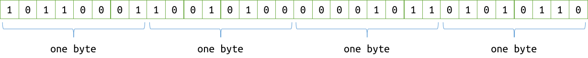

<style>
section::after {
  content: attr(data-marpit-pagination) '/' attr(data-marpit-pagination-total);
}
</style>

# CS100 Lecture 2

Variables <span style="color: black; font-family: Times New Roman; font-size: 1.05em;">I</span> and Arithmetic Types

---

## Contents

- Variable declaration
- Arithmetic types
  - Bits and bytes
  - Integer types
  - Real floating types
  - Character types
  - Boolean type

# Variable declaration

## Type of a variable

Every variable in C has a type.

- The type is **fully deterministic** and **cannot be changed**.
- The type is **known even when the program is not run**.
  - The type is known at **compile-time**.
  -  C is **statically-typed**.   C has a **static type system**.
  - In contrast, Python is **dynamically-typed**.

## Statically-typed vs dynamically-typed

Python: dynamically typed

```python
a = 42       # Type of a is int.
a = "hello"  # Type of a becomes str.
```

C: statically-typed

```c
int a = 42;  // Type of a is int.
a = "hello"; // Error! Types mismatch!
```

The type of a variable

- is explicitly written on declaration, and is known at compile-time, and cannot be changed

A type-related error in C is *(usually)* a **compile error**:
- It stops the compiler. The executable will not be generated.

## Declare a variable

To declare a variable, we need to specify its **type** and **name**.

```c
Type name;
```

We may declare multiple variables of a same type in one declaration statement, separated by `,`:

```c
int x, y; // Declares two variables `x` and `y`, both having type `int`.
```

A **variable declaration** can be placed

- inside a function, which declares a **local variable**, or
- outside of any functions, which declares a **global variable**.

## Readability matters

**[Best practice]** <u>Declare the variable when you first use it!</u>

- If the declaration and use of the variable are too separated, it will become much more difficult to figure out what they are used for as the program goes longer.

**[Best practice]** <u>Use meaningful names!</u>

- The program would be a mess if polluted with names like `a`, `b`, `c`, `d`, `x`, `y`, `cnt`, `cnt_2`, `flag1`, `flag2`, `flag3` everywhere.
- Use meaningful names: `sumOfScore`, `student_cnt`, `open_success`, ...

**Readability is very important.** Many students debug day and night simply because their programs are not human-readable.

## Use of global variables

One reason for using global variables is to have them shared between functions:


```c
void work(void) {
  // Error: `input` was not decared
  // in this scope.
  printf("%d\n", input);
}
int main(void) {
  int input;
  scanf("%d", &input);
  work();
}
```

## Initialize a variable

A variable can be **initialized** on declaration.

```c
int x = 42; // Declares the variable `x` of type `int`,
            // and initializes its value to 42.
int a = 0, b, c = 42; // Declares three `int` variables, with `a` initialized
                      // to 0, `c` initialized to 42, and `b` uninitialized.
```

This is syntactically **different** (though seems equivalent) to

```c
int x;  // Declares `x`, uninitialized.
x = 42; // Assigns 42 to `x`.
```

**[Best practice]** <u>Initialize the variable if possible. Prefer initialization to later assignment.</u>

# Arithmetic types

## Integer types

Is `int` equivalent to 正整数?

- Is there a limitation on the numbers that `int` can represent?

Experiment:


```c
#include <stdio.h>

int main(void) {
  int x = 1;
  while (1) {
    printf("%d\n", x);
    x *= 2; // x = x * 2
    getchar();
  }
}
```

- ```
  1073741824
  -2147483648
  0
  0
  ```

## Bits and bytes

Information is stored in computers **in binary**.

- $42_{\text{ten}}=101010_{\text{two}}$.

A **bit** is either $0$ or $1$.

- The binary representation of $42$ consists of $6$ bits.

A **byte** is $8$ bits ${}^{\textcolor{red}{2}}$ grouped together like $10001001$.

- At least $1$ byte is needed to store $42$.
- At least $3$ bytes are needed to store $142857_{\text{ten}}=100010111000001001_{\text{two}}$

A 32-bit number: $2979269462_{\text{ten}}=10110001100101000000101101010110_{\text{two}}$.

<a align="center">
  
</a>

## Integer types

An integer type in C is either **signed** or **unsigned**, and has a **width** denoting the number of bits that can be used to represent values.

Suppose we have an integer type of $n$ bits in width.

- If the type is **signed** ${}^{\textcolor{red}{3}}$, the range of values that can be represented is $\left[-2^{n-1},2^{n-1}-1\right]$.
- If the type is **unsigned**, the range of values that can be represented is $\left[0, 2^n-1\right]$.


<a align="center">
  
</a>

- The keyword `int` is optional in types other than `int`:
  - e.g. `short int` and `short` name the same type.
  - e.g. `unsigned int` and `unsigned` name the same type.

- "Unsigned-ness" needs to be written explicitly: `unsigned int`, `unsigned long`, ...
- Types without the keyword `unsigned` are signed by default:
  - e.g. `signed int` and `int` name the same type.
  - e.g. `signed long int`, `signed long`, `long int` and `long` name the same type.

## Width of integer types

<div align="center">

| type        | width (at least) | width (usually) |
| ----------- | ---------------- | --------------- |
| `short`     | 16 bits          | 16 bits         |
| `int`       | 16 bits          | 32 bits         |
| `long`      | 32 bits          | 32 or 64 bits   |
| `long long` | 64 bits          | 64 bits         |
</div>

- A signed type has the same width as its `unsigned` counterpart.
- **It is also guaranteed that `sizeof(short)` $\leqslant$ `sizeof(int)` $\leqslant$ `sizeof(long)` $\leqslant$ `sizeof(long long)`.**
  - `sizeof(T)` is the number of **bytes** that `T` holds.

## Implementation-defined behaviors

The standard states that the exact width of the integer types is **implementation-defined**.

- **Implementation**: The compiler and the standard library.
- An implementation-defined behavior depends on the compiler and the standard library, and is often also related to the hosted environment (e.g. the operating system).

## Which one should I use?

**`int` is the most optimal integer type for the platform.**

- Use `int` for integer arithmetic by default.
- Use `long long` if the range of `int` is not large enough.
- Use smaller types (`short`, or even `unsigned char`) for memory-saving or other special purposes.
- Use `unsigned` types for special purposes. We will see some in later lectures.

## Real floating types

"Floating-point": The number's radix point can "float" anywhere to the left, right, or between the significant digits of the number.

Real floating-point types can be used to represent *some* real values.

- Real floating-point types $\neq\mathbb R$.

## Which one should I use?

Use `double` for real floating-point arithmetic by default.

- In some cases the precision of `float` is not enough.
- Don't worry about efficiency! `double` arithmetic is not necessarily slower than `float`.

**Do not use floating-point types for integer arithmetic!**

## `scanf`/`printf`

<div style="display: grid; grid-template-columns: 1fr 1fr;">
  <div align="center">

| type        | format specifier |
| ----------- | ---------------- |
| `short`     | `%hd`            |
| `int`       | `%d`             |
| `long`      | `%ld`            |
| `long long` | `%lld`           |
|  </div>||
  <div align="center">

| type                 | format specifier |
| -------------------- | ---------------- |
| `unsigned short`     | `%hu`            |
| `unsigned`           | `%u`             |
| `unsigned long`      | `%lu`            |
| `unsigned long long` | `%llu`           |
  </div>
</div>

- `%f` for `float`, `%lf` for `double`, and `%Lf` for `long double`.

## Character types

The C standard provides three **different** character types: `signed char`, `unsigned char` and `char`.

Let `T` $\in\{$`signed char`, `unsigned char`, `char`$\}$. It is guaranteed that

`1 == sizeof(T) <= sizeof(short) <= sizeof(int) <= sizeof(long) <= sizeof(long long)`.
- **`T` takes exactly 1 byte**.

Question: What is the valid range of `signed char`? `unsigned char`?

- `signed char`: $[-128, 127]$.
- `unsigned char`: $[0, 255]$.

What? A character is an integer?

## ASCII (American Standard Code for Information Interchange)

<a align="center">
  
</a>

Important things to remember:

- $[$`'0'`$,$`'9'`$]=[48, 57]$.
- $[$`'A'`$,$`'Z'`$]=[65, 90]$.
- $[$`'a'`$,$`'z'`$]=[97, 122]$.

## [Best practice] <u>Avoid magic numbers</u>

What is the meaning of `32` here? $\Rightarrow$ a magic number.

```c
char to_uppercase(char x) {
  return x - 32;
}
```

Write it in a more human-readable way:

```c
char to_uppercase(char x) {
  return x - ('a' - 'A');
}
```

## Escape sequence

Some special characters are not directly representable: newline, tab, quote, ...

<div style="display: grid; grid-template-columns: 1fr 1fr;">
  <div align="center">

| escape sequence | description  |
| --------------- | ------------ |
| `\'`            | single quote |
| `\"`            | double quote |
| `\\`            | backslash    |
  </div>
  <div align="center">

| escape sequence | description     |
| --------------- | --------------- |
| `\n`            | newline         |
| `\r`            | carriage return |
| `\t`            | horizontal tab  |
  </div>
</div>

## Character types

`char`, `signed char` and `unsigned char` are **three different types**.

- Whether `char` is signed or unsigned is **implementation-defined**.
- If `char` is signed (unsigned), it represents the same set of values as the type `signed char` (`unsigned char`), but **they are not the same type**.
  - In contrast, `T` and `signed T` are the same type for `T` $\in\{$`short`, `int`, `long`, `long long`$\}$.

For almost all cases, use `char` (or, sometimes `int`) to represent characters.

`signed char` and `unsigned char` are used for other purposes.

To read/print a `char` using `scanf`/`printf`, use `%c`.

## Boolean type: `bool` (since C99)

A type that represents true/false, 0/1, yes/no, ...

To access the name `bool`, `true` and `false`, `<stdbool.h>` is needed. (until C23)

Example: Define a function that accepts a character and returns whether that character is a lowercase letter.

<div style="display: grid; grid-template-columns: 1fr 1fr;">
  <div>

Before C99, using `int`, `0` and `1`:

```c
int is_lowercase(char c) {
  if (c >= 'a' && c <= 'z')
    return 1;
  else
    return 0;
}
```
  </div>
  <div>

Since C99, using `bool`, `false` and `true`:

```c
bool is_lowercase(char c) {
  if (c >= 'a' && c <= 'z')
    return true;
  else
    return false;
}
```
  </div>
</div>

<div style="display: grid; grid-template-columns: 1fr 1fr;">
  <div>

Before C99, using `int`, `0` and `1`:

```c
int is_lowercase(char c) {
  if (c >= 'a' && c <= 'z')
    return 1;
  else
    return 0;
}
```
  </div>
  <div>

Since C99, using `bool`, `false` and `true`:

```c
bool is_lowercase(char c) {
  if (c >= 'a' && c <= 'z')
    return true;
  else
    return false;
}
```
  </div>
</div>

Both return values can be used as follows:

```c
char c; scanf("%c", &c);
if (is_lowercase(c)) {
  // do something when c is lowercase ...
}
```

