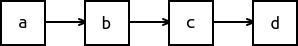

# CS100 Lecture 23

More on STL: Sequence containers and associative containers

---

## Contents

More on STL: Sequence containers and associative containers

- Overview of STL
- Sequence containers
- Associative containers

---

# Overview of STL

---

## **S**tandard **T**emplate **L**ibrary

Added into C++ in 1994.

- Containers
- Iterators (In Lecture 20)
- Algorithms (In Lecture 20)
- Function objects
- Some other adaptors, like container adaptors and iterator adaptors
- Allocators

The next generation: [C++20 Ranges](https://en.cppreference.com/w/cpp/ranges)

---

## [Containers](https://en.cppreference.com/w/cpp/container)

- Sequence containers
  - `vector`, `list`, `deque`, `array` (since C++11), `forward_list` (since C++11)
- Associative containers
  - `set`, `map`, `multiset`, `multimap` (often implemented with *binary search trees*)
- Unordered associative containers (since C++11)
  - `unordered_set`, `unordered_map`, `unordered_multiset`, `unordered_multimap` (implemented with *hash tables*)
- Container adaptors: provide a different interface for sequential containers, but they are not containers themselves.
  - `stack`, `queue`, `priority_queue`
  - (since C++23) `flat_set`, `flat_map`, `flat_multiset`, `flat_multimap`

---

## [Iterators](https://en.cppreference.com/w/cpp/iterator)

### Without iterators:

- Traverse an array
  ```cpp
  for (int i = 0; i != sizeof(a) / sizeof(a[0]); ++i)
    do_something(a[i]);
  ```
- Traverse a `vector`
  ```cpp
  for (std::size_t i = 0; i != v.size(); ++i)
    do_something(v[i]);
  ```
- Traverse a linked-list?
  ```cpp
  for (ListNode *p = l.head(); p; p = p->next)
    do_something(p->data);
  ```

---

## [Iterators](https://en.cppreference.com/w/cpp/iterator)

A generalization of pointers, used to access elements in different containers **in a uniform manner**.

### With iterators:

The following works no matter whether `c` is an array, a `std::string`, or any container.

```cpp
for (auto it = std::begin(c); it != std::end(c); ++it)
  do_something(*it);
```

**Equivalent way: range-based for loops**

```cpp
for (auto &x : c) do_something(x);
```

---

## [Algorithms](https://en.cppreference.com/w/cpp/algorithm)

The algorithms library defines functions for a variety of purposes:
- searching, sorting, counting, manipulating, ...

Examples:

```cpp
// assign every element in `a` with the value `x`.
std::fill(a.begin(), a.end(), x);
// sort the elements in `b` in ascending order.
std::sort(b.begin(), b.end());
// find the first element in `b` that is equal to `x`.
auto pos = std::find(b.begin(), b.end(), x);
// reverse the elements in `c`.
std::reverse(c.begin(), c.end());
```

---

## [Algorithms](https://en.cppreference.com/w/cpp/algorithm)

Example: Obtain the rank of each number in a sequence.

```cpp
auto getRank(const std::vector<int> &data) {
  auto tmp = data;
  std::sort(tmp.begin(), tmp.end()); // sort
  auto pos = std::unique(tmp.begin(), tmp.end()); // drop duplicates
  auto ret = data;
  for (auto &x : ret)
    x = std::lower_bound(tmp.begin(), pos, x) - tmp.begin(); // binary search
  return ret;
}
```

---

## Function objects

Things that look like "functions": *Callable*
- functions, and also function pointers
- objects of a class type that has an overloaded `operator()` (the function-call operator)
- lambda expressions

The standard library has defined some common function objects: `std::less`, `std::greater`, ...

```cpp
std::sort(a.begin(), a.end(), std::greater<>{}); // Sort in descending order.
```

---

## Adaptors

Container adaptors: `std::stack`, `std::queue`, `std::priority_queue`
- Represent the stack, queue and the priority-queue data structures respectively.
- They are **not** containers themselves. They are based on some underlying container, and provide the interfaces of the corresponding data structures.

```cpp
std::stack<int> stk; // By default, uses `std::deque<int>` as
                     // the underlying container.
std::stack<int, std::vector<int>> stk2; // Uses `std::vector<int>`.
```

Iterator adaptors: To be discussed in recitations.

---

# Sequence containers

Note: `std::string` is not treated as a container but behaves much like one.

---

## Sequence containers

- `std::vector<T>`: dynamic contiguous array (we are quite familiar with)

<a align="center">
  
</a>

- `std::deque<T>`: **d**ouble-**e**nded **que**ue (often pronounced as "deck")
  - `std::deque<T>` supports fast insertion and deletion **at both its beginning and its end**. (`push_front`, `pop_front`, `push_back`, `pop_back`)

<a align="center">
  
</a>

- `std::array<T, N>`: same as `T[N]`,but it is a **container**
  - It will never decay to `T *`.
  - Container interfaces are provided: `.at(i)`, `.front()`, `.back()`, `.size()`, ..., as well as iterators.

---

## Sequence containers

- `std::list<T>`: doubly-linked list
  - `std::list<T>` supports fast insertion and deletion **anywhere in the container**,
  - but fast random access is not supported (i.e. no `operator[]`).
  - Bidirectional traversal is supported.

<a align="center">
  
</a>

- `std::forward_list<T>`: singly-linked list
  - Intended to save time and space (compared to `std::list`).
  - Only forward traversal is supported.

<a align="center">
  
</a>

---

## Interfaces

STL containers have consistent interfaces. See [here](https://en.cppreference.com/w/cpp/container#Member_function_table) for a full list.

Element access:

- `c.at(i)`, `c[i]`: access the element indexed `i`. `at` performs bounds checking, and throws `std::out_of_range` if `i` exceeds the valid range.
- `c.front()`, `c.back()`: access the front/back element.

---

## Interfaces

Size and capacity: `c.size()` and `c.empty()` are what we already know.

- `c.resize(n)`, `c.resize(n, x)`: adjust the container to be with exactly `n` elements. If `n > c.size()`, `n - c.size()` elements will be appended.
  - `c.resize(n)`: Appended elements are **value-initialized**.
  - `c.resize(n, x)`: Appended elements are copies of `x`.
- `c.capacity()`, `c.reserve(n)`, `c.shrink_to_fit()`: only for `string` and `vector`.
  - `c.capacity()` returns the capacity (number of elements that *can* be stored in the current storage)
  - `c.reserve(n)`: reserves space for at least `n` elements.
  - `c.shrink_to_fit()`: requests to remove the unused capacity, so that `c.capacity() == c.size()`.

---

## Interfaces

Modifiers:

- `c.push_back(x)`, `c.emplace_back(args...)`, `c.pop_back()`: insert/delete elements at the end of the container.
- `c.push_front(x)`, `c.emplace_front(args...)`, `c.pop_front()`: insert/delete elements at the beginning of the container.
- `c.clear()` removes all the elements in `c`.

---

## Interfaces

Modifiers:

- `c.insert(...)`, `c.emplace(...)`, `c.erase(...)`: insert/delete elements at a specified location.
  - **Warning**: For containers that need to maintain contiguous storage (`string`, `vector`, `deque`), insertion and deletion somewhere in the middle can be **very slow** ($O(n)$).
  - These functions have a lot of overloads. Remember a few common ones, and STFW (Search The Friendly Web) when you need to use them.

---

## Interfaces

Some of these member functions are not supported on some containers, **depending on the underlying data structure**. For example:
- Any operation that modifies the length of the container is not allowed for `array`.
- `push_front`, `emplace_front` and `pop_front` are not supported on `string`, `vector` and `array`.
- `size` is not supported on `forward_list` in order to save time and space.
- `operator[]` and `at` are not supported on linked-lists.

[This table](https://en.cppreference.com/w/cpp/container#Member_function_table) tells you everything.

---

## Iterators

Every container has its iterator: `Container::iterator`. e.g. `std::vector<int>::iterator`, `std::forward_list<std::string>::iterator`

- `auto` comes to our rescue!

`c.begin()` returns the iterator to the first element of `c`.

`c.end()` returns the iterator to **the element following the last element** of `c`.

<a align="center">
  
</a>

---

## Iterator categories

[**ForwardIterators**](https://en.cppreference.com/w/cpp/named_req/ForwardIterator): supports `*it`, `it->mem`, `++it`, `it++`, `it1 == it2`, `it1 != it2`

[**BidirectionalIterator**](https://en.cppreference.com/w/cpp/named_req/BidirectionalIterator): a ForwardIterator that can be moved in both directions
- supports `--it` and `it--`.

[**RandomAccessIterator**](https://en.cppreference.com/w/cpp/named_req/RandomAccessIterator): a BidirectionalIterator that can be moved to point to any element in constant time.
- supports `it + n`, `n + it`, `it - n`, `it += n`, `it -= n` for an integer `n`.
- supports `it[n]`, equivalent to `*(it + n)`.
- supports `it1 - it2`, returns the **distance** of two iterators.
- supports `<`, `<=`, `>`, `>=`.

---

## Iterator categories

[**ForwardIterators**](https://en.cppreference.com/w/cpp/named_req/ForwardIterator): an iterator that can be moved forward.
- `forward_list<T>::iterator`

[**BidirectionalIterator**](https://en.cppreference.com/w/cpp/named_req/BidirectionalIterator): a ForwardIterator that can be moved in both directions
- `list<T>::iterator`

[**RandomAccessIterator**](https://en.cppreference.com/w/cpp/named_req/RandomAccessIterator): a BidirectionalIterator that can be moved to point to any element in constant time.
- `string::iterator`, `vector<T>::iterator`, `deque<T>::iterator`, `array<T,N>::iterator`

---

## Iterator categories

To know the category of an iterator of a container, consult its type alias member `iterator_category`.

```cpp
using vec_iter = std::vector<int>::iterator;
using category = vec_iter::iterator_category;
```

Put your mouse on `category`, and the IDE will tell you what it is.

It is one of the following tags: `std::forward_iterator_tag`, `std::bidirectional_iterator_tag`, `std::random_access_iterator_tag`.

Note: Two other categories InputIterator and OutputIterator will be discussed in recitations.

---

## Constructors of containers

All sequence containers can be constructed in the following ways:

- `Container c(b, e)`, where `[b, e)` is an **iterator range**.
  - Copies elements from the iterator range `[b, e)`.
- `Container c(n, x)`, where `n` is a nonnegative integer and `x` is a value.
  - Initializes the container with `n` copies of `x`.
- `Container c(n)`, where `n` is a nonnegative integer.
  - Initializes the container with `n` elements. All elements are **value-initialized**.
  - This is not supported by `string`. (Why?)

---

## Constructors of containers

All sequence containers can be constructed in the following ways:

- `Container c(b, e)`, where `[b, e)` is an **iterator range**.
  - Copies elements from the iterator range `[b, e)`.
- `Container c(n, x)`, where `n` is a nonnegative integer and `x` is a value.
  - Initializes the container with `n` copies of `x`.
- `Container c(n)`, where `n` is a nonnegative integer.
  - Initializes the container with `n` elements. All elements are **value-initialized**.
  - This is not supported by `string`, because it is meaningless to have `n` value-initializes `char`s (all of them will be `'\0'`)!

---

# Associative containers

---

## Motivation: set

Represent a "set":
- Quick insertion, lookup and deletion of elements.
- Order does not matter.

Sequence containers do not suffice:
- Lookup of elements is $O(n)$.
- Quick insertion/deletion only happens at certain positions for some containers.
  - e.g. `vector` only supports quick insertion/deletion at the end.
- The order of elements is preserved, which is not important.

You will learn the appropriate data structures in CS101.

---

## `std::set`

Defined in `<set>`.

- `std::set<T>` is a set whose elements are of type `T`. **`operator<(const T, const T)` should be supported**, because it is usually implemented as Red-black trees.
- `std::set<T, Cmp>` is also available. `x < y` will be replaced with `cmp(x, y)`, where `cmp` is a function object of type `Cmp`.

```cpp
std::set<int> s1; // An empty set of ints
std::set<std::string> s2{"hello", "world"}; // A set of strings,
                                            // initialized with two elements
struct Student { std::string name; int id; };
std::set<Student> s3; // No operator< for Student is available.
                      // This line alone does not cause error, but you cannot
                      // insert elements into it.
s3.insert(Student{"Alice", 42}); // Error: No operator< available.
```

---

## `std::set`

Defined in `<set>`.

- `std::set<T>` is a set whose elements are of type `T`. **`operator<(const T, const T)` should be supported**, because `set` is usually implemented as Red-black trees.
- `std::set<T, Cmp>` is also available. `x < y` will be replaced with `cmp(x, y)`, where `cmp` is a function object of type `Cmp`.

```cpp
struct Student { std::string name; int id; };
struct CmpStudentByName {
  bool operator()(const Student &a, const Student &b) const {
    return a.name < b.name;
  }
};
std::set<Student, CmpStudentByName> students; // OK
students.insert(Student{"Alice", 42}); // OK
```

---

## `std::set`

Constructors

```cpp
std::set<Type> s1{a, b, c, ...};
std::set<Type> s2(begin, end); // An iterator range [begin, end)
```

C++17 CTAD (Class Template Argument Deduction) also applies:

```cpp
std::set s1{a, b, c, ...}; // Element type is deduced according to the list
std::set s2(begin, end); // Element type is deduced according to
                         // the type of elements pointed by `begin` and `end`.
```

Besides, `std::set` is copy-constructible, copy-assignable, move-constructible and move-assignable, just as the sequence containers we have learned.

**`std::set` does not contain duplicate elements.** These constructors will ignore duplicate elements.

---

## `std::set`: operations

Common operations: `s.empty()`, `s.size()`, `s.clear()`.

Insertion: `insert` and `emplace`. **Duplicate elements will not be inserted.**
- `s.insert(x)`, `s.insert({a, b, ...})`, `s.insert(begin, end)`.

```cpp
std::set s{3, 2, 5, 5, 1}; // {1, 2, 3, 5}. The duplicate 5 is removed.
std::cout << s.size() << std::endl; // 4
s.insert(42); // {1, 2, 3, 5, 42}
s.insert(42); // Nothing is inserted. (No errors.)
int a[]{10, 20, 30};
s.insert(a, a + 3); // An iterator range.
                    // s now contains {1, 2, 3, 5, 10, 20, 30, 42}.
s.insert({11, 12}); // {1, 2, 3, 5, 10, 11, 12, 20, 30, 42}.
```

---

## `std::set`: insertion

Insertion: `insert` and `emplace`. **Duplicate elements will not be inserted.**
- `s.emplace(args...)`. **Forwards** the arguments `args...` to the constructor of the element type, and constructs the element in-place.

```cpp
std::set<std::string> s;
s.emplace(10, 'c'); // inserts a string "cccccccccc"
```

`s.insert(x)` and `s.emplace(args...)` returns **`std::pair<iterator, bool>`**:
- On success, `.first` is an `iterator` pointing to the inserted element, and `.second` is `true`.
- On failure, `.first` is an `iterator` pointing to the element that prevented the insertion, and `.second` is `false`.

---

## `std::set`: iterators

`s.begin()`, `s.end()`: Begin and off-the-end iterators.

The iterator of `std::set` is **BidirectionalIterator**:
- Supports `*it`, `it->mem`, `++it`, `it++`, `--it`, `it--`, `it1 == it2`, `it1 != it2`.

**The elements are in ascending order**: The following assertion always succeeds (if both `tmp` and `iter` are dereferenceable).

```cpp
auto tmp = iter;
++iter;
assert(*tmp < *iter);
```

---

## `std::set`: iterators

**Elements in a `set` cannot be modified directly**: `*iter` returns a reference-to-`const`.
- The elements are stored in specific positions in the red-black tree, according to their values.
- You cannot change their values arbitrarily.

---

## `std::set`: traversal

Range-for still works!

```cpp
std::set<int> s{5, 5, 7, 3, 20, 12, 42};
for (auto x : s)
  std::cout << x << ' ';
std::cout << std::endl;
```

Output: `3, 5, 7, 12, 20, 42 `. The elements are in ascending order.

Equivalent way: Use iterators

```cpp
for (auto it = s.begin(); it != s.end(); ++it)
  std::cout << *it << ' ';
std::cout << std::endl;
```

---

## `std::set`: deletion

Delete elements: `erase`
- `s.erase(x)`, `s.erase(pos)`, `s.erase(begin, end)`, where `pos` is an iterator pointing to some element in `s`, and `[begin, end)` is an iterator range in `s`.
- `s.erase(x)` removes the element that is equivalent to `x`, **if any**.
  - returns `0` or `1`, indicating the number of elements removed.

```cpp
std::set<int> s{5, 5, 7, 3, 20, 12, 42};
std::cout << s.erase(42) << std::endl; // 42 is removed. output: 1
// s is now {3, 5, 7, 12, 20}.
s.erase(++++s.begin()); // 7 is removed.
```

---

## `std::set`: element lookup

`s.find(x)`, `s.count(x)`, and some other functions.

`s.find(x)` returns an iterator pointing to the element equivalent to `x` (if found), or `s.end()` (if not found).

```cpp
std::set<int> s = someValues();
if (s.find(x) != s.end()) // x is found
  // ...
```

---

## `std::set`: pros and cons

The time complexity of insertion, deletion, and lookup of elements in a `std::set`: **logarithmic in the size of the container**. ($O(\log n)$)
- Compared to sequence containers, this is (almost) a huge improvement.

Elements are sorted automatically.

Fast random access like `v[i]` is not supported.

---

## Other kinds of sets:

Sets based on red-black trees:
- [`std::set`](https://en.cppreference.com/w/cpp/container/set)
- [`std::multiset`](https://en.cppreference.com/w/cpp/container/multiset): allows duplicate elements

Sets based on hash-tables: (since C++11)
- [`std::unordered_set`](https://en.cppreference.com/w/cpp/container/unordered_set): hash-table version of `std::set`
- [`std::unordered_multiset`](https://en.cppreference.com/w/cpp/container/unordered_multiset): allows duplicate elements

Sets based on hash-tables provides (average-case) $O(1)$ time operations, but requires the data to be hashable.

---

## Motivation: map

Represent a map: $f:S\to T$.

- For sequence containers `Container<Type>`: $S=\{0,1,2,\cdots,N-1\}$ (index), $T$ is the set of values of type `Type`.
- For `std::set<Type>`: $T=\{\text{exist}, \text{not-exist}\}$, $S$ is the set of values of type `Type`.

`std::map<Key, Value>`: defined in `<map>`
- `Key` is the type of elements in $S$, and `Value` is the type of elements in $T$.
- Stores "key-value" pairs.

---

## Motivation: map

Example: Count the occurrences of strings.

```cpp
std::map<std::string, int> counter; // maps every string to an integer
std::string word;
while (std::cin >> word)
  ++counter[word]; // !!
```

Now for any string `str`, `counter[str]` is an integer indicating how many times `str` has occurred.

---

## `std::map`: comparison with `std::set`

`std::map<Key, Value>` has two template parameters: `Key` and `Value`.
- If we ignore `Value`, it is a `std::set<Key>`.
  - Duplicate keys are not allowed.
  - `operator<(const Key, const Key)` is required.
  - Elements are stored **in ascending order of keys**.
  - Keys cannot be modified directly.
- The element type of `std::map<Key, Value>` is `std::pair<const Key, Value>`.
  - `*iter` returns `std::pair<const Key, Value> &`.

---

## `std::map`: comparison with `std::set`

Constructors:
- `std::map<Key, Value> m{{key1, value1}, {key2, value2}, ...};`
- `std::map<Key, Value> m(begin, end)`, but the elements should be pairs:

  ```cpp
  std::vector<std::pair<int, int>> v{{1, 2}, {3, 4}};
  std::map<int, int> m(v.begin(), v.end());
  ```

Insertion:
- `m.insert({key, value})`
- `m.insert({{key1, value1}, {key2, value2}, ...})`
- `m.insert(begin, end)`

---

## `std::map`: comparison with `std::set`

Deletion:
- `m.erase(pos)`, `m.erase(begin, end)`: same as `std::set<T>::erase`.
- `m.erase(key)`: Removes the element whose *key* is `key`.

Iterators: **BidirectionalIterator**, pointing to `std::pair<const Key, Value>`.

```cpp
std::map<std::string, int> counter = someValues();
for (auto it = counter.begin(); it != counter.end(); ++it)
  std::cout << it->first << " occurred " << it->second << " times.\n";
```

---

## `std::map`: traversal

Use range-for:

```cpp
for (const auto &kvpair : counter)
  std::cout << kvpair.first << " occurred " << kvpair.second << " times.\n";
```

It's so annoying to deal with the `pair` stuff...

---

## `std::map`: traversal

Use range-for:

```cpp
for (const auto &kvpair : counter)
  std::cout << kvpair.first << " occurred " << kvpair.second << " times.\n";
```

It's so annoying to deal with the `pair` stuff...

**C++17 structured binding** kills the game!

```cpp
for (const auto &[word, occ] : counter)
  std::cout << word << " occurred " << occ << " times.\n";
```

(Looks very much like Python unpacking.)

---

## `std::map`-specific: `operator[]`

`m[key]` finds the key-value pair whose *key* is equivalent to `key`.
- If such *key* does not exist, inserts `{key, Value{}}` - the *value* is **value-initialized**.
- Then, returns reference to the *value*.

```cpp
std::map<std::string, int> counter;
std::string word;
while (std::cin >> word)
  ++counter[word]; // If `word` does not exist in `counter`,
                   // a pair {word, 0} is inserted first.
```

---

## `std::map`: element lookup

`m.find(key)`, `m.count(key)`, and some other member functions.

Note: `m.find(key)` does not insert elements. `m[key]` will insert an element if that *key* does not exist.

---

## Other kinds of maps:

Maps based on red-black trees:
- [`std::map`](https://en.cppreference.com/w/cpp/container/map)
- [`std::multimap`](https://en.cppreference.com/w/cpp/container/multimap): allows duplicate *keys*

Maps based on hash-tables: (since C++11)
- [`std::unordered_map`](https://en.cppreference.com/w/cpp/container/unordered_map): hash-table version of `std::map`
- [`std::unordered_multimap`](https://en.cppreference.com/w/cpp/container/unordered_multimap): allows duplicate *keys*

Maps based on hash-tables provides (average-case) $O(1)$ time operations, but requires the *key* to be hashable.

---

## Summary

Sequence containers

- `std::vector<T>`: dynamic contiguous array (we are quite familiar with)

<a align="center">
  
</a>

- `std::deque<T>`: **d**ouble-**e**nded **que**ue (often pronounced as "deck")

<a align="center">
  
</a>

- `std::array<T, N>`: same as `T[N]`, but it is a **container**
- `std::list<T>`: doubly-linked list

<a align="center">
  
</a>

- `std::forward_list<T>`: singly-linked list

<a align="center">
  
</a>

---

## Summary

Associative containers

- `std::set<T>`: A finite set $\{e_1,e_2,\cdots,e_n\}$ where elements are of type `T`.
- `std::map<Key, Value>`: A map $f:S\mapsto T$, where $S$ and $T$ are the sets of values of type `Key` and `Value` respectively.
- `std::set` and `std::map` are **ordered**: `T` and `Key` need to have an ordering, either in the form of `operator<` or some user-supplied comparator.
- `std::unordered_set` and `std::unordered_map` are **unordered** and hash-based.
