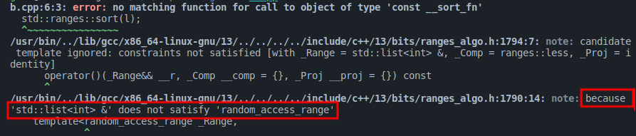

# CS100 Lecture 28

Compile-time Computations and Metaprogramming

---

## Contents

- Example: Binary literals
- `constexpr` and `consteval`
- `concept` and constraints
- Summary

---

# Example: Binary literals

---

## Binary literals

Built-in binary literals support: C++14 and C23.

```cpp
switch (rv32inst.opcode) { // 32-bit RISC-V instruction opcode
  case 0b0110011: /* R-format */
  case 0b0010011: /* I-format (not load) */
  case 0b0000011: /* I-format: load */
  case 0b0100011: /* S-format */
  // ...
}
```

How do people write binary literals when there is no built-in support?

---

## Runtime solution? No!

This is not satisfactory: The value is computed at run-time!

```cpp
int dec2bin(int x) {
  int result = 0, pow_two = 1;
  while (x > 0) {
    result += (x % 10) * pow_two;
    x /= 10;
    pow_two *= 2;
  }
  return result;
}

void foo(const RV32Inst &inst) {
  const int forty_two = dec2bin(101010); // correct, but slow.
  switch (inst.opcode) {
    case dec2bin(110011): // Error! 'case' label must be compile-time constant!
        // ...
  }
}
```

---

## Preprocessor metaprogramming solution

`#` and `##` operators: Both are used in function-like macros.

`#x`: stringify `x`.

```cpp
#define SHOW_VALUE(x) std::cout << #x << " == " << x

int ival = 42;
SHOW_VALUE(ival); // std::cout << "ival" << " == " << ival;
```

`a##b`: Concatenate `a` and `b`.

```cpp
#define DECLARE_HANDLER(name) void handler_##name(int err_code)

DECLARE_HANDLER(overflow); // void handler_overflow(int err_code);
```

---

## Preprocessor metaprogramming solution

https://stackoverflow.com/a/68931730/8395081

```cpp
#define BX_0000 0
#define BX_0001 1
#define BX_0010 2
// ......
#define BX_1110 E
#define BX_1111 F

#define BIN_A(x) BX_##x

#define BIN_B(x, y) 0x##x##y
#define BIN_C(x, y) BIN_B(x, y)

#define BIN(x, y) BIN_C(BIN_A(x), BIN_A(y))

const int x = BIN(0010, 1010); // 0x##BX_0010##BX_1010 ==> 0x2a ==> 42
```

---

## Template metaprogramming solution

```cpp
template <unsigned N> struct Binary {
  static const unsigned value = Binary<N / 10>::value * 2 + (N % 10);
};
template <> struct Binary<0u> {
  static const unsigned value = 0;
};

void foo(const RV32Inst &inst) {
  const auto x = Binary<101010>::value; // 42
  switch (inst.opcode) {
    case Binary<110011>::value: // OK.
      // ...
  }
}
```

Compared to preprocessor metaprogramming, template metaprogramming is more powerful, and less error-prone.

---

## Modern C++: `constexpr` function

Just mark the function `constexpr`, and the compiler will be able to execute it!

```cpp
constexpr int dec2bin(int x) {
  int result = 0, pow_two = 1;
  while (x > 0) {
    result += (x % 10) * pow_two; x /= 10; pow_two *= 2;
  }
  return result;
}
void foo(const RV32Inst &inst) {
  switch (inst.opcode) {
    case dec2bin(101010): // OK. Since 101010 is a compile-time constant,
                          // the function is executed at compile-time and
                          // produces a compile-time constant.
      // ...
  }
}
```

---

## Metaprogramming

Metaprogramming is a programming technique in which computer programs have the ability to **treat other programs as their data**.

- Read, generate, analyze or transform other programs, and even itself.

---

## Typical problems that needs metaprogramming

Write a function that selects different behaviors **at compile-time** according to the argument?

- e.g. The `std::distance` function (in this week's recitation).

Generate some code according to the members of my class, without too much manual modification?

- e.g. Serialization: Generate `operator>>` automatically for my class that prints the members one-by-one?
- e.g. "Metaclasses": Generate the getters and setters automatically for each of my data members?

......

---

## Compile-time computations

How much work can be done in compile-time?

- Call to numeric functions with compile-time known arguments?
  - e.g. Can `std::acos(-1)` be computed in compile-time?
- Manipulation of compile-time known strings?
  - e.g. Preparation of compile-time known regular expressions: [CTRE](https://github.com/hanickadot/compile-time-regular-expressions)
- Even crazier: [Compile-time raytracer?!](https://github.com/cdgiessen/CERT)
  - The computations are done entirely in compile-time. At run-time, the only work is to output the image.

**Anything can be computed in compile-time, provided that the arguments are compile-time known!**

---

# `constexpr` and `consteval`

---

## `constexpr`

**Constant expressions**: expressions that are evaluated at compile-time.

`constexpr` variables:

```cpp
constexpr double dval = 5.2;
const int ival = 42;
```

By declaring a variable `constexpr`, we mean that its value is compile-time known, and will not change.

- A `constexpr` variable is implicitly `const`.
- It must be initialized from a constant expression. Otherwise, an compile-error.

A `const` variable initialized from a constant expression is also a constant expression.

---

## `constexpr` functions

`constexpr` functions are **potentially** executed at compile-time:

- When the arguments are constant expressions, it is run at compile-time and produces a constant expression.
- When the arguments are not constant expressions, it is run at run-time just like a normal function.

```cpp
constexpr int gcd(int a, int b) {
  while (b != 0) { a = std::exchange(b, a % b); }
  return a;
}
int main() {
  const int x = 10, y = 16;
  constexpr auto result = gcd(x, y); // OK. The result is a constant expression.
  int n, m; std::cin >> n >> m;
  std::cout << gcd(n, m) << '\n'; // OK. It is computed at run-time.
}
```

---

## `constexpr` member functions

Member functions may also be `constexpr`. This is particularly useful for some very simple classes:

```cpp
class StringView { // The 'StringView' class in lecture 27.
  const char *mStart{nullptr};
  std::size_t mLength{0};
public:
  // constructors
  constexpr StringView(const char *cstr);
  constexpr StringView(const std::string &str);
  // length
  constexpr std::size_t size() const { return mLength; }
  constexpr bool empty() const { return mStart; }
  // searching
  constexpr std::size_t find(char c, std::size_t pos = 0) const;
  // ...
};
```

---

## Evolution of `constexpr` functions

`constexpr` was first introduced in C++11, with many restrictions:

- A single `return` statement only. No loops or branches.
- `constexpr` member functions are implicitly `const`: They cannot modify the data members.
- `virtual` functions cannot be `constexpr`.
- Very little standard library support. 
- ......

At that time, it was *almost* Turing-complete.

---

## Evolution of `constexpr` functions

In C++14:

- Multiple statements, loops and branches are allowed.
- `constexpr` member functions are no longer implicitly `const`.
- `constexpr` lambdas are still not yet allowed.
- Definitely Turing-complete.

In C++17:

- Much more standard library support: A lot more functions are made `constexpr` since C++17.
- Lambdas are automatically `constexpr` when it can be.

---

## Evolution of `constexpr` functions

**C++20: A huge step!**

- `constexpr` functions can perform **dynamic memory allocations**!
  - Memory allocated at compile-time must also be released at compile-time.
- **Destructors** can be `constexpr`!
- Standard library **containers** like `std::vector`, `std::string` can be `constexpr`!
- Standard library **algorithms** are `constexpr`!
- `virtual` functions can be `constexpr`!

---

## C++20: `constexpr` support in the standard library

```cpp
#include <vector>
#include <algorithm>

constexpr int find_or_42(const std::vector<int> &vec, int target) {
  auto found = std::ranges::find(vec, target); // compile-time search
  return found == vec.end() ? 42 : *found;
}

int main() {
  // 'vec' is initialized in compile-time!
  constexpr auto result_1 = find_or_42({1, 4, 2, 8, 5, 7}, 10); // 42
  constexpr auto result_2 = find_or_42({2, 3, 5, 7}, 3);        // 3
  static_assert(result_1 == 42);
  static_assert(result_2 == 3);
}
```

---

## `constexpr` numeric functions

Since C++23, some simple numeric functions in `<cmath>`, like `abs`, `ceil`, `floor`, `trunc`, `round`, ... are `constexpr`.

Since C++26, the **power, square/cubic root, trigonometric, hyperbolic, exponential and logarithmic** functions are all `constexpr`!

---

## `constexpr` functions are pure

**Pure functions** (mathematical functions):

- Produce the same result when given the same arguments.
- Have no side effects. They cannot modify the value of variables outside them.
- Don't change the state of the program.

---

## `consteval`: Immediate functions

`consteval` generates an *immediate* function.

- Every call of an immediate function generates a constant expression that is executed at compile-time.

`consteval`

- cannot be applied to destructors.
- has the same requirements as a `constexpr` function.

---

## `consteval`: Immediate functions

- `constexpr`: **potentially** executed at compile-time.
- `consteval`: **must be** executed at compile-time.

```cpp
consteval int sqr(int n) { return n * n; }
constexpr int r = sqr(100); // OK.
int x = 100;     // 'x' is not a constant expression!
int r2 = sqr(x); // Error: 'sqr' must be called with constant expressions.
```

Note: A non-`const` variable is not treated as a constant expression, even if initialized from a constant expression.

---

# `concept` and constraints

---

## Motivating example: sorting a `std::list`.

How should we sort a `std::list`?

```cpp
std::list<int> l = some_list();
std::sort(l.begin(), l.end());  // Is this correct?
```

---

<a align="center">
  
</a>

---

## Motivating example: sorting a `std::list`.

How should we sort a `std::list`?

```cpp
std::list<int> l = some_list();
std::sort(l.begin(), l.end());  // No! We should use 'l.sort()'.
```

Ooops! `std::sort` requires a pair of ***RandomAccessIterator***s, but `std::list<T>::iterator` is not.

- But how can I understand the output of the compiler? It is complaining about "Invalid operands to `operator-`" ......

---

## Motivating example: sorting a `std::list`.

Let's look at how `std::sort` is declared:

```cpp
template <typename Iterator, typename Pred>
void sort(Iterator begin, Iterator end, Pred compare);
```

`Iterator` is just a type deduced from the argument without any restrictions!

- In fact, this declaration accepts *anything* we pass to it.
- Errors can only be reported inside the function body, which might be in the form of "no match for ......".

---

## Constraining the template arguments

```cpp
template <typename Iterator, typename Pred>
void sort(Iterator begin, Iterator end, Pred compare);
```

Can we declare the function with some constraints on the type `Iterator`?

- We need something like

  ```cpp
  template <RandomAccessIterator Iterator, typename Pred>
  void sort(Iterator begin, Iterator end, Pred compare);
  ```

---

## `concept`

A `concept` is a named set of **requirements** often used to constrain the template arguments.

Examples:

```cpp
template <typename T>
concept movable = std::is_object_v<T> &&
                  std::move_constructible<T> &&
                  std::assignable_from<T &, T> &&
                  std::swappable<T>;

template <typename T>
concept Incrementable = requires (T x) {
  { x++ } -> std::same_as<T>;
}
```

---

## Example: Constrained algorithms

The C++20 algorithms in `std::ranges` have well-defined constraints on the arguments:

```cpp
template <std::random_access_iterator I, std::sentinel_for<I> S,
          typename Comp = ranges::less, class Proj = std::identity>
  requires std::sortable<I, Comp, Proj>
constexpr I sort(I first, S last, Comp comp = {}, Proj proj = {});

template<ranges::random_access_range R, typename Comp = ranges::less,
          class Proj = std::identity>
  requires std::sortable<ranges::iterator_t<R>, Comp, Proj>
constexpr ranges::borrowed_iterator_t<R>
    sort(R&& r, Comp comp = {}, Proj proj = {});
```

---

## Example: Constrained algorithms

This time, the compiler will produce some human-readable output on violation of the requirements:

```cpp
std::list<int> l = some_list();
std::ranges::sort(l);
```

<a align="center">
  
</a>

---

## Example: Compile-time polymorphism

<div style="display: grid; grid-template-columns: 1fr 1fr;">
  <div>

Run-time polymorphism:

- "Shape" is a general concept, so we define an abstract base class.

```cpp
struct Shape {
  virtual void draw() const = 0;
  virtual ~Shape() = default;
};
struct Rectangle : Shape {
  void draw() const override;
};
struct Circle : Shape {
  void draw() const override;
};
void drawStuff(const Shape &s) {
  s.draw();
}
```
  </div>
  <div>

Compile-time polymorphism:

- `Shape` is a `concept`!

```cpp
template <typename T>
concept Shape = requires(const T x) {
  x.draw();
};
struct Rectangle {
  void draw() const; // non-virtual
};
struct Circle {
  void draw() const; // non-virtual
};
template <Shape T>
void drawStuff(const T &s) {
  s.draw();
}
```
  </div>
</div>

---

## How `concept` and `requires` benefit template code

Without the C++20 `concept` and `requires`, we need to write the requirements in a "hacky" way through **SFINAE** (Substitution Failure Is Not An Error):

```cpp
template <typename T, typename = std::enable_if_t<std::is_integral_v<T>>>
void increment(T &x) { ++x; }
```

With C++20:

```cpp
template <std::integral T>
void increment(T &x) { ++x; }
```

Or even simpler:

```cpp
void increment(std::integral auto &x) { ++x; }
```

---

# Summary

---

## The past

Back to 1979, the Bell Labs: C with Classes made by Bjarne Stroustrup.

- An object-oriented C with the ideas of "class" from Simula (and several other languages).
- Member functions, derived classes, constructors and destructors, protection mechanisms (`public`, `private`, `friend`), copy control through `operator=`, ...
- Better syntax, better type checking, ...

---

## The past

After C with Classes was seen as a "medium success" by Stroustrup, he moved on to make a better new language - C++ was born (1983).

- Virtual functions, overloading, references, `const`, type checking, ...
- Templates, exceptions, RTTI, namespaces, STL were added in the 1990s.

By the year 1998, C++ had become matured and standardized with the four major parts (*Effective C++* Item 1):

- C
- Object-Oriented C++
- Template C++
- The STL

---

## Entering Modern C++

A huge step since 2011:

- Rvalue references, move semantics, variadic templates, perfect forwarding
- Better template metaprogramming support
- Smart pointers
- `auto` and `decltype`: More benefit from the static type system
- Lambdas, `std::function` and `std::bind`: Functional support
- The concurrency library (`std::thread`, `std::mutex`, `std::atomic`, ...)
- `constexpr`: Support for more straightforward compile-time computations.
- ......

---

## Evolution since C++11

More specialized library facilities:

- `optional`, `any`, `variant`, `tuple`
- `filesystem`: Standardized filesystem library
- `regex`: The regular expression library
- `string_view`: Heading towards the C++20 `views` and `ranges`

More compile-time computation support:

- More restrictions on `constexpr` functions and  `auto` deduction are removed.
- Class Template Argument Deduction (CTAD)

---

## C++20 is historic!

[CppCon2021 Talk by Bjarne Stroustrup: C++20: Reaching the aims of C++](https://www.bilibili.com/video/BV1ha411k7pa)

C++20 is the first C++ standard that delivers on virtually all the features that Bjarne Stroustrup dreamed of in *The Design and Evolution of C++* in 1994.

- Coroutines ([Talk](https://www.bilibili.com/video/BV1FB4y1H7VS?p=13))
- Concepts and requirements (`concept`, `requires`) ([Talk](https://www.bilibili.com/video/BV1ha411k7pa?p=26))
- Modules ([Talk](https://www.bilibili.com/video/BV1ha411k7pa?p=115)) ([Talk on the implementation by MSVC](https://www.bilibili.com/video/BV1ha411k7pa?p=10))
- Ranges library
- Formatting library
- Three-way comparison (`operator<=>`, `std::partial_ordering`, ...)

---

## Future

- Static reflection and metaprogramming ([Talk](https://www.bilibili.com/video/BV1pJ411w7kh?p=70)) ([P2237R0](https://www.open-std.org/jtc1/sc22/wg21/docs/papers/2020/p2237r0.pdf)) ([P1240R1](https://www.open-std.org/jtc1/sc22/wg21/docs/papers/2019/p1240r1.pdf)) ([P2320R0](https://www.open-std.org/jtc1/sc22/wg21/docs/papers/2021/p2320r0.pdf))
- Metaclasses: Generative C++ ([P0707R3](https://www.open-std.org/jtc1/sc22/wg21/docs/papers/2018/p0707r3.pdf))
- Pattern matching ([Talk](https://www.bilibili.com/video/BV1ha411k7pa?p=3)) ([Herb Sutter's `cppfront` project](https://github.com/hsutter/cppfront))
- Structured concurrency support (executors) ([Talk](https://www.bilibili.com/video/BV1ha411k7pa/?p=8)) ([P2300R6](https://www.open-std.org/jtc1/sc22/wg21/docs/papers/2023/p2300r6.html))
- Internal representation of C++ code suitable for analysis ([Talk](https://www.bilibili.com/video/BV1ha411k7pa?p=49)) ([GitHub Page](https://github.com/GabrielDosReis/ipr))
- ......

---

# Goodbye CS100
