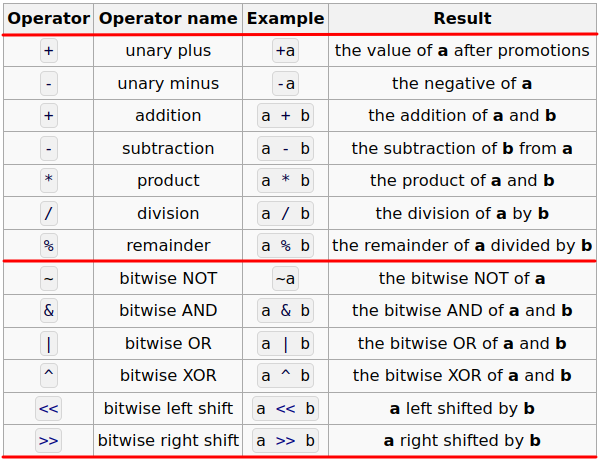
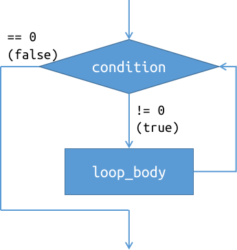
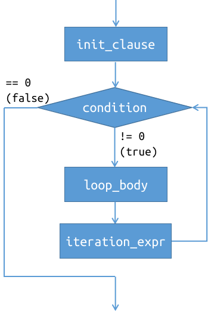

# CS100 Lecture 3

Operators and Control Flow <span style="color: black; font-family: Times New Roman; font-size: 1.05em;">I</span>

---

## Contents

- Operators
  - `+`, `-`, `*`, `/`, `%`
  - Compound assignment operators
  - Signed integer overflow
  - `++` and `--`
- Control flow
  - `if`-`else`
  - `while`
  - `for`

---

# Operators

---

## The calculator

Accept input of the form `x op y`, where `x` and `y` are floating-point numbers and `op` $\in\{$ `'+'`, `'-'`, `'*'`, `'/'` $\}$. Print the result.

<div style="display: grid; grid-template-columns: 1fr 1fr;">
  <div>

```c
#include <stdio.h>

int main(void) {
  double x, y;
  char op;
  scanf("%lf %c %lf", &x, &op, &y);
  if (op == '+')
    printf("%lf\n", x + y);
  else if (op == '-')
    printf("%lf\n", x - y);
```
  </div>
  <div>

```c
  else if (op == '*')
    printf("%lf\n", x * y);
  else if (op == '/')
    printf("%lf\n", x / y);
  else
    printf("Invalid operator.\n");
  return 0;
}
```
  </div>
</div>

---

## Overview of arithmetic operators

<a align="center">
  
</a>

---

## `+`, `-`, `*`, `/`, `%`

- `+` and `-` have two versions: unary (`+a`, `-a`) and binary (`a+b`, `a-b`).
  - The unary `+`/`-` and binary `+`/`-` are **different operators**, although they use the same notation.
- Operator precedence:
  
  $\{$ unary `+`, unary `-` $\}>\{$ `*`, `/`, `%` $\}>\{$ binary `+`, binary `-` $\}$

  e.g. `a + b * c` is interpreted as `a + (b * c)`, instead of `(a + b) * c`.

  $\Rightarrow$ We will talk more about operator precedence later.

---

## Binary `+`, `-` and `*`, `/`

`a + b`, `a - b`, `a * b`, `a / b`

Before the evaluation of such an expression, the operands (`a`, `b`) undergo a sequence of **type conversions**.

- The [detailed rules of the conversions](https://en.cppreference.com/w/c/language/conversion#Usual_arithmetic_conversions) are very complex,
  - including *promotions*, conversions between `signed` and `unsigned` types, conversions between integers and floating-point types, etc.
  - We only need to remember some common ones.
- In the end, the operands will be converted to **a same type**, denoted `T`. **The result type is also `T`.**

---

## Binary `+`, `-` and `*`, `/`

`a + b`, `a - b`, `a * b`, `a / b`

If any one operand is of floating-point type and the other is an integer, **the integer will be implicitly converted to that floating-point type**.

Example:

```c
double pi = 3.14;
int diameter = 20;
WhatType c = pi * diameter; // What is the type of this result?
```

---

## Binary `+`, `-` and `*`, `/`

`a + b`, `a - b`, `a * b`, `a / b`

If any one operand is of floating-point type and the other is an integer, **the integer will be implicitly converted to that floating-point type**.

Example:

```c
double pi = 3.14;
int diameter = 20;
double c = pi * diameter; // 62.8
```

The value of `diameter` is implicitly converted to a value of type `double`. Then, a floating-point multiplication is performed, yielding a result of type `double`.

\* Does this rule make sense?

---

## Binary `+`, `-` and `*`, `/`

`a + b`, `a - b`, `a * b`, `a / b`

If any one operand is of floating-point type and the other is an integer, **the integer will be implicitly converted to that floating-point type**.

Example:

```c
double pi = 3.14;
int diameter = 20;
double c = pi * diameter; // 62.8
```

The value of `diameter` is implicitly converted to a value of type `double`. Then, a floating-point multiplication is performed, yielding a result of type `double`.

\* Does this rule make sense? - Yes, because $\mathbb Z\subseteq\mathbb R$.

---

## Binary `+`, `-` and `*`, `/`

`a + b`, `a - b`, `a * b`, `a / b`

If any one operand is of floating-point type and the other is an integer, **the integer will be implicitly converted to that floating-point type**, and the result type is that floating-point type.

Similarly, if the operands are of types `int` and `long long`, the `int` value will be implicitly converted to `long long`, and the result type is `long long`. ${}^{\textcolor{red}{1}}$

---

## Division: `a / b`

Assume `a` and `b` are of the same type `T` (after conversions as mentioned above).
- Then, the result type is also `T`.

Two cases:

- If `T` is a floating-point type, this is a floating-point division.
- If `T` is an integer type, this is an integer division.

---

## Division: `a / b`

Two cases:

- If `T` is a floating-point type, this is a floating-point division.
  - The result is no surprising.
- If `T` is an integer type, this is an integer division.
  - The result is **truncated towards zero** (since C99 and C++11) ${}^{\textcolor{red}{2}}$.
  - What is the result of `3 / -2`?

Let `a` and `b` be two integers.

- What is the difference between `a / 2` and `a / 2.0`?
- What does `(a + 0.0) / b` mean? What about `1.0 * a / b`?

---

## Division: `a / b`

If `T` is an integer type, this is an integer division.
  - The result is **truncated towards zero** (since C99 and C++11) ${}^{\textcolor{red}{2}}$.
  - What is the result of `3 / -2`?
    - `-1.5` truncated towards zero, which is `-1`.


What is the difference between `a / 2` and `a / 2.0`?
  - `a / 2` yields an integer, while `a / 2.0` yields a `double`.

What does `(a + 0.0) / b` mean? What about `1.0 * a / b`?
  - Both use floating-point division to compute $\dfrac ab$. The floating-point numbers `0.0` and `1.0` here cause the conversion of the other operands.

---

## Remainder: `a % b`

Example: `15 % 4 == 3`.

**`a` and `b` must have integer types.**

If `a` is negative, is the result negative? What if `b` is negative? What if both are negative?

---

## Remainder: `a % b`

Example: `15 % 4 == 3`.

**`a` and `b` must have integer types.**

~~If `a` is negative, is the result negative? What if `b` is negative? What if both are negative?~~

For any integers `a` and `b`, the following always holds:

<div align="center">

```c
(a / b) * b + (a % b) == a
```
</div>

---

## Compound assignment operators

`+=`, `-=`, `*=`, `/=`, `%=`

- `a op= b` is equivalent to `a = a op b`.
- e.g. `x *= 2` is equivalent to `x = x * 2`.
- **[Best practice]** <u>Learn to use these operators, to make your code clear and simple.</u>

---

## Signed integer overflow

If a **signed integer type** holds a value that is not in the valid range, **overflow** is caused.

Suppose `int` is 32-bit and `long long` is 64-bit.

Do the following computations cause overflow?

```c
int ival = 100000; long long llval = ival;
int result1 = ival * ival;
long long result2 = ival * ival;
long long result3 = llval * ival;
long long result4 = llval * ival * ival;
```

---

## Signed integer overflow

Suppose `int` is 32-bit and `long long` is 64-bit.

Do the following computations cause overflow?

```c
int ival = 100000; long long llval = ival;
int result1 = ival * ival;               // (1) overflow
long long result2 = ival * ival;         // (2) overflow
long long result3 = llval * ival;        // (3) not overflow
long long result4 = llval * ival * ival; // (4) not overflow
```

(1) $\left(10^5\right)^2=10^{10}>2^{31}-1$.

(2) The result type of the multiplication `ival * ival` is **`int`**, which causes overflow. This is not affected by the type of `result2`.

---

## Signed integer overflow

Suppose `int` is 32-bit and `long long` is 64-bit.

Do the following computations cause overflow?

```c
int ival = 100000; long long llval = ival;
int result1 = ival * ival;               // (1) overflow
long long result2 = ival * ival;         // (2) overflow
long long result3 = llval * ival;        // (3) not overflow
long long result4 = llval * ival * ival; // (4) not overflow
```

(3) Since `llval` is of type `long long`, the value of `ival` will be implicitly converted to `long long`, and then the multiplication yields a `long long` value.

(4) `*` is **left-associative**, so the expression `a * b * c` is interpreted as `(a * b) * c`.

$\Rightarrow$ We will talk about associativity in later lectures.

---

## Undefined behavior

Signed integer overflow is [**undefined behavior**](https://en.cppreference.com/w/c/language/behavior): **There are no restrictions on the behavior of the program.** Compilers are not required to diagnose undefined behavior (although many simple situations are diagnosed), and the compiled program is not required to do anything meaningful.

- It may yield some garbage values, or zero, or anything else;
- or, this statement may be removed if the compiler is clever enough;
- or, the program may crash;
- or, any other results beyond imagination.

$\Rightarrow$ More on undefined behaviors in recitations.

---

## Unsigned integers never overflow

Unsigned integer arithmetic is always performed *modulo $2^n$*, where $n$ is the number of bits in that integer type.

For example, for `unsigned int` (assuming it is 32-bit)
- adding one to $2^{32}-1$ gives $0$ because $2^{32}\equiv 0\pmod{2^{32}}$, and
- subtracting one from $0$ gives $2^{32}-1$ because $-1\equiv 2^{32}-1\pmod{2^{32}}$.

\* "wrap-around"

---

## Increment/decrement operators

Unary operators that increment/decrement the value of a variable by `1`.

Postfix form: `a++`, `a--`

Prefix form: `++a`, `--a`

- `a++` and `++a` increment the value of `a` by `1`.
- `a--` and `--a` decrement the value of `a` by `1`.

---

## Increment/decrement operators

Unary operators that increment/decrement the value of a variable by `1`.

Postfix form: `a++`, `a--`

The result of the **postfix** increment/decrement operators is the value of `a` **before incrementation/decrementation**.

**\* What does "result" mean?**

---

## Increment/decrement operators

Unary operators that increment/decrement the value of a variable by `1`.

Postfix form: `a++`, `a--`

The result of the **postfix** increment/decrement operators is the value of `a` **before incrementation/decrementation**.

```c
int x = 42;
printf("%d\n", x++); // x becomes 43, but 42 is printed.
int y = x++; // y is initialized with 43. x becomes 44.
```

---

## Increment/decrement operators

Unary operators that increment/decrement the value of a variable by `1`.

Prefix form: `++a`, `--a`

The result of the **prefix** increment/decrement operators is the value of `a` **after incrementation/decrementation**.

```c
int x = 42;
printf("%d\n", ++x); // x becomes 43, and 43 is printed.
int y = ++x; // y is initialized with 44. x becomes 44.
```

---

# Control flow

---

## `if`-`else`

Conditionally executes some code.

Syntax:

- (1) `if (condition) statementT`
- (2) `if (condition) statementT else statementF`

where `condition` is an expression of arithmetic type or pointer type.

$\Rightarrow$ We will talk about pointers in later lectures.

If `condition` compares not equal to the integer zero, `statementT` is executed.

In (2), if `condition` compares equal to the integer zero, `statementF` is executed.

---

## `if`-`else`

- (1) `if (condition) statementT`
- (2) `if (condition) statementT else statementF`

`statementT`, `statementF`: Either **a statement** or **a block** (any number of statements surrounded by `{}`).
- If more than one statements are to be executed, they must be surrounded with a pair of braces `{}`.

```c
int i = 42;
if (i == 42)
  printf("hello");
  printf("world\n"); // This is NOT a part of statementT!
                     // This code is incorrectly indented.
```

---

## `if`-`else`

- (1) `if (condition) statementT`
- (2) `if (condition) statementT else statementF`

`statementT`, `statementF`: Either **a statement** or **a block** (any number of statements surrounded by `{}`).
- If more than one statements are to be executed, they must be surrounded with a pair of braces `{}`.

```c
int i = 42;
if (i == 42) {
  printf("hello");
  printf("world\n");
}
```


---

## The calculator example

```c
double x, y;
char op;
scanf("%lf %c %lf", &x, &op, &y);
if (op == '+') {
  printf("%lf + %lf == %lf\n", x, y, x + y);
} else if (op == '-') {
  printf("%lf - %lf == %lf\n", x, y, x - y);
} else if (op == '*') {
  printf("%lf * %lf == %lf\n", x, y, x * y);
} else if (op == '/') {
  printf("%lf / %lf == %lf\n", x, y, x / y);
} else {
  printf("Unknown operator!\n");
}
```

---

## The calculator example

If there is only one statement, the braces can be omitted.

```c
double x, y;
char op;
scanf("%lf %c %lf", &x, &op, &y);
if (op == '+')
  printf("%lf + %lf == %lf\n", x, y, x + y);
else if (op == '-')
  printf("%lf - %lf == %lf\n", x, y, x - y);
else if (op == '*')
  printf("%lf * %lf == %lf\n", x, y, x * y);
else if (op == '/')
  printf("%lf / %lf == %lf\n", x, y, x / y);
else
  printf("Unknown operator!\n");
```

---

## The calculator example

Nested `if` statements are possible:

```c
double x, y;
char op;
scanf("%lf %c %lf", &x, &op, &y);
if (op == '+')
  printf("%lf + %lf == %lf\n", x, y, x + y);
else if (op == '-')
  printf("%lf - %lf == %lf\n", x, y, x - y);
else if (op == '*')
  printf("%lf * %lf == %lf\n", x, y, x * y);
else if (op == '/') {
  if (y == 0)
    printf("Error: division by zero.\n");
  else
    printf("%lf / %lf == %lf\n", x, y, x / y);
} else
  printf("Unknown operator!\n");
```

---

## Dangling `else`

The `else` is always associated with the closest preceding `if`.

```c
if (i == 1)
  if (j == 2)
    printf("aaa\n");
else // Incorrectly indented! This `else` is associated with `if (j == 2)`.
  printf("bbb\n");
```

If you want this `else` to be associated with `if (i == 1)`, add a pair of braces.

```c
if (i == 1) {
  if (j == 2)
    printf("aaa\n");
} else
  printf("bbb\n");
```

---

## The formatter tells you the truth.

Unlike Python, indentations are not part of the C syntax. The following code is completely legal, but with extremely low readability.

```c
int a,b;scanf("%d%d",&a,&b);int s=a+b;printf("%d\n",
s);if(a==1)if(b==2)printf("aaa\n");else printf("b\n");
```

**[Best practice]** <u>Use a formatter!</u> If you use VSCode, press Shift+Alt+F (Windows), ⇧⌥F (MacOS) or Ctrl+Shift+I (Linux) to format the code.
- Other editors may also have this functionality.

The formats are customizable. Explore it on your own if you are interested.

---

## `while`

<div style="display: grid; grid-template-columns: 1fr 1fr;">
  <div>

Executes some code repeatedly under certain condition.

Syntax:

```while (condition) loop_body```

where `condition` is an expression of arithmetic type or pointer type, and `loop_body` is a statement or a block.
  </div>
  <div align="center">
    
  </div>
</div>

---

## `while`

Read an integer `n`, followed by `n` integers. Print the sum of the `n` integers.

```c
int n;
scanf("%d", &n);
int sum = 0;
while (n > 0) {
  int x;
  scanf("%d", &x);
  sum += x;
  --n;
}
printf("%d\n", sum);
```

---

## `while`

```c
while (n > 0) {
  // loop body
  --n;
}
```

How many times is this loop body executed?

After the loop, what is the value of `n`?

---

## `while`

```c
while (n > 0) {
  // loop body
  --n;
}
```

How many times is this loop body executed?
- `n`.

After the loop, what is the value of `n`?
- `0`, which makes `n > 0` not satisfied.

---

## `while`

A simpler and common way to write this loop:

```c
while (n--) {
  // loop body
}
```

How many times is this loop body executed?

After the loop, what is the value of `n`?

---

## `while`

A simpler and common way to write this loop:

```c
while (n--) {
  // loop body
}
```

How many times is this loop body executed?
- `n`.

After the loop, what is the value of `n`?
- `-1`. When `n == 0`, the result of `n--` is `0`, which not only makes the loop terminated but also decrements `n` by `1`.


---

## `break`

`break;` causes the enclosing loop to terminate.

```c
while (n--) {
  int x;
  scanf("%d", &x);
  // If x == 42, the loop is terminated and control goes to (*).
  if (x == 42)
    break;
  sum += x;
}
// (*)
printf("%d\n", sum);
```

---

## `continue`

`continue;` causes the remaining portion of the enclosing loop body to be skipped (in the current iteration).

```c
while (n--) {
  int x;
  scanf("%d", &x);
  // If x == 42, the rest of the loop body is skipped and control goes to (*).
  if (x == 42)
    continue;
  sum += x;
  // (*)
}
printf("%d\n", sum);
```

---

## `break` vs `continue`

<div style="display: grid; grid-template-columns: 1fr 1fr;">
  <div>

`break`: terminates the loop.

```c
while (n--) {
  int x;
  scanf("%d", &x);
  if (x == 42)
    break; // goto (*)
  sum += x;
}
// (*)
printf("%d\n", sum);
```
  </div>
  <div>

`continue`: skips the rest of the loop body.

```c
while (n--) {
  int x;
  scanf("%d", &x);
  if (x == 42)
    continue; // goto (*)
  sum += x;
  // (*)
}
printf("%d\n", sum);
```
  </div>
</div>

---

## `for`

Syntax: `for (init_clause; condition; iteration_expr) loop_body`

<div style="display: grid; grid-template-columns: 1fr 1fr;">
  <div>

- `init_clause` may be an expression or a declaration (since C99).
- `condition` is an expression of arithmetic type or pointer type. It is evaluated before the loop body.
- `iteration_expr` is an expression evaluated after the loop body.
- `loop_body` is either a statement or a block.
  </div>
  <div align="center">
    
  </div>
</div>

---

## `for`

Typical usage: execute the body for `n` times.

The following are equivalent.

<div style="display: grid; grid-template-columns: 1fr 1fr;">
  <div>

```c
while (n--) {
  int x;
  scanf("%d", &x);
  sum += x;
}
```
  </div>
  <div>

```c
for (int i = 0; i < n; ++i) {
  int x;
  scanf("%d", &x);
  sum += x;
}
```
  </div>
</div>

---

## `for`

Syntax: `for (init_clause; condition; iteration_expr) loop_body`

It is equivalent to

```c
{
  init_clause;
  while (condition) {
    loop_body
    iteration_expr;
  }
}
```

---

## `for`

A loop with iteration variable `i` incremented by `2` every time:

```c
for (int i = 0; i < n; i += 2)
  // ...
```

Loop until $\left\lfloor\sqrt n\right\rfloor$:

```c
for (int i = 0; i * i <= n; ++i) // We don't need sqrt.
  // ...
```

A loop with iteration variable `i` going downward from `n` to `0`:

```c
for (int i = n; i >= 0; --i)
  // ...
```

\* Can we use `unsigned` here?

---

## `for`

What will happen?

```c
for (unsigned i = n; i >= 0; --i)
  // ...
```

---

## `for`

What will happen?

```c
for (unsigned i = n; i >= 0; --i)
  // ...
```

`i` is an `unsigned` integer, so `i >= 0` holds forever.
- When `i == 0`, `--i` makes the value of `i` become `4294967295` (if `unsigned` is 32-bit).
- An unsigned integer never overflows. Unsigned integer arithmetic is performed modulo $2^n$.

---

## `for`

**[Best practice]** <u>Always declare and initialize the iteration variable inside the `for` statement, if possible.</u>

<div style="display: grid; grid-template-columns: 1fr 1fr;">
  <div>

Do not write code of the last century:

```c
main() {
  int i, j;
  /* ... */
  for (i = 0; i < n; ++i)
    for (j = 0; j < m; ++j)
      /* ... */
}
```
  </div>
  <div>

Write it in a modern, standard way:

```c
int main(void) {
  // ...
  for (int i = 0; i < n; ++i)
    for (int j = 0; j < m; ++j)
      // ...
}
```
  </div>
</div>

---

## Summary

Operators

- `a + b`, `a - b`, `a * b`, `a / b`: `a` and `b` are converted to a common type `T` according to some rules, and the result type is also `T`.
- Integer division: The result is truncated towards zero.
- Remainder: `(a / b) * b + (a % b) == a` always holds.
- `+=`, `-=`, `*=`, `/=`, `%=`: `a op= b` $\Leftrightarrow$ `a = a op b`
- Signed integer overflow: **undefined behavior**.
- Unsigned integer arithmetic: modulo $2^n$, never overflows.
- `a++` and `a--` return the original value. `++a` and `--a` return the new value.

---

## Summary

Control flow

- `if`-`else`
- `while`, `break`, `continue`
- `for`

---

## Exercises

1. Write a program that reads **an unknown number** of integers from input until `0` is entered. Print the sum of these integers.
2. Make the calculator a loop that runs repeatedly, instead of handling only one input.

---

## Notes

${}^{\textcolor{red}{1}}$ Similar conversions also happen for operands with types `int` + `long`, `long` + `long long`, `unsigned` + `unsigned long long`, etc. However, if any operand is of type with *rank* less than *rank* of `int`, [**integer promotion**](https://en.cppreference.com/w/c/language/conversion#Integer_promotions) is first applied. For example, if `a` is of type `signed char` and `b` is of type `short`, both of them are converted to `int` first and the result type is `int`, not `short`.

Integer promotion is also applied to the operand of unary `+` and `-`. For example, `+x` is of type `int` if `x` is a `short` variable.

${}^{\textcolor{red}{2}}$ Before C99 and C++11, the result of integer division is rounded in an implementation-defined direction.