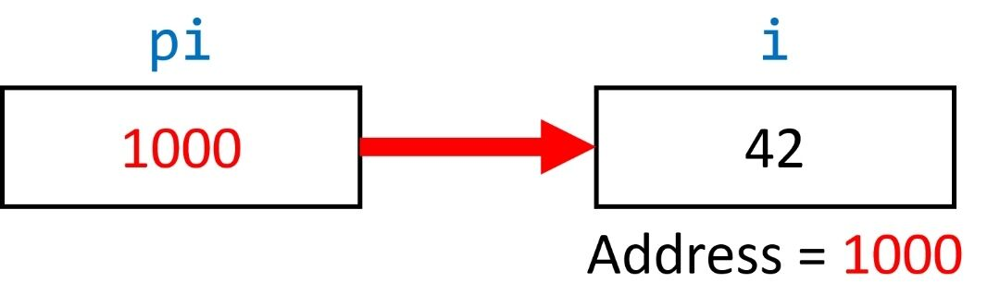
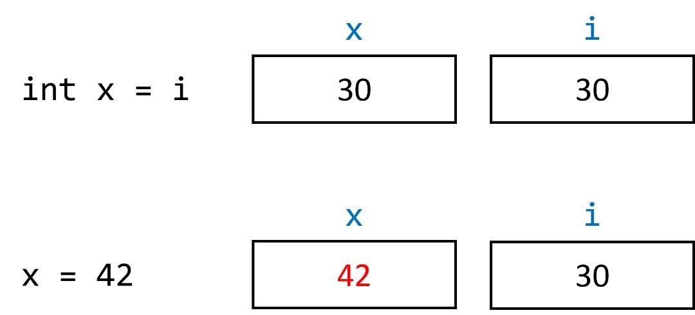
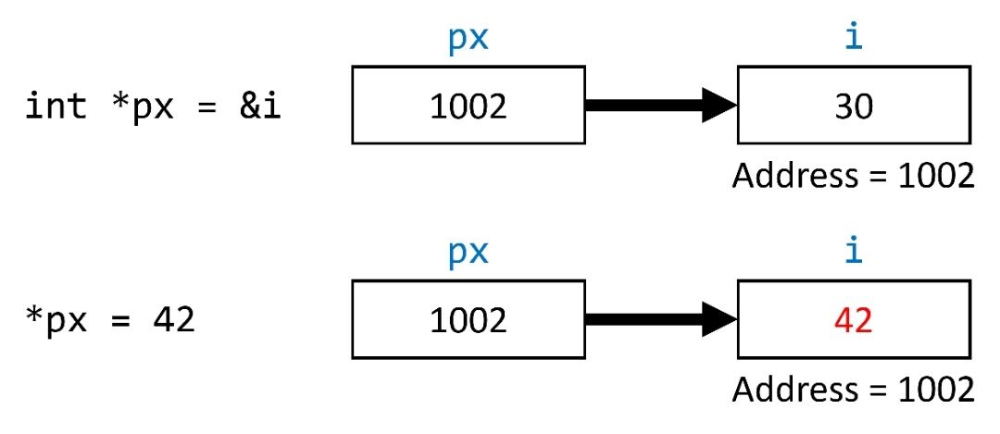
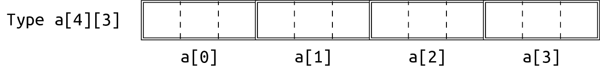

# CS100 Lecture 5

Variables <span style="color: black; font-family: Times New Roman; font-size: 1.05em;">II</span>, Pointers and Arrays <span style="color: black; font-family: Times New Roman; font-size: 1.05em;">I</span>

---

## Contents

- Variables
  - Local `static` variables
  - Initialization
  - `const` type qualifier
- Pointers
- Arrays

---

# Variables

---

## An "only-once" function

Suppose we want to design a function that can only be called once.

- When it is called for the second time, report an error.

---

## An "only-once" function

Suppose we want to design a function that should be called only once.

- When it is called for the second time, report an error.

```c
bool start_game_called = false;

void start_game(Player *p1, Player *p2, int difficulty, GameWorld *world) {
  if (start_game_called)
    report_an_error("You cannot start the game twice!");
  start_game_called = true;
  // ...
}
```

---

## An "only-once" function

What if there are many such functions?

```c
bool start_game_called = false;
bool end_game_called = false;
bool magic_power_used = false;
bool special_skill_used = false;
// ...
```

The global name space is **polluted** with these variables.

- Is there a way to declare these variables inside the corresponding functions?

---

## An "only-once" function

This does not work. Why?

```c
void start_game(Player *p1, Player *p2, int difficulty, GameWorld *world) {
  bool called = false; // Note that we can use a shorter name,
                       // because it is local to this function.
  if (called)
    report_an_error("You cannot start the game twice!");
  called = true;
  // ...
}
```

---

## An "only-once" function

This does not work. Why?

```c
void start_game(Player *p1, Player *p2, int difficulty, GameWorld *world) {
  bool called = false; // Note that we can use a shorter name,
                  // because it is local to this function.
  if (called)
    report_an_error("You cannot start the game twice!");
  called = true;
  // ...
}
```

- Every time `start_game` is called, `called` is created and initialized to zero.
- Every time `start_game` returns, `called` is destroyed.
- We need a "local" variable whose lifetime is longer!

---

## Local `static` variables

```c
void start_game(Player *p1, Player *p2, int difficulty, GameWorld *world) {
  static bool called = false;
  if (called)
    report_an_error("You cannot start the game twice!");
  called = true;
  // ...
}
```

The lifetime of a local `static` variable is **as long as** that of a global variable. *(They both have [static storage duration](https://en.cppreference.com/w/c/language/storage_duration#Storage_duration).)*

- A local `static` variable is initialized **during program startup**, and is destroyed **on program termination**.

It behaves just like a global variable, but its name is inside a function, which does not pollute the global name space.

---

## Initialization

If we declare a variable without explicit initialization, what is the value of it?

Experiment:

<div style="display: grid; grid-template-columns: 1fr 1fr;">
  <div>

```c
#include <stdio.h>

int global;

int main(void) {
  int local;
  static int local_static;
  printf("%d, %d, %d\n", global, local,
         local_static);
  return 0;
}
```
  </div>
  <div>

- Compiled without `-O2` (a kind of optimization):
  
  ```
  0, 22031, 0
  ```
- Compiled with `-O2`:

  ```
  0, 0, 0
  ```
  </div>
</div>

---

## Implicit initialization [Very important]

If a variable is declared without explicit initialization:

- For local non-`static` variables, they are initialized to **indeterminate values**. In other words, they are **uninitialized**.
- For global or local `static` variables, they are [**empty-initialized**](https://en.cppreference.com/w/c/language/initialization#Empty_initialization) ${}^{\textcolor{red}{1}}$:
  - Pointers are initialized to *null pointer values* of their types. (later in this lecture)
  - Objects of integral types are initialized to `0`.
  - Objects of floating types are initialized to positive zero (`0.0`).
  - Other cases will be discussed in later lectures.
  
  \* Intuitively, such variables are initialized to some kind of "zero" ${}^{\textcolor{red}{2}}$. This is called [zero-initialization](https://en.cppreference.com/w/cpp/language/zero_initialization) in C++.

---

## Uninitialized garbage can be deadly!

**The behavior is undefined** if the value of an object is used while it is indeterminate.

<div style="display: grid; grid-template-columns: 1fr 1fr;">
  <div>

[Example: Schrödinger's `bool`](https://en.cppreference.com/w/c/language/behavior#Uninitialized_scalar)

```c
int main(void) {
  bool p;
  if (p)
    printf("p is true.\n");
  if (!p)
    printf("p is false.\n");
}
```
  </div>
  <div>

- Possible output (observed with an older version of gcc):

  ```
  p is true.
  p is false.
  ```

- `p` is in a "superposition state" of true and false?
  </div>
</div>

---

## Uninitialized garbage can be deadly!

Example: For a local variable declared with `int n;` (uninitialized), `n` may not compare equal to itself and it may appear to change its value on subsequent reads.

```c
// in some function
int n; // uninitialized
// n == n is not necessarily true and involves undefined behavior.
int m = n;
// m == n is not necessarily true and involves undefined behavior.
```

Uninitialized variables may also have *trap representations*, which [on some architectures can cause serious problems](https://devblogs.microsoft.com/oldnewthing/20040119-00/?p=41003).

---

## Uninitialized garbage can be deadly!

**[Best practice]** <u>Always initialize the variable.</u>

Except in certain cases, e.g.

```c
// in some function
int n;           // uninitialized
scanf("%d", &n); // A value is assigned to `n` immediately. This is OK.
// Now the value of `n` is not indeterminate. It can be used normally.
```

---

## `const` type qualifier

Each type `T` (not `const`-qualified) has a `const`-qualified version of that type, written as `T const` or `const T`.

Any direct modification of variables with `const`-qualified types is not allowed:

```c
const int n = 100; // Type of `n` is `const int`.
++n; // Error.
```

(Any indirect modification of `const` variables is undefined behavior; see in later lectures.)

---

## `const` type qualifier

A `const` variable cannot be modified after initialization.

Therefore, an uninitialized `const` local non-`static` variable is almost a non-stop ticket to undefined behavior.

```c
// in some function
const int n; // `n` has indeterminate values
n = 42; // Error: cannot modify a const variable.
scanf("%d", &n); // Error: cannot modify a const variable.
```

In C++, `const` variables of built-in types must be initialized.

---

# Pointers

---

## Pointers

A pointer *points to* a variable. The **value** of a pointer is the address of the variable that it points to.

<div style="display: grid; grid-template-columns: 1fr 0.8fr;">
  <div>

```c
int i = 42;
int* pi = &i;
printf("%d\n", *pi);
```
  </div>
  <div style="margin-left: 90px;">
<a align="center">

</a>
  </div>
</div>

- `int* pi;` declares a pointer named `pi`.
  - The type of `pi` is `int*`.
  - The type of the variable that `pi` points to ("pointee") is `int`.
- `&` is the **address-of operator**, used for taking the address of a variable.
- `*` in the expression `*pi` is the **indirection (dereference) operator**, used for obtaining the variable that a pointer points to.

---

## Pointers

A pointer *points to* a variable.

We can access and modify a variable through its address (or a pointer pointing to it).

```c
int num = 3;
int* ptr = &num;
printf("%d\n", *ptr);  // 3
*ptr = 10;
printf("%d\n", num);   // 10
++num;
printf("%d\n", *ptr);  // 11
```

---

## Declare a pointer

To declare a pointer: `PointeeType* ptr;`

- The type of `ptr` is `PointeeType*`.
  - Pointer types with different pointee types are **different types**: `int*` and `double*` are different.
- The asterisk `*` can be placed near either `PointeeType` or `ptr`:
  - `PointeeType* ptr;` and `PointeeType *ptr;` are the same declaration.
  - `PointeeType * ptr;`, `PointeeType       *   ptr;` and `PointeeType*ptr;` are also correct.

---

## Declare a pointer

The asterisk `*` can be placed near either `PointeeType` or `ptr`:
- `PointeeType* ptr;` may be more intuitive?

However, when declaring more than one pointers in one declaration statement, an asterisk is needed **for every identifier**:

```c
int* p1, p2, p3;   // `p1` is of type `int*`, but `p2` and `p3` are ints.
int *q1, *q2, *q3; // `q1`, `q2` and `q3` all have the type `int*`.
int* r1, r2, *r3;  // `r1` and `r3` are of the type `int*`,
                   // while `r2` is an int.
```

**[Best practice]** <u>Either `PointeeType *ptr` or `PointeeType* ptr` is ok. Choose one style and stick to it. But if you choose the second one, never declare more than one pointers in one declaration statement.</u>

---

## `&` and `*`

`&var` returns the address of the variable `var`.
- The result type is `Type *`, where `Type` is the type of `var`.
- `var` must be an object that has an identity (an *lvalue*) ${}^{\textcolor{red}{3}}$: `&42` or `&(a + b)` are not allowed.

`*expr` returns **the variable** whose address is the value of `expr`.
- `expr` must have a pointer type `PointeeType *`. The result type is `PointeeType`.
- **The variable** is returned, not only its value. This means that we can modify the returned variable: `++*ptr` is allowed.

---

## `*`

In a **declaration** `PointeeType *ptr`, `*` is a part of the pointer type `PointeeType *`.

In an **expression** like `*ptr`, `*` is the **indirection (dereference) operator** used to obtain the variable whose address is the value of `ptr`.

Do not mix them up!

---

## The null pointer

The **null pointer value** is the "zero" value for pointer types ${}^{\textcolor{red}{4}}$.

- It can be obtained from the macro [`NULL`](https://en.cppreference.com/w/c/types/NULL), which is available from many standard library header files (e.g. `<stddef.h>`, `<stdio.h>`, `<stdlib.h>`):
  
  ```c
  int *ptr = NULL; // `ptr` is a null pointer.
  ```

- It can also be obtained from the integer literal `0`.
  
  ```c
  double *ptr = 0; // same as `double *ptr = NULL;`
  ```

- Conversion from a null pointer to an integer type results in `0`.

Note: Better null pointer values (`nullptr`) are available [in C23](https://en.cppreference.com/w/c/language/nullptr) and [in C++11](https://en.cppreference.com/w/cpp/language/nullptr).

---

## The null pointer

The **null pointer value** is the "zero" value for pointer types ${}^{\textcolor{red}{4}}$.

A null pointer compares unequal to any pointer pointing to an object.

It is used for representing a pointer that "points nowhere".

**Dereferencing a null pointer is undefined behavior, and often causes severe runtime errors!**

- Because it is not pointing to an object.

```c
int *ptr = NULL;
printf("%d\n", *ptr); // undefined behavior
*ptr = 42; // undefined behavior
```

---

## Implicit initialization of pointers

If a pointer is not explicitly initialized:

- Global or local `static`: Initialized to the null pointer value.
- Local non-`static`: Initialized to indeterminate values, or in other words, **uninitialized**.
  - Uninitialized pointers are often called **wild pointers**.

A wild pointer do not point to a specific object, and is not a null pointer either.

**Dereferencing a wild pointer is undefined behavior, and often causes severe runtime errors.**

**[Best practice]** <u>Avoid wild pointers.</u>

---

## Pointers that are not dereferenceable

A pointer `ptr` is dereferenceable. $\Leftrightarrow$ `*ptr` has no undefined behavior. $\Leftrightarrow$ `ptr` points to an existing object.

A pointer that does not point to an existing object may be

- uninitialized (wild), or
- a null pointer, or
- dangling (We will discuss this in later lectures.), or
- holding some other meaningless address: `int *p = 123;`

---

## Pointers that are not dereferenceable

Dereferencing such a pointer is undefined behavior, and usually causes severe runtime errors.

- Recall the "short-circuit" evaluation of binary logical operators:
  
  ```c
  if (ptr != NULL && *ptr == 42) { /* ... */ }
  ```

  When `ptr` is a null pointer, the right-hand side operand `*ptr == 42` won't be evaluated, so `ptr` is not dereferenced.

---

## Argument passing

What is the output? Is the value of `i` changed to `42`?

```c
void fun(int x) {
  x = 42;
}
int main(void) {
  int i = 30;
  fun(i);
  printf("%d\n", i);
}
```

---

## Argument passing

<div style="display: grid; grid-template-columns: 1fr 0.8fr;">
  <div>

```c
void fun(int x) {
   x = 42;
 }
 int main(void) {
   int i = 30;
   fun(i);
   printf("%d\n", i); // 30
 }  
```
  </div>
  <div style="margin-left: 30px;">
<a align="center">

</a>
  </div>
</div>

The output is still `30`. `i` is not changed.

- The parameter `x` is initialized as if `int x = i;`, thus obtaining the **value** of `i`.
  - `x` and `i` are two independent variables.
- Modification on `x` does not influence `i`.

---

## Argument passing

To make the modification happen on a variable outside, pass its address into the function.

<div style="display: grid; grid-template-columns: 1fr 1fr;">
  <div>

```c
void fun(int x) {
  x = 42;
}
int main(void) {
  int i = 30;
  fun(i); // int x = i;
  printf("%d\n", i); // 30
}
```
  </div>
  <div>

```c
void fun(int *px) {
  *px = 42;
}
int main(void) {
  int i = 30;
  fun(&i); // int *px = &i
  printf("%d\n", i); // 42
}
```
  </div>
</div>

<div style="display: grid; grid-template-columns: 1fr 1fr;">
  <div>
<a align="center">

</a>
  </div>
  <div style="margin-left: 0px;">
<a align="center">

</a>
  </div>
</div>  

---

## Exercise: `swap`

Write a `swap` function to exchange the values of two integers. How do you design the parameters and the return type?

This does not work:

```c
void swap(int a, int b) {
  int tmp = a;
  a = b;
  b = tmp;
}
```

---

## Exercise: `swap`

Write a `swap` function to exchange the values of two integers. How do you design the parameters and the return type?

```c
void swap(int *pa, int *pb) {
  int tmp = *pa;
  *pa = *pb;
  *pb = tmp;
}
int main(void) {
  int i = 42, j = 35;
  swap(&i, &j);
  // Now i = 35, j = 42.
}
```

\* Why do we need to write `&` when calling `scanf`, but not in `printf`?

---

## Exercise: `swap`

Write a `swap` function to exchange the values of two integers. How do you design the parameters and the return type?

```c
void swap(int *pa, int *pb) {
  int tmp = *pa;
  *pa = *pb;
  *pb = tmp;
}
int main(void) {
  int i = 42, j = 35;
  swap(&i, &j);
  // Now i = 35, j = 42.
}
```

\* Why do we need to write `&` when calling `scanf`, but not in `printf`?

- `scanf` needs to modify the variable, but `printf` doesn't.

---

# Arrays

---

## Arrays

An array is a sequence of `N` objects of an *element type* `ElemType` stored **contiguously** in memory, where `N` $\in\mathbb Z_+$ is the *length* of it.

```c
ElemType arr[N];
```

`N` must be a **constant expression** whose value is known at compile-time.

```c
int a1[10];      // OK. A literal is a constant expression.
#define MAXN 10
int a2[MAXN];    // OK. `MAXN` is replaced with `10` by the preprocessor.
int n; scanf("%d", &n);
int a[n];        // A C99 VLA (Variable-Length Array), whose length is
                 // determined at runtime.
```

For now, we do not recommend the use of VLAs. We will talk more about it in recitations.

---

## Array type

An array is a sequence of `N` objects of an *element type* `ElemType` stored **contiguously** in memory, where `N` $\in\mathbb Z_+$ is the *length* of it.

```c
ElemType arr[N]; // The type of `arr` is `ElemType [N]`.
```

The type of an array consists of two parts:

1. the element type `ElemType`, and
2. the length of the array `[N]`.

---

## Array subscript

```c
ElemType arr[N];
```

Use `arr[i]` to obtain the `i`-th element of `arr`, where `i` $\in[0,N)$.

<div style="display: grid; grid-template-columns: 1fr 1fr;">
  <div>

```c
int a[10];

bool find(int value) {
  for (int i = 0; i < 10; ++i)
    if (a[i] == value)
      return true;
  return false;
}
```
  </div>
  <div>

```c
int main(void) {
  int n; scanf("%d", &n);
  for (int i = 0; i < n; ++i)
    scanf("%d", &a[i]);
  for (int i = 0; i < n; ++i)
    a[i] *= 2;
  // ...
}
```
  </div>
</div>

The subscript `i` is an integer within the range $[0,N)$. **Array subscript out of range is undefined behavior, and usually causes severe runtime errors.**

---

## Array subscript

The subscript `i` is an integer within the range $[0,N)$. **Array subscript out of range is undefined behavior, and usually causes severe runtime errors.**

The compiler may assume that the program is free of undefined behaviors:

<div style="display: grid; grid-template-columns: 1fr 1fr;">
  <div>

```c
int a[4];

bool find(int value) {
  for (int i = 0; i <= 4; ++i)
    if (a[i] == value)
      return true;
  return false;
}
```
  </div>
  <div>

- This code may be compiled as if it is
  
  ```c
  bool find(int value) {
    return true;
  }
  ```

  [demo](https://godbolt.org/z/48bn19Tsb)
  </div>
</div>

---

## Array initialization

If an array is declared without explicit initialization:

- Global or local `static`: Empty-initialization $\Rightarrow$ Every element is empty-initialized.
- Local non-`static`: Every element is initialized to indeterminate values (uninitialized).

---

## Array initialization

Arrays can be initialized from [brace-enclosed lists](https://en.cppreference.com/w/c/language/array_initialization#Initialization_from_brace-enclosed_lists):

- Initialize the beginning few elements:
  
  ```c
  int a[10] = {2, 3, 5, 7}; // Correct: Initializes a[0], a[1], a[2], a[3]
  int b[2] = {2, 3, 5};     // Error: Too many initializers
  int c[] = {2, 3, 5};      // Correct: 'c' has type int[3].
  int d[100] = {};          // Correct in C++ and since C23.
  ```
- Initialize designated elements (since C99):
  
  ```c
  int e[10] = {[0] = 2, 3, 5, [7] = 7, 11, [4] = 13};
  ```

---

## Array initialization

If an array is explicitly initialized, all the elements that are not explicitly initialized are **empty-initialized**.

```c
int main(void) {
  int a[10] = {1, 2, 3}; // a[3], a[4], ... are all initialized to zero.
  int b[100] = {0};      // All elements of b are initialized to zero.
  int c[100] = {1};      // c[0] is initialized to 1,
                         // and the rest are initialized to zero.
}
```

**`= {x}` is not initializing all elements to `x`!**

---

## Nested arrays

The C answer to "multidimensional arrays" is **nested arrays**, which is in fact **arrays of arrays**:

<a align="center">
  
</a>

```c
int a[10][20];

bool find(int value) {
  for (int i = 0; i < 10; ++i)
    for (int j = 0; j < 20; ++j)
      if (a[i][j] == value)
        return true;
  return false;
}
```

---

## Initialization of nested arrays

Things have been stated quite clearly [on cppreference](https://en.cppreference.com/w/c/language/array_initialization#Nested_arrays).

```c
int a[4][3] = { // array of 4 arrays of 3 ints each (4x3 matrix)
    { 1 },      // row 0 initialized to {1, 0, 0}
    { 0, 1 },   // row 1 initialized to {0, 1, 0}
    { [2]=1 },  // row 2 initialized to {0, 0, 1}
};              // row 3 initialized to {0, 0, 0}
int b[4][3] = {    // array of 4 arrays of 3 ints each (4x3 matrix)
  1, 3, 5, 2, 4, 6, 3, 5, 7 // row 0 initialized to {1, 3, 5}
};                          // row 1 initialized to {2, 4, 6}
                            // row 2 initialized to {3, 5, 7}
                            // row 3 initialized to {0, 0, 0}
int y[4][3] = {[0][0]=1, [1][1]=1, [2][0]=1};  // row 0 initialized to {1, 0, 0}
                                               // row 1 initialized to {0, 1, 0}
                                               // row 2 initialized to {1, 0, 0}
                                               // row 3 initialized to {0, 0, 0}
```

---

## Summary

Variables

- Local `static` variables: A variable whose name is local to a function but whose lifetime is as long as that of a global variable.
- Implicit initialization:
  - Global or local `static`: empty-initialization (some kind of "zero" value)
  - Local non-`static`: initialized to indeterminate values (uninitialized)
  - Use of indeterminate values is undefined behavior.
- `const`: not modifiable.

---

## Summary

Pointers

- Type of a pointer: `PointeeType *`
- `&var` returns the address of `var`.
- `*expr` returns the variable whose address is the value of `expr`.
- Null pointer value: The "zero" value for pointer types.
  - Obtained from `NULL` or the integer literal `0`.
  - Representing a pointer that "points nowhere".

---

## Summary

Pointers

- Implicit initialization:
  - Global or local `static`: null pointer
  - Local non-`static`: "wild pointer"
  - Dereferencing such pointers is undefined behavior.
- Used for argument passing
  - To modify a variable outside the function, pass its address into the function.

---

## Summary

Arrays

- Type of an array: `ElemType [N]`
- `a[i]` returns the `i`-th element in in the array `a`.
  - `i` $\in[0,N)$. Out-of-range access is undefined behavior.
- Implicit initialization: performed recursively on each element.
- Initialization from brace-enclosed lists: `int a[10] = {2, 3, 5};`
  - The rest elements are initialized to zero.
- Nested arrays: Arrays of arrays

---

## Exercises

1. The `swap` function on page 33 swaps the values of two integers. What if we want to swap the values of two pointers?

   ```c
   void swap(/* ??? */, /* ??? */) {
     // ???
   }
   int main(void) {
     int i = 42, j = 50;
     int *p1 = &i, *p2 = &j;
     swap(/* ??? */);
     // Now `p1` should point to `j`, and `p2` should point to `i`.
   }
   ```

---

## Exercises

2. Write a program that reads a matrix $M\in\mathbb Z^{n\times m}$ and prints its transpose $M^T$. You may assume $n,m\leqslant 100$ and the entries are representable by `int`.
   
   Sample input:

   ```
   3 5
   1 2 3 4 5
   6 7 8 9 10
   11 12 13 14 15
   ```

   Sample output:

   ```
   1 6 11
   2 7 12
   3 8 13
   4 9 14
   5 10 15
   ```

---

## Notes

${}^{\textcolor{red}{1}}$ The [cppreference page for empty-initialization](https://en.cppreference.com/w/c/language/initialization#Empty_initialization) does not mark the term "empty-initialization" as C23, but in fact it does not appear in any standards prior to C23. Looking through the edit history of this page, we can see that this term was not introduced until the C23 things were added. For convenience, we use this term to represent this kind of initialization.

${}^{\textcolor{red}{2}}$ The "zero" value is not necessarily all-bits zero. For example, the floating-point positive zero `+0.0` may not be all-bits zero in [a special representation used by the CCS C compiler](https://www.ccsinfo.com/faq.php?page=mchp_float_format). The null pointer value is not all-bits zero on some platforms either, details of which are available on [comp.lang.c FAQ](https://c-faq.com/null/machexamp.html).

${}^{\textcolor{red}{3}}$ We will not talk about the concepts related to value categories until we meet them in C++, although [C also has value categories](https://en.cppreference.com/w/c/language/value_category).

${}^{\textcolor{red}{4}}$ See $\textcolor{red}{2}$.