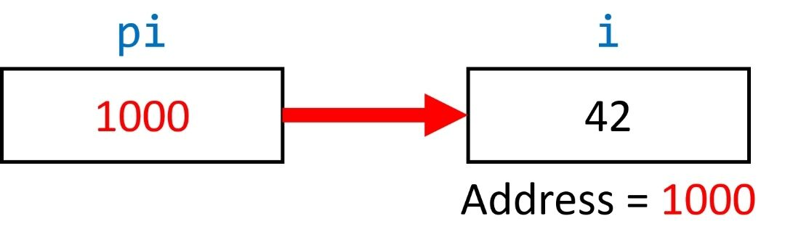
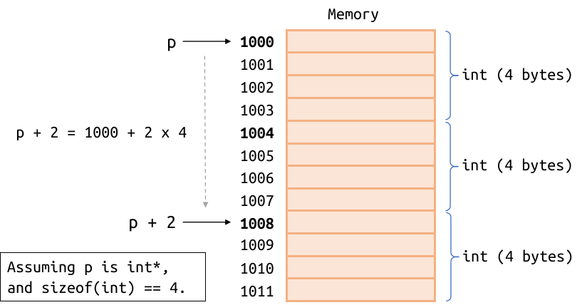

# CS100 Lecture 6

Pointers and Arrays <span style="color: black; font-family: Times New Roman; font-size: 1.05em;">II</span>

---

## Contents

Pointers and Arrays

- Pointer arithmetic
- Array-to-pointer conversion
- Pass an array to a function
- Pass a nested array to a function
- Do we need an array?

---

# Pointers and Arrays

---

## Recap: Pointers

A pointer *points to* an object. The value of a pointer is the address of the object that it points to.

<div style="display: grid; grid-template-columns: 1fr 1fr;">
  <div>

```c
int i = 42;
int *pi = &i;
```
  </div>
  <div style="margin-left: 90px;">
  <a align="center">
    
  </a>
  </div>
</div>

To declare a pointer: `PointeeType *ptr;`

- What is the type of `ptr`?

---

## Recap: Pointers

A pointer *points to* an object. The value of a pointer is the address of the object that it points to.

<div style="display: grid; grid-template-columns: 1fr 1fr;">
  <div>

```c
int i = 42;
int *pi = &i;
```
  </div>
  <div style="margin-left: 90px;">
  <a align="center">
    
  </a>
  </div>
</div>

To declare a pointer: `PointeeType *ptr;`

- What is the type of `ptr`? **`PointeeType *`**

How can we make `ptr` point to `var`?

---

## Recap: Pointers

A pointer *points to* an object. The value of a pointer is the address of the object that it points to.

<div style="display: grid; grid-template-columns: 1fr 1fr;">
  <div>

```c
int i = 42;
int *pi = &i;
```
  </div>
  <div style="margin-left: 90px;">
  <a align="center">
    
  </a>
  </div>
</div>

To declare a pointer: `PointeeType *ptr;`

- What is the type of `ptr`? **`PointeeType *`**

How can we make `ptr` point to `var`?

- First, `var` should be of type `PointeeType`.
- `PointeeType *ptr = &var;` (initialize)
- `ptr = &var;` (assign)

---

## Recap: Arrays

An array is a sequence of `N` objects of type `ElemType` stored contiguously.

To declare an array: `ElemType arr[N];`

- What is the type of `arr`?

---

## Recap: Arrays

An array is a sequence of `N` objects of type `ElemType` stored contiguously.

To declare an array: `ElemType arr[N];`

- What is the type of `arr`? **`ElemType [N]`**

To access the `i`-th element: `arr[i]`

- What is the valid range of `i`?

---

## Recap: Arrays

An array is a sequence of `N` objects of type `ElemType` stored contiguously.

To declare an array: `ElemType arr[N];`

- What is the type of `arr`? **`ElemType [N]`**

To access the `i`-th element: `arr[i]`

- What is the valid range of `i`? $[0,N)$

---

## Pointer arithmetic

Let `p` be a pointer of type `T *` and let `i` be an integer.

- `p + i` returns the address equal to the value of `(char *)p + i * sizeof(T)`. In other words, pointer arithmetic uses the unit of the pointed-to type.

<a align="center">
  
</a>

---

## Pointer arithmetic

Let `p` be a pointer of type `T *` and let `i` be an integer.

- `p + i` returns the address equal to the value of `(char *)p + i * sizeof(T)`. In other words, pointer arithmetic uses the unit of the pointed-to type.
- If we let `p = &a[0]` (where `a` is an array of type `T [N]`), then
  - `p + i` is equivalent to `&a[i]`, and
  - `*(p + i)` is equivalent to `a[i]`.

<a align="center">
  
</a>

- Arithmetic operations `i + p`, `p += i`, `p - i`, `p -= i`, `++p`, `p++`, `--p`, `p--` are defined in the same way.

---

## Array-to-pointer conversion

If we let `p = &a[0]` (where `a` is an array of type `T [N]`), then
- `p + i` is equivalent to `&a[i]`, and
- `*(p + i)` is equivalent to `a[i]`.

<a align="center">
  
</a>

Considering the close relationship between arrays and pointers, an array can be **implicitly converted** to a pointer to the first element: **`a` $\rightarrow$ `&a[0]`, `T [N]` $\rightarrow$ `T *`**.

- `p = &a[0]` can be written as `p = a` directly.
- `*a` is equivalent to `a[0]`.

---

## Array-to-pointer conversion

<a align="center">
  
</a>

We can use pointers to traverse an array:

```c
int a[10];

bool find(int value) {
  for (int *p = a; p < a + 10; ++p)
    if (*p == value)
      return true;
  return false;
}
```

---

## Subtraction of pointers

<a align="center">
  
</a>

Let `a` be an array of length `N`. If `p1 == a + i` and `p2 == a + j` (where `i` and `j` are nonnegative integers), the expression `p1 - p2`

- has the value equal to `i - j`, and
- has the type `ptrdiff_t`, which is a **signed** integer type declared in `<stddef.h>`.
  - The size of `ptrdiff_t` is implementation-defined. For example, it might be 64-bit on a 64-bit machine, and 32-bit on a 32-bit machine.
- Here `i`, `j` $\in[0,N]$ (closed interval), i.e. `p1` or `p2` may point to the *"past-the-end"* position of `a`.

---

## Pointer arithmetic

Pointer arithmetic can only happen within the range of an array and its "past-the-end" position (indexed $[0,N]$). For other cases, **the behavior is undefined**.

Examples of undefined behaviors:

- `p1 - p2`, where `p1` and `p2` point to the positions of two different arrays.
- `p + 2 * N`, where `p` points to some element in an array of length `N`.
- `p - 1`, where `p` points to the first element `a[0]` of some array `a`.

Note that the evaluation of the innocent-looking expression `p - 1`, without dereferencing it, is still undefined behavior and may fail on some platforms.

---

## Pass an array to a function

The only way ${}^{\textcolor{red}{1}}$ of passing an array to a function is to **pass the address of its first element**.

The following declarations are equivalent:

```c
void fun(int *a);
void fun(int a[]);
void fun(int a[10]);
void fun(int a[2]);
```

In all these declarations, the type of the parameter `a` is `int *`.

- How do you verify that?

---

## Pass an array to a function

```c
void fun(int a[100]);
```

The type of the parameter `a` is `int *`. How do you verify that?

```c
void fun(int a[100]) {
  printf("%d\n", (int)sizeof(a));
}
```

Output: (On 64-bit Ubuntu 22.04, GCC 13)

```
8
```

- If the type of `a` is `int[100]` as declared, the output should be `400` (assuming `int` is 32-bit).

---

## Pass an array to a function

Even if you declare the parameter as an array (either `T a[N]` or `T a[]`), its type is still a pointer `T*`: **You are allowed to pass anything of type `T*` to it.**

- Array of element type `T` with any length is allowed to be passed to it.

```c
void print(int a[10]) {
  for (int i = 0; i < 10; ++i)
    printf("%d\n", *(a + i));
}
int main(void) {
  int x[20] = {0}, y[10] = {0}, z[5] = {0}, w = 42;
  print(x);  // OK
  print(y);  // OK
  print(z);  // Allowed by the compiler, but undefined behavior!
  print(&w); // Still allowed by the compiler, also undefined behavior!
}
```

---

## Pass an array to a function

Even if you declare the parameter as an array (either `T a[N]` or `T a[]`), its type is still a pointer `T*`: **You are allowed to pass anything of type `T*` to it.**

- Array of element type `T` with any length is allowed to be passed to it.

The length `n` of the array is often passed explicitly as another argument, so that the function can know how long the array is.

```c
void print(int *a, int n) {
  for (int i = 0; i < n; ++i)
    printf("%d\n", *(a + i));
}
```

---

## Subscript on pointers

```c
void print(int *a, int n) {
  for (int i = 0; i < n; ++i)
    printf("%d\n", a[i]); // Look at this!
}
```

Subscript on pointers is also allowed! `a[i]` is equivalent to `*(a + i)`. ${}^{\textcolor{red}{2}}$

---

## Return an array?

There is no way of returning an array from the function.

Returning the address of its first element is ok, **but be careful**:

<div style="display: grid; grid-template-columns: 1fr 1fr;">
  <div>

This is OK:

```c
int a[10];

int *foo(void) {
  return a;
}
```
  </div>
  <div>

This returns an **invalid address**! (Why?)

```c
int *foo(void) {
  int a[10] = {0};
  return a;
}
```
  </div>
</div>

---

## Return an array?

These two functions have made the same mistake: **returning the address of a local variable**.

<div style="display: grid; grid-template-columns: 1fr 1fr;">
  <div>

```c
int *foo(void) {
  int a[10] = {0};
  return a;
}
int main(void) {
  int *a = foo();
  a[0] = 42; // undefined behavior
}
```
  </div>
  <div>

```c
int *fun(void) {
  int x = 42;
  return &x;
}
int main(void) {
  // undefined behavior
  printf("%d\n", *fun());
}
```
  </div>
</div>

- When the function returns, all the parameters and local objects are destroyed.
  - `a` and `x` no longer exist.
- The objects on the returned addresses are **"dead"** when the function returns!

---

## Exercise

Write a function that accepts an array of `int`s, and copies the odd numbers to another array in reverse order.

```c
int main(void) {
  int a[5] = {1, 2, 3, 5, 6}, b[5];
  copy_odd_reversed(/* ... */); // your function
  // Now `a` is unchanged, and the values in `b` are {5, 3, 1}.
}
```

Design the usage of your function (parameters and return values) on your own.

---

## Exercise

Write a function that accepts an array of `int`s, and copies the odd numbers to another array in reverse order.

```c
int copy_odd_reversed(int *from, int n, int *to) {
  int cnt = 0;
  for (int i = n - 1; i >= 0; --i)
    if (from[i] % 2 == 1)
      to[cnt++] = from[i]; // What does this mean?
  return cnt;
}
int main(void) {
  int a[5] = {1, 2, 3, 5, 6}, b[5];
  int b_length = copy_odd_reversed(a, 5, b); // b_length == 3.
  // Now `a` is unchanged, and the values in `b` are {5, 3, 1}.
}
```

Since arrays cannot be returned, we often create the result array on our own, and pass it to the function.

---

## Pointer type (revisited)

The type of a pointer is `PointeeType *`.

For two different types `T1` and `T2`, the pointer types `T1 *` and `T2 *` are **different types**, although they may point to the same location.

```c
int i = 42;
float *fp = &i;
++*fp; // Undefined behavior. It is not ++i.
```

In C, pointers of different types can be implicitly converted to each other (with possibly a warning). This is **extremely unsafe** and an error in C++.

Dereferencing a pointer of type `T1 *` when it is actually pointing to a `T2` is *almost always* undefined behavior.

- We will see one exception in the next lecture. ${}^{\textcolor{red}{3}}$

---

## Pass a nested array to a function

When passing an array to a function, we make use of the **array-to-pointer conversion**:

- `Type [N]` will be implicitly converted to `Type *`.

What about nested arrays?

---

## Pass a nested array to a function

When passing an array to a function, we make use of the **array-to-pointer conversion**:

- `Type [N]` will be implicitly converted to `Type *`.

A "2d-array" is an "array of array":

- `Type [N][M]` is an array of `N` elements, where each element is of type `Type [M]`.
- What is the conversion result of `Type [N][M]`?

---

## Pass a nested array to a function

When passing an array to a function, we make use of the **array-to-pointer conversion**:

- `Type [N]` will be implicitly converted to `Type *`.

A "2d-array" is an "array of array":

- `Type [N][M]` is an array of `N` elements, where each element is of type `Type [M]`.
- `Type [N][M]` should be implicitly converted to a "pointer to `Type[M]`".

What is a "pointer to `Type[M]`"?

---

## Pointer to array

<div style="display: grid; grid-template-columns: 1fr 1fr;">
  <div>

A pointer to an array of `N` `int`s:

```c
int (*parr)[N];
```
  </div>
  <div>

An array of `N` pointers (pointing to `int`):

```c
int *arrp[N];
```
  </div>
</div>

Too confusing! How can I remember them?

---

## Pointer to array

<div style="display: grid; grid-template-columns: 1fr 1fr;">
  <div>

A pointer to an array of `N` `int`s:

```c
int (*parr)[N];
```
  </div>
  <div>

An array of `N` pointers (pointing to `int`):

```c
int *arrp[N];
```
  </div>
</div>

Too confusing! How can I remember them?

- `int (*parr)[N]` has a pair of parentheses around `*` and `parr`, so
  - `parr` is a pointer (`*`), and
  - points to something of type `int[N]`.
- Then the other one is different:
  - `arrp` is an array, and
  - stores `N` pointers, with pointee type `int`.

---

## Pass a nested array to a function

The following declarations are equivalent: The parameter is of type `int (*)[N]`, which is a pointer to `int[N]`.

```c
void fun(int (*a)[N]);
void fun(int a[][N]);
void fun(int a[2][N]);
void fun(int a[10][N]);
```

We can pass an array of type `int[K][N]` to `fun`, where `K` is arbitrary.

- The size for the second dimension must be `N`.
  - `T[10]` and `T[20]` are different types, so the pointer types `T(*)[10]` and `T(*)[20]` are not compatible.

---

## Pass a nested array to a function

```c
void print(int (*a)[5], int n) {
  for (int i = 0; i < n; ++i) {
    for (int j = 0; j < 5; ++j)
      printf("%d ", a[i][j]);
    printf("\n");
  }
}
int main(void) {
  int a[2][5] = {{1, 2, 3, 4, 5}, {6, 7, 8, 9, 10}};
  int b[3][5] = {0};
  print(a, 2); // OK
  print(b, 3); // OK
}
```

---

## Pass a nested array to a function

In each of the following declarations, what is the type of `a`? Does it accept an argument of type `int[N][M]`?

1. `void fun(int a[N][M])`
2. `void fun(int (*a)[M])`
3. `void fun(int (*a)[N])`
4. `void fun(int **a)`
5. `void fun(int *a[])`
6. `void fun(int *a[N])`
7. `void fun(int a[100][M])`
8. `void fun(int a[N][100])`

---

## Pass a nested array to a function

In each of the following declarations, what is the type of `a`? Does it accept an argument of type `int[N][M]`?

1. `void fun(int a[N][M])`: A pointer to `int[M]`. Yes.
2. `void fun(int (*a)[M])`: Same as 1.
3. `void fun(int (*a)[N])`: A pointer to `int[N]`. **Yes iff `N == M`.**
4. `void fun(int **a)`: A pointer to `int *`. **No.**
5. `void fun(int *a[])`: Same as 4.
6. `void fun(int *a[N])`: Same as 4.
7. `void fun(int a[100][M])`: Same as 1.
8. `void fun(int a[N][100])`: A pointer to `int[100]`. Yes iff `M == 100`.

---

## Exercise

We wrote a "transpose" program in last lecture's exercise, which accepts a matrix from input and prints its transpose.

Rewrite this functionality as a function. Suppose the size of the given matrix is $3\times 4$.

```c
int main(void) {
  int a[3][4];
  for (int i = 0; i < 3; ++i)
    for (int j = 0; j < 4; ++j)
      scanf("%d", &a[i][j]);
  int b[4][3];
  transpose(a, b); // Your function
  for (int i = 0; i < 4; ++i) {
    for (int j = 0; j < 3; ++j)
      printf("%d ", b[i][j]);
    printf("\n");
  }
}
```

---

## Do we need an array?

Write a program that reads an integer $n$ and prints the $n$-th Fibonacci number. Assume that the numbers are representable by `int`.

$$
F_n=\begin{cases}
  0,&n=0,\\
  1,&n=1,\\
  F_{n-1}+F_{n-2},&n>1.
\end{cases}
$$

---

## Do we need an array?

Write a program that reads an integer $n$ and prints the $n$-th Fibonacci number. Assume that the numbers are representable by `int`.

<div style="display: grid; grid-template-columns: 1fr 1fr;">
  <div>

$$
F_n=\begin{cases}
  0,&n=0,\\
  1,&n=1,\\
  F_{n-1}+F_{n-2},&n>1.
\end{cases}
$$
  </div>
  <div>

```c
int calc_fib(int n) {
  int fib[100] = {0, 1};
  for (int i = 2; i <= n; ++i)
    fib[i] = fib[i - 1] + fib[i - 2];
  return fib[n];
}
```
  </div>
</div>

Is this array necessary?

---

## Do we need an array?

<div style="display: grid; grid-template-columns: 1fr 1fr;">
  <div>

Is this array necessary?

```c
int calc_fib(int n) {
  int fib[100] = {0, 1};
  for (int i = 2; i <= n; ++i)
    fib[i] = fib[i - 1] + fib[i - 2];
  return fib[n];
}
```
  </div>
  <div>

We only need two (three) variables!

```c
int calc_fib(int n) {
  int a = 0, b = 1;
  for (int i = 2; i <= n; ++i) {
    int new = a + b;
    a = b;
    b = new;
  }
  return b;
}
```
  </div>
</div>

---

## Do we need an array?

In the following cases, do we need an array?

- Read $n$ integers, then print the sum of them.
- Read $n$ integers, then print them in reverse order.
- Read $n$ integers, then print the maximum of them.
- Read $n$ integers, then print the second maximum of them.

---

## Do we need an array?

In the following cases, do we need an array?

- Read $n$ integers, then print the sum of them. **No**
- Read $n$ integers, then print them in reverse order. **Yes**
- Read $n$ integers, then print the maximum of them. **No**
- Read $n$ integers, then print the second maximum of them. **No**

---

## Summary

Pointer arithmetic

- can only happen within the range of an array and its "past-the-end" position. Other cases are undefined behaviors.
- `p + i` returns the address `(char *)p + i * sizeof(T)`, i.e. `i * sizeof(T)` bytes away from `p`.
- `p1 - p2` is equal to `i - j`.

Array-to-pointer conversion

- An array `a` can be implicitly converted to `&a[0]`.
- `T [N]` $\to$ `T *`.

---

## Summary

Pass an array to a function

- You cannot declare an array parameter. It is always a pointer.
- We often use another parameter to indicate the length of the array.
- Instead of returning an array, we create the result array and pass it to the function.
- `T[N][M]` $\to$ `T (*)[M]`

Avoid unnecessary arrays.

---

## Notes

${}^{\textcolor{red}{1}}$ In fact, you can pass the address of an array:

```c
void print_array_10(int (*pa)[10]) {
  for (int i = 0; i < 10; ++i)
    printf("%d\n", (*pa)[i]);
}
int main(void) {
  int a[10], b[100], c = 42;
  print_array_10(&a); // OK
  print_array_10(&b); // Error
  print_array_10(&c); // Error
}
```

In the function `print_array_10` above, the parameter type is `int (*)[10]`, a pointer to an array of 10 `int`s. The pointee type must be `int[10]`. Passing the address of anything else to it would not work.

---

## Notes

${}^{\textcolor{red}{2}}$ In fact, [the subscript operator](https://en.cppreference.com/w/c/language/operator_member_access#Subscript) is defined by the standard for pointers. In expressions like `a[i]` where `a` is an array, `a` undergoes the implicit array-to-pointer conversion. [Such implicit conversion is so common](https://en.cppreference.com/w/c/language/conversion#Array_to_pointer_conversion) that some people even treat arrays and pointers as the same thing, which is a common misunderstanding.

${}^{\textcolor{red}{3}}$ See [strict aliasing](https://en.cppreference.com/w/c/language/object#Strict_aliasing) for detailed rules.