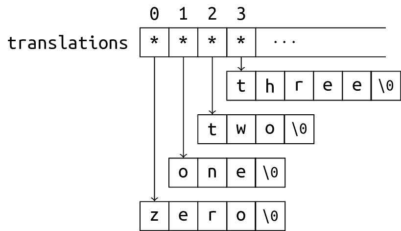

# CS100 Lecture 7

Pointers and Arrays <span style="color: black; font-family: Times New Roman; font-size: 1.05em;">III</span>, Dynamic memory, Strings

---

## Contents

- Pointers and Arrays
  - Pointers and `const`
  - The `void *` type
- Dynamic memory
- Strings

---

# Pointers and Arrays

---

## Recap: `const` variables

A `const` variable cannot be modified after initialization.

- It has type `const T` (or equivalently `T const`), where `T` is its original (unqualified) type.
- Any direct modification to a `const` variable is not allowed.

The type of the expression `&x`, where `x` is of type `const T`, is `const T *`.

---

## Pointer to `const`

A pointer to `const` is a pointer whose pointee type is `const`-qualified:

```c
const int x = 42;
int *pi = &x; // Dangerous: It discards the const qualifier.
const int *cpi = &x; // Better.
```

The type of `cpi` is `const int *` (or equivalently, `int const *`), which is a pointer to `const int`.

---

## `const` is a "lock"

`const` is like a lock, guarding against modifications to the variable.

It is very dangerous to let a pointer to non-`const` point to a `const` variable: It is an attempt to remove the lock!

- Warning in C, error in C++.

```c
const int x = 42;
int *pi = &x; // Dangerous: It discards the const qualifier.
const int *cpi = &x; // Better.
++*pi; // No error is generated by the compiler, but actually undefined behavior.
```

Any indirect modification to a `const` variable is **undefined behavior**.

---

## `const` is a "lock"

`const` is like a lock, guarding against modifications to the variable.

A pointer to `const` can point to a non-`const` variable: This is adding a lock.

```c
int x = 42;
int *pi = &x;
const int *cpi = &x; // OK.
++*pi; // Correct, same as ++x.
++*cpi; // Error!
```

---

## `const` is a "lock"

A pointer to `const` can also point to a non-`const` variable: This is adding a lock.

- **A pointer to `const` *thinks* that it is pointing to a `const` variable.** Therefore, it does not allow you to modify the variable through it.

```c
int x = 42;
int *pi = &x;
const int *cpi = &x; // OK.
++*pi; // Correct, same as ++x.
++*cpi; // Error!
```

Such `const`ness on the **pointee type** is often called "low-level `const`ness".

---

## `const` can be helpful

It tells the compiler "this variable should not be modified!".

```c
int count(const int *a, int n, int value) {
  int cnt = 0;
  for (int i = 0; i < n; ++i)
    if (a[i] = value) // Error: cannot modify a[i]
      ++cnt;
  return cnt;
}
```

**[Best practice]** <u>Use `const` whenever possible.</u>

We will see more usage of `const` in C++.

---

## Top-level `const`ness

A pointer itself can also be `const`. The type of such pointer is `PointeeType *const`.

- Such `const`ness is often called "top-level `const`ness".

```c
int x = 42;
int *const pc = &x;
++*pc; // OK.
int y = 30;
pc = &y; // Error.
```

A `const` pointer cannot switch to point to other variables after initialization.

A pointer can have both low-level and top-level `const`ness:

```c
const int *const cipc = &x;
```

---

## `void *`

A special pointer type:

- Any pointer can be implicitly converted to that type.
- A pointer of type `void *` can be implicitly converted to any pointer type.
  - This must happen explicitly in C++.
- Use `printf("%p", ptr);` to print the value of a pointer `ptr` of type `void *`.
  - If `ptr` is a pointer of some other type, a conversion is needed:
    
    ```c
    printf("%p", (void *)ptr);
    ```

**The C type system is weak. Many kinds of implicit conversions are very dangerous, although allowed by C.**

---

## `void *`

C does not have a static type system as powerful as C++'s. `void *` is often used to represent "pointer to anything", "location of some memory", or even "any object".

- Typically, the memory allocation function `malloc` (see below) returns `void *`, the address of the block of memory allocated.
  - Memory does not have types. - We say "a disk of 1TB" instead of "a disk that can hold $2^{38}$ `int`s".

---

# Dynamic memory

---

## A "dynamic array"

Create an "array" whose size is determined at runtime?

---

## A "dynamic array"

Create an "array" whose size is determined at runtime?

- We need a block of memory, the size of which can be determined at runtime.
- If we run out of memory, **we need to know**.
- We may require a pretty large chunk of memory.

---

## Stack memory vs heap (dynamic) memory

<div style="display: grid; grid-template-columns: 1fr 1fr;">
  <div>
    <a align="center">
      
    </a>
  </div>
  <div>

- Stack memory is generally smaller than heap memory.
- Stack memory is often used for storing local and temporary objects.
- Heap memory is often used for storing large objects, and objects with long lifetime.
- Operations on stack memory is faster than on heap memory.
- Stack memory is allocated and deallocated automatically, while heap memory needs manual management.
  </div>
</div>

---

## Use [`malloc`](https://en.cppreference.com/w/c/memory/malloc) and [`free`](https://en.cppreference.com/w/c/memory/free)

Declared in `<stdlib.h>`.

```c
void *malloc(size_t size);
```

Allocates `size` bytes of uninitialized storage on heap.

If allocation succeeds, returns the starting address of the allocated memory block.

If allocation fails, a null pointer is returned.

- `size_t`: A type that can hold the size (number of bytes) of any object. It is
  - declared in `<stddef.h>`, and
  - is an **unsigned** integer type,
  - whose size is implementation-defined. For example, it may be 64-bit on a 64-bit machine, and 32-bit on a 32-bit machine.

---

## Use [`malloc`](https://en.cppreference.com/w/c/memory/malloc) and [`free`](https://en.cppreference.com/w/c/memory/free)

Declared in `<stdlib.h>`.

```c
void *malloc(size_t size);
```

```c
T *ptr = malloc(sizeof(T) * n); // sizeof(T) * n bytes
for (int i = 0; i != n; ++i)
  ptr[i] = /* ... */
// Now you can use `ptr` as if it points to an array of `n` objects of type `T`
// ...
free(ptr);
```

To avoid **memory leaks**, the starting address of that block memory must be passed to `free` when the memory is not used anymore.

---

## Use [`malloc`](https://en.cppreference.com/w/c/memory/malloc) and [`free`](https://en.cppreference.com/w/c/memory/free)

Declared in `<stdlib.h>`.

```c
void free(void *ptr);
```

Deallocates the space previously allocated by an allocation function (such as `malloc`).

If `ptr` is a null pointer, this function does nothing.

- There is no need to do a null check before calling `free`!

**The behavior is undefined** if `ptr` is not equal to an address previously returned by an allocation function.

---

## Use [`malloc`](https://en.cppreference.com/w/c/memory/malloc) and [`free`](https://en.cppreference.com/w/c/memory/free)

Declared in `<stdlib.h>`.

```c
void free(void *ptr);
```

Deallocates the space previously allocated by an allocation function (such as `malloc`).

**The behavior is undefined** if the memory area referred to by `ptr` has already been deallocated.

- In other words, "double `free`" is undefined behavior (and often causes severe runtime errors).

After `free(ptr)`, `ptr` no longer points to an existing object, so it is no longer dereferenceable.

- Often called a "dangling pointer".

---

## Use `malloc` and `free`

We can also create one single object dynamically (on heap):

```c
int *ptr = malloc(sizeof(int));
*ptr = 42;
printf("%d\n", *ptr);
// ...
free(ptr);
```

But why? Why not just create one normal variable like `int ival = 42;`?

---

## Use `malloc` and `free`

Benefit: The lifetime of a dynamically allocated object goes beyond a local scope.

It is not destroyed until we `free` it.

```c
int *create_array(void) {
  int a[N];
  return a; // Returns the address of the local object `a`.
            // When the function returns, `a` will be destroyed, so that
            // the returned address becomes invalid.
            // Dereferencing the returned address is undefined behavior.
}
int *create_dynamic_array(int n) {
  return malloc(sizeof(int) * n); // OK. The allocated memory is valid until
                                  // we free it.
}
```

---

## Use `malloc` and `free`

Create a "2-d array" on heap?

<div style="display: grid; grid-template-columns: 1fr 1fr;">
  <div>

```c
int **p = malloc(sizeof(int *) * n);
for (int i = 0; i < n; ++i)
  p[i] = malloc(sizeof(int) * m);
for (int i = 0; i < n; ++i)
  for (int j = 0; j < m; ++j)
    p[i][j] = /* ... */
// ...
for (int i = 0; i < n; ++i)
  free(p[i]);
free(p);
```
  </div>
  <div>

<a align="center">
  
</a>
  </div>
</div>

---

## Use `malloc` and `free`

Create a "2-d array" on heap? - Another way: Create a 1-d array of length `n * m`.

```c
int *p = malloc(sizeof(int) * n * m);
for (int i = 0; i < n; ++i)
  for (int j = 0; j < m; ++j)
    p[i * m + j] = /* ... */ // This is the (i, j)-th entry.
// ...
free(p);
```

---

## Use [`calloc`](https://en.cppreference.com/w/c/memory/calloc)

Declared in `<stdlib.h>`

```c
void *calloc(size_t num, size_t each_size);
```

Allocates memory for an array of `num` objects (each of size `each_size`), and initializes all bytes in the allocated storage to zero ${}^{\textcolor{red}{1}}$.

Similar as `malloc(num * each_size)`. ${}^{\textcolor{red}{2}}$ Returns a null pointer on failure.

---

## `malloc`, `calloc` and `free`

The behaviors of `malloc(0)`, `calloc(0, N)` and `calloc(N, 0)` are **implementation-defined**:

- They may or may not allocate memory.
- If no memory is allocated, a null pointer is returned.
- They may allocate *some* memory, for some reasons. In that case, the address of the allocated memory is returned.
  - You cannot dereference the returned pointer.
  - It still constitutes **memory leak** if such memory is not `free`d.

---

## Arrays vs `malloc`

- An array has limited lifetime (unless it is global or `static`). It is destroyed when control reaches the end of its scope.
- Objects allocated by `malloc` are not destroyed until their address is passed to `free`.
- The program crashes if the size of an array is too large (running out of stack memory). There is no way of recovery.
- Attempt to `malloc` a block of memory that is too large results in a null pointer. We can know if there is no enough heap memory by doing a null check.
  
  ```c
  int *ptr = malloc(1ull << 60); // unrealistic size
  if (!ptr)
    report_an_error("Out of memory.");
  ```

---

## Summary

Pointer to `const`

- A pointer to `const` ***thinks*** that it is pointing to a `const` variable (though it may not), so it prevents you from modifying the pointed-to variable through it.
- Use `const` whenever possible.

`void *`

- A pointer type that can contain anything.
- Often used for representing "any pointer", "any object", or memory address.

---

## Summay

Dynamic memory

```c
void *malloc(size_t size);
void *calloc(size_t num, size_t each_size);
void free(void *ptr);
```

`malloc`: Allocates `size` bytes of **uninitialized** memory and returns its starting address.

`calloc`: Allocates `num * each_size` bytes of memory ${}^{\textcolor{red}{2}}$, each byte initialized to zero, and returns its starting address.

Both `malloc` and `calloc` return a null pointer on failure.

`free`: Deallocates the memory block starting at `ptr`.

---

# Strings

---

## C-style strings

C does not have a special construct for "string".

A string is a sequence of characters stored contiguously. We often use an array or a pointer to the first character to represent a string.

- It can be stored in an array, or in dynamically allocated memory.
- **It must be null-terminated: There should be a null character `'\0'` at the end.**

```c
char s[10] = "abcde";  // s = {'a', 'b', 'c', 'd', 'e', '\0'}
printf("%s\n", s);     // prints abcde
printf("%s\n", s + 1); // prints bcde
s[2] = ';';            // s = "ab;de"
printf("%s\n", s);     // prints ab;de
s[2] = '\0';
printf("%s\n", s);     // prints ab
```

The position of the first `'\0'` is the end of the string. Anything after that is discarded.

---

## The null character `'\0'`

`'\0'` is the "null character" whose [ASCII](https://en.cppreference.com/w/c/language/ascii) value is 0.

It is **the only way** to mark the end of a C-style string.

Every standard library function that handles strings will search for `'\0'` in that string.

- If there is no `'\0'`, they will search nonstop, and eventually go out of range (undefined behavior).

```c
char s[5] = "abcde"; // OK, but no place for '\0'.
printf("%s\n", s);   // undefined behavior (missing '\0')
```

**Remember to allocate one more byte storage for `'\0'`!**

---

## Empty string

An empty string contains no characters before the null character.

```c
char empty[] = ""; // `empty` is of type char[1], which contains only '\0'.
printf("%s\n", empty); // Prints only a newline.
printf(""); // Nothing is printed
```

---

## String I/O

[`scanf`](https://en.cppreference.com/w/c/io/fscanf)/[`printf`](https://en.cppreference.com/w/c/io/fprintf): `"%s"`
- `%s` in `scanf` matches a sequence of **non-whitespace** characters.
  - Leading whitespaces are discarded.
  - Reading starts from the first non-whitespace character, and stops right before the next whitespace character.
  - `'\0'` will be placed at the end.

Suppose the input is `   123  456`:

```c
char str[100] = "abcdef";
scanf("%s", str); // Reads "123". `str` becomes {'1', '2', '3', '\0', 'e', 'f'}
printf("%s\n", str); // Prints "123".
                     // 'e' and 'f' are not considered as part of the string.
```

---

## String I/O

`scanf` is not memory safe:

```c
char str[10];
scanf("%s", str);
```

- `str` is decayed (implicitly converted) to `char *` when passed as an argument.
- `scanf` receives only a pointer `char *`. **It has no idea how big the array is**.
- If the input content has more than 9 characters, it causes disaster!

That's why it is banned by MSVC. An alternative is to use `scanf_s`, but not necessarily supported by every compiler.

---

## String I/O

`gets` reads a string without bounds checking. **It has been removed since C11.**

- An alternative for `gets` that does bounds checking is `gets_s`, but not supported by every compiler.

**The best alternative: [`fgets`](https://en.cppreference.com/w/c/io/fgets).** It is more portable, more generic, and safer (with bounds checking).

```c
char str[100];
fgets(str, 100, stdin);
```

`puts(str)`: Prints the string `str`, followed by a newline.

---

## String I/O

<u>Homework</u> Read the [cppreference documentation for `fgets`](https://en.cppreference.com/w/c/io/fgets). Answer the following questions:

- How many characters does it read at most?
- When does it stop?

---

## String manipulation / examination

Some common standard library functions: declared in `<string.h>`.

- `strlen(str)`: Returns the length of the string `str`.
- `strcpy(dest, src)`: Copies the string `src` to `dest`.
- `strcat(dest, src)`: Appends a copy of `src` to the end of `dest`.
- `strcmp(s1, s2)`: Compares two strings in lexicographical order.
- `strchr(str, ch)`: Finds the first occurrence of `ch` in `str`.

**This page is only a brief introduction which cannot be relied on.** The detailed documentations can be found [here](https://en.cppreference.com/w/c/string/byte).

---

## String manipulation / examination

**Read the documentation of a function before using it.**

- Is `'\0'` counted in `strlen`?
- Does `strcpy` put a null character at the end? What about `strncpy`?
- For `strcpy(dest, src)`, what will happen if `dest` and `src` refer to the same memory address? What if they overlap? What about `strcat`?
- What is the result of `strcmp`? Is it $\in\{-1,0,1\}$? Is it `true`/`false`?

If you use the function without making these clear, **you are heading for late-night debugging sessions!**

---

## Exercise: Implement `strlen`

Implement your own `strlen`, which accepts a pointer to the first character of a string and returns its length.

**The length of a string does not count the null character `'\0'` in.**

- `strlen("hello")` is `5`, not `6`.

---

## Exercise: Implement `strlen`

Implement your own `strlen`, which accepts a pointer to the first character of a string and returns its length.

<div style="display: grid; grid-template-columns: 1fr 1fr;">
  <div>

```c
size_t my_strlen(const char *str) {
  size_t ans = 0;
  while (*str != '\0') {
    ++ans;
    ++str;
  }
  return ans;
}
```
  </div>
  <div>

```c
size_t my_strlen(const char *str) {
  const char *end = str;
  while (*end != '\0')
    ++end;
  return end - str;
}
```
  </div>
</div>

---

## Exercise: Implement `strlen`

Implement your own `strlen`, which accepts a pointer to the first character of a string and returns its length.

```c
size_t my_strlen(const char *str) {
  size_t ans = 0;
  while (*str++ != '\0') // Understand and learn to use this.
    ++ans;
  return ans;
}
```

---

## `strlen`

There is no magic in `strlen`. It traverses the entire string and counts the characters, which is very slow.

Do not call `strlen` repeatedly!

```c
for (size_t i = 0; i < strlen(s); ++i) // very slow
  // ...
```

- At the end of each iteration, the condition `i < strlen(s)` is evaluated, which causes the entire string to be traversed.
- The *time complexity* of this loop is $O\left(n^2\right)$.

---

## `strlen`

There is no magic in `strlen`. It traverses the entire string and counts the characters, which is very slow.

Do not call `strlen` repeatedly!

```c
for (size_t i = 0; i < strlen(s); ++i) // very slow
  // ...
```

Change it to:

```c
int n = strlen(s);
for (int i = 0; i < n; ++i)
  // ...
```

---

## Conversions to and from numeric formats

Full list can be found [here](https://en.cppreference.com/w/c/string/byte#Conversions_to_and_from_numeric_formats).

`strtol`, `strtoll`, `strtoul`, `strtoull`, `strtof`, `strtod`, `strtold`: Extracts the numeric value from a string.

- **These are better alternatives to `atoi`, `atol`, ...**: The base can be customized, and they have better error-reporting mechanisms.

---

## String literals

A string literal is something like `"abcde"`, **surrounded by double quotes `"`**.

- The type of a string literal is `char [N+1]`, where `N` is the length of the string.
  - `+1` is for the terminating null character.
- **But a string literal will be placed in read-only memory!!**
  - In C++, its type is `const char [N+1]`, which is more reasonable.

When initializating a pointer with a string literal,

```c
char *p = "abcde";
```

we are actually letting `p` point to the address of the string literal.

---

## String literals

Using a pointer to non-`const` to point to a string literal is **allowed in C** (not allowed in C++), but **very dangerous**:

```c
char *p = "abcde"; // OK
p[3] = 'a'; // No compile-error, but undefined behavior,
            // and possibly severe runtime-error.
```

Correct ways:

<div style="display: grid; grid-template-columns: 1fr 1fr;">
  <div>

Use low-level `const`ness to protect it:

```c
const char *str = "abcde";
str[3] = 'a'; // compile-error
```
  </div>
  <div>

**Copy** the contents into an array:

```c
char arr[] = "abcde";
arr[3] = 'a'; // OK.
// `arr` contains a copy of "abcde".
```
  </div>
</div>

---

## Array of strings

```c
const char *translations[] = {
  "zero", "one", "two", "three", "four",
  "five", "six", "seven", "eight", "nine"
};
```

<div style="display: grid; grid-template-columns: 1fr 1fr;">
  <div>

- `translations` is an array of pointers, where each pointer points to a string literal.
- `translations` **is not a 2-d array!**
  </div>
  <div>

<a align="center">
  
</a>
  </div>
</div>

---

## Summary

A C-style string is a sequence of characters stored contiguously, with `'\0'` at the end.

- Never forget the null character `'\0'`.
- String literals are not modifiable, even though their types are not `const`.
  - It's better to use a pointer to `const` to point to a string literal.
- I/O: `scanf`/`printf`, `fgets`, `puts`
- String manipulation / examination functions like `strlen`, `strcmp`, `strcpy`, ...
- Conversions to and from numeric formats: `strtol`, `strtoll`, ...

---

## Exercises

Implement your own `strlen`, `strchr`, `strcmp`, `strcpy` and `strcat`. This will be in homework.

---

## Notes

${}^{\textcolor{red}{1}}$ "All bytes zero" does not necessarily mean `0.0` for floating point or null pointer value for pointers, although it does for most modern computers and compilers.

${}^{\textcolor{red}{2}}$ Due to the alignment requirements, the number of allocated bytes is not necessarily equal to `num * each_size`.