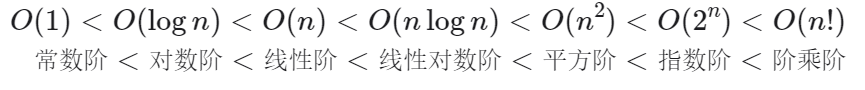
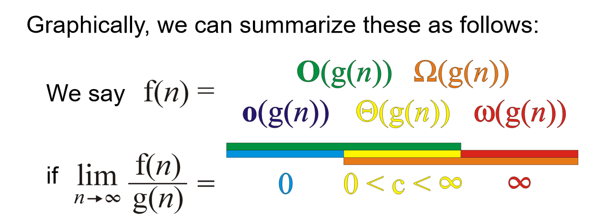
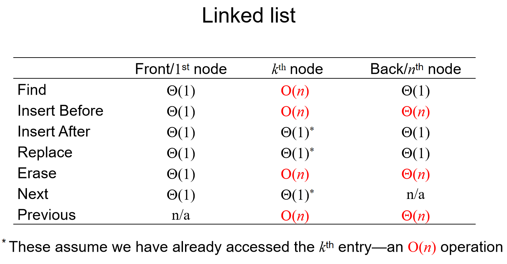
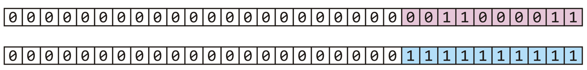
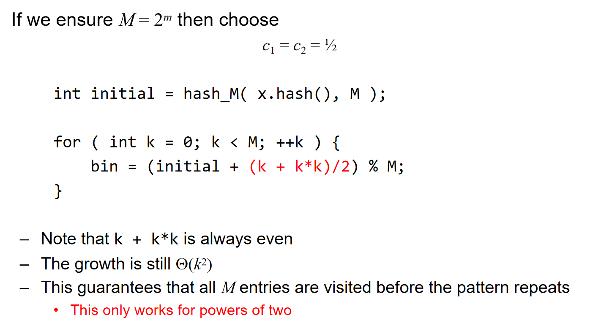

# 基本结构与算法分析

数组，链表，栈，队列

## 数据结构算法复杂度介绍 

### Brief Intro

数据结构: 相互之间存在一种或者多种特定关系的数据元素的集合. 在逻辑上可以分为线性结构, 散列结构, 树形结构, 图形结构等等

算法: 求解具体问题的步骤描述, 代码上表现出来是解决特定问题的一组有限的指令序列

算法复杂度: 时间和空间复杂度, 衡量算法效率, 算法在执行过程中, 随着数据规模n的增长, 算法执行所花费的时间和空间的增长速度. 

常见的时间复杂度关系: 



值得注意的是：$O(n!)$是最大的，而$O(nlogn) < O(n^i)$如果$i>1$，这一结论可以通过函数作商求极限说明（洛必达法则）。

常见的时间复杂度: 


### Algorithm Analysis

Landau Symbols规定：

- $\Theta$ notation: A function $f(n) = \Theta(g(n))$ if there exist positive $k, c_1, c_2$ such that: $c_1 g(n) < f(n) < c_2 g(n)$ whenever $n>k$
- Big O notation: $f(n) = O(g(n))$ if there exists k and c such that $f(n) < cg(n)$ whenever $n>k$

我们从极限的角度来看$\Theta$，如果f(n) g(n)都是最高指数相同的多项式，且系数相同，如果说：

$\lim_{n \to \infty} \frac{f(n)}{g(n)} = c \quad \text{where} \quad 0 < c < \infty$，那么我任取$c > \varepsilon > 0$，那么总会存在正数k，使得：

$\left| \frac{f(n)}{g(n)} - c \right| < \varepsilon \ \text{whenever} \ n > k$，那么就会有：
$$
c - \varepsilon < \frac{f(n)}{g(n)} < c + \varepsilon \\
g(n)(c - \varepsilon) < f(n) < g(n)(c + \varepsilon) \\
c_1 g(n) < f(n) < c_2 g(n)
$$
于是类似地，可以通过这种极限形式重新定义上面两个符号，顺便再如下图定义：$o, \omega, \Omega$




> Tip：算法有没有可能best case时间复杂度是$\Omega(n)$而worst case时间复杂度是$O(n)$呢？当然有可能！比如说算法的时间复杂度**总是**（*没错，“总是”也能拥有最好和最坏情况*）$\Theta(n)$。

## 引言

考虑一种问题：***compute the summation for a polynomial at a fixed value x.***对于一个多项式：$f(x)=a_0+a_1x+a_2x^2+⋯+a_{n−1}x^{n−1}+a_nx^n$来说，代入x之后如何计算？当然，我们可以利用一个数组去储存系数，用引索代表幂，即：a[i] = $a_i$

````c++
double fpoly1 ( int n, double a[ ], double x )
{ int i;
  double p = a[0];
  for (i = 1; i <=n; i++)
       p += (a[i] * pow( x, i) );
  return p;
}
````

或者，另一种表达方式的多项式：$f(x)=a_0+x(a_1+x(a_2+⋯x(a_n−1+x(a_n))⋯))$:

````c++
double fpoly2 ( int n, double a[ ], double x )
{ int i;
  double p = a[n];
  for (i = n; i > 0; i-- )
       p = a[i-1]  + x* p;
  return p;
}
````

但是，当$f(x)=4+3x^{2024}$呢？难道需要开一个2025个元素的数组吗？很明显不现实。因此我们可以在数组里面存储一个structure：$(a_i, i)$。这样就很完美的节省了空间。但是这种表示情况下，如何计算多项式的相加的？我们按指数递减的顺序存储两个数组，然后两个指针开始逐个比较：指数如果不一样，较大的优先进入数组，且指针指向下一个；如果相同，系数相加，储存进新的数组，两个指针都指向下一个。这样也能很好地表示多项式的相加。

从上面这个例子能看出：

- Different data types can be used for the same type of problem.
- There exists a common problem: the organization and management of ordered linear data.

因此引出了第一个关键的概念：List ADT(Abstract Data Type)。An Abstract List (or List ADT) is linearly ordered data (with same data type)。

- The number of elements in the List denotes the length of the List.
- When there is no element, it is an empty List.
- The beginning of a List is called the List head; the end of a List is called the List tail.
- The same value may occur more than once.

对于这种数据结构,一般要能够支持一些基本的操作: ***Access; Erasing; Insertion; Replacement***. 而对于两个ADT，我们也可能希望去操作：***Concatenation; Determine if sublist***. 因此一般程序中有如下结构：

- For L∈List, i denotes the indices, X∈ElementType, the basic operations includes but not limited to:
- ListEmpty(): initialize an empty list.
- ElementType FindKtℎ(int K, List L): find the K_tℎ element and return it.
- int Find(ElementType X, int I, List L): find the location for X.
- void Insert(ElementType X, int i, List L): insert a new element before the i_tℎ element.
- void Delete(int i, List L): delete the i_tℎ element.
- int Lengtℎ(List L): return the length of a list.

具体有哪些线性表的数据结构呢？见下面的内容。

## 数组

### 基本信息

数组的特点: ***内存是连续的***(这也是为什么数组称为***线性表***). 那么数组有什么优缺点呢？

优点: 

- 下标访问(随机访问)的时间复杂度是O(1)
- 末尾位置增加删除元素时间复杂度是O(1)
- 访问元素前后相邻位置的元素非常方便 

缺点:

- 非末尾位置增加删除元素需要进行大量的数据移动
- 搜索的时间复杂度: 如果是无序数组, 那么线性搜索O(n); 如果是有序数组, 那么就是二分搜索O(logn)
- 数组扩容消耗比较大(如何扩容? 之后会有具体的细节实现)

注意! 

1. 随机访问 ≠ 查找 or 搜索
2. 线性搜索指的是下标从0开始一直到n-1来一个一个进行随机访问
3. "数组插入或删除元素十分不方便"其实要分情况, 是末尾位置加入元素还是中间位置? 

````c++
int arr[10];
// c/c++中, 不能用变量来初始化数组, 必须要用常量
// 如果访问arr[10], 那么就是越界访问
````

### Expand

在插入元素的时候，需要判断数组内存满了没有；如果满了，需要开辟新的更大的内存，并且把原来的数据拷贝过去。那么是乘以2好，还是加上一个常数呢？我们先定义amortized time均摊时间：If n operations requires $\Theta(f(n))$, we will say that an individual operation has an amortized run time of $\Theta(f(n)/n)$. 那么分析double的情况：假设在一次扩容中，Inserting n objects would require 1, 2, 4, 8, ..., all the way up to the largest $2^k < n$ or $k=\lfloor lg(n) \rfloor$
$$
\sum_{k=0}^{\lfloor \lg(n) \rfloor} 2^k = 2^{\lfloor \lg(n) \rfloor + 1} - 1 \leq 2^{\lg(n)+1} - 1 = 2^{\lg(n)} 2^1 - 1 = 2n - 1 = \Theta(n)
$$
那么double的均摊时间就是$\Theta(1)$, 而如果是一次内存加m呢？
$$
\sum_{k=1}^{n/m} m k = m \sum_{k=1}^{n/m} k = \frac{\frac{n}{m}\left(\frac{n}{m}+1\right)}{2} = \frac{n^2}{2m} + \frac{n}{2} = \Theta\left(n^2\right)
$$
那么均摊时间就是$\Theta(n)$了，因此最好的策略是double内存。

### 增删改查——基本接口

首先回顾: 内存分区. 

- 数据段(data): 存放全局变量的地方, 系统分配系统释放, 生命周期是整个程序的生命周期
- 堆(heap): 自己开辟自己释放(new delete)
- 栈(stack): 函数进来, 自动分配; 函数出右括号, 系统释放

所以希望自己控制扩容等, 必须要将内存放在堆区: 

````c++
// array.cpp
#include <iostream>
#include <stdlib.h>
#include <time.h>
using namespace std; // 建议之后放弃这一行, 命名空间都带上std
class Array
{
public:
    // 如果没有传, 默认capacity是10
    Array(int size = 10): mCur(0), mCap(size) // 初始化列表的顺序一定要是成员定义的顺序
    {
        mpArr = new int[mCap]();
    }
    ~Array()
    {
    	delete []mpArr; // 仅仅是堆上面的数据释放了
        // 没必要判断mpArr原来是不是空指针, 因为不知道是野指针还是指向的内存被释放
        // 即使原本就是空指针, 那么delete就相当于是空操作
        mpArr = nullptr; // 防止野指针的出现
    }
    
	// 末尾增加元素
    void push_back(int val){
        // 如果数组满了, 需要扩容
        if (mCur == mCap){
            expand(2 * mCap);
        }
        mpArr[mCur] = val;
        mCur++;
    }
    // 末尾删除元素
    void pop_back(){
        if (mCur == 0){
            return;
        }
        mCur--;
    }
    // 按位置增加元素
    void insert(int pos, int val){
        // 好习惯: 判断传入参数的有效性
        if (pos < 0 || pos > mCur){
            return; // invalid position
        }
        // 如果数组满了, 需要扩容
        if (mCur == mCap){
            expand(2 * mCap);
        }
        for (int i = mCur - 1; i >= pos; i--){
            mpArr[i+1] = mpArr[i];
        }
        mpArr[pos] = val;
    }
    // 按位置删除
    void erase(int pos){
        if (pos < 0 || pos >= mCur){
            return; // invalid operation
        }
        for (int i = pos + 1; i < mCur; i++){
            mpArr[i-1] = mpArr[i];
        }
        mCur--; // 代表数组少了一个元素
    }
    // 元素查询
    int find(int val){
        for (int i = 0; i < mCur; i++){
            if (mpArr[i] == val){
                return i;
            }
        }
        return -1;
    }
    void show() const{
        for (int i = 0; i < mCur; i++){
            cout << mpArr[i] << " ";
        }
        cout << endl;
    }
private: // 一定要先理清哪些是私有成员那些事公开成员
    int *mpArr; // 指向可扩容的数组内存
    int mCur; // 数组有效元素的个数, 这里有妙用
    int mCap; // 数组的容量
    // 内部数组扩容接口
    void expand(int size){
        // 开辟更长内存, 复制数据, 然后释放原来的数据
        int *p = new int[size];
        memcpy(p, mpArr, sizeof(int) * mCap);
        delete[]mpArr; 
        mpArr = p;
        mCap = size;
    }
};

int main(){
    Array arr;
    srand(time(0));
    for (int i = 0; i < 10; i++){
        arr.push_back(rand() % 100);
    }
    arr.show();
    arr.pop_back();
    arr.show();
    arr.insert(0, 100);
    arr.show();
    arr.insert(10, 200);
    arr.show();
    int pos = arr.find(100);
    if (pos != -1){
        arr.erase(pos);
        arr.show();
    }
    return 0;
}
````

### 常见题目

#### 元素逆序问题

问题：逆序字符串——引入十分重要的***双指针思想***! 

````c++
// reverse.cpp
#include <iostream>
#include <string.h>
using namespace std;
void Reverse(char arr[], int size){ // 传入size是因为数组传入之后会退化为指针, 所以需要知道个数
    char *p = arr;
    char *q = arr + size - 1;
    while (p < q){
        char ch = *p;
        *p = *q;
        *q = ch;
        p++;
        q--;
    }
}
int main(){
    char arr[] = "hello world";
    cout << arr << endl;
    Reverse(arr, strlen(arr)); // strlen()需要用<string.h>
    cout << arr << endl;
    return 0;
}
````

双指针是一类非常重要的问题, 双指针思想要熟练!

#### 双指针实战——奇偶数调整问题

问题描述: 整型数组, 把偶数调整到数组的左边, 把奇数调整到数组的右边

思路: 尝试利用双指针! 让p指针从左开始寻找到第一个奇数, 然后q指针从右边开始寻找到第一个偶数, 然后p q两个指针的数字进行交换, 交换完成之后, `p++ q--`; 同时, more specifically, 如果p找到了第一个奇数, 那么就停止, 不再`p++`, 否则指针会一步一步向右边移动; q同理. 直到p q两个指针都动不了的时候, 交换, 然后都走动, 判断条件是`while(p < q)`

````c++
// odd_even.cpp
#include <iostream>
#include <time.h>
using namespace std;

void AdjustArray(int arr[], int size){
    int * p = arr;
    int * q = arr + size - 1;
    while (p < q){
        if (*p % 2 == 0){ // p指针对应的是偶数, 那么就右边移动
            p++; // 否则, 那就不会移动
        }
        if (*q % 2 == 1){ // q指针对应的是奇数, 那么就左移动
            q--; // 否则, 那就不会移动
        }
        // 先处理完移动的程序, 然后判断时候交换p q指针的数字
        if ((*p % 2 == 1) && (*q % 2 == 0)){ // 如果p对应奇数而q对应偶数, 交换!
            int temp = *p;
            *p = *q;
            *q = temp;
        }
    }
}
int main(){
    int arr[10] = {0};
    srand(time(0));
    for (int i = 0; i < 10; i++){
        arr[i] = rand()%100;
    }
    // trick : 基于范围的for循环
    for (int v : arr){
        cout << v << " ";
    }
    cout << endl;
    AdjustArray(arr, 10);
    for (int v : arr){
        cout << v << " ";
    }
    return 0;
}
````

我觉得, 双指针的灵魂就在于: p指针左边一定是处理完成的, 而q指针右边一定是处理完成的!  同时, 在判断p(q)指针的数字是不是偶数(奇数)的时候, 有下面这个位运算的trick, 速度上会更快: 

````c++ 
if (*p & 0x1 == 0){}; // 如果p指针对应的是偶数
if (*q & 0x1 == 1){}; // 如果q指针对应的是奇数
````

关于这种方法的解释, `ChatGPT`如下解释: 

这是通过位运算来判断一个指针对应的值是否为偶数。代码中的表达式 `(*p & 0x1 == 0)` 使用了按位与操作符 (`&`) 来检查数值的最低有效位（least significant bit, LSB). 具体地说：

- `*p` 表示通过指针 `p` 访问的值。

- `0x1` 是一个十六进制数，等同于二进制的 `0001`，只关注数值的最低有效位。

- `*p & 0x1`是按位与操作，用来检测 `*p`

   的最低有效位是否为 1。

  - 如果 `*p & 0x1` 结果是 0，这意味着最低有效位是 0，那么 `*p` 就是一个偶数。
  - 如果 `*p & 0x1` 结果是 1，这意味着最低有效位是 1，那么 `*p` 就是一个奇数。

当然上面这种解法很straight forward, 能不能优化呢? 在每一次的循环中, 假如说p指针不动了, 而q一直在动, 那么相当于q的循环移动过程中, p白白多判断了很多次. 那么一种很好的逻辑是: 我一次让p q指针一次性动到位: 

````c++
while (p < q){
    while (p < q){
        if ((*p & 0x1) == 0){
			break;
        }
        p++
    }
    while (p < q){
        if ((*q & 0x1) == 1){
            break;
        }
        q--;
    }
    // 注意: 能跳出上面两个循环的情况除了p对应奇数, q对应偶数, 还能是什么corner case? 
    // 那就是arr中全是偶数(for example), 那么p == q, 意味着: 没有必要交换
    if (p < q){ // 如果是p == q, 那么就没有必要交换了
        int tmp = *p;
        *p = *q;
        *q = tmp;
        p++;
        q--;
    } 
}
````

这个程序的时间复杂度是 O(n)

#### 双指针实战——移除元素问题

题目描述: 

给你一个数组 `nums` 和一个值 `val`，你需要 **[原地](https://baike.baidu.com/item/原地算法)** 移除所有数值等于 `val` 的元素。元素的顺序可能发生改变。然后返回 `nums` 中与 `val` 不同的元素的数量。

假设 `nums` 中不等于 `val` 的元素数量为 `k`，要通过此题，您需要执行以下操作：

- 更改 `nums` 数组，使 `nums` 的前 `k` 个元素包含不等于 `val` 的元素。`nums` 的其余元素和 `nums` 的大小并不重要。
- 返回 `k`。

**用户评测：**

评测机将使用以下代码测试您的解决方案：

```
int[] nums = [...]; // 输入数组
int val = ...; // 要移除的值
int[] expectedNums = [...]; // 长度正确的预期答案。
                            // 它以不等于 val 的值排序。

int k = removeElement(nums, val); // 调用你的实现

assert k == expectedNums.length;
sort(nums, 0, k); // 排序 nums 的前 k 个元素
for (int i = 0; i < actualLength; i++) {
    assert nums[i] == expectedNums[i];
}
```

**示例 1：**

```
输入：nums = [3,2,2,3], val = 3
输出：2, nums = [2,2,_,_]
解释：你的函数函数应该返回 k = 2, 并且 nums 中的前两个元素均为 2。
你在返回的 k 个元素之外留下了什么并不重要（因此它们并不计入评测）。
```

那么在这个问题中, 双指针又被赋予了新的含义: 因为双指针可以不再是一头一尾的设计意义了. 我希望用`i`从头开始遍历, 用`j`记录放下数字的引索(不等于val的下一个引索), 这是两套的"记号": 如果这个`nums[i]`是`val`, 那么`j`不动, 等待之后不是`val`的`nums[i]`, 把这个值放过来; 如果`nums[i]`不是`val`, 那么`j++`, 代表刚刚那个地方就放原来那个地方的元素. 为什么能这样设计? 就是因为题目只要求保证前k个元素不是val, 后面的根本不用管, 所以说, 我只需要用`j`这个设计来更新数组里面的元素, 让后面的非`val`元素放到前面来: 

````c++
// [27] 移除元素
// @lc code=start
class Solution {
public:
    int removeElement(vector<int>& nums, int val) {
        int j = 0; // 指向不等于val的下一个位置
        for (int i = 0; i < nums.size(); i++){
            if (nums[i] != val){
                nums[j] = nums[i];
                j++;
            }
        }
        return j;
    }
};
// @lc code=end
````

## 链表

### 基本知识 

特点： 每一个节点都是在堆内存上独立new出来的, ***节点内存不连续***.

优点: 

- 内存利用率高, 不需要大块连续内存
- 插入和删除节点不需要移动其他节点, 时间复杂度为`O(1)`
- 不需要专门进行扩容操作

缺点: 

- 内存占用量大, 因为每一个节点多出存放地址的空间
- 节点内存不连续, **无法进行内存随机访问** 
- 链表搜索效率不高, **只能从头节点开始逐节点遍历**

那么就有疑问了: 每一个节点之间都是独立的, 那么在一个节点如何知道上下节点在哪里? 之前数组里面, 用`p++ p--`就能移动指针, 找到上面下面的数据, 因为数组储存是连续的. 所以说, 链表的节点一定不是简单储存数据的, ***还要存放下一个节点的地址***. 

因此, 一个node里面, 分为数据域data 和 地址域next, 其中地址域储存的是下一个节点的地址. 通过这样的设计以实现: 1. 链表的每一个节点都是独立分配出来的  2. 从当前节点能够找到下一个节点. 值得注意的是, 最后一个节点的地址域存放的是`nullptr`.

*附：在接下来的代码中，代码定义的不储存数字、用来方便遍历的节点称为了头结点head_。但是不是所有的notational convention都是使用“头结点”称呼它！有的时候，head就是代表第一个有地址域和数据域的有效节点，而有的时候那个所谓的“头结点”有另外的名称，例如dummy 哑结点。*

### 代码实现——单链表

单链表, 顾名思义, 每一个节点只能找到下一个节点, 但是找不到上一个节点. 在具体实现中, 我们设计头节点, 其中头节点的地址域为空指针, 为了防止链表里面没有有效节点而不好操作的情况. 用head指针指向头节点, 初始化的时候, 头节点的地址域为空, 然后在加入有效节点的时候, new一块新内存, 然后把地址写进头节点的地址域中. 当然值得注意的是, 对于任何一个有效节点的加入, 我们都设计成: 初始化的时候地址存放的是空, 然后下一个节点加入的时候, 把它的地址放在上一个节点的地址域中.

需要实现的功能: 尾部插入, 头部插入, 节点删除, 删除多个节点, 搜索, 打印, 构造析构

````c++
// clink.cpp
#include <iostream>
#include <stdlib.h>
#include <time.h>
using namespace std;

struct Node{
    Node(int data = 0): data_(data), next_(nullptr){}
    int data_;
    Node* next_;
};
/*
如果希望Node分装性更强，可以使用下面的class定义：
class Node(){
private:
	int element;
	Node *next_node;
public:
	Node(int data = 0):
		element(data),
		next_node(nullptr){}
	int retrieve() const{
		return element;
	}
	Node *next() const{
		return next_node;
	}
    friend class Clink;
    这里友元是为了方便在Clink中直接修改访问节点的数据域和指针域
    因为原先是结构体，默认是public；但是现在是private，而且提供的接口是const
    如果考虑设置一个函数去修改元素，那么这个元素必须是public，那么全局都可以调用了
};
*/
class Clink{
public:
    Clink(){
        // 初始化的时候, 指向头节点; new Node()在开辟的时候, 同时也会调用构造函数进行初始化
        head_ = new Node();
    }
    ~Clink(){ // 一定不是简简单单的释放头指针就完了! 理解为什么需要p head_两个指针完成操作!
        Node *p = head_;
        while (p != nullptr){
            head_ = head_->next_;
            delete p;
            p = head_;
        }
        head_ = nullptr;
    }

    void InsertTail(int val){ // 链表尾插法
        // 先找到当前链表的末尾节点, 然后生成新节点; 如何找到尾节点呢? 判断地址域是不是空指针!
        Node *p = head_;
        while (p->next_ != nullptr){
            p = p->next_;
        }
        Node *node = new Node(val);
        p->next_ = node;        
    }

    void InsertHead(int val){ // 链表头插法; 注意修改的顺序!!
        Node *node = new Node(val);
        node->next_ = head_->next_;
        head_->next_ = node;
    }

    void Remove(int val){ // 删除节点; 理解为什么p q要两个结构体指针来操作!
        Node *p = head_->next_;
        Node *q = head_;
        while (p != nullptr){
            if (p->data_ == val){
                q->next_ = p->next_;
                delete p; // 释放p对应的node
                return;
            }
            else{
                q = p;
                p = p->next_;
            }
        }
    }

    bool Find(int val){
        Node *p = head_->next_;
        while (p != nullptr){
            if (p->data_ == val){
                return true;
            }
            else{
                p = p->next_;
            }
        }
        return false;
    }

    void RemoveAll(int val){
        Node *p = head_->next_;
        Node *q = head_;
        while (p != nullptr){
            if (p->data_ == val){
                q->next_ = p->next_;
                delete p;
                p = q->next_;
            }
            else{
                q = p;
                p = p->next_;
            }
        }
    }

    void Show(){
        // 注意这里指针的设计! 这样可以防止尾节点的数据忘记被打印! 
        Node *p = head_->next_;
        while (p != nullptr){
            cout << p->data_ << " ";
            p = p->next_;
        }
        cout << endl;
    }
private:
    Node *head_;
    // 调用函数内的函数时合一访问private成员，但是如果外部希望获取到的话，可以写一个接口
};

int main(){
    Clink link;
    srand(time(0));
    for (int i = 0; i < 10; i++){
        int val = rand()%100;
        link.InsertTail(val);
        cout << val << " ";
    }
    cout << endl;
    link.InsertTail(200);
    link.Show();
    link.Remove(200);
    link.Show();
    link.InsertHead(233);
    link.InsertHead(233);
    link.InsertTail(233);
    link.Show();
    link.RemoveAll(233);
    link.Show();
}
````

### 常见题目 

#### 单链表逆序

Eg: head -> 25 -> 67 -> 32 -> 18   经过逆序之后: head -> 18 -> 32 -> 67 -> 25

思路: 头节点的地址域变成空, 然后按照顺序进行头插. 头插的时候, 需要用两个指针, 一个用来记录顺序下的下一个节点的地址(q), 一个用来实现头插(p). 

````c++
struct Node{
    Node(int data = 0): data_(data), next_(nullptr){}
    int data_;
    Node* next_;
};
class Clink{
    //...
private:
    Node *head_;
    // 方便函数访问它的私有成员
    friend void ReverseLink(Clink &link);
}
void ReverseLink(Clink &link){、
    // 引用传递；而且可以轻松访问head_元素
    Node *p = link.head_->next_;
    if (p == nullptr){return;}
    link.head_->next_ = nullptr;
    while (p != nullptr){
        Node *q = p->next_;
        p->next_ = link.head_->next_;
        link.head_->next_ = p;
        p = q;
    }
}
````

#### 单链表求倒数第k个节点 

问题描述: 在实战中, 节点数量是很多的. 如果我需要知道单链表倒数第k个节点的数字是多少呢? 

一种暴力的方法是: 先遍历一遍, 直到尾节点, 直到全部的节点数量; 然后再遍历一边. 这当然是可以的, 但是时间复杂的是`O(n)`; 所以说这种方法是不可取的, 而且一旦节点数量非常大, 那么就会瞬间爆炸. 

更好的方法是: 设计双指针p & q, 然后两者都从头节点出发, 但是先让p走k步, 然后之后p q一起走. 直到p指针变成了空指针, 那么q自动指向的就是倒数第k个节点了. 

````c++
struct Node{
    Node(int data = 0): data_(data), next_(nullptr){}
    int data_;
    Node* next_;
};
class Clink{
    //...
private:
    Node *head_;
    // 方便函数访问它的私有成员
    friend bool GetLastKNode(Clink &link, int k, int &val);
}
bool GetLastKNode(Clink &link, int k, int &val){
    // 注意是引用传递, 这样就可以将值赋给val
    Node* head = link.head_;
    Node* q = head;
    Node* p = head;
    // 好习惯: 判断参数有效性!! 为什么小心k=0? 因为p最后开始走0步, 然后和q一起到空指针
    // 悲剧就是: 访问了空指针. 
    if (k < 1){return false;} 
    for (int i = 0; i < k; i++){
        p = p->next_;
        if (p == nullptr){
            return false;
        }
    }
    while (p != nullptr){
        q = q->next_;
        p = p->next_;
    }
    val = q->data_;
    return true;
}
````

#### 合并两个有序单列表

已经有一个链表1和2, 两个从小到大已经排好序了, 然后希望2连接到1上. 并且**最后依然是从小到大排序**.

我们需要在1 2两个链表上面各自有一个指针, p q来判断两个数字谁打谁小; 同时, 不难想到, 我们希望用一个last指针来储存上一次操作完之后所停留在的节点信息. 处理完之后, 假如说p对应数字更大, 那么就: 

````c++
last->next_ = p;
p = p->next_;
last = last->next_;
````

当然, 肯定有一个指针会先走到nullptr的, 那么假如说p变成了空指针, 说明p所在的1链表没有节点要串起来了, 直接将q指向的节点及其后面的一系列节点归并到last上面: 

````c++
struct Node{
    Node(int data = 0): data_(data), next_(nullptr){}
    int data_;
    Node* next_;
};
class Clink{
    //...
private:
    Node *head_;
    // 方便函数访问它的私有成员
    friend bool MergeLink(Clink& link1, Clink& link2);
}
bool MergeLink(Clink& link1, Clink& link2){
    Node* p = link1.head_->next_;
    Node* q = link2.head_->next_;
    Node* last = link1.head_;
    link2.head_->next_ = nullptr;
    while (p != nullptr && q != nullptr){
        if (p->data_ < q->data_){
            last->next_ = p;
            p = p->next_;
            last = last->next_;
        }
        else{
            last->next_ = q;
            q = q->next_;
            last = last->next_;
        }
    }
    if (p != nullptr){
        last->next_ = p;
    }
    else{
        last->next_ = q;
    }
}
````

#### 判断单链表是否存在环以及入口节点

如果存在环的话, 那么假如说开始遍历的话, 根本遍历不完! 什么时候存在环? 打个比方, 地址上来看有: A -> B -> C -> D -> A, 那么就是一个环, 而且遍历是十分危险的. 

不假思索地: 可以遍历的时候, 把每一个节点的地址单独储存起来, 每遍历一步之后, 看这个地址在不在之前储存的地址库里面. 但是, 依然是希望能够原地解决问题. 

环的特点有什么? 除了我总是能回到我之前跑过的地方, 还有一个特点: 两个速度不一样的人跑圈, 总是能快的从后面追上慢的! 因此, 这个问题涉及到了双指针的应用——***快慢指针***. 

这样一来, 判断出是否存在环就比较简单了. 就比如, slow指针跑的慢, 一次走一个节点; fast指针走得快, 一次走两个节点; fast == slow, 那么就成环, 而如果fast变成了空指针, 那么就说明没有环. 那么这时候就有一个灵性的问题了: 会不会fast指针跨越过slow指针? 其实这是伪命题. 唯一能发生这样的情况就是fast == slow! 

但是如何寻找节点呢? 如下图 : 


如果在这个时候, fast slow不再代表快慢, 而是仅仅是记号, 那么把fast指针放回到head, 每次走一步. 那么fast和slow同时开始走, 最后再次相遇的地方正好就是入口的地方!

````c++
bool IsLinkHasCircle(Node* head, int& val){
    Node* fast = head;
    Node* slow = head;
    while (fast != nullptr && fast->next_ != nullptr){ // fast走两步, 所以判断两个是不是nullptr, 防止访问空指针
        slow = slow->next_;
        fast = fast->next_->next_;
        if (fast == slow){
            fast = head;
            while (fast != slow){
                slow = slow->next_;
                fast = fast->next_;
            }
            val = slow->data_;
            return true;
        }
    }
    return false;
}
````

附: 这个函数传入的是结构体(Node)指针, 是因为这样方便测试. 测试代码, 详见: `clink.cpp`

#### 判断两个链表是否相交以及相交入口

一种很直接的思路: 先各自遍历两个链表, 得到a b两个长度, 然后假设链表1的长度a更大, 那么就1链表指针先走(a-b)步, 然后1 2链表的两个指针一起走, 最后相遇的地方就是入口; 如果最后两个都各自变成了`nullptr`, 那么就说明不相交. 

````c++
bool IsLinkHasMerge(Node* head1, Node* head2, int& val){
    int cnt1 = 0, cnt2 = 0;
    Node* p = head1->next_;
    Node* q = head2->next_;
    while (p != nullptr){
        cnt1++;
        p = p->next_;
    }
    while (q != nullptr){
        cnt1++;
        q = q->next_;
    }
    p = head1->next_;
    q = head2->next_;
    if (cnt1 > cnt2){
        int offset = cnt1 - cnt2;
        while (offset-- > 0){
            p = p->next_;
        }
        while (p != nullptr && q != nullptr){
            if (p == q){
                val = p->data_;
                return true;
            }
            p = p->next_;
            q = q->next_;
        }
        return false;
    }
    else {
        int offset = cnt2 - cnt1;
        while (offset-- > 0){
            q = q->next_;
        }
        while (p != nullptr && q != nullptr){
            if (p == q){
                val = p->data_;
                return true;
            }
            p = p->next_;
            q = q->next_;
        }
        return false;
    }
}
````

### 单向循环链表 

#### 基础知识

单项循环链表的循环具体来说是:如果有头节点, 尾节点存储着头节点的地址; 如果没有头节点, 尾节点存储着第一个节点的地址. 我们可以专门使用tail指针, 来记录尾节点的地址, 那么`tail->next_`就是头节点的地址. 注意, **全程tail的信息应该得到正确的更新**! 

#### 代码实现 

````c++
// circlelink.cpp
#include <iostream>
#include <stdlib.h>
#include <time.h>
using namespace std;

struct Node{
    Node(int data = 0) : data_(data), next_(nullptr){}
    int data_;
    Node* next_;
};
class CircleLink{
public:
    CircleLink(){
        head_ = new Node();
        // tail指针的信息将在尾插的过程中得到更新!
        tail_ = head_;
        head_->next_ = head_;
    }
    ~CircleLink(){
        Node* p = head_->next_;
        while (p != head_){
            head_->next_ = p->next_;
            delete p;
            p = head_->next_;
        }
        delete head_;
    }

public:
    void InsertTail(int val){
        Node* node = new Node(val);
        node->next_=tail_->next_;
        tail_->next_ = node;
        // 在这里, tail指针的信息得到更新! 
        tail_ = node;
    }

    void InsertHead(int val){
        Node* node = new Node(val);
        node->next_=head_->next_;
        head_->next_ = node;
        // 如果只有头节点, tail和head一样, 那么头插之后, tail指针需要移动
        // 但是对于不止头节点情况, tail指针不需要移动. 所以这里需要分类讨论对tail指针的处理!
        if (node->next_ == head_){
            tail_ = node;
        }
    }

    void Remove(int val){
        Node* q = head_;
        Node* p = head_->next_;
        while (p != head_){ // 注意什么时候退出循环! 除非需要可以寻找尾节点, 循环中尽可能少用->next_判断
            if (p->data_ == val){
                q->next_ = p->next_;
                delete p;
                // 如果删除的是为节点, 那么tail指针需要得到更新! 
                if (q->next_ == head_){
                    tail_ = q;
                }
                return;
            }
            else {
                q = p;
                p = p->next_;
            }
        }
        return;
    }

    bool Find(int val) const{
        Node* p = head_->next_;
        while (p != head_){
            if (p->data_ == val){
                return true;
            }
        }
        return false;
    }

    void Show() const{
        Node* p = head_->next_;
        while (p != head_){
            cout << p->data_ << " ";
            p = p->next_;
        }
        cout << endl;
    }

private:
    Node* head_;
    Node* tail_;
 };

void TestBasic(CircleLink clink){
    srand(time(NULL));
    for (int i = 0; i < 10; i++){
        clink.InsertTail(rand()%100);
    }
    clink.Show();
    clink.InsertHead(200);
    clink.InsertTail(200);
    clink.Show();
    clink.Remove(200);
    clink.Show();
}

int main(){
    CircleLink clink;
    TestBasic(clink);
    return 0;
}
````

#### 约瑟夫环问题

已知n个人围坐在一张圆桌周围, 从编号为k的人开始报数, 数到m的那个人出列, 它的下一个人又开始从1报数, 数到m的那个人又出列, 以此重复下去, 直到圆桌周围的人全部出列, 输出人的出列顺序.

由于环的设计, 这个问题非常适合用单循环链表来解决. 因为涉及到了删除节点, **所以自然想到需要用p q两个指针**(q在p后面, 用来方便删除节点). 那么最后结束的情况是什么呢? 最后, *p q指针会重合*. 

````c++
// circlelink.cpp
void Joseph(Node* head, int k, int m){
    Node* p = head;
    Node* q = head;
    // q指向最后一个节点! 因为在我们测试的时候, 没有头节点.
    while (q->next_ != head){
        q = q->next_;
    }
    // 到第k个人
    for (int i = 1; i < k; i++){
        q = p;
        p = p->next_;
    }
    for (;;){ // 一直循环, 直到p == q
        for (int i = 1; i < m; i++){
            q = p;
            p = p->next_;
        }
        cout << p->data_ << " ";
        if (p == q){
            delete p;
            break;
        }
        q->next_ = p->next_;
        delete p;
        p = q->next_;
    }
    cout << endl;
}
````

### 双向链表

- 每一个节点除了数据域，还有next指针域指向下一个节点，pre指针域指向前一个节点
- 头结点的pre是NULL，末尾节点的next是NULL

注：做题时要判断，题目给出的结构体定义究竟是单向还是双向（因为双向确实是方便）

````c++
// doublelink.cpp
#include <iostream>
using namespace std;

struct Node{
    Node(int data = 0) 
        : data_(data)
        , next_(nullptr)
        , pre_(nullptr) 
        {} // 规范化的初始化构造列表,一行一个
    int data_;
    Node *next_;
    Node *pre_;
};

class DoubleLink{
public:
    DoubleLink(){
        head_ = new Node();
    }
    ~DoubleLink(){
        Node* p = head_;
        while (p != nullptr){
            head_ = head_->next_;
            delete p;
            p = head_;
        }
    }

private:
    Node* head_;

public:
    void InsertHead(int val){
        Node* node = new Node(val);
        node->next_ = head_->next_;
        node->pre_ = head_;
        if (head_->next_ != nullptr){
            head_->next_->pre_ = node;
        }
        head_->next_ = node;
    }

    void InsertTail(int val){
        Node* p = head_;
        while (p->next_ != nullptr){
            p = p->next_;
        }
        Node* node = new Node(val);
        node->pre_ = p;
        p->next_ = node;
    }

    bool Find(int val){
        Node* p = head_->next_;
        while (p != nullptr){
            if (p->data_ == val){
                return true;
            }
            else{
                p = p->next_;
            }
        }
    }

    void Remove(int val){
        Node* p = head_->next_;
        while (p != nullptr){
            if (p->data_ == val){
                p->pre_->next_ = p->next_;
                if (p->next_ != nullptr){
                    p->next_->pre_ = p->pre_;
                }
                Node* next = p->next_;
                delete p;
                p = next; // 有了这一行,说明是删除全部值为val的节点
            }
            else{
                p = p->next_;
            }
        }
    }

    void Show(){
        Node* p = head_->next_;
        while (p != nullptr){
            cout << p->data_ << " ";
            p = p->next_;
        }
        cout << endl;
     }
};

void TestBasic(DoubleLink& dlink){
    cout << "Testing Basics!" << endl;
    dlink.InsertHead(11);
    dlink.InsertHead(45);
    dlink.InsertHead(14);
    dlink.Show();
    dlink.InsertTail(19);
    dlink.InsertTail(19);
    dlink.InsertTail(810);
    dlink.Show();
}

void TestRemoval(DoubleLink& dlink){
    dlink.Remove(19);
    dlink.Show();
}

int main(){
    DoubleLink dlink;
    TestBasic(dlink);
    TestRemoval(dlink);
}
````

### 时间复杂度分析




为什么说允许修改节点（而不是定死了一个节点的数据域和指针域都不可以修改）能够加快三个时间复杂度呢？因为在前面插入不再是必须要另设指针不断遍历，直到找到前一个节点了；而是我可以修改这个节点的值，创建一个新节点，值换成它的，然后指针域指向下一个节点，而它自己的地址被指针指向的节点的指针域指向。


## 栈

栈十分重要！特点：***先进后出，后进先出***。栈并不是一个全新的数据结构，而是建立在数组和链表之上实现的。换而言之，在数组和链表中，可以在末尾和头部插入元素，但是在栈中有硬性规定：只能在一个位置加入元素，只能在一个位置删除元素。栈有以下类型：顺序栈和链式栈。

### 顺序栈

**顺序栈（Sequential Stack）**：建立在数组之上。顺序栈中，栈底层数组的起始地址称为**栈底**，而只能在**栈顶（top）**进行元素的进出。一开始，`top = 0 // top代表元素的数组下标`，代表栈的初始化，栈是空的。之后元素进行**入栈**，而只能从栈顶进入，因此是：`arr[top] = val; top++;`那么访问栈顶元素就是`arr[top-1]`了。那么如何实现**出栈**呢？其实`top--;`就可以了。所以只要控制好top的位置，从而使得栈外的数据访问不到，就能实现出入栈。类似地，想要**空栈**就直接`top = 0;`。而当**栈满**的时候`top == sizeof(arr)/sizeof(arr[0])`，就不能再在原地插入元素了，不然就数组越界访问了，所以就要考虑自动扩容（和数组很像）。

````c++
// sequential_stack.cpp
#include <iostream>
using namespace std;

// 顺序栈 C++容器适配器 stack
class SeqStack{
public:
    SeqStack(int size = 10)
        : mtop(0)
        , mcap(size)
        {
            mpStack = new int[mcap];
        }
    ~SeqStack(){
        delete[] mpStack;
        mpStack = nullptr; // 防止野指针
    }

public:
    // 入栈
    void push(int val){
        if (mtop == mcap){
            // 扩容
            expand(2*mcap);
        }
        mpStack[mtop++] = val; // 赋值后,top++
    }

    void pop(){
        if (mtop == 0){
            // 抛异常也是一种return
            throw "Stack is empty";
        }
        mtop--;
    }

    int top() const{ // 加const是因为,这个方法是只读的
        if (mtop == 0){
            throw "Stack is empty";
        }
        return mpStack[mtop-1];
    }

    bool empty(){
        return mtop == 0;
    }

    int size() const{
        return mtop;
    }

private:
    int* mpStack;
    int mtop; // 栈顶位置
    int mcap; // 栈空间大小

private:
    void expand(int size){
        int* p = new int[size];
        memcpy(p, mpStack, mtop*sizeof(int));
        delete[] mpStack;
        mpStack = p;
        mcap = size;
    }
};

int main(){
    int arr[] = {12, 4, 56, 7, 89, 31, 53, 75};
    SeqStack s;
    for (int v : arr){
        s.push(v);
    }
    while (!s.empty()){
        cout << s.top() << " ";
        s.pop();
    }
    cout << endl;
}
````

### 链表栈

在顺序栈中，数据的扩容十分低效，因此考虑利用链表的优势来弥补这一不足。

````c++
#include <iostream>
using namespace std;

class LinkStack{
public:
    LinkStack() : size_(0){
        head_ = new Node;
    }
    ~LinkStack(){
        Node* p = head_;
        while (p != nullptr){
            head_ = head_->next_;
            delete p;
            p = head_;
        }
    }

public:
    // 入栈 头结点的后面第一个有效节点的位置作为栈顶
    void push(int val){
        Node* node = new Node(val);
        node->next_ = head_->next_;
        head_->next_ = node;
        size_++;
    }
    // 出栈
    void pop(){
        if (head_->next_ == nullptr)
            throw "Stack is empty!";
        Node* p = head_->next_;
        head_->next_ = p->next_;
        delete p;
        size_--;
    }

    int top() const{
        if (head_->next_ == nullptr)
            throw "Stack is empty!";
        return head_->next_->data_;
    } 

    bool empty(){
        return head_->next_ == nullptr;
    }

    int size() const{
        // 返回栈元素个数，如果遍历，那么就是O(n)
        // 为了O(1),可以在成员里面加入记录这一参数的设计
        return size_;
    }
private:
    struct Node{
        Node(int data = 0) : data_(data), next_(nullptr){}
        int data_;
        Node* next_;
    };
    Node* head_;
    int size_;
};

int main(){
    int arr[] = {12, 4, 56, 7, 89, 31, 53, 75};
    LinkStack s;
    for (int v : arr){
        s.push(v);
    }
    cout << "The size of the stack is: " << s.size() << endl;
    while (!s.empty()){
        cout << s.top() << " ";
        s.pop();
    }
    cout << endl;
    return 0;
}
````

### 常见问题

#### 括号匹配问题

思路： 1. 遍历s字符串，遇到左括号直接入栈  2. 如果遇到了右括号，从栈顶取出一个左括号，如果匹配，继续；如果不匹配，直接结束，返回false. 

但是依然有一些细节: 1. 如果是`(`呢？ 左括号都放进了栈里面，因此会跳出循环，因此需要注意循环外要判断栈是否为空    2. 如果是`)`呢？遇到了右括号，但是栈里面什么都没有，因此没有此遇到右括号，需要判断栈是否为空。

````c++
class Solution {
public:
    bool isValid(string s) {
        stack<char> cs;
        for (char ch : s){
            if (ch == '(' || ch == '[' || ch == '{'){
                cs.push(ch);
            }
            else{
                if (cs.empty())
                    return false;
                char cmp = cs.top();
                cs.pop();
                if (ch == ')' && cmp != '('
                || ch == ']' && cmp != '['
                || ch == '}' && cmp != '{'){
                    return false;
                }
            }
        }
        // 还需要判断栈里面是否处理完毕
        return cs.empty();
    }
};
````

#### 逆波兰表达式

逆波兰表达式是一种**后缀表达式**，所谓后缀就是指算符写在后面。

- 平常使用的算式则是一种中缀表达式，如 `( 1 + 2 ) * ( 3 + 4 )` 。
- 该算式的逆波兰表达式写法为 `( ( 1 2 + ) ( 3 4 + ) * )` 。

逆波兰表达式主要有以下两个优点：

- 去掉括号后表达式无歧义，上式即便写成 `1 2 + 3 4 + * `也可以依据次序计算出正确结果。
- **适合用栈操作运算：遇到数字则入栈；遇到算符则取出栈顶两个数字进行计算，并将结果压入栈中**

````c++ 
输入：tokens = ["10","6","9","3","+","-11","*","/","*","17","+","5","+"]
输出：22
解释：该算式转化为常见的中缀算术表达式为：
  ((10 * (6 / ((9 + 3) * -11))) + 17) + 5
= ((10 * (6 / (12 * -11))) + 17) + 5
= ((10 * (6 / -132)) + 17) + 5
= ((10 * 0) + 17) + 5
= (0 + 17) + 5
= 17 + 5
= 22
````

思路已经清晰地表达在题目里面了。

````c++
class Solution {
public:
    int calculate(int left, int right, char sign){
        switch(sign){
            case '+' : return left + right; 
            case '-' : return left - right; 
            case '*' : return left * right; 
            case '/' : return left / right; 
        }
        throw "";
        // throw的原因是为了通过通过编译，并且防止case中出现非加减乘除的char
    }
    int evalRPN(vector<string>& tokens) {
        stack<int> is;
        for (string& str : tokens){
            if (str.size() == 1 &&
            (str[0] == '+' || str[0] == '-'
            || str[0] == '*' || str[0] == '/'))
            {
                int right = is.top();
                is.pop();
                int left = is.top();
                is.pop();
                is.push(calculate(left, right, str[0]));
            }
            else{
                // string的数字转化为正整数，c++接口
                is.push(stoi(str));
            }
        }
        return is.top();
    }
};
````

#### 中缀转后表达式

那么如何将中缀表达式转化为逆波兰表达式呢？如果能实现这个，那么就能很好地实现中缀表达式的计算。

那么例如`(1+2)*(3+4)`这样的式子如何变成 `1 2 + 3 4 + *`呢？

我们要单独设计符号栈。遇到数字，直接输出，而遇到符号：

- 栈为空，那么符号直接入栈
- 如果是(，直接入栈
- 用当前符号和栈顶符号比较优先级*

优先级*：

- 当前符号>栈顶符号，当前符号入栈，结束
- 当前符号<=栈顶符号，栈顶符号出栈并输出，继续比较

直到：1. 栈里面符号出完   2. 遇到)，要一直出栈，直到遇见(为止

````c++
// MiddleToEndExpr.cpp
#include <iostream>
#include <string>
#include <stack>
using namespace std;

bool Priority(char ch, char topch){
    if ((ch == '*' || ch == '/') && 
    (topch == '+' || topch == '-')){
        return true;
    }
    if (ch == ')'){return false;}
    if (topch == '(' && ch != ')'){return true;}
    return false;
}


string MiddleToEndExpr(string expr){
    string result;
    stack<char> s;

    for (char ch : expr){
        if (ch >= '0' && ch <= '9'){
            result.push_back(ch);
        }
        else{
            if (s.empty() || ch == '('){
                s.push(ch);
            }
            else{
                while (!s.empty()){
                    char topch = s.top();
                    if (Priority(ch, topch)){
                        s.push(ch);
                        break;
                    }
                    else{
                        s.pop();
                        if (topch == '(')
                            break;
                        result.push_back(topch);
                    }
                }
            }
        }
    }
    // 如果符号栈仍然存留符号
    while (!s.empty()){
        result.push_back(s.top());
        s.pop();
    }
    return result;
}

int main(){
    cout << MiddleToEndExpr("(1+2)*(3+4)") << endl;
    return 0;
}
````

### STL实现

queue头文件中的STL所支持的函数：push(), pop()(没有返回值), top()(专门返回栈顶值)。注意，没有专门提供栈底元素的函数，因为队列是LIFO（last-in, first-out），没有访问栈底元素的接口。

````c++
#include <iostream>
#include <stack>
using namespace std;
int main() {
    stack<int> istack;

    istack.push( 13 );
    istack.push( 42 );
    cout << "Top: " << istack.top() << endl;
    istack.pop();                             // no return value
    cout << "Top: " << istack.top() << endl;
    cout << "Size: " << istack.size() << endl;

    return 0;
}

````

## 队列

### 基础与代码实现

特点：先进先出，后进后出

初始化的时候，需要两套**引索**，first记录头，rear记录尾。入队的过程中，`arr[rear] = val; rear++;`，那么和栈类似地，出队的时候直接`first++；`就可以了。当然，rear有越界访问的危险（如果是用数组实现），因为rear可能等于`arr.length`。而且前面出队的元素根本用不上，就会闲置在那里，浪费空间。所以说在尝试用数组实现队列的时候，逻辑要进行转化：

逻辑上，当rear准备越界的时候，直接`rear = (rear + 1) % arr.length`，那么每一次入队都会把之前出队的位置的元素覆盖掉，从而重新利用内存。那么rear可能会追上first的呀！那么怎么判断是空还是满呢？因此，我们不能让数组存满，因此当： `(rear+1)%length == first`的时候，我们认为环形队列满了（但事实上**rear指针所在的地方并没有存数据**，或者说存的是已经出队的数据；换而言之，**first引索所在的位置有数据，而rear引索所在的位置没有数据，而是rear的前面一个地方有数据！**），而`first == rear`的时候环形队列就是空的。

队列的实现可以依靠数组：

````c++
// queue.cpp
#include <iostream>
using namespace std;

class Queue{
public:
    Queue(int size = 10)
    : cap_(size)
    , front_(0)
    , rear_(0)
    , size_(0){
        pQue_ = new int[cap_];
    }
    ~Queue(){
        delete[] pQue_;
        pQue_ = nullptr;
    }

public:
    void push(int val){
        if ((rear_ + 1) % cap_ == front_){
            expand(2 * cap_);
        }
        pQue_[rear_] = val;
        rear_ = (rear_ + 1) % cap_;
        size_++;
    }

    void pop(){
        if (front_ == rear_){
            throw "The Queue is empty!";
        }
        front_ = (front_ + 1) % cap_;
        size_--;
    }

    int front() const{
        if (front_ == rear_){
            throw "The Queue is empty!";
        }
        return pQue_[front_];
    }

    int back() const{
        if (front_ == rear_){
            throw "The Queue is empty!";
        }
        return pQue_[(rear_ - 1 + cap_) % cap_];
        // 上面这个式子的设计是为了包括rear为0的情况
    }

    bool empty() const{
        return front_ == rear_;
    }

    int size() const{
        return size_;
    }
private:
    void expand(int size){
        int* p = new int[size];
        int i = 0;
        int j = front_;
        for (;j != rear_; i++,j = (j+1) % cap_){
            p[i] = pQue_[j];
        }
        delete[] pQue_;
        pQue_ = p;
        cap_ = size_;
        front_ = 0;
        rear_ = i;
    }
private:
    int* pQue_;
    int cap_; // 空间容量
    int front_; // 队头
    int rear_; //队尾
    int size_;
};

int main(){
    int arr[] = {11, 45, 14, 19, 19, 8, 1, 0};
    Queue que;
    for (int v : arr){
        que.push(v);
    }
    cout << que.front() << endl;
    cout << que.back() << endl;
    que.push(100);
    que.push(200);
    que.push(300);
    cout << que.front() << endl;
    cout << que.back() << endl;
    while (!que.empty()){
        cout << que.front() << " " << que.back() << endl;
        que.pop();
    }
}
````

当然，也可以依靠链表。这样环形的复杂结构就可以利用双向循环链表表示了：

````c++
// linkqueue.cpp
#include <iostream>
using namespace std;

class LinkQueue{
public:
    LinkQueue(){
        head_ = new Node();
        head_->next_ = head_;
        head_->pre_ = head_;
    }

    ~LinkQueue(){
        Node* p = head_->next_;
        while (p != head_){
            head_->next_ = p->next_;
            p->next_->pre_ = head_;
            delete p;
            p = head_->next_;
        }
        delete head_;
        head_ = nullptr;
    }

public:
    void push(int val){
        Node* p = head_->pre_;
        Node* node = new Node(val);
        node->next_ = head_;
        node->pre_ = p;
        head_->pre_->next_ = node;
        head_->pre_ = node;
    }

    void pop(){
        if (head_->next_ == head_){
            throw "queue is empty!";
        }
        Node* p = head_->next_;
        head_->next_ = p->next_;
        p->next_->pre_ = head_;
        delete p;
    }

    int front() const{
        if (head_->next_ == head_){
            throw "queue is empty!";
        }
        return head_->next_->data_;
    }

    int back() const{
        if (head_->next_ == head_){
            throw "queue is empty!";
        }
        return head_->pre_->data_;
    }
    
    bool empty() const{
        return head_->next_ == head_;
    }
private:
    struct  Node{
        Node(int data = 0) 
        : data_(data)
        , next_(nullptr)
        , pre_(nullptr)
        {}
        int data_;
        Node* next_;
        Node* pre_;
    };
    Node* head_;
};

int main(){
    int arr[] = {11, 45, 14, 19, 19, 8, 1, 0};
    LinkQueue que;
    for (int v : arr){
        que.push(v);
    }
    cout << que.front() << endl;
    cout << que.back() << endl;
    que.push(100);
    que.push(200);
    que.push(300);
    cout << que.front() << endl;
    cout << que.back() << endl;
    while (!que.empty()){
        cout << que.front() << " " << que.back() << endl;
        que.pop();
    }
}
````

### STL实现

queue头文件中的STL所支持的函数：push(), pop()(没有返回值), front()(专门返回队首值)。注意，没有专门提供队尾元素的函数，因为队列是FIFO（first-in, first-out），没有访问队尾元素的接口。

````c++ 
#include <iostream>
#include <queue>
using namespace std;
int main()
{
    queue<int> iqueue;

    iqueue.push(13);
    iqueue.push(42);
    cout << "Head: " << iqueue.front() << endl;
    iqueue.pop(); // no return value
    cout << "Head: " << iqueue.front() << endl;
    cout << "Size: " << iqueue.size() << endl;

    return 0;
}
````

## 哈希表

### Overview

哈希表又称散列表，一种以「key-value」形式存储数据的数据结构。所谓以「key-value」形式存储数据，是指任意的键值 key 都唯一对应到内存中的某个位置。只需要输入查找的键值，就可以快速地找到其对应的 value。可以把哈希表理解为一种高级的数组，这种数组的下标可以是很大的整数，浮点数，字符串甚至结构体。

> reference: https://oi.wiki/ds/hash/

我们很希望：Store data so that all operations are $\Theta$(1) time, and the memory requirement should be $\Theta$(n). 举一个现实生活中的例子。假设一个班100个人，那么如何存储100个人的成绩呢？假设每一个学生都有一个8位学号，如果希望实现“引索——学生”一一对应，难道我需要创建一个$10^8$的数组吗？ 其实不必。后来发现，绝大部分的人最后三位不一样，于是可以考虑：$f(number) = number[:-3]$，那么创建的数组只需要$10^3$个位置了。那么问题在于：万一有两个学生最后三位相同呢？其实当然有可能，但是概率很低。

在上面这个例子中：The process of mapping an object or a number onto an integer in a given range is called ***hashing***，对应的就是“通过学生的学号得到一个三位数字”，这个函数也称为哈希函数；同时，有一个问题：multiple objects may hash to the same value，这对应的就是两个学生最后的三位数相同，这种现象就是***哈希冲突（collision）***。后面也会介绍到：	Hash tables use a hash function together with a mechanism for dealing with collisions.

对于一个hash process来说，主要流程如下图（假设我们的哈希函数讲object转化为了32位的二进制数字）：


### Hash function

哈希的定义：（From Merriam-Webster）a restatement of something that is already known.  我们希望哈希函数有以下的性质：

- The hash value must be deterministic（It must always return the same 32-bit integer each time）
- Equal objects hash to equal values
- Should be fast, like $\Theta(1)$
- If two objects are randomly chosen, there should be only a one-in-$2^{32}$ chance that they have the same hash value

We will look at two classes of hash hunctions:

- Predetermined hash functions (explicit)
- Arithmetic hash functions (implicit)

Predetermined hash functions：最简单的解决方案就是给每一个对象一个独特的号码，但是当录入了两个相同的object之后，输入这个object，返回的是两个号码。因此：These hash values must depend on the member variables, usually this uses ***arithmetic functions***.

An arithmetic hash value is a deterministic function that is calculated from the relevant member variables of an object. We will look at arithmetic hash functions for ***strings***. A string is simply an array of bytes, each byte stores a value from 0 to 255. 因此，哈希函数必须是这些字节的函数。打个比方：哈希函数返回的是字符串所有的char的字节里面储存的数字。但是这种哈希函数不是很好，首先是：它的时间复杂度是$\Theta(n)$，而且非常有可能会发生哈希冲突，比如说"from" "form"两个单词。

换一种哈希函数：Let the individual characters represent the coefficients of a polynomial in x. Use Horner’s rule to evaluate this polynomial at a prime number, e.g., x=12347:

````c++
unsigned int hash( string const &str ) {
	unsigned int hash_value = 0;
	for ( int k = 0; k < str.length(); ++k ) {
		hash_value = 12347*hash_value + str[k];
	}
	return hash_value;
}
````

In general, any member variables that are used to uniquely define an object may be used as coefficients in such a polynomial.

### Mapping to [0, M-1]

为什么需要把32bit映射到这个区间中？因为哈希表实际上是数组，而这个数组的大小是固定为M的，因此才需要mapping这一步，不然的话，内存要求非常的高。可能会认为：把32bit的整数映射到这个区间，直接模M不就好了吗？但是实则不然，计算余数非常的expensive；但是好消息是，如果$M=2^m$的话，我们可以用位运算简化计算。

bitwise operators有：& << >>。如何理解位运算如何节省计算开支？假如说我想计算7985325 % 100，那么在这个十进制的情况下，因为$100=10^2$，所以说取最后两位就可以了，就能直观看出来最后余数应该是25.

因此在二进制中，假如说计算：$100011100101_2 \% 10000_2$，那么由于我们知道：二进制中的10000是2的四次方，因此直接取最后四位就是结果：0101。反过来，如果说是乘以这个数字，那么结果就是原来这个数字后面填上四位。无论是取出最后的四位还是后面填充四位，其实都能通过位运算进行简便的计算：

````c++
unsigned int hash_M( unsigned int n, unsigned int m ) {
	return n & ((1 << m) – 1);
}
````


上面关于代码的解释来自[Kimi](https://kimi.moonshot.cn/)。但是这种哈希函数也有弊端：假如说哈希函数输出的总是偶数，而偶数模2的多少次幂也会是偶数，因此它限制了映射的多样性，导致哈希碰撞的概率增加。

因此人们发明了multiplicative method：We need to obfuscate the bits. 而最简单的obsfucate就是相乘；如果在自己乘自己的相乘中，中间的一位数字所能造成的影响会放大。因此乘以一个整数常数是一个合理的选择:

````c++
// Take the middle m bits of Cn:
unsigned int const C = 581869333;  // some number
shift = 11; // some number
unsigned int hash_M( unsigned int n, unsigned int m ) {
	unsigned int shift = (32 – m)/2;
	return ((C*n) >> shift) & ((1 << m) – 1);
}
````

在shift = 11, m = 10, n = 42的情况下，示意图如下：

$(C*n) >> shift$过程：


$(1 << m) – 1$过程：


$(C*n) >> shift) \& ((1 << m) – 1$过程：



结果示意图：


### Dealing with collisions

这里介绍两种处理哈希冲突的方法：Chained hash tables and Open addressing.

#### Chained hash tables

也被称为拉链法，open hashing。拉链法是在每个存放数据的地方开一个链表，如果有多个键值索引到同一个地方，只用把他们都放到那个位置的链表里就行了。查询的时候需要把对应位置的链表整个扫一遍，对其中的每个数据比较其键值与查询的键值是否一致。如果索引的范围是 ，哈希表的大小为 ，那么一次插入/查询需要进行期望$O(\frac{N}{M})$次比较。

> Reference: oi.wiki

**其中，$\lambda = \frac{N}{M}$定义为*load factor***。Load Factor is to describe the length of the linked lists and this is the average number of objects per bin。如果load factor很大，那么access times的时间复杂度将会增大到$O(\lambda)$。如果希望降低时间复杂度，可以使用平衡二叉树来储存linked list（assuming that we can order the objects），但是：The memory requirements are increased by $\Theta(n)$, as each node will require two pointers.

#### Open addressing

##### Linear

Chained hash tables 需要特殊的内存分配，能不能创建一个没有显著内存分配的哈希表呢？We can deal with collisions by storing collisions elsewhere by defining an implicit rule which tells us where to look next.

假如说，一个物体最后对应的数字是5，如果5地方没有object，那么这个object就会储存在5里面。如果又一个物体对应的是5呢？如果没有链表的话，它就不能储存在5里面了，那么这个时候：We need a rule to tells us where to look next, for example, look in the next bin to see if it is occupied.

但是这个规则必须非常快，而且很容易去follow，同时should be general enough to deal with the fact that the next cell could also be occupied, e.g., continue searching until the first empty bin is found. 当然，在搜索和删除的时候，也必须要遵守这一套规则。

There are numerous strategies for defining the order in which the bins should be searched，例如Linear probing线性探测，Quadratic probing二次探测，Double hashing双重散列，“Last come, first served”，Cuckoo hashing. 这里介绍其中的两种：线形探测和二次探测。

Linear probing: 假如说inserting an object into bin k, if k is empty, we occupy it, otherwise we check k+1, k+2, and so on, until an empty bin is found(If reaching the end of the array, we start at the front of the array). 插入insertion的过程很好理解，那么搜索的时候呢？首先查看appropriate bin，然后不断向前搜bin直到：要么item被找到，要么发现了空bin，要么遍历完了全部的数组。其中，第二种情况代表要查找的物体不在数组里面，第三种情况代表物体不在数组里面且数组是满的。

散列函数为：$h(k,i)=(h_1(k)+i)modm$

搜索不是一件麻烦的事情，但是删除erasing是。如果仅仅是找到了item然后删掉而不做任何事情的话，后果会很严重，因为rule规定，当初存物体的时候是遇到empty bin才能防止物体，而搜索的时候遇到hole代表这个物体不在数组里面。因此可见，删除绝对不仅仅是“删”那么简单。


上面一共有两种情况，其中hole代表删除元素之后留下的空位，potential candidate这个位置大有讲究：hole和candidate中间的bin里面都有元素，***而且这些元素都could not have been copied into the hole***（i.e.，这些位置中的元素的哈希值所引索出来的位置就是这个位置）。因此有两种情况如上图：第一种是candidate是hole的后面，如果这个***candidate index对应的元素的哈希值***在蓝勾的位置中，那么就说明这个元素之所以储存在candidate这个位置，是因为在插入的时候，linear probing的过程中经过了hole和hole后面的一些不可能移动的元素。因此：we move the object at index only if its hash value is either equal to or less than the hole or greater than the index of the potential candidate。

反之就是第二种情况，如果candidate元素的哈希值是在蓝勾的位置，说明这个元素之所以位于candidate bin是因为linear probing且经过了hole，因此：In this case, we move the object at index only if its hash value is both greater than the index of the potential candidate and less than or equal to the hole. 

在这两种情况下，如果成功移动的话，candidate又会形成一个新的hole，***因此这个判断会递归进行***。

上面这种删除的方法貌似很好，但是实话来说还是很复杂，能不能用一种懒的方法？假如说删掉了一个地方的元素，然后标记它为ERASED，***在搜索的时候视它为occupied，插入的时候视它为unoccupied。***也就是说，可以在erased地方插入新元素。这种方法称为Lazy Erasing。

Run-time analysis：It is possible to estimate the average number of probes for a ***successful search***, where $\lambda$ is the load factor:
$$
\frac{1}{2}(1+\frac{1}{1-\lambda})
$$
The number of probes for an unsuccessful search or for an insertion is higher:
$$
\frac{1}{2}(1+\frac{1}{(1-\lambda)^2})
$$
我们的目标是希望所有的操作都是$\Theta(1)$，但是可惜的是随着lambda的增高，运行时间会上升。同时，线性探测有Primary clustering的现象，即储存的元素连成段，导致每一次插入都需要probe很多元素。因此：可以尝试Choose a different strategy than linear probing. 

##### Quadratic

二次探测Quadratic probing：这里的“二次，quadratic”的意思其实是二次方，代表着Probing的步长不是1，而是k×k。但是通常来说，采取的解决方案如下：

````c++
int initial = hash_M( x.hash(), M );
for ( int k = 0; k < M; ++k ) {
	bin = (initial + c1*k + c2*k*k) % M;
}
````

散列函数为：$h(k,i)=(h_1(k)+c_1i+c_2i^2)modm$。更具体地：




关于“This guarantees that all M entries are visited before the pattern repeats”的结论，证明如下（核心思想：证明任意两次的probing的hash value值都不一样，利用数论知识和$M=2^m$条件予以证明）：


在这种probing策略下，runtime的评估如下：


Linear和Quadratic两者的对比如下。可见在相同的load factor情况下，无论是successful还是unsuccessful search，二次探测所检查的bin数量比线性探测的少，说明是一个更优的策略。


在这种情况下，clustering依然可能发生（Objects placed in the same bin will follow the same sequence）。但是已经是一个较好的策略了。

##### Double Hashing

Double hashing 是一种解决哈希冲突的开放地址法（open addressing method），通过使用两个哈希函数来减少冲突发生的概率。它的基本思想是在第一次哈希函数找到的位置发生冲突时，通过第二个哈希函数计算步长（增量），不断尝试新的位置，直到找到一个空闲的位置。

双重哈希的过程包括以下步骤：

1. **第一哈希函数** $h_1(x)$：用于将元素映射到哈希表中的一个初始位置。
2. **第二哈希函数**(secondary hashing function) $h_2(x)$：用于计算步长，即在发生冲突时从该位置跳转多少个位置。

散列函数为：$h(k,i)=(h_1(k)+ih_2(k))modm$。所以说：线性探测可以认为是第二哈希函数为1的double hashing，线性探测可以认为是第二哈希函数为$(c_1+c_2i)$的double hashing。

### Linear Probe下的哈希实现

使用``STATE_UNUSE; STATE_USING; STATE_DEL``三个参数来代表bin(bucket)的状态。

增加：通过哈希函数计算数据存放的地方：如果该位置空闲，那么直接储存元素，完成；而如果该位置被占用，从当前位置向后找空闲的位置，存放该元素。

查询：通过哈希函数计算数据存储的地方，从该位置取值，如果是元素值那么就查到了，如果不是，说明放在这个位置之前里面已经有元素了，发生了哈希冲突，因此需要往后面寻找元素。

删除：通过哈希函数计算数据存放的地方，从该位置取值，判断状态STATE_USING。如果是要删除的值，那么就当前位置修改为STATE_DEL；如果不是，那么说明之前发生了哈希冲突，从当前位置向后遍历，找到元素修改状态；如果遇到了STATE_UNUSE，结束！

````c++
// linear_probe_hash.cpp
#include <iostream>
using namespace std;

enum State{
    STATE_UNUSE, // 从未使用过的桶
    STATE_USING, // 正在使用的桶
    STATE_DEL, // 元素被删除了的桶
};

struct Bucket{
    Bucket(int key = 0, State state = STATE_UNUSE)
        : key_(key)
        , state_(state)
    {}
    int key_; // 存储的数据
    State state_; // 桶当前的状态
};

class HashTable{
public:
    HashTable(int size = primes_[0], double loadFactor = 0.75)
        : useBucketNum_(0)
        , loadFactor_(loadFactor)
        , primeIdx_(0)
    {
        // 用户传入的size调整到最近的比较大的素数上
        if (size != primes_[0]){
            for (; primeIdx_ < PRIME_SIZE; primeIdx_++){
                if (primes_[primeIdx_] > size){
                    break;
                }
            }
            // 用户传入的size值过大,已经超过最后一个素数,则调整到最后一个素数
            if (primeIdx_ == PRIME_SIZE){
                primeIdx_--;
            }
        }
        tableSize_ = primes_[primeIdx_];
        table_ = new Bucket[tableSize_];
    }

    ~HashTable(){
        delete[] table_;
        table_ = nullptr;
    }
public:
    // 插入元素
    bool insert(int key){
        // 考虑扩容
        double factor = useBucketNum_*1.0 / tableSize_; 
        // 两个int相除得到int, 但是其中一个可以通过*1.0变成浮点数
        cout << "factor: " << factor << endl;
        if (factor > loadFactor_){
            // 哈希表扩容
            expand();
        }
        // 此处的哈希函数
        int idx = key % tableSize_;
        if (table_[idx].state_ != STATE_USING){
            table_[idx].state_ = STATE_USING;
            table_[idx].key_ = key;
            useBucketNum_++;
            return true;
        }
        // Linear Probe
        for (int i = (idx+1) % tableSize_; i != idx; i = (i+1) % tableSize_){
            if (table_[i].state_ != STATE_USING){
                table_[i].state_ = STATE_USING;
                table_[i].key_ = key;
                useBucketNum_++;
                return true;
            }
        }
        return false;
    }

    // 删除元素
    bool erase(int key){
        int idx = key % tableSize_;
        int i = idx;
        do{
            if (table_[i].state_ == STATE_USING && table_[i].key_ == key){
                table_[i].state_ = STATE_DEL;
                useBucketNum_--;
            }
            i = (i + 1) % tableSize_;
        } while(table_[i].state_ != STATE_DEL && i != idx);
        return true;
    }

    // 查询 
    bool find(int key){
        int idx = key % tableSize_;
        int i = idx;
        do{
            if (table_[i].state_ == STATE_USING && table_[i].key_ == key){
                return true;
            }
            i = (i + 1) % tableSize_;
        } while(table_[i].state_ != STATE_UNUSE && i != idx);
        return false;
    }
private:
    void expand(){
        ++primeIdx_;
        if (primeIdx_ == PRIME_SIZE){
            throw "HashTable is too large! Can not expand anymore";
        }
        Bucket *newTable = new Bucket[primes_[primeIdx_]];
        for (int i = 0; i < tableSize_; i++){
            if (table_[i].state_ == STATE_USING){
                // 旧表有效的数据,重新哈希放在扩容后的新表
                int idx = table_[i].key_ % primes_[primeIdx_];
                int k = idx;
                // 放进新表的时候, 依然要考虑哈希冲突的问题!
                do{
                    if (newTable[k].state_ != STATE_USING){
                        newTable[k].state_ = STATE_USING;
                        newTable[k].key_ = table_[i].key_;
                        break;
                    }
                    k++;
                } while(k != idx);
            }
        }
        delete[] table_;
        table_ = newTable;
        tableSize_ = primes_[primeIdx_];
    }
private:
    Bucket *table_; // 指向动态开辟的哈希表
    int tableSize_; // 哈希表当前的长度
    int useBucketNum_; // 已经使用的桶的个数
    double loadFactor_; // 哈希表的装载因子
    static const int PRIME_SIZE = 10; // 素数表的大小
    static int primes_[PRIME_SIZE]; // 素数表
    int primeIdx_; // 当前使用的素数的下标
};

int HashTable::primes_[HashTable::PRIME_SIZE] = {3, 7, 23, 47, 97, 251, 443, 911, 1471, 42773};


int main(){
    HashTable htable;
    htable.insert(14);
    cout << htable.find(14) << endl;
    htable.insert(32);
    htable.insert(21);
    htable.insert(15);
    htable.insert(560);
    cout << htable.find(14) << endl;
    htable.erase(14);
    cout << htable.find(14) << endl;
}
````

### Linked list 下的哈希实现

这里元素插入链表采用的是头插法；注意如果在class内部调用algorithm的find方法的时候，前面要加上::，代表是在全局的find方法，而不是class内部自己的find方法；且这个类没必要写析构函数，因为里面的内存管理都是c++ STL设计好的链表和数组，它们会自动释放内存的。

````c++
// hash_linked_list.cpp
#include <iostream>
#include <vector>
#include <list>
#include <algorithm>
using namespace std;

class HashTable{
public:
    HashTable(int size = primes_[0], double loadFactor=0.75)
        : useBucketNum_(0)
        , loadFactor_(loadFactor)
        , primeIdx_(0)
    {
        if (size != primes_[0]){
            for (; primeIdx_ < PRIME_SIZE; primeIdx_++){
                if (primes_[primeIdx_] > size){
                    break;
                }
            }
            // 用户传入的size值过大,已经超过最后一个素数,则调整到最后一个素数
            if (primeIdx_ == PRIME_SIZE){
                primeIdx_--;
            }
        }
        table_.resize(primes_[primeIdx_]);
    }
public:
    // 增加元素 且不能重复插入
    void insert(int key){
        // 判断是否扩容
        double factor = useBucketNum_ * 1.0 / table_.size();
        cout << "factor:" << factor << endl;
        if (factor > loadFactor_){
            expand();
        }
        // 通过哈希函数得到idx
        int idx = key % table_.size();
        if (table_[idx].empty()){
            useBucketNum_++;
            table_[idx].emplace_front(key);
        }
        else{
            // 使用全局的::find泛型算法,而不是调用自己的成员方法find
            auto it = ::find(table_[idx].begin(), table_[idx].end(), key);
            if (it == table_[idx].end()){
                // 说明没找到,可以插入
                table_[idx].emplace_front(key);
            } else{
                cout << "This key has been inserted in the hash table!" << endl;
            }
        }
    }
    void erase(int key){
        int idx = key % table_.size();
        auto it = ::find(table_[idx].begin(), table_[idx].end(), key);
        if (it != table_[idx].end()){
            table_[idx].erase(it);
            if (table_[idx].empty()){
                useBucketNum_--;
            }
        }
    }
    bool find(int key){
        int idx = key % table_.size();
        auto it = ::find(table_[idx].begin(), table_[idx].end(), key);
        return it != table_[idx].end();
    }
private:
    void expand(){
        if (primeIdx_ + 1 == PRIME_SIZE){
            throw "HashTable is too large! Can not expand anymore";
        }
        primeIdx_++;
        vector<list<int>> oldTable;
        // swap仅仅是叫交换了两个容器的成员变量,因此这里swap其实是很高效的
        table_.swap(oldTable);
        table_.resize(primes_[primeIdx_]);
        for (auto list : oldTable){
            for (auto key : list){
                int idx = key % table_.size();
                if (table_[idx].empty()){
                    useBucketNum_++;
                }
                table_[idx].emplace_front(key);
            }
        }
    }
private:
    vector<list<int>> table_; //哈希表的数据结构
    int useBucketNum_; // 记录桶的个数
    double loadFactor_; // 哈希表装载因子
    static const int PRIME_SIZE = 10; // 素数表的大小
    static int primes_[PRIME_SIZE]; // 素数表
    int primeIdx_; // 当前使用的素数的下标
};

int HashTable::primes_[HashTable::PRIME_SIZE] = {3, 7, 23, 47, 97, 251, 443, 911, 1471, 42773};

int main(){
    HashTable htable;
    htable.insert(14);
    cout << htable.find(14) << endl;
    htable.insert(32);
    htable.insert(21);
    htable.insert(15);
    htable.insert(560);
    cout << htable.find(14) << endl;
    htable.erase(14);
    cout << htable.find(14) << endl;
}
````

### STL实现

> Reference: https://chatgpt.com

在 C++ 中，哈希表的 STL 实现是通过 **`unordered_map`**这个容器类来实现的。在 C++ 中，`unordered_map` 是常用的无序关联容器，属于 C++ 标准库中的哈希表容器。它于存储键值对（`unordered_map`）。两者都基于哈希表实现，因此具有 **常数时间复杂度** 的查找、插入和删除操作。下面详细介绍它们的初始化和常用方法。

#### unordered_map

`unordered_map` 是一个键值对的哈希表容器，其中每个元素由一个 **键** 和一个 **值** 组成。键是唯一的，值可以重复。

````c++
#include <iostream>
#include <unordered_map>
// about initialization
void demo_initialize() {
    // 初始化的时候在template里面声明类型
    // 1. 默认初始化
    std::unordered_map<int, std::string> map1;
    // 2. 列表初始化
    std::unordered_map<int, std::string> map2 = {
        {1, "apple"},
        {2, "banana"},
        {3, "cherry"}
    };
    // 3. 拷贝初始化
    std::unordered_map<int, std::string> map3(map2);
    // 4. 使用指定的哈希函数和比较函数（自定义函数较少用到）
    std::unordered_map<int, std::string> map4(10 /* bucket_count */, std::hash<int>(), std::equal_to<int>());
}

int main() {
    std::unordered_map<int, std::string> map = {
        {1, "apple"},
        {2, "banana"},
        {3, "cherry"}
    };

    // 插入键值对
    map.insert({4, "date"});
    map[5] = "elderberry";  // 另一种插入方式，如果键5已存在，更新值

    // 查找元素，其中下面的条件判断是经典！
    if (map.find(2) != map.end()) {
        std::cout << "Key 2 found, value: " << map[2] << std::endl;
    } else {
        std::cout << "Key 2 not found" << std::endl;
    }

    // 访问元素
    std::cout << "Key 1's value: " << map.at(1) << std::endl;  // map.at() 访问元素
    std::cout << "Key 3's value: " << map[3] << std::endl;     // [] 运算符访问

    // 删除元素
    map.erase(2);  // 根据键删除元素
    std::cout << "After erasing key 2, map size: " << map.size() << std::endl;

    // 遍历 map
    for (const auto& pair : map) {
        std::cout << pair.first << ": " << pair.second << std::endl;
    }

    return 0;
}
````

**`insert()`**：插入一个键值对，插入时不会覆盖已有键的值。

**`[]`（下标运算符）**：既可用于访问值，也可用于插入新键值对。如果键不存在，会默认插入一个值初始化的元素。

**`find()`**：返回一个迭代器指向某个键，如果不存在则返回 `end()` 迭代器。

**`at()`**：访问某个键对应的值，如果键不存在会抛出异常。

**`erase()`**：删除键对应的元素。

**`size()`**：返回哈希表中的元素个数。

**`empty()`**：判断容器是否为空。

#### 例：最长子串的长度

给定一个字符串 s ，请你找出其中不含有重复字符的最长子串的长度。

````bash
输入: s = "abcabcbb"
输出: 3 
解释: 因为无重复字符的最长子串是 "abc"，所以其长度为 3。
````

````c++
#include <iostream>
#include <unordered_map>
#include <string>
using namespace std;

int lengthOfLongestSubstring(string s) {
    unordered_map<char, int> charIndexMap;  // 哈希表，记录字符和它们的下标
    int maxLength = 0;  // 记录最长子串长度
    int left = 0;  // 滑动窗口的左边界
    
    // 遍历字符串，right 是滑动窗口的右边界
    for (int right = 0; right < s.size(); ++right) {
        char currentChar = s[right];
        
        // 如果当前字符在哈希表中，并且它的下标大于等于left，更新left指针
        if (charIndexMap.find(currentChar) != charIndexMap.end() && charIndexMap[currentChar] >= left) {
            left = charIndexMap[currentChar] + 1;  // 左边界右移，跳过重复字符
        }

        // 更新当前字符的下标
        charIndexMap[currentChar] = right;

        // 计算窗口长度并更新最大长度
        maxLength = max(maxLength, right - left + 1);
    }

    return maxLength;
}
````

原本在滑动窗口引入一个新的元素之后，可能需要遍历当前子串以判断新来的元素是否在先前出现过。但是现在能够储存<char, int>即<字符，下标>的信息，那么在新元素进来的时候，可以以它为键查看这个元素是否出现过并且如果出现过能够返回上一个该字符的下标，方便滑动窗口left边界的调整。
