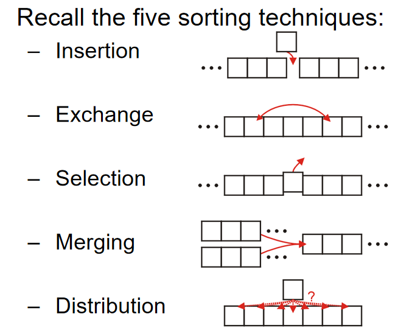
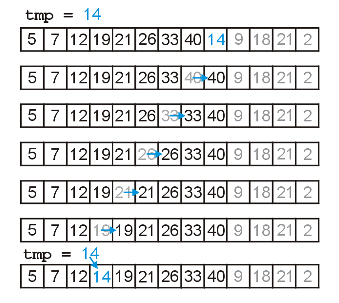
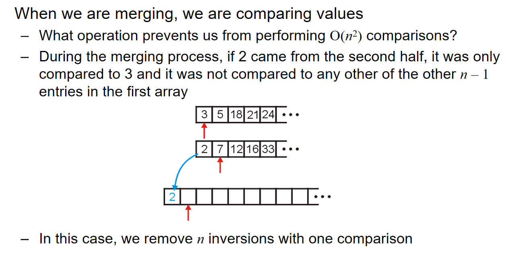
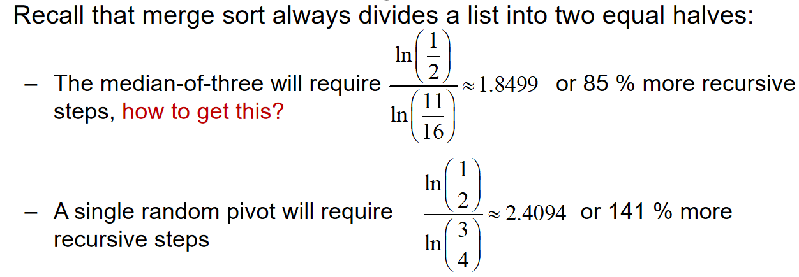
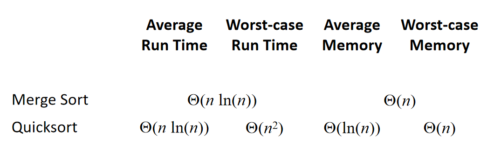
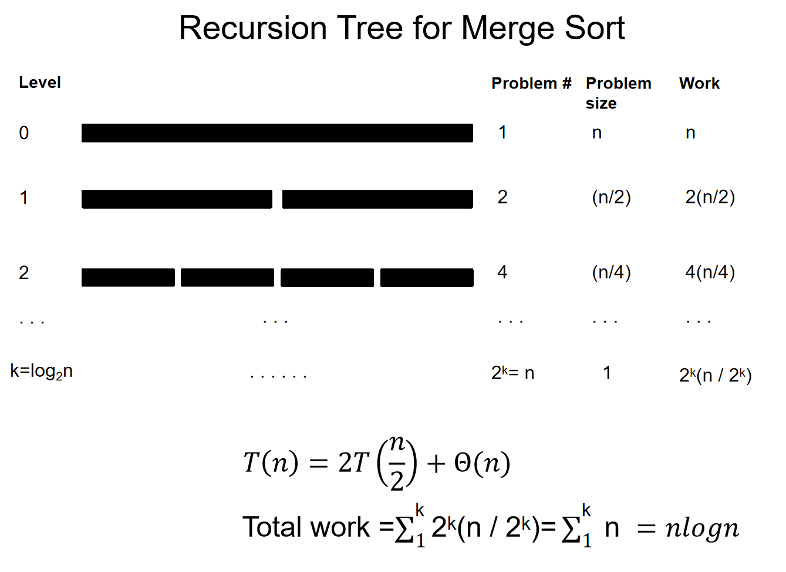

# 搜索与排序

## 二分搜索

### 原理与代码实现

希望在一个没有顺序的数组里面，希望找到val元素，如果是线性搜索，时间复杂度是`O(n)`。那么如果在***有序的序列***（前提!）中，能不能更快地找到我希望的元素呢？那么可以使用二分搜索。

二分搜索中，有两个下标，一个first一个last，一头一尾。然后首先计算序列中间的元素：`int middle = (first + last)/2`，然后判断`arr[middle] <=> val`。如果val更大，说明在middle右边，反之则在左边。同时，要对first last这两个参数进行更新，把去除掉一半部分之后剩下的序列作为新的操作对象。那么什么时候应该停下来呢？假如说val不存在序列里面，那么最后last一定会在first之前。这就是循环停止的标志。

````c++
while (first <= last){    
    int middle = (first + last)/2;
    if (arr[middle] > val):{last = middle-1;}
    if (arr[middle] < val):{last = middle+1;}
}
````

````c++
// binarysearch.cpp
#include <iostream>
using namespace std;
int BinarySearch(int arr[], int size, int val){
    int first = 0;
    int last = size - 1;
    while (first <= last){
        int mid = (first + last) / 2;
        if (arr[mid] == val){
            return mid;
        }
        else if (arr[mid] > val){
            last = mid - 1;
        }
        else {
            first = mid + 1;
        }
    }
    return -1;
}
````

二分搜索的时间复杂度是$O(logn)$，对数时间比线性时间好很多。但是如何严谨地说：为什么二分搜索是对数时间？其实二分搜索实际上就是***对一颗BST树（二叉查找树）从root根节点开始搜索***的过程，每一次搜索只会沿着一条路径搜索下去。在这颗树中，对于每一个有孩子的节点来说，如果有右子节点，那么它一定大于父节点；如果有左子节点，它一定小于父节点。可以说，二分搜索时间复杂度就是这棵树的层数。

### 二分搜索递归实现

递归的形式是函数自己调用自己。在上面中，提到过***“把去除掉一半部分之后剩下的序列作为新的操作对象”***，因此可以认为“对于一个first 与 last之间的数组进行一次操作，要么更新first或者last下标，对原数组再一次进行二分；要么发现了val函数”这种操作为一个单元；递归结束的条件是`first < last`。

````c++
// binarysearch_recursion.cpp
#include <iostream>
using namespace std;

int BinarySearch(int arr[], int i, int j, int val){
    // 递归结束的条件一定要注意！
    if (i > j){return -1;}
    int mid = (i+j)/2;
    if (arr[mid] == val){
        return mid;
    }
    else if (arr[mid] > val){
        return BinarySearch(arr, i, mid - 1, val);
    }
    else{
        return BinarySearch(arr, mid + 1, j, val);
    }
}
````

但是递归看似优雅美丽，然而它也有一些头疼的地方：

-  每次递归调用都会在调用栈上分配新的栈帧（stack frame），这会占用内存。如果递归过深，会超出栈的最大深度（***Python 默认限制为 1000 次调用***），导致 `RecursionError: maximum recursion depth exceeded in comparison` 错误：
- 对于某些递归算法，它们利用递归的时候，时间复杂度奇高无比，例如斐波那契数列的计算：$O(n)$。下面的程序在n到50的时候，计算一轮甚至需要长达10分钟。

````c++
int f(n){
    if n == 1 or 0:
        return 1;
    else:
        return f(n-1) + f(n-2);
}
````

## Introduction of Sorting

In these topics, we will assume that: We are sorting integers, and Arrays are to be used for both input and output. Sorting algorithms may be performed in-place, that is, with the allocation of at most Q(1) additional memory (e.g., fixed number of local variables). Other sorting algorithms require the allocation of second array of equal size. ***We will prefer in-place sorting algorithms***.

The run time of the sorting algorithms we will look at ***fall into one of three categories***: $\Theta(n)\ \Theta(nln(n)) \  O(n^2)$.  (Run-time classification) **W*e will examine average- and worst-case scenarios for each algorithm***. The run-time may change significantly based on the scenario.

***About the Lower-bound Run-time of any algorithm***: Any sorting algorithm must examine each entry in the array at least once. Consequently, all sorting algorithms must be $\Omega(n)$. We will not be able to achieve $\Theta(n)$ behaviour without additional assumptions. 

Five sorting techniques are illustrated as follows:



At the same time, ***The general worst-case run time is*** $\Omega(nlg(n))$（基于比较的排序算法的时间复杂度下限是$O(nlg(n))$的。). The proof can be presented as follows:

- Any comparison-based sorting algorithm can be represented by a comparison tree
- Worst-case running time cannot be less than the height of the tree
- How many leaves does the tree have? The number of permutations of n objects, which is n!
- What’s the shallowest tree with n! leaves? A complete tree, whose height is lg(n!), and it can be shown that $lg(n!) = \Theta(n lg(n))$

 The illustration of a comparison tree can be presented as follows:


同时引入稳定性的概念：

> Reference: oi.wiki

稳定性是指相等的元素经过排序之后相对顺序是否发生了改变。拥有稳定性这一特性的算法会让原本有相等键值的纪录维持相对次序，即如果一个排序算法是稳定的，当有两个相等键值的纪录R和S，且在原本的列表中R出现在S之前，在排序过的列表中R也将会在S之前。

基数排序、计数排序、插入排序、冒泡排序、归并排序是稳定排序。

选择排序、堆排序、快速排序、希尔排序不是稳定排序。

> The stability of a sorting algorithm is concerned with how the algorithm treats equal (or repeated) elements. Stable sorting algorithms preserve the relative order of equal elements, while unstable sorting algorithms don’t. In other words, stable sorting maintains the position of two equals elements relative to one another.

## Inversions

 Given a permutation of n elements, $a_o, \dots, a_{n-1}$, an inversion is defined as ***a pair of*** entries which are reversed. That it, for $(a_j, a_k)$, $a_j > a_k,if\ j<k$.  可想而知，假如说我们交换两个相邻的元素，那么我们有可能引入一个inversion（倒置），或者说消除一个倒置。对于n个数，一共有$\binom{n}{2}=\frac{n(n-1)}{2}$个pair，***而pair要么是倒置inversion，要么是ordered pair。***

$Theorem:$ 对于任何一个随机排列的n个元素的array，inversion pairs的个数的***期望***是$\frac{n(n-1)}{2}$。这个有什么用呢？ 数列的inversion的数量占pairs的比重可以反映一个数组的排列是有“多乱”。例子如下：


那么，swapping two adjacent entries要么移除一个inversion, 要么引入一个inversion。注意这里的措辞：“要么...要么...”，且是一个。我们已经知道，一共有$\binom{n}{2}=\frac{n(n-1)}{2}$个pair，那么可以预测到：如果是随机分布的数组，逆序对数量的期望是：
$$
\frac{1}{2}\binom{n}{2}=\frac{n(n-1)}{4}=\mathbf{O}(n^2)
$$

## Insertion Sort 插入排序

### algorithm

In general, if we have a sorted list of k items, we can insert a new item to create a sorted list of size k + 1。考虑下面这一个数组，前面5-40的元素都是按照顺序排列好的，那么我希望将后面的元素也排列好。现在，就设想我希望将元素14插入到前面正确的位置：

> From oi.wiki：将待排列元素划分为「已排序」和「未排序」两部分，每次从「未排序的」元素中选择一个插入到「已排序的」元素中的正确位置。

| **5** | **7** | **12** | **19** | **21** | **26** | **33** | **40** | *14* | *9*  | *18* | *21* | *2*  |
| ----- | ----- | ------ | ------ | ------ | ------ | ------ | ------ | ---- | ---- | ---- | ---- | ---- |
|       |       |        |        |        |        |        |        |      |      |      |      |      |


14从前面有序数列的末尾开始一个个判断，如果左边的数字比它大，那么就和左边的元素交换位置，一直交换到正确的位置，即左边的数字比他小。For any unsorted list，Treat the first element as a sorted list of size 1。Then, given a sorted list of size k – 1，insert the k-th item into the sorted list. The sorted list is now of size k. 很明显，插入排序使用的是五大排序技巧中的insertion。

### Implementation

首先是一个小技巧：交换元素的操作其实还多了一步“右边元素放在左边的操作”，在连续交换的过程中，这些操作是冗余的。因此：we could just temporarily assign the new entry。示意图如下：



c++实现非常简单：(注意这里面j作用域的细节！跳出循环时的j我需要使用，那么这个j的定义就不能放在for循环里面，而应该放在外面；以及函数要传入size的原因是数组进入函数之后就会退化为指针，引索访问依然合法，但是不清楚数组的长度)

````c++
// insert_sort.cpp
void InsertSort(int arr[], int size){
    for (int i = 0; i < size; i++){
        int val = arr[i];
        int j = i-1;
        for (; j >= 0; j--){
            if (arr[j] <= val){
                break;
            }
            arr[j+1] = arr[j];
        }
        arr[j+1] = val;
    }
}
````

### Analysis

插入排序是一种稳定的排序算法。

可以设想到的是：在worst-cases中，完全倒序的情况下，算法的时间复杂度是$\Theta(n^2)$，因为：the outer for-loop will be executed a total of n – 1 times and the inner for-loop is executed k times, when in the worst case。

在best-case中，时间复杂度是$\Theta(n)$，因为最好的情况是完全排好序了，这种情况下只需要进行n（更细节地：n-1）次判断该元素和左边的元素有多大。话是如此，但是事实上：**Insertion sort, however, will run in $\Theta (n)$ time whenever d = O(n)**, 其中d代表inversions的数量。那么在刚刚描述的最好的情况下，其实d也是$O(n)$，因为$0 <= 0*n$。

那么这个事实为什么是对的呢？因为n是至少进行判断的次数，或者说，从一次处理逆序对的操作开始的结束时刻，**伴随着一次判断发现这个目标元素左边的元素小于目标元素从而停止操作，这一次判断是必不可少的**，而这种判断一共有n次。而d是哪里来的呢？每一次交换元素的数据都是在处理一对逆序对，不会引入逆序对，**而我们知道对于一次交换元素来说，要么消除逆序对，要么引入逆序对**，所以说run time is $\Theta(n+d)$. 这也解释了为什么：**Insertion sort, however, will run in $\Theta (n)$ time whenever d = O(n)**

 

最后，Memory requirements是$\Theta(1)$。可以这么说：如果数据区域有序（d=O(n)），那么插入排序是所有排序算法中，效率最高的排序算法！在基础排序算法中，插入排序>冒泡排序&选择排序。不仅仅没有交换（trick in implementation），而且比较的次数也少！

## Bubble Sort 冒泡排序

### algorithm

Suppose we have an array of data which is unsorted: Starting at the front, traverse the array, find the largest item, and move (or bubble) it to the top. With each subsequent iteration, find the next largest item and bubble it up towards the top of the array. 

简单而言：在一轮从头操作中，从第一个元素开始***遍历引索***（而不是元素），如果引索对应的元素的右边元素比引索元素大，那么就不动，遍历下一个引索，反之则交换两个元素。通过这种方式，可以通过简单的思考就能发现：一轮操作中，总是能把最大的元素放在最后一个位置。那么进入第i轮操作，就是把第i大的元素放在倒数第i个位置。这种操作将重复n(或者说n-1)次。

### Implementation

````c++
// bubble_sort.cpp
#include <iostream>
#include <stdlib.h>
#include <time.h>
using namespace std;

void BubbleSort(int arr[], int size){
    for (int i = 0; i < size-1; i++){
        for (int j = 0; j < size - 1 - i; j++){
            if (arr[j] > arr[j+1]){
                int tmp = arr[j];
                arr[j] = arr[j+1];
                arr[j+1] = tmp;
            }
        }
    }
}
int main(){
    int arr[10];
    srand(time(NULL));
    for (int i = 0; i < 10; i++){
        arr[i] = rand() % 100 + 1;
    }
    for (int v : arr){
        cout << v << " ";
    }
    cout << endl;
    BubbleSort(arr, 10);
    for (int v : arr){
        cout << v << " ";
    }
    cout << endl;
}
````

### analysis

Here we have two nested loops, and therefore calculating the run time is straight-forward:
$$
\sum_{k=1}^{n-1}(n-k) = n(n-1) - \frac{n(n-1)}{2} = \frac{n(n-1)}{2} = \Theta(n^2)
$$
它没有使用任何标志（flag）来检测数列是否已经排序完成。这意味着无论数列是否已经排序，它都会执行所有的比较和可能的交换操作。因此，对于这个版本的冒泡排序，时间复杂度是$O(n^2)$。

### Improvements

上面也提到了，这种算法的流程图很固定，而且很numb。那么我们能不能引入一些优化呢？比如说：reduce the number of swaps, halting if the list is sorted, limiting the range on which we must bubble,  alternating between bubbling up and sinking down。

#### Flagged Bubble Sort

在原来的算法中，假如说在第i轮操作结束之后，所有的元素都排列整齐了，但依然需要进行接下来的n-i轮操作。所以说考虑：在一轮操作中记录是否有进行交换，如果没有，说明已经是完全排列好的状态，就不用再继续排序了！因此我们可以用代码中的flag技巧来实现这一点：

````c++
	template <typename Type>
	void bubble( Type *const array, int const n ) {
		for ( int i = n - 1; i > 0; --i ) {
			Type max = array[0];
			bool sorted = true; // FLAG!
			for ( int j = 1; j <= i; ++j ) {
				if ( array[j] < max ) {
					array[j - 1] = array[j];
					sorted = false;
				} else {
					array[j – 1] = max;
					max = array[j];
				}
			}
			array[i] = max;
			if ( sorted ) {
				break;
			}
		}
	}
````

````c++
// bubble_sort.cpp
void FlaggedBubbleSort(int arr[], int size){
    for (int i = 0; i < size-1; i++){
        bool flag = false;
        for (int j = 0; j < size - 1 - i; j++){
            if (arr[j] > arr[j+1]){
                int tmp = arr[j];
                arr[j] = arr[j+1];
                arr[j+1] = tmp;
                flag = true;
            }
        }
        if (!flag){
            return;
        }
    }
}
````

#### Range-Limiting Bubble Sort

Intuitively, one may believe that limiting the loops based on the location of the last swap may significantly speed up the algorithm. 比如说在一轮操作中，最后一次进行交换的位置非常靠前，这说明什么？这说明最后一次交换后面的元素其实都是已经排列好了的！很可惜的是，in practice，这个操作带来的影响并不是很大。虽然但是，下面是实现的代码：

````c++
	template <typename Type>
	void bubble( Type *const array, int const n ) {
		for ( int i = n - 1; i > 0; ) {
			Type max = array[0];
			int ii = 0;
			for ( int j = 1; j <= i; ++j ) {
				if ( array[j] < max ) {
	   			array[j - 1] = array[j];
					ii = j - 1;
				} else {
					array[j – 1] = max;
					max = array[j];
				}
			}
			array[i] = max;
			i = ii;
		}
	}
````

注意这里i的更新不再是木讷的i++了，而是根据最后一次交换的位置而更新i参数，为的就是跳过不必要的epoch operation。

#### Alternating Bubble Sort

One operation which does significantly improve the run time is to alternate between bubbling the largest entry to the top, ands inking the smallest entry to the bottom. 

以下是交替冒泡排序的基本步骤：

1. 从数组的开始到结束遍历数组，比较相邻的元素，如果前一个元素比后一个元素大（升序排序），则交换它们。
2. 完成第一轮遍历后，最大的元素会被放置在数组的末尾。
3. 然后从数组的末尾开始向前遍历，重复步骤1，直到遍历到数组的开始。
4. 继续交替遍历方向，直到没有元素需要交换，这意味着数组已经完全有序。

> reference: kimi.moonshot.cn

***Because the bubble sort simply swaps adjacent entries, it cannot be any better than insertion sort which does n + d comparisons where d is the number of inversions*** 这一点十分重要！

The following table summarizes the run-times of our modified  bubble sorting algorithms; ***however, they are all worse than insertion sort in practice:***


## Merge Sort 归并排序

### algorithm

The merge sort algorithm is defined recursively: If the list is of size 1, it is sorted—we are done; Otherwise:

- Divide an unsorted list into two sub-lists,

- Sort each sub-list recursively using merge sort, and

- Merge the two sorted sub-lists into a single sorted list

  In practice: If the list size is less than a threshold, use an algorithm like insertion sort.

This strategy is called divide-and-conquer. Merging Sort明显使用的是五大排序技巧中的Merging。那么如何merging呢？假设有两个ordered array，然后创建一个新array，然后用两套引索：哪个array 引索的元素更小，那么元素就放进array，然后这个引索++。当有一个数组遍历完之后，另外一个数组剩余的元素全部按照顺序放进去。就这一点是很好理解的，但是这种操作的核心关键就是***two ordered array***。

***Time***: we have to copy n1 + n2 elements. Hence, merging may be performed in $\Theta(n1 + n2)$ time. If the arrays are approximately the same size, n = n1 ≈ n2, we can say that the run time is $\Theta(n)$.
***Space***: we cannot merge two arrays in-place. This algorithm always required the allocation of a new array. Therefore, the memory requirements are also $\Theta(n)$.

### Implementation

````c++
// merge_sort.cpp
#include <iostream>
#include <stdlib.h>
#include <time.h>
using namespace std;

void Merge(int arr[], int left, int mid, int right){
    // 需要额外的内存空间，把两个小段有序的序列，合并成大段有序的序列
    int* p = new int[right-left+1];
    int idx = 0;
    int i = left;
    int j = mid + 1;
    while (i <= mid && j <= right){
        if (arr[i] <= arr[j]){
            p[idx++] = arr[i++];
        }
        else {
            p[idx++] = arr[j++];
        }
    }
    while (i <= mid){
        p[idx++] = arr[i++];
    }
    while (j <= right){
        p[idx++] = arr[j++];
    }
    // 把合并好的大段有序结果拷贝到原始数组[left, right]区间内
    for (i = left, j = 0; i <= right; i++, j++){
        arr[i] = p[j];
    }
    delete[] p;
}

void MergeSort(int arr[], int begin, int end){
    // 递归结束的条件
    if (begin >= end){
        return;
    }
    int mid = (begin + end) / 2;
    // 先递
    MergeSort(arr, begin, mid);
    MergeSort(arr, mid + 1, end);
    // 再归并 [begin, mid] [mid + 1, begin]这两段有序的序列
    Merge(arr, begin, mid, end);
    
}

void MergeSort(int arr[], int size){
    MergeSort(arr, 0, size-1);
}
````

### Run-Time Analysis 


那么可能会很好奇：为什么不是$O(n^2)$。换而言之：是什么特殊的操作帮助我们减少了时间复杂度？下面这张图生动地展示了原因：



In practice, merge sort is faster than heap sort, though they both have the same asymptotic run times. Merge sort requires an additional array, and Heap sort does not require.

同时，归并排序的空间复杂度是$\Theta(n)$

### Divide and Conquer（分治）

> Reference: kimi.moonshot.cn

分治（Divide and Conquer）思想是一种解决问题的策略，它将一个复杂的问题分解（Divide）成若干个相同或相似的子问题，递归地解决这些子问题（Conquer），然后将子问题的解合并（Combine）起来以解决原始问题。分治法是算法设计中的一种重要方法，尤其在处理大规模数据或复杂计算时非常有效。

分治思想的基本步骤通常包括以下几个阶段：

1. **分解（Divide）**：
   - 将原问题分解为若干个规模较小的相同问题。分解的目的是简化问题，使其更容易解决。分解的粒度取决于问题的性质和解决策略。
2. **解决（Conquer）**：
   - 分别解决这些分解出来的子问题。如果子问题足够小，可以直接解决；如果子问题仍然复杂，则可以递归地应用分治策略。
3. **合并（Combine）**：
   - 将子问题的解合并，构建出原问题的解。合并操作的复杂度通常比子问题解决的复杂度要低，这是分治法有效性的关键。

分治法在算法设计中的应用非常广泛，以下是一些典型的分治算法示例：

- **归并排序（Merge Sort）**：
  - 将数组分成两半，递归地对每一半进行排序，然后将排序好的两半合并。
- **快速排序（Quick Sort）**：
  - 选择一个基准元素，将数组分为两部分，一部分包含所有小于基准的元素，另一部分包含所有大于基准的元素，然后递归地对这两部分进行快速排序。
- **二分搜索（Binary Search）**：
  - 在有序数组中查找一个元素，通过每次比较中间元素将搜索范围缩小一半。

分治法的优点在于它能够将复杂问题简化，使得问题更容易解决，并且可以利用子问题的解来构建原问题的解。然而，分治法也有其局限性，比如递归可能导致栈溢出，合并操作可能需要额外的时间和空间等。因此，在应用分治法时，需要仔细分析问题的性质和算法的效率。

### Merge Sort for counting inversions

> Counting inversions can be achieved by Merge Sort with simply a counter. (计数器)

Count inversions (a, b) with a ∈ A and b ∈ B : 


## Quick Sort 快速排序

### algorithm

在归并排序中，我们把数组分为两了子列表然后排列他们。那么如果考虑如下操作：***Chose an object in the array and partition the remaining objects into two groups relative to the chosen entry***。比如说，我在array中选出一个中间的元素，然后剩下的元素分为两类：要么大于这个元素，要么小于。小于的都扔到左边，大于的都扔到右边，**那么这个元素就会回到正确的位置**。那么对于剩下的左边和右边的两个小array，也可以重复这样的操作！就像归并排序，我们也可以规定：如果子列表足够小，那么我们就直接应用插入排序

### case scenario and runtime analysis

在最好的case中，数组应该能够近乎被均分为两个等长的子列表，然后因此，运行时间应该十分接近归并排序$\Theta(nln(n))$，但是如果我们不是很幸运呢？

假如说我们选中的元素总是恰好就是sub-list中的最小的元素，那么这就说明：$T(n)=T(n-1)+\Theta(n)=\Theta(n^2)$，此时运行时间的表现就下降了，***快速排序的时间复杂度退化到了***$\Theta(n^2)$。我们很是希望找到将会归位于中间的元素（median element），因为这意味着分出来的两个子列表会是等长的，**但*是很可惜的是，这样的median element很难找到***，甚至换而言之，我们不指望能够总是找到这种median element。

对于快速排序的流程，我们可以用二叉树来表示（BST representation）。如下图：


我们认为：$a_i, a_j$ **are compared once if one is an ancestor of the other！**我们假设：

$Proposition: $ The expected number of compares to quicksort an array of n distinct elements $a_1<...<a_n$ is $O(nlogn)$

为了证明这个proposition，我们需要有以下引理，一步一步退出：

$Theorem1:$ 如果两个元素在sort下是相邻的，那么它们两个一定在快速排序的时候比较过，i.e.，一个是另一个的ancestor。

$Theorem2:$对于不同的n(≥8)个不同的元素$a_1<...<a_n$，那么：The probability that $a_1$ and $a_n$ are compared during randomized quicksort is $\frac{2}{n}$。因为只有first pivot元素是$a_1$ or $a_n$，才能实现一个是另一个的ancestor！可以设想：如果first pivot是另外的一个元素，那么这两个极值肯定会在一左一右。

$Theorem3:$ $Probability(a_i,a_j\ are\ compared)=\frac{2}{j-i+1},where\ i<j$  

定理3为什么是正确的呢？假设对于每一次pivot选择来说，如果选中了$a_k,k\notin [i, j]$，那么此时$a_i,a_j$仍然会在一个sub-list里面。但是当pivot开始要第一次在$a_k,k\in [i, j]$中选取元素的时候，只有选中$a_i,a_j$中的任意一个，才能实现一个是另一个的ancestor，否则这两个元素会在那个pivot节点的一左一右，就无法做到一个是另外一个的ancestor了。显然。$theorem1,2$是定理3的特殊情况。

 有了定理三，我们就能推出：***Expected number of compares***
$$
\sum_{i=1}^{n}\sum_{j=i+1}^{n}\frac{2}{j-i+1}=2\sum_{i=1}^{n}\sum_{j=2}^{n-i+1}
\frac{1}{j}≤2n\sum_{j=1}^{n}\frac{1}{j}≤2n(lnn+1)
$$

### median of three strategy

Consider another strategy: Choose the median of the first, middle, and last entries in the list. This will usually give a better approximation of the actual median. 换而言之，选取元素的时候，看sub array的头尾和中间元素，然后选这三个元素中的中间元素作为pivot。

If we choose a random pivot, this will, on average, divide a set of n items into two sets of size 1/4 n and 3/4 n. Choosing the median-of-three, this will, on average, divide the n items into two sets of size 5/16 n and 11/16 n. ***It is considered that Median-of-three helps speed the algorithm***. 

> Reference: kimi.moonshot.cn
>
> 具体来说，Median-of-three的步骤如下：
>
> 1. 选取数组的第一个元素、中间元素和最后一个元素。
> 2. 比较这三个元素，并将它们按照大小顺序排列。
> 3. 选择中间的元素作为基准值。
>
> 这种方法的优势在于，它能够减少快速排序算法在面对特定类型的输入（例如，已经排序或接近排序的数组）时性能恶化的风险。通过选择三个位置的中位数作为基准值，可以更大概率地保证基准值接近整个数组的中间值，从而在划分过程中得到更均衡的两个子数组，提高算法的平均效率。
>
> 在实际应用中，Median-of-three策略通常与其他优化策略结合使用，例如三路划分（3-way partitioning）和插入排序。三路划分是指在快速排序的划分过程中，将数组划分为三个部分：小于基准值的元素、等于基准值的元素和大于基准值的元素。这样可以减少不必要的元素交换，提高排序效率。而当数组的大小较小时，使用插入排序代替快速排序可以更快地完成排序任务。
>
> 总的来说，Median-of-three是一种有效的基准值选取策略，可以提高快速排序算法在各种情况下的性能，尤其是在面对大规模数据集时。

同时，median-of-three还能帮忙减少迭代的次数：



但是事实证明：median-of-three对于运行时间的影响是有限的！


### implementation

If we choose to allocate memory for an additional array, we can implement the partitioning by copying elements either to the front or the back of the additional array and placing the pivot into the resulting hole. 简而言之：在选定了pivot元素之后，遍历剩余的数组，比pivot大的就从末尾开始放，反之就从头部开始放，那么最后会剩下一个空位，就放入pivot element。

但是这需要额外的空间了。我们能不能就地操作？当然可以。流程如下：


同时，在每一次进行median of three的时候，把median放在最后，把三个中最小的放在最前面，三个中最大的放在中间。具体演示见ppt。

代码如下：

````c++
// quick_sort.cpp
// reference: ChatGPT 4o model
#include <iostream>
#include <algorithm>

// 三点取中法选择基准值
int medianOfThree(int arr[], int low, int high) {
    int mid = low + (high - low) / 2;
    
    // 将low, mid, high三个值按大小排序
    if (arr[low] > arr[mid])
        std::swap(arr[low], arr[mid]);
    if (arr[low] > arr[high])
        std::swap(arr[low], arr[high]);
    if (arr[mid] > arr[high])
        std::swap(arr[mid], arr[high]);
    
    // 使用中间值作为基准值
    std::swap(arr[mid], arr[high - 1]); // 将基准值放在high-1的位置
    return arr[high - 1];
}

// 分区函数
int partition(int arr[], int low, int high) {
    int pivot = medianOfThree(arr, low, high);  // 基准值为三点取中的值
    int i = low;
    int j = high - 1;  // pivot已经放在high - 1的位置
    
    while (true) {
        // 从左边找到第一个比pivot大的元素
        while (arr[++i] < pivot);
        // 从右边找到第一个比pivot小的元素
        while (arr[--j] > pivot);
        
        if (i < j)
            std::swap(arr[i], arr[j]);
        else
            break;
    }
    
    // 将pivot放回正确的位置
    std::swap(arr[i], arr[high - 1]);  // i是第一个比pivot大的位置
    return i;  // 返回pivot的最终位置
}

// 快速排序主函数
void quickSort(int arr[], int low, int high) {
    if (low + 10 <= high) {  // 使用插入排序的阈值，可以根据需要调整
        int pivotIndex = partition(arr, low, high);
        quickSort(arr, low, pivotIndex - 1);
        quickSort(arr, pivotIndex + 1, high);
    } else {
        // 当子数组较小时，使用插入排序优化
        for (int i = low + 1; i <= high; ++i) {
            int temp = arr[i];
            int j;
            for (j = i; j > low && arr[j - 1] > temp; --j)
                arr[j] = arr[j - 1];
            arr[j] = temp;
        }
    }
}

// 快速排序的外部接口
void quickSort(int arr[], int n) {
    quickSort(arr, 0, n - 1);
}

int main() {
    int arr[] = {24, 97, 40, 67, 88, 85, 15, 66, 53, 44};
    int n = sizeof(arr) / sizeof(arr[0]);
    
    quickSort(arr, n);
    
    std::cout << "Sorted array: ";
    for (int i = 0; i < n; ++i) {
        std::cout << arr[i] << " ";
    }
    std::cout << std::endl;
    
    return 0;
}

````


### Run-time and memory summary

***虽然说我们实现了就地操作，但是迭代其实是需要占用栈空间的***。一般来说，depth of recursion is $\Theta(ln(n))$, and the depth of the recursion is $\Theta(n)$



## Divide and Conquer

### Master Theorem


递归的时间复杂度的递归式如上，上图中提到的四个参数的***具体问题意义***值得记住。我们很是希望找到一个通用的解法来计算它的时间复杂度。例如，我们知道归并排序的时间复杂度：
$$
T(n)=2T(\frac{n}{2})+\Theta(n), while\ T(1)=\Theta(1)\rightarrow T(n)=\Theta(nln(n))
$$
当初，归并排序的时间复杂度是用下面这个流程图来计算的：



那么用这个思路，能不能解出一些其他的递归式的时间复杂度呢？两个例子如下：


那么这个经验总结一下，我们就得到了主定理 $Master\ Theorem$:


其中：$log_ba$和d比较的意义是什么？为什么需要比较？$log_ba$表示递归部分的“分裂增长率”，而 d 是非递归部分的“合并增长率”。这两者的比较决定了递归调用的次数与每层递归所需时间的相对贡献，从而影响算法的总体时间复杂度。

> 以下部分reference: ChatGPT 4o model

**当 $log⁡_b a>d时$**（递归部分主导）

- **类比**：你将任务分得非常细，子任务的数量随着递归次数迅速增加，而每个子任务的工作量相对比较小。
- **感性理解**：这个场景就像你把任务分配给很多人，每个人做的任务都很简单，但因为子任务的数量非常多，递归的分裂过程花费了大量时间，最终时间主要耗在处理越来越多的子任务上，而不是合并结果。
- **结论**：时间主要花在了递归拆分上。递归树有很多层，最终的复杂度由递归决定，即 $T(n)=O(nlog_⁡b a)T(n) = \mathcal{O}(n^{\log_b a})T(n)=O(nlog_b a)$。

 **当 $log⁡_b a=d时$时**（递归部分和合并部分平衡）

- **类比**：任务拆分后，子任务数量和每层的合并工作恰好达到一个平衡点。
- **感性理解**：你把任务分给别人做，并且每次合并结果时，处理的工作量和拆分的子任务数量差不多。这时，每一层的递归处理和合并工作几乎同样耗时，最终的复杂度会受到两者的共同影响。
- **结论**：递归和合并工作相互平衡，时间复杂度带有一个对数项，即 $T(n)=O(n^d log⁡n)T(n) = \mathcal{O}(n^d \log n)T(n)=O(n^d logn)$。

**当 $log⁡_b a<d时$时**（合并部分主导）

- **类比**：你把任务拆分成很多个子任务，但每个子任务的工作量非常小，合并子任务的时间反而远远超过了子任务的执行时间。
- **感性理解**：就像你让很多人帮忙做一些很小的工作，但最终你需要花大量时间把所有的结果合并在一起。此时，递归产生的子任务虽然很多，但它们各自所需的时间比较少，主要耗时集中在合并过程。
- **结论**：合并部分占主导地位，复杂度由非递归部分决定，即 $T(n)=O(nd)T(n) = \mathcal{O}(n^d)T(n)=O(nd)。$

### Example

#### Integer Multiplication

我们知道给两个二进制的数字x y，计算加减都是一位一位进行操作的。那么乘法的时候使用的是Grade-school算法，通常称为“小学算术算法”，是一种用于手算乘法的算法，它利用了乘法对加法的分配律来简化计算过程。如下图：那么我们能够直观发现，这个算法的复杂度是$\Theta(n^2)$


那么这个问题能不能用分治解决呢？直接想可能会有点困难，那么直接见下图：按照bit位数分为两部分，然后根据2的幂的性质去用这两部分去表示原来的数字，那么原来的x y相乘就能更换一种新的表达形式：


OK，那么a b c d同样也可以各自一分为二进行操作，直到最后只有1个数字。于是我们就能够设计如下的伪代码：


那么根据算法，我们能够表示该流程的循环树Recursion Tree：


那么我们可以表示时间复杂度：$T(n)=4T(\frac{n}{2})+\Theta(n)$，利用Master Theorem，我们直到这是第三种情况，那么时间复杂度就是$T(n)=\Theta(n^{log_24} = \Theta(n^2))$

特别地：如果希望计算bc + ad的中间项，其实可以不用再进一步分治，因为：
$$

bc + ad  =  ac + bd  –  (a – b) (c – d)
$$
所以其实只需要ac bd这两个结果需要进行分治就可以了。在这种算法中，一次循环中只需要三个1/2n-bit整数相乘操作。伪代码如下：


Recursion Tree如下：


那么我们知道：$T(n) = 3T(\frac{n}{2}) + \Theta(n)$，根据Master Theorem可知这是第三种情况，因此时间复杂度是：$T(n) = T(n^{log_23})$
