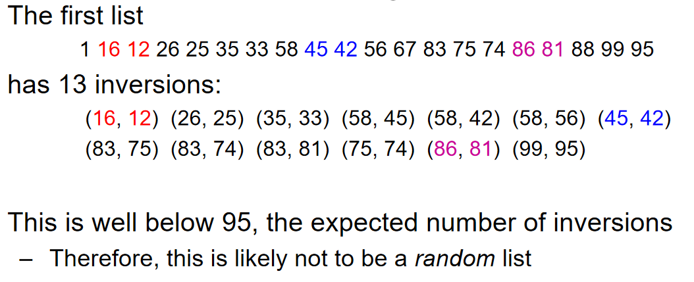
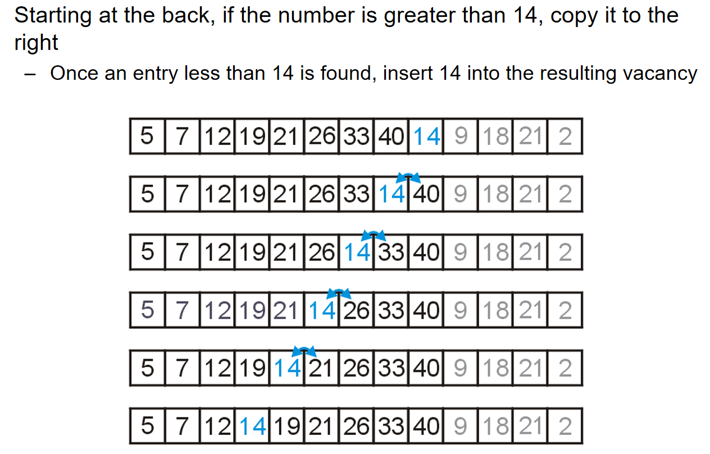

# 搜索与排序

## 二分搜索

### 原理与代码实现

希望在一个没有顺序的数组里面，希望找到val元素，如果是线性搜索，时间复杂度是`O(n)`。那么如果在***有序的序列***（前提!）中，能不能更快地找到我希望的元素呢？那么可以使用二分搜索。

二分搜索中，有两个下标，一个first一个last，一头一尾。然后首先计算序列中间的元素：`int middle = (first + last)/2`，然后判断`arr[middle] <=> val`。如果val更大，说明在middle右边，反之则在左边。同时，要对first last这两个参数进行更新，把去除掉一半部分之后剩下的序列作为新的操作对象。那么什么时候应该停下来呢？假如说val不存在序列里面，那么最后last一定会在first之前。这就是循环停止的标志。

````c++
while (first <= last){    
    int middle = (first + last)/2;
    if (arr[middle] > val):{last = middle-1;}
    if (arr[middle] < val):{last = middle+1;}
}
````

````c++
// binarysearch.cpp
#include <iostream>
using namespace std;
int BinarySearch(int arr[], int size, int val){
    int first = 0;
    int last = size - 1;
    while (first <= last){
        int mid = (first + last) / 2;
        if (arr[mid] == val){
            return mid;
        }
        else if (arr[mid] > val){
            last = mid - 1;
        }
        else {
            first = mid + 1;
        }
    }
    return -1;
}
````

二分搜索的时间复杂度是$O(logn)$，对数时间比线性时间好很多。但是如何严谨地说：为什么二分搜索是对数时间？其实二分搜索实际上就是***对一颗BST树（二叉查找树）从root根节点开始搜索***的过程，每一次搜索只会沿着一条路径搜索下去。在这颗树中，对于每一个有孩子的节点来说，如果有右子节点，那么它一定大于父节点；如果有左子节点，它一定小于父节点。可以说，二分搜索时间复杂度就是这棵树的层数。

### 二分搜索递归实现

递归的形式是函数自己调用自己。在上面中，提到过***“把去除掉一半部分之后剩下的序列作为新的操作对象”***，因此可以认为“对于一个first 与 last之间的数组进行一次操作，要么更新first或者last下标，对原数组再一次进行二分；要么发现了val函数”这种操作为一个单元；递归结束的条件是`first < last`。

````c++
// binarysearch_recursion.cpp
#include <iostream>
using namespace std;

int BinarySearch(int arr[], int i, int j, int val){
    // 递归结束的条件一定要注意！
    if (i > j){return -1;}
    int mid = (i+j)/2;
    if (arr[mid] == val){
        return mid;
    }
    else if (arr[mid] > val){
        return BinarySearch(arr, i, mid - 1, val);
    }
    else{
        return BinarySearch(arr, mid + 1, j, val);
    }
}
````

但是递归看似优雅美丽，然而它也有一些头疼的地方：

-  每次递归调用都会在调用栈上分配新的栈帧（stack frame），这会占用内存。如果递归过深，会超出栈的最大深度（***Python 默认限制为 1000 次调用***），导致 `RecursionError: maximum recursion depth exceeded in comparison` 错误：
- 对于某些递归算法，它们利用递归的时候，时间复杂度奇高无比，例如斐波那契数列的计算：$O(n)$。下面的程序在n到50的时候，计算一轮甚至需要长达10分钟。

````c++
int f(n){
    if n == 1 or 0:
        return 1;
    else:
        return f(n-1) + f(n-2);
}
````

## Introduction of Sorting

In these topics, we will assume that: We are sorting integers, and Arrays are to be used for both input and output. Sorting algorithms may be performed in-place, that is, with the allocation of at most Q(1) additional memory (e.g., fixed number of local variables). Other sorting algorithms require the allocation of second array of equal size. ***We will prefer in-place sorting algorithms***.

The run time of the sorting algorithms we will look at ***fall into one of three categories***: $\Theta(n)\ \Theta(nln(n)) \  O(n^2)$.  (Run-time classification) **W*e will examine average- and worst-case scenarios for each algorithm***. The run-time may change significantly based on the scenario.

***About the Lower-bound Run-time of any algorithm***: Any sorting algorithm must examine each entry in the array at least once. Consequently, all sorting algorithms must be $\Omega(n)$. We will not be able to achieve $\Theta(n)$ behaviour without additional assumptions. 

Five sorting techniques are illustrated as follows:


At the same time, ***The general worst-case run time is*** $\Omega(nlg(n))$. The proof can be presented as follows:

- Any comparison-based sorting algorithm can be represented by a comparison tree
- Worst-case running time cannot be less than the height of the tree
- How many leaves does the tree have? The number of permutations of n objects, which is n!
- What’s the shallowest tree with n! leaves? A complete tree, whose height is lg(n!), and it can be shown that $lg(n!) = \Theta(n lg(n))$

 The illustration of a comparison tree can be presented as follows:


## Inversions

 Given a permutation of n elements, $a_o, \dots, a_{n-1}$, an inversion is defined as ***a pair of*** entries which are reversed. That it, for $(a_j, a_k)$, $a_j > a_k,if\ j<k$.  可想而知，假如说我们交换两个相邻的元素，那么我们有可能引入一个inversion（倒置），或者说消除一个倒置。对于n个数，一共有$\binom{n}{2}=\frac{n(n-1)}{2}$个pair，而两个相邻元素组成的pair要么是倒置inversion，要么是ordered pair。

$Theorem:$ 对于任何一个随机排列的n个元素的array，inversion pairs的个数的***期望***是$\frac{n(n-1)}{2}$。这个有什么用呢？ 数列的inversion的数量占pairs的比重可以反映一个数组的排列是有“多乱”。例子如下：



## Insertion Sort 插入排序

### algorithm

In general, if we have a sorted list of k items, we can insert a new item to create a sorted list of size k + 1。考虑下面这一个数组，前面5-40的元素都是按照顺序排列好的，那么我希望将后面的元素也排列好。现在，就设想我希望将元素14插入到前面正确的位置：

| **5** | **7** | **12** | **19** | **21** | **26** | **33** | **40** | *14* | *9*  | *18* | *21* | *2*  |
| ----- | ----- | ------ | ------ | ------ | ------ | ------ | ------ | ---- | ---- | ---- | ---- | ---- |
|       |       |        |        |        |        |        |        |      |      |      |      |      |



14从前面有序数列的末尾开始一个个判断，如果左边的数字比它大，那么就和左边的元素交换位置，一直交换到正确的位置，即左边的数字比他小。For any unsorted list，Treat the first element as a sorted list of size 1。Then, given a sorted list of size k – 1，insert the k-th item into the sorted list. The sorted list is now of size k. 很明显，插入排序使用的是五大排序技巧中的insertion。

### Implementation

首先是一个小技巧：交换元素的操作其实还多了一步“右边元素放在左边的操作”，在连续交换的过程中，这些操作是冗余的。因此：we could just temporarily assign the new entry。示意图如下：


### Analysis

可以设想到的是：在worst-cases中，完全倒序的情况下，算法的时间复杂度是$\Theta(n^2)$，因为：the outer for-loop will be executed a total of n – 1 times and the inner for-loop is executed k times, when in the worst case。

在best-case中，时间复杂度是$\Theta(n)$，因为最好的情况是完全排好序了，这种情况下只需要进行n（更细节地：n-1）次判断该元素和左边的元素有多大。话是如此，但是事实上：**Insertion sort, however, will run in $\Theta (n)$ time whenever d = O(n)**, 其中d代表inversions的数量。那么在刚刚描述的最好的情况下，其实d也是$O(n)$，因为$0 <= 0*n$。

那么这个事实为什么是对的呢？因为n是至少进行判断的次数，或者说，从一次处理逆序对的操作开始的结束时刻，**伴随着一次判断发现这个目标元素左边的元素小于目标元素从而停止操作，这一次判断是必不可少的**，而这种判断一共有n次。而d是哪里来的呢？每一次交换元素的数据都是在处理一对逆序对，不会引入逆序对，**而我们知道对于一次交换元素来说，要么消除逆序对，要么引入逆序对**，所以说run time is $\Theta(n+d)$. 这也解释了为什么：**Insertion sort, however, will run in $\Theta (n)$ time whenever d = O(n)**

 

最后，Memory requirements是$\Theta(1)$。

## Bubble Sort

### algorithm

Suppose we have an array of data which is unsorted: Starting at the front, traverse the array, find the largest item, and move (or bubble) it to the top. With each subsequent iteration, find the next largest item and bubble it up towards the top of the array. 

简单而言：在一轮从头操作中，从第一个元素开始***遍历引索***（而不是元素），如果引索对应的元素的右边元素比引索元素大，那么就不动，遍历下一个引索，反之则交换两个元素。通过这种方式，可以通过简单的思考就能发现：一轮操作中，总是能把最大的元素放在最后一个位置。那么进入第i轮操作，就是把第i大的元素放在倒数第i个位置。这种操作将重复n(或者说n-1)次。

### Implementation


### analysis

Here we have two nested loops, and therefore calculating the run time is straight-forward:
$$
\sum_{k=1}^{n-1}(n-k) = n(n-1) - \frac{n(n-1)}{2} = \frac{n(n-1)}{2} = \Theta(n^2)
$$
这个冒泡排序的时间复杂度是固定的，因为判断的次数是固定，而这又是因为算法的设计很Numb。

### Improvements

上面也提到了，这种算法的流程图很固定，而且很numb。那么我们能不能引入一些优化呢？比如说：reduce the number of swaps, halting if the list is sorted, limiting the range on which we must bubble,  alternating between bubbling up and sinking down。

#### Flagged Bubble Sort

在原来的算法中，假如说在第i轮操作结束之后，所有的元素都排列整齐了，但依然需要进行接下来的n-i轮操作。所以说考虑：在一轮操作中记录是否有进行交换，如果没有，说明已经是完全排列好的状态，就不用再继续排序了！因此我们可以用代码中的flag技巧来实现这一点：

````c++
	template <typename Type>
	void bubble( Type *const array, int const n ) {
		for ( int i = n - 1; i > 0; --i ) {
			Type max = array[0];
			bool sorted = true; // FLAG!
			for ( int j = 1; j <= i; ++j ) {
				if ( array[j] < max ) {
					array[j - 1] = array[j];
					sorted = false;
				} else {
					array[j – 1] = max;
					max = array[j];
				}
			}
			array[i] = max;
			if ( sorted ) {
				break;
			}
		}
	}
````

#### Range-Limiting Bubble Sort

Intuitively, one may believe that limiting the loops based on the location of the last swap may significantly speed up the algorithm. 比如说在一轮操作中，最后一次进行交换的位置非常靠前，这说明什么？这说明最后一次交换后面的元素其实都是已经排列好了的！很可惜的是，in practice，这个操作带来的影响并不是很大。虽然但是，下面是实现的代码：

````c++
	template <typename Type>
	void bubble( Type *const array, int const n ) {
		for ( int i = n - 1; i > 0; ) {
			Type max = array[0];
			int ii = 0;
			for ( int j = 1; j <= i; ++j ) {
				if ( array[j] < max ) {
	   			array[j - 1] = array[j];
					ii = j - 1;
				} else {
					array[j – 1] = max;
					max = array[j];
				}
			}
			array[i] = max;
			i = ii;
		}
	}
````

注意这里i的更新不再是木讷的i++了，而是根据最后一次交换的位置而更新i参数，为的就是跳过不必要的epoch operation。

#### Alternating Bubble Sort

One operation which does significantly improve the run time is to alternate between bubbling the largest entry to the top, ands inking the smallest entry to the bottom. 

以下是交替冒泡排序的基本步骤：

1. 从数组的开始到结束遍历数组，比较相邻的元素，如果前一个元素比后一个元素大（升序排序），则交换它们。
2. 完成第一轮遍历后，最大的元素会被放置在数组的末尾。
3. 然后从数组的末尾开始向前遍历，重复步骤1，直到遍历到数组的开始。
4. 继续交替遍历方向，直到没有元素需要交换，这意味着数组已经完全有序。

> reference: kimi.moonshot.cn

Because the bubble sort simply swaps adjacent entries, it cannot be any better than insertion sort which does n + d comparisons where d is the number of inversions


The following table summarizes the run-times of our modified  bubble sorting algorithms; however, they are all worse than insertion sort in practice:

 ## Merge Sort

### algorithm

The merge sort algorithm is defined recursively: If the list is of size 1, it is sorted—we are done; Otherwise:

- Divide an unsorted list into two sub-lists,

- Sort each sub-list recursively using merge sort, and

- Merge the two sorted sub-lists into a single sorted list

  In practice: If the list size is less than a threshold, use an algorithm like insertion sort.

This strategy is called divide-and-conquer. Merging Sort明显使用的是五大排序技巧中的Merging。那么如何merging呢？假设有两个ordered array，然后创建一个新array，然后用两套引索：哪个array 引索的元素更小，那么元素就放进array，然后这个引索++。当有一个数组遍历完之后，另外一个数组剩余的元素全部按照顺序放进去。就这一点是很好理解的，但是这种操作的核心关键就是***two ordered array***。

***Time***: we have to copy n1 + n2 elements. Hence, merging may be performed in Q(n1 + n2) time. If the arrays are approximately the same size, n = n1 ≈ n2, we can say that the run time is Q(n).
***Space***: we cannot merge two arrays in-place. This algorithm always required the allocation of a new array. Therefore, the memory requirements are also Q(n).

### Implementation

/

### Run-Time Analysis 


那么可能会很好奇：为什么不是$O(n^2)$。换而言之：是什么特殊的操作帮助我们减少了时间复杂度？下面这张图生动地展示了原因：


In practice, merge sort is faster than heap sort, though they both have the same asymptotic run times. Merge sort requires an additional array, and Heap sort does not require.

### Divide and Conquer（分治）

> Reference: kimi.moonshot.cn

分治（Divide and Conquer）思想是一种解决问题的策略，它将一个复杂的问题分解（Divide）成若干个相同或相似的子问题，递归地解决这些子问题（Conquer），然后将子问题的解合并（Combine）起来以解决原始问题。分治法是算法设计中的一种重要方法，尤其在处理大规模数据或复杂计算时非常有效。

分治思想的基本步骤通常包括以下几个阶段：

1. **分解（Divide）**：
   - 将原问题分解为若干个规模较小的相同问题。分解的目的是简化问题，使其更容易解决。分解的粒度取决于问题的性质和解决策略。
2. **解决（Conquer）**：
   - 分别解决这些分解出来的子问题。如果子问题足够小，可以直接解决；如果子问题仍然复杂，则可以递归地应用分治策略。
3. **合并（Combine）**：
   - 将子问题的解合并，构建出原问题的解。合并操作的复杂度通常比子问题解决的复杂度要低，这是分治法有效性的关键。

分治法在算法设计中的应用非常广泛，以下是一些典型的分治算法示例：

- **归并排序（Merge Sort）**：
  - 将数组分成两半，递归地对每一半进行排序，然后将排序好的两半合并。
- **快速排序（Quick Sort）**：
  - 选择一个基准元素，将数组分为两部分，一部分包含所有小于基准的元素，另一部分包含所有大于基准的元素，然后递归地对这两部分进行快速排序。
- **二分搜索（Binary Search）**：
  - 在有序数组中查找一个元素，通过每次比较中间元素将搜索范围缩小一半。

分治法的优点在于它能够将复杂问题简化，使得问题更容易解决，并且可以利用子问题的解来构建原问题的解。然而，分治法也有其局限性，比如递归可能导致栈溢出，合并操作可能需要额外的时间和空间等。因此，在应用分治法时，需要仔细分析问题的性质和算法的效率。
