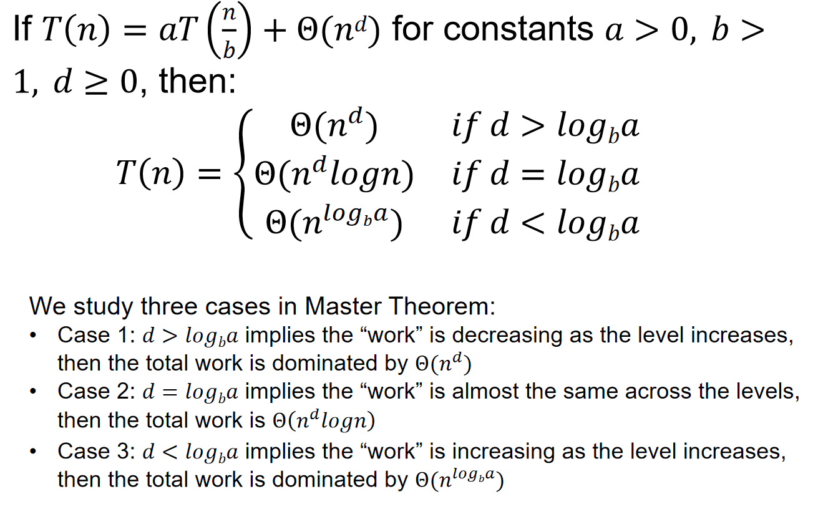
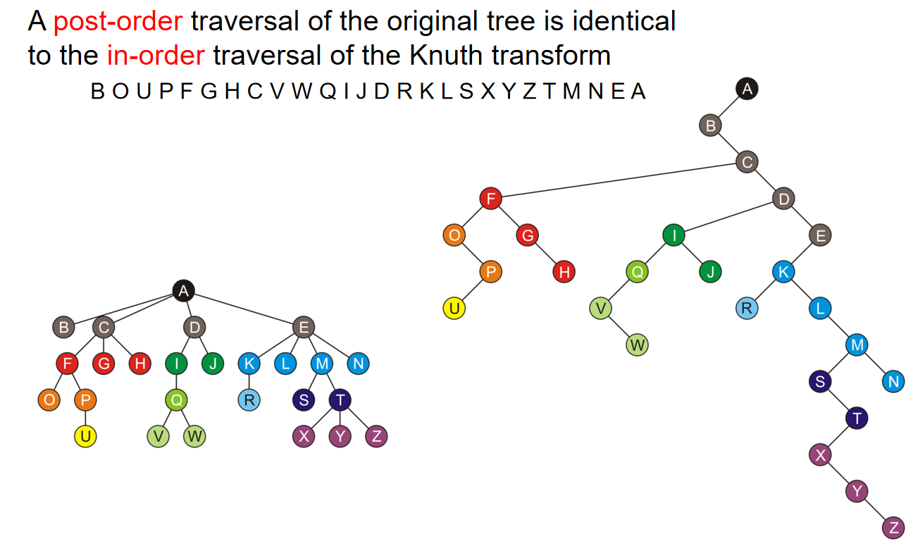
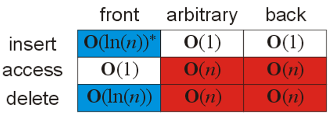
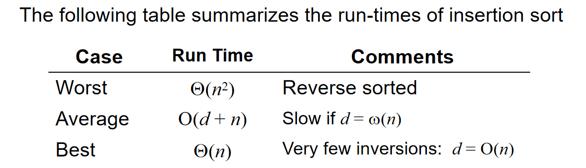

# 期中回顾

## 时间复杂度与分治

- 时间复杂度相关

- $O(n!)$是最大的，而$O(nlogn) < O(n^i)$如果$i>1$
- 选择题中关于时间复杂度表述，格外需要注意使用的是那个符号！比如：节点数量为n的完美二叉树的高度是$O(n)$那么这个结论就是正确的，因为$logn = O(n)$
- 对于一个算法来说，可能做到最好情况时间复杂度是$O(n)$而最坏是$\Omega(n)$——算法时间复杂度稳定为$\Theta(n)$

对于$T(n) = aT(n/b)+\Theta(n^klog^pn)$来说：

1. if $a > b^k$, then $T(n) = θ(n^{log_ba})$

2. if $ a = b^k$, then :

(a) if p > -1, then $T(n) = θ(n^{log_ba} log^{p+1}n) $

(b) if p = -1, then $T(n) = θ(n^{log_ba} log(logn) $

(c) if p < -1, then $T(n) = θ(n^{log_ba}) $

3. if $a < b^k$, then 
   (a) if p >= 0, then $T(n) = θ(n^k log^pn) $
   (b) if p < 0, then $T(n) = θ(n^k) $

## 数据结构

- $\lambda = \frac{N}{M}$为哈希表的load factor，用来表示每一个bin上面所拥有的元素的数量。如果load factor很大，那么access times的时间复杂度将会增大到$O(\lambda)$。
- 哈希表Lazy Erasing中，删掉了一个地方的元素，然后标记它为ERASED，***在搜索的时候视它为occupied，插入的时候视它为unoccupied。***
- Linear Probing下，查找的平均探测次数为：

$$
\frac{1}{2}(1+\frac{1}{1-\lambda}),\mbox{successful search}
$$

$$
\frac{1}{2}(1+\frac{1}{(1-\lambda)^2}),\mbox{unsuccessful search}
$$

- Quadratic probing散列函数为：$h(k,i)=(h_1(k)+c_1i+c_2i^2)modm$，This guarantees that all M entries are visited before the pattern repeats，runtime评估如下：

- Double Hashing区别于线性探测和二次探测，是独立的一种方法。

双重哈希的过程包括以下步骤：

1. **第一哈希函数** $h_1(x)$：用于将元素映射到哈希表中的一个初始位置。
2. **第二哈希函数**(secondary hashing function) $h_2(x)$：用于计算步长，即在发生冲突时从该位置跳转多少个位置。

散列函数为：$h(k,i)=(h_1(k)+ih_2(k))modm$。所以说：线性探测可以认为是第二哈希函数为1的double hashing，线性探测可以认为是第二哈希函数为$(c_1+c_2i)$的double hashing。

- 树中一些概念的细节：

1. A ***path*** is a sequence of edges between nodes. The length of this path is number of edges in the path. ***Depth*** is the length of the node's path. The height of a tree is defined as the maximum depth of any node within the tree. ***The height of a tree with one node is 0***. For convenience, ***we define the height of the empty tree to be  –1***
2. ancestor/祖先节点：any node y on the (unique) path from root r to node n is an ancestor of node n. ***因此一个节点可以是自己的祖先节点***
3. descendent/后代节点：any node y for which n is an ancestor of y. ***因此一个节点可以是自己的后代节点***。同时，strict descendant规定了自己不能是自己的后代节点。
4. subtree：Given any node $a$ within a tree, ***the collection of $a$ and all of its descendants is said to be a subtree of the tree with root $a$.***

- 一个含有n个节点的树，它的ordered tree数量为$\frac{2n!}{(n+1)!n!}$种
- :warning:需掌握的技能：栈实现深度优先搜索；队列实现广度优先搜索
- Traversal on forest可以通过人为添加虚空根节点来实现。
- 先序+后续不能确定树的结构，而另外两种组合可以
- ***full binary tree***（完整二叉树）是每个节点***要么是满节点（左右子树均非空），要么是叶子节点的二叉树。*** 所有叶结点的深度均相同，且所有非叶节点的子节点数量均为 2 的二叉树称为完美二叉树。**完全二叉树（complete binary tree）**：只有最下面两层结点的度数可以小于 2，且最下面一层的结点都集中在该层最左边的连续位置上。
- 用数组来存储完全二叉树，索引为0的位置空不空出来都可以，但是节点寻找左右孩子节点索引的规则却略有不同。
- Left-Child Right-Sibling又被称为***Knuth transform***，则有：

1. ***A pre-order traversal of the original tree is identical to the pre-order traversal of the Knuth transform***

2. ***A post-order traversal of the original tree is identical to the in-order traversal of the Knuth transform***

- 如果一颗完全二叉树的后序遍历是递减序列，那么这颗完全二叉树就是min-heap***；***但是反之不然，如果一个二叉树是min-heap，它的后序遍历不一定是递减序列。
- 以下为二叉堆的操作的时间复杂度分析：

- :warning:需掌握的技能：Floyd创建二叉堆；二叉堆的push pop.
- :warning:堆排序的最好情况和最坏情况的时间复杂度都是$\Theta(logn)$，而且堆排序是一个不稳定的算法
- 霍夫曼编码出来的code set***可以做到***所有的character的code length都一样；***For the same character set, if their frequencies differ, then the Huffman coding trees generated by them may be the same***. For example, two characters of frequency 10 and 20, and two characters of frequency 100 and 200, will have the same Huffman Coding Trees
- 往AVL树中插入元素造成的不平衡，最多一次correction就能work；但是对于删除来说，就可能不止一步correction了。而删除和查找二叉树的删除规则一样，需要找到后继元素。
- :warning:插入可能只需要一次（而且至多一次）correction就能再次维持平衡，而每次平衡只需要O(1)的时间。但是删除可能需要O(h)次correction，每次都是O(1)时间，而h就是高度，所以对于删除来说时间复杂度是$O(ln(n))$。

- 储存AVL树的额外内存复杂度：$O(n^{1.44})$
- :warning:***二叉查找树的中序遍历结果就是sorted array!***且换而言之也是成立的： ***如果一颗二叉树满足中序遍历结果是递增的，那么这棵树就是查找二叉树！***
- 查找二叉树几乎所有的操作都是$O(h)$的时间复杂度，而我们能做得最好的就是让这棵树的完美的，$O(ln(n))$

## 搜索和排序

- 插入排序在数组十分接近有序的情况下表现非常的好；插入排序是稳定的；Memory requirements是$\Theta(1)$

- 冒泡排序在实践中总是表现不如插入排序好；冒泡排序是稳定的；Memory requirements是$\Theta(1)$

- 归并排序是稳定的；空间复杂度是$\Theta(n)$

- 快速排序是不稳定的；***虽然说快排实现了就地操作，但是迭代其实是需要占用栈空间的***：the average-case depth of recursion is $\Theta(ln(n))$，and the worst-case depth of the recursion is $\Theta(n)$；快排最好情况的时间复杂度也是$\Theta(nlnn)$

- 堆排序是不稳定的；空间复杂度为$\Theta(1)$因为是就地操作；任何情况下，平均、最好、最坏情况的时间复杂度都是$\Theta(nlnn)$