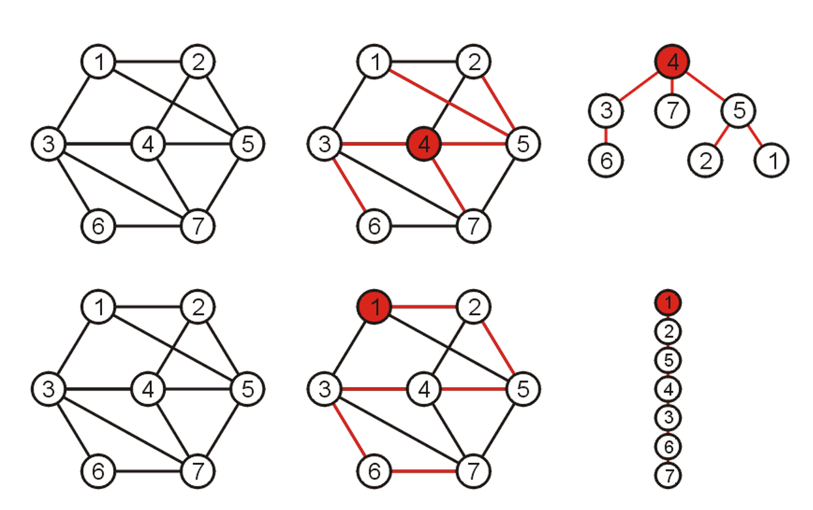
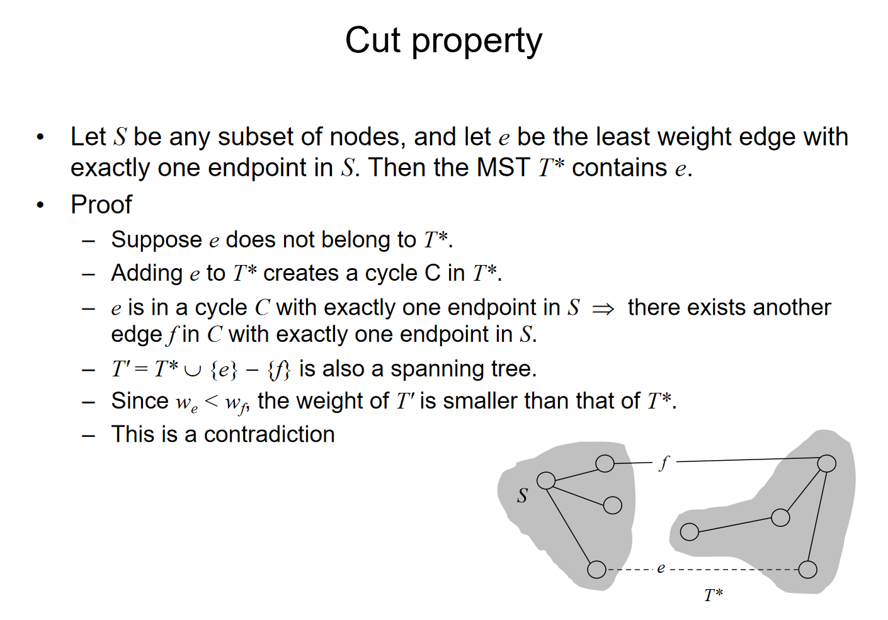
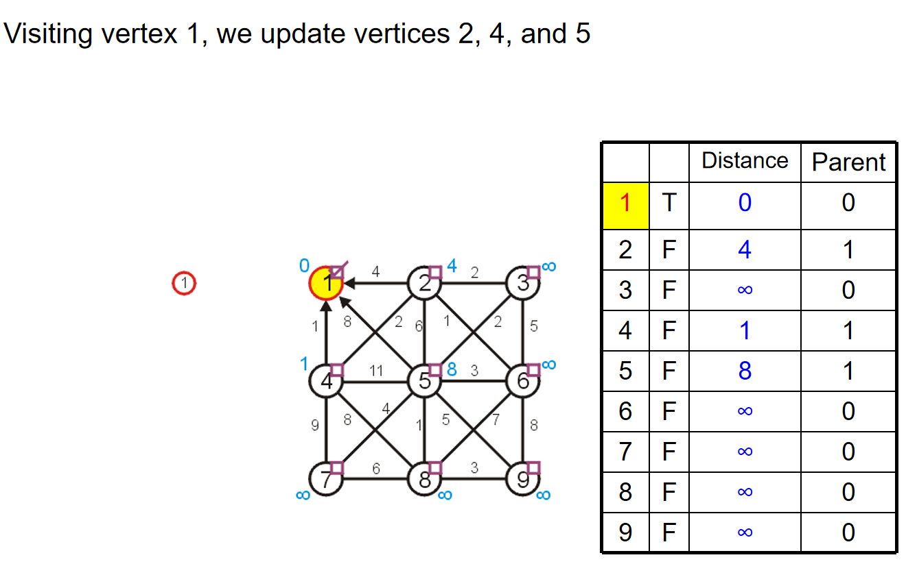
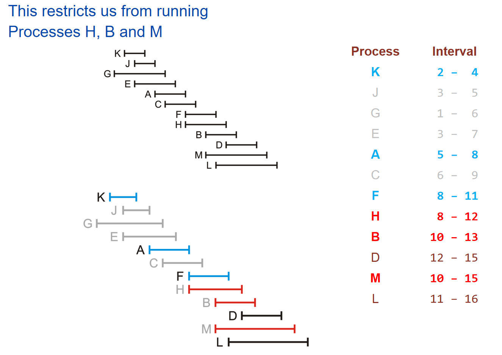
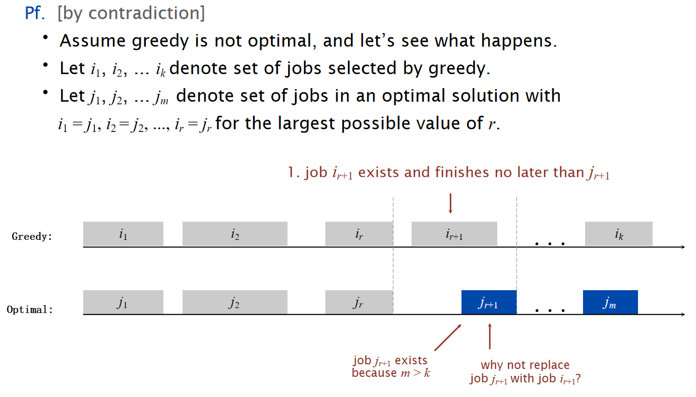
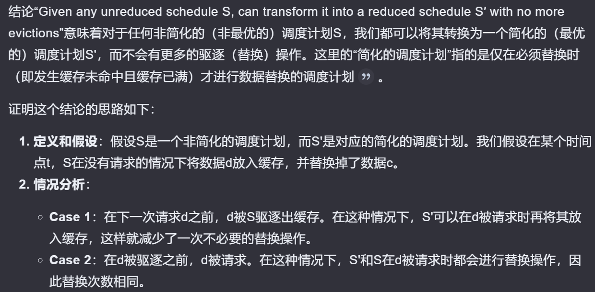
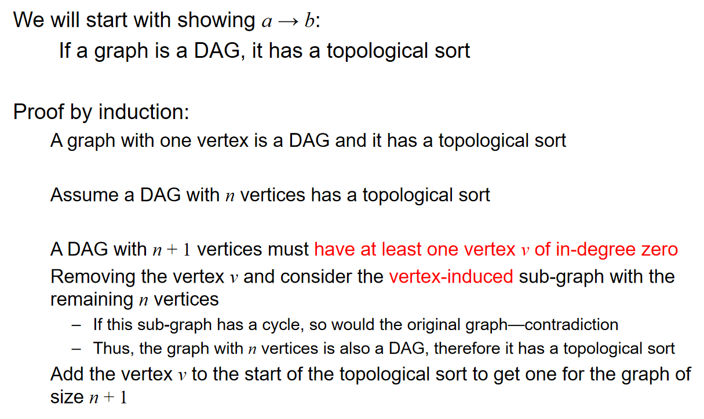
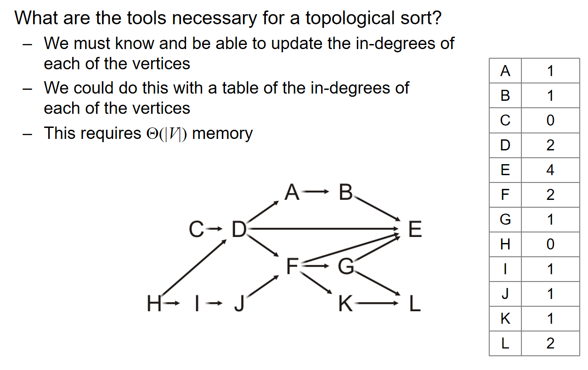
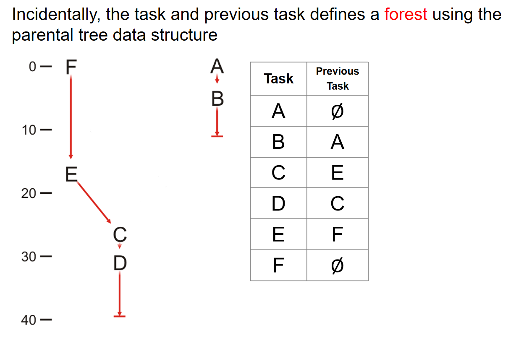

# 算法 Algorithm

## 最小生成树 

### Spanning trees

什么是spanning trees最小生成树？ 首先，生成树的定义如下：

***Given a connected graph with n vertices, a spanning tree is defined as a subgraph that is a tree and includes all the n vertices***

> 生成树有n-1个边，并且一个图的生成树并不是唯一的

由上述定义可知：生成树是原来图中的一个子图，并且包含了所有的顶点，而且边的数量正好是顶点数量-1 。下面是一个生成树的例子：原来的图中共有16个顶点，然后红线连接成的生成树里面有15个顶点：


下图又展示了：一个图的生成树并不唯一！可能有多种生成树，都满足定义的要求；同时也展示了为什么这个子图的称呼可以是“树”：



同时，生成树的定义支持权重的概念（weight）：一个生成树的权重是所有生成树上的变成的权重总和。因此引入了权重的概念之后，我们发现：生成树可以有很多种，但是其中最特殊的便是权重最小的生成树。因此，我们引申出了最小生成树的概念：拥有着最小权重的生成树。

> 另外，生成树的概念存在于连通图中，那么如果不是连通图，而是一个个连通分量组成的呢？可想而知，每一个单独的连通分量都能生成自己的生成树，那么一个个生成树在一起就是spanning forest:
>
> Suppose that a graph is composed of N connected vertex-induced sub-graphs. In this case, we may define a spanning forest as a collection of N spanning trees, one for each connected vertex-induced sub-graph.
>
> A minimum spanning forest is therefore a collection of N minimum spanning trees, one for each connected vertex-induced sub-graph

那么在unweighted graph中也有最小生成树的概念，只不过是在无权重的图中，我们认为每一条边长的权重都是1,。那么在unweighted graph里面，因此可想而知：所有的生成树其实都是最小生成树，而最小生成树们的权重都是$|V|-1$。

$Theorem:$ ***在weighted graph中，如果每一条边长的权重都是不一样的，那么这能够保证这个weighted connected图一定有一个唯一的最小生成树。***

那么接下来将介绍两种寻找最小生成树的算法。在不特别说明的情况下，默认有权连通图的每一条边长权重都是不一样的，从而确保最终只有一个最小生成树。

### Prim's Algorithm

#### Strategy

思想：假如说我们对于这个图的一部分顶点k<n，已经知道了一个最小生成树，那么我们如何让这个k个顶点的最小生成树进行扩张呢？我们的策略是：对于每一个可能得顶点$V_{k+1}$来说，我们可以遍历这个顶点到k个点的所有可能存在的边长的权重，然后找到权重最小的边，在这些对一个可能新顶点的最小权重边中再找到拥有最小权重值的顶点，然后进行连接。***当然，这个流程也可以换个方式：对于最小生成树里面的所有的顶点，列出所有的和非最小生成树顶点连接的边的权重，然后找到最小值，并且连接这两个顶点。***这样我们就拥有了这k+1个顶点的最小生成树了。这个扩张思路有一个专门的属于叫做cut property，来说明这种扩张策略的合理性：



> 直觉上来说，如果这种性质是错的话，那么这个顶点只能通过其他的方式和这k个顶点的最小生成树进行连接，那么对于另外一条线路来说，一定有一个另外的顶点和这个最小的生成树进行连接，而这条边长的权重就至少那个$V_{k+1}$的对应的边长的权重高，这就是矛盾点

那么在之前的流程中都是默认知道了k个顶点的最小生成树，那么这个k从1遍历到n不就找到了最小生成树吗？对于k=1的情况，认为一个顶点的最小生成树就是一个顶点本身。因此我们得到了**Prim's algorithm**:


有更多的细节值得探讨：

- 对于每一个顶点来说，在结构体里面可以设置一个Boolean Flag，来记录这个订单是否已经被访问，i.e.，是否以及在k个顶点的最小生成树里面了
- 记录每一个顶点到最小生成树任意一个节点的最小的distance
- 同时要记录父节点的指针

下面将通过例子来生动地演示prim algorithm并且将展示更多的实现细节：


关于空初始化，随便选择一个顶点，然后标记这个顶点的距离为0（合理，因为自己到自己的距离当然是0），同时其他的所有顶点到这个顶点的距离都是无穷（合理，因为其他的顶点都还没有编入到最小生成树里面），设置所有的顶点都是unvisted状态1，然后所有的顶点的父节点指针都置为空指针。当所有的距离小于正无穷的顶点都是visited的时候，算法结束。所以，第一步初始化的结果如下：


那么第一步，遍历最小生成树里面所有顶点到非最小生成树顶点的距离，找到最小值和其对应的另外一个顶点：这里是4，权重最小是1，因此1 4进行连接。***同时，对于2 5这两个顶点来说，我们依然记录这两个顶点到1的距离，并且将父节点设置为1节点的指针。***这是算法上的习惯罢了，不妨碍我们流程的核心：记录最小生成树里面的顶点更新：1和4. 因此在这一步结束之后，我们更新了2 4 5节点的信息，但是还没更新最小生成树，只是把根节点置入——4的置入在下一步中进行。

> 每一步访问一个节点，然后在下一步这个节点放进最小生成树，同时访问一个新的满足要求的节点；只有放进最小生成树的时候，Boolean Flag才置为True



第二步，遍历1 4节点和其他非最小生成树里面的节点的边长的权重，然后更新2 5 7 8四个节点的数据。当然，从数据上来看，5节点的信息不更新。更新完成之后，把4这个节点放进最小生成树里面。同时根据剩下的2 5 7 8四个节点的distance，我们知道下一步将访问2号节点。


第三步，访问2号节点，然后更新3 5 6 7 8节点的信息，当然从数据的角度上来看，3 5 6节点的数据进行了更新。更新之后，把2号节点放进最小生成树里面。并且我们知道即将访问6号节点。


不断重复操作，最后我们将会得到如下的结果：


> 总而言之：
>
> - we begin with a vertex which represents the root
> - starting with this trivial tree and iteration, we find the shortest edge which we can add to this already existing tree to expand it

#### Implementation and Analysis


### Kruskal's Algorithm


核心思想是：将所有的边长按照权重进行排序，然后按照权重最小到最大的顺序遍历所有的边。对于遍历的边来说，***如果添加之后子图没有成环***，那么就把这条边加进最小生成树里面。不断这样加边，直到有$|V|-1$条边被加入，这样我们就有了一个最小生成树。例子如下：


在具体的实践中，我们用数组储存边长和它们对应的权重，然后通过任一排序算法进行sorting。但是最最关键的在于：如何判断一条边的加入会导致环的出现？我们可以检查这条边的两个端点在先前的生成树中是否已经是连通的。那么这样的话，分析如下：


有没有更好的办法来帮助快速判断是否成环呢？***可以考虑使用并查集***。如果两个点的代表元素都是一样的话，说明这个并查集组成的树中，两个点是连通的，这两个点之间加边就会形成环。


在上面的这个例子中，在GH边的判断中，由于G H在一个并查集里面，我们就会知道GH这条边如果加上将会成环。而事实也如图所示。

这样一来，由于并查集的操作在使用了路径压缩和优先级策略后，时间复杂度近似常数，因此检查和构建最小生成树的时间复杂度都是$O(|E|)$；而dominant time就是sort这些边长了，时间复杂度是$O(|E|ln|E|) = O(|E|ln|V|)$.

### Uniqueness of MST

***Lemma: If all edge weights in a connected graph G are distinct, then G has a unique minimum spanning tree.*** 这条定理的证明如下：


上面是经典的贪心交换论证。假设有两个最小的生成树，那么将至少会有两条边，它仅存在于其中的一棵树而不会存在于另外一颗树中。那么假设对于两棵树来说，满足上述条件的边中，权重最小的分别是e e'边。此时将e并到T'树中注意到由于这里是树结构，任意两点之间加边都会形成一条环，因此在加上了e这条边之后，会包含一个环。这个环除了e'还有至少另外一条边e''，而这条边大于等于e'。那么构建T'+e-e''的树，那么权重不大于T'，表明T'不会是最小生成树，形成了矛盾。

这种***贪心思想和贪心论证方式***如下图所示：非常的重要！


### Painpoint

1. Using **Cayley's formula**, the number of spanning trees for a complete graph $K_n$ is $n^{n-2}$

2. Kruskal and Prim都能够处理multi-edge的情况

3. After Kruskal's algorithm, we choose $m$ edges, then the number of connected components of $G$ is $|V|-m$.

4. Kirchhoff's Matrix-Tree Theorem: Algorithm Workflow

   **Input:**A graph \( G = (V, E) \) with \( |V| = n \) vertices and \( |E| \) edges.

**Steps:**

a.**Construct Matrices:**

- **Degree Matrix (\( D \)):**
  A diagonal matrix where \( $D[i][i]$\) is the degree of vertex \( i \).
- **Adjacency Matrix (\( A \)):**
  A matrix where \( $A[i][j] = 1$\) if there is an edge between \( i \) and \( j \), and \( 0 \) otherwise.

b.**Compute the Laplacian Matrix (\( L \)):**
$$
L = D - A
$$
c.**Select a Cofactor ($( L^* )$):**

- Remove any one row and the corresponding column from \( L \).

d.**Compute the Determinant:**

- Calculate the determinant of \( $L^*$ \), which gives the number of spanning trees \( $\tau(G)$ \).

**Output:**The number of spanning trees \( $\tau(G) $\).

5. 使用二叉堆优化Prim算法并不是任何时候都是更好的方法，因为如果$|E| = \Theta(v^2)$，那么时间复杂度反而更高了。
5. ***Kruskal使用并查集优化的具体细节***：

````bash
首先对所有的点进行建堆。然后对所有的边的权重进行sort。
然后每条出来一个边，有u v两个顶点，如果：
Find-Set(u) != Find-Set(v):
那么就把这条边加进answer里面，并且Union(Find-Set(u), Find-Set(v))	
// 惨痛的教训。。。
````

7. 在undirected connected graph里面，最小的边并不一定会出现在所有的最小生成树里面，因为可能权重不是distinct；同时，undirected connected graph中权重最大的边也可能出现在MST里面，因为可能边长数量恰好就是顶点数量-1（树）。
8. 如何求出修改一个边长的允许范围，从而不改变MST呢？对于MST里面的边长来说，如果删掉，那么MST就会边长两个联通分量，两个联通分量之间的边长的最小值，就是这个边长的最大值；对于不在MST里面的边长来说，如果加上，那么MST中就会有一个环，这个环除开这条边的所有的边长的最大值，就是这个边长的最小值。

## 贪心算法

### 引子——Coin changing

假设我们要找零钱，那么如何用最少的硬币来支付零钱呢？已知硬币的面值有1 2 5 10 20 50（这里举的例子是欧元）。那么假设我们每一种硬币都有很多很多，那么直接总是加尽可能大的面值的硬币，只要最后钱的金额没有超就可以了。这种策略貌似是有用的。

但是这种策略并不是任何情况都奏效：假如说硬币的面值为1 4 9 16 25 36 49呢（平方关系）。假如说要找72块钱，那么直接两个36不就好了吗？但是按照之前的策略，$72=49+16+4+1+1+1$，而这显然不是最优解。很明显，我们的算法并没有那么的简单，这里我们需要使用到***贪心算法***：


例如Prim算法就是一个贪心算法：在策略中考虑的是已经知道k个点的最小生成树，然后尝试不断expand这棵树。同样在找零钱的例子中也是用了贪心算法：在欧元的例子中，任何一个k个硬币的子集都是一种partial solution，在我们拥有一个partial solutionzhihou1，我们尝试将一个最大化零钱面额增长且不超过总金额的硬币加入到子集中。这种算法在欧元的情况能够奏效，但是在quadratic面额的硬币中却不奏效。

下面将举一些贪心算法最优的例子：

### Interval scheduling

考虑如下图所示的任务：


对于这种任务，我们设计：EARLIEST-FINISH-TIME-FIRST算法：将所有的工作按照***结束时间***早晚来进行排序。然后对于这样的一个sorted order，挑出一个元素，然后剔除掉这个order下之后***所有的***和这个元素的时间段有重合的元素；重复这样的操作一直到没有元素可以操作位置，然后挑出来是多少个那么就是工作子集的最大数量。示意图如下：



这个算法貌似还是很简单的，但是非常奇怪的问题在于：为什么这种算法就是最优的？




> Reference: kimi.moonshot.cn

### Interval Partitioning

考虑下面所示的任务：


对于这种任务，我们设计：EARLIEST-START-TIME-FIRST算法：


如下面是流程进行到一半的实例：


$Proposition:$The earliest-start-time-first algorithm can be implemented in  O(n log n) time.


同时，我们定义open interval的深度，而且能观察到：需要的教室数量至少为深度：


因此有$Theorem:$ Earliest-start-time-first algorithm is optimal.


### Scheduling to minimize lateness

考虑下图所示的任务：


我们希望安排任务，从而导致超过预期due time的时间尽可能的小。那么对于这个任务，我们可以设计EARLIEST-DEADLINE-FIRST算法：


关于这个有两个关键观察：

- 存在一种最好的安排，使得整个任务流程不存在闲置时间
- EARLIEST-DEADLINE-FIRST算法没有闲置时间
- The earliest-deadline-first schedule is the unique idle-free schedule with no inversions.

> Given a schedule S, an inversion is a pair of jobs i and j such that:$d_i ≤ d_j$but j is scheduled before i.

- If an idle-free schedule has an inversion, then it has an adjacent inversion.

> adjacent inversion: two inverted jobs scheduled consecutively

$Theorem:$ The earliest-deadline-first schedule S is optimal.


### Optimal Caching


> Reference: kimi.moonshot.cn


直觉上，如果是最优解，那么只有在需要将新数据储存到内存中的时候，才需要进行新数据的caching，而这样的安排我们定义为reduced schedule。

$Theorem:$ Given any unreduced schedule S, can transform it into a reduced schedule S′ with no more evictions.



$Theorem: $ Farthest in Future algorithm is optimal eviction algorithm.

## Topological Sort

### Definition

考虑一种实际情况的任务场景：不同的task之间存在的dependency relationship，即对于一个任务来说，必须要先完成另外一个任务，才能进而完成这个任务。这种依赖关系可以形成一个部分的排序：A partial ordering on a finite number of objects can be represented as a directed acyclic graph (DAG)

同时，dependency中的环也可能造成问题，比如说完成一个任务的前提任务就是这个任务本身，那么这种关系其实就是不可取的。

Topological sorting 定义如下：


对于任意两个连通的点，那么topological order中的相关子序列，会呈现和path中一样的dependency关系顺序。简化一下就是：如果两个点之间是连通的，那么这两个点在topological order中谁在前，谁就是被依赖的，也就是上图中的定义。下面是一个例子：


> 重要！Topological sorting的结果并不是唯一的！

$Theorem:$ *A graph is a DAG if and only if it has a topological sorting*

> 这一点直觉上很容易认同，given that：如果一个有向图有topo sorting，但是里面有环，那么将会产生自己依赖于自己的问题，而这种关系是不可取的
>
> 但是实际的证明比较复杂：
>
> *lemma1: A DAG always has at least one vertex with in-degree zero (source)*
>
> *lemma2: Any sub-graph of a DAG is a DAG*
>
> 然后利用两个引理1，按照if and only if的证明逻辑去进行证明




### Algorithm

算法的idea非常的简单：找到图中的任意一个in-degree为0的节点（source），然后放入topological sorting里面，然后删除掉这个点和与这个点相关的所有的边。这个步骤重复$|V|$次。

> 从上面的算法就能看出来：topo sorting的顺序当然不是唯一的，因为source可能不止一个

idea is cheap，那么implementation中仍然有许多的细节：为了支持上述的算法，我们应该存储什么信息？以什么方式存储？如何更新信息？这些都是问题：



同时，为了找到当前图中哪一个点是source，每一次sort的时候，都要遍历存储了入度的列表来发现谁可以是source，那么这样的话时间复杂的将会是$O(|V|^2)$级别。当然有更好的实现方式：用一个队列来暂时储存那些source点，然后每一次有点的入度降为0那么就将它Push进队列里面。那么关于队列的时间复杂度：最开始遍历入度列表，需要$\Theta(|V|)$；然后对于图中的每一个顶点来说，它们都会被push进队列一次，且被pop off一次，因此所有点的Push pop需要$\Theta(|V|)$。

最后，关于全部的‘删除顶点及其对应边，从而更新入度信息的时间复杂度’还未进行分析：


最后综合一下：Topological sort的算法复杂度为：

> $\Theta(|V|+|E|)$ if we use an adjacency list
> $\Theta(|V|^2)$ if we use an adjacency matrix
> Memory requirement: $\Theta(|V|)$

> 可以看出：如果是稠密图，那么使用adjacency matrix or list都是无所谓；但是如果是稀疏图，那么就是adjacency list更好。

同时值得注意的是：如果在算法运行的过程中，发现所有剩余的顶点，它们的入度都不是0，那么就说明一定有环的出现，就可以停止topo sorting了。换而言之，***我们拥有一个$\Theta(|V|+|E|)$的算法来判断图里面是否有环！***

总而言之，implementation如下：


> 更好的是：如果使用的是数组实现的queue而非STL中的队列，那么最后这个数组储存的就是topological sorting的顺序！

## Finding the critical path

考虑一种实际的情景：假如说每一个任务的完成都需要对应的时间呢？如果同一时间段只能干一个任务，毫无疑问，最后的总用时就是所有任务的要求时间总和，而实现任务的顺序是任意的一个topological order。但是如果我们能够同时做多个任务呢？（注意依赖性）首先我们定义：

*The critical time of each task is the earliest time that it could be completed after the start of execution*
*The critical path is the sequence of tasks determining the minimum time needed to complete the project*

> If a task on the critical path is delayed, the entire project will be delayed

具体如何找到critical path从而求出完成所有任务的最小时间要求如下图：


逻辑顺序：弹出一个顶点之后，首先更新顶点自己的critical time += task time；然后对于这个顶点的所有的邻居来说，Previous Task指针更新为这个顶点，然后更新入度，最后更新critical time = max{critical time, 顶点的critical time}，并且如果有入度为0的就Push进队列。

最后根据表格中的task and previous task信息，我们能够创建一个森林来表示平行作业的顺序：

