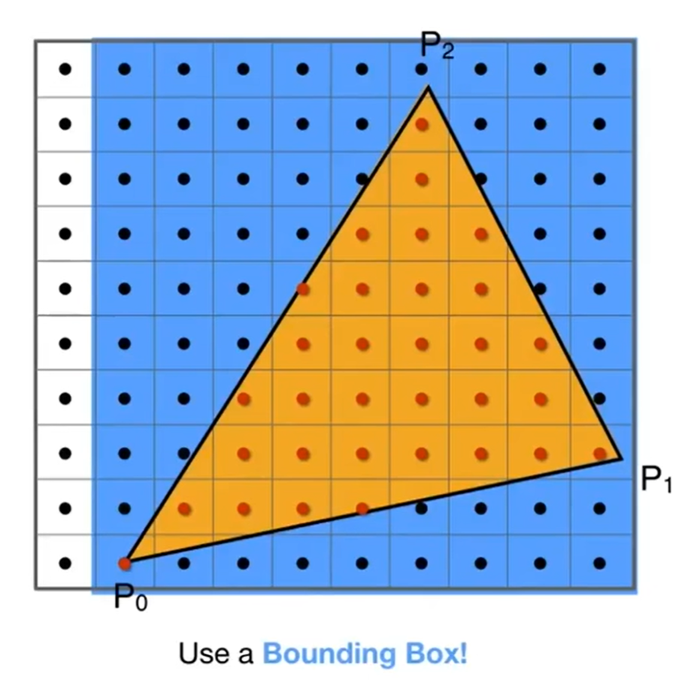
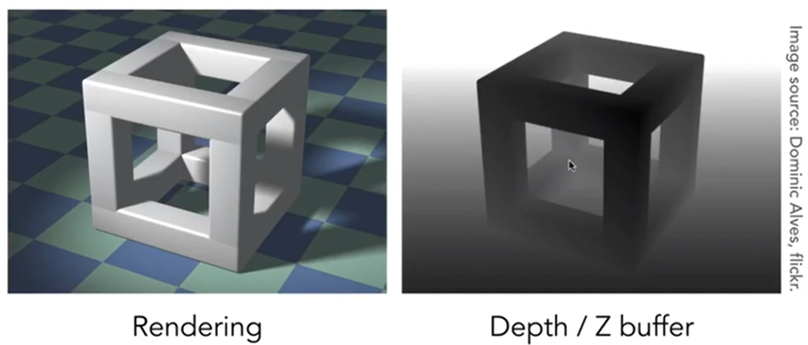
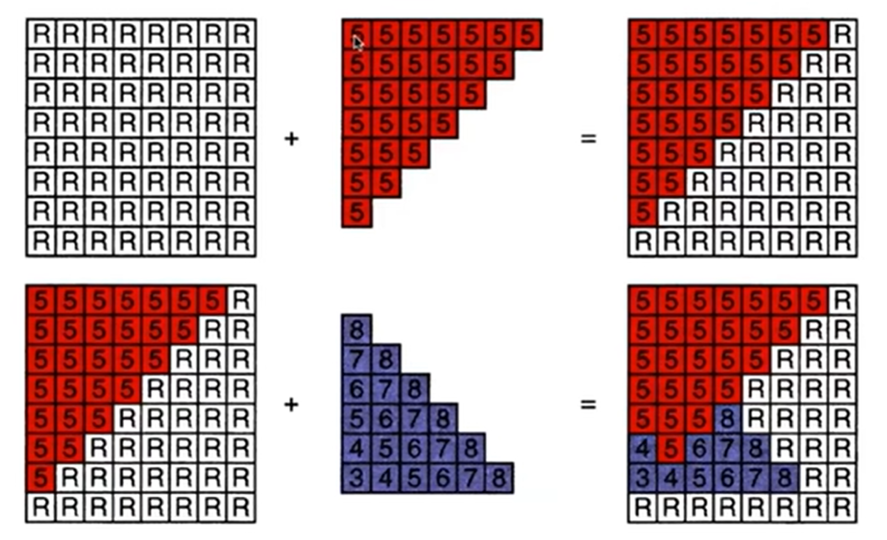

# GAMES101 Note

## Overview of Computer Graphics

Computer Graphic，简称CG，它的定义是：The use of computers to synthesize and manipulate visual information。“合成与操纵”。

现在很多游戏都利用CG技术，那么如何评价画面的好坏呢？一种简单的断言：看画面够不够亮。因为这涉及到CG的全局光照概念，因此将光照是否充足作为评价标准是可以的。

以及，不同的游戏可能有不同的画质，例如有的是卡通画质，有的是更贴切显示的画质，那么如何实现不同的画质呢？这些也都需要计算机图形学来解决。除开游戏，电影里面也广泛应用CG，如特效（special effect)，人物面部捕捉（阿凡达）等。除了电影游戏，很多其他领域也应用CG，例如Computer-Aided Design（如数字孪生 photo->CG），动画（animation），可视化（Visualization for Science, engineering, medicine, and journalism, etc)，虚拟现实（Virtual Reality）等。

图形学具体包含了哪些内容呢？

- Math of (perspective) projections, curves, surfaces
- Physics of lighting and shading
- Representing / operating shapes in 3D 
- Animation / simulation

课程主要包括四个方面内容：

- Rasterization （光栅化）
- Curves and Meshes （曲线和曲面）
- Ray Tracing （光线追踪）
- Animation / Simulation （动画与模拟）

什么是光栅化？把空间中的三维形体投射到屏幕上，就是光栅化：Project geometry primitives (3D triangles / polygons) onto the screen。这是**实时**计算机图形学的应用。CG中定义到：一秒钟能生成30张画面（30 frames per second）就认为是实时，否则就是**离线**（off-line）。

而在曲线和曲面中，将了解如何在计算机视觉中表示几何：How to present geometry in Computer Graphics。例如空间中如何表示较为光滑的曲面？如何用简单的面片去细粒度地拟合较为光滑的曲面？当物体改变时，曲面应该如何改变？物体改变时，如何保持原有的拓扑结构？

光线追踪被电影广泛使用，用来生成更高质量的画面。CG中也有一种trade-off: 生成速度快 or 生成质量高？那么光线追踪就是选择了质量高，但是生成时间很长。那么有没有两全其美的方法呢？最近有“实时光线追踪”技术。

动画与模拟努力将画面中物体的移动、变化等尽可能地贴切现实生活。例如rubber ball的弹跳，悬挂毛巾的下垂等等。

GAMES101不提到的：

- Using OpenGL / DirectX / Vulkan
- The syntax of Shaders
- We learn CG,  not Graphics APIs
- 3D modeling using Maya / 3DS MAX / Blender, or Unity / Unreal Engine
- CV

那么如何理解CV和CG的区别？


当然，现在两者的边界原来越模糊。自从NeRF(Neural Radiance Field，神经辐射场)的诞生，Model and Image的交融研究越来越多。

课程使用语言： C++

## Review of Linear Algebra

CG其实交叉了很多的学科：数学中涉及到线性代数，微积分和概率统计；物理学中涉及到光学和运动学；以及其它一些领域，如信号处理，数值分析，美学等。加下来将会光速回顾一些线性代数中的基础：

向量vector是基本（$\vec{a}$），它的范数（magnitude）是$\lvert\lvert\vec{a}\rvert\rvert$，而单位向量的范数自然是1。如果希望对于向量$\vec{a}$，得到对应的单位向量，直接$\hat{a} = \vec{a} / \lvert\lvert\vec{a}\rvert\rvert$即可。一般单位向量用来表示方向。向量相加满足三角形法则。

除了加减，还有点乘（dot / scalar product），得到的就是内积。点乘可以用来**快速计算**两个向量的夹角$cos\theta$，尤其是当两个向量都是方向向量的时候。同时，点乘还能帮助找到一个向量投射到另一个向量上的结果。最后，点乘结果能帮助判断向量之间夹角与直角的关系。

点乘的基本性质：交换律，结合律，等等。在笛卡尔坐标系下，点乘的计算会非常方便：
$$
\vec{a}\cdot\vec{b}
=
\begin{pmatrix}
x_a \\
y_a \\
z_a
\end{pmatrix}
\cdot
\begin{pmatrix}
x_b \\
y_b \\
z_b
\end{pmatrix}
=
x_ax_b + y_ay_b + z_az_b
\tag{3D}
$$
点乘之外，还有叉乘。两个向量叉乘（cross product）得到的结果是另一个向量，这个向量与两个向量都垂直（3D中），方向由右手定则决定。叉乘没有交换律。叉乘在建立三维空间直角坐标系中非常有用。有时候还能帮助判断两个向量谁在谁的左边/右边。
$$
\lvert\lvert\vec{a}×\vec{b}\rvert\rvert
=
\lvert\lvert\vec{a}\rvert\rvert
\lvert\lvert\vec{b}\rvert\rvert
sin\phi
$$
The Cartesian Formula of Cross Pruduct in 3D Euclidean Space:
$$
\vec{a}×\vec{b}\ 
=
\begin{pmatrix}
y_az_b - y_bz_a \\
z_ax_b - x_az_b \\
x_ay_b - y_ax_b
\end{pmatrix}
$$
那么有另一种表现形式（A为a向量的***dual matrix***）
$$
\vec{a}×\vec{b}\ = A*b = 
\begin{pmatrix}
0 & -z_a & y_a \\ 
z_a & 0 & -x_a \\ 
-y_a & x_a & 0
\end{pmatrix}
\begin{pmatrix}
x_b \\
y_b \\ 
z_b
\end{pmatrix}
$$
叉乘在CG的Rasterization光栅化中一个非常重要的应用，就是判断一个点在不在一个polygon里面，如判断是不是在三角形中。在下面这个例子中，只需要判断`AP * AB  BP * BC  CP * CA`，这三个叉乘的结果，就能知道P点在不在三角形里面，因为叉乘能帮忙判断P在AB BC CA三个向量的左边还是右边。值得注意的是，这种判断方式和三角形三条边顶点的绕向无关(AB BC CA or BA AC CB)，因为最终判断的是P点在不在三条向量的**同侧**（当然，三条向量首尾相接是需要保证的）。当然，如果点落在了边上，那么就属于corner case, 可以自己决定是否在三角形里面。


矩阵之间的乘法略。矩阵的转置有以下性质：$(AB)^T=B^TA^T$。那么点乘就可以表示为：$\vec{a}\cdot\vec{b} = \vec{a}^T\vec{b}$

## Eigen库

Eigen是一个高层次的C ++库，有效支持线性代数，矩阵和矢量运算，数值分析及其相关的算法。

关于Eigen库的安装，之前一直尝试用cMake方式把库编进MinGW里面，但是总是失败。于是最后阅读了[官方网站]([Eigen: Getting started](https://eigen.tuxfamily.org/dox/GettingStarted.html))，发现了如下的内容：
In order to use [Eigen](https://eigen.tuxfamily.org/dox/namespaceEigen.html), you just need to download and extract [Eigen](https://eigen.tuxfamily.org/dox/namespaceEigen.html)'s source code (see [the wiki](http://eigen.tuxfamily.org/index.php?title=Main_Page#Download) for download instructions). In fact, the header files in the `Eigen` subdirectory are the only files required to compile programs using [Eigen](https://eigen.tuxfamily.org/dox/namespaceEigen.html). The header files are the same for all platforms. It is not necessary to use CMake or install anything.

There is no library to link to. The only thing that you need to keep in mind when compiling the above program is that the compiler must be able to find the [Eigen](https://eigen.tuxfamily.org/dox/namespaceEigen.html) header files. The directory in which you placed [Eigen](https://eigen.tuxfamily.org/dox/namespaceEigen.html)'s source code must be in the include path. With GCC you use the `-I` option to achieve this:

`g++ -I /path/to/eigen/ my_program.cpp -o my_program `

于是命令行运行cpp文件的时候，应该终端运行上面指令，然后终端命令行运行exe文件：`./my_program.exe`

## Transformation

2D transformation：几种常见的2D图形的变换：
$$
\begin{bmatrix}
x' \\
y'
\end{bmatrix}
=
\begin{bmatrix}
s_x & 0 \\ 
0 & s_y
\end{bmatrix}
\begin{bmatrix}
x \\
y
\end{bmatrix}
\tag{Scale}
$$

$$
\begin{bmatrix}
x' \\
y'
\end{bmatrix}
=
\begin{bmatrix}
-1 & 0 \\ 
0 & 1
\end{bmatrix}
\begin{bmatrix}
x \\
y
\end{bmatrix}
\tag{Reflection}
$$

$$
\begin{bmatrix}
x' \\
y'
\end{bmatrix}
=
\begin{bmatrix}
1 & a \\ 
0 & 1
\end{bmatrix}
\begin{bmatrix}
x \\
y
\end{bmatrix}
\tag{Shear}
$$

$$
R_\theta = 
\begin{bmatrix}
cos\theta & -sin\theta \\
sin\theta & con\theta
\end{bmatrix}
\tag{rotation*}
$$

$$
\begin{bmatrix}
x' \\
y'
\end{bmatrix}
=
\begin{bmatrix}
a & b \\ 
c & d
\end{bmatrix}
\begin{bmatrix}
x \\
y
\end{bmatrix}
\tag{Linear Transform}
$$

$$
\begin{bmatrix}
x' \\
y'
\end{bmatrix}
=
\begin{bmatrix}
1 & a \\ 
0 & 1
\end{bmatrix}
\begin{bmatrix}
x \\
y
\end{bmatrix}
\tag{Shear}
$$

rotation在2D中都是默认绕远点逆时针旋转的。而且旋转矩阵有着特殊性质(如下)，逆与转置相同的矩阵就成为***正交矩阵***。
$$
R_{-\theta} = 
\begin{pmatrix}
cos\theta & sin\theta \\
-sin\theta & cos\theta
\end{pmatrix}
= R^T_\theta
\\
i.e. \hspace{1cm} 
R_\theta
R^T_\theta = I
$$


那么注意到，上面这些情况没有涉及到平移，因为其它的变换都是线性变换，但是唯独平移不是。因此为了解决这个问题，采用了Homogenous Coordinates Solution（for more information on this, please refer to [My Linear Algebra Course Reseach On Affine Transformation ](https://github.com/bearthesilly/csrookie/blob/main/Linear Algebra/linear_project.pdf)。

- 

$$
\begin{bmatrix}
x' \\
y' \\
z'
\end{bmatrix}
=
\begin{bmatrix}
1 & 0 & t_x \\
0 & 1 & t_y \\
0 & 0 & 1
\end{bmatrix}
\cdot
\begin{bmatrix}
x \\
y \\
1
\end{bmatrix}
=
\begin{bmatrix}
x+t_x \\
y+y_t \\
1
\end{bmatrix}
\tag{Tran}
$$

***Homogeneous Coordinates(齐次坐标)***中，将2D point表示为$(x,y,1)^T$，而将2D vector表示为$(x,y,0)^T$，这很妙的是满足了：

向量相加仍为向量（第三维度是0），点坐标相减为向量（第三维度上1-1 = 0），点加上向量仍为点（第三维度是1+0 = 1）。这也解答了一个问题：点坐标相加是什么呢？ 首先我们需要扩充一下定义：
$$
\begin{pmatrix}
x \\
y \\
w
\end{pmatrix}
is\ the\ 2D\ point\ 
\begin{pmatrix}
x/w \\
y/w
\end{pmatrix},
w ≠ 0
$$
之后，就能轻松知道点相加代表什么了：两点的中点。

以上就是仿射变换（affine transformation），表达式如下：
$$
\begin{bmatrix}
x' \\
y' \\
z'
\end{bmatrix}
=
\begin{bmatrix}
a & b & t_x \\
c & d & t_y \\
0 & 0 & 1
\end{bmatrix}
\cdot
\begin{bmatrix}
x \\
y \\
1
\end{bmatrix}
$$
$Affine\ map = linear\ map + translation$，实质是先线性变换，再进行平移

那么2D transformation重新用矩阵表示：
$$
S(s_x,s_y) = 
\begin{pmatrix}
s_x & 0 & 0 \\
0 & s_y & 0 \\
0 & 0 & 1
\end{pmatrix}
\hspace{2cm}
(Scale)
\\
R(\theta) = 
\begin{pmatrix}
cos\theta & -sin\theta  & 0\\
sin\theta & con\theta & 0 \\
0 & 0 & 1
\end{pmatrix}
\hspace{2cm}
(Rotation)
\\
T(t_x, t_y) = 
\begin{pmatrix}
1 & 0 & t_x \\
0 & 1 & t_y \\
0 & 0 & 1
\end{pmatrix}
\hspace{2.5cm}
(Translation)
\\
$$
在多步骤变换中，交换律是不满足的！例如：先旋转后平移和先平移后旋转的结果是不一样的。一系列的仿射变换矩阵最后不断作用在$(x,y,1)^T$上面，那么最后就能看成是一个矩阵作用在这个点上面。

同时有了Homogenous Coordinates的帮助，我们能够轻松的分解复杂的变换。例如2D点绕着某一特定点进行旋转，就可以把两个点同时进行平移，使得被绕的点移动到远点，然后乘上旋转矩阵，最后平移回去：
$$
T(c)
\cdot
R(\alpha)
\cdot
T(-c)
$$
3D Transformation如法炮制。3D point $(x,y,z,1)^T$，3D vector $(x,y,z,0)^T$，并且扩充定义有： 
$$
In\ general,(x,y,z,w)(w≠0)\ is\ the\ 3D\ point:\\
(x/w,y/w,z/w)
$$

## Transformation Cont.

Transformation分为：View(视图)和Projection(投影)。其中，Projection transformation又分为Orthographic(正交投影)和Perspective(透视投影) projection。

### 3D Transformation

3D Transformation的矩阵表达如下：


借助三个旋转矩阵，我们可以表示任何一种3D-Rotation：
$$
R_{xyz}(\alpha,\beta,\gamma)
=
R_x(\alpha)R_y(\beta)R_z(\gamma)
\hspace{1cm} 
\alpha,\beta,\gamma
\ \ 
are\ Eular\ angles
$$
那么如何表示绕着旋转轴向量n（默认向量是从远点出发的）旋转α角的旋转矩阵呢？ 这就是**罗德里格斯公式（Rodrigues' Rotation Formula）**
$$
R(n,\alpha) = cos(\alpha)\textbf{I} +
(1-cos(\alpha))nn^T + 
sin(\alpha)
\begin{pmatrix}
0 & -n_z & n_y \\
n_z & 0 & -n_x \\
-n_y & n_x & 0
\end{pmatrix}
$$
其中的矩阵非常眼熟，是n向量的dual matrix. 另外，旋转矩阵不是四元数，四元数是为了解决旋转矩阵插值问题而提出的。2D中一个旋转15度的旋转矩阵和一个旋转25度的相加并除2，得到的矩阵并不是旋转20度的。四元数就是解决这个问题的。

### View / Camera Transformation

现实中我们是如何拍照的呢？首先东西都摆好，然后拿出相机，找到好的角度，最后摁下快门。那么“找到好的角度”就是在进行view transformation，“摁下快门”就是在进行projection transformation。

如何perform view transformation？首先我们要定义一下相机：

- Position   $\vec{e}$
- Gaze direction  $\hat{g}$
- Up direction  $\hat{t}$    (assuming perpendicular(正交) to $\hat{g}$)

所以说，定下相机位置，然后镜头朝向目标，最后旋转相机（改变相机up direction）就可以定义相机的取经行为了。那么现实中，相机和物体都可以移动，那么根据相对运动**约定俗成**：We always transform the camera to:

- The origin, up at Y axis, look at -Z axis.
- And transform the objects along with the camera.

 那么如何transform呢？首先相机在$\vec{e}$位置，那么就进行平移。移动到原点之后，旋转$\hat{g}$到-Z轴，$\hat{t}$到Y轴，（g×t）到X轴。


“旋转$\hat{g}$到-Z轴，$\hat{t}$到Y轴，（g×t）到X轴”绝非简单的事情，矩阵计算会很麻烦。但是我们很容易实现的是：Y轴单位向量转到t，-Z轴单位向量转到g，这样通过求逆就能知道原来需要的$R_{view}$是什么了(这个矩阵很容易用$(1,0,0,0)^T\ (0,1,0,0)^T\ (0,0,-1,0)^T\ $和它相乘进行验证)：
$$
R^{-1}_{view} = 
\begin{bmatrix}
x_{g×t} & x_t & x_{-g} & 0 \\
y_{g×t} & y_t & y_{-g} & 0 \\
z_{g×t} & z_t & z_{-g} & 0 \\
0 & 0 & 0 & 1
\end{bmatrix}
\\
R_{view} = 
\begin{bmatrix}
x_{g×t} & y_{g×t} & z_{g×t} & 0 \\
x_t & y_t & z_t & 0 \\
x_{-g} & y_{-g} & z_{-g} & 0 \\
0 & 0 & 0 & 1
\end{bmatrix}
$$

### Projection Transformation

Orthographic and Prespective Projection的区别是什么呢？ 如下图(左为正交，右为透视)，同样是立方体，左边的平行线依然平行，但是右边不是。事实上，人眼更类似右边的透视投影；换而言之，透视有**近大远小**的效应；或者说，正交投影是透视投影摄像头放的无限远的情况：


下图更能直观地体现两者的区别： 


Orthographic Projection是较容易实现的，相机固定在原点，面向-Z轴，头指向Y轴，然后对物体进行***“Drop Z Coordinate”***，最后**约定俗成地**“Translate and scale the resulting rectangle to $[-1,1]^2$”。


但是在实际操作的过程中，是将$[l,r]×[b,t]×[f,n]$的立方区域（cuboid）映射到$[-1,1]^3$的canonical(正则)立方体。然后这个区域再Drop Z Coordinate。前面这一步映射的矩阵如下： 


在右手系下，面朝-Z轴让进远概念混淆（-1 > -2, 但是-1点距离摄像机近）。因此一些情况下会使用左手系（如OpenGL, a Graphics API）。那么经过了平行变换之后，理应上来说，正则立方体里面的物体都有所拉伸。是这样的，因为之后还会有“视口拉伸”对物体再次进行拉伸。

Perspective Projection是较为复杂的，但是确实应用最广的。回顾一下其次坐标中的定义：
$$
In\ general,(x,y,z,w)(w≠0)\ is\ the\ 3D\ point:\\
(x/w,y/w,z/w)
$$
因此，（1,0,0,1）和（2,0,0,2）都表示（1,0,0）。那么如何实现透视投影如何实现呢？我们可以把这个过程拆成两步：***Frustum（视锥） -> Cuboid***(一个矩阵)；正交投影。示意图如下（左立体图形为Frustum，右立体为Cuboid）


那么“挤压”（squish）矩阵怎么求？见下图：由于先有translation，摄像机已经位于原位了，因此Frustum是一个标准的“台型立方体”。那么剖析一条光线，就会发现可以利用相似三角形去求出新的x and y（我们规定，squish之后，near far两个平面的z都是不变的）


那么其实这个矩阵很多信息已经呼之欲出了：
$$
M^{4×4}_{persp\rightarrow{ortho}}
\begin{pmatrix}
x \\ y \\ z \\ 1
\end{pmatrix}
=
\begin{pmatrix}
nx \\ ny \\ unknown \\ z
\end{pmatrix}
\\
M_{persp\rightarrow{ortho}} = 
\begin{pmatrix}
n & 0 & 0 & 0 \\
0 & n & 0 & 0 \\
? & ? & ? & ? \\
0 & 0 & 1 & 0 
\end{pmatrix}
$$
我们又知道（其实是人为规定的），至少，nera平面上的z值和far平面上的z值在经过了矩阵变换之后不会变化。那么第三行至少是：(0,0,A,B)。则对于n平面上的（x,y,n,1）和f平面上的（x,y,f,1）有：
$$
nA + B = n^2\hspace{2cm} (1) \\
fA + B = f^2\hspace{2cm} (2)
$$
这样$A = n +f;B = -nf$，我们的$M_{persp\rightarrow{ortho}}$就完全算出来了。最后就有：
$$
M_{persp} = M_{ortho}M_{persp\rightarrow{ortho}}
$$
好的，投影矩阵终于求出来了。但是有一个问题：我们规定了near and far平面距离XOY平面的距离不变，那么这个Frustum经过了Squishing之后，中间的点的z值是变大了还是变小了呢？假设点为$(x,y,t,1)$其中$n<t<f$，那么经过了矩阵相乘之后：$\hat{z} = ((n+f)z - nf)/z$，而它要和z进行比较：
$$
(n+f)z - nf)\ \ ?\ \ z^2 \hspace{2cm}(1) \\
0\ \ ?\ \ z^2-(n+f)z+nf \hspace{2cm}(2) \\
0\ \ ?\ \ (z-n)(z-f) \hspace{2cm}(3) \\
因为\ n<t<f,所以符号是大于号
$$
所以说，事实上经过了squish之后，虽然说near far两个平面的z值是不改变的，但是**中间的点的z值是会变大的**，i.e.，**更靠近far平面**。

## Rasterization

### Triangles

定义：Aspect ratio = width / height(宽高比)、vertical field-of-view(fovY)(垂直可视角)。这样一来，就能规范地用宽高比和垂直可视角来定义我们取出来的Frustum了，示意图如下： 


pre-difine一些概念之后：MVP之后干什么（MVP：model, view, project）？自然需要想：如何把正则立方体转到屏幕上。那么什么事屏幕screen呢？ 屏幕其实是一堆像素，像素矩阵的大小就称为分辨率。当前阶段，对于一个pixel，我们认为是一个小正方形，而且颜色不会变化（For now: A pixel is a little square with uniform color）。Raster是德语中Screen的意思，那么光栅化其实就是希望把canonical cube转化为screen。光栅化这个名字其实也很信达雅：把光 ray 划分为一个一个小栅（小格子）。

如何定义screen space？约定俗成：起点为原点，然后像素的引索是(x, y)形式，而且x y都是正整数。那么，"***Pixel's indices are from (0, 0) to (width-1, height-1)***"。但是注意：像素的中心点其实并不是引索！


 那么相当于希望使用一个矩阵，实现：$[-1,1]^2\rightarrow[0,width]×[0,height]$, 且跟z轴无关。这个矩阵其实不难发现：
$$
M_{viewport} = 
\begin{pmatrix}
width/2 & 0 & 0 & width/2 \\
0 & height/2 & 0 & height/2 \\
0 & 0 & 1 & 0 \\
0 & 0 & 0 & 1
\end{pmatrix}
$$
这就是***视口拉伸（viewport）***。经过了这一步之后，终于图像呈现到了像素区域内了。那么究竟如何把这***2D Polygon***转化为像素呢？换而言之，用一个一个的小格子（栅）进行划分呢？关于多边形，我们可以先讨论：Triangle Meshes应该如何操作？

那么为什么会先讨论Triangle Mesh呢？原因有很多：

1. 三角形是多边形的基础。多边形可以拆分为多个三角形
2. 三角形的三个点一定在一个面上（planar）
3. 三角形内外定义十分清晰（well-defined interior）
4. 对于三角形内部的点，很容易用三点坐标进行差值（interpolation）表示，例如重心的差值（barycentric interpolation）


分析了优势之后，如何用pixel去逼近triangle呢？如何实现这样的一个algorithm，做到：**Use the input of the position of triangle vertices projected on screen to output the set of pixel values approximating traingle**。(示意图如下)


之前提到叉乘妙用的时候有过按暗示：点是否在三角形内部是一个很好的判断标准。因此，我们可以尝试**采样**(sampling)所有的像素格子中心点，判断中心点在不在trangle的内部。


那么相当于是希望设计一个`inside(tri, x+0.5, y+0,5);`函数，从而判断引索为x y的像素的中心点是否在三角形内部（为什么是+0.5？因为viewport已经将canonical cube map到了pixel resolution matrix，所以0.5这个数字是正确的）。那么利用三个cross product就能帮助判断点是否在三角形里面。那么对于点在三角形上的corner case，我们可以自行规定，只需要**严格遵守**就行了；当然不同的API的规则也是不一样的。

那么对于一个三角形来说，我有必要扫过全部的像素来进行光栅化吗？一个三角形单元实际上是不大的，因此如果程序上遍历x y计算开销会起飞。所以说我们可以使用一个Bounding Box! (专业名字叫做Axis Aligned Bounding Box, AABB)。而有的时候，三角形实际上覆盖面积非常小，但是AABB会显示都非常大，这是什么情况呢？那就是三角形非常苗条，而且有旋转。那么对于这种三角形的光栅化，也可以采用Incremental Triangle Traversal Strategy。




最后，我们判断了所有的点是否在三角形内部，然后根据这个信息填充对应的像素。但是我们可以看到一种很糟糕的现象：锯齿效应（Aliasing / Jaggies）。没错：抗锯齿（Antialiasing）是后续一个非常重要的工作。


### Antialiasing and Z-Buffering

如何抗锯齿（也称为反走样）呢？采样能不能改进一下呢？因此需要了解一下Sampling ***Artifacts(瑕疵)***(Errors/Mistakes/Inaccuracies) in Computer Graphics。采样带来的误差有很多例子，如摩尔纹，锯齿效应，Wagon wheel effect等等，它们的采样artifact分别是：sampling in space; undersampling images; sampling in time。但是在这些artifacts背后，有一句话可以描述现象产生的原因：***Signals are changing too fast (high frequency), but sampled too slowly***。 

那么Antialiasing的core idea是什么呢？这里直接摆出结论：Blurring (Pre-Filtering) Before Sampling。


边缘高频的信息在模糊化（滤波）后可以降频，因此在较为低频的像素中心点采样下能够有更好的效果（感性理解）。Note antialiased edges in rasterized triangle where pixel values take intermediate values。同时：**先采样后模糊的方法效果并不好**！ 想要抗锯齿，**必须先模糊后采样**！

此时心中一定有两个问题： 为什么undersampling会造成锯齿效应？以及，为什么先滤波（先模糊）（pre-filtering）再采样可以抗锯齿？那么我们需要频率方面的知识。 

$cos2\pi fx$函数中，$f = 1/T$，代表了频率。f越大，图像振动频率越高，周期越小。根据傅里叶变换，Fourier Transform，任何一个周期函数我都能写成正弦函数和余弦函数的和：Represent a function as a weighted sum of sines and cosines。Essentially, 傅里叶变换就是时域->频域。


而更高频率的函数需要更快的采样策略(Higher Ferequencies Need Faster Sampling)(如下图)。


同时，undersampling也会造成Frequenciy Aliases。在下图能够清晰看出：在一个采样频率下，即使是两个频率截然不同的函数，再这个sampling下依然采样处了相同的函数。因此，这个现象也称为“走样”。


而滤波，filtering，从频率的角度上就是：Get rid of certain frequency contents。filtering分为High-Pass and Low-Pass Filtering，这些在SI100B signal processing部分有所设计。

又一个结论：Filtering = Convolution = Averaging。Averaging还可能理解，但为什么是卷积？在CNN中，卷积的定义是学习过的，因此这里也是如法炮制：对signal函数的值用一个***point-wise averaging sliding window***。

Convolution Theorem: Convolution in the spatial domain is equal to multiplication in the frequenct domain, and vice versa. 

- Option 1: Filter by convolution in the spatial domain
- Option 2 : First, transform to frequency domain (Fourier transform). Secondly, mutiply by Fourier transform of convolution kernel. Lastly, transform back to spatial domain (inverse Fourier).

上述内容主要讲述了实施卷积的两种方法：要么直接时域上卷积，要么傅里叶变换到频域，和卷积核相乘，最后合成回去。见下示意图：


这种卷积sliding window box称为filter kernel。这个box越大，模糊化的能力越强，因此wider filter kernel = lower frequency（这很容易理解）。

那么采样，sampling，从频率的角度上：Repeating Frequency Contents。见下图，在时域上的函数，通过c冲激函数进行采样。那么a函数转化到了频域上，而冲激函数经过傅里叶变换之后依然是冲激函数，那么时域上的采样是频域上的卷积，就会发现结果是在频域上不断重复的复制粘贴！

采样定理指出，如果一个连续信号的频谱内容完全位于某个频率 fmax以下，那么这个信号可以通过一个采样率 fs来完美地重建，只要 fs 大于 2fmax。这个条件确保了采样后的信号不会发生混淆，也就是说，原始信号可以从其样本中唯一地重建出来。当采样率 fs 等于或小于 2fmax 时，会发生所谓的“混叠”现象。混叠是指高频信号的样本与低频信号的样本混合在一起，导致无法从采样信号中恢复原始信号。在频域中，这表现为高频信号的频谱“折叠”到低频区域，从而与原始信号的频谱重叠，这就是“重复频谱内容”的含义。


因此如果采样越sparse，卷积频率越高，那么就会产生aliasing : Mixed Frequency Contents。见下图：


有了以上的分析，终于可以知道如何反走样：

- Option1：提高采样率（如提高分辨率；但是不现实）
- Option2：去掉高频。如下方的演示图。而现实中，如何滤波呢？可以考虑：低通滤波器对图像进行平均。


具体操作来说，可以考虑对每一个像素进行averaging：有多少部分被三角形覆盖，颜色上就呈现多少程度。示意图如下(正方形为1-pixel-wide)：


这个方法说着容易，做着难：如何计算三角形在这个像素格子中覆盖的面积呢？因此有一种近似的计算方法：MSAA, Multi-Sampling Anti-Aliasing。一个像素里面可以再划分为4个小正方形，有四个中心点，然后去感知是否在三角形内。如下：


MSAA其实并没有提高分辨率，2*2的supersampling看似是一个像素划分为了“四个小像素”，其实只是为了得到一个更合理的像素区域的覆盖比例，从而实现模糊化。这当然只是一种抗锯齿方法，还有很多Milestones，如FXAA(Fast Approximate A), TAA(Temporal AA)。同时，super resolution也是一种抗锯齿的方法，但是原理和场景都不一样：一个512×512的照片拉成1024×1024，那么就会有锯齿效应，因为有信息确实，那么就可以用深度学习来“猜出’信息，从而Antialiasing并提高分辨率。

## Shading

### Illumination, Shading and Graphics Pipeline

我们已经知道了如何把远处物体用视锥框起来，转化为正则立方体，最后drop Z coordinates。但是，如何正确地表达遮挡关系呢？毕竟人眼或者是摄像机，只能看到物体的一面。这就是这里要提到的第一点：Visibility / Occlusion, i.e., Z-buffering。

受画家画画的流程的启发，发明了***Painter's Algorithm***：Paint from back to front, overwrite in the framebaffer。什么意思呢？假如说我想画一座山的风景图油画，最远的是山，于是我先画出山的全貌，然后再进一步画眼前的草地，最后画树等细节。因为油画允许**覆盖**，即overwrite，所以说我只要遵循从远到近的作画方式，画出来的就是合乎逻辑的。

我们称物体距离观测点的距离为深度depth。对于画家算法来说，对于n个三角形来说，需要复杂度`O(nlogn)`。因此这个算法就是首先将场景中的多边形根据深度进行排序，然后按照深度从大到小顺序进行描绘；画家算法通常会将不可见的部分覆盖，可以解决可见性问题。对但是有一些时候：Can have unresolvable depth order。即：不能解决有遮挡的物体，或者说不能解决深度不好确定的物体。如下面这张图：三个三角形互相遮挡，这样深度就分不清先后顺序了：


因此为了解决这种corner case，人们研发了一种新的算法：Z-Buffer。与其对三角形（多边形）进行深度排序，不如直接代入每一个像素的视角：我希望找到每一个像素看到的第一个三角形。规范表述如下：

- Store current min. z-value ***for each sample*** (pixel)
- Needs an additional buffer for depth values: A frame buffer that stores color values, and a depth buffer (z-buffer) that stores depth.

同时，为了简化计算，原本摄像头是面向-Z轴方向的，即摄像头看到的物体的Z轴值都是负数。但是我们规定：z value is always positive, i.e., smaller z means closer and larger z means further。

也就是说，在我们实施Z-buffer算法的时候，我们希望***同时***得到两个数据：颜色的buffer以及深度的buffer。示意图如下：



流程：对每一个三角形中覆盖的每一个像素进行遍历，对比每一个像素Z buffer中储存的深度，如果发现这个覆盖住它的一个三角形的depth比记录的depth小，那么两个buffer同时更新数据，直到所有的三角形被遍历完毕。Pseudo-code如下：

````c++
// Initialize depth buffer to infinite
// During Rasterization:
for (each triangle T)
    for (each sample (x,y,z) in T)
         if (z < zbuffer[x,y])
             frambuffer[x,y] = rgb;
			zbuffer[x,y] = z;
		else;
````

示意图如下：



那么这个复杂度是多少呢？答案是`O(n)`，因为其实我们***没有对三角形进行排序***。这便是最重要的visibility algorithm，implemented in hardware for all GPUs。

介绍完了Z buffer之后，我们知道了像素中的点原来对应的空间中的三角形究竟是哪一个了，而且也能知道颜色是什么了。但是现实生活中颜色只是一方面，光线的介入让我们感觉到什么样的世界是“真实的”，因此我们还需要对像素进行***着色***（shading）。shading字典的定义：The darkening or coloring of an illustration or diagram with parallel lines or a block of color。而CG中的定义是：***The process of applying a material to an object***。

接下来要介绍一种A Simple Shading Model: ***Blinn-Phong Reflectance Model***。见下图，根据杯子右边部分区域的***高光（Specular highlights）***，我们猜测光源在右边；而杯子右边能够接受光照，但是没有直接反射到摄像头里面，但是我们依然能够看见这一部分，这就是***漫反射（Diffuse reflection）***；但是同时，杯子的左面没有直接接收到光照，而是，比如说，接收到了墙体反射的光，这种就称为***环境光照（Ambient lighting）***。


再定义一些事情，见下图(Surface parameter可以是colors, shinisess, ...)：


但是，Shading is Local，i.e.，No shadows will be generated!（shading ≠ shadow）。那么接下来，我们开始尝试表示杯子图中所演示的三种现象：

Diffuse Reflection：我们把光视为一种能量，那么漫反射中进入眼睛的光亮就可以表示为进入眼睛的能量有多少。联想太阳板：把它正对太阳自然是能量获取最大的情况，而如果板子有所倾斜，那么能量就不是max了。因此，这里介绍***Lambert's cosine law***：In general, light per unit area is proportional to $cos\theta = l\vdot n$。如下图：


同时，光还有falloff效应：一个点光源的光场中，一个单位面积接收到的能量与距离的平方成反比：


有了上面两个知识点的铺垫，***漫反射***，也称作***Lambertian Shading***，的表达方式终于出现了，见下图。***这个式子展示了究竟有多少的光，或者说能量，到达了Shading Point (而不是人眼)***。但是注意到，这个式子其实是***independent of view direction***。为什么呢？因为理想化的认为中，漫反射的实质其实是***shading point吸收了入射光线的能量，然后均匀的散发出去***。当然，关于颜色，物体表面颜色所拆分成的RGB三通道各自的diffuse coefficient就蕴含了颜色的信息。当然，这个***Blinn-Phong Reflectance Model***只是一个经验模型，并不是完全的真是的物理模型，更多的accuracy detail在ray tracing里面会再次提及。


