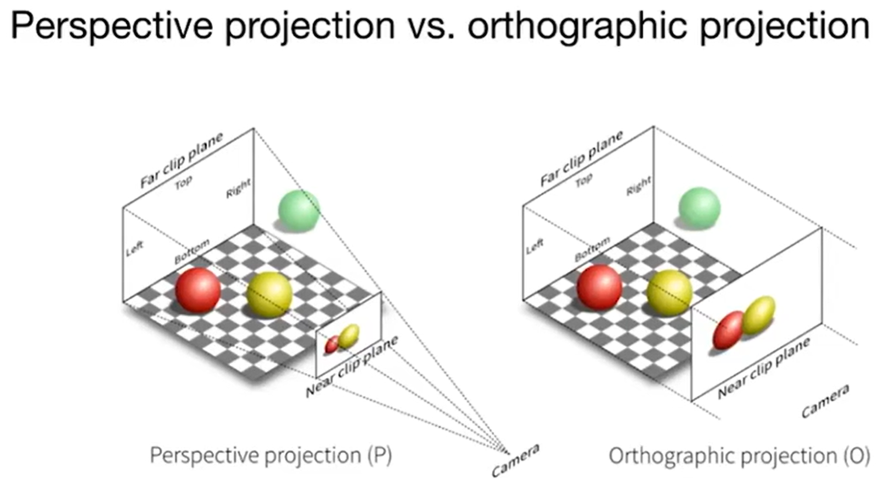
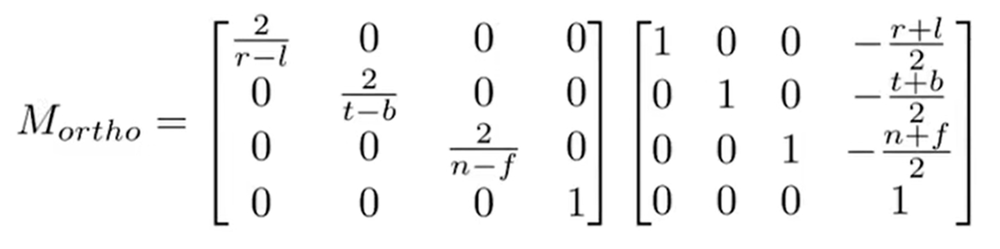
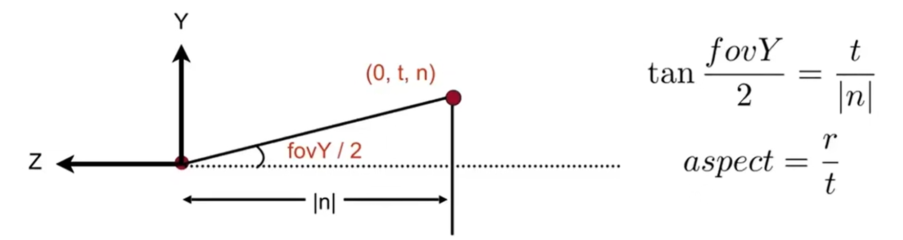
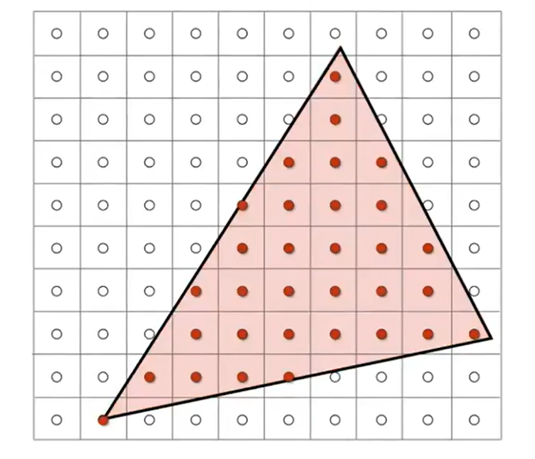
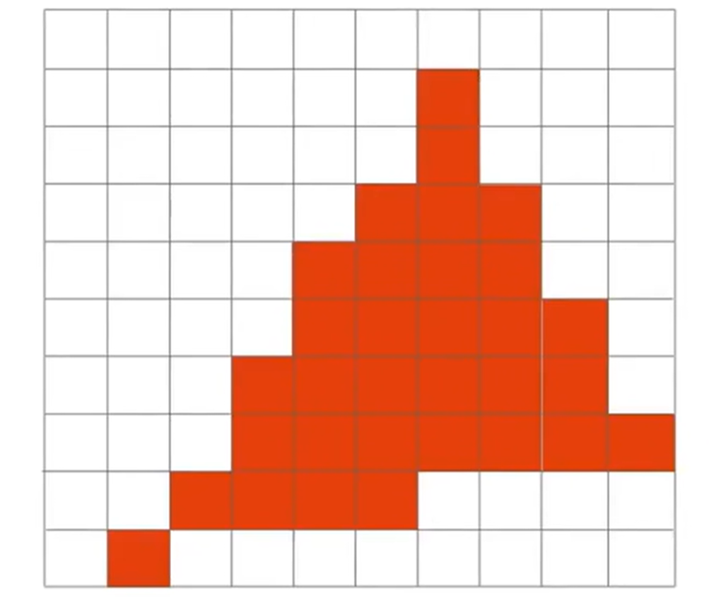
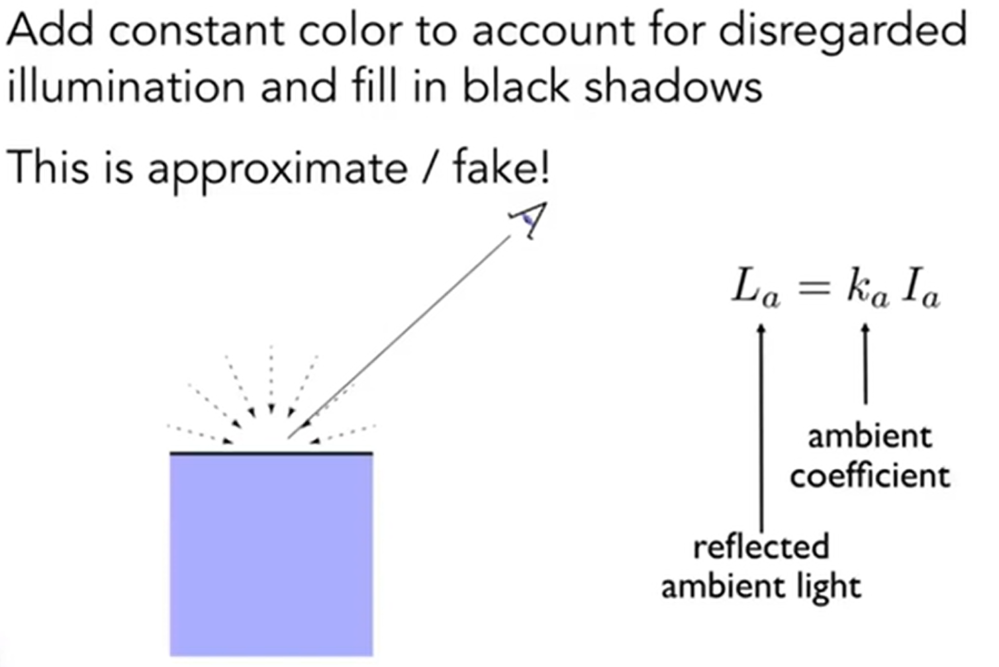
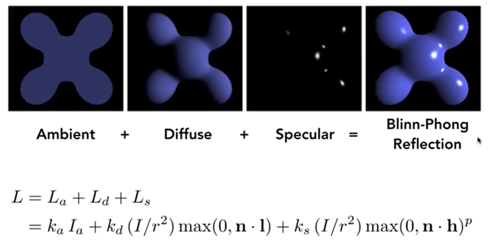
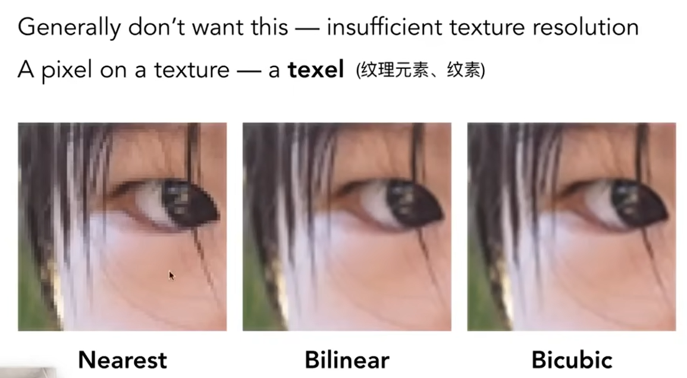
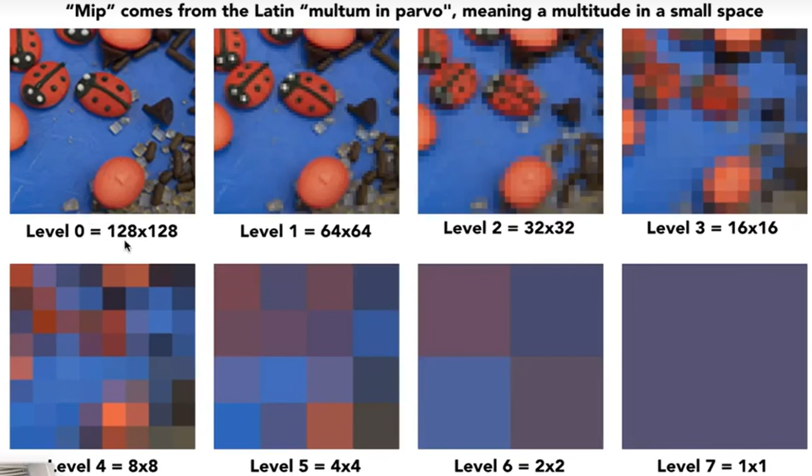
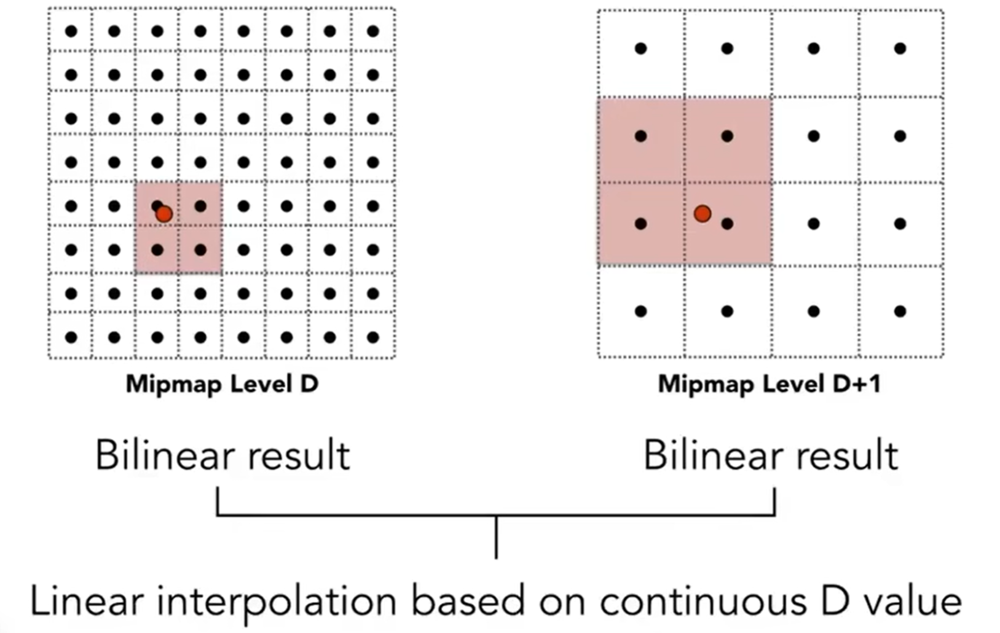

# GAMES101 Note

## Overview of Computer Graphics

Computer Graphic，简称CG，它的定义是：The use of computers to synthesize and manipulate visual information。“合成与操纵”。

现在很多游戏都利用CG技术，那么如何评价画面的好坏呢？一种简单的断言：看画面够不够亮。因为这涉及到CG的全局光照概念，因此将光照是否充足作为评价标准是可以的。

以及，不同的游戏可能有不同的画质，例如有的是卡通画质，有的是更贴切显示的画质，那么如何实现不同的画质呢？这些也都需要计算机图形学来解决。除开游戏，电影里面也广泛应用CG，如特效（special effect)，人物面部捕捉（阿凡达）等。除了电影游戏，很多其他领域也应用CG，例如Computer-Aided Design（如数字孪生 photo->CG），动画（animation），可视化（Visualization for Science, engineering, medicine, and journalism, etc)，虚拟现实（Virtual Reality）等。

图形学具体包含了哪些内容呢？

- Math of (perspective) projections, curves, surfaces
- Physics of lighting and shading
- Representing / operating shapes in 3D 
- Animation / simulation

课程主要包括四个方面内容：

- Rasterization （光栅化）
- Curves and Meshes （曲线和曲面）
- Ray Tracing （光线追踪）
- Animation / Simulation （动画与模拟）

什么是光栅化？把空间中的三维形体投射到屏幕上，就是光栅化：Project geometry primitives (3D triangles / polygons) onto the screen。这是**实时**计算机图形学的应用。CG中定义到：一秒钟能生成30张画面（30 frames per second）就认为是实时，否则就是**离线**（off-line）。

而在曲线和曲面中，将了解如何在计算机视觉中表示几何：How to present geometry in Computer Graphics。例如空间中如何表示较为光滑的曲面？如何用简单的面片去细粒度地拟合较为光滑的曲面？当物体改变时，曲面应该如何改变？物体改变时，如何保持原有的拓扑结构？

光线追踪被电影广泛使用，用来生成更高质量的画面。CG中也有一种trade-off: 生成速度快 or 生成质量高？那么光线追踪就是选择了质量高，但是生成时间很长。那么有没有两全其美的方法呢？最近有“实时光线追踪”技术。

动画与模拟努力将画面中物体的移动、变化等尽可能地贴切现实生活。例如rubber ball的弹跳，悬挂毛巾的下垂等等。

GAMES101不提到的：

- Using OpenGL / DirectX / Vulkan
- The syntax of Shaders
- We learn CG,  not Graphics APIs
- 3D modeling using Maya / 3DS MAX / Blender, or Unity / Unreal Engine
- CV

那么如何理解CV和CG的区别？


当然，现在两者的边界原来越模糊。自从NeRF(Neural Radiance Field，神经辐射场)的诞生，Model and Image的交融研究越来越多。

课程使用语言： C++

## Review of Linear Algebra

CG其实交叉了很多的学科：数学中涉及到线性代数，微积分和概率统计；物理学中涉及到光学和运动学；以及其它一些领域，如信号处理，数值分析，美学等。加下来将会光速回顾一些线性代数中的基础：

向量vector是基本（$\vec{a}$），它的范数（magnitude）是$\lvert\lvert\vec{a}\rvert\rvert$，而单位向量的范数自然是1。如果希望对于向量$\vec{a}$，得到对应的单位向量，直接$\hat{a} = \vec{a} / \lvert\lvert\vec{a}\rvert\rvert$即可。一般单位向量用来表示方向。向量相加满足三角形法则。

除了加减，还有点乘（dot / scalar product），得到的就是内积。点乘可以用来**快速计算**两个向量的夹角$cos\theta$，尤其是当两个向量都是方向向量的时候。同时，点乘还能帮助找到一个向量投射到另一个向量上的结果。最后，点乘结果能帮助判断向量之间夹角与直角的关系。

点乘的基本性质：交换律，结合律，等等。在笛卡尔坐标系下，点乘的计算会非常方便：
$$
\vec{a}\cdot\vec{b}
=
\begin{pmatrix}
x_a \\
y_a \\
z_a
\end{pmatrix}
\cdot
\begin{pmatrix}
x_b \\
y_b \\
z_b
\end{pmatrix}
=
x_ax_b + y_ay_b + z_az_b
\tag{3D}
$$
点乘之外，还有叉乘。两个向量叉乘（cross product）得到的结果是另一个向量，这个向量与两个向量都垂直（3D中），方向由右手定则决定。叉乘没有交换律。叉乘在建立三维空间直角坐标系中非常有用。有时候还能帮助判断两个向量谁在谁的左边/右边。
$$
\lvert\lvert\vec{a}×\vec{b}\rvert\rvert
=
\lvert\lvert\vec{a}\rvert\rvert
\lvert\lvert\vec{b}\rvert\rvert
sin\phi
$$
The Cartesian Formula of Cross Pruduct in 3D Euclidean Space:
$$
\vec{a}×\vec{b}\ 
=
\begin{pmatrix}
y_az_b - y_bz_a \\
z_ax_b - x_az_b \\
x_ay_b - y_ax_b
\end{pmatrix}
$$
那么有另一种表现形式（A为a向量的***dual matrix***）
$$
\vec{a}×\vec{b}\ = A*b = 
\begin{pmatrix}
0 & -z_a & y_a \\ 
z_a & 0 & -x_a \\ 
-y_a & x_a & 0
\end{pmatrix}
\begin{pmatrix}
x_b \\
y_b \\ 
z_b
\end{pmatrix}
$$
叉乘在CG的Rasterization光栅化中一个非常重要的应用，就是判断一个点在不在一个polygon里面，如判断是不是在三角形中。在下面这个例子中，只需要判断`AP * AB  BP * BC  CP * CA`，这三个叉乘的结果，就能知道P点在不在三角形里面，因为叉乘能帮忙判断P在AB BC CA三个向量的左边还是右边。值得注意的是，这种判断方式和三角形三条边顶点的绕向无关(AB BC CA or BA AC CB)，因为最终判断的是P点在不在三条向量的**同侧**（当然，三条向量首尾相接是需要保证的）。当然，如果点落在了边上，那么就属于corner case, 可以自己决定是否在三角形里面。


矩阵之间的乘法略。矩阵的转置有以下性质：$(AB)^T=B^TA^T$。那么点乘就可以表示为：$\vec{a}\cdot\vec{b} = \vec{a}^T\vec{b}$

## Eigen and OpenCV库

Eigen是一个高层次的C ++库，有效支持线性代数，矩阵和矢量运算，数值分析及其相关的算法。

关于Eigen库的安装，之前一直尝试用cMake方式把库编进MinGW里面，但是总是失败。于是最后阅读了[官方网站]([Eigen: Getting started](https://eigen.tuxfamily.org/dox/GettingStarted.html))，发现了如下的内容：
In order to use [Eigen](https://eigen.tuxfamily.org/dox/namespaceEigen.html), you just need to download and extract [Eigen](https://eigen.tuxfamily.org/dox/namespaceEigen.html)'s source code (see [the wiki](http://eigen.tuxfamily.org/index.php?title=Main_Page#Download) for download instructions). In fact, the header files in the `Eigen` subdirectory are the only files required to compile programs using [Eigen](https://eigen.tuxfamily.org/dox/namespaceEigen.html). The header files are the same for all platforms. It is not necessary to use CMake or install anything.

There is no library to link to. The only thing that you need to keep in mind when compiling the above program is that the compiler must be able to find the [Eigen](https://eigen.tuxfamily.org/dox/namespaceEigen.html) header files. The directory in which you placed [Eigen](https://eigen.tuxfamily.org/dox/namespaceEigen.html)'s source code must be in the include path. With GCC you use the `-I` option to achieve this:

`g++ -I /path/to/eigen/ my_program.cpp -o my_program `

于是命令行运行cpp文件的时候，应该终端运行上面指令，然后终端命令行运行exe文件：`./my_program.exe`

OpenCV同理：当然可以把这个库编进环境里面，但是为了方便，也可以使用`-I /path/to/opencv2/`来实现。

## Transformation

2D transformation：几种常见的2D图形的变换：
$$
\begin{bmatrix}
x' \\
y'
\end{bmatrix}
=
\begin{bmatrix}
s_x & 0 \\ 
0 & s_y
\end{bmatrix}
\begin{bmatrix}
x \\
y
\end{bmatrix}
\tag{Scale}
$$

$$
\begin{bmatrix}
x' \\
y'
\end{bmatrix}
=
\begin{bmatrix}
-1 & 0 \\ 
0 & 1
\end{bmatrix}
\begin{bmatrix}
x \\
y
\end{bmatrix}
\tag{Reflection}
$$

$$
\begin{bmatrix}
x' \\
y'
\end{bmatrix}
=
\begin{bmatrix}
1 & a \\ 
0 & 1
\end{bmatrix}
\begin{bmatrix}
x \\
y
\end{bmatrix}
\tag{Shear}
$$

$$
R_\theta = 
\begin{bmatrix}
cos\theta & -sin\theta \\
sin\theta & con\theta
\end{bmatrix}
\tag{rotation*}
$$

$$
\begin{bmatrix}
x' \\
y'
\end{bmatrix}
=
\begin{bmatrix}
a & b \\ 
c & d
\end{bmatrix}
\begin{bmatrix}
x \\
y
\end{bmatrix}
\tag{Linear Transform}
$$

$$
\begin{bmatrix}
x' \\
y'
\end{bmatrix}
=
\begin{bmatrix}
1 & a \\ 
0 & 1
\end{bmatrix}
\begin{bmatrix}
x \\
y
\end{bmatrix}
\tag{Shear}
$$

rotation在2D中都是默认绕远点逆时针旋转的。而且旋转矩阵有着特殊性质(如下)，逆与转置相同的矩阵就成为***正交矩阵***。
$$
R_{-\theta} = 
\begin{pmatrix}
cos\theta & sin\theta \\
-sin\theta & cos\theta
\end{pmatrix}
= R^T_\theta
\\
i.e. \hspace{1cm} 
R_\theta
R^T_\theta = I
$$


那么注意到，上面这些情况没有涉及到平移，因为其它的变换都是线性变换，但是唯独平移不是。因此为了解决这个问题，采用了Homogenous Coordinates Solution。

- 

$$
\begin{bmatrix}
x' \\
y' \\
z'
\end{bmatrix}
=
\begin{bmatrix}
1 & 0 & t_x \\
0 & 1 & t_y \\
0 & 0 & 1
\end{bmatrix}
\cdot
\begin{bmatrix}
x \\
y \\
1
\end{bmatrix}
=
\begin{bmatrix}
x+t_x \\
y+y_t \\
1
\end{bmatrix}
\tag{Tran}
$$

***Homogeneous Coordinates(齐次坐标)***中，将2D point表示为$(x,y,1)^T$，而将2D vector表示为$(x,y,0)^T$，这很妙的是满足了：

向量相加仍为向量（第三维度是0），点坐标相减为向量（第三维度上1-1 = 0），点加上向量仍为点（第三维度是1+0 = 1）。这也解答了一个问题：点坐标相加是什么呢？ 首先我们需要扩充一下定义：
$$
\begin{pmatrix}
x \\
y \\
w
\end{pmatrix}
is\ the\ 2D\ point\ 
\begin{pmatrix}
x/w \\
y/w
\end{pmatrix},
w ≠ 0
$$
之后，就能轻松知道点相加代表什么了：两点的中点。

以上就是仿射变换（affine transformation），表达式如下：
$$
\begin{bmatrix}
x' \\
y' \\
z'
\end{bmatrix}
=
\begin{bmatrix}
a & b & t_x \\
c & d & t_y \\
0 & 0 & 1
\end{bmatrix}
\cdot
\begin{bmatrix}
x \\
y \\
1
\end{bmatrix}
$$
$Affine\ map = linear\ map + translation$，实质是先线性变换，再进行平移

那么2D transformation重新用矩阵表示：
$$
S(s_x,s_y) = 
\begin{pmatrix}
s_x & 0 & 0 \\
0 & s_y & 0 \\
0 & 0 & 1
\end{pmatrix}
\hspace{2cm}
(Scale)
\\
R(\theta) = 
\begin{pmatrix}
cos\theta & -sin\theta  & 0\\
sin\theta & con\theta & 0 \\
0 & 0 & 1
\end{pmatrix}
\hspace{2cm}
(Rotation)
\\
T(t_x, t_y) = 
\begin{pmatrix}
1 & 0 & t_x \\
0 & 1 & t_y \\
0 & 0 & 1
\end{pmatrix}
\hspace{2.5cm}
(Translation)
\\
$$
在多步骤变换中，交换律是不满足的！例如：先旋转后平移和先平移后旋转的结果是不一样的。一系列的仿射变换矩阵最后不断作用在$(x,y,1)^T$上面，那么最后就能看成是一个矩阵作用在这个点上面。

同时有了Homogenous Coordinates的帮助，我们能够轻松的分解复杂的变换。例如2D点绕着某一特定点进行旋转，就可以把两个点同时进行平移，使得被绕的点移动到远点，然后乘上旋转矩阵，最后平移回去：
$$
T(c)
\cdot
R(\alpha)
\cdot
T(-c)
$$
3D Transformation如法炮制。3D point $(x,y,z,1)^T$，3D vector $(x,y,z,0)^T$，并且扩充定义有： 
$$
In\ general,(x,y,z,w)(w≠0)\ is\ the\ 3D\ point:\\
(x/w,y/w,z/w)
$$

## Transformation Cont.

Transformation分为：View(视图)和Projection(投影)。其中，Projection transformation又分为Orthographic(正交投影)和Perspective(透视投影) projection。

### 3D Transformation

3D Transformation的矩阵表达如下：


借助三个旋转矩阵，我们可以表示任何一种3D-Rotation：
$$
R_{xyz}(\alpha,\beta,\gamma)
=
R_x(\alpha)R_y(\beta)R_z(\gamma)
\hspace{1cm} 
\alpha,\beta,\gamma
\ \ 
are\ Eular\ angles
$$
那么如何表示绕着旋转轴向量n（默认向量是从远点出发的）旋转α角的旋转矩阵呢？ 这就是**罗德里格斯公式（Rodrigues' Rotation Formula）**
$$
R(n,\alpha) = cos(\alpha)\textbf{I} +
(1-cos(\alpha))nn^T + 
sin(\alpha)
\begin{pmatrix}
0 & -n_z & n_y \\
n_z & 0 & -n_x \\
-n_y & n_x & 0
\end{pmatrix}
$$
其中的矩阵非常眼熟，是n向量的dual matrix. 另外，旋转矩阵不是四元数，四元数是为了解决旋转矩阵插值问题而提出的。2D中一个旋转15度的旋转矩阵和一个旋转25度的相加并除2，得到的矩阵并不是旋转20度的。四元数就是解决这个问题的。

### View / Camera Transformation

现实中我们是如何拍照的呢？首先东西都摆好，然后拿出相机，找到好的角度，最后摁下快门。那么“找到好的角度”就是在进行view transformation，“摁下快门”就是在进行projection transformation。

如何perform view transformation？首先我们要定义一下相机：

- Position   $\vec{e}$
- Gaze direction  $\hat{g}$
- Up direction  $\hat{t}$    (assuming perpendicular(正交) to $\hat{g}$)

所以说，定下相机位置，然后镜头朝向目标，最后旋转相机（改变相机up direction）就可以定义相机的取经行为了。那么现实中，相机和物体都可以移动，那么根据相对运动**约定俗成**：We always transform the camera to:

- The origin, up at Y axis, look at -Z axis.
- And transform the objects along with the camera.

 那么如何transform呢？首先相机在$\vec{e}$位置，那么就进行平移。移动到原点之后，旋转$\hat{g}$到-Z轴，$\hat{t}$到Y轴，（g×t）到X轴。


“旋转$\hat{g}$到-Z轴，$\hat{t}$到Y轴，（g×t）到X轴”绝非简单的事情，矩阵计算会很麻烦。但是我们很容易实现的是：Y轴单位向量转到t，-Z轴单位向量转到g，这样通过求逆就能知道原来需要的$R_{view}$是什么了(这个矩阵很容易用$(1,0,0,0)^T\ (0,1,0,0)^T\ (0,0,-1,0)^T\ $和它相乘进行验证)：
$$
R^{-1}_{view} = 
\begin{bmatrix}
x_{g×t} & x_t & x_{-g} & 0 \\
y_{g×t} & y_t & y_{-g} & 0 \\
z_{g×t} & z_t & z_{-g} & 0 \\
0 & 0 & 0 & 1
\end{bmatrix}
\\
R_{view} = 
\begin{bmatrix}
x_{g×t} & y_{g×t} & z_{g×t} & 0 \\
x_t & y_t & z_t & 0 \\
x_{-g} & y_{-g} & z_{-g} & 0 \\
0 & 0 & 0 & 1
\end{bmatrix}
$$

### Projection Transformation

Orthographic and Prespective Projection的区别是什么呢？ 如下图(左为正交，右为透视)，同样是立方体，左边的平行线依然平行，但是右边不是。事实上，人眼更类似右边的透视投影；换而言之，透视有**近大远小**的效应；或者说，正交投影是透视投影摄像头放的无限远的情况：


下图更能直观地体现两者的区别： 



Orthographic Projection是较容易实现的，相机固定在原点，面向-Z轴，头指向Y轴，然后对物体进行***“Drop Z Coordinate”***，最后**约定俗成地**“Translate and scale the resulting rectangle to $[-1,1]^2$”。


但是在实际操作的过程中，是将$[l,r]×[b,t]×[f,n]$的立方区域（cuboid）映射到$[-1,1]^3$的canonical(正则)立方体。然后这个区域再Drop Z Coordinate。前面这一步映射的矩阵如下： 



在右手系下，面朝-Z轴让进远概念混淆（-1 > -2, 但是-1点距离摄像机近）。因此一些情况下会使用左手系（如OpenGL, a Graphics API）。那么经过了平行变换之后，理应上来说，正则立方体里面的物体都有所拉伸。是这样的，因为之后还会有“视口拉伸”对物体再次进行拉伸。

Perspective Projection是较为复杂的，但是确实应用最广的。回顾一下其次坐标中的定义：
$$
In\ general,(x,y,z,w)(w≠0)\ is\ the\ 3D\ point:\\
(x/w,y/w,z/w)
$$
因此，（1,0,0,1）和（2,0,0,2）都表示（1,0,0）。那么如何实现透视投影如何实现呢？我们可以把这个过程拆成两步：***Frustum（视锥） -> Cuboid***(一个矩阵)；正交投影。示意图如下（左立体图形为Frustum，右立体为Cuboid）


那么“挤压”（squish）矩阵怎么求？见下图：由于先有translation，摄像机已经位于原位了，因此Frustum是一个标准的“台型立方体”。那么剖析一条光线，就会发现可以利用相似三角形去求出新的x and y（我们规定，squish之后，near far两个平面的z都是不变的）


那么其实这个矩阵很多信息已经呼之欲出了：
$$
M^{4×4}_{persp\rightarrow{ortho}}
\begin{pmatrix}
x \\ y \\ z \\ 1
\end{pmatrix}
=
\begin{pmatrix}
nx \\ ny \\ unknown \\ z
\end{pmatrix}
\\
M_{persp\rightarrow{ortho}} = 
\begin{pmatrix}
n & 0 & 0 & 0 \\
0 & n & 0 & 0 \\
? & ? & ? & ? \\
0 & 0 & 1 & 0 
\end{pmatrix}
$$
我们又知道（其实是人为规定的），至少，nera平面上的z值和far平面上的z值在经过了矩阵变换之后不会变化。那么第三行至少是：(0,0,A,B)。则对于n平面上的（x,y,n,1）和f平面上的（x,y,f,1）有：
$$
nA + B = n^2\hspace{2cm} (1) \\
fA + B = f^2\hspace{2cm} (2)
$$
这样$A = n +f;B = -nf$，我们的$M_{persp\rightarrow{ortho}}$就完全算出来了。最后就有：
$$
M_{persp} = 
\begin{pmatrix}
n & 0 & 0 & 0 \\
0 & n & 0 & 0 \\
0 & 0 & n+f & -nf \\
0 & 0 & 1 & 0 
\end{pmatrix}
\\
M_{persp} = M_{ortho}M_{persp\rightarrow{ortho}}
$$
好的，

投影矩阵终于求出来了。但是有一个问题：我们规定了near and far平面距离XOY平面的距离不变，那么这个Frustum经过了Squishing之后，中间的点的z值是变大了还是变小了呢？假设点为$(x,y,t,1)$其中$n<t<f$，那么经过了矩阵相乘之后：$\hat{z} = ((n+f)z - nf)/z$，而它要和z进行比较：
$$
(n+f)z - nf)\ \ ?\ \ z^2 \hspace{2cm}(1) \\
0\ \ ?\ \ z^2-(n+f)z+nf \hspace{2cm}(2) \\
0\ \ ?\ \ (z-n)(z-f) \hspace{2cm}(3) \\
因为\ n<t<f,所以符号是大于号
$$
所以说，事实上经过了squish之后，虽然说near far两个平面的z值是不改变的，但是**中间的点的z值是会变大的**，i.e.，**更靠近far平面**。

## Rasterization

### Triangles

定义：Aspect ratio = width / height(宽高比)、vertical field-of-view(fovY)(垂直可视角)。这样一来，就能规范地用宽高比和垂直可视角来定义我们取出来的Frustum了，示意图如下： 




pre-difine一些概念之后：MVP之后干什么（MVP：model, view, project）？自然需要想：如何把正则立方体转到屏幕上。那么什么事屏幕screen呢？ 屏幕其实是一堆像素，像素矩阵的大小就称为分辨率。当前阶段，对于一个pixel，我们认为是一个小正方形，而且颜色不会变化（For now: A pixel is a little square with uniform color）。Raster是德语中Screen的意思，那么光栅化其实就是希望把canonical cube转化为screen。光栅化这个名字其实也很信达雅：把光 ray 划分为一个一个小栅（小格子）。

如何定义screen space？约定俗成：起点为原点，然后像素的引索是(x, y)形式，而且x y都是正整数。那么，"***Pixel's indices are from (0, 0) to (width-1, height-1)***"。但是注意：像素的中心点其实并不是引索！


 那么相当于希望使用一个矩阵，实现：$[-1,1]^2\rightarrow[0,width]×[0,height]$, 且跟z轴无关。这个矩阵其实不难发现：
$$
M_{viewport} = 
\begin{pmatrix}
width/2 & 0 & 0 & width/2 \\
0 & height/2 & 0 & height/2 \\
0 & 0 & 1 & 0 \\
0 & 0 & 0 & 1
\end{pmatrix}
$$
这就是***视口拉伸（viewport）***。经过了这一步之后，终于图像呈现到了像素区域内了。那么究竟如何把这***2D Polygon***转化为像素呢？换而言之，用一个一个的小格子（栅）进行划分呢？关于多边形，我们可以先讨论：Triangle Meshes应该如何操作？

那么为什么会先讨论Triangle Mesh呢？原因有很多：

1. 三角形是多边形的基础。多边形可以拆分为多个三角形
2. 三角形的三个点一定在一个面上（planar）
3. 三角形内外定义十分清晰（well-defined interior）
4. 对于三角形内部的点，很容易用三点坐标进行差值（interpolation）表示，例如重心的差值（barycentric interpolation）


分析了优势之后，如何用pixel去逼近triangle呢？如何实现这样的一个algorithm，做到：**Use the input of the position of triangle vertices projected on screen to output the set of pixel values approximating traingle**。(示意图如下)


之前提到叉乘妙用的时候有过按暗示：点是否在三角形内部是一个很好的判断标准。因此，我们可以尝试**采样**(sampling)所有的像素格子中心点，判断中心点在不在trangle的内部。



那么相当于是希望设计一个`inside(tri, x+0.5, y+0,5);`函数，从而判断引索为x y的像素的中心点是否在三角形内部（为什么是+0.5？因为viewport已经将canonical cube map到了pixel resolution matrix，所以0.5这个数字是正确的）。那么利用三个cross product就能帮助判断点是否在三角形里面。那么对于点在三角形上的corner case，我们可以自行规定，只需要**严格遵守**就行了；当然不同的API的规则也是不一样的。

那么对于一个三角形来说，我有必要扫过全部的像素来进行光栅化吗？一个三角形单元实际上是不大的，因此如果程序上遍历x y计算开销会起飞。所以说我们可以使用一个Bounding Box! (专业名字叫做Axis Aligned Bounding Box, AABB)。而有的时候，三角形实际上覆盖面积非常小，但是AABB会显示都非常大，这是什么情况呢？那就是三角形非常苗条，而且有旋转。那么对于这种三角形的光栅化，也可以采用Incremental Triangle Traversal Strategy。


最后，我们判断了所有的点是否在三角形内部，然后根据这个信息填充对应的像素。但是我们可以看到一种很糟糕的现象：锯齿效应（Aliasing / Jaggies）。没错：抗锯齿（Antialiasing）是后续一个非常重要的工作。



### Antialiasing and Z-Buffering

如何抗锯齿（也称为反走样）呢？采样能不能改进一下呢？因此需要了解一下Sampling ***Artifacts(瑕疵)***(Errors/Mistakes/Inaccuracies) in Computer Graphics。采样带来的误差有很多例子，如摩尔纹，锯齿效应，Wagon wheel effect等等，它们的采样artifact分别是：sampling in space; undersampling images; sampling in time。但是在这些artifacts背后，有一句话可以描述现象产生的原因：***Signals are changing too fast (high frequency), but sampled too slowly***。 

那么Antialiasing的core idea是什么呢？这里直接摆出结论：Blurring (Pre-Filtering) Before Sampling。


边缘高频的信息在模糊化（滤波）后可以降频，因此在较为低频的像素中心点采样下能够有更好的效果（感性理解）。Note antialiased edges in rasterized triangle where pixel values take intermediate values。同时：**先采样后模糊的方法效果并不好**！ 想要抗锯齿，**必须先模糊后采样**！

此时心中一定有两个问题： 为什么undersampling会造成锯齿效应？以及，为什么先滤波（先模糊）（pre-filtering）再采样可以抗锯齿？那么我们需要频率方面的知识。 

$cos2\pi fx$函数中，$f = 1/T$，代表了频率。f越大，图像振动频率越高，周期越小。根据傅里叶变换，Fourier Transform，任何一个周期函数我都能写成正弦函数和余弦函数的和：Represent a function as a weighted sum of sines and cosines。Essentially, 傅里叶变换就是时域->频域。


而更高频率的函数需要更快的采样策略(Higher Ferequencies Need Faster Sampling)(如下图)。


同时，undersampling也会造成Frequenciy Aliases。在下图能够清晰看出：在一个采样频率下，即使是两个频率截然不同的函数，再这个sampling下依然采样处了相同的函数。因此，这个现象也称为“走样”。


而滤波，filtering，从频率的角度上就是：Get rid of certain frequency contents。filtering分为High-Pass and Low-Pass Filtering，这些在SI100B signal processing部分有所设计。

又一个结论：Filtering = Convolution = Averaging。Averaging还可能理解，但为什么是卷积？在CNN中，卷积的定义是学习过的，因此这里也是如法炮制：对signal函数的值用一个***point-wise averaging sliding window***。

Convolution Theorem: Convolution in the spatial domain is equal to multiplication in the frequenct domain, and vice versa. 

- Option 1: Filter by convolution in the spatial domain
- Option 2 : First, transform to frequency domain (Fourier transform). Secondly, mutiply by Fourier transform of convolution kernel. Lastly, transform back to spatial domain (inverse Fourier).

上述内容主要讲述了实施卷积的两种方法：要么直接时域上卷积，要么傅里叶变换到频域，和卷积核相乘，最后合成回去。见下示意图：


这种卷积sliding window box称为filter kernel。这个box越大，模糊化的能力越强，因此wider filter kernel = lower frequency（这很容易理解）。

那么采样，sampling，从频率的角度上：Repeating Frequency Contents。见下图，在时域上的函数，通过c冲激函数进行采样。那么a函数转化到了频域上，而冲激函数经过傅里叶变换之后依然是冲激函数，那么时域上的采样是频域上的卷积，就会发现结果是在频域上不断重复的复制粘贴！

采样定理指出，如果一个连续信号的频谱内容完全位于某个频率 fmax以下，那么这个信号可以通过一个采样率 fs来完美地重建，只要 fs 大于 2fmax。这个条件确保了采样后的信号不会发生混淆，也就是说，原始信号可以从其样本中唯一地重建出来。当采样率 fs 等于或小于 2fmax 时，会发生所谓的“混叠”现象。混叠是指高频信号的样本与低频信号的样本混合在一起，导致无法从采样信号中恢复原始信号。在频域中，这表现为高频信号的频谱“折叠”到低频区域，从而与原始信号的频谱重叠，这就是“重复频谱内容”的含义。


因此如果采样越sparse，卷积频率越高，那么就会产生aliasing : Mixed Frequency Contents。见下图：


有了以上的分析，终于可以知道如何反走样：

- Option1：提高采样率（如提高分辨率；但是不现实）
- Option2：去掉高频。如下方的演示图。而现实中，如何滤波呢？可以考虑：低通滤波器对图像进行平均。


具体操作来说，可以考虑对每一个像素进行averaging：有多少部分被三角形覆盖，颜色上就呈现多少程度。示意图如下(正方形为1-pixel-wide)：


这个方法说着容易，做着难：如何计算三角形在这个像素格子中覆盖的面积呢？因此有一种近似的计算方法：MSAA, Multi-Sampling Anti-Aliasing。一个像素里面可以再划分为4个小正方形，有四个中心点，然后去感知是否在三角形内。如下：


MSAA其实并没有提高分辨率，2*2的supersampling看似是一个像素划分为了“四个小像素”，其实只是为了得到一个更合理的像素区域的覆盖比例，从而实现模糊化。这当然只是一种抗锯齿方法，还有很多Milestones，如FXAA(Fast Approximate A), TAA(Temporal AA)。同时，super resolution也是一种抗锯齿的方法，但是原理和场景都不一样：一个512×512的照片拉成1024×1024，那么就会有锯齿效应，因为有信息确实，那么就可以用深度学习来“猜出’信息，从而Antialiasing并提高分辨率。

我们已经知道了如何把远处物体用视锥框起来，转化为正则立方体，最后drop Z coordinates。但是，如何正确地表达遮挡关系呢？毕竟人眼或者是摄像机，只能看到物体的一面。这就是这里要提到的第一点：Visibility / Occlusion, i.e., Z-buffering。

受画家画画的流程的启发，发明了***Painter's Algorithm***：Paint from back to front, overwrite in the framebaffer。什么意思呢？假如说我想画一座山的风景图油画，最远的是山，于是我先画出山的全貌，然后再进一步画眼前的草地，最后画树等细节。因为油画允许**覆盖**，即overwrite，所以说我只要遵循从远到近的作画方式，画出来的就是合乎逻辑的。

我们称物体距离观测点的距离为深度depth。对于画家算法来说，对于n个三角形来说，需要复杂度`O(nlogn)`。因此这个算法就是首先将场景中的多边形根据深度进行排序，然后按照深度从大到小顺序进行描绘；画家算法通常会将不可见的部分覆盖，可以解决可见性问题。对但是有一些时候：Can have unresolvable depth order。即：不能解决有遮挡的物体，或者说不能解决深度不好确定的物体。如下面这张图：三个三角形互相遮挡，这样深度就分不清先后顺序了：


因此为了解决这种corner case，人们研发了一种新的算法：Z-Buffer。与其对三角形（多边形）进行深度排序，不如直接代入每一个像素的视角：我希望找到每一个像素看到的第一个三角形。规范表述如下：

- Store current min. z-value ***for each sample*** (pixel)
- Needs an additional buffer for depth values: A frame buffer that stores color values, and a depth buffer (z-buffer) that stores depth.

同时，为了简化计算，原本摄像头是面向-Z轴方向的，即摄像头看到的物体的Z轴值都是负数。但是我们规定：z value is always positive, i.e., smaller z means closer and larger z means further。

也就是说，在我们实施Z-buffer算法的时候，我们希望***同时***得到两个数据：颜色的buffer以及深度的buffer。示意图如下：


流程：对每一个三角形中覆盖的每一个像素进行遍历，对比每一个像素Z buffer中储存的深度，如果发现这个覆盖住它的一个三角形的depth比记录的depth小，那么两个buffer同时更新数据，直到所有的三角形被遍历完毕。Pseudo-code如下：

````c++
// Initialize depth buffer to infinite
// During Rasterization:
for (each triangle T)
    for (each sample (x,y,z) in T)
         if (z < zbuffer[x,y])
             frambuffer[x,y] = rgb;
			zbuffer[x,y] = z;
		else;
````

示意图如下：


那么这个复杂度是多少呢？答案是`O(n)`，因为其实我们***没有对三角形进行排序***。这便是最重要的visibility algorithm，implemented in hardware for all GPUs。

## Shading

### Illumination, Shading and Graphics Pipeline

介绍完了Z buffer之后，我们知道了像素中的点原来对应的空间中的三角形究竟是哪一个了，而且也能知道颜色是什么了。但是现实生活中颜色只是一方面，光线的介入让我们感觉到什么样的世界是“真实的”，因此我们还需要对像素进行***着色***（shading）。shading字典的定义：The darkening or coloring of an illustration or diagram with parallel lines or a block of color。而CG中的定义是：***The process of applying a material to an object***。

接下来要介绍一种A Simple Shading Model: ***Blinn-Phong Reflectance Model***。见下图，根据杯子右边部分区域的***高光（Specular highlights）***，我们猜测光源在右边；而杯子右边能够接受光照，但是没有直接反射到摄像头里面，但是我们依然能够看见这一部分，这就是***漫反射（Diffuse reflection）***；但是同时，杯子的左面没有直接接收到光照，而是，比如说，接收到了墙体反射的光，这种就称为***环境光照（Ambient lighting）***。


再定义一些事情，见下图(Surface parameter可以是colors, shinisess, ...)：


但是，Shading is Local，i.e.，No shadows will be generated!（shading ≠ shadow）。那么接下来，我们开始尝试表示杯子图中所演示的三种现象：

Diffuse Reflection：我们把光视为一种能量，那么漫反射中进入眼睛的光亮就可以表示为进入眼睛的能量有多少。联想太阳板：把它正对太阳自然是能量获取最大的情况，而如果板子有所倾斜，那么能量就不是max了。因此，这里介绍***Lambert's cosine law***：In general, light per unit area is proportional to $cos\theta = l\vdot n$。如下图：


同时，光还有falloff效应：一个点光源的光场中，一个单位面积接收到的能量与距离的平方成反比：


有了上面两个知识点的铺垫，***漫反射***，也称作***Lambertian Shading***，的表达方式终于出现了，见下图。***这个式子展示了究竟有多少的光，或者说能量，到达了Shading Point (而不是人眼)，并即将散发出去***。但是注意到，这个式子其实是***independent of view direction***。为什么呢？因为理想化的认为中，漫反射的实质其实是***shading point吸收了入射光线的能量，然后均匀的散发出去***。当然，关于颜色，物体表面颜色所拆分成的RGB三通道各自的diffuse coefficient就蕴含了颜色的信息。当然，这个***Blinn-Phong Reflectance Model***只是一个经验模型，并不是完全的真是的物理模型，更多的accuracy detail在ray tracing里面会再次提及。


### Shading, Pipeline and Texture Mapping

在Blinn-Phong中，认为如果产生了高光，是因为光线发生了镜面反射，然后人眼正好能够接受。但是，Blinn-Phong也做了一个很有意思的处理：***V close to mirror dirction -> half vector（半程向量）near normal***。


首先是注意到：这个模型貌似是没有考虑l和n的夹角带来的能量损失问题，因为毕竟Blinn-Phong只是一个经验模型，这里省略了；其次是为什么要使用bivector，因为这个向量很好算，式子如上，计算量不大，而如果计算了反射光线方向向量r和v的角度余弦值，那么这个模型就是Phong模型，i.e.，Blinn Phong是Phong模型的改进版；最后，为什么有p指数次幂？因为虽然说确实，cos能够表示方向错差而带来的能量损失（表现为光不高亮），但是现实是：我在bivector与法向量n重合的时候能够看到高亮，而在偏离了一定的小视角后，光亮迅速下降，一直到偏差不多一定角度之后，就没有高光了。因此，用$cos^p\alpha$的函数形状能够更好地拟合高光现象。函数示意图如下：


下面这个图很好地展示了ks和p两个参数带来的影响：


最后剩下环境光：在Blinn Phong中做了一个大胆的假设：全局的环境光都是一样的，相当于是一个常数（但现实并不如此，而真正的环境光在之后的全局光照中会详细介绍）。示意图如下：


那么最后，Blinn-Phong Reflection Model终于诞生了*(当然，要注意n l h等向量都是normalize后的单位向量)*：



接下来介绍着色频率，Shading Frequencies。之前的模型一直在提到Shading Point，那么实际操作中，Shading Point选哪些点呢？依我个人看法，选Shading Point也能算是一种sampling。那么Shading Frequencies是如何影响图像的呢？如下：


上面三张图对应的是三种Shading Point采样策略：第一张图是一个面片里面有一个固定的法向量，挑一个点算出着色，然后认为面片里面的着色都是一样的；第二张图是每一个triangle的三个顶点都算出各自法向量（咋求？马上会说），算出三个点的着色，然后通过差值方法（后面会说）来填充三角形内部每一个点的着色，这样就有了一个很好的过渡效果；最后是每一个像素都进行着色的计算。上面这个图的演示效果还是很明显的。

第一种对应的就是***Flat Shading***：Triangle face is flat, so every point in it has the same normal vector。这种方法对于光滑表面非常不友好。第二种对应的是***Gouraud Shading***（高洛德着色）：Interpolate colors from vertices across traingle (we can calculate the normal vector of each vertex)。第三种对应的是***Phong Shading***：Interpolate normal vectors across each triangle and compute full shading model at each pixel。

那么留下了两个问题：第一个是顶点的法向量怎么求？这个点肯定被多个三角形所共有，那么用这些三角形的法向量来求不就可以了吗？事实也是如此，但是关于是向量简单相加，还是按照三角形面积加权相加，实验证明后者效果更好，但是前者更为简单。示意图如下：


那么第二个是如何用顶点法向量求出每一个像素的法向量呢？这需要用到***重心差值(Barycentric Interpolation)***，之后会介绍。

接下来，介绍***渲染管线：Graphic (Real-time Tendering) Pipeline***。这里的Pipeline其实是一种流程，介绍了究竟是如何进行渲染的。如下：


其中，Rasterization包含了Z-Buffering，判断每一个像素究竟是由哪一个三角形管；关于shading什么时候进行，如果是Gouraud Shading那么其实在Vertex Processing里面就可以进行着色了，而如果是Phong Shading那么就要在Fragment Processing里面着色。关于手搓着色器Shader，推荐网站：http://shadertoy.com/view/ld3Gz2。最终希望实现的，就是Highly Complex 3D Scence in Realtime。

最后介绍Texture Mapping。之前的Blinn Phong模型中描述的是光的能量，但是现实中，在同一个光源接收下，也有可能是蓝色，或者是黄色。因此，这就需要纹理属性来表示这一部分的信息了，经典的有漫反射中的k_d参数等。怎么定义一个点的属性？首先我们要定义：三维物体表面是二维的。那么纹理texture就是一张图，我们会把这个图“蒙在三维物体表面”。


那么我就希望有一个对应关系，使得：***Each triangle vertex is assigned to a texture coordinate(u,v)***。通常，约定俗成u v的范围是[0, 1]。这种对应关系怎么求呢？这里直接默认我们将会知道这种对应关系是什么，而之后会讲。


最最后的一个坑：如何三角形差值？三角形三个顶点有各自的属性，如何定义or算三角形内部的点属性，使得三角形看起来有一种过渡效果？下节课会说。

### Texture Mapping

首先从重心坐标开始说起，这是为了解决如何差值计算的问题。为什么我们希望差值？因为我们希望Obtain smoothly varying values across triangles。那么差值什么呢？有Texture coordinates, colors, normal vectors等等属性。那么如何差值？重心坐标就是关键。

在一个三角形中，如果一个点在三角形内部，那么满足：
$$
(x, y) = \alpha A + \beta B + \gamma C \\
\alpha + \beta + \gamma = 1 \\
\alpha, \beta ,\gamma >0
$$
当三个参数都是1/3的时候，这个点就是重心坐标了；而如果是任意一个点呢？公示如下：


而公式推广一下：$V=\alpha V_A + \beta V_B + \gamma V_C$，$V_i$ canbe positions, texture, coordinates, color, normal vector, depth, material attributes ...

而这种操作也会有一定的问题：比如说texture magnification。第一种情况，Easy Case，如果说我有很高分辨率的图，但是纹理太小了，因此(x, y)映射过去后的(u, v)可能不是整数，因此要round为整数，那么这就表现为：多个像素聚在一起对应的是texture一个位置，从而造成了方格的感觉。



如何解决呢？双线性插值：Bilinear Interpolation。见下图：如果(x, y)落在了红点位置，那么如果采用Nearest找到右上角的中心点所对应的texel，那么就会造成一个后果：落在u11的红点的属性值都是这个texel的value，magnification就出现了。因此，可以看身边的四个中心点。注意到s t参数，这两个参数在使用引索作为单位的情况下，应该是都是小于1的数字，因为u01 u11两个点之间的数字都是1（按理说，u v坐标系范围都是0-1，这里为了契合texel的概念，同样赋予了一套引索，我们这里的s t都是用引索来作为基准的）。因此，在两个方向上就可以进行线性差值了。$f(x,y)=lerp(t,u_o,u_1)$代表竖直方向上进行了一次线性插值，而双向差值就是水平和数值都要差值。


那么第二种情况，Hard Case，如果纹理很大，但是我的图的resolution较小，那么texture magnification现象更严重。如下图。


问题是什么呢？已上图为例，近***处的像素投射到的Texture里面的覆盖面积较小***，尚且误差不大，***但是远处的像素投射过去，覆盖的面积很大***，而这种情况采取平均听起来就怪怪的。


那supersampling能不能解决的？能，即降低覆盖区域，但是速度很慢。有没有更好的办法？之前我们都是用texel中心点信息来进行差值，是Point Query，那么可以尝试转化为Range Query。因此引入了Mipmap概念，可以帮助进行范围查询：这个方法很快，***但只能做近似的正方形的查询***。我们对一个正方形的图形能够逐步降低分辨率，如下：



这一步可以在得到texture之后提前计算出来。那么我们就可以构建视觉金字塔，或者叫做***Mip Hierarchy***。那么我们引入的额外存储是多少呢？如果Level 0的图的存储量为1，那么之后其实是4/3。


那么如何知道一个像素映射到纹理上的区域大小呢？可以借助像素邻居中心点的信息。如下，我希望知道左边小正方形在纹理上的覆盖面积，那么借助上下左右四个中心点，五个都投影到纹理上，然后利用这五个点就能大概知道覆盖面积长什么样子了，如右图红色区域。我们用边长为L的正方形拟合这一片区域，L的边长公式如下（其实是投影后的(u,v)00到01,10***两个***距离中的最大值）。那么如何用Mipmap求这个正方形区域覆盖的texture值的平均值？那么巧妙之处就在于，***我知道这个区域在$D=Log_2 L$层的Mipmap中一定会缩小成近似于1个像素的大小区域！！***，因此就能非常快的知道这个平均值是多少。


我们提到，是***近似***与一个像素，其实如果面积真的是一个像素的话，可能给是类似于1.8层这种数据。那么在这样的情况下，我们可以算法可以再进一步：***Trilinear Interpolation***。假如说是1.8层，那么就是1层的位置进行一次双向差值，2层进行一次双向差值，两个值再根据D值进行差值计算。如下图：



这种三差值听起来很有道理，但是仍然有一个问题：模糊化。因为毕竟，D越高，越模糊（之前的图也能直观感受到）；同时，很多像素投射到纹理上面，覆盖面积细长，用正方形来拟合就会overblur。那么因此设计了Anisotropic Filtering（各向异性过滤）。如下图：有了Ripmap，原来细长的覆盖区域可以用长方形包住，那么overblur会得到缓解。一般来说，各向异性过滤的存储量将会是原来的三倍。


同时，Textures doesn't have to only represent colors：纹理也可以记录法向量（normal / bump mapping）等。那么法线贴图是在干什么？Adding surface detail without adding more triangles。如下图，黑线为原来的物体表面，而使用了贴图，高度会扰动，从而肉眼可见地法向量方向将会发生变化。


那么法向量的扰动数学上如何表示？我们先看一个维度上的：


拓展到3D之后，公示如下：


注意这个公式是默认真实世界法向量是(0, 0, 1)！因此这个公式在实际运用的过程中，对于一个法向量来说，我先转化它到（0, 0, 1），然后通过法向量贴图进行扰动，算出一个新的法向量，然后转化到原来世界的坐标系。

但是这种方法终究是改变几何，仅仅是改变了法向量欺骗人眼。因此又发明了一种Displacement mapping，这个方法实际上是移动了顶点，但是代价是需要supersampling。

## Geometry

### Introduction

 几何Geometry的表示可以有很多种方式，但是大致分为两类：一类是***隐式表达（Implicit）***，如algebraic surface，level sets，distance functions等；一类是***显示表达（Explicit）***，如point cloud，polygon mesh，subdivision，NURBS等。

什么是隐式表达？我不知道点的具体位置，但是我知道点之间的相互关系。例如，在一个单位球上的点的隐式表达就可以是：$x^2 + y^2 + z^2 = 1$。更一般地，$f(x,y,z) = 0$。这种方法优点是很容易看出来一个点是否在几何体里面，而缺点是很难画出来，很抽象

那么显示表达呢？All points are given directly or via parameter mapping。例如：$f(u,v) = (cosu, cosv, sinu)$，那么这代表的一系列点就是显示表示出来的。这种方法优点是很容易画出来，但是很难判断一个点在不在几何体里面。

那么Best Representation究竟是什么呢？That depends on tasks！因此，我们需要了解更多的隐式表达和显示表达。

对于implicit来说，第一种是数学公式的表示，这非常不直观；第二种是Constructive Solid Geometry(CSG)，尝试用基本几何形体之间的Boolean operations去合成复杂的几何体；第三种是距离函数：Giving minimum distance (could be signed distance) from anywhere to object，详细内容可以进这个[知乎链接](https://zhuanlan.zhihu.com/p/365440831)；第四种是Level Set Methods，思想和距离函数其实是一模一样的，只不过是距离表示在网格里面了；第五种是分型(Fractals)，例如雪花，很像递归。


Implicit Representation的优点：

- compact description(e.g, a function)
- certain queries easy(inside object, distance to surface)
- good for ray-to-surface intersection (more later)
- for simple shapes, exact description / no sampling error
- easy to handle changes in topology (e.g., handling fluid with distance function)

同时也有缺点：difficult to model complex shapes。

对于explicit来说，第一种是点云，是最简单的方式，list of points (x, y, z)，点云密度很大，一般点云之后会转化为多边形面片；第二种是多边形面片，CG中经常使用，常用***Wavefront Object File (.obj) Format***表示。什么是obj Format？其实就是：***a text file that specifies vertices, normals, texture, coordinates and their connectivities***。如下图：


v代表的是顶点坐标，vt代表的是一系列的纹理坐标，vn代表一系列的法向量，最后f代表的是v-vt-vn对应关系。

### Curves and Surfaces

曲线主要以Bezier Curves贝塞尔曲线呈现，是显示表达的一种（因为实质是用参数直接表示曲线），思想是用一系列控制点去定义曲线，如下图：一开始p0 p1两点，t0时刻方向如图；之后p0->p3，p2 p3方向t1方向如图，那么这样就能画出一条图中的曲线。所以说，p0->p3曲线，用p1 p2两点控制。


更特殊地，我们考虑三个点情况下的贝塞尔曲线，而这种情况下的算法叫做***de Casteljau算法***，而画出的曲线也叫做***quadratic Bezier curve***。如图：靠考虑b0变化到b2，同时一开始的b0b1和b1b2切线方向已经固定。其实这个时候，脑中能脑补一个画面。那么根据算法，如果b0->b2看成一个0->1的过程（或者说，消耗的时间是1），那么t时刻的点位于$b_0^2$位置。这个位置是如何求出来的呢？

首先b0b1上选出$b_0^1$，满足：$b_0b_0^1/b_0^1b_1=t/(1-t)$，再在b1b2上选出$b_1^1$，满足：$b_1b_1^1/b_1^1b2=t/(1-t)$，最后连接$b_0^1b_1^1$，在上面选出$b_0^2$，满足$b_0^1b_0^2/b_0^2b_1^1=t/(1-t)$。因此说，这是显示表达，因为实质是参数表达。


那么四个点呢？依然如下，图中满足：$b_0b_0^1/b_0^1b_1 = b_1b_1^1/b_1^1b_2 = b_2b_2^1/b_2^1b_3 \\ = b_0^1b_0^2/b_0^2b_1^1 = b_1^1b_1^2/b_1^2b_2^1 = b_0^2b_0^3/b_0^3/b_0^3b_1^2 = t/(1-t)$


线性代数上表示如下图:


那么上面是一个控制点的情况，根据quadratic一词也看出来了，这是二阶的情况，而如果是两个控制点，就是3阶。那么n阶公式如下：***Berstein form of a Bezier curve of order n***。


贝塞尔曲线有两个很好的性质：第一个是对贝塞尔曲线进行仿射变换，只需要对所有的点进行仿射变换，然后再运行一次de Casteljau算法即可，而不需要对原来这个曲线上的每一个点进行仿射变换；第二个是贝塞尔曲线一定在控制点们所形成的凸包（Convex Hull）之内（可以直观看出来）。

但是如果当贝塞尔曲线面临高阶的情况，即控制点很多的情况下，有的时候曲线不能很好的反映控制点的走势，如下图。因此实际操作中，一般四个控制点控制一条贝塞尔曲线，即：***Peicewise cubic Bezier the most common technique***。那么如果piecewise操作，那么***$C^0$连续***是保证了，即两个贝塞尔曲线共用一个端点，但是会不禁问：如果希望一阶导也连续呢？即切线也是共用的？那么这就是***$C^1$连续***，甚至可以更高阶连续，这叫做***曲率连续***。不同类型的连续，有各自进一步的复杂操作，这里不过多涉及。


而曲面（Surface）表达明显更为复杂，当然也是用的是贝塞尔曲面。见下图，我们可以直观理解贝塞尔曲面是怎么形成的。那么数学上是如何实现的呢？


在一个方向上面，可以得到四条贝塞尔曲线。从同一端同时出发，那么就会有四个点，这四个点将会在另一个方向上形成一个个贝塞尔曲线，因此这四个点扫完，曲面就诞生了。


### Mesh Operation

Mesh Division是三角形细化，从而提高分辨率；Mesh Simplification简化三角形，但是简化要有一定的规则；Mesh Regularization三角形可能有大有小，渲染上就会带来一定的麻烦。

Mesh Division怎么做？怎么引入更多的三角形？三角形越多，越能拟合出较为光滑的模型。表面细分中的一种代表类型——Loop Division（和循环没有关系）——分为两步：第一步是增加三角形数量。就比如说取三个三角形的三个中点，连接起来，就形成了四个三角形。第二步是Assign new vertex positions according to weights。如果仅仅连成四个三角形，那么很难产生光滑的效果，这可想而知，因为平面还是那个平面。因此我希望***新产生的顶点与原来的旧顶点都能够产生一定的位移***，从而为拟合光滑平面提供可能性。


对于新的顶点来说，更新规则如下图；至于权重为什么长这个样子，中间的白色、将要更新位置的点离A B点较近，离C D较远，因此A B点在坐标上的贡献应该是较高的。


那么旧顶点呢？这个旧顶点要估计到自己原来的位置，又要考虑到周围的点的坐标。因此规则如下：其中vertex degree代表这个顶点被几个三角形共用。


从下面这张图可以看出来：Loop Division表现很好。


那么Mesh Simplification的goal是reduce number of mesh elements ***while maintaing the overall shape***。有一些情况下，我不希望三角形那么多，比如说游戏里面，会有简化的需求。这里介绍一种方法叫做边坍塌（edge collapsing）。但是这绝非简单的事情：哪些边需要坍塌？因此需要引入一种metric: Quadric Error Metric。如下图：


## Shadow Mapping

在shading中有一个问题：着色中无法展示影子，因为传统光栅化很难处理全局方面的事情。Shadow Mapping技术实施的时候，是***不知道***场景的geometry的，而且必须尽可能防走样。那么关键idea是什么呢？***The points NOT in shadow must be seen both by the light and by the camera.***用这种思想处理得到的点光源场景下的阴影我们称为硬阴影。

第一步：站在点光源的视角看场景，并记录看到的image的depth。


第二步：人眼看见的image的点重新投射(reproject)给点光源的视野，然后推算出它应该在点光源image上的哪一个位置，然后比较点光源记录的深度和人眼看到的这个点的距离点光源的实际深度：如果记录比实际小，说明我看到的这个点应该是被遮挡住的；反之，这个点应该能被点光源照到，说明不在阴影中。这就是一种Shadow Mapping。


但是这种方法也是有自己的问题：假如说光线被点A遮挡，而它被看见，投影回去，然后判断点A的深度和点光源记录的深度谁大谁小，而***浮点数***的运算与比较就会出现偏差，尤其是判断浮点数是否相等。因此shadow mapping会略有偏差，尤其是光线被遮挡的那些部分。而且这种方法会提前进行一次点光源的光栅化与Z-buffering。而有硬阴影，那么就有软阴影。如下：它的影子的变化是渐进的，而不是突兀地转变。这种情况怎么产生的呢？实际上，是因为光源不是点光源，而是有体积的（没错，如果是点光源，那么不可能有软阴影）。


## Ray Tracing

### Whitted-Style Ray Tracing

为什么要光线追踪？一定是光栅化有一些缺点：***Rasterization couldn't handle global effects well***。比如说软阴影，glossy reflection（有镜面反射的效果，但是不完全是，有一定的粗糙），以及Indirect illumination（间接光照，如光照可能会反弹多次才会最终进入人眼；而光栅化，如Blinn-Phong模型只考虑一次的反射）。同时：***Rasterization is fast, but quality is relatively low***，因为光栅化只是一种近似的、同时快速的方法。光线追踪相反：***Ray Tracing is accurate, but is very slow***，因此经常在off-line的应用场景中使用，如制作一部精美的电影。

最基础的光线追踪算法，首先需要定义光线，有三个核心关键：

- 光线沿直线传播（虽然物理现实并不如此）
- 光线之间不会发生碰撞（相互之间不影响，虽然物理现实并不如此）
- 光线从光源出发，最终到达眼睛（当然，光线传播有***可逆性reciprocity***，“你凝视深渊，深渊也在凝视你”）

1968年，提出了光线投射（Ray Casting）的方法：在摄像机面前，认为有一个成像框，框里面有很多的像素，然后每一个像素中心点和摄像机连线，发射出一条光线（***为什么可以这么认为？Reciprocity！***），这个光线可能会和物体在一个点上相撞；然后这个点和光源连线，判断是否被遮挡，如果没有被遮挡，那么就形成了一条有效的光路，从角度和距离能够计算出光的能量，从而计算着色；同时，这条光线会在撞点上面发生镜面反射（***关键假设***，当然可能会有能量损失），继续走下去，可能再次和一个物体相撞，然后重复之前所说的“判断是否可以形成有效光路”步骤。当然，在判断相撞在哪一个点的问题上，一定要看这条射线上那个物体***优先***和射线相撞在哪一个点，这样一来反而很nice，因为避免了光栅化中的Z-buffering操作。下图生动地展示了上述的过程，***但是图中光线只弹射一次***：


上述的模型中，光线只弹射一次。那么弹射很多次呢？这就是***Recursive Ray Tracing (Whitted-Style) Algorithm***。这个模型的强大之处在于：光线不止弹射一次，而且也不止可以镜面反射（当然可能有能量损失），甚至可以有折射（例如玻璃材质，当然可能有能量损失）；在这个模型中，光线可以一直弹射下去。如下图（同时演示了反射和折射的现象）：


上述理论听起来很完美，但是仍然有很多的技术细节需要客服。首先第一点：如何判断***光线相撞（Ray Intersection）***？我们希望求光线与物体的第一个相交点。光线一般认为是：从定点按照一个方向出发，用数学公式表达就是：
$$
r(t)=\textbf{o} + t\textbf{d},\ 0≤t＜\infty
$$
对于一个物体的表面，如果使用的是隐式表达：
$$
f(\textbf{p})=0,\hspace{2cm} 则联立方程有; \\
f(\textbf{o} + t\textbf{d})=0
$$
那么利用解出的实数正根t就能求出交点的坐标。那么如果是显示表达：三角形面片呢？如果直接判断一条射线和空间中的一个三角形有0或1个交点，明显比较麻烦。于是人们想到了一个巧妙的方法：过这个三角形片面延伸出一个平面，这一点很好实现，有法向量和三角形的一个顶点就能实现，然后射线必定和这个平面相交（平行情况不予以讨论）；然后再判断这个交点是否在三角形内部，这也很好实现，三个叉乘就能判断。


当然，如何更快的求出射线与平面的交点呢？有***Moller Trumbore Algorithm***：


虽然但是：模型中有很多的三角形啊，难不成每一个都判断一次，然后求出许多交点，最后调出最近的？当然可以，但是很慢。因此，如何***加速Ray Intersection***的计算呢？为了加速，首先提出了一个Bounding Volumes（包围盒）的办法。对于任何一个物体，都能够用一个立方体，或者是一个球体之类的立方体抱起来，因此：如果光线连包围盒都碰不到，那就肯定碰不到物体。我们把立方体理解为“三对”面的intersection。实战中：***We often use an Axis-Aligned Bounding Box(AABB，轴对齐包围盒)***。那么如何知道什么时候，射线和盒相交了呢？***当光线和三对平面都有所相交的时候***；而离开盒呢？***光线与任意一对平面都相交的时候***。（感性理解，可以借助二维情况帮助理解；为什么要这种理解？是为了更方便！因为我不能说“我先判断光线和哪一个平面先相交”）


如果$t_{enter} < t_{exit}$，那么我们就知道有交点了。那么如果有负数的情况呢？我们现在有两个时间，如果$t_{exit}<0$，那么就说明盒子在光线的背后，不可能相交；而如果$t_{exit}>=0 \ and \ t_{enter}<0$呢？说明光线起点在盒子里面，说明绝对有交点。综上所述：$t_{enter}<t_{exit}$&&$t_{exit}>=0$情况下，光线就会和AABB相交。这样的话，就能简单地求出t的值。


### Acceleration

#### Uniform Spatial Partitions(Grids)

假如说找到了大包围盒，我们可以创建一个个网格盒子，然后判断哪些盒子里面是有物体的（Store each object in overlapping cells）。一条光线过去，会和大包围盒中的许多网格盒子相交。当相交的网格盒子里面储存了物体的时候，再一次判断在这个网格盒子里面，光线是否和物体发生了相交。那么如何划分网格盒子呢？太大太小都不好（可以感性理解），因此实践中，heuristically，场景中各自的数量应该是物体数量的27倍。在什么情况下，这种grid加速效果很好呢？***Generally, grids work well on large collections of objects that are distributed evenly in size and space***。为什么呢？因为我们期望光线经过一个个网格盒子的时候，里面都经常能碰见物体。

换而言之：假如说空间分布的不均匀的时候，grid表现不佳，“Teapot in a stadium”。因为很多的各自都完全是空格子，而要遍历很多的空格子才能找到包含茶壶的格子

#### Spatial Partitioning

如何允许“不均匀”地划分空间？一种常见的方法是八叉树（Octree）。在空间中首先化为8块，对于每一块来说，如果里面有很多物体的话，我就可以再划分为8块；对于新产生的8块来说，继续重复上述的步骤。这就是一种不均匀的划分，而“这一块里面包含多少物体我就再分为8份”这种规则是我们自己定义的。于是通过八叉树，我们能够不均匀地划分空间，并且力图将细粒度的盒子分配给那些物体集中的地方，而在没有物体的地方直接用一个大盒子表示（即不进行进一步的八叉树划分）。

***但是实践中，人们并不倾向于选择八叉树***。人们又发明了KD-Tree，与八叉树思想类似，但是关键在于，每一次只在一条轴上划一刀，并且轴的选择是交替的。示意图如下：其中，首先横向划一刀，然后上下两部分都竖直方向划一刀，然后之后再横向，以此类推；3D中，轴的选择可以是x y z轮流来。


这样一来，我们可以通过KD树的结构来划分格子，然后格子中储存物体。如下图（2D演示）：


当光线过来的时候，从树的根节点开始从上往下遍历：先判断和A相不相交？如果相交，判断和1 B是否相交呢？假如和1相交，因为1没有子节点，因此1中储存的所有物体都和光线判断是否相交；如果和B相交，那么就继续判断和2与C相交，以此类推。

这个流程看起来棒极了，但是却仍然渐渐不被使用。为什么？因为判定object和AABB是否相交也是一个大问题。这个算法不是没有，但是很难实践，因此KD树的建立不是简单的事情；同时，一个物体可能会出现在多个叶子结点，但是这并不是我们所希望见到的。

#### Object Partitions & Bounding Volume Hierarchy(BVH)

之前那种划分都是从空间角度入手。那么能不能从物体角度入手呢？答案是可以的，于是BVH算法应运而生，成为了最广泛使用的划分方式。


首先用一个大AABB包住所有的三角形，然后可以参考KD树，左右分出两部分，每一部分里面都***完整包含***了很多三角形（当然，两个AABB可以相交），然后以此类推。步骤可以概括如下：


How to subdivide a node?

- Choose a dimension to split.
- Heuristic #1: Always choose the longest axis in node.
- Heuristic #2: Split node at location of median object.

Termination criteria? Heuristic: stop when node contains few element. 

遍历BVH的伪代码如下：


Spatial划分和BVH物体划分的区别概述如下：


### Basic radiometry

radiometry，辐射度量学，为什么要引入这个东西呢？Blinn-Phong模型很粗糙，而Whitted style ray tracing往往给出的结果总是距离“正确”有一点距离。辐射度量学表述了如何表示光照的属性，单位等等，定义了光照的若干属性：***Radiant flux, intensity, irradiance, radiance***。***Perform lighting calculations in a physically correct manner***。

#### Radiant Energy and Flux (Power)

Definition: Radient energy is the energy of electromagnetic radiation. It is measured in units of joules.  $Q[J=Joule]$

Definition: Radiant flux(power) is the energy emitted, reflected, transmitted or received, per unit time.  $\phi = dQ/dt[W=Watt]$

Flux的另一个定义： photons flowing through a sensor in unit time。

我们需要详细定义一一些blinn-phong中粗糙对待的事情：例如点光源散发光，不同角度光落在一个点上等；而前者对应的概念就是Radiant Intensity，后者对应的是irradience。

#### Radiant Intensity


立体角是什么？它描述了空间中的一个角度有多大。


在上述的模型中，我们一般用$(\theta, \phi)$这种球坐标系中的两个关键角度来表示，其中前者是向量和z正半轴的夹角，后者是向量投影到XOY后和x正半轴的夹角。那么A代表面积，那么有differential solid angels formula:
$$
dA = r^2sin\theta d\theta d\phi \\
d\omega = dA/r^2 = sin\theta d\theta d\phi
$$
因此点光源散发出来的单位方向上的Intensity是：$I = \phi / 4\pi$。

#### Irradiance & Radiance

Irradiance 定义如下:


因此在点光源中传播出来的光线，事实上Itensity其实没有衰减，衰减的其实是irradiance。

Radiance 定义如下：


那么radiance可以视为一个单位solid angle上面传过来的irradiance，那么事实上两者的关系就差了一个积分：


概念总结：

- 立体角(solid angle): 平面角在三维空间的延伸, 就理解为三维的角度即可.

- 辐射通量(radiant flux): 单位时间内辐射的能量.
- 辐射强度(radiant intensity): 单位时间内在单位立体角上辐射的能量.
- 辐射度或者辐射亮度(radiance): 单位时间内在单位立体角上辐射的并照射到单位投影面积上的能量.
- 辐照度(irradiance): 单位时间内辐射的并照射到单位面积上的能量, 也就是各个角度上辐射度总和.

### Bidirectional Reflectance Distribution Function (BRDF)

之前我们尝试用radiance去理解irradiance，那么接下来尝试用这两个概念去理解反射。一个点从一个单位角收到irradiance能量，然后再求另外一个radiance。公式如下：


这个$f_r$参数就代表了这个物体表面的属性。因此对于每一个shading point，都认为收到了四面八方的radiance，因此求和得到：


但是挑战在于：接受的radiance不仅仅可能来自于光源，也可能来自其它物体反射出来的radiance。因此这有一点递归的意味了。在解决这个问题之前，先定下通用的渲染方程：这个方程考虑了物体自己发光的情况


那么说回反射。提到：上面这个方程中有入射radiance是来自其他物体，自己反射出来的radiance其实也可能影响其他物体的反射。因此，事实上，对于一个点的反射方程来说，其实就是两个量不是很清楚：入射radiance 出射radiance。我们尝试用简单的符号表示上述的过程：


更进一步地，我们可以把这种入射到出射的转化视为一种算子，如下：


写成算子之后，能帮助解出这个方程，类似于等比公式：


终于，通过这样的计算，我们终于能够非常良好地模拟光照了。下面图片非常生动地展示了引入BRDF之后，全局光照的效果是多么的明显；这也正是在第一节课的时候为什么说：光照越好越亮，代表效果越好：上图中没有引入BRDF，p点是黑的，因为不认为光线能够到达这个地方；但是在下面这个图中，允许光线两次弹射，p点就比上图亮了。


