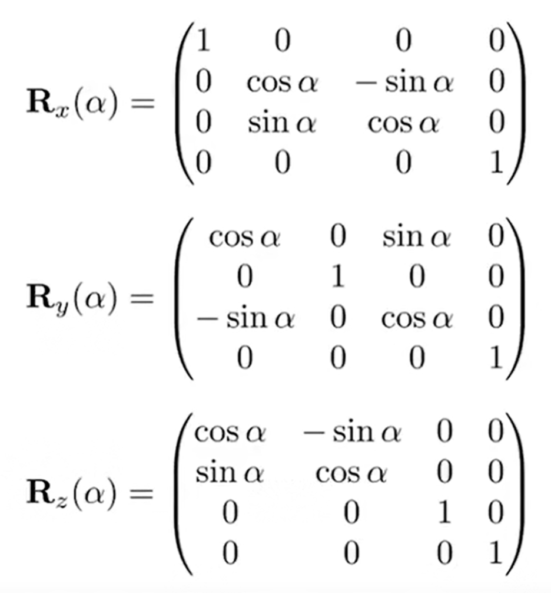
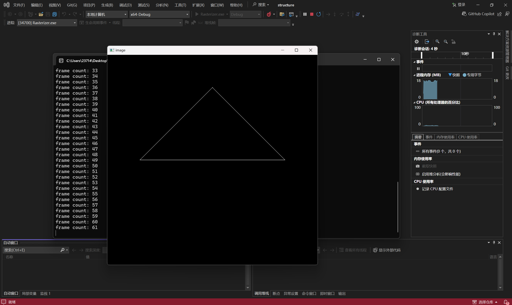
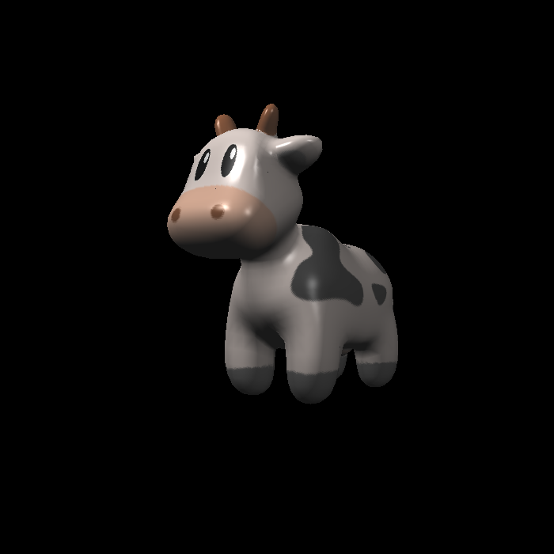

# Homework

## Homework 1

作业文件详见*Assignment1*。这里需要实现绕Z轴旋转的旋转矩阵，投影矩阵，和三角形绕过原点的任意一条轴旋转的矩阵，其实这三个矩阵课程中都有提及。

第一个矩阵：绕x y z轴旋转的旋转矩阵如下：



因此，依葫芦画瓢就可以了，注意输入的是角度，要转化为弧度制；并且，这个矩阵如何写进`Eigen::Matrix4f model`。那么问下可爱的kimi，就会知道（以下内容来自kimi）：

***Prompt：矩阵如何写进`Eigen::Matrix4f model`***

在C++中使用Eigen库来处理矩阵时，`Eigen::Matrix4f`是一个4x4浮点数矩阵的类型。如果你想将数据写入一个`Eigen::Matrix4f`类型的变量，你可以使用多种方法。以下是一些常见的方法：

1. **直接初始化**： 当你创建一个`Eigen::Matrix4f`变量时，你可以直接初始化它。

   ```cpp
   Eigen::Matrix4f model;
   model << 1, 0, 0, 0,
            0, 1, 0, 0,
            0, 0, 1, 0,
            0, 0, 0, 1; // 这是一个单位矩阵
   ```

2. **使用`.setIdentity()`**： 如果你想创建一个单位矩阵，可以使用`.setIdentity()`方法。

   ```cpp
   Eigen::Matrix4f model;
   model.setIdentity();
   ```

3. **使用`.setZero()`**： 如果你想要一个所有元素都是零的矩阵，可以使用`.setZero()`。

   ```cpp
   Eigen::Matrix4f model;
   model.setZero();
   ```

4. **使用`Eigen::Matrix4f::Zero()`或`Eigen::Matrix4f::Identity()`**： 这些是静态方法，用于创建特定类型的矩阵。

   ```cpp
   Eigen::Matrix4f model = Eigen::Matrix4f::Zero(); // 全零矩阵
   Eigen::Matrix4f model2 = Eigen::Matrix4f::Identity(); // 单位矩阵
   ```

5. **使用`Eigen::Matrix4f`的构造函数**： 你可以使用构造函数来创建一个具有特定值的矩阵。

   ```cpp
   Eigen::Matrix4f model(1, 2, 3, 4,
                         5, 6, 7, 8,
                         9, 10, 11, 12,
                         13, 14, 15, 16);
   ```

6. **使用`Eigen::Matrix4f`的赋值操作符**： 如果你已经有了一个数组或者另一个矩阵，你可以使用赋值操作符来填充`Eigen::Matrix4f`。

   ```cpp
   float data[16] = {1, 2, 3, 4, 5, 6, 7, 8, 9, 10, 11, 12, 13, 14, 15, 16};
   Eigen::Matrix4f model;
   model = Eigen::Map<Eigen::Matrix<float, 4, 4, Eigen::RowMajor>>(data);
   ```

7. **使用`Eigen::Matrix4f`的`.block()`方法**： 如果你需要将一个较小的矩阵或数组插入到一个更大的矩阵中的特定位置，可以使用`.block()`方法。

   ```cpp
   Eigen::Matrix4f model;
   Eigen::Matrix4f submatrix(1, 2, 3, 4,
                             5, 6, 7, 8);
   model.block<2, 2>(0, 0) = submatrix;
   ```

选择哪种方法取决于你的具体需求和你想要初始化的矩阵类型。

***Prompt：语法会自动识别换行就是矩阵新的一行吗？***

在Eigen库中，使用`<<`运算符来初始化或赋值矩阵时，确实可以利用换行符来表示矩阵的新一行。这种语法是Eigen提供的便捷方式，使得矩阵的初始化更加直观和易于阅读。

例如，你可以这样初始化一个`Eigen::Matrix4f`矩阵：

```cpp
Eigen::Matrix4f model;
model << 1, 0, 0, 0,
         0, 1, 0, 0,
         0, 0, 1, 0,
         0, 0, 0, 1; // 这是一个单位矩阵
```

在这个例子中，每行的末尾使用换行符`\n`来表示下一行的开始。Eigen会自动识别换行符，并将其视为新行的开始。

请注意，在使用`<<`运算符进行矩阵初始化时，你需要确保每行的元素数量与矩阵的列数相匹配，并且所有行的元素数量一致。如果行与列不匹配，编译器将会报错。

那么结果很明显了，`Eigen::Matrix4f get_model_matrix(float rotation_angle)`如下：

````c++
constexpr double MY_PI = 3.1415926;
Eigen::Matrix4f get_model_matrix(float rotation_angle)
{
    Eigen::Matrix4f model = Eigen::Matrix4f::Identity();
    // 角度转化为弧度
    float angle = rotation_angle / 180 * MY_PI;
    model << std::cos(angle), -std::sin(angle), 0, 0,
        std::sin(angle), std::cos(angle), 0, 0,
        0, 0, 1, 0,
        0, 0, 0, 1;
    return model;
}
````

第二个投影矩阵，输入的参数有点多，详见下图：

- eye_fov为field of view，垂直可视角（但是没说是fovY还是什么，我认为是fovY）
- aspect_ratio为宽高比
- zNear 就是近平面的Z值，而zFar是远平面到XOY的Z值（注意：都是负数）


而投影矩阵之前也是推过的，如下：


$M_{ortho}$中，后面一个矩阵代表平移，前一个代表缩放，是先平移后缩放，使得cuboid变成canonical cube。
$$
M_{persp} = 
\begin{pmatrix}
n & 0 & 0 & 0 \\
0 & n & 0 & 0 \\
0 & 0 & n+f & -nf \\
0 & 0 & 1 & 0 
\end{pmatrix}
\\
M_{persp} = M_{ortho}M_{persp\rightarrow{ortho}}
$$
但是如何用这些参数推出：$r-l(长)；t-b(宽)$呢？（$M_{ortho}$矩阵中的参数都是近平面的，因为在$persp\rightarrow ortho$的过程中，设定是近平面不变，而远平面大小变成近平面大小）下面这个图说明了一切：


因此代码如下：

````c++
Eigen::Matrix4f get_projection_matrix(float eye_fov, float aspect_ratio,
                                      float zNear, float zFar)
{
    Eigen::Matrix4f projection = Eigen::Matrix4f::Identity();
    // 套公式
    float n = zNear;
    float f = zFar;
    Eigen::Matrix4f M_persp_to_ortho;
    M_persp_to_ortho << n, 0, 0, 0,
		0, n, 0, 0,
		0, 0, n + f, -n * f,
		0, 0, 1, 0;
	// 依然需要角度转化为弧度制
    float fov = eye_fov * MY_PI / 180.0;
    // 套公式
    // 注意n要取负数！因为原来的zNear是负数！面朝-Z轴！
    float t = -n * tan(fov / 2);
    float b = -t;
    float r = aspect_ratio * t;
    float l = -r;

    Eigen::Matrix4f M_ortho, translation, scale;
    translation << 1, 0,  0,  -(r+l)/2,
             0, 1,  0,  -(t+b)/2,
             0, 0,  1,  -(n+f)/2,
             0, 0,  0,  1;
    scale << 2/(r-l),   0,  0,  0,
                0,  2/(t-b),   0,  0,
                0,  0,  2/(n-f),    0,
                0,  0,  0,  1;
    M_ortho =  scale * translation;           
    projection = M_ortho * M_persp_to_ortho ;
    return projection;
}
````

这里就能运行结果了，如下：（虽然运行起来的过程一波三折，后续会将）



那么关于提高项，罗德里格斯公式如下：
$$
R(n,\alpha) = cos(\alpha)\textbf{I} +
(1-cos(\alpha))nn^T + 
sin(\alpha)
\begin{pmatrix}
0 & -n_z & n_y \\
n_z & 0 & -n_x \\
-n_y & n_x & 0
\end{pmatrix}
$$
因此设计函数如下。`axis`是一个`Eigen::Vector3f`的变量（网络搜索对应的得到n向量x y z值的函数），带入公式，注意原来公式得到的是3×3，而作为旋转矩阵要略微变形：

````c++
Eigen::Matrix4f get_axis_model_matrix(float rotation_angle, Eigen::Vector3f axis)
{
    float angle = rotation_angle / 180 * MY_PI;
    Eigen::Matrix3f N = Eigen::Matrix3f::Identity();
    N << 0, -axis.z(), axis.y(),
        axis.z(), 0, -axis.x(),
        -axis.y(), axis.x(), 0;
    Eigen::Matrix3f rod = std::cos(angle) * Eigen::Matrix3f::Identity() + (1 - std::cos(angle)) * axis * axis.transpose() + std::sin(angle) * N;
    Eigen::Matrix4f model;
    
    model << rod(0, 0), rod(0, 1), rod(0, 2), 0,
        rod(1, 0), rod(1, 1), rod(1, 2), 0,
        rod(2, 0), rod(2, 1), rod(2, 2), 0,
        0, 0, 0, 1;
 
    return model;
}
````

好的，上面就是***homework1***的主要内容了。最后值得一提的是：究竟如何是cmake最后得到exe执行文件的。说实话，关于cmake的工程知识，我的知识储备很少，虽然CS100的植物大战僵尸大作业涉及到了这一部分的知识点。总之，在环境变量里面没有编入Eigen库的时候，我是如何处理opencv库的。

首先是opencv的下载，这一部分借鉴这个[CSDN博客](https://blog.csdn.net/m0_47472749/article/details/111328183)的第一步（博客里面分为三步），这个[知乎博客](https://zhuanlan.zhihu.com/p/402378383)的`安装opencv库的懒人版`。两个步骤都采取了，因此最后成功的时候，我不知道是哪一部分成功跑起来了(蚌埠住了)。

然后是修改`CMakeList.txt`，原先如下：

````c++
cmake_minimum_required(VERSION 3.10)
project(Rasterizer)

find_package(OpenCV REQUIRED)

set(CMAKE_CXX_STANDARD 17)

include_directories(/usr/local/include)

add_executable(Rasterizer main.cpp rasterizer.hpp rasterizer.cpp Triangle.hpp Triangle.cpp)
target_link_libraries(Rasterizer ${OpenCV_LIBRARIES})
````

但是不work，在`find_package(OpenCV REQUIRED)`这一步fail了。因此我改成了下面：

````c++
cmake_minimum_required(VERSION 3.10)
project(Rasterizer)

set(OpenCV_DIR "C:\\Users\\23714\\Desktop\\CG\\opencv\\build")
find_package(OpenCV REQUIRED)

set(CMAKE_CXX_STANDARD 17)

include_directories("C:\\Users\\23714\\Desktop\\CG\\eigen-3.4.0\\eigen-3.4.0")
include_directories("C:\\Users\\23714\\Desktop\\CG\\opencv\\build\\include")

add_executable(Rasterizer main.cpp rasterizer.hpp rasterizer.cpp Triangle.hpp Triangle.cpp)
target_link_libraries(Rasterizer ${OpenCV_LIBRARIES})
````

`"C:\\Users\\23714\\Desktop\\CG\\opencv\\build"`这两处的设计都是为了再三确保能够找到opencv，`C:\\Users\\23714\\Desktop\\CG\\eigen-3.4.0\\eigen-3.4.0`这一处的设计是为了找到Eigen库。

最后打开了visual studio 2022，打开这个文件夹，然后就莫名其妙开始cmake了，最后终于生成了exe文件。总之，这种方法是终于work了，虽然啼笑皆非，不知道为什么work了。。。

## Homework 2

这里需要手动进行光栅化。对于每一个投影到2D的三角形，需要创建一个bounding box，然后遍历box中的像素，判断是是否在三角形内部。这是对于逐个像素的，而对于逐个三角形进行操作的时候，像素需要比较该位置的插值深度值 (interpolated depth value)和深度 缓冲区 (depth buffer)的值，如果更近，那么就要更新深度和颜色。

首先是判断点是否在三角形内部：利用三个叉乘***是否符号一样***来进行判断。

````c++
static bool insideTriangle(float x, float y, const Vector3f* _v)
{   
    // TODO : Implement this function to check if the point (x, y) is inside the triangle represented by _v[0], _v[1], _v[2]
    Vector3f P = Vector3f(x,y,_v[0].z());
    Vector3f AB = _v[1] - _v[0];
    Vector3f AP = P - _v[0];
    auto cross1 = AB.cross(AP);
 
    Vector3f BC = _v[2] - _v[1];
    Vector3f BP = P - _v[1];
    auto cross2 = BC.cross(BP);
 
    Vector3f CA = _v[0] - _v[2];
    Vector3f CP = P - _v[2];
    auto cross3 = CA.cross(AP);
 
    if ((cross1.z() > 0 && cross2.z() > 0 && cross3.z() > 0) ||
        (cross1.z() < 0 && cross2.z() < 0 && cross3.z() < 0)) {
        return true;
    }
 
    return false;
}
````

而光栅化流程中，确定bounding box首先要初始化`minX maxX minY maxY`，这里我就随便拿第一个顶点进行初始化了，然后直到找出三个点中的`minX maxX minY maxY`，并且转化为整数。然后遍历框架中的每一个点，判断是不是在三角形内部，如果是的话，计算差值出来的深度，拿这个值和buffer里面的比较，如果这里的深度跟小，说明更近，应该更新颜色和深度buffer。

````c++
void rst::rasterizer::rasterize_triangle(const Triangle& t) {
    auto v = t.toVector4();
    float minX=t.v[0].x(), maxX=t.v[0].x(), minY=t.v[0].y(), maxY=t.v[0].y();

    for(auto& v : t.v)
    {   
        minX=std::min(minX, v.x());
        maxX=std::max(maxX, v.x());
        minY=std::min(minY, v.y());
        maxY=std::max(maxY, v.y());
    }

    for (int y = floor(minY); y < ceil(maxY); y++) {
        for (int x = floor(minX); x < ceil(maxX); x++) {
            if (!insideTriangle(x + 0.5, y + 0.5, t.v)) {continue;}

            auto Barycentric2D = computeBarycentric2D(x, y, t.v);
            float alpha = std::get<0>(Barycentric2D), beta = std::get<1>(Barycentric2D), gamma = std::get<2>(Barycentric2D);
            float w_reciprocal = 1.0 / (alpha / v[0].w() + beta / v[1].w() + gamma / v[2].w());
            float z_interpolated = alpha * v[0].z() / v[0].w() + beta * v[1].z() / v[1].w() + gamma * v[2].z() / v[2].w();
            z_interpolated *= w_reciprocal;
 
            auto ind = get_index(x, y);
            if (depth_buf[ind] > z_interpolated) {
                depth_buf[ind] = z_interpolated;
                set_pixel(Eigen::Vector3f(x, y, z_interpolated), t.getColor());
            }
        }
    }
}
````

如果要写出上述的代码，需要理解`int rst::rasterizer::get_index`用作buffer vector的引索。最后效果如下：


### Homework 3

在之前，光栅化中一个像素的颜色仅仅是由原三角形决定的（当然，是z_interpolated最近的三角形），但是实际中，颜色不仅仅由它决定，还由法向量、纹理颜色决定。因此，首先是要在上一次作业的基础上，写出支持纹理、法向量等信息，且像素中心点颜色由三角形三点插值得来的程序。插值公式如下：
$$
(x, y) = \alpha A + \beta B + \gamma C \\
\alpha + \beta + \gamma = 1 \\
\alpha, \beta ,\gamma >0
$$


````c++
void rst::rasterizer::rasterize_triangle(const Triangle& t, const std::array<Eigen::Vector3f, 3>& view_pos) 
{
    auto v = t.toVector4();
    float minX=t.v[0].x(), maxX=t.v[0].x(), minY=t.v[0].y(), maxY=t.v[0].y();

    for(auto& v : t.v)
    {   
        minX=std::min(minX, v.x());
        maxX=std::max(maxX, v.x());
        minY=std::min(minY, v.y());
        maxY=std::max(maxY, v.y());
    }
    for (int y = floor(minY); y < ceil(maxY); y++) {
        for (int x = floor(minX); x < ceil(maxX); x++) {
            if (insideTriangle(x + 0.5, y + 0.5, t.v)) { // 在三角形里面
                // 利用注释的代码，求重心信息
                auto Barycentric2D = computeBarycentric2D(x + 0.5, y + 0.5, t.v);
                // 这里的三个参数就对应的是公式中的三个参数
                float alpha = std::get<0>(Barycentric2D), beta = std::get<1>(Barycentric2D), gamma = std::get<2>(Barycentric2D);
                float Z = 1.0 / (alpha / v[0].w() + beta / v[1].w() + gamma / v[2].w());
                float zp = alpha * v[0].z() / v[0].w() + beta * v[1].z() / v[1].w() + gamma * v[2].z() / v[2].w();
                zp *= Z; // zp就是之前的z_interpolated
                
                if (zp < depth_buf[get_index(x, y)]){
                    depth_buf[get_index(x, y)] = zp;
                    // 根据提示注释，调用插值函数
                    auto interpolated_color = interpolate(alpha, beta, gamma, t.color[0], t.color[1], t.color[2], 1);
                    auto interpolated_normal = interpolate(alpha, beta, gamma, t.normal[0], t.normal[1], t.normal[2], 1);
                    auto interpolated_texcoords = interpolate(alpha, beta, gamma, t.tex_coords[0], t.tex_coords[1], t.tex_coords[2], 1);
                    auto interpolated_shadingcoords = interpolate(alpha, beta, gamma, view_pos[0], view_pos[1], view_pos[2], 1);
                    // 将上述的信息都注入pixel_color，同样借助注释
                    fragment_shader_payload payload(interpolated_color, interpolated_normal.normalized(), interpolated_texcoords, texture ? &*texture : nullptr);
                    payload.view_pos = interpolated_shadingcoords;
                    auto pixel_color = fragment_shader(payload);
				   // 和上一次一样，该像素点终于赋予了一个颜色值
                    Vector2i point;
                    point << x, y;
                    set_pixel(point, pixel_color);
                }
            }
        }
    } 
}
````

将`get_projection_matrix()`函数从上一次作业复制过来，可以`./Rasterizer output.png normal`来查看***仅仅额外补充法向量信息之后的图片***。


那么接下来如何加入光照，实现`phong_fragment_shader()`函数。首先回归一下blinn-phong模型:


因此在函数中实现这些参数，最后实现光照的影响：

````c++
Eigen::Vector3f phong_fragment_shader(const fragment_shader_payload& payload)
{
    Eigen::Vector3f ka = Eigen::Vector3f(0.005, 0.005, 0.005);
    Eigen::Vector3f kd = payload.color;
    Eigen::Vector3f ks = Eigen::Vector3f(0.7937, 0.7937, 0.7937);

    auto l1 = light{{20, 20, 20}, {500, 500, 500}};
    auto l2 = light{{-20, 20, 0}, {500, 500, 500}};

    std::vector<light> lights = {l1, l2};
    Eigen::Vector3f amb_light_intensity{10, 10, 10};
    Eigen::Vector3f eye_pos{0, 0, 10};

    float p = 150;

    Eigen::Vector3f color = payload.color;
    Eigen::Vector3f point = payload.view_pos;
    Eigen::Vector3f normal = payload.normal;

    Eigen::Vector3f result_color = {0, 0, 0};
    // 注意这里是RGB三个通道都结合在这个参数里面，因此图中的公式是element-wise product
    for (auto& light : lights)
    {
        // 开始实现一系列的向量，注意归一化
        Eigen::Vector3f l = (light.position - point).normalized();
        Eigen::Vector3f v = (eye_pos - point).normalized();
        Eigen::Vector3f h = (l + v).normalized();
        Eigen::Vector3f n = normal.normalized();
 
        //ambient 环境光
        Eigen::Vector3f la = ka.cwiseProduct(amb_light_intensity);
        //diffuse 漫反射
        Eigen::Vector3f ld = kd.cwiseProduct((light.intensity / (light.position - point).dot(light.position - point))) * std::max(0.0f, n.dot(l));
        //specular 镜面反射 高光
        Eigen::Vector3f ls = ks.cwiseProduct((light.intensity / (light.position - point).dot(light.position - point))) * std::pow(std::max(0.0f, n.dot(h)),p);
        result_color += la + ld + ls;
    }

    return result_color * 255.f;
}
````

最后`.\Rasterizer.exe phong.png phong`的结果是：


最后，贴上纹理，实现`texture_fragment_shader()`，***将纹理颜色视为公式中的 kd***，实现 Texture Shading Fragment Shader。

````c++
Eigen::Vector3f texture_fragment_shader(const fragment_shader_payload& payload)
{
    Eigen::Vector3f return_color = {0, 0, 0};
    if (payload.texture)
    {
        // TODO: Get the texture value at the texture coordinates of the current fragment
        // getcolor返回的是color[0][1][2]
        // fragment_shader_payload在shader头文件中定义的，其中定义了tex
        return_color = payload.texture->getColor(payload.tex_coords.x(), payload.tex_coords.y());
    }
    Eigen::Vector3f texture_color;
    texture_color << return_color.x(), return_color.y(), return_color.z();
 
    Eigen::Vector3f ka = Eigen::Vector3f(0.005, 0.005, 0.005);
    Eigen::Vector3f kd = texture_color / 255.f;
    Eigen::Vector3f ks = Eigen::Vector3f(0.7937, 0.7937, 0.7937);
 
    auto l1 = light{{20, 20, 20}, {500, 500, 500}};
    auto l2 = light{{-20, 20, 0}, {500, 500, 500}};
 
    std::vector<light> lights = {l1, l2};
    Eigen::Vector3f amb_light_intensity{10, 10, 10};
    Eigen::Vector3f eye_pos{0, 0, 10};
 
    float p = 150;
	// 这里颜色换成了纹理上的颜色
    Eigen::Vector3f color = texture_color;
    Eigen::Vector3f point = payload.view_pos;
    Eigen::Vector3f normal = payload.normal;
 
    Eigen::Vector3f result_color = {0, 0, 0};
 
    for (auto& light : lights)
    {
        Eigen::Vector3f l = (light.position - point).normalized();
        Eigen::Vector3f v = (eye_pos - point).normalized();
        Eigen::Vector3f h = (l + v).normalized();
        Eigen::Vector3f n = normal.normalized();
 
        //ambient 环境光
        Eigen::Vector3f la = ka.cwiseProduct(amb_light_intensity);
        //diffuse 漫反射
        Eigen::Vector3f ld = kd.cwiseProduct((light.intensity / (light.position - point).dot(light.position - point))) * std::max(0.0f, n.dot(l));
        //specular 镜面反射 高光
        Eigen::Vector3f ls = ks.cwiseProduct((light.intensity / (light.position - point).dot(light.position - point))) * std::pow(std::max(0.0f, n.dot(h)),p);
        result_color += la + ld + ls;	
    }
 
    return result_color * 255.f;
}
````

`.\Rasterizer.exe texture.png texture`之后，结果如下：



之后关于bump和displacement的内容略过。
