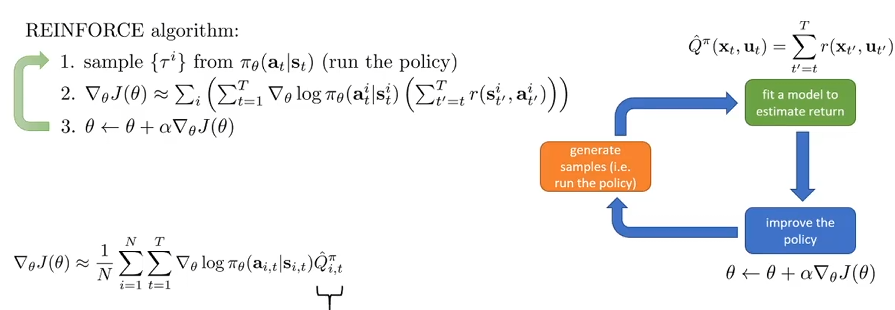
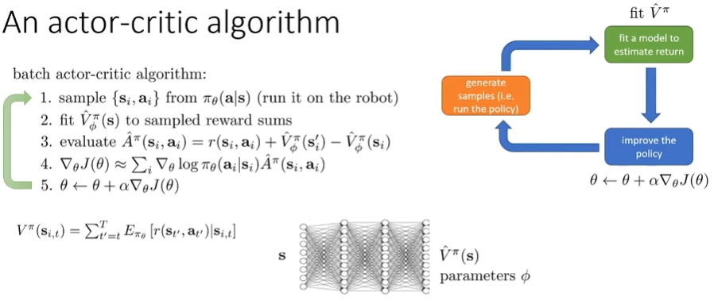
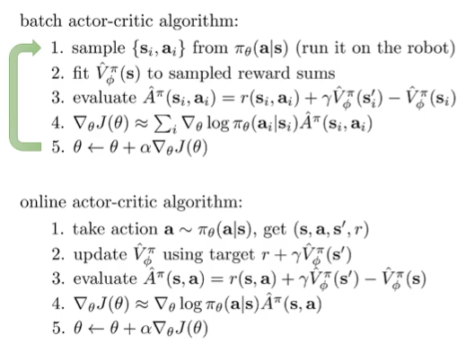
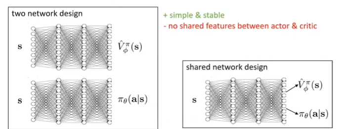
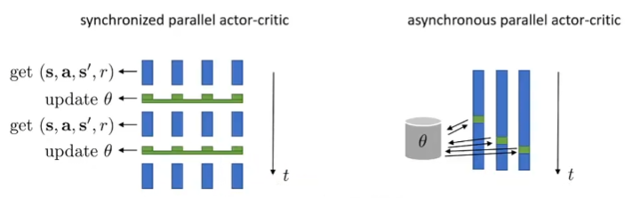
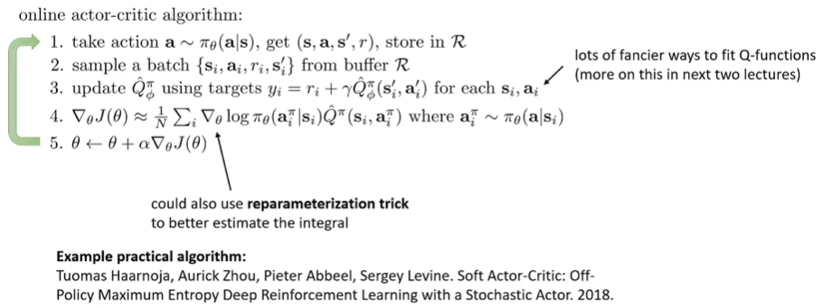

# Actor-Critic Algorithms

## Recap

Actor-Critic基于Policy Gradient，因此在此回顾策略梯度的方法。

上述图片高度概括了policy gradient的核心步骤：首先是基于当前的参数进行trajectories的采样，它对应橙色部分生成样本；然后根据采集到的数据计算reward to go，然后各自乘上对应的概率的对数，其中计算reward to go对应的就是绿色部分的fit the model；最后执行参数的更新，根据优化的思想，利用之前计算出来的目标函数的倒数式子的结果来进行更新。

原来的reward to go实际上应该代表的是之后的时间步的reward的期望：
$$
\hat{Q}_{i,t} \sim \mathbb{E}_{\pi} \left[ r(S_{t'}, a_t) \mid S_t, a_t \right]_{t'=t}
$$
但是现在用了样本来近似上面左边的式子，很明显，一个样本用来近似这种方式的方差太大了。我们其实很想要得到的是该时间步的Q-value：
$$
% 第一部分：Q函数定义

Q(s_t, a_t) = \mathbb{E}_{\tau \sim \pi} \left[ \sum_{t'=t}^{\infty} r(s_{t'}, a_t) \mid s_t, a_t \right]
\quad \text{(true expected reward-to-go)}

\\
% 第二部分：策略梯度近似

\nabla_\theta J(\theta) \approx \mathbb{E}_{\tau \sim \pi_\theta} \left[ \sum_t \nabla_\theta \log \pi_\theta(a_{i,t} \mid s_{i,t}) Q(s_{i,t}, a_{i,t}) \right]
$$
有了上述，在baseline的介绍中，我们可以采取Q-value的平均值，然后所有的Q-value减去平均值，从而降低方差。当然，也可以采取该状态的关于action的Q-value的期望值用来表示状态的价值函数，那么减去的就不是平均值，而是这个状态的价值函数了。我们定义一个状态的一个action所对应的Q-value减去这个状态的价值函数的值为优势函数：
$$
A^\pi(s_t, a_t) = Q^\pi(s_t, a_t) - V^\pi(s_t) \quad \text{(how much better $a_t$ is)}
$$
所以advantage function越精确，方差越低。

## What to fit

在上述的介绍中，关于fit the model中fit的指标，涉及到了三种：Q V A。那么fit什么指标更好呢？Q-value可以写成当前这一步的reward加上下一步的state的分布下的State value function的期望。**这里，我们考虑让样本来近似这个期望**。因此我们可以重新近似地写一些式子了：
$$
Q^{\pi}(s_t, a_t) \approx r(s_t, a_t) + V^\pi(s_{t+1}) 
\\
A^\pi(s_t, a_t)\approx r(s_t, a_t) + V^\pi(s_{t+1}) - V^\pi(s_t)
$$
所以let's just fit $V^\pi(s)$！虽然这不是actor-critic算法的唯一选项，但是之后的展开都讲采用这个去fit。常见的估计$V^\pi(s)$的方式是用神经网络，输入的是state的参数化表示，输出的是value值，我们称这个神经网络含有的参数为$\phi$。

现在考虑的目标函数是：
$$
\begin{aligned}
V^*(s_t) &= \mathbb{E}_{\tau \sim \pi} \!\left[ \sum_{t'=t}^{\infty} r(s_{t'}, a_{t'}) \Bigm| s_t \right], \\[6pt]
J(\theta) &= \mathbb{E}_{s_1 \sim p(s_1)} \!\left[ V^{\pi_\theta}(s_1) \right].
\end{aligned}
$$

## Function Approximation

对于一个特定的policy下的一个状态的state value，我们可以用轨迹在这个状态点之后的所有的reward的和来进行近似。我们希望有多条轨迹能够经过这个state，从而提供多个reward的总和，其取平均能够给出一个更好的state value的近似，但是实际中是并不可行的，因为reset到那个状态然后继续展开实验不是很方便。

但是有了神经网络的帮助，假设有两个十分相似的state，那么在输出对应的state value的时候，两个state的结果或者是ground truth会互相渗透，那么就知道了在两个相似的状态，给出的value应该是相近的。这是神经网络用于拟合state function的合理性的直观理解。最重要的是，这样克服了无法rewind的劣势，因为根本无需rewind。那么为了训练这个神经网络，采用的训练集和损失函数如下：
$$
\text{training data: } \left\{ \left( \mathbf{s}_{i,t}, y_{i,t}= \sum_{t'=t}^{T} r(\mathbf{s}_{i,t'}, \mathbf{a}_{i,t'}) \right) \right\}
\\
\text{supervised regression: } \mathcal{L}(\phi) = \frac{1}{2} \sum_{i} \left\| \hat{V}^{\pi}_{\phi}(\mathbf{s}_i) - y_i \right\|^2
$$
这种方式同样能够减少方差，因为相似的state可以认为是对应的value，在训练期间会互相渗透（leak），从而实际上是可以更好的具有泛化能力，避免了用单样本来进行近似的情况。

那么在fit的时候，对于一个时间步的state and action，我们要$Q^{\pi}(s_t, a_t) \approx r(s_t, a_t) + V^\pi(s_{t+1})$，那么其实可以在训练的时候就把当前步骤的reward加上：
$$
\text{training data: } \left\{ \left( \mathbf{s}_{i,t}, y_{i,t}= r(\mathbf{s}_{i,t}, \mathbf{a}_{i,t}) + \hat{V}^{\pi}_{\phi}(\mathbf{s}_{i,t+1}) \right) \right\}
\\
\text{supervised regression: } \mathcal{L}(\phi) = \frac{1}{2} \sum_{i} \left\| \hat{V}^{\pi}_{\phi}(\mathbf{s}_i) - y_i \right\|^2
$$

## From Evaluation to Actor Critic

一个actor-critic算法如上：不同的是fit的model是state value function。fit的方式可以是神经网络的推理，也可以是单样本作为近似吗，后者也被称为Monte Carlo法。

但是有一个问题：如果T是无穷呢？state value function在绝大部分的情况下会无穷大。simple trick：better to get rewards sooner than later。在这里我们引入折扣因子（discount factor）：
$$
y_{i,t} \approx r(s_{i,t}, \mathbf{a}_{i,t}) + \gamma \hat{V}^\pi_\phi(s_{i,t+1})
$$
这里的$\gamma$在0-1之间，通常来说0.99很好。从MDP的角度理解这个因子，那就是在state转换的时候，有一定的概率转换到terminal state。

引入了之后，对应的model fit有什么改变吗？对于训练神经网络来说，无非就是label要进行略微的修改：
$$
\begin{align*}
y_{i,t} &\approx r(s_{i,t}, \mathbf{a}_{i,t}) + \gamma \hat{V}^\pi_\phi(s_{i,t+1}) \\
\mathcal{L}(\phi) &= \frac{1}{2} \sum_i \left\| \hat{V}^\pi_\phi(s_i) - y_i \right\|^2
\end{align*}
$$
对于目标函数梯度的改写：
$$
\nabla_\theta J(\theta) \approx \frac{1}{N} \sum_{i=1}^{N} \sum_{t=1}^{T} \nabla_\theta \log \pi_\theta (\mathbf{a}_{i,t} | \mathbf{s}_{i,t}) \left( \sum_{t'=t}^{T} \gamma^{t'-t} r(\mathbf{s}_{i,t'}, \mathbf{a}_{i,t'}) \right)
$$
最后完整给出引入了折扣因子的actor-critic算法：

## Architecture Design

之前用神经网络表示了state value function，但是关于$\theta$是如何输出当下state的action distribution是没有讨论的。这经常也是用神经网络表示的。

左边将两个神经网络单独表示出来，这样训练简单而稳定，但是不认为高效，因为很明显state的高维特征空间对于state value and action decision making来说都是有用的。因此有右边这种变体，前面shared部分被认为是对state的高维特征的学习，而两个任务头输出对应的内容。

在online的算法中，拿出一个样本，然后就更新参数，假如说是并行计算的，那么就需要设置检查点来确保所有的采样和fit都完成了，然后才一起更新一次。但是可以异步，尽管两个线程更新的时候，生成样本的参数可能是不一样的，但是因为参数更新差异不大，上述的影响可以忽略，并且发现异步带来的效率提升非常的大。

