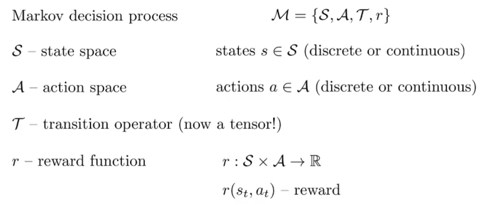
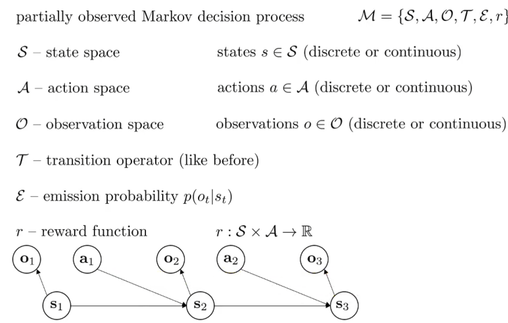
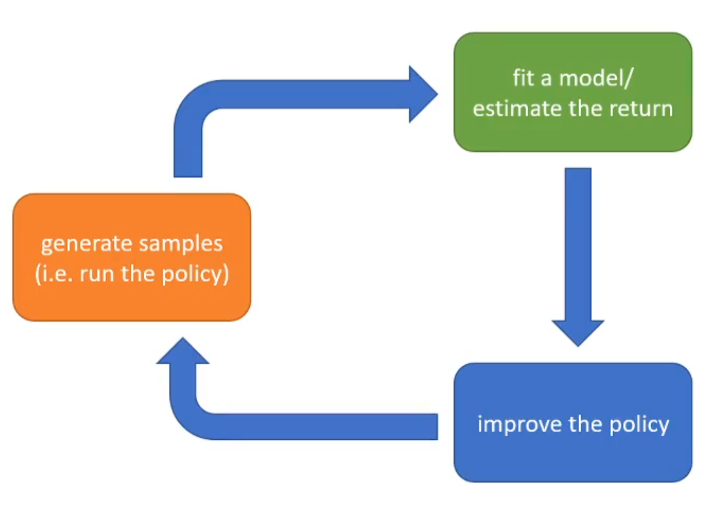
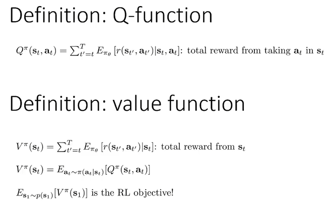
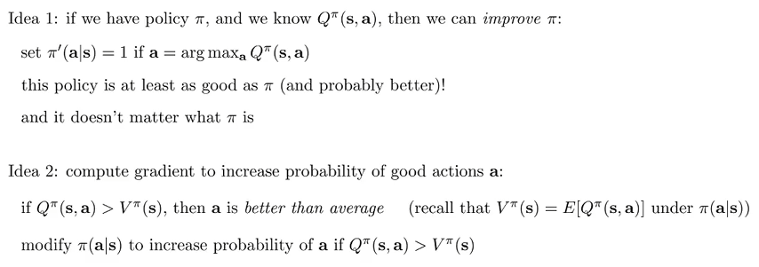
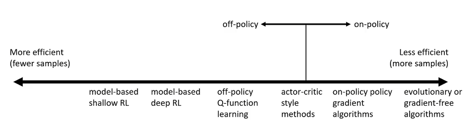
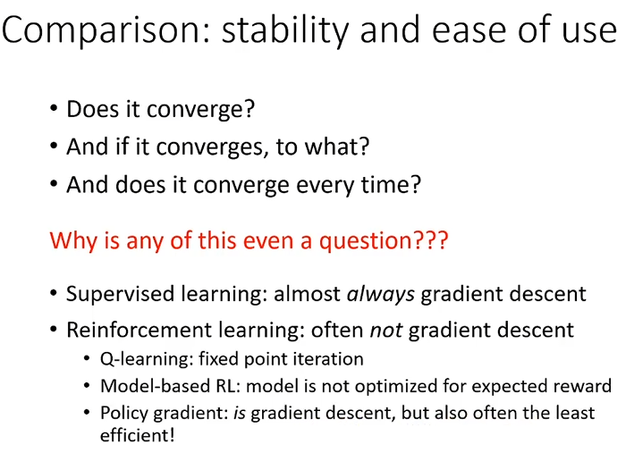
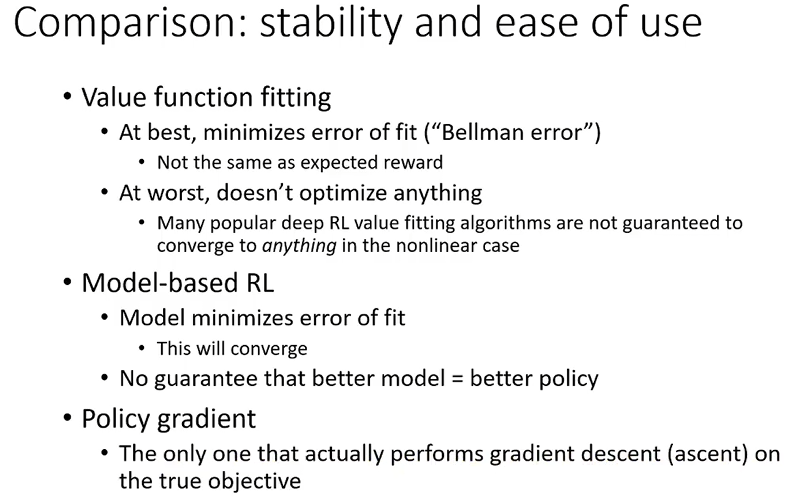
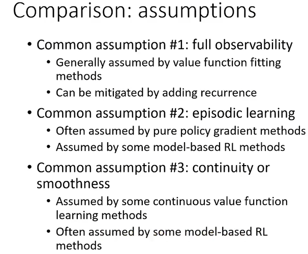

# Introduction to Reinforcement Learning

## Definitions

在上一节中，我们把在给定$o_t$下的$a_t$的分布称为policy策略，用$\pi$表示，并且用$\theta$下标表示策略的参数。$s_t$类似于隐状态变量，但是state and observation的最大区别其实是：观察不一定满足马尔科夫性质，但是状态要满足马尔科夫性质！$s_{t+1}$与其他变量独立，当给定了$s_t,a_t$。

$\pi_{\theta}(a_t|o_t)$称为policy，其中能观察到的仅仅是observation，而对于fully observed scenario，则被认为可以观测到state，那么策略就变成了$\pi_{\theta}(a_t|s_t)$。

上一节介绍了Imitation Learning，通过专家提供的'ground truth'来用神经网络建模Policy，那么这一届将正式介绍强化学习的框架，从而使得*即使没有专家样本*，依然可以学习policy。

## Markov Decision Process

在Imitation Learning中，action的好坏是用专家提供的'ground truth'来衡量的。但是其实可以设计一种reward function来衡量在一个state下采取某种action的奖励，以衡量当前行动的好坏。比如说在一条通路上，开的很快reward很高，但是合理地，如果撞车了reward会非常低，而开得快会当前获得很高的奖励，但是有可能会lead to低reward的撞车。其实这是强化学习的核心，就是如何眼光放长远地获得更高的reward！

和CS181很相似地，把$s, a, r(s,a),p(s'|s,a)$的问题称为Markov Decision Process（马尔科夫决策过程）。

那么强化学习的objective可以如下定义。首先，我们需要定义轨迹(trajectory):假设发生了有限时间步T，假设fully observed，那么一个trajectory由T个state and action组成。一个轨迹的概率根据马尔科夫性质如下：
$$
p_\theta(\tau)=p_\theta(\mathbf{s}_1, \mathbf{a}_1, \ldots, \mathbf{s}_T, \mathbf{a}_T) = p(\mathbf{s}_1) \prod_{t=1}^{T} \pi_\theta(\mathbf{a}_t | \mathbf{s}_t) p(\mathbf{s}_{t+1} | \mathbf{s}_t, \mathbf{a}_t)
$$
那么policy的优化目标就是在轨迹分布下，取得最大的reward期望：
$$
\theta^\star = \arg\max_\theta E_{\tau \sim p_\theta(\tau)} \left[ \sum_t r(\mathbf{s}_t, \mathbf{a}_t) \right]
$$
如果把一个时间步的state and action打包起来，那么整个state and action trajectory可以视为马尔科夫链。因此对于上述的reward expectation的式子可以进行改写，不再是以trajectory分布视角下看total reward，而是每一个时间步就考虑reward expectation：
$$
\arg\max_\theta \sum_{t=1}^{T} E_{(\mathbf{s}_t, \mathbf{a}_t) \sim p_\theta(\mathbf{s}_t, \mathbf{a}_t)} \left[ r(\mathbf{s}_t, \mathbf{a}_t) \right]
$$
那么如果时间步趋于无穷呢？那么奖励可能就是无穷大了。那么常见的有两种方式：第一种是平均奖励期望，即最终的奖励表达式除以T；第二种是折扣因子。那么在如果把state and action的打包视为$\mu$，其transition model为$T$，那么在无穷步的情境中，最终$\mu_t$会converge吗？即$\mu = T\mu$。在遍历性(ergodicity)和无周期性(aperiodic)的假设下，我们可以证明平稳(stationary)分布的存在，其中遍历性是从任何一个初始化的$\mu_0$都能最终收敛到平稳分布。那么如果是考虑第一种的平均奖励期望，那么在T为无穷的情况下，最终趋于平稳分布，那么考虑的其实仅仅是平稳分布下的奖励期望：
$$
\theta^\star = \arg\max_\theta \frac{1}{T} \sum_{t=1}^{T} E_{(\mathbf{s}_t, \mathbf{a}_t) \sim p_\theta(\mathbf{s}_t, \mathbf{a}_t)} [r(\mathbf{s}_t, \mathbf{a}_t)] \rightarrow E_{(\mathbf{s}, \mathbf{a}) \sim p_\theta(\mathbf{s}, \mathbf{a})} [r(\mathbf{s},\mathbf{a})]\\\mu=p_{\theta}(s,a)\rightarrow stationary\ distribution
$$
最后说明两点：虽然强调在一个action中获得最高的reward，但是RL其实一直强调奖励期望；另外，虽然奖励看起来是离散的，比如说+1 -1等，但是在概率的期望式子中，反而变的关于policy parameter可导。这也就是为什么RL的优化可以像DL那样smooth。

## Algorithms

在这一部分将会介绍强化学习不同算法的***共同的范式***：The anatomy of reinforcement learning algorithm。如下图所示：

首先是生成样本，注意这里的样本不是专家提供的优质样本，而是在当前policy运行而产生的结果。绿色部分是嵌入建模(fit a model)，因为其实RL建模了reward and policy，而不同的建模对应着不同的蓝色部分，政策改进。举个例子：如果policy的learning objective为最大化期望收益：
$$
J(\theta) = E_{\pi} \left[ \sum_{t} r_{t} \right] \approx \frac{1}{N} \sum_{i=1}^{N} \sum_{t} r_{t}^{i}
$$
那么生成样本之后（橙色），得到的一系列的reward将会代入上述的公式（绿色），最终梯度更新参数（蓝色）：
$$
\theta \leftarrow \theta + \alpha \nabla_\theta J(\theta)
$$
在上述的三个环节中哪一个是最expensive的？如果样本的产生在现实生活中比较难，那么就是橙色；但是同时部分的任务中，比如下棋，那么这一部分的成本反而不是很高了。对于绿色部分，假如说是刚才所介绍的最大期望收益，那么成本不高，因为其实就是summation；但是如果是用神经网络拟合给定一个时间步的state and action从而输出下一时间步的state，那么神经网络的inference时间成本就很高了。对于蓝色部分，如果是如刚才所介绍的更新参数方式，那么时间成本很低；但是如果是神经网络的反向传播，那么成本就相对较高。

## Value Function

将期望收益的公式进行改写：
$$
E_{\tau \sim p_{\theta}(\tau)} \left[ \sum_{t=1}^{T} r(s_t, a_t) \right] \\
E_{s_1 \sim p(s_1)} \left[ E_{a_1 \sim \pi(a_1 | s_1)} \left[ r(s_1, a_1) + E_{s_2 \sim p(s_2 | s_1, a_1)} \left[ E_{a_2 \sim \pi(a_2 | s_2)} \left[ r(s_2, a_2) + \ldots | s_2 \right] | s_1, a_1 \right] \right] \right] \\
Let\ Q(s_1, a_1) = r(s_1, a_1) + E_{s_2 \sim p(s_2 | s_1, a_1)} \left[ E_{a_2 \sim \pi(a_2 | s_2)} \left[ r(s_2, a_2) + \ldots | s_2 \right] | s_1, a_1 \right] \\
E_{\tau \sim p_{\theta}(\tau)} \left[ \sum_{t=1}^{T} r(s_t, a_t) \right] = E_{s_1 \sim p(s_1)} \left[ E_{a_1 \sim \pi(a_1 | s_1)} \left[ Q(s_1, a_1) | s_1 \right] \right]
$$
可见我们可以定义Q value，来更方便的来更新和表示：

那么如何利用这些工具呢？第一种思路是对于特定的policy，我们能够推出Q value，那么根据这个来改进policy（argmax）；第二种思路是对于一个state来说，如果一个action所对应的Q value值大于state value，那么说明这个action的收益超过了平均的收益，那么就应该修改在该state下该action的概率。具体介绍如下：

## Type of Algorithms

> 粗略的介绍

- Policy gradients: directly differentiate the above objective
- Value-based: estimate value function or Q-function of the optimal policy (no explicit policy)
- Actor-critic: estimate value function or Q-function of the current policy, use it to improve policy
- Model-based RL: estimate the transition model, and then...
  - Use it for planning (no explicit policy)
  - Use it to improve a policy
  - Something else

model based的核心是绿色部分建模和学习$p(s_{t+1}|s_t,a_t)$，而蓝色部分的改进有很多的可选项，而不同的Model-based算法就是在蓝色部分有差异，如下：

1. Just use the model to plan (no policy)
   - Trajectory optimization/optimal control (primarily in continuous spaces) – essentially backpropagation to optimize over actions
   - Discrete planning in discrete action spaces – e.g., Monte Carlo tree search
2. Backpropagate gradients into the policy
   - Requires some tricks to make it work
3. Use the model to learn a value function
   - Dynamic programming
   - Generate simulated experience for model-free learner

Value-based的绿色部分是state function or Q function，而蓝色部分就是利用这个信息来通过argmax的方式更新最优策略。

Direct Poliucy Gradients绿色部分对收益期望建模，而根据reward关于参数的公式提供的梯度更新式子来更新参数。

最后Actor-critic的绿色部分是state function or Q function，但是蓝色部分是利用这个信息来提供更精准的梯度和方式来更新参数。

上述的四种将会在之后一一介绍。

## Tradeoff Between Algorithms

- Different tradeoffs
  - Sample efficiency
  - Stability & ease of use
- Different assumptions
  - Stochastic or deterministic?
  - Continuous or discrete?
  - Episodic or infinite horizon?
- Different things are easy or hard in different settings
  - Easier to represent the policy?
  - Easier to represent the model?

sample efficiency指的是，对于一个算法来说，可能需要大量大量的样本才能够work，但是其他算法不需要这么多就能work。另外，sample efficiency考虑的最重要的因素是：算法是否是off-policy：

- Off policy: able to improve the policy without generating new samples from that policy
- On policy: each time the policy is changed, even a little bit, we need to generate new samples

比如说梯度更新，每一次进行了参数的更新，那么就需要重新进行样本的采样了。Emperically:

但是需要强调的是：Wall clock time（实际时间成本）和efficiency不是同一个概念。比如说样本采样可以通过模拟的方式高效实现的时候，可能光谱右边的算法反而比左边的计算上面来说更经济！

