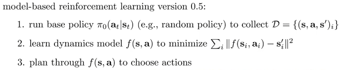
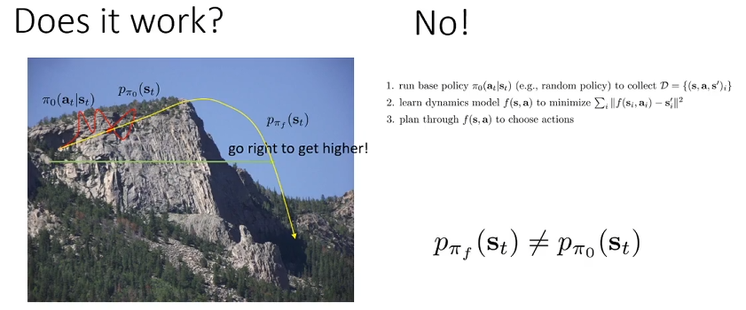
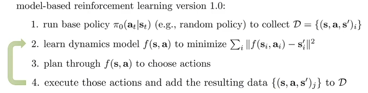
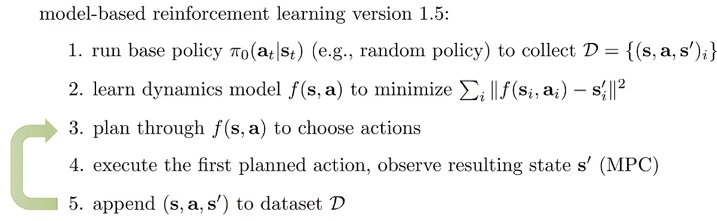
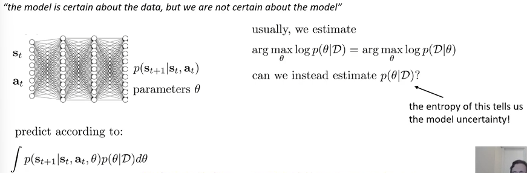
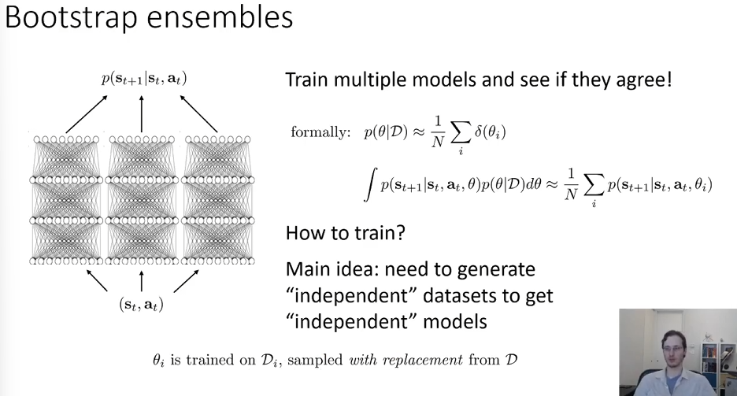
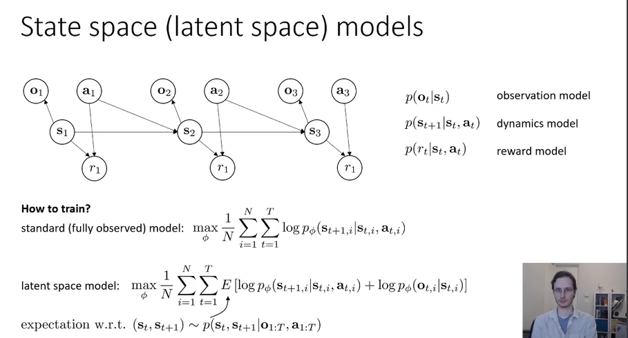
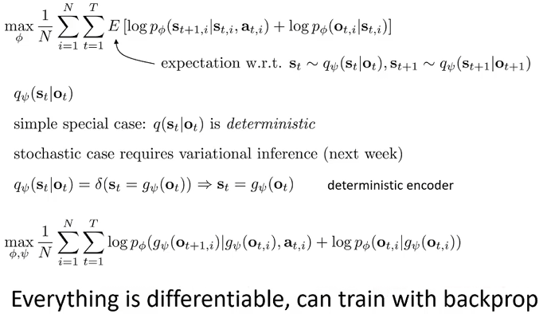
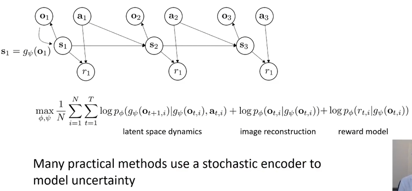
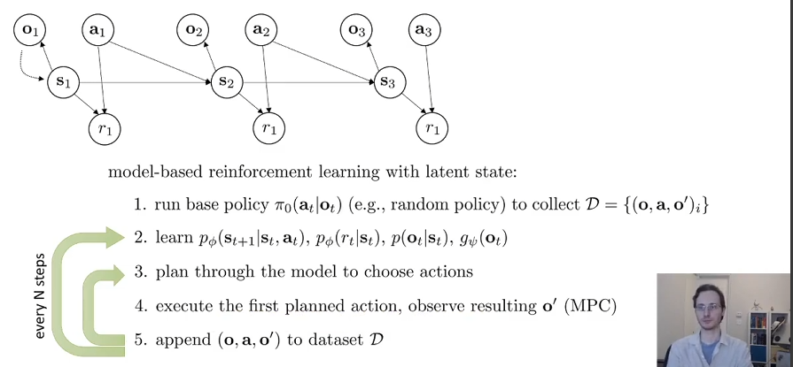

# Model Based RL

## Why learn the model（version 0.5&1.0&1.5）

如果我们知道了$f(s_t,a_t)=s_{t+1}$那么我们就可以使用这个来进行planning，选择出actions。所以model-based RL version 0.5如下：

那么这个版本能work吗？

通常不能。如图所示，在左边的山坡上，假如说一开始的策略是随机游走，然后发现往右走能够海拔升高，而我们的目标就是尽可能到高的地方。于是我们开始使用我们学到的transition model来choose actions，然后就落下悬崖了，面临一个从未遇到过的情况。因此实际上问题便是训练时与执行planning时的state distribution发生了偏移。这个问题在transition model用神经网络这个具有丰富expressiveness的工具来表示的情况下会加剧。

于是应该如何改进？我们考虑在执行过程中所见到的state-action-next state pair收集起来，然后放进数据库里面进一步进行训练。这能够缓解distribution shift的问题。

在1.0的第三步中，在学到的目前的policy下采取了一系列的actions，然后才加到数据集里面并更新policy。万一在采取一系列actions的过程中，发生了非常严重的事故呢？而这个事故本来可以是初期避免的呢？比如说开车的时候，直线上方向盘左打了2度，根据这个policy如果执行了几个时间步，那么就寄了。但是本应该一开始就避免掉！如何避免？那就是采取了一个action，比如左打2度，然后到达下一个state，然后立马这一个时间步的状态转移数据进入数据库然后更新policy，然后根据当前的state和学到的policy把这个问题纠正回来。

## Uncertainty in Model-Based RL

在model-based训练的初期，由于开始阶段的样本量过少，因此容易产生过拟合的情况。因此，需要克服过拟合，而一种方法就是引入uncertainty。不再考虑given当前状态和action的下一个可能的state，而是考虑下一个state的分布。这是很有必要的。

重要事项：

- Need to explore to get better
- Expected value is not the same as pessimistic value
- Expected value is not the same as optimistic value

如何训练一个uncertainty-aware model？我们希望考虑不确定性，那么就应该考虑的是条件概率。

一个很好的训练的方式范式是采用Bootstrap ensembles。许多个神经网络一起给出预测，然后majority vote。根据机器学习中的知识，要sample sub-dataset with replacement，给各自的神经网络训。

这个通常很work。并且神经网络数量一般来说很少（<10）。并且后来证明，resampling其实没有必要，因为SGD和随机初始化已经能够很好地让模型之间是独立学习的了。

## Algorithm for POMDP

如果是partially observed，首先要明确优化目标的改变：

为了训练model。原来是想最大化transition的似然，现在要加上emit的似然。

注意到，原来公式中的$p_{\phi}(s_{t+1,i} \mid s_{t,i}, a_{t,i})$其实很难表示，因为输入的长度在改变。因此我们采用另一个网络来直接预测当前步观测下的状态的分布：
$$
q_{\psi}(s_t \mid o_t)
$$
考虑reward model和$\psi$网络，优化目标如下：

根据这一点和partially observed的假设，修改version 1.5 for POMDP：

