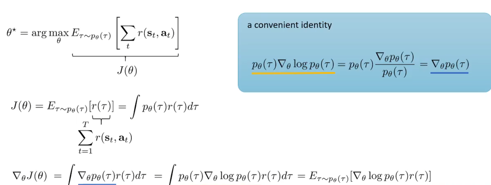
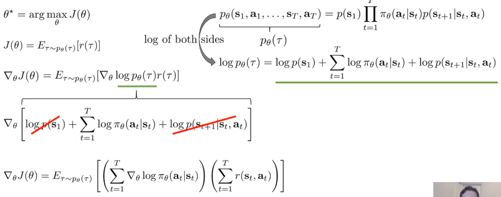
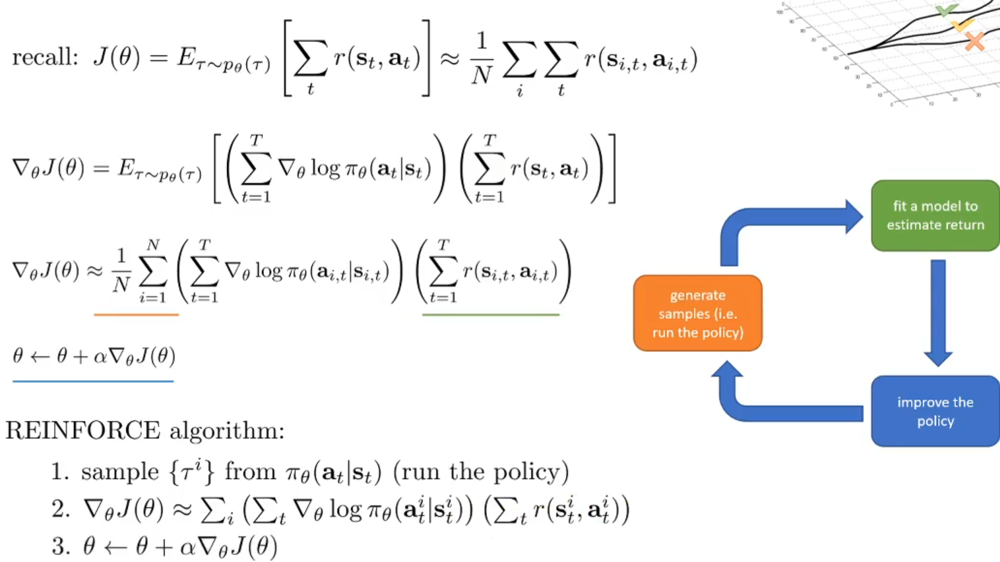
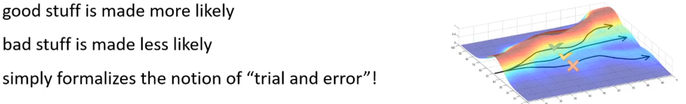
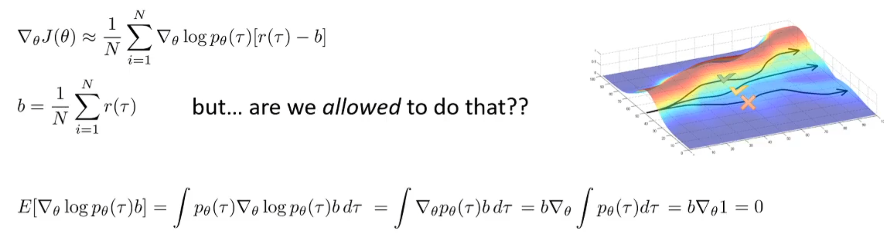
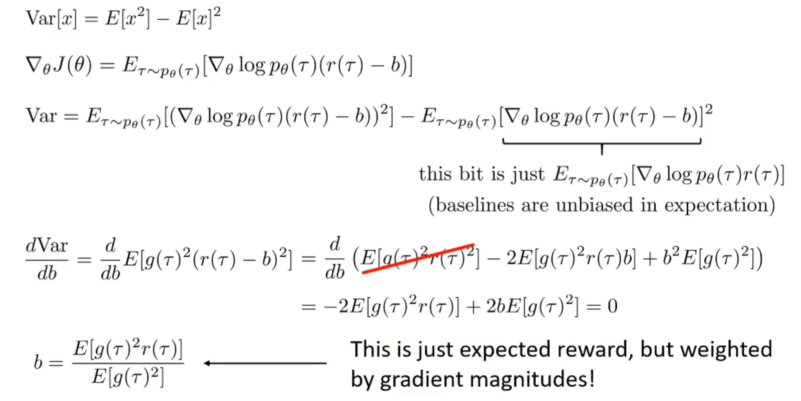
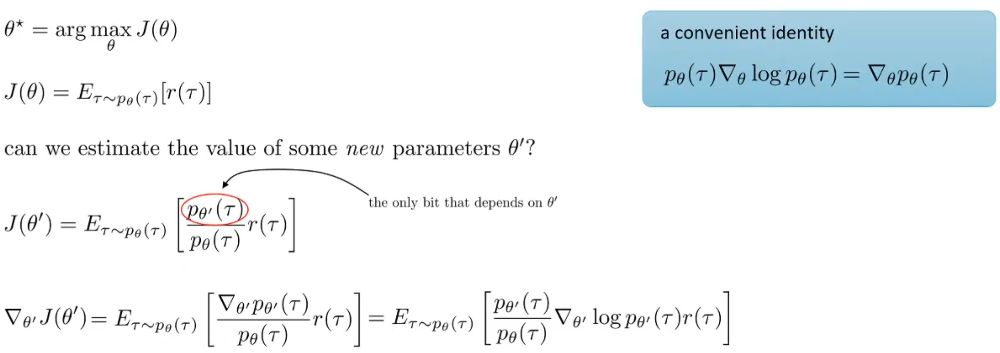
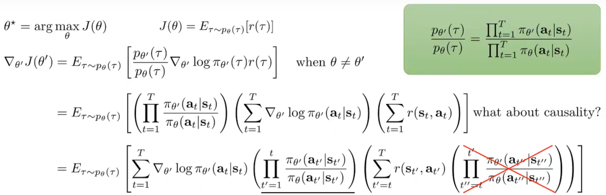
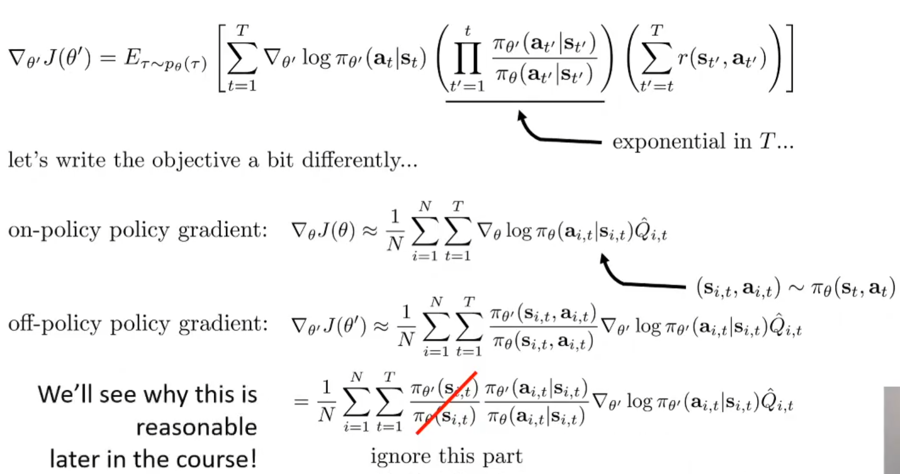

# Policy Gradient

## Algorithm

Policy Gradient的绿色部分是Average Expectation of Reward，而它的计算是使用样本结果来计算的：

> Recap：$$

$$
J(\theta) = \mathbb{E}_{\tau \sim p_\theta(\tau)} \left[ \sum_{t} r(\mathbf{s}_t, \mathbf{a}_t) \right] \approx \frac{1}{N} \sum_{i} \sum_{t} r(\mathbf{s}_{i,t}, \mathbf{a}_{i,t})
$$

这便是learning objective。那么有了目标函数，其梯度是更新参数的重要依据：

如上图的公式所述，目标是找到使得期望最大的参数$\theta^\star$，从而对目标函数对$\theta$求导。使用蓝框中的一个求导式子的技巧，替换导数中的式子，则可以得到：梯度式子其实是一个期望。直觉上理解，是$\nabla_\theta \log p_\theta(\tau) r(\tau)$的期望。

我们可以将$p_{\theta}(\tau)$的实际式子根据马尔科夫性质进行展开，则其对数将连乘转化了summation。那么可以注意到，transition model是完全与$\theta$无关的，初始状态的分布也是与它无关的，那么我们可以进一步的改写式子如下：

这么做的原因是为了更直观的求$\nabla_{\theta}logp_{\theta}(\tau)$。这样就有了Policy Gradient算法流程的sketch。如下：

## Understanding

Intuitively，这样的更新方式，会使得reward很高的一个时间步的state当时的policy action choice的似然概率提升。这是很符合直觉的，即再次遇到这个state的时候，选中样本中这个reward很高的action的概率上升。

另外，假设如果没有奖励机制的存在，那么根据MLE，如果learning objective是最大化似然，那么根据更新公式来看，其仅仅是根据后验拟合先验：
$$
\text{policy gradient: } \nabla_\theta J(\theta) \approx \frac{1}{N} \sum_{i=1}^N \left( \sum_{t=1}^T \nabla_\theta \log \pi_\theta(\mathbf{a}_{i,t} \vert \mathbf{s}_{i,t}) \right) \left( \sum_{t=1}^T r(\mathbf{s}_{i,t}, \mathbf{a}_{i,t}) \right)
\\
\text{maximum likelihood: } \nabla_\theta J_{\text{ML}}(\theta) \approx \frac{1}{N} \sum_{i=1}^N \left( \sum_{t=1}^T \nabla_\theta \log \pi_\theta(\mathbf{a}_{i,t} \vert \mathbf{s}_{i,t}) \right)
$$
但是后验拟合先验很明显没有考虑这个样本质量的高低，但是引入了reward之后，可以用作权重来进行调整。可见，Policy Gradient的更新公式可以视为最大似然目标梯度的一种加权版本。

同时，如果是partially observed scenario，那么reward式子其实是不变的，只不过是似然中的state要改成observation，然后其他的式子都不需要改变了。这是为什么？因为Markov性质在更新式子中其实没有体现。

## Reducing Variance

### Causality Trick

但是Policy Gradient也不是无敌的。它的表现很大程度上取决于样本的数量，因为it suffers from high variantion，只有样本数量上去了，方差才会下降到合适范围。接下来将会介绍降低方差的方式。

首先先引入因果性的概念：Causality: policy at time *t*′ cannot affect reward at time *t* when *t*<*t*′

我们可以对梯度公式进行进一步的改写（根据分配率）：
$$
\nabla_\theta J(\theta) \approx \frac{1}{N} \sum_{i=1}^N \sum_{t=1}^T \nabla_\theta \log \pi_\theta(\mathbf{a}_{i,t} \vert \mathbf{s}_{i,t}) \left( \sum_{t'=1}^T r(\mathbf{s}_{i,t'}, \mathbf{a}_{i,t'}) \right)
$$
由于因果性的概念，对于一个对数似然概率的权重，在t之前的时间步，其partial total rewareds其实都不影响（感性理解，对于t时的policy action choice，前面的reward其实与这个choice无关，其当然不该算进权重内），因此可以***近似***把后面的reward项改成不再是整个trajectory的总reward了，而是t之后的总reward：
$$
\nabla_\theta J(\theta) \approx \frac{1}{N} \sum_{i=1}^N \sum_{t=1}^T \nabla_\theta \log \pi_\theta(\mathbf{a}_{i,t} \vert \mathbf{s}_{i,t}) \left( \sum_{t'=t}^T r(\mathbf{s}_{i,t'}, \mathbf{a}_{i,t'}) \right)
$$
通常把$\sum_{t'=t}^T r(\mathbf{s}_{i,t'}, \mathbf{a}_{i,t'})$这一项称为*'reward to go'*，常用$\hat{Q}_{i,t}$来表示。这样一来，会将reward项的大小下降，而数值下降会带来方差的缩小。

### Baseline

为了衡量后人发明的种种降低方差的方式，我们需要设置一个baseline，其performance是新方法的最低标准。Baseline如下。

一个很好的降低方差的方式是中心化。可不可以对于一批样本来说，求出平均total reward，然后每一个样本的reward都减掉平均值呢？这是一种很好的做法。而下图中也展示了这样操作之后，梯度更新的合法性：

然而事实上，减去平均值并不是best baseline。但是通常这的表现已经很好了！那么什么是best baseline呢？减去哪一项呢？推导如下：

根据概率论的知识点，写出方差关于期望的公式，代入式子。后一项根据前一张图中的推导，证明了期望全体减去某一个值，其并不会对梯度更新公式的validity造成影响，换而言之，后一项的期望值和原来的是一样的，与b无关。因此起作用的是前面一项，对其求导，其导数为0然后求解b，可得最终的结果。

最后声明：虽然有best baseline，但是average method已经表现得很好了，而且computationally friendly。因此常用average method作为基准线。

## Off-Policy Policy Gradients

关于这个方法，之前提过，最致命的一点是：每一次更新完参数之后，需要根据这个新的policy生成新的样本才行。对于sample generation非常困难的task来说，是很难受的。
$$
\nabla_\theta J(\theta) = \mathbb{E}_{\tau \sim p_\theta(\tau)} \left[ \nabla_\theta \log p_\theta(\tau) \, r(\tau) \right]
$$
上面式子中的$\tau \sim p_\theta(\tau)$是最致命的。下面将介绍Importance Sampling方式。

和推出KL散度的手法很相似，对于新参数$\theta'$的更新可以根据上述的式子进行改写，推出新的梯度公式，并且注意到依然是$\tau \sim p_\theta(\tau)$，而不是$\tau \sim p_{\theta'}(\tau)$。在期望式子中，前面的分式就是重要性权重。

进一步地展开公式，红色画叉项如果忽略，那么就会得到脉冲迭代算法(pulse iteration algorithm)。虽然这个式子不再是梯度，但是依然对于改进policy有作用。

