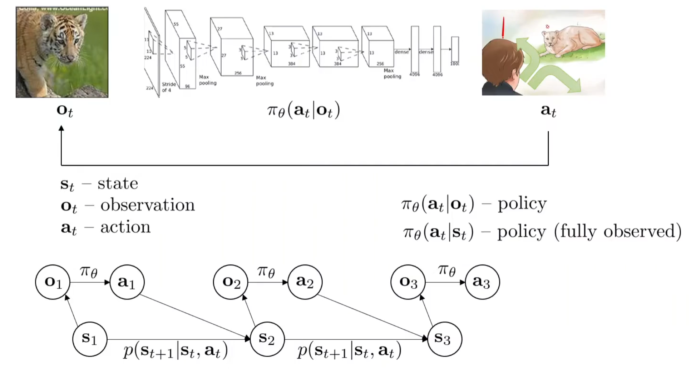
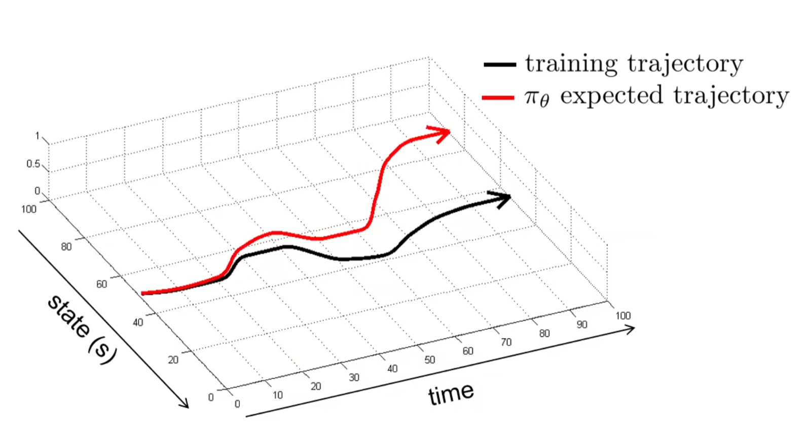
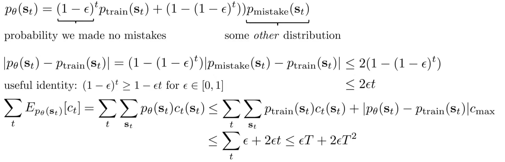
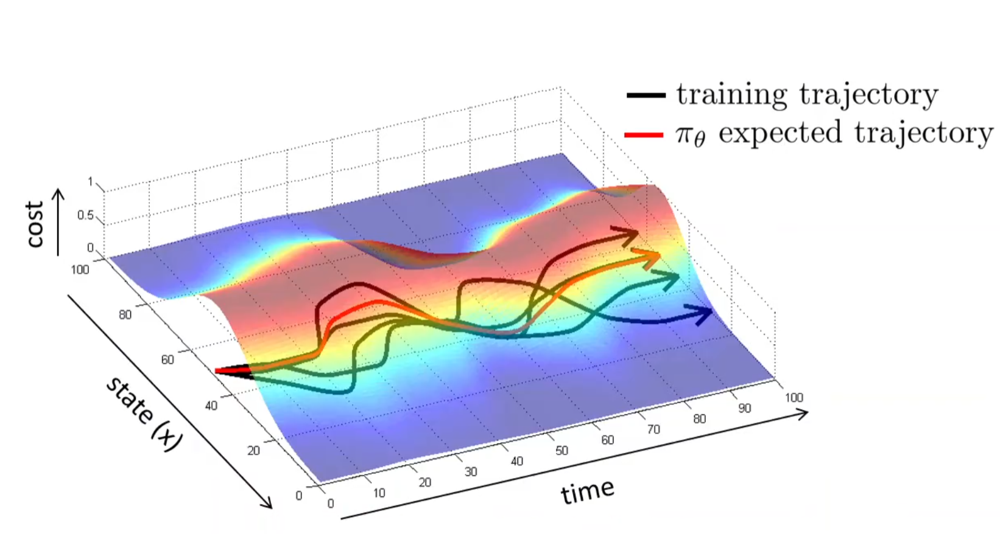
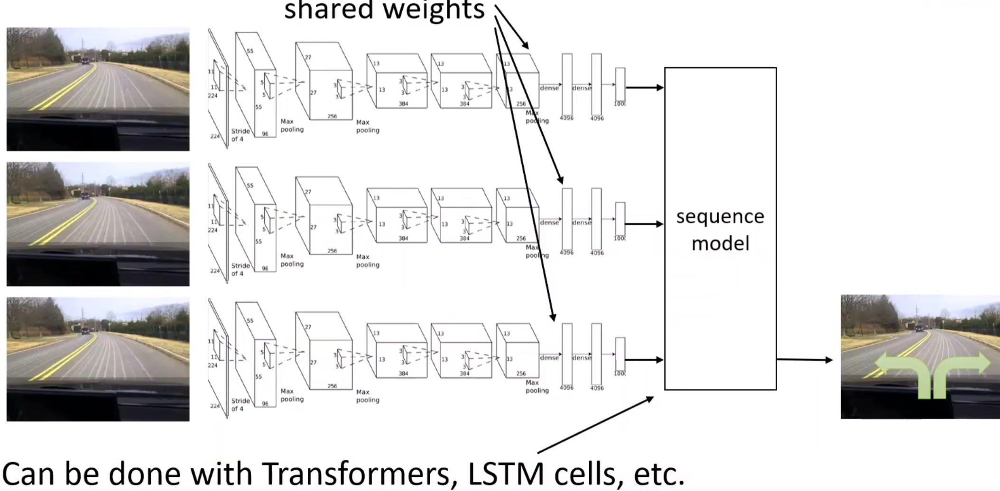
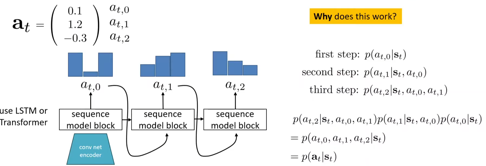
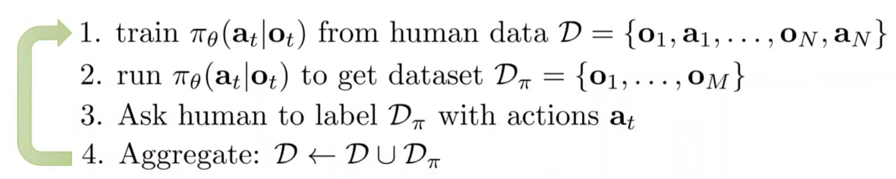

# Supervised Learning of Behaviors

> 这一节还未涉及到强化学习，仅仅是讨论用于学习策略的监督学习方式

## Terminology and Notation

首先定义策略：在一定观察下，做出对应的行动。因此有$\mathbf{o}_t \ \mathbf{a}_t$，其中前者为observation观察，后者为action，下标t代表的是第t时间步。当然时间是连续的情况下，$\delta t$会非常短。用$\pi$代表policy策略，$\theta$代表策略里面的参数，因此在t时间步给定观察后做出反应的策略为：

> 在控制理论中，state常用$x$，action常用$u$，这个notation来自苏联科学家

$$
\pi_\theta(\mathbf{a}_t|\mathbf{o}_t)
$$

值得注意的是，$\mathbf{a}$在离散的行动选项空间代表的是概率分布，而在连续的行动选项空间中代表的是连续概率分布。虽然我们其实可能只想要选出一个action，但是得到分布然后choose accordingly是Intuitive的。

与observation非常相似但是实则区别很多的一个概念是state。state and observation的关系可以用CS181（CS188）中的HMM中的二者关系来近似理解。一般认为对应的state影响observation，但是在这个例子中，还引入了一个action因素，它也会影响下一个时间点的state。因此，贝叶斯网络如图所示。其中当前时间步的action纯粹由当前的观察得出，并且下一时间步的state是收到上一时间步的状态和行动影响的，故state的transition为：
$$
p(s_{t+1}|s_t,a_t)
$$

## Behavioral Cloning

### Why working not well?

在监督学习中，给定input输出output是它最熟悉的任务，因此在此情境中，监督学习策略就是在人类提供的大量$(o_t,a_t)$数据下进行拟合。比如说在自动驾驶的简单场景中，就是给定车前面摄像头的图像，然后决定左转、右转还是直走。这种训练的范式就是监督学习，来学习policy，有时也叫做behavioral cloning，因为我们希望模型网络能够‘克隆’人类的操作。

这种paradigm work吗？实践证明：不是很work！以下图为例子进行直观上的感受：

假设训练的轨迹如图中黑色，然后我们开始进行inference。假设开始的20个时间步表现的很好，但是网络输出总是有错的时候，那么假设20步之后开始犯下错误。当犯下错误之后，进入的状态是***训练集中从来没见到过的场景***！比如说开车的例子中，人类的开始在直线道路上都是直走的，如果模型推理的时候左打了一些方向，那么车的轨迹歪掉了，之后的图像中的车道都是斜着的，***模型就不认识了***，但是***人类是知道往右打方向盘来纠正的***！根据上述的论述，因此模型的表现在出现错误之后就很难纠正回来，直至大错特错。

Imitation learning via behavioral cloning is not guaranteed to work！更进一步地，其不work的原因在于：i.i.d assumption does not hold。模型学出来的，严格来说，是$\pi_\theta(\mathbf{a}|\mathbf{o})$而不是$\pi_\theta(\mathbf{a}_t|\mathbf{o}_t)$，因此每一个时间点的policy其实是完全独立的！但是正如之前介绍贝叶斯网络中所提及的，下一时间步的state是收到上一时间步的状态和行动影响的，但是模仿学习并没有建模time step，state的。

我们可以用理论的方式来更为规范地证明模仿学习不work。假设数据集$o_t$的分布是$p_{data}(o_t)$，然后有对应的$a_t$，那么很intuitively，我们可能设计训练目标：优化参数$\theta$来最大化似然。这在机器学习中很常见。
$$
\max_{\theta} \mathbb{E}_{\mathbf{o}_t \sim p_{\text{data}}(\mathbf{o}_t)} \left[ \log \pi_{\theta}(\mathbf{a}_t | \mathbf{o}_t) \right]
$$
然后假设训练（inference）的时候，observation的分布换成了$p_{\pi \theta}(o_t)$，很显然，有相当高的概率：$p_{data}(o_t)\neq p_{\pi \theta}(o_t)$。但是这样的训练目标真的好吗？最大化似然将会使得policy在相似的observation下对人类当初的action有着较高的概率，但是在稍微不同的observation下采取完全不同的行动。因此训练的时候，我们考虑修改优化目标：
$$
c(\mathbf{s}_t, \mathbf{a}_t) = 
\begin{cases} 
0 & \text{if } \mathbf{a}_t = \pi^{\star}(\mathbf{s}_t) \\
1 & \text{otherwise}
\end{cases}
$$
在训练的过程中，每错一步就要付出一个单位的成本，而目标就是最小化错误成本（假设人类驾驶员的policy是consistent的）。因此目标是：
$$
\text{Goal: minimize } \mathbb{E}_{\mathbf{s}_t \sim p_{\pi_{\theta}}(\mathbf{s}_t)} [c(\mathbf{s}_t, \mathbf{a}_t)]
$$

> Minimize the number of mistakes the policy makes when we run it.

假设最终我们训练出来的模型满足：$\pi_{\theta}(a \neq \pi^{\star}(s)|s)≤\epsilon$，即犯错的概率小于epsilon，那么我们考虑在t步中的犯错期望数为：

> 第一项：第一步就错，那么之后的步骤就都错掉了；如果不错，考虑第二步，递归下去...

$$
\underbrace{\mathbb{E} \left[ \sum_t c(\mathbf{s}_t, \mathbf{a}_t) \right]}_{O(\epsilon T^2)} \leq \underbrace{\epsilon T + (1-\epsilon)(\epsilon(T-1) + (1-\epsilon)(\ldots))}_{T \text{ terms, each } O(\epsilon T)}
$$

上述推导了在***最坏***的情况下，犯错次数是$O(T^2)$的。我们也可以推导：事实上行为克隆的表现不会比这个复杂度差。

在上面的推导中，首先提出：在测试的时候，$s_t$的分布和训练时的是有差别的，且假设我们不是很清楚$p_{mistake}$。然后进行简单的概率分布绝对值放缩和基于欧拉展开的放缩，对最后的期望式子改写出放缩项，最后得出一般情况下的错误次数上界。$O(T^2)$的错误次数数量级很是令人沮丧。

key insight：如果$p_{train}$的范围很广呢？那么是不是将会尽可能地满足$p_{train}(o_t)\approx p_{\pi \theta}(o_t)$呢？而如果要满足这一点，是不是数据集里面不能全都是‘正确’的样本，也需要记录一下错误并且修正的样本呢？事实上就是如此：越完美的数据集，训练出来的policy越不robust，因为一旦错误进入到训练集中没见过的场景中，模型便不知道如何做出correction action了。

### Addressing the problem!

#### Be smart about how we collect (and augment) our data

正如上一节中的insight所提到的，制作训练集的时候可以人工的制作一些错误，并且对应地修正。这样policy model在inference的时候，即使犯了一个错误，进入到了下一个不正确的observation中，但是由于训练集中有对应的correction训练，model将懂得如何进行修正。示意图如下：在多条训练轨迹下，observation分布将会扩大，而其扩大是通过（人为）犯错并纠正而扩充出来的。

另一种技巧是'fake' data，比如说在驾驶训练中，不止有前面的正方摄像头，同时也有左前方和右前方的摄像头，模拟‘不小心’方向盘左打/右打的场景，并且方向盘当前方向与摄像头的相对方向就是correction。

#### Use powerful models that make very few mistakes

假如说模型犯错的概率$\epsilon$非常的小，那么其实也是能够接受的。因此可以考虑如何让这个概率非常的小。为什么实际中之前介绍的训练范式通常不work？

一方面是人类行动的非马尔科夫性质：之前所介绍的policy全都是基于当前的observation来给出action，但是很明显人类不是。我们会往往会刻意或潜意识中考虑过去历史的一系列操作，但是我们之前的建模中没有这个inductive bias。因此一种解决方式便是考虑一种加入了这种归纳偏置的模型，如下图：

但是，这样做不一定能够提升表现，原因出在***因果混淆(causation confusion)***。这听起来很反直觉，举一个例子：假如说一个车，踩下刹车的时候灯将会亮起。在人出现在前面的时候，踩下刹车，然后灯亮起。但是模型学习过去很多切片的时候，就可能认为：踩下刹车的决策可能是因为灯是亮着的原因，但其实是人。

 另一方面是multimodel behavior。假如说在面临一个场景的时候，多个选择是可以被接受的，这在离散的action空间中是可以用概率来表示的，但是在连续空间的action表示中，用一个简单的分布来建模多种action是十分困难的。比如说只用一个高斯建模action，那么左和右的两种action的''平均''将会非常糟糕。

解决这个问题，第一种方式是使用更有表达能力的分布。常见的有：

- Mixture of Gaussians
- Laten variable models：输入的不只有原来的input，还有一个基于先验的随机的分布中选取的随机参数。这一种最常见的是(conditional) variational autoencoder，之后将会介绍
- Diffusion models

第二种方式是离散化。比如说在无人机飞行中，规定动作只有向前、向左、向右。但是其实这种在实践中很难应用，尤其是在高维空间中很难引用。因此，常见的是对于维度进行离散化。注意：将一个维度进行离散化是能够接受的！一种常见的按照维度来进行离散化的方式为autoregressive discretization：

#### Use multi-task learning

听起来很反直觉：其实让模型学习多项任务实际上可以使模仿学习变的更加简单。如果说原来的任务就是到达地点，然后制作数据集的时候还需要专家认为的制造错误并修正，这很不方便；但是如果考虑到达多个目的地，然后训练的时候也不说到达的是哪个目的地，那么这样就可以拓宽状态空间了。

> 也称为goal-conditioned behavioral cloning

虽然理论上很好，但是实际上有两处distribution shift：一种是之前所说的$p_{data}(o_t)\neq p_{\pi \theta}(o_t)$，另一种是$goal_{train} \neq goal_{\pi_{\theta}}$

#### Change the algorithm (DAgger)

之前在模型上的trick都是尽可能的让epsilon小，以尽可能地$p_{data}(o_t)=p_{\pi \theta}(o_t)$；但是能不能反过来，在制作数据集的时候就实现这一点呢？这其实就是第一种approach：Be smart about how we collect (and augment) our data的思路。那么DAgger，Dataset Aggregation，在训练一轮之后，进行inference，不论结果的正确与否，对于inference的observation都打上action label，把这些数据加入原来的数据集，然后再训练。不断循环，直到策略收敛。

其中较为麻烦的可能是第三步。比如说驾驶场景，让人类offline地对场景做出决策判断可能不是很自然，人们更自然的是online决策，即开车的时候做出自然的决策。后续有很多的工作就是克服这一‘不自然’。