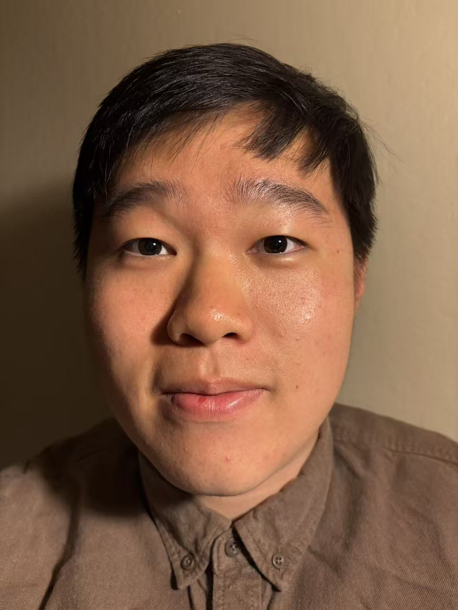
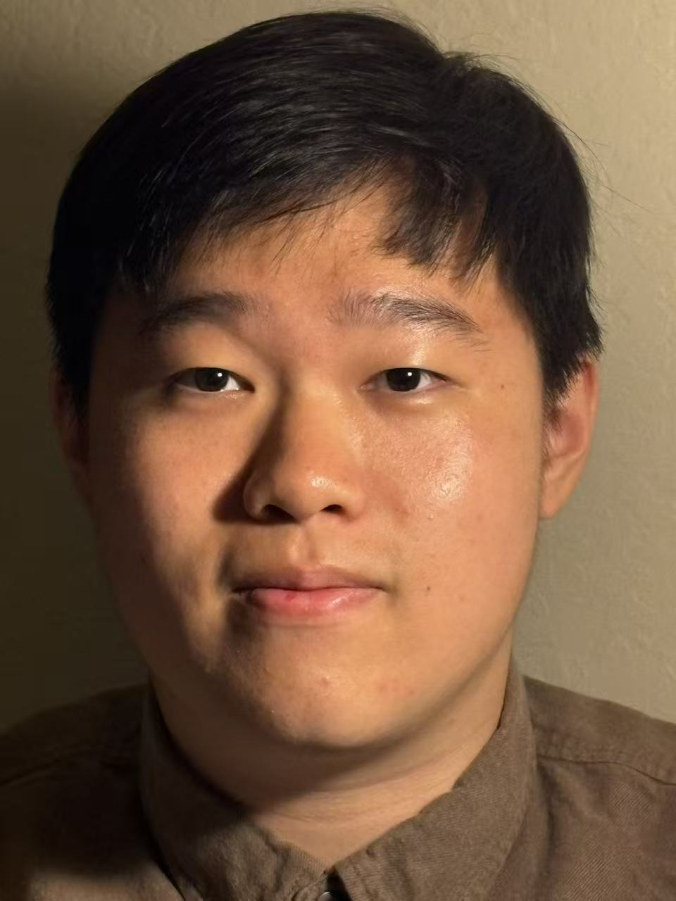
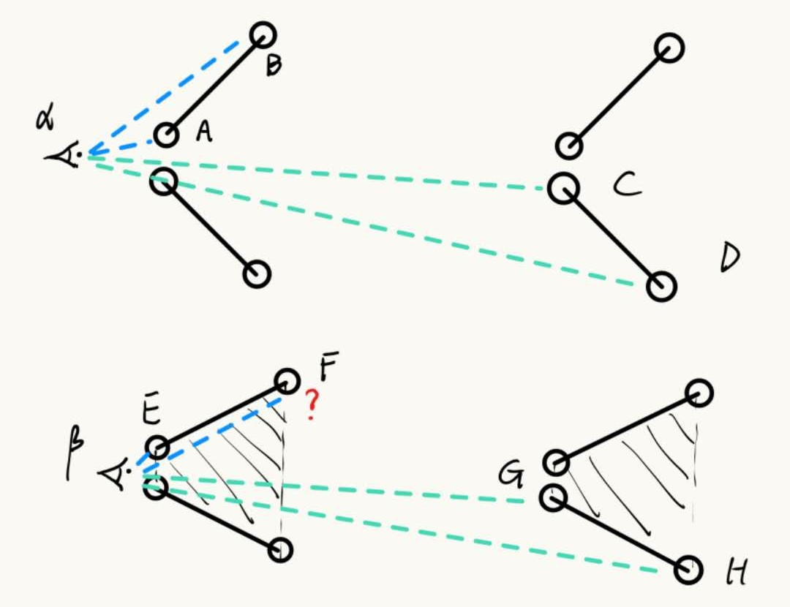
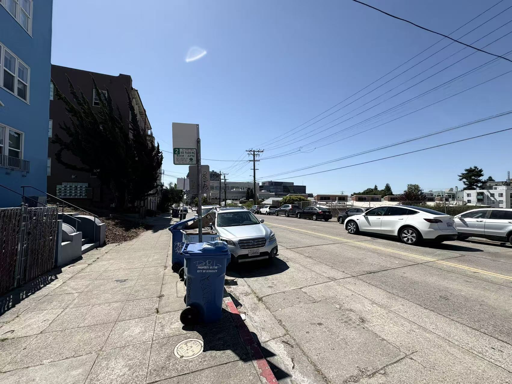
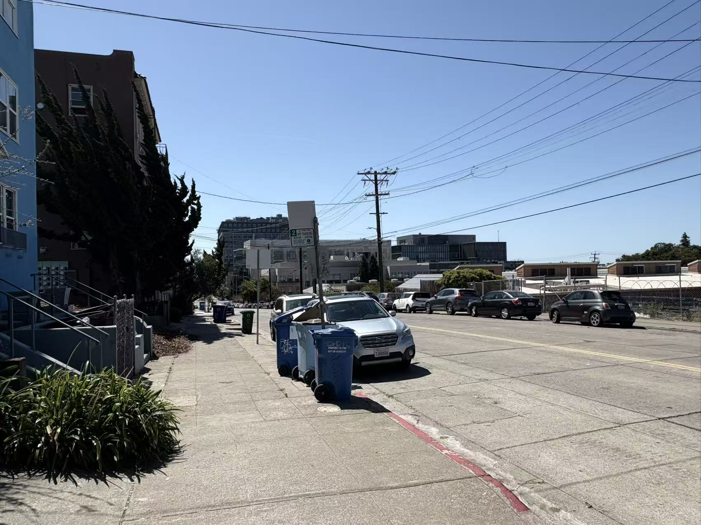

# Project 0

> Hey! Becoming Friends with Your Camera!

## Part 1

***Task Description:*** Take a picture of your friend (or yourself) from close up. You get a typical distorted selfie image. Now step back several feet from your subject, zoom in, and take a second picture. Try to get the face in the second photo to be the same size as in the first photo. If you've done things right, the second portrait should look much better than the first one. **Think about why this is.**

    

        
        
Near Selfie

    

    

        
        
Far Selfie (Zoom)

    

Why? I try to give a toy explanation for this phenomenon. See the illustration figure below:

We have camera eyes $\alpha, \beta$. For each row, the object is identical except for their distance to the camera eye. For the first row, when looking into C and D points, since the object is quite far away, the division $\frac{\alpha C} {\alpha D}$ is quite close to 1, but it is not the same case for $\frac{\alpha A} {\alpha B}$ when looking into A and B. Since we keep the size of photo presented in the picture the same, and most importantly, farther the distance is, smaller it looks like, and this relation yields to inverse ratio, the proportion of A and B, C and D in the photo is different even though the overall pixels they take up is nearly the same, resulting in the distortion (A is larger and B is smaller) when looking into A and B. 

In some worse case, like the second row, some times some point's tracing light may even get occluded. 

## Part2

***Task Description:*** Let's repeat the same procedure in reverse, for an urban scene. Pick a nice view down a long street (or a walking path on campus), zoom in, and take a photo. Now, walk down the street in the direction of your first shot, and take a second photo without zoom, such that the scene in the two photos appears approximately the same size. The first picture should look flattened, or compressed, compared to the second. **Again, think about why.**

    

        
        
Near Photo

    

    

        
        
Far Photo (Zoom)

    

I believe the toy explanation in part1 can be also applied to this phenomenon.

## Part3

***Task Description:*** In this part, we will be duplicating a classic film effect called the [dolly zoom](https://en.wikipedia.org/wiki/Dolly_zoom). It is a camera movement also known as the "Vertigo shot", after a famous scene in Hitchcock's Vertigo. The idea is to simultaneously move the camera back while also zooming in. First, come up with a good setting for the shot (e.g., a scene with stuffed animals is one popular choice). Now take a few (4-8 or even more!) still photos while you move the camera back and zoom in, keeping the resulting image roughly the same size. Combine your stills into an animated GIF file—you have a dolly zoom!

    

        
    

    

        
<strong>I try my best to keep the size of bread loaf unchanged in the picture, and gradually decrease the photoing distance

    

