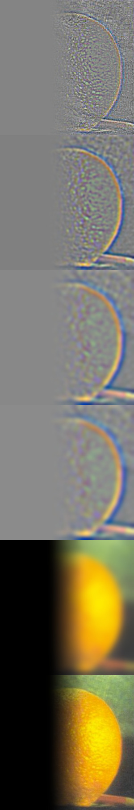

# Proj 2 - Fun with Filters and Frequencies!

## Part 1

### Part 1.1: Convolutions from Scratch!

Convolution is a multiplication-like operation*. The formula is as follows:
$$
G[i,j] = \sum_{u=-k}^{k} \sum_{v=-k}^{k} H[u,v] F[i-u, j-v]
$$
I note that this form of operation is a little bit confusing because we are more happy to see cross-correlation form! So why not let $u=-u, v=-v$, and we can have:
$$
G[i,j] = \sum_{u=k}^{-k} \sum_{v=k}^{-k} H[-u,-v] F[i+u, j+v] \\
= \sum_{u=-k}^{k} \sum_{v=-k}^{k} \hat{H}[u,v] F[i+u, j+v]
$$
where:
$$
\hat{H}[u,v] = H[-u,-v]
$$
This exactly represents the 'flip' operation to the kernel! For implementing a convolution operation, from my perspective, there are key operations:

> *Source: UCB CS180 Slide ConvolutionAndDerivatives.pdf page 39

- The implementation of a kernel
- Flip the kernel (If not, we are doing a cross-correlation!). I use the numpy function: $kernel = np.flipud(np.fliplr(kernel))$
- Optional but Common: Pad the kernelized image so as to keep the same shape **according to the step size and the kernel size**
- Shift kernel, do element-wise multiplication and summation one step at a time

> The step size doesn't have to be one, but in this project we limit the step size to one for simplicity

The shift of kernel take up two loops, and element-wise multiplication can take up two loops without the help of ***broadcast operation in numpy*** (This emphasizes the importance of the 'flip' operation! Without this, it is hard to use the numpy broadcast property). Under the usage of broadcast, these two loops can be avoided. The following code of is a two-loop version code of using box_filter as kernel:

````python
img = skio.imread('my_picture.jpg', as_gray=True)
box_filter = np.ones((9, 9)) / 81.0

def box_conv(image, box_filter):
    H, W = image.shape
    pad = box_filter.shape[0] // 2
    padded_img = np.pad(image, pad, mode='edge')
    output = np.zeros_like(image)
    # Flip the box_filter
    box_filter = np.flipud(np.fliplr(box_filter))
    for i in range(H):
        for j in range(W):
            window = padded_img[i:i + box_filter.shape[0], j:j + box_filter.shape[1]]
            # Broadcast element-wise operation and it can save two loops!
            output[i, j] = np.sum(window * box_filter)
    return output
box_filtered_img = box_conv(img, box_filter)
plt.imshow(box_filtered_img, cmap='gray')
plt.savefig('box_filtered_image.png')
````

Note that this code read in a colorful image and interpret as a gray image. The convolution operation actually has a special function in the library: `scipy.signal.convolve2d`:

````python
def box_conv2d(image, box_filter):
    return convolve2d(image, box_filter, mode='same', boundary='symm')
box_conv2d_img = box_conv2d(img, box_filter)
plt.imshow(box_conv2d_img, cmap='gray')
plt.savefig('box_conv2d_image.png')
````

The following presents three figures: original, processed by `box_conv` and processed by `scipy.signal.convolve2d`:

<div style="display: flex; justify-content: space-around; align-items: center;">
        <figure>
            
            <figcaption>
                original
            </figcaption>
        </figure>
             <figure>
            
            <figcaption>
                processed by box_conv
            </figcaption>
        </figure>
             <figure>
            
            <figcaption>
                scipy.signal.convolve2d
            </figcaption>
        </figure>
</div>

The influence of a `box_filter` is to blur the image. We can see from the demo above that the picture has been blurred and our `box_conv` is nearly equivalent to the `scipy.signal.convolve2d` operation.

For kernels with any size, including $\mathbf{D_x \ D_y}$, the `box_conv` function is not robust enough. We want the function to fit in every defined kernel. So the revised code is as below:

````python
def defined_conv(image, kernel):
    H, W = image.shape
    pad_width = kernel.shape[1] // 2
    pad_height = kernel.shape[0] // 2
    pad = (pad_height, pad_width)
    # print(pad, kernel.shape)
    padded_img = np.pad(image, ((pad_height, pad_height), (pad_width, pad_width)), mode='edge')
    output = np.zeros_like(image)
    # Flip the kernel
    kernel = np.flipud(np.fliplr(kernel))
    for i in range(H):
        for j in range(W):
            window = padded_img[i:i + kernel.shape[0], j:j + kernel.shape[1]]
            # print(window.shape, kernel.shape)
            output[i, j] = np.sum(window * kernel)
    return output
Dx_img = defined_conv(img, Dx)
Dy_img = defined_conv(img, Dy)
plt.imshow(Dx_img, cmap='gray')
plt.savefig('Dx_image.png')
plt.imshow(Dy_img, cmap='gray')
plt.savefig('Dy_image.png')
````

The usage and input parameter format of  `np.pad` is important. Now we use the difference operators (kernels) to process the original image. The convolution results are as below:

<div style="display: flex; justify-content: space-around; align-items: center;">
            <figure>
            
            <figcaption>
                Dx_image
            </figcaption>
        </figure>
             <figure>
            
            <figcaption>
                Dy_image
            </figcaption>
        </figure>
</div>

### Part 1.2 Finite Difference Operator

For this task, after processing the image with the difference operators mentioned above, we calculate the ***square root*** with every two elements at the same position, since this result can stand for the ***magnitude of gradient***:
$$
\|\nabla \ell\| = \sqrt{\left(\frac{\partial \ell}{\partial x}\right)^2 + \left(\frac{\partial \ell}{\partial y}\right)^2}
$$
We can utilize the ***broadcast property*** in numpy as well. Then after simply setting one threshold so that every pixel (float number in $[0,1]$) with the magnitude over this threshold will be set to 1. This operation can be easily implemented with the boolean operation in numpy. The visualizations are as follows:

<div style="display: flex; justify-content: space-around; align-items: center;">
            <figure>
            
            <figcaption>
                cameraman
            </figcaption>
        </figure>
             <figure>
            
            <figcaption>
                edge_image
            </figcaption>
        </figure>
</div>

So why this operation can help us extract the edge? The $\mathbf{D_x \ D_y}$ can extract the gradient magnitude information in horizontal and vertical directions. Since the pixels are discrete, we have the take the square root as an approximation of the gradient magnitude of every pixel. This magnitude indicates how the value changes in this pixel. Intuitively, the higher the magnitude is, faster the value changes here, and more obviously this pixel is at the edge of the patterns. 

### Part 1.3 Derivative of Gaussian (DoG) Filter

We can tell from the above figures that the edge extracted can be suffering from noise dots or outliers. That's probably because in the real world images, the edges are quite ridge and can suffer from stochasticity. If we can smooth it, maybe we can ease the noise, and extract a smoother edge out from the figure.

For the blurring part, we use a gaussian filter $\mathbf{G}$. We have to approaches s to process the image:

- First convolve image with $\mathbf{G}$, then convolve image with Difference Operator
- First convolve $\mathbf{G}$ with Difference Operator, then convolve it with the image

The result of the first approach is as follows:

<div style="display: flex; justify-content: space-around; align-items: center;">
            <figure>
            
            <figcaption>
                cameraman
            </figcaption>
        </figure>
             <figure>
            
            <figcaption>
                DoG1
            </figcaption>
        </figure>
</div>


The result of the second approach is as follows:

<div style="display: flex; justify-content: space-around; align-items: center;">
            <figure>
            
            <figcaption>
                cameraman
            </figcaption>
        </figure>
             <figure>
            
            <figcaption>
                DoG2
            </figcaption>
        </figure>
</div>


We can tell that both processed edge images are much smoother and better. For DoG1 and DoG2, we use the following code to detect the difference:

````python
print(edge_image_1.shape, edge_image_2.shape)
print(np.sum(edge_image_1 != edge_image_2))
````

The result is:

````txt
(542, 540) (542, 540)
3188
````

This means that in the image consisting of $542*520$ pixels, only 3188 of them are different. This indicates that the two approaches can be equivalent! This is in fact true since convolution operation have associativity property (if we regard difference operators as kernels), or the property listed below*.

> *Source: UCB CS180 Slide ConvolutionAndDerivatives.pdf

$$
\frac{\partial}{\partial x}(f\star g) = (\frac{\partial g}{\partial x})\star f
$$

## Part 2 - Fun with Frequencies!

### Part 2.1  Image "Sharpening"

As taught in the lecture, the Laplacian kernel, which is the subtraction of a unit impulse and a Gaussian, can be used to sharpen the image. So we simply have to write out a Laplacian kernel and let it do the convolution with the blurred image.

<div style="display: flex; justify-content: space-around; align-items: center;">
            <figure>
            
            <figcaption>
                blurred_img_taj
            </figcaption>
        </figure>
             <figure>
            
            <figcaption>
                sharpened_image_taj
            </figcaption>
        </figure>
</div>

<div style="display: flex; justify-content: space-around; align-items: center;">
            <figure>
            
            <figcaption>
                blurred_img_library
            </figcaption>
        </figure>
             <figure>
            
            <figcaption>
                sharpened_image_library
            </figcaption>
        </figure>
</div>

From the results above, we can conclude that Laplacian kernel do can sharpen the image. Even in the extreme test case of library picture that I took with high moving speed, the kernel can try its best to extract the edge and enhance the original burry picture. The following shows that result of blurring and resharpening:

<div style="display: flex; justify-content: space-around; align-items: center;">
            <figure>
            
            <figcaption>
                Original
            </figcaption>
        </figure>
             <figure>
            
            <figcaption>
                Resharpened
            </figcaption>
        </figure>
</div> 

We can see that there are slight distortions, but the resharpening construction still has quite good performance.

### Part 2.2 - Hybrid Images

Our eyes have one interesting property: Standing close enough one scene, we will pay more attention to the high-frequency information of the image, whereas standing far away will limit our attention to the low-frequency information. Using this property we can generate hybrid images. If we look at it closely. we may tell it is one thing, but if we look in distance we may tell that it is another thing!

We can use the Gaussian to extract the low-frequency information, and subtracting it with the original image can help us get the high-frequency information. We extract the low-frequency information of figure A, and extract high-frequency information of figure B, and then put them together.

Here is the ***picture gallery***:

<div style="display: flex; justify-content: space-around; align-items: center;">
            <figure>
            
        </figure>
             <figure>
            
        </figure>
</div> 

<div style="display: flex; justify-content: space-around; align-items: center;">
        </figure>
             <figure>
            
        </figure>
</div>

<div style="display: flex; justify-content: space-around; align-items: center;">
            <figure>
            
        </figure>
             <figure>
            
        </figure>
            <figure>
            
        </figure>
</div> 

> Source Citation: https://www.youtube.com/watch?v=ImSt152YpBQ

<div style="display: flex; justify-content: space-around; align-items: center;">
            <figure>
            
        </figure>
             <figure>
            
        </figure>
            <figure>
            
        </figure>
</div> 

> https://www.bbc.com/news/world-us-canada-68486556.amp

The "Truden" (**Tru**mp + Bi**den**) is my favorite, its frequency visualization is as follow:


From left to the right: Biden high-freq fft, Biden fft, Trump low-freq fft, Trump fft, Hybrid fft results.

### Part 2.3 + 2.4 - Multi-resolution Blending and the Oraple journey

If we can to extract the Gaussian stack, blur it for $level-1$ times and include the original figure. Then we can use it to build Laplacian stack: 

````python
lap_stack[i] = gauss_stack[i] - gauss_stack[i+1]
````

and the Laplacian Stack will include the last entry in Gaussian Stack. Using the Laplacian stack, we can restore the original figure. Note that the blurring is done via Gaussian kernel to every channel (RGB), and we don't downsample. In my implementation, the level of Gaussian and Laplacian Stack is 5. 

With the Laplacian Stacks of two figures, we can join them together under our defined weight. This weight is called 'mask'. In my implementation, for the `[:, :int(cols * (ratio - 1/8)), :]` part of the columns, they were set to 1, `[:, int(cols * (ratio + 1/8)):, :]` is set to 0, and the columns left were set to be a linear transition from 1 to 0. This mask is applied horizontally so we will expect a smooth transition in the `ratio` part of the figure in horizontal direction.

Finally, we collapse two Laplacian Stack together with the mask. For one level, the stack layers will be combined with mask as follows:

````python
blended_stack[i] = mask * lap_stack1[i] + (1 - mask) * lap_stack2[i]
````

After getting the `blended_stack[i]`, we add them up and divide by the number of layers for numerical balance. The numerical analysis in this section is important! Another thing is: if we read in the colorful picture as float, then the gaussian stack picture's values are in $[0,1]$. So the number value in Laplacian Stack can be in range $[-1,1]$. Apparently we need to transform them into $[0,1]$. I proposed two methods:

- Linear Transformation: $x = \frac{x+1}{2}$
- min-max-norm: $x = \frac{x-x_{min}}{x_{max}-x_{min}}$

We take the orple example to demonstrate which method is better:

<div style="display: flex; justify-content: space-around; align-items: center;">
            <figure>
            
            <figcaption>
                blurred_img_taj
            </figcaption>
        </figure>
             <figure>
            
            <figcaption>
                sharpened_image_taj
            </figcaption>
        </figure>
</div>
It shows that min-max-norm is better so I will use this method in the following implementation. Here are the gallery of pictures:

<div style="display: flex; justify-content: space-around; align-items: center;">
            <figure>
            
                <figcaption>
                apple
            </figcaption>
        </figure>
             <figure>
            
                                 <figcaption>
               orange
            </figcaption>
        </figure>
            <figure>
            
                                <figcaption>
                orple
            </figcaption>
        </figure>
</div> 
<div style="display: flex; justify-content: space-around; align-items: center;">
            <figure>
            
                <figcaption>
                gumayusi
            </figcaption>
        </figure>
             <figure>
            
                                 <figcaption>
              uzi
            </figcaption>
        </figure>
            <figure>
            
                                <figcaption>
                gumayuzi
            </figcaption>
        </figure>
</div> 
> Source Citation: 
>
> https://baike.baidu.hk/item/Gumayusi/57152350
>
> https://wiki.biligame.com/lol/Uzi


<div style="display: flex; justify-content: space-around; align-items: center;">
            <figure>
            
                <figcaption>
                Biden
            </figcaption>
        </figure>
             <figure>
            
                                 <figcaption>
               Trump
            </figcaption>
        </figure>
            <figure>
            
                                <figcaption>
                Truden
            </figcaption>
        </figure>
</div> 

> Source Citation: 
>
> https://www.foxnews.com/media/cnns-jim-acosta-objectively-speaking-without-bias-trump-bigger-threat-democracy-biden
>
> https://www.foxnews.com/media/cnns-jim-acosta-objectively-speaking-without-bias-trump-bigger-threat-democracy-biden

Here is the Laplacian stack collapsing detail recreation of orple example : 

<div style="display: flex; justify-content: space-around; align-items: center;">
            <figure>
            
                <figcaption>
                Apple
            </figcaption>
        </figure>
             <figure>
            
                                 <figcaption>
               Orange
            </figcaption>
        </figure>
            <figure>
            
                                <figcaption>
                Orple
            </figcaption>
        </figure>
</div> 

Here are the Gaussian and Laplacian stacks for Orange + Apple, Gumayusi + Uzi and Biden + Trump images: (For original picture from up to down: Gaussian Stack, Laplacian Stack; For blended picture: Laplacian Stack)

Apple:


Orange:


Orple:


Gumayusi:


> Source Citation: https://baike.baidu.hk/item/Gumayusi/57152350


Uzi:


> Source Citation: https://wiki.biligame.com/lol/Uzi


Gumayuzi:


Biden:


> Source Citation: https://www.foxnews.com/media/cnns-jim-acosta-objectively-speaking-without-bias-trump-bigger-threat-democracy-biden


Trump:


> Source Citation: https://www.foxnews.com/media/cnns-jim-acosta-objectively-speaking-without-bias-trump-bigger-threat-democracy-biden


Truden:


