# Proj 3A - IMAGE WARPING and MOSAICING

## Shoot the Pictures & Select Points

As we learn from the lecture, one key part of warping is that we need a set of points as evidence for the Homography matrix. In my code implementation, I use `plt.ginput` function to select sets of points who have corresponding orders.

In my final implementation, I can stitch three pictures together. I shoot the photos following the requirement of ***fixing center of projection and rotate the camera only***. They are as follows:

        <figure>
            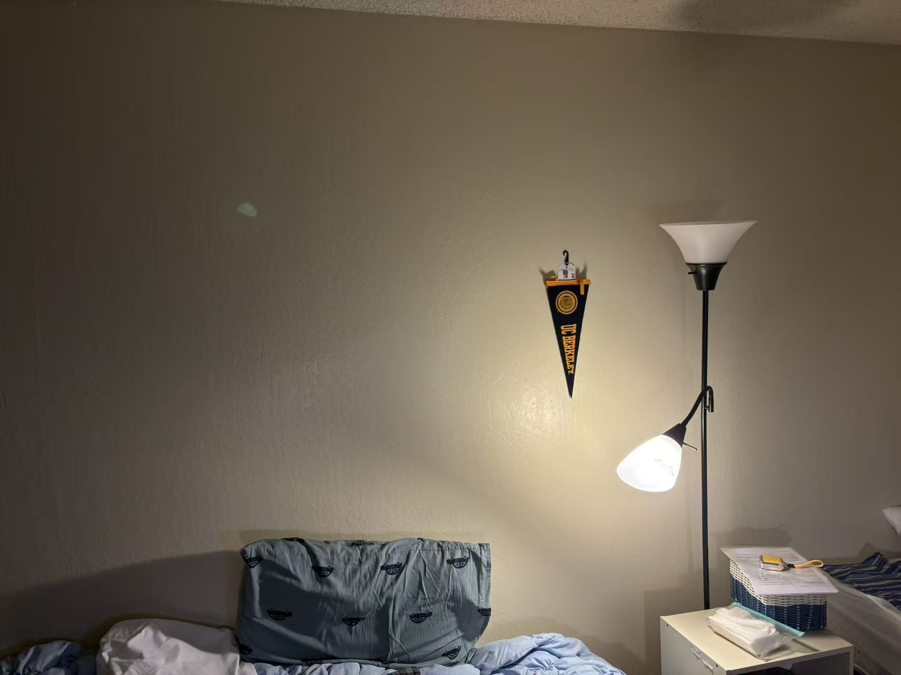
        </figure>
             <figure>
            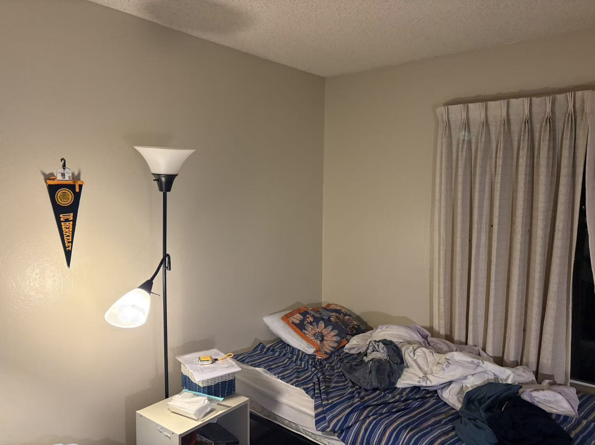
        </figure>
             <figure>
            
        </figure>

        <figure>
            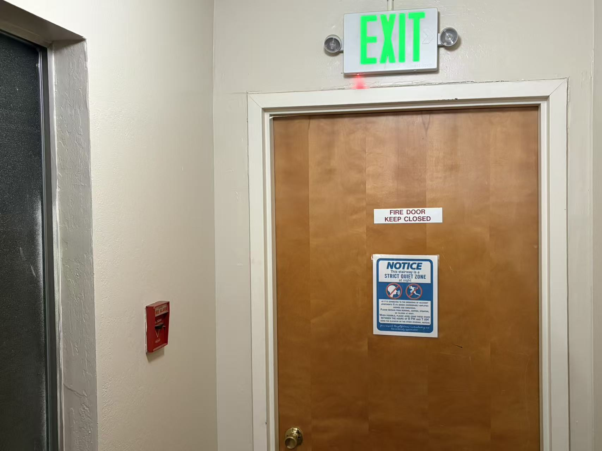
        </figure>
             <figure>
            
        </figure>
             <figure>
            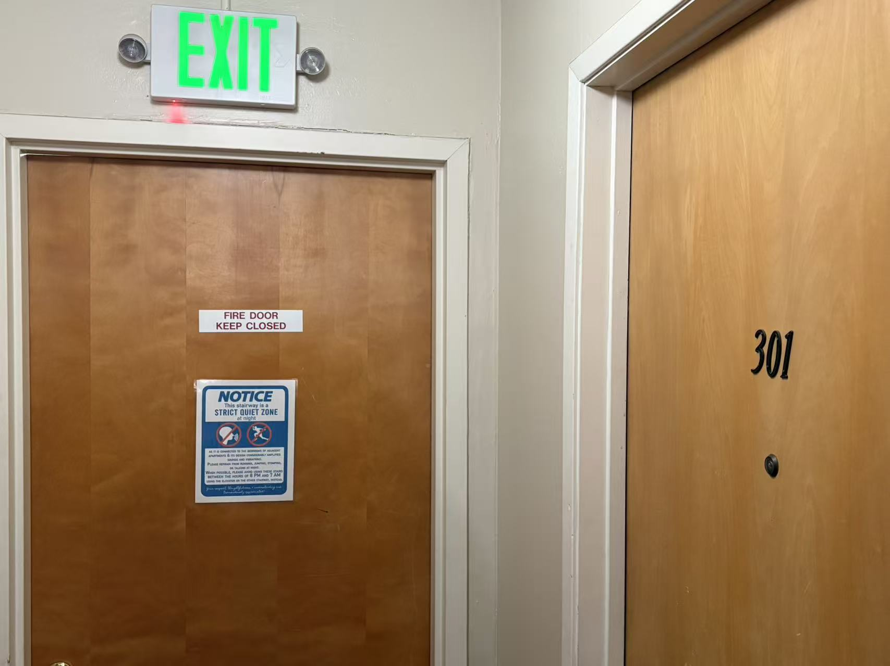
        </figure>

        <figure>
            
        </figure>
             <figure>
            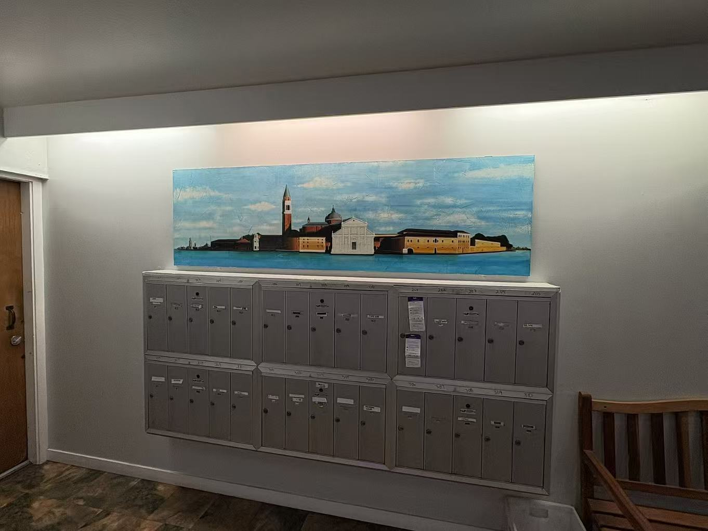
        </figure>
             <figure>
            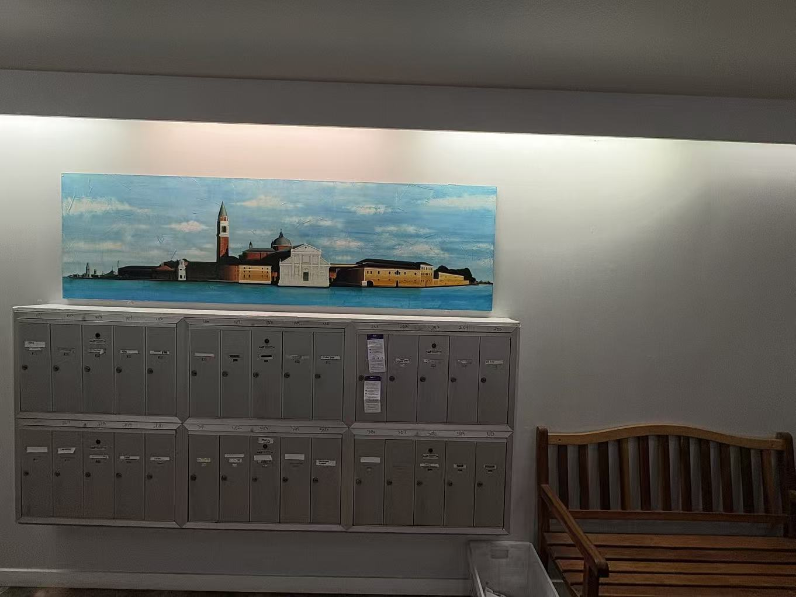
        </figure>

## Recover Homographies

With the points obtained, my first thought is to use the optimization technique (machine learning method):
$$
H* = \arg \min_H \|p_1 - p_2\times H\|_2^2
$$
where:
$$
p_1, p_2 \in \mathbf{R}^{n\times 3}, H \in \mathbf{R}^{3\times 3}
$$
But this method can be problematic: the right-bottom entry of $H$ is not guaranteed to be 1! In another word, this constraint is difficult to be expressed in optimization problem. **If I divide $H$ by $h_{33}$, then objective L2 norm can change w.r.t. difference $h_{33}$!** The project website hints that the dimension of freedom of $H$ is 8, therefore I will expand the equations manually and try to seek for more inspiration. Suppose for a pair of corresponding points $(xp_w \ yp_w \ w), (x \ y \ 1)$:

> $(xp_w \ yp_w \ w)$ match the original coordinate $xp, yp$

$$
\begin{pmatrix} xp_w \\ yp_w \\ w \end{pmatrix} = \mathbf{H} \begin{pmatrix} x \\ y \\ 1 \end{pmatrix}, \mathbf{H} = \{h_{ij}\}_{i,j\in[1, 3]}
$$

Then we can expand the equations:
$$
xp_w = h_{11}x + h_{12}y + h_{13} \quad  \\
yp_w = h_{21}x + h_{22}y + h_{23} \quad \\
 w = h_{31}x + h_{32}y + h_{33} \quad
$$
Then convert back to the two dimension coordinates:
$$
 xp = \frac{xp_w}{w} = \frac{h_{11}x + h_{12}y + h_{13}}{h_{31}x + h_{32}y + h_{33}} \quad \\
 yp = \frac{yp_w}{w} = \frac{h_{21}x + h_{22}y + h_{23}}{h_{31}x + h_{32}y + h_{33}} \quad 
$$
***From our objectives above, we can tell that even all entries are divided by $h_{33}$, the formulas still hold true!*** We can re-write as:
$$
(-x)h_{11} + (-y)h_{12} + (-1)h_{13} + (0)h_{21} + (0)h_{22} + (0)h_{23} + \\ (x \cdot xp)h_{31} + (y \cdot xp)h_{32} + (xp)h_{33} = 0
\\
(0)h_{11} + (0)h_{12} + (0)h_{13} + (-x)h_{21} + (-y)h_{22} + (-1)h_{23} + \\ (x \cdot yp)h_{31} + (y \cdot yp)h_{32} + (yp)h_{33} = 0
$$
We can construct:
$$
A = \begin{pmatrix} -x \ -y \ -1 \ 0 \ 0 \ 0 \ x \cdot xp \ y \cdot xp \ xp
\\ 0 \ 0 \ 0 \ -x \ -y \ -1 \ x \cdot yp \ y \cdot yp \ yp
\end{pmatrix}
\\
h = \begin{pmatrix} h_{11}\\ h_{12}\\ h_{13}\\ h_{21}\\ h_{22}\\ h_{23}\\ h_{31}\\ h_{32}\\ h_{33} 
\end{pmatrix}
$$
Note that in the scenario above, I only consider one point. Matrix $A$ can stack $n$ times, forming a $\mathbf{A} \in R^{2n\times9}$ matrix. The constraint is $||h||_2^2=1$. Our goal is now:
$$
h^{*} = \arg \min_{||h||_2^2=1}\|\mathbf{A}h\|_2^2
$$
If we SVD matric $A$, i.e., $\mathbf{A} = \mathbf{U} \mathbf{S} \mathbf{V}^T$, then (the norm we are using is L2):
$$
||\mathbf{A}\mathbf{h}||^2 = ||(\mathbf{U}\mathbf{S}\mathbf{V}^T)h||^2  = ||\mathbf{S}\mathbf{V}^Th||^2 \\
where \ ||\mathbf{V}^Th|| = ||h|| = 1
$$
Note that $\mathbf{S}$ is a matrix consisting singular values. Note that since $2n>9$, then there are more rows than columns, which means that there are rows on the bottom which are filled with 0! For column vector $\mathbf{V}^T\mathbf{h}$, its norm is a fixed 1, so we can simply try to set only the last element as 1 while the others are 0! In another word, we want:
$$
\mathbf{V}^Th = \begin{pmatrix} 0\\ 0\\ 0\\ 0\\ 0\\ 0\\ 0\\ 0\\ 1
\end{pmatrix}, h^{*} = (\mathbf{V}^T)^{-1}\begin{pmatrix} 0\\ 0\\ 0\\ 0\\ 0\\ 0\\ 0\\ 0\\ 1
\end{pmatrix}
 = \mathbf{V}\begin{pmatrix} 0\\ 0\\ 0\\ 0\\ 0\\ 0\\ 0\\ 0\\ 1
\end{pmatrix}
$$
So our optimal $h$ can be the last row of $\mathbf{V}$! After that, I can divide all entries with the $h_{33}$. And after assembling them together, we get the homography matrix.

After the class and edstem post in the following week, I realizes that I can set $h_{33}$ to 1 and solve the equations via `np.linalg.lstsq`. So the problem formulation is now as follows, and can be easily solved by the `np.linalg.lstsq`:
$$
A = \begin{pmatrix} x \ y \ 1 \ 0 \ 0 \ 0 \ -x \cdot xp \ -y \cdot xp 
\\ 0 \ 0 \ 0 \ x \ y \ 1 \ -x \cdot yp \ -y \cdot yp \
\end{pmatrix}
\\
h = \begin{pmatrix} h_{11}\\ h_{12}\\ h_{13}\\ h_{21}\\ h_{22}\\ h_{23}\\ h_{31}\\ h_{32}
\end{pmatrix}
\\
b = \begin{pmatrix} xp \\ yp
\end{pmatrix}
\\
h^* = \arg \min_h||Ah-b||_2^2
$$
***For the deliverable correspondences visualized on the images and recovered homography matrix, please refer to them in the `Warp the Images`  section below.*** 

## Warp the Images

Since the homography matrix has been obtained, then to warp the image, I have to first calculate the overall size of the expected image and then calculate the value of pixels using Bilinear or Nearest Neighbor technique. Note that the actual place for the center of the pixel is actually: $(row+0.5, col+0.5)$

After calculating the overall size of the expected image, this overall shape actually undergoes two stage from the picture that is going to be warped: first warp, and then translate. The translation can be cause when there are negative warped pixel positions. The overall area will be applied the inverse of $Translation * H$, and source from the warped original picture with Bilinear or Nearest Neighbor technique taught in the lecture. 

Now I will test the ***Rectification*** Part:  I input a picture, create a blank rectangle with the same size, and pick rectangle points to align. (In another word, I replace the picture to be stitched as a blank one, to demonstrate that my warping is safe and sound. This is helpful for sanity check and debugging). The results are as follows:

> From left to right: original, bilinear, nearest neighbor

        <figure>
            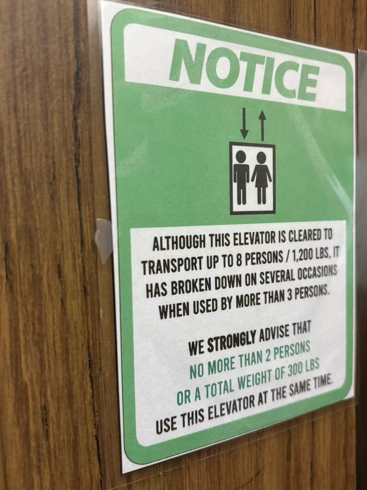
        </figure>
             <figure>
            
        </figure>
             <figure>
            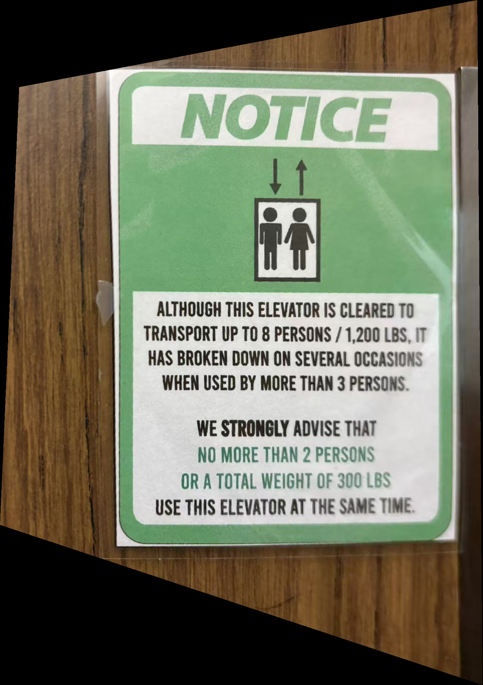
        </figure>

> ***Homography Matrix:***
>
> [[ 5.07951563e-01 -3.32904310e-02  2.15065395e+00]
>
> [-1.95431423e-01 5.91330231e-01 2.49431655e+02]
>
> [-3.02312517e-04 -3.34458470e-05 1.00000000e+00]]

        <figure>
            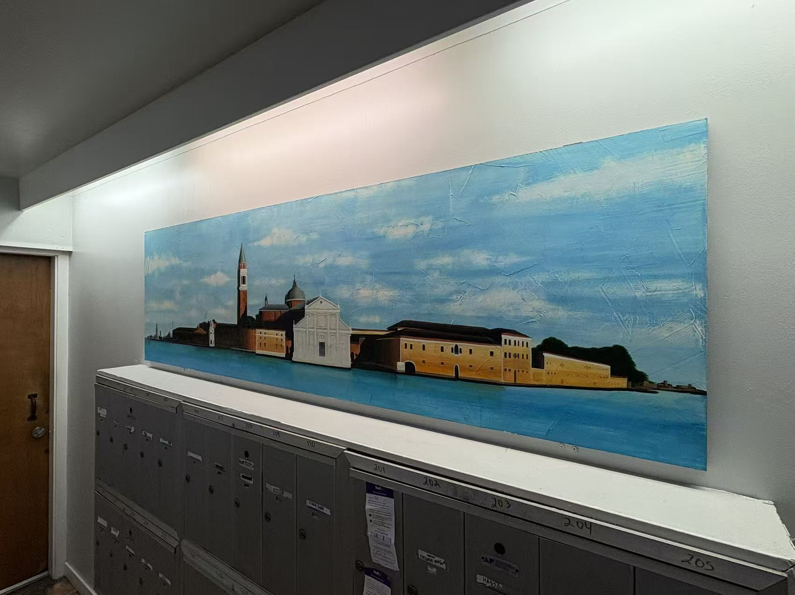
        </figure>
             <figure>
            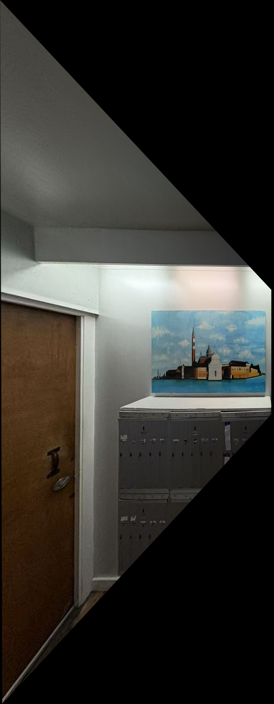
        </figure>
             <figure>
            
        </figure>

> ***Homography Matrix:*** 
>
> [[ 5.04835194e-01 -3.73939833e-02  1.16087680e+01]]
>
> [-1.81158560e-01 5.83232691e-01 2.45054643e+02]
>
> [-2.86528153e-04 -4.52234239e-05 1.00000000e+00]]

Here we can see that for the sign and picture with obvious rectangle frame in the real world, ***I successfully reshape them into the real rectangle in the warped figure, and the warped figure is correct.*** As for the comparison between Bilinear and NearestNeighbor, I zoom in the 'elevator man and woman part' in the first picture gallery and get the following result:

> Left: Bilinear; Right: NearestNeighbor

        <figure>
            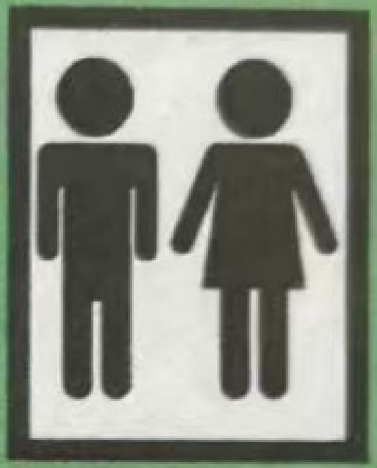
        </figure>
             <figure>
            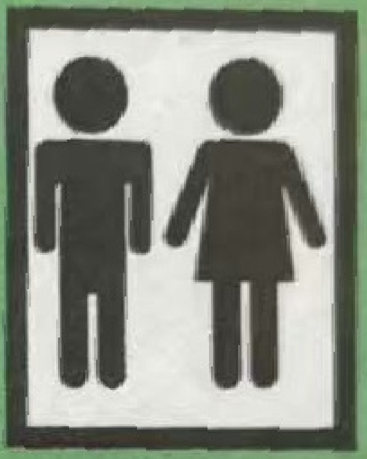
        </figure>

***We can tell that Bilinear is better in figure quality as NearestNeighbor has notable aliasing phenomenon. At the same time, Bilinear costs slightly more time.*** 

## Blend the Images into a Mosaic

Now I have the warped images and the overall size of resulting image. Since I've considered the ***translation issue*** in ***Recover Homography*** section, now all the warped images are in the right place. Note that the unwarped image (which is the middle one of the three pictures) will be translated as well to move to the right place. And I can get the overall 'panorama canvas' shape. I will create a pure black (zero-value) overall canvas, and put three warped and translated figures on that. 

Originally I try the simplest blend: for the overlap section, take the average of them. For example, for pixels that are covered by 2 images, then I simply take the average of the value of these two figures. The result picture gallery is as below:

> **The correspondence points are marked in the figures. Red Points: Left two pictures; Purple Points: Right two pictures**

        <figure>
            
        </figure>
             <figure>
            
        </figure>
             <figure>
            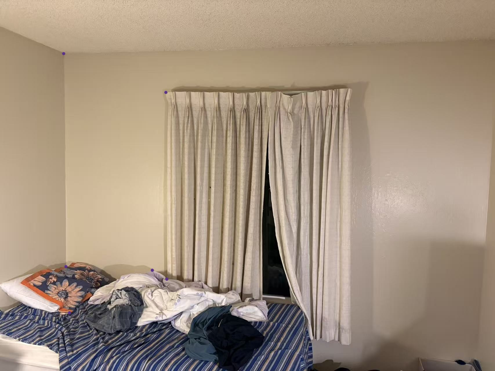
        </figure>

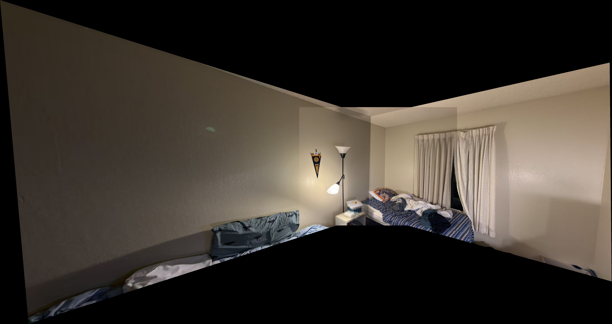

        <figure>
            
        </figure>
             <figure>
            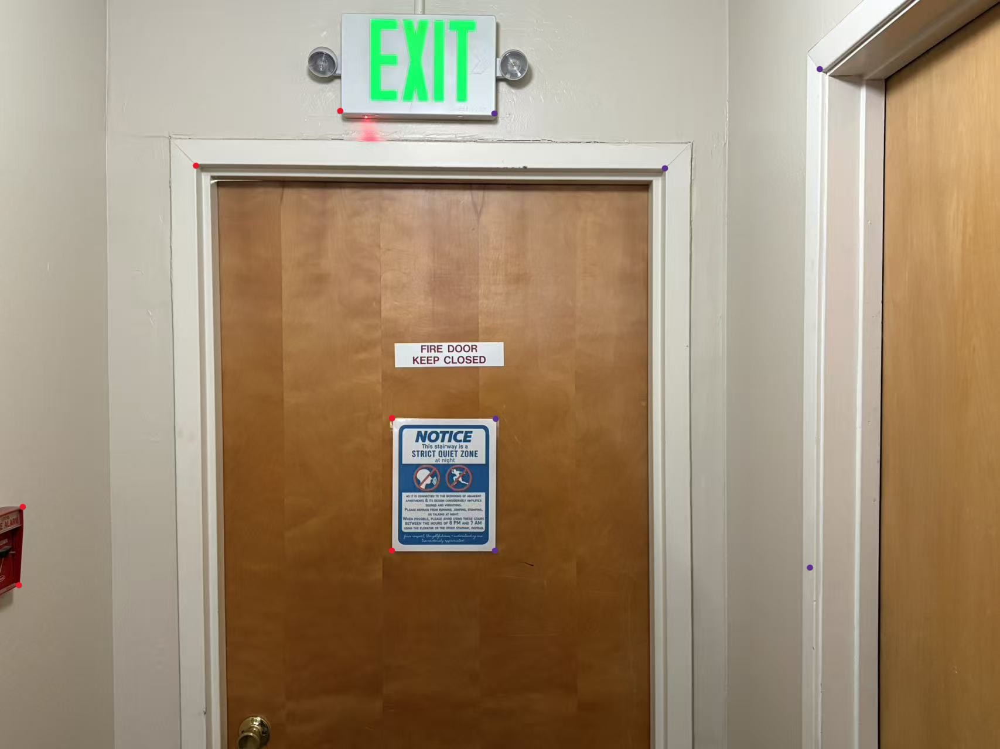
        </figure>
             <figure>
            
        </figure>

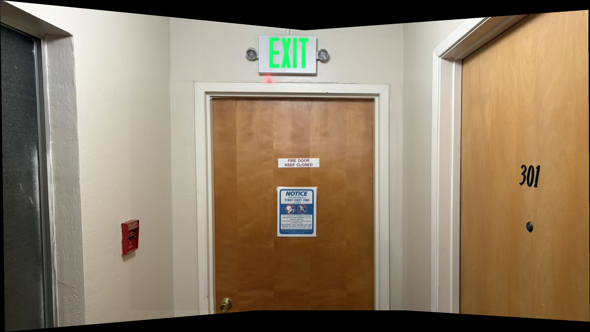

        <figure>
            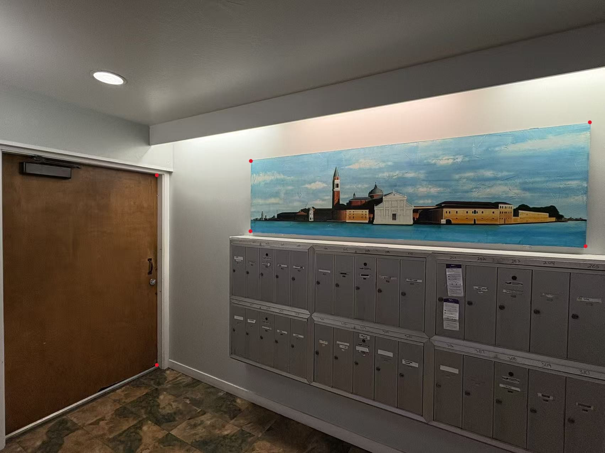
        </figure>
             <figure>
            
        </figure>
             <figure>
            
        </figure>

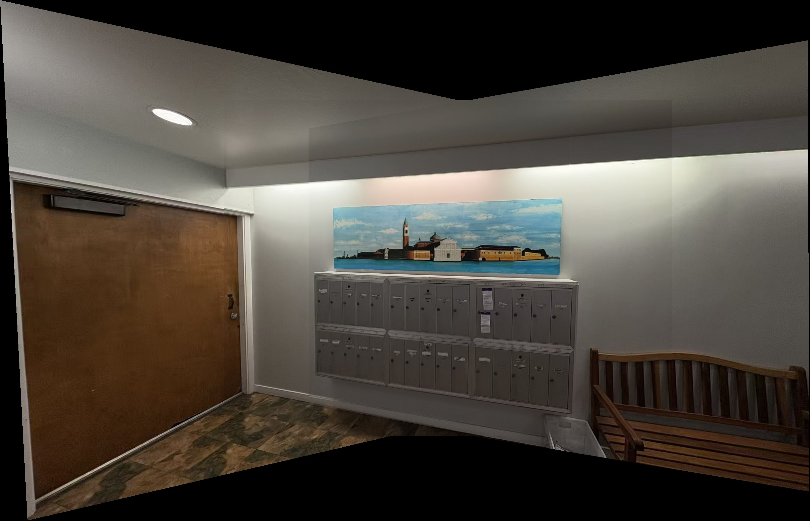

I can see the clear edges of these warp and unwarped figures! ***Now I will use the feather technique***. Under the help of `cv2.cvtColor` and `cv2.distanceTransform` function, for each warped individual figure, I can generate the weight mask. The algorithm will calculate the every non-zero (non-black) pixel's nearest distance to an edge, and I will utilize this to generate weight. The center of the warped un-black part has the largest distance, so I will divide all numerical value with center's max value for normalization. Then for one pixel covered by $t$ figures $f$, and there corresponding weights are $w$, then:
$$
pixel = \frac{\sum_{i=1}^{t}w_i\cdot f_i}{\sum_{i=1}^{t}w_i}
$$
 Of course, if a pixel is not covered by any figure, then its value is set to 0. The pictures gallery of the feather algorithm is as follows:

> **For the two Homography Matrix listed: The upper one: Left two pictures; The lower one: Right two pictures**

        <figure>
            
        </figure>
             <figure>
            
        </figure>
             <figure>
            
        </figure>

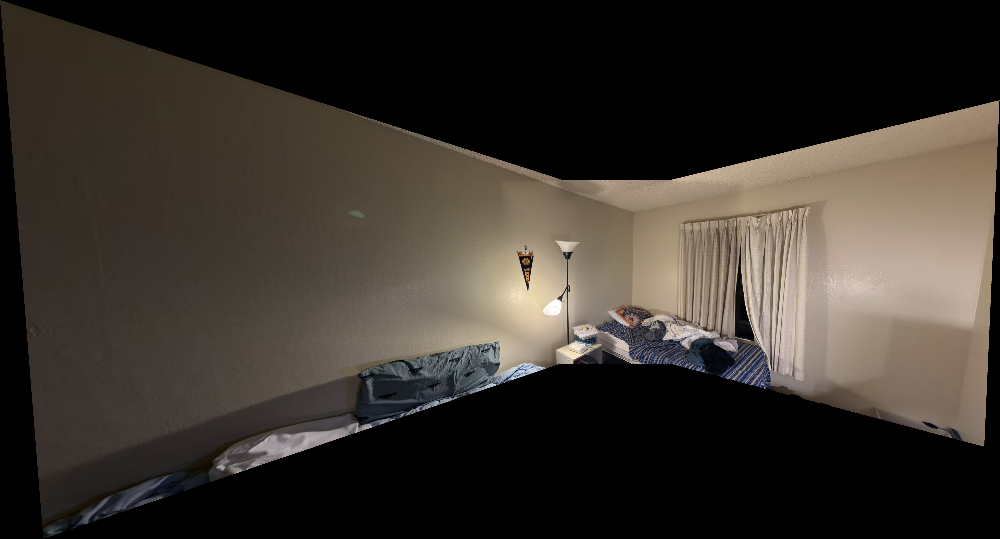

> ***Homography Matrix:***
>
> [[ 3.06122050e+00  4.39113598e-02 -2.88814588e+03]
>
> [ 7.34412673e-01 2.59447733e+00 -9.75025092e+02]
>
> [ 1.17792019e-03 4.44158753e-05 1.00000000e+00]]
>
> [[ 1.35717752e+00  2.18071555e-02 -6.27664041e+02]
>
> [ 1.27211584e-01 1.24211746e+00 -1.52353887e+02]
>
> [ 1.94604341e-04 3.17155520e-05 1.00000000e+00]]

        <figure>
            
        </figure>
             <figure>
            
        </figure>
             <figure>
            
        </figure>

> ***Homography Matrix:***
>
> [[ 1.30102930e+00  8.18834656e-03 -5.89189943e+02]
>
> [ 1.10316917e-01 1.19378131e+00 -1.29417538e+02]
>
> [ 1.67001464e-04 1.10099768e-05 1.00000000e+00]]
>
> [[ 8.34409707e-01 1.15687740e-02 3.25353039e+02]
>
> [-6.43627649e-02 9.37872425e-01 3.11531613e+01]
>
> [-9.49545824e-05 5.08008439e-06 1.00000000e+00]]

        <figure>
            
        </figure>
             <figure>
            
        </figure>
             <figure>
            
        </figure>

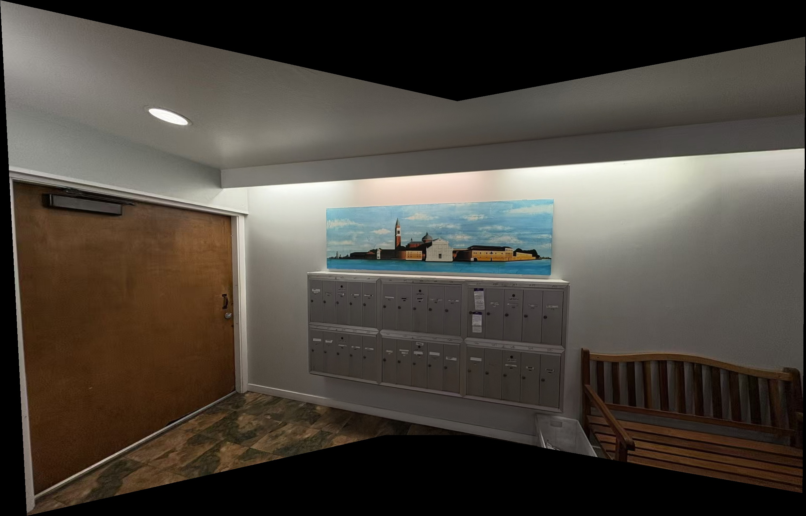

> ***Homography Matrix:***
>
> [[ 1.60309551e+00  3.36832881e-02 -6.75362213e+02]
>
> [ 2.67356906e-01 1.30042620e+00 -3.13023101e+02]
>
> [ 5.60953866e-04 4.16810563e-05 1.00000000e+00]]
>
> [[ 6.23014666e-01  1.00131026e-03  2.55555207e+02]
>
> [-1.44890682e-01 8.32506764e-01 8.57408488e+01]
>
> [-2.75996624e-04 -3.28634124e-06 1.00000000e+00]]

Now the edge artifact phenomenon is largely eased under the influence of feathering algorithm. 