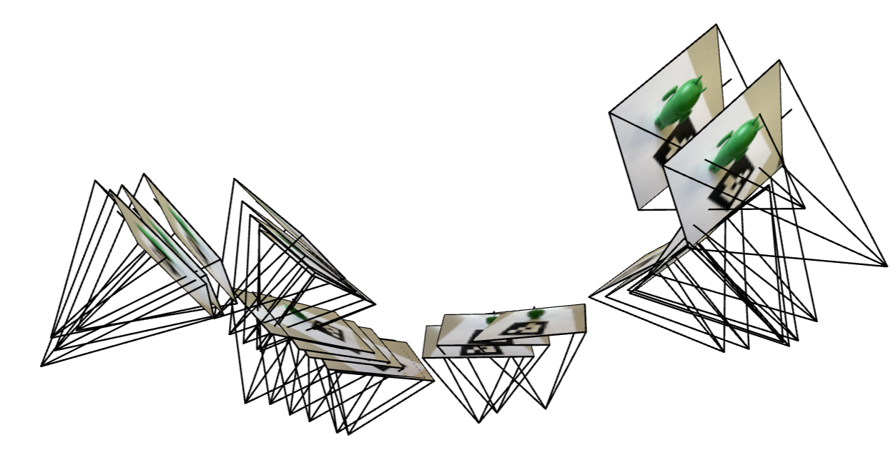
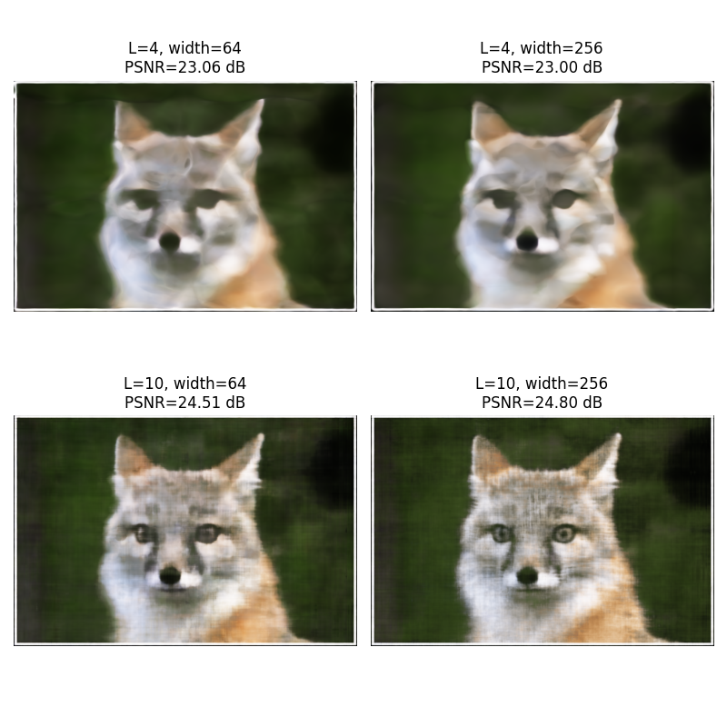
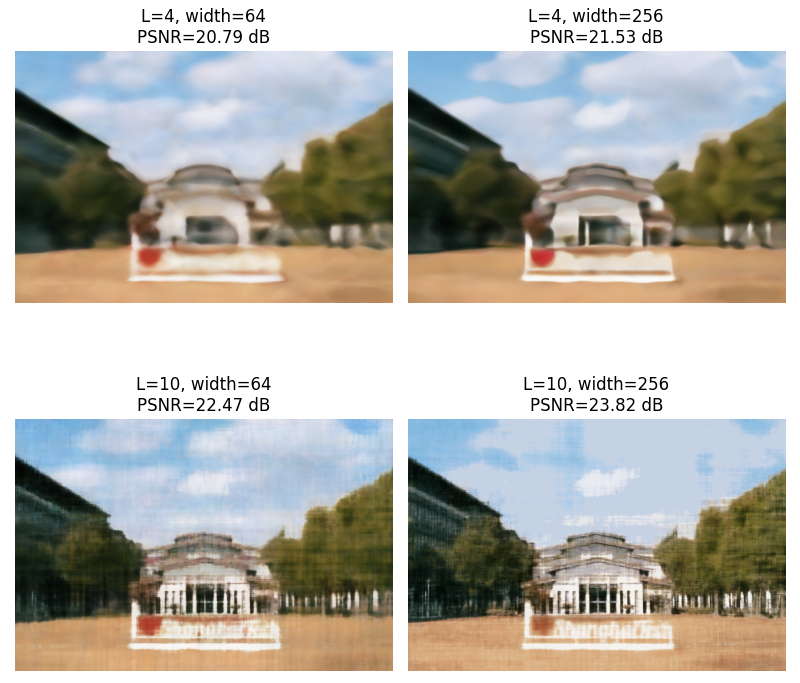
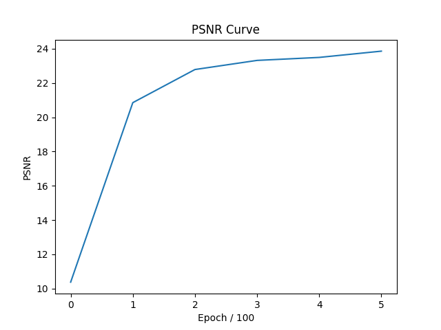
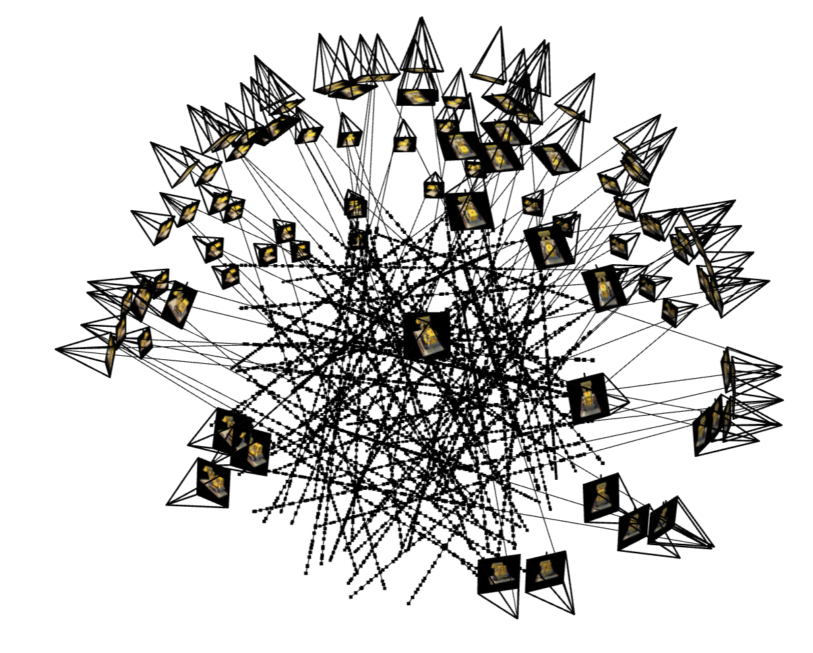
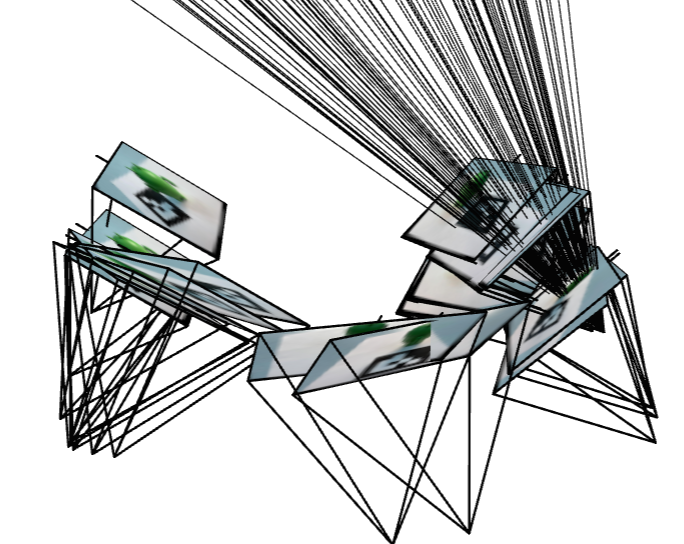
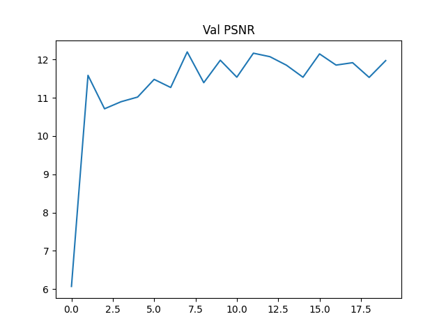
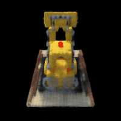

# Proj4 - Neural Radiance Field!

## Part 0: Calibrating Your Camera and Capturing a 3D Scan

***Deliverable:*** ***Here are the results of  2 screenshots of your camera frustums visualization in Viser***

<div style="display: flex; justify-content: space-around; align-items: center;">
        <figure>
            
        </figure>
             <figure>
            
        </figure>
</div>


## Part 1: Fit a Neural Field to a 2D Image

In this part, we will try to fit NeRF to 2D scenario. The pictures I chose are fox and ShanghaiTech:

> Fox Image Source: https://live.staticflickr.com/7492/15677707699_d9d67acf9d_b.jpg
>
> ShanghaiTech Image Source: https://zhuanlan.zhihu.com/p/616005193

<div style="display: flex; justify-content: space-around; align-items: center;">
        <figure>
            
        </figure>
             <figure>
            
        </figure>
</div>
***Deliverable:*** ***Model architecture report (number of layers, width, learning rate, and other important details):***

Since I've noticed that the most hidden states dimensions are identical, so here I designed so as well. Following nerf, every input coordinates will be processed with a positional embedding.
$$
PE(x) = \{x, \sin(2^0 \pi x), \cos(2^0 \pi x), \sin(2^1 \pi x), \cos(2^1 \pi x), \dots, \sin(2^{L-1} \pi x), \cos(2^{L-1} \pi x)\}
$$
The model structure is as below. Two important parameters are L and hidden_dim. 

````text
Input: [B, 2] ↓ 
Positional Encoding (L) ↓ 
[B, 2 * (1 + 2*L)] ↓ 
Linear(2 * (1 + 2*L), hidden_dim) -> ReLU ↓ ... (repeated num_layers - 2 times) ... ↓ 
Linear(hidden_dim, hidden_dim) -> ReLU ↓ 
Linear(hidden_dim, hidden_dim) -> ReLU ↓ 
Linear(hidden_dim, 3) -> Sigmoid ↓ 
Output: [B, 3]
````

Another key things to deal with is the range of input and output. Input coords, and output rgb should be in range [0, 1] for numerical stability, and hence i choose sigmoid function as the output activation. 

The metric is PSNR:
$$
PSNR = 10 \cdot \log_{10} \left( \frac{1}{MSE} \right)
$$
***Deliverable:*** ***Training progression visualization on both the provided test image and one of your own images:***

> During training, the inference, aka, the predicted whole image is presented as below. From the progression visualization, we can infer that during training model learned and did better and better:


>  In this model, some hyperparameter can be rather important. For instance, the choice of max positional encoding frequency and width (which can be interpreted as the dimension of the hidden layer). There hyperparameters can heavily affect the expressive power of the model. Intuitively, higher the max frequency is, larger the hidden dimension is, the more expressive the model is. Here is the naive comparison study visualization to directly demonstrate this conclusion:

***Deliverable: Final results for 2 choices of max positional encoding frequency and 2 choices of width (2x2 grid)***

<div style="display: flex; justify-content: space-around; align-items: center;">
        <figure>
            
        </figure>
             <figure>
            
        </figure>
</div>
***Deliverable: PSNR curve for training on one image of your choice***

> The PSNR curves of fox and ShanghaiTech during training are presented as below: Left: Fox; Right: ShanghaiTech

<div style="display: flex; justify-content: space-around; align-items: center;">
        <figure>
            
        </figure>
             <figure>
            
        </figure>
</div>

## Part 2: Fit a Neural Radiance Field from Multi-view Images

***Deliverable: Brief description of how you implemented each part***

For 2.1, for a pixel coordinate, I turn them into homogeneous coordinates and apply the inverse of K to get the ray. Then with 'camera to world' matrix, I get the origins of the cameras and the direction of rays. 

For 2.2, from near to far, setting up intervals and sampling points. That's why near and far parameters can be important. For the dataset, I wrote a class with function `sample_rays` based on the previous code, which can sample rays, return their information and return there rgb.

For 2.3, most code are borrowed from the website with modification w.r.t. size of frustum and point cloud, some bug (share=Ture, etc). Using the code in the web, the visualizations on ray and  samples can be produced.

For 2.4, I strictly follows the following nerf structure from the website. The core idea of the code is consistent with the one in part1. I set up neural net modules according to the structure of concatenation and two-head predictions. Debugging about running network on GPU device is torturing. 


For 2.5, the formula is as below (here of course we use discrete version). After calculating deltas and alphas, sum them up. `torch.cumsum` and `torch.cumprod` are useful here. For the deliverable of training process, simply run eval for the first frame periodically. 
$$
C(\mathbf{r}) = \int_{t_n}^{t_f} T(t)\sigma(\mathbf{r}(t))c(\mathbf{r}(t), \mathbf{d})dt, \text{ where } T(t) = \exp\left(-\int_{t_n}^{t} \sigma(\mathbf{r}(s))ds\right) \\
\hat{C}(\mathbf{r}) = \sum_{i=1}^{N} T_i \left(1 - \exp(-\sigma_i \delta_i)\right) \mathbf{c}_i, \text{ where } T_i = \exp \left( - \sum_{j=1}^{i-1} \sigma_j \delta_j \right)
$$
For 2.6, unfortunately I failed this section. I succeeded on lego example but failed my own dataset, so I suspect there's something wrong with my part0 code (calibration and pose estimation). But the debugging eventually goes in vein. 

The whole experiment is run with a GeForceRTX2080Ti. 

### Part 2.1: Lego

***Deliverable: Visualization of rays and samples with cameras (up to 100 rays)***

<div style="display: flex; justify-content: space-around; align-items: center;">
        <figure>
            
        </figure>
             <figure>
            
        </figure>
             <figure>
            
        </figure>
</div>
<div style="display: flex; justify-content: space-around; align-items: center;">
        <figure>
            
        </figure>
             <figure>
            
        </figure>
</div>


***Deliverable: Training progression visualization with predicted images across iterations***


***Deliverable: PSNR curve on the validation set***


***Deliverable: Spherical rendering video of the Lego using provided test cameras***


### Part 2.2: Training with Your Own Data


***Deliverable: GIF of camera circling your object showing novel views***

> Unfortunately, the nerf training on the my Android Man dataset performs poorly. Given that my lego example is correct but mine failed, I strongly suspect that my calibration implementation is not completely correct. I've debugged and checked many times, but in vein. 


***Deliverable: Plot of training loss over iterations***

> The PSNR and loss curve during training is provided below:

<div style="display: flex; justify-content: space-around; align-items: center;">
        <figure>
            
        </figure>
             <figure>
            
        </figure>
</div>

***Deliverable: Discussion of code or hyperparameter changes you made***


For the hyperparameter, from the perspective of rendering and point sampling, `near and far` parameters are rather important. For my own datasets, I initially tried `0.02 and 0.5`, and jittered around the values to seek for the best performance. Unfortunately, all of them perform poorly. And then from the perspective of batch size and number of iterations can be important as well. For these two parameters, intuitively, the larger, the better. Here are the demonstration of the results under different parameters settings:

<div style="display: flex; justify-content: space-around; align-items: center;">
        <figure>
            <figcaption>Num Iter: 1000; Batch Size: 1024</figcaption>
        </figure>
             <figure>
            <figcaption>Num Iter: 2000; Batch Size: 4096</figcaption>
        </figure>
</div>

<div style="display: flex; justify-content: space-around; align-items: center;">
        <figure>
            <figcaption>Num Iter: 3000; Batch Size: 6144</figcaption>
        </figure>
             <figure>
            <figcaption>Num Iter: 10000; Batch Size: 6144</figcaption>
        </figure>
</div>