# Project 5: Diffusion Models

## Project 5A: The Power of Diffusion Models!

### Overview

In part A you will play around with diffusion models, implement diffusion sampling loops, and use them for other tasks such as inpainting and creating optical illusions.

### Part 0: Setup

> We are going to use the [DeepFloyd IF](https://huggingface.co/docs/diffusers/api/pipelines/deepfloyd_if) diffusion model. DeepFloyd is a two stage model trained by Stability AI. The first stage produces images of size and the second stage takes the outputs of the first stage and generates images of size.

Loading this model can be somehow difficult for some mysterious bug. I ran into `std::bad alloc()` issue for some undepictable reasons and the colab will simply crash down with few information for problem shooting. Hence, I followed the method introduced in the following link to finish part0.

> https://colab.research.google.com/github/huggingface/notebooks/blob/main/diffusers/deepfloyd_if_free_tier_google_colab.ipynb

Deliverables: 

- Come up with some interesting text prompts and generate their embeddings.

The three prompts I used are: 

```python
embeds_1 = embeddings_dict['an android dreaming of electric sheep']
embeds_2 = embeddings_dict['Dr.Jones holding the holy grail']
embeds_3 = embeddings_dict['a mobius strip']
```

- Choose 3 of your prompts to generate images and display the caption and the output of the model. Reflect on the quality of the outputs and their relationships to the text prompts. Make sure to try at least 2 different `num_inference_steps` values.

***Figure 1: an android dreaming of electric sheep***

<div style="display: flex; justify-content: space-around; align-items: center;">
        <figure>
            
            <figcaption>
                stage 1; 50 steps
            </figcaption>
        </figure>
            <figure>
            
            <figcaption>
                stage 2; 50 steps
            </figcaption>
        </figure>
             <figure>
            
            <figcaption>
                stage 3; 50 steps
            </figcaption>
</div>

<div style="display: flex; justify-content: space-around; align-items: center;">
        <figure>
            
            <figcaption>
                stage 1; 100 steps
            </figcaption>
        </figure>
            <figure>
            
            <figcaption>
                stage 2; 100 steps
            </figcaption>
        </figure>
             <figure>
            
            <figcaption>
                stage 3; 100 steps
            </figcaption>
</div>

Yes, I've watched the movie 'Blade Runner' recently. To be honest, I think this prompt is kind of difficult. The 100 inference steps figures basically can satisfy my requirement with the android and sheep, but the 50 inference steps figures are far from satisfaction. 

***Figure 2: Dr.Jones holding the holy grail***

<div style="display: flex; justify-content: space-around; align-items: center;">
        <figure>
            
            <figcaption>
                stage 1; 50 steps
            </figcaption>
        </figure>
            <figure>
            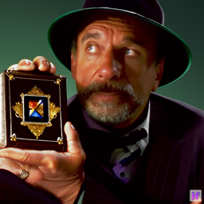
            <figcaption>
                stage 2; 50 steps
            </figcaption>
        </figure>
             <figure>
            
            <figcaption>
                stage 3; 50 steps
            </figcaption>
</div>

<div style="display: flex; justify-content: space-around; align-items: center;">
        <figure>
            
            <figcaption>
                stage 1; 100 steps
            </figcaption>
        </figure>
            <figure>
            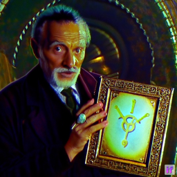
            <figcaption>
                stage 2; 100 steps
            </figcaption>
        </figure>
             <figure>
            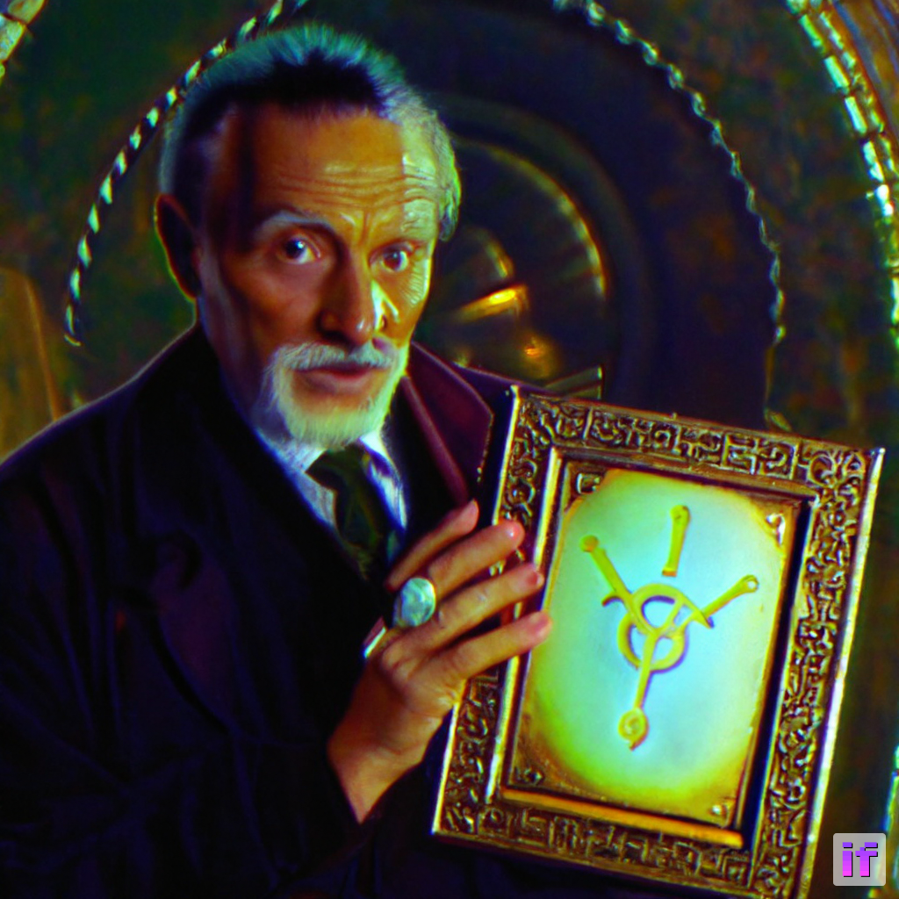
            <figcaption>
                stage 3; 100 steps
            </figcaption>
</div>

Yes again, I've watched the movie 'Indiana Jones' series recently. All pictures above have the appearance of Dr. Jones (though maybe not the original one in the movie, but it is an old man professor as well). But the holy grail is not interpreted well enough.

***Figure 3: a mobius strip***

<div style="display: flex; justify-content: space-around; align-items: center;">
        <figure>
            
            <figcaption>
                stage 1; 50 steps
            </figcaption>
        </figure>
            <figure>
            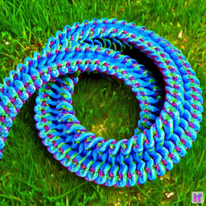
            <figcaption>
                stage 2; 50 steps
            </figcaption>
        </figure>
             <figure>
            
            <figcaption>
                stage 3; 50 steps
            </figcaption>
</div>

<div style="display: flex; justify-content: space-around; align-items: center;">
        <figure>
            
            <figcaption>
                stage 1; 50 steps
            </figcaption>
        </figure>
            <figure>
            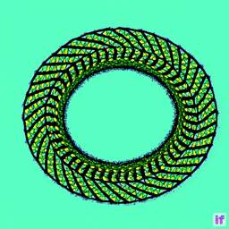
            <figcaption>
                stage 2; 50 steps
            </figcaption>
        </figure>
             <figure>
            
            <figcaption>
                stage 3; 50 steps
            </figcaption>
</div>

Both 50 inference steps figures and 100 inference steps figures are not satisfying. But at least the figures are about a strip. Maybe I believe that 'Mobius Strip' rarely appears in the training corpus of the DeepFloyd model so the model can't handle the concept of 'Mobius Strip'.

- Report the random seed that you're using here. You should use the same seed all subsequent parts.

The random seed I set here is 42. 

### Part 1: Sampling Loops

> In this part of the problem set, you will write your own "sampling loops" that use the pretrained DeepFloyd denoisers. These should produce high quality images such as the ones generated above.
>
> You will then modify these sampling loops to solve different tasks such as inpainting or producing optical illusions.

#### 1.1 Implementing the Forward Process

The forward process is defined by:
$$
q(\mathbf{x}_t | \mathbf{x}_0) = \mathcal{N}(\mathbf{x}_t; \sqrt{\bar{\alpha}_t}\mathbf{x}_0, (1 - \bar{\alpha}_t)\mathbf{I})
$$
And is equivalent to computing:
$$
\mathbf{x}_t = \sqrt{\bar{\alpha}_t}\mathbf{x}_0 + \sqrt{1 - \bar{\alpha}_t}\boldsymbol{\epsilon} \quad \text{where} \quad \boldsymbol{\epsilon} \sim \mathcal{N}(\mathbf{0}, \mathbf{I})
$$
In the implementation, $\bar{\alpha}_t$ is retrieved from the loaded DeepFloyd Model. 

````python
alphas_cumprod = stage_1.scheduler.alphas_cumprod
print(f"We have in total {alphas_cumprod.shape[0]} noise coefficients")
# We have in total 1000 noise coefficients
````

**Deliverables**: Show the Campanile at noise level [250, 500, 750].


> Original; t=250; t=500; t=750

#### 1.2 Classical Denoising

 Here try to use **Gaussian blur filtering** to try to remove the noise. Here, I set `kernel_size = 5` and `sigma = 2`

> If sigma None, then it is computed using kernel_size as $sigma = 0.3 * ((kernel\_size - 1) * 0.5 - 1) + 0.8$.

**Deliverables**: For each of the 3 noisy Campanile images from the previous part, show your best Gaussian-denoised version side by side.


#### 1.3 One-Step Denoising

Now, we'll use a pretrained diffusion model to denoise. The actual denoiser can be found at `stage_1.unet`. This is a UNet that has already been trained on a *very, very* large dataset of $(x_0, x_t)$ pairs of images. We can use it to recover Gaussian noise from the image. Then, we can remove this noise to recover (something close to) the original image. Note: this UNet is conditioned on the amount of Gaussian noise by taking timestep as additional input.

When removing the noise, it is not a simple subtraction. After deriving the math, the denoising formula should as below:
$$
x_0 = \frac{x_t - \sqrt{1-\bar{\alpha}_t}\,\hat{\varepsilon}}{\sqrt{\bar{\alpha}_t}}
$$
**Deliverables**: the original image, the noisy image, and the estimate of the original image are as below:


#### 1.4 Iterative Denoising

In part 1.3, you should see that the denoising UNet does a much better job of projecting the image onto the natural image manifold, but it does get worse as you add more noise. This makes sense, as the problem is much harder with more noise!

In theory, we could start with noise $x_{1000}$ at timestep $T=1000$, denoise for one step to get an estimate of $x_{999}$, and carry on until we get $x_0$. But this would require running the diffusion model 1000 times, which is quite slow. It turns out, we can actually speed things up by skipping steps. The rationale for why this is possible is due to a connection with differential equations. To actually do this, we have the following formula:
$$
\mathbf{x}_{t'} = \frac{\sqrt{\bar{\alpha}_{t'}}\beta_t}{1-\bar{\alpha}_t}\mathbf{x}_0 + \frac{\sqrt{\bar{\alpha}_t(1-\bar{\alpha}_{t'})}}{1-\bar{\alpha}_t}\mathbf{x}_t + \boldsymbol{\nu}\boldsymbol{\sigma}
$$

- $\mathbf{x}_t$ is your **image at timestep $t$**
- $\mathbf{x}_{t'}$ is your **noisy image at timestep $t'$** where $t' < t$ (**less noisy**)
- $\bar{\alpha}_t$ is defined by `alphas_cumprod`, as explained above.
- $\alpha_t = \frac{\bar{\alpha}_t}{\bar{\alpha}_{t'}}$
- $\beta_t = 1 - \alpha_t$
- $\mathbf{x}_0$ is our **current estimate of the clean image** using one-step denoising

**Deliverables**: The comprehensive required images gallery is as below:


#### 1.5 Diffusion Model Sampling

In part 1.4, we use the diffusion model to denoise an image. Another thing we can do with the `iterative_denoise` function is to generate images from scratch. We can do this by setting `i_start = 0` and passing `im_noisy` as random noise. This effectively denoises pure noise. Please do this, and show 5 results of the prompt`"a high quality photo"`.

**Deliverables**: The 5 sampled images are as below:


#### 1.6 Classifier-Free Guidance (CFG)

In order to greatly improve image quality (at the expense of image diversity), we can use a technicque called Classifier-Free Guidance.

In CFG, we compute both a conditional and an unconditional noise estimate. We denote these $\epsilon_c$ and $\epsilon_u$. Then, we let our new noise estimate be:
$$
\boldsymbol{\epsilon} = \boldsymbol{\epsilon}_u + \gamma(\boldsymbol{\epsilon}_c - \boldsymbol{\epsilon}_u)
$$
where $\mathbf{\gamma}=7$ controls the strength of CFG.

**Deliverables**: Show 5 images of `"a high quality photo"` with a CFG scale of  $\mathbf{\gamma}=7$

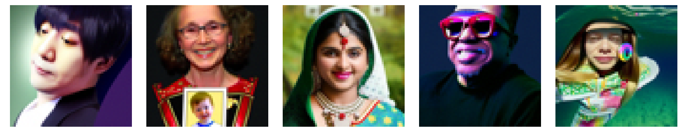

#### 1.7 Image-to-image Translation

In part 1.4, we take a real image, add noise to it, and then denoise. This effectively allows us to make edits to existing images. The more noise we add, the larger the edit will be. This works because in order to denoise an image, the diffusion model must to some extent "hallucinate" new things -- the model has to be "creative." Another way to think about it is that the denoising process "forces" a noisy image back onto the manifold of natural images.

Here, we're going to take the original Campanile image, noise it a little, and force it back onto the image manifold without any conditioning. Effectively, we're going to get an image that is similar to the Campanile (with a low-enough noise level). This follows the [SDEdit](https://sde-image-editing.github.io/) algorithm.

**Deliverables**: 

For 1.7.2 and 1.7.3, my own pictures are borrowed from project4: fox and shanghaitech:

<div style="display: flex; justify-content: space-around; align-items: center;">
        <figure>
            
            <figcaption>
                Fox
            </figcaption>
        </figure>
            <figure>
            
            <figcaption>
                ShanghaiTech
            </figcaption>
 </div>


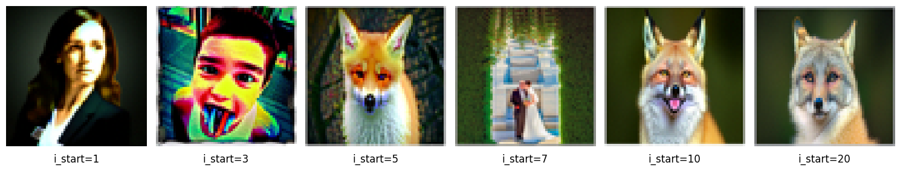


#####  1.7.1 Editing Hand Drawn and Web Images

This procedure works particularly well if we start with a nonrealistic image (e.g. painting, a sketch, some scribbles) and project it onto the natural image manifold.

Please experiment by starting with hand-drawn or other non-realistic images and see how you can get them onto the natural image manifold in fun ways.

**Deliverables**:


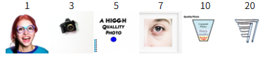

##### 1.7.2 Inpainting

We can use the same procedure to implement inpainting (following the [RePaint](https://arxiv.org/abs/2201.09865) paper). The formula is as follows:
$$
\mathbf{x}_t \leftarrow \mathbf{m}\mathbf{x}_t + (1 - \mathbf{m})\text{forward}(\mathbf{x}_{\text{orig}}, t)
$$
Essentially, we leave everything inside the edit mask alone, but we replace everything outside the edit mask with our original image -- with the correct amount of noise added for timestep $\mathbf{t}$.

**Deliverables**:

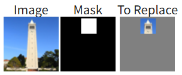


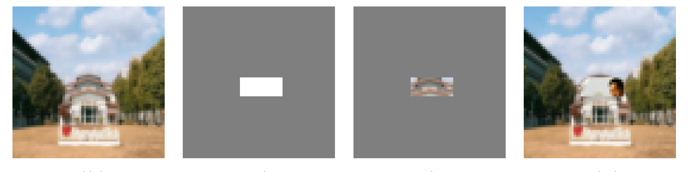

##### 1.7.3: Text Conditional Image to Image Translation

Now, we will do the same thing as SDEdit, but guide the projection with a text prompt. This is no longer pure "projection to the natural image manifold" but also adds control using language. This is simply a matter of changing the prompt from `"a high quality photo"` to any of your prompt!

**Deliverables**:


> "a rocket ship" $\rightarrow$ Companile


> "a pencil" $\rightarrow$ Companile

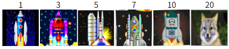

> "a rocket ship" $\rightarrow$ Fox


> "a pencil" $\rightarrow$ ShanghaiTech

#### 1.8 Visual Anagrams

The full algorithm will be:
$$
\begin{align}
\boldsymbol{\epsilon}_1 &= \text{CFG of UNet}(\mathbf{x}_t, t, \mathbf{p}_1) \\
\boldsymbol{\epsilon}_2 &= \text{flip}(\text{CFG of UNet}(\text{flip}(\mathbf{x}_t), t, \mathbf{p}_2)) \\
\boldsymbol{\epsilon} &= (\boldsymbol{\epsilon}_1 + \boldsymbol{\epsilon}_2)/2
\end{align}
$$
**Deliverables**:

````python
embeds_1 = prompt_embeds_dict["an oil painting of an old man"]
embeds_2 = prompt_embeds_dict["an oil painting of people around a campfire"]
````


````python
embeds_1 = prompt_embeds_dict["a photo of a hipster barista"]
embeds_2 = prompt_embeds_dict["a photo of a dog"]
````

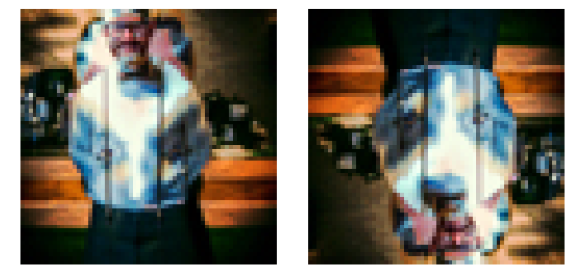


#### 1.9 Hybrid Images

In order to create hybrid images with a diffusion model we can use a similar technique as above. We will create a composite noise estimate $\epsilon$, by estimating the noise with two different text prompts, and then combining low frequencies from one noise estimate with high frequencies of the other. The algorithm is:
$$
\begin{align}
\boldsymbol{\epsilon}_1 &= \text{CFG of UNet}(\mathbf{x}_t, t, \mathbf{p}_1) \\
\boldsymbol{\epsilon}_2 &= \text{CFG of UNet}(\mathbf{x}_t, t, \mathbf{p}_2) \\
\boldsymbol{\epsilon} &= f_{\text{lowpass}}(\boldsymbol{\epsilon}_1) + f_{\text{highpass}}(\boldsymbol{\epsilon}_2)
\end{align}
$$
It is recommend to use a gaussian blur of kernel size 33 and sigma 2.

**Deliverables**: 


> Sorry the second figure is mislabeled, the caption should be `skull + campfire`

## Project 5B: Flow Matching from Scratch!

### Part 1: Training a Single-Step Denoising UNet

#### 1.1 Implementing the UNet

Unconditional UNet:


Standard UNet Operations:


#### 1.2 Using the UNet to Train a Denoiser

For each training batch, we can generate $z$ from $x$ using the the following noising process:
$$
z = x + \sigma\epsilon, \quad \text{where } \epsilon \sim \mathcal{N}(0, I).
$$
***Deliverable:*** A visualization of the noising process using $\sigma = [0.0, 0.2, 0.4, 0.5, 0.6, 0.8, 1.0].$


##### 1.2.1 Training

Now, we will train the model to perform denoising.

- **Objective:** Train a denoiser to denoise noisy image with $\sigma=0.5$ applied to a clean image $x$.
- Dataset and dataloader: Use the MNIST dataset via `torchvision.datasets.MNIST`. Train only on the training set. Shuffle the dataset before creating the dataloader. Recommended batch size: 256. We'll train over our dataset for 5 epochs.
  - You should only noise the image batches when fetched from the dataloader so that in every epoch the network will see new noised images due to a random , improving generalization.
- **Model:** Use the UNet architecture defined in section 1.1 with recommended hidden dimension `D = 128`.
- **Optimizer:** Use Adam optimizer with learning rate of 1e-4.

***Deliverables:*** A training loss curve plot every few iterations during the whole training process of $\sigma=0.5$


***Deliverables:*** Sample results on the test set with noise level 0.5 after the first and the 5-th epoch

<div style="display: flex; justify-content: space-around; align-items: center;">
        <figure>
            
            <figcaption>
                After 1-th epoch
            </figcaption>
        </figure>
            <figure>
            
            <figcaption>
                After 5-th epoch
            </figcaption>
 </div>

##### 1.2.2 Out-of-Distribution Testing

Our denoiser was trained on MNIST digits noised with $\sigma=0.5$. Let's see how the denoiser performs on different 's that it wasn't trained for.

Visualize the denoiser results on test set digits with varying levels of noise $\sigma = [0.0, 0.2, 0.4, 0.5, 0.6, 0.8, 1.0].$

***Deliverables:*** Sample results on the test set with out-of-distribution noise levels after the model is trained. Keep the same image and vary $\sigma = [0.0, 0.2, 0.4, 0.5, 0.6, 0.8, 1.0].$ 


##### 1.2.3 Denoising Pure Noise

To make denoising a generative task, we'd like to be able to denoise pure, random Gaussian noise. We can think of this as starting with a blank canvas $z=\epsilon$ where $\epsilon \sim N(0, I)$ and denoising it to get a clean image $x$.

Repeat the same training process as in part 1.2.1, but input pure noise $\epsilon \sim N(0, I)$ and denoise it for 5 epochs. Display your results after 1 and 5 epochs.

Sample from the denoiser that was trained to denoise pure noise. What patterns do you observe in the generated outputs? What relationship, if any, do these outputs have with the training images (e.g., digits 0–9)? Why might this be happening?

***Deliverables:*** A training loss curve plot every few iterations during the whole training process that denoises pure noise.


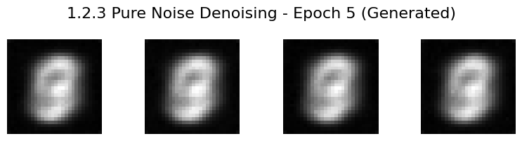

***Deliverables:*** A brief description of the patterns observed in the generated outputs and explanations for why they may exist.

Description: Since the denoised figure, i.e., input figure, is a pure noise. And what's more, there's no condition during denoise. So the model actually has no conditioned distribution bias, tending to predict toward the average of all figures. So in the end, the generated figures seem to be the blurring version combining all the digits.

### Part 2: Training a Flow Matching Model

We just saw that one-step denoising does not work well for generative tasks. Instead, we need to **iteratively denoise** the image, and we will do so with **flow matching**. Here, we will iteratively denoise an image by training a UNet model to predict the 'flow' from our noisy data to clean data. In our flow matching setup, we sample a pure noise image $x_0 \sim \mathcal{N}(0, I)$ and generate a realistic image $x_1$. 

For iterative denoising, we need to define how **intermediate noisy samples** are constructed. The simplest approach would be a **linear interpolation** between noisy $x_0$ and clean $x_1$ for some $x_1$ in our training data: 
$$
x_t = (1-t)x_0 + tx_1 \quad \text{where } x_0 \sim \mathcal{N}(0, I), t \in [0, 1]
$$
This is a **vector field** describing the position of a point $x_t$ at time $t$ relative to the clean data distribution $p_1(x_1)$ and the noisy data distribution $p_0(x_0)$. Intuitively, we see that for small $t$, we remain close to noise, while for larger $t$, we approach the clean distribution. 

Flow can be thought of as the **velocity** (change in position w.r.t. time) of this vector field, describing how to move from $x_0$ to $x_1$: 
$$
u(x_t, t) = \frac{d}{dt} x_t = x_1 - x_0.
$$
Our aim is to learn a UNet model $u_\theta(x_t, t)$ which approximates this flow $u(x_t, t) = x_1 - x_0$, giving us our **learning objective**: 
$$
L = \mathbb{E}_{x_0 \sim p_0(x_0), x_1 \sim p_1(x_1), t \sim \mathcal{U}[0, 1]} [\|(x_1 - x_0) - u_\theta(x_t, t)\|^2].
$$

#### 2.1 Adding Time Conditioning to UNet

UNet with condition:


Need a new operator which we use to inject the ***conditioning signal*** into the UNet:


#### 2.2 Training the UNet


***Deliverable:*** A training loss curve plot for the time-conditioned UNet over the whole training process.


#### 2.3 Sampling from the UNet

We can now use our UNet for iterative denoising using the algorithm below! The results would not be perfect, but legible digits should emerge:


***Deliverables:*** Sampling results from the time-conditioned UNet for 1, 5, and 10 epochs. The results should not be perfect, but reasonably good.

<div style="display: flex; justify-content: space-around; align-items: center;">
        <figure>
            
            <figcaption>
                After 1-th epoch
            </figcaption>
        </figure>
            <figure>
            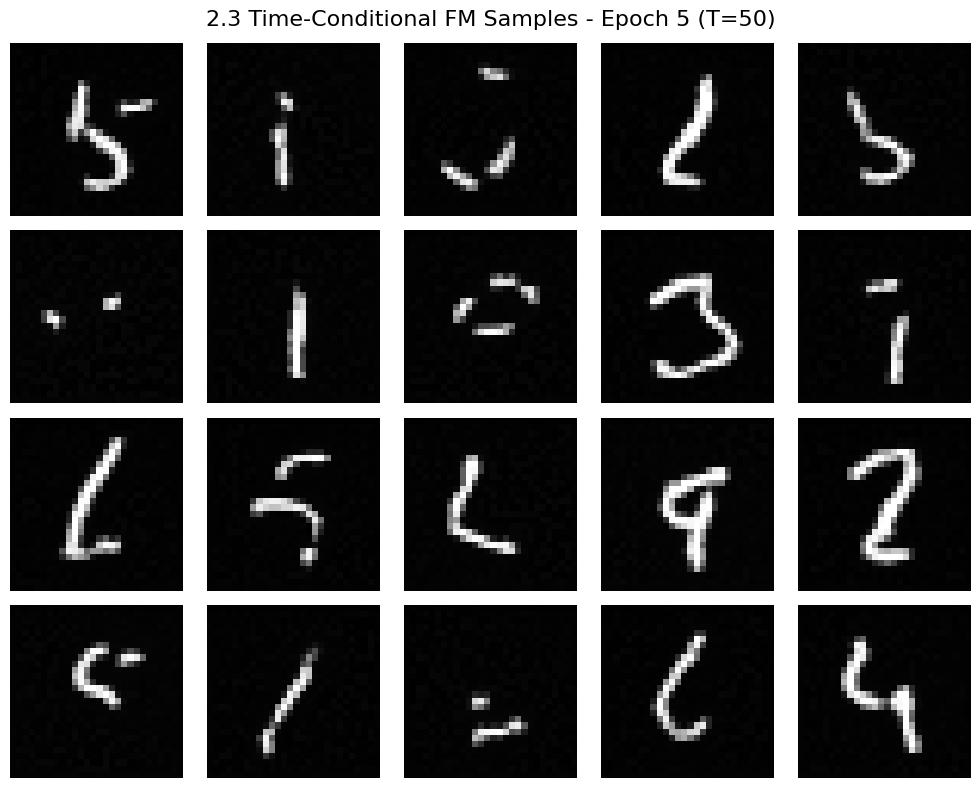
            <figcaption>
                After 5-th epoch
            </figcaption>
    </figure>
    <figure>
            
            <figcaption>
                After 10-th epoch
            </figcaption>
        </figure>
 </div>

#### 2.4 Adding Class-Conditioning to UNet

To make the results better and give us more control for image generation, we can also optionally condition our UNet on the class of the digit 0-9. This will require adding 2 more `FCBlocks` to our UNet but, we suggest that for class-conditioning vector **c**, you make it a **one-hot vector** instead of a single scalar. Because we still want our UNet to work without it being conditioned on the class (recall the **classifier-free guidance** you implemented in part a)), we implement **dropout** where $10\%$ of the time ($P_{uncond} = 0.1$) we drop the class conditioning vector $c$ by setting it to $0$. Here is one way to condition our UNet $u_\theta(\mathbf{x}_t, t, c)$ on both time $t$ and class $c$:

#### 2.5 Training the UNet

Training for this section will be the same as time-only, with the only difference being the conditioning vector and doing unconditional generation periodically. Training class-conditioned UNet:


***Deliverable:*** A training loss curve plot for the class-conditioned UNet over the whole training process.

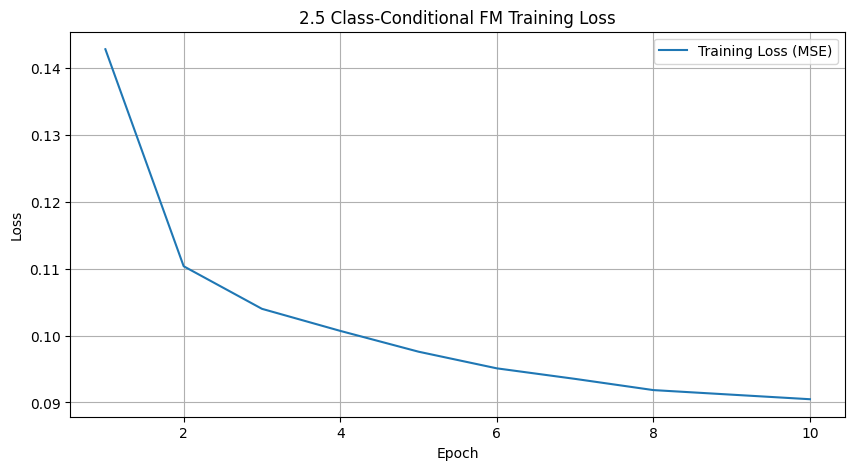

#### 2.6 Sampling from the UNet

Now we will sample with class-conditioning and will use classifier-free guidance with $\gamma=5.0$. Sampling from class-conditioned UNet:


***Deliverables:*** Sampling results from the class-conditioned UNet for 1, 5, and 10 epochs. Class-conditioning lets us converge faster, hence why we only train for 10 epochs. Generate 4 instances of each digit as shown above.

1 Epoch:


5 Epoch:

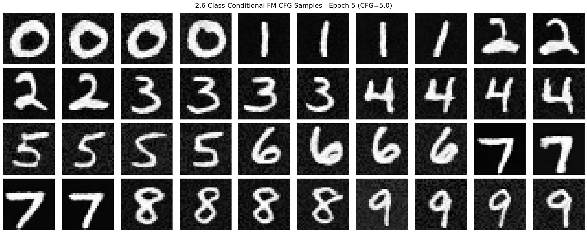

10 Epoch:


***Deliverables:*** **Can we get rid of the annoying learning rate scheduler?** Simplicity is the best. Please try to maintain the same performance after removing the exponential learning rate scheduler. Show your visualization after training without the scheduler and provide a description of what you did to compensate for the loss of the scheduler.
The mechanism of scheduler, in a nut shell, is to decrease the learning rate in the later phase of the training, since by model can be struggling to fit into the narrow optima. By then, larger learning rate, i.e., larger update steps, can bring trouble to the optimization. So my idea is to lower the learning rate and extend the number of training epochs if needed.

1 Epoch:

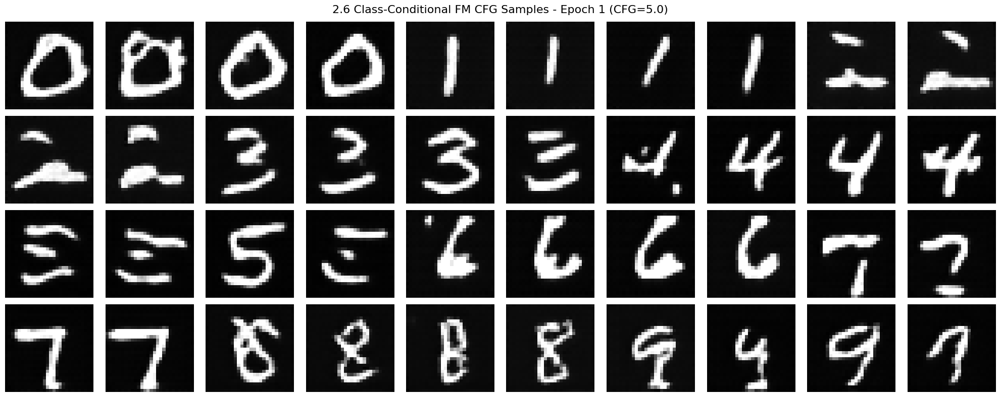

5 Epoch:


10 Epoch:


15 Epoch:

