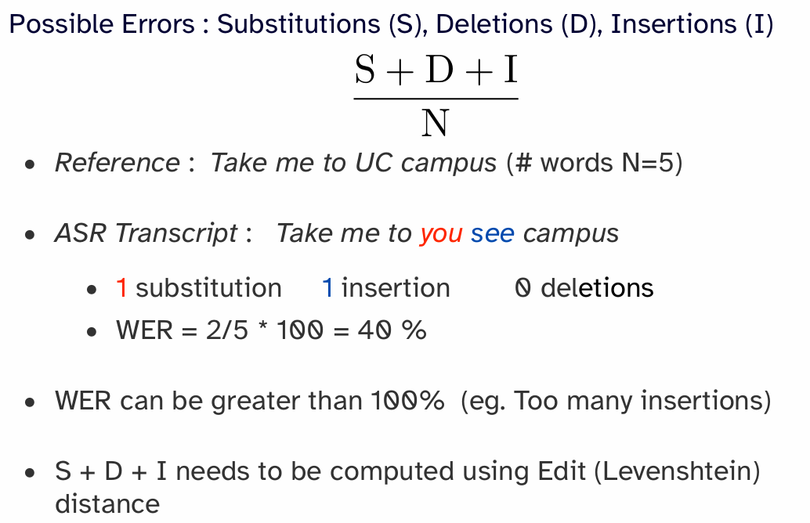
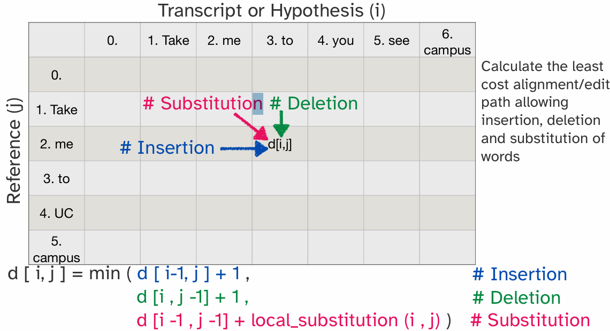
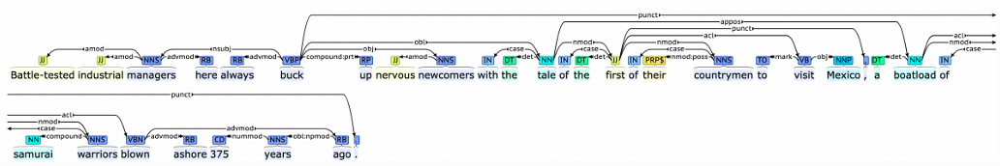
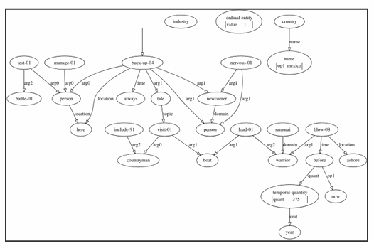
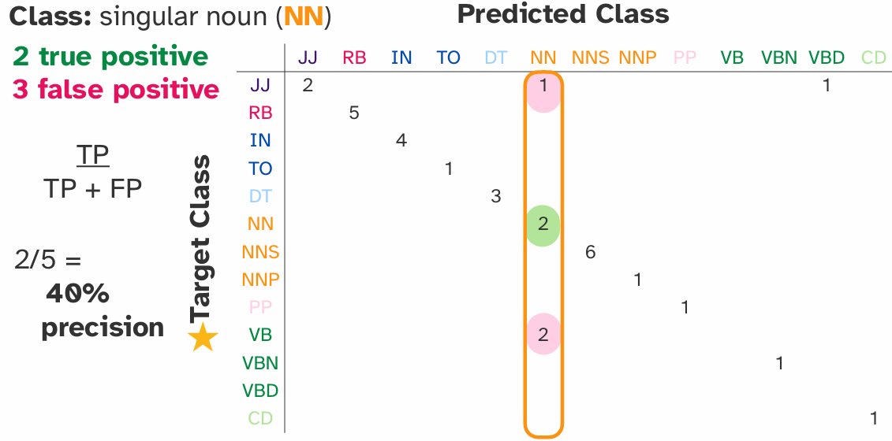
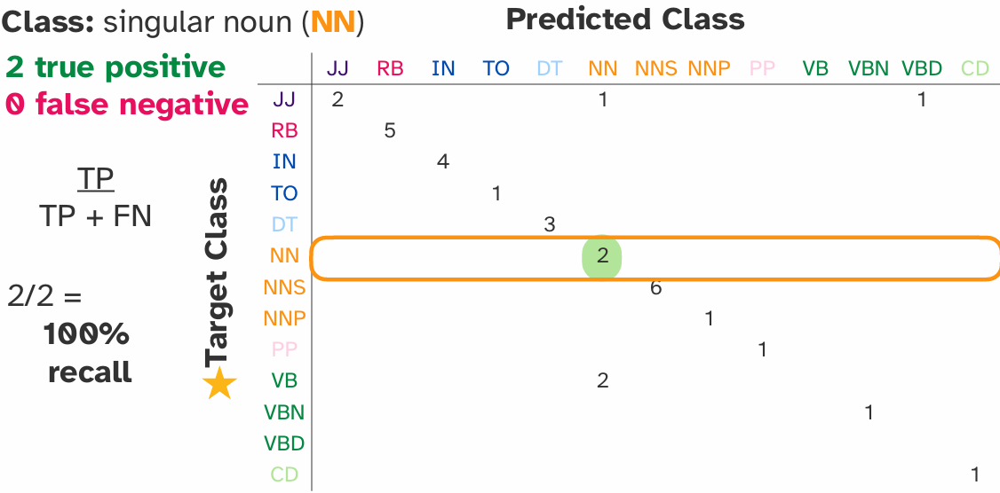
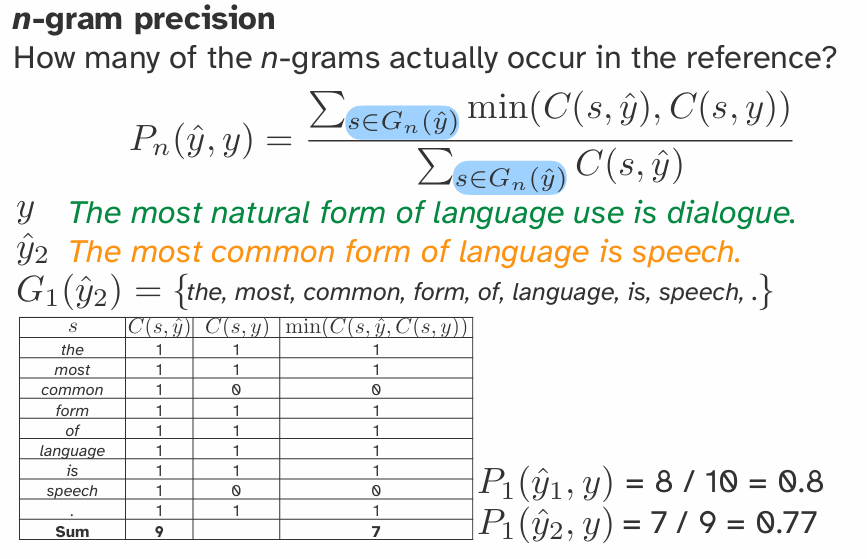

# Tasks, Data, and  Evaluation

## Part 1: NLP 任务 (NLP Tasks)

NLP 任务的核心是学习一个函数 `f(x) -> y`，其中 `x`是输入文本，`y`是输出。根据输出`y`的类型，任务可以分为以下几类：

### 1.1 分类任务 (Classification)

输出 `y` 来自一个离散的、预定义的类别集合。

- **情感分析 (Sentiment Analysis)**: 判断文本（如电影评论）的情感是正面还是负面。 `x` = "This movie was awesome!", `y` = Positive.
- **主题分类 (Topic Classification)**: 判断文章属于哪个主题（如体育、政治、科技）。
- **垃圾邮件检测 (Spam Detection)**: 判断邮件是否是垃圾邮件。

### 1.2 自动语音识别 (Automatic Speech Recognition)

Task: Convert a speech utterance into a text transcript. Word Error Rate (WER) captures average number (%) of wrong  words in the transcript. For now, let’s assume words are separated by spaces. (For languages that are not space delimited, Character Error  Rate (CER) can be used)

Word Error Rate (WER): 

那么S+D+I的最小值是多少呢？用莱文斯坦(Levenshtein)距离进行评估：使用动态规划，表中的一个元素可以通过左边元素插入单词、上边元素删除单词和左上方替换单词来实现对齐，因此动态规划公式如图所示。公式中的插入和删除都容易理解，替换的公式，尤其是local_substitution函数：
$$
\text{local\_substitution}(i,j)=1 \ if \ Hypothesis(i) \neq Reference(j) \ else \ 0
$$

注：图示为：假设我对reference修改，给成hypothesis的样子，但是怎样理解其实都是无所谓的，因为公式是一样的

### 1.3 结构化预测 (Structured Prediction)

输出 `y` 是一个具有内部结构的对象，例如序列、树或图。这是 NLP 中最复杂也最有趣的任务类型。

- **机器翻译 (Machine Translation)**: 输入是一个句子，输出是另一个语言的句子。`y` 是一个序列 (sequence)。
- **词性标注 (Part-of-Speech Tagging)**: 为句子中的每个单词标注其词性（名词、动词等）。`y` 是一个与输入等长的标签序列。
- **Dependency Head**: 标单词的依赖头

- **句法分析 (Syntactic Parsing)**: 生成句子的句法结构树。`y` 是一个树 (tree)。

- **文本摘要 (Summarization)**: 将长文档缩短为一篇摘要。`y` 是一个较短的文档。
- **命名实体识别 (Named Entity Recognition)**: 识别文本中的实体（人名、地名、组织等）。`y` 是一个标签序列。

### 1.4 语言建模 (Language Modeling - LM)

这是一个非常基础且核心的 NLP 任务，目标是为一段文本 `x` 分配一个概率 `P(x)`。

- 它通常通过**预测下一个词**来完成，即计算 `P(word | context)`。
- 这是一个**自监督学习 (Self-supervised Learning)** 的典型范例，因为文本数据本身就提供了标签（下一个词就是标签）。
- 语言模型是现代大型模型（如 GPT 系列）的基石。

## Part 2: 数据 (Data)

### 2.1 数据来源

- **有标签数据 (Labeled Data)**: 数据包含输入 `x` 和对应的输出 `y`。获取成本高昂，需要人工标注。
  - **示例**: Penn Treebank (用于句法分析), IMDB 电影评论数据集 (用于情感分析)。
- **无标签数据 (Unlabeled Data)**: 数据只有输入 `x`。获取成本低，数量巨大。
  - **示例**: 维基百科 (Wikipedia), Common Crawl (网页抓取数据)。

### 2.2 学习范式 (Learning Paradigms)

- **监督学习 (Supervised Learning)**: 使用**有标签数据** `(x, y)` 进行训练。大部分分类和结构化预测任务都属于此类。
- **无监督学习 (Unsupervised Learning)**: 使用**无标签数据** `x` 进行训练。
  - **自监督学习 (Self-supervised Learning)** 是无监督学习的一种特殊形式，模型从输入数据自身创造标签进行学习。语言建模是其典型代表。
- **半监督学习 (Semi-supervised Learning)**: 结合大量无标签数据和少量有标签数据进行学习。

### 2.3 预训练与微调 (Pre-training and Fine-tuning)

这是当前 NLP 领域最主流的范式，属于半监督学习。

1. **预训练 (Pre-training)**: 在**大规模无标签数据**上训练一个大型语言模型（如 BERT, GPT）。这个过程让模型学习通用的语言知识和表示 (representation)。
2. **微调 (Fine-tuning)**: 将预训练好的模型，在特定的**小规模有标签数据**上进行继续训练，以适应下游的具体任务（如情感分析、文本摘要等）。

## Part 3: 评估 (Evaluation)

### 3.1 数据集划分

为了进行可靠的评估，必须将数据集划分为三个部分：

- **训练集 (Train Set)**: 用于训练模型的主要参数。
- **开发集 (Development / Dev Set)**: 也叫验证集 (Validation Set)，用于调整模型的超参数 (hyperparameters) 和进行模型选择。**严禁在测试集上调参**。
- **测试集 (Test Set)**: 只在模型开发和调优全部完成后使用一次，用于报告模型的最终性能。

### 3.2 分类任务的评估指标

- **准确率 (Accuracy)**: `正确预测的样本数 / 总样本数`。在类别不均衡 (imbalanced classes) 的数据上具有误导性。

- **精确率 (Precision)**, **召回率 (Recall)**, 和 **F1 分数 (F1-Score)**:

  - **TP (True Positive)**: 实际为正，预测也为正。
  - **FP (False Positive)**: 实际为负，预测为正 (误报)。
  - **FN (False Negative)**: 实际为正，预测为负 (漏报)。
  - **精确率 (Precision)**: `TP / (TP + FP)`。在所有被预测为正例的样本中，有多少是真正的正例。衡量“查准率”。

  

  - **召回率 (Recall)**: `TP / (TP + FN)`。在所有真正的正例中，有多少被成功预测出来。衡量“查全率”。

  

  - **F1 分数 (F1-Score)**: `2 * (Precision * Recall) / (Precision + Recall)`。精确率和召回率的调和平均数，是二者的综合指标。

### 3.3 结构化预测任务的评估指标

因为输出是复杂的结构，评估也更复杂，通常基于 n-gram 重叠度。

- **BLEU 分数 (BLEU Score)**: 主要用于**机器翻译**。
  - **核心思想**: 比较机器生成的译文和人类参考译文之间的 n-gram (1-gram, 2-gram, etc.) **重叠度**。n-gram（$G_n(x)$） 指的是文本$x$中连续出现的 n 个元素的序列集合。**这个集合里面没有重复的元素**。
  - 这是一个**基于精确率 (Precision-based)** 的指标。
  - 包含一个**长度惩罚因子 (Brevity Penalty)**，以惩罚过短的翻译结果。
  - **公式**: `BLEU = BrevityPenalty * exp(Σ w_n * ln(p_n))`，其中 `p_n` 是 n-gram 的修正精确率。(C: Candidate; r: reference)

$$
p_n = \frac{\sum_{s \in \text{n-grams}(C)} \min(\text{Count}_{\text{cand}}(s), \text{Count}_{\text{ref}}(s))}{\sum_{s' \in \text{n-grams}(C)} \text{Count}(s')}
$$

$$
\text{BP} = \begin{cases}
1 & \text{if } c > r \\
e^{1 - r/c} & \text{if } c \le r
\end{cases}
$$

n-gram precision 分数计算示例如下图所示：

In practice，我们会用n-gram n=1-4来计算$BLEU_{1,2,3,4}$，然后对四个分数进行平均：
$$
\text{BLEU} = \text{BP}(C, r) \exp \left( \sum_{n=1}^{N} \frac{1}{N} \ln P_n(C, r) \right), N=4
$$
需要注意的是：BLEU分数并不是对称的！BLEU分数取值为0-1！而且并不能反应human judgments！比如说两个句子只有一个地方不同，那就是cold换成了freezing，人类可能很满意，但是BLEU分数不是满分。

- **ROUGE 分数 (ROUGE Score)**: 主要用于**文本摘要**。
  - **核心思想**: 与 BLEU 类似，但它是一个**基于召回率 (Recall-based)** 的指标。
  - 衡量人类写的参考摘要中有多少 n-gram 出现在了机器生成的摘要中。
  - **常见变体**: `ROUGE-N` (基于 n-gram), `ROUGE-L` (基于最长公共子序列 Longest Common Subsequence)。