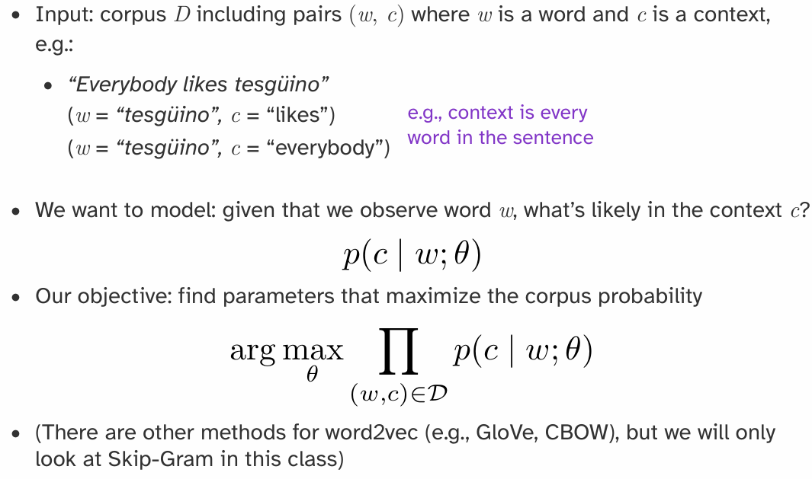
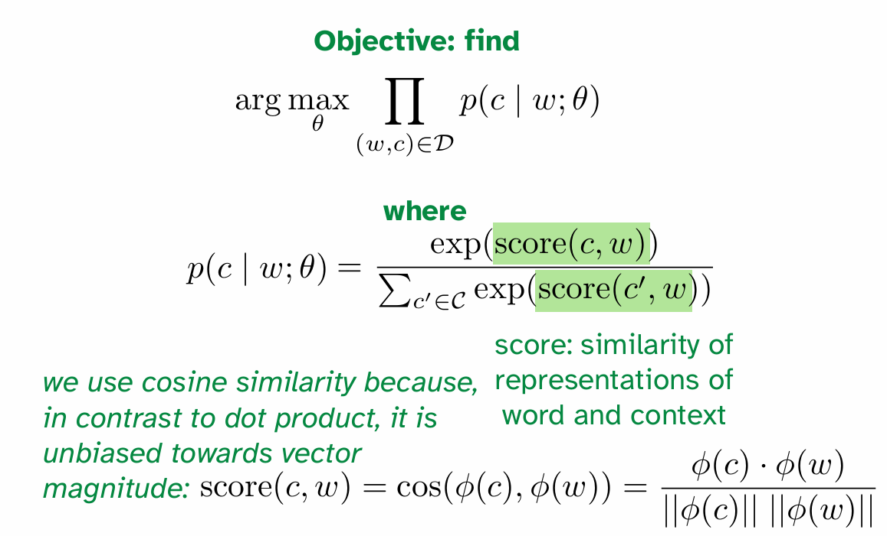
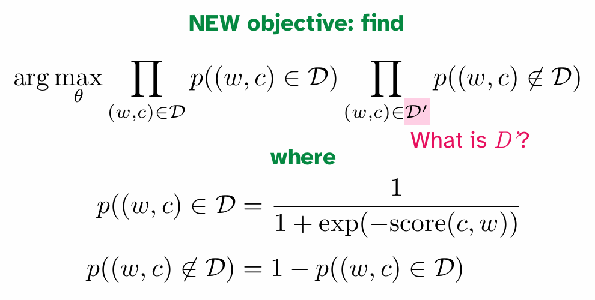
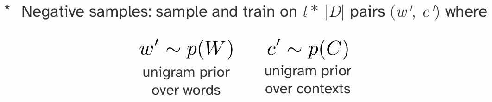
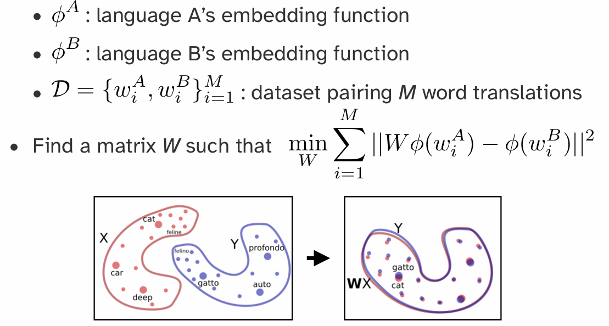

# Linguistics: Speech and Lexical Semantics

## Part 1: 语言学基本单元 (Linguistic Units)

语言可以被分解为不同层级的结构单元 。

- **音位/字位 (Phonemes/Graphemes)**: 语言中最小的声音/书写单位，能够区分意义 。
- 示例：英语元音 (GA English vowels)，美国手语的 Stokoe 标记法，汉字笔画 。
- **词素/词位 (Morphemes/Lexemes)**: 最小的有意义的语言单位 。
- 示例：美国手语中的口型词素 (CHA 表示大, OO 表示小)，德语动词 `fegen` 的变位，印尼语 `ajar` (教) 添加不同词缀 。
- **单词 (Words)**: 由一个或多个词素构成的独立单位 。
- **成分/短语 (Constituents/Phrases)**: 句子中充当一个单元的一组词 。
- 句法歧义 (Syntactic ambiguity) 展示了短语结构的重要性 。
- **话语/句子 (Utterances/Sentences)**: 表达一个完整思想的语言单位 。
- **篇章/对话 (Discourse/Dialogue)**: 由多个句子组成的更大语言单元，是语言最自然的使用形式 。

## Part 2: 语音处理 (Speech Processing)

### 2.1 语音的产生 (Speech Production)

- **生理过程**: 空气流经声道发音器官 (vocal articulators)，如声带 (vocal folds)、舌头 (tongue)、下巴 (jaw)、嘴唇 (lips) 等，通过独立或协同控制产生语音 

- **发声 (Voicing)**: 声带的振动导致了发声 。

- **声学结果**: 最终的输出是一个声学压力波 (acoustic pressure wave) 。

  ### 2.2 语音的表示 (Speech Representations)

**声学波形 (Acoustic Waveform)**: 语音可以直接表示为随时间变化的振幅波形图 。

**缺点**: 波形是连续的时间序列，难以直接分析、解释或计算 。

**信号处理**: 需要通过信号处理技术提取更有用的信息 。

**短时傅里叶变换 (Short-Time Fourier Transform)**:

1. **加窗 (Windowing)**: 将语音波形切分成很多个短的、有重叠的时间窗口（例如，窗长 25ms，步长 10ms）。

2. **傅里叶变换 (Fourier Transform)**: 对每个窗口内的信号执行傅里叶变换，将其从时域转换到时频域 (time-frequency representation) 。这能揭示在该时间片内哪些频率是显著的 (prominent) 。

   **语谱图 (Spectrogram)**:

**生成**: 将每个时间窗口的频率分析结果堆叠起来，形成一张图。其中，x轴是时间，y轴是频率，颜色的深浅（像素强度）表示在该时间点上对应频率的能量（声压级）。

- **特点**: 语谱图是一种信息丰富的二维表示，可以直观地看出声音随时间的变化。
- **共振峰 (Formants)**: 语谱图上能量集中的水平条纹，是区分不同元音的关键声学特征，由声道形状决定 。
- **清音/浊音 (Unvoiced/Voiced)**: 语谱图可以区分浊音（有声带振动，低频有能量）和清音（无声带振动）。

### 2.3 音韵学与语音学 (Phonology and Phonetics)

- **语音学 (Phonetics)**: 研究语音的声音物理产生、频谱属性和感知属性的学科 。

  **发音语音学 (Articulatory Phonetics)**: 研究发音器官如何产生声音。例如，元音 `[iy]` (beet) 和 `[ae]` (bat) 的舌位和颚部位置不同 。

  **声学语音学 (Acoustic Phonetics)**: 研究语音的声学特性，如语谱图分析 。

- **音位 (Phonemes)**: 感知上可区分的最小语音单位 。语谱图揭示了具有不同属性的语音片段结构，这些就是音位 。

- **国际音标 (International Phonetic Alphabet - IPA)**:

  - 由音位学家编制的一套通用符号，用于精确地记录各种语言中的语音 。
  - 英语拼写 (orthography) 与发音不一致，约 40 个音位由 26 个字母表示 。
  - **元音 (Vowels)**: 由下颚张开度 (jaw aperture) 和舌头前后位置 (tongue frontness) 来表征，部分元音还涉及嘴唇形状 。
  - **辅音 (Consonants)**: 由发音部位 (place of articulation, 如唇音 labial) 和发音方式 (manner of articulation, 如爆破音 plosive) 来表征 。

- **音韵学 (Phonology)**: 研究语言中声音组织规律的学科（音位 -> 音节 -> 单词）。

  **音节结构 (Syllable Structure)**: 不同语言有不同的音节构成规则。

  - 英语: (C3)V(C4) - `strengths` /strɛŋkθs/
  - 夏威夷语: (C)V(C)
  - 格鲁吉亚语: (C8)V(C5) - გვბრდღვნის /ˈɡvbrdɣvnis/

  - 音节由音首 (Onset) 和韵基 (Rhyme) 构成，韵基又包含韵核 (Nucleus) 和韵尾 (Coda) 。

- **字母到发音 (Letters to Sounds)**:

  - **发音词典**: 如 CMU 发音词典，提供了超过 11 万英语单词的音节和音位拼写 。
  - **Arpabet**: 一种方便 ASCII 表示的 IPA 版本 。
  - **发音变体 (Sound Variation)**: 发音会因方言、母语影响、语境、语言随时间演变等因素而不同 。研究表明，人类在出生前就已经在学习声音 。

## Part 3: 词汇与分词 (Words and Tokenization)

### 3.1 类型与实例 (Types and Tokens)

- **核心概念**: 文本数据可以看作是单词的序列 。
- **类型 (Type)**: 在语料库中一个**独一无二**的词 。所有 Types 构成词汇表 (Vocabulary) 。
- **实例 (Token)**: 一个 Type 在特定上下文中出现的**具体实例** 。
- **数字化表示**: 文本可以转换为一个整数序列，其中每个整数是其对应 Token 在词汇表中的索引 。词汇表则作为查询表 。

### 3.2 分词 (Tokenization)

分词是将原始文本字符串转换为 Token 序列的过程。

- **按空格分词**: 最简单的方法，但会导致标点符号与单词粘连（如 `dialogue:`）。

  **基于规则的分词 (Rule-Based Tokenization)**:

  - 使用更复杂的规则（如 `nltk.word_tokenize`）来处理标点符号 。
  - **问题 1**: 无法处理形态相似但不同的词（如 `reading` vs. `read`）。
  - **问题 2**: 规则通常是语言特定的，不适用于所有语言（如泰语没有空格分隔）。
  - **问题 3**: 词汇表是固定的。一旦 tokenizer "训练"完成，就无法处理词汇表之外的新词 (Out-of-Vocabulary, OOV)，例如 `ChatGPT` 。
    - **解决方法**: 引入一个特殊的 `<UNK>` (unknown) token 来表示所有未知单词 。

- **按字节/字符分词 (Bytes as Wordtypes)**:

  - 将字符串编码为其底层的字节序列 (如 UTF-8) 。
  - **优点 1**: 词汇表大小是固定的（所有可能的 Unicode 字符），完全消除了 OOV 问题。
  - **优点 2**: 这是真正意义上与语言无关的方法。
  - **缺点**: 单词的语义单元被打破，导致序列变得非常长，模型需要学习从零开始组合字符的意义，增加了学习难度。

  BPE算法将会单独详细介绍。

### 3.3 学习分词器 (Learned Tokenizers)

现代 NLP 采用基于数据驱动的方法来学习分词。

- **目标**: 在“将词切得太碎”（如字符）和“词汇表太大”（如单词）之间找到一个平衡点。
- **子词分词 (Subword Tokenization)**:
  - **核心思想**: 常见词保持为完整单元，罕见词被拆分为有意义的子词单元。
  - **示例**: `unaffable` -> `un-`, `aff`, `able`。
- **字节对编码 (Byte-Pair Encoding - BPE)**:
  1. **初始化**: 词汇表由所有单个字符组成。
  2. **迭代合并**: 迭代地在语料库中找到最频繁出现的相邻 token 对，并将它们合并成一个新的、更长的 token，加入到词汇表中。
  3. **终止**: 当词汇表达到预设大小时停止。

## Part 4: 词汇语义学与词嵌入 (Lexical Semantics & Word Embeddings)

### 4.1 词义 (Word Meaning)

- **词汇语义学 (Lexical Semantics)**: 研究单词意义的学科。
- **词义 (Sense/Concept)**: 一个词所代表的思想或概念。
- **引理 (Lemma)**: 代表相同核心意义的一组词形（如 `run`, `runs`, `running` 的引理是 `run`）。
- **同形异义词 (Homonymy)**: 拼写和发音相同，但意义不相关的词（如 `bank` 可以指银行或河岸）。
- **多义词 (Polysemy)**: 一个词有多个相关联的意义（如 `bank` 可以指金融机构或血库）。

### 4.2 词汇关系 (Lexical Relations)

- **同义词 (Synonymy)**: 意义相同或相近的词（如 `sofa` / `couch`）。
- **反义词 (Antonymy)**: 意义相反的词（如 `big` / `small`）。
- **上下位关系 (Hyponymy/Hypernymy)**:
  - **下位词 (Hyponym)**: 更具体的概念（如 `dog` 是 `animal` 的下位词）。
  - **上位词 (Hypernym)**: 更泛化的概念（如 `animal` 是 `dog` 的上位词）。
- **WordNet**: 一个大型的、人工构建的英语词汇数据库，它将单词组织成同义词集 (synsets) 并定义了它们之间的语义关系。

### 4.3 分布式语义 (Distributional Semantics)

- **分布式假设 (Distributional Hypothesis)**: **"一个词的特性取决于它所在的上下文 (the company it keeps)"** - J.R. Firth。
  - 核心思想: 意义相似的词倾向于出现在相似的上下文中。
- **词嵌入 (Word Embeddings)**: 将单词表示为低维、稠密的实数向量。这些向量旨在捕捉单词的语义信息。
  - **目标**: 在向量空间中，语义相似的单词彼此距离更近。

### 4.4 基于计数的词嵌入方法

- **词-文档共现矩阵 (Term-Document Matrix)**:
  - 行代表单词，列代表文档。
  - 矩阵单元格 `(w, d)` 的值表示单词 `w` 在文档 `d` 中出现的次数。
  - **问题**: 向量维度太高（文档数量），且非常稀疏。
- **词-词共现矩阵 (Word-Word Co-occurrence Matrix)**:
  - 行和列都代表词汇表中的单词。
  - 单元格 `(w1, w2)` 的值表示 `w1` 和 `w2` 在一个固定大小的上下文窗口内共同出现的次数。
  - **问题**: 矩阵仍然非常庞大和稀疏，并且计数偏向高频词。
- **TF-IDF (Term Frequency-Inverse Document Frequency)**:
  - 对原始计数进行加权，以平衡词频和文档频率。
  - **TF(t, d)**: 词 `t` 在文档 `d` 中的频率。
  - **IDF(t)**: `log(总文档数 / 包含词 t 的文档数)`。罕见词的 IDF 值更高。
  - **TF-IDF = TF \* IDF**。
- **点互信息 (Pointwise Mutual Information - PMI)**:
  - 衡量两个事件（单词共现）的关联性是否强于随机情况。
  - **PPMI (Positive PMI)**: `max(0, PMI(w1, w2))`。只保留正相关性。
  - 使用 PPMI 矩阵代替原始计数矩阵可以得到更好的词向量。
- **降维 (Dimensionality Reduction)**:
  - 使用**奇异值分解 (Singular Value Decomposition - SVD)** 等技术将高维稀疏矩阵（如 PPMI 矩阵）分解为低维稠密矩阵，从而得到最终的词嵌入。

### 4.5 基于学习的词嵌入方法 (Learned Embeddings)

- **核心思想**: 直接学习一个模型，其参数就是词嵌入向量。通过在一个代理任务 (proxy task) 上进行训练来优化这些向量。
- **Word2Vec (Mikolov et al. 2013)**:
  - **代理任务**: 预测一个词的上下文，或从上下文预测一个词。
  - **Skip-grams**: 给定一个中心词，预测其周围的上下文单词。
  - **CBOW (Continuous Bag-of-Words)**: 给定上下文单词，预测中心词。
  - **优化**: 使用负采样 (Negative Sampling) 等技术高效地进行训练。
- **GloVe (Global Vectors)**:
  - 结合了基于计数的方法（利用全局共现统计信息）和基于学习的方法（使用模型优化）的优点。
  - 优化目标直接基于词-词共现矩阵的概率比率。

### 4.6 词嵌入与现代大型语言模型 (LLMs)

- **LLM 之前的时代**:

  1. 从网上下载预训练好的词嵌入（如 Word2Vec, GloVe）。
  2. 用这些嵌入初始化模型的输入层。
  3. 在特定任务数据上微调模型的其他参数（有时也微调嵌入本身）。

  - 好的预训练嵌入对于数据量少的任务至关重要。

- **现在的 LLM 时代**:

  - 我们不再单独下载词嵌入，而是下载**整个预训练好的语言模型**。
  - 语言模型内部仍然为每个 token 学习特定的嵌入，但这些嵌入是模型的一部分，与模型的其他部分一起端到端地训练和使用。

- **为什么仍要关心词嵌入?**

  - **分析与评估**: 用于评估 LLM 学到的概念空间与人类概念空间的关联性。
  - **历史视角**: 现代 LLM 的许多架构设计都源于早期的词嵌入和句子表示研究（如 ELMo）。

### 4.7 句子表示 (Sentence Representations)

- **问题**: 有了单词的表示，如何得到整个句子的表示？
- **简单方法**: 词袋模型 (Bag-of-Words)，例如对句子中所有单词的词嵌入向量取平均值。
  - **缺点**: 丢失了单词的顺序和句法结构信息。

## Part 5: Byte Pair Encoding

这是现在最常用的tokenizer。输入的是：collection of texts and target vocabulary size。最开始的vocabulary就是全部文本的所有的bytes(characters)。直到vocabulary size达到目标，重复一下的步骤：

- Tokenize all of the texts using the current vocabulary 
- Find the most common **bigram** in the tokenized texts, then  add it to the vocabulary as a new wordtype

也就是说，用目前的vocabulary进行一次tokenization，然后找2-gram中频率最高的组合，然后将原本的两个token结合为1个token，更新词汇表。

## Part6: Meaning and Representation

> 注意！一下的介绍只是部分的。实际上有很多的适用于实际训练的trick，如构建context-word pairs的方式，一次梯度更新对于一个word配上一个correct context与几个负样本wrong context进行参数更新以提高训练效率，负样本抽样的先验等。这些细节此处予以忽略。

Core question: if a machine learning system is processing  text, how should words be represented as input to and  within the ML system? Machine learning models expect numerical inputs!

最简单的就是离散方法——独热编码（one-hot），一个单词（或token）编码成一个向量，这个向量的维度就是vocabulary的大小。但是这样子的编码有两个问题：首先是维度将会非常大；其次是单词之间的关系不能通过向量之间的关系表现出来。

Instead: represent words as continuous vectors！这样的话，通过两个向量之间的内积，就可以体现出两者之间的相关性，内积的意义也与‘语义上的接近’直觉上十分通彻。Similarity is learnable from text at scale。

问题便是：how do we get these vectors?这个过程其实称为word embedding。一个核心原则（假设）是**分布假说**：

- Words that are used in similar contexts have similar meanings
- Context: typically, other words in a text, but really anything can be context

> 一个词的意义由其上下文决定!

Embedding一个非常重要的方法是**word2vec**：***skip-gram***

What counts as context? Basically anything you want

上图中提到了用cosine similarity衡量语音近似程度，和优化目标，但是问题在于公式中分母的$\mathit{C}$是intractable的，因为范围覆盖了整个词汇表，可能会非常的大！

解决方案是：negative sampling！Instead of summing over all possibly contexts in which a word could appear，Approximate via learning from contexts in which a word  doesn’t appear

其中$\mathit{D}'$就是negative samples set。word and context pair是按照某种设定的先验概率采样出来的，这些pair里面的单词对其实半杆子打不着，因此优化目标的式子感性上就是在：提高认为正样本确实在语料库里面的确信，降低认为负样本在语料库里面的确信。

有了向量，我们可以表示一些很好的东西：比如说：a : b :: c : ?，代表的是a 对于 b 的关系，就如同 c 对于 ‘什么’ 的关系？那么实际上就是在求：
$$
\mathbf{a} : \mathbf{b} :: \mathbf{c} : \mathbf{?} \equiv d = \arg\max_{i \in \mathcal{W}} \frac{(\phi(b) - \phi(a) + \phi(c)) \cdot \phi(i)}{||(\phi(b) - \phi(a) + \phi(c)) \cdot \phi(i)||}
$$
“向量算术”的核心思想是：**单词之间的语义关系，可以被表示为它们对应词向量之间的数学运算**。最经典的操作就是向量的加法和减法。这意味着，模型不仅仅学会了“相似的词（如‘狗’和‘猫’）在向量空间中彼此靠近”，还学会了更复杂的**类比关系 (Analogy Relationship)**。

标志性例子：`king - man + woman = queen`

这是解释向量算术时最著名的例子，几乎出现在所有相关的教程和论文中。分解一下这个运算：

1. **`vector('king')`**: 首先，我们获取“国王”这个词的词嵌入向量。这个向量可以看作是“国王”这个概念在语义空间中的一个坐标点。它包含了诸如“皇室”、“男性”、“权力”、“人类”等多种语义成分。
2. **`vector('king') - vector('man')`**:
   - 然后，我们用“国王”的向量减去“男人”的向量。
   - 这一步在语义上的直观理解是：**我们从“国王”这个概念中，“剥离”或“移除”掉“男性”这个属性**。
   - 运算后得到的结果向量，可以想象成一个抽象的概念，它保留了“皇室”、“权力”等属性，但不再具有明确的性别特征。
3. **`(vector('king') - vector('man')) + vector('woman')`**:
   - 接着，我们将上一步得到的“去性别化的皇权”向量，加上“女人”的向量。
   - 这一步在语义上的理解是：**我们为这个抽象的“皇权”概念，“注入”或“添加”上“女性”这个属性**。
   - 最终得到的这个向量，就应该非常接近一个同时拥有“皇室”、“权力”和“女性”属性的概念。
4. **寻找最近的词向量**:
   - 最后，我们在整个词汇表的向量空间中，寻找与我们计算出的结果向量**距离最近**的那个词。
   - 惊人的是，在训练得当的 Word2Vec 模型中，距离这个结果向量最近的词，往往就是 **`queen`（女王）**。

甚至，如果我们有A B两个语言的embedding，想要进行对齐，那么其实就是将两个语义空间进行对齐，需要一个空间转换（spatial transformation）矩阵，那么实际上就是：

## Part 6: Detailed Skip-Gram (By Gemini 2.5 Pro)

Skip-gram 是 Word2Vec 框架下的两种经典模型之一（另一种是 CBOW），由 Google 的 Tomas Mikolov 团队于 2013 年提出。它是一种通过无监督学习，从海量文本数据中高效学习高质量**词嵌入 (Word Embeddings)** 的神经网络模型。

### 1. 核心思想与目标

Skip-gram 的理论基石是语言学中的**分布式假设 (Distributional Hypothesis)**：**一个词的意义由其上下文（即周围的词）所决定**。

- **最终目标**: Skip-gram 的真正目的**不是**要构建一个能精准预测上下文的语言模型，而是设计一个巧妙的**代理任务 (proxy task)**。在这个训练过程中，模型会“顺便”学习到能够捕捉单词丰富语义信息的副产品——**词向量 (Word Vectors)**。

- **代理任务**: **给定一个中心词 (Center Word)，预测它周围的上下文单词 (Context Words)**。这就像一个词语联想游戏：给你一个词，让你猜它周围可能会出现哪些词。

### 2. 模型架构与完整流程

Skip-gram 的实现是一个非常简单的浅层神经网络

#### 2.1 从海量文本生成训练数据

1.  **源数据**: 大规模的纯文本语料库（如维基百科、新闻文章等）。
2.  **滑动窗口**: 定义一个窗口大小 `window_size`（例如 2），这个窗口会在文本上从头到尾滑动。
3.  **生成样本对**: 每当窗口移动到一个新位置，就以当前词为**中心词**，窗口内的其他词为**上下文词**，生成 `(中心词, 上下文词)` 格式的训练样本对。

   > **示例**:
   > - 源句: `the quick brown fox jumps over the lazy dog`
   > - `window_size` = 2
   > - 当中心词是 `fox` 时，生成的训练样本为：
   >   - `(fox, quick)`
   >   - `(fox, brown)`
   >   - `(fox, jumps)`
   >   - `(fox, over)`

#### 2.2 神经网络结构

这是一个非常简洁的网络，通常只有输入、隐藏和输出三层。

1.  **输入层 (Input Layer)**
    - 输入的是**中心词**，表示为一个 **One-Hot 向量**。
    - 向量维度等于整个词汇表的大小 `V`。在 `V` 个位置中，只有代表当前中心词的索引处为 1，其余均为 0。

2.  **隐藏层 (Hidden Layer) 与词嵌入矩阵 W**
    - **权重矩阵 W**: 这是连接输入层和隐藏层的权重矩阵，维度为 `V × N`，其中 `N` 是我们期望的词向量维度（如 300）。**这个矩阵 W 就是我们最终想要得到的东西**。
    - **查找操作**: 当一个 One-Hot 向量与矩阵 `W` 相乘时，其数学效果等同于直接从 `W` 中**“查找并取出”**对应中心词的那一行向量。
    - **输出**: 隐藏层的输出就是一个 `N` 维的稠密向量，即该中心词的**词嵌入**。

3.  **输出层 (Output Layer) 与权重矩阵 W'**
    - **权重矩阵 W'**: 这是连接隐藏层和输出层的权重矩阵，维度为 `N × V`。
    - **计算得分**: 中心词的词嵌入向量会乘以 `W'`，生成一个 `V` 维的**得分向量**。
    - **Softmax 函数**: 该得分向量通过 Softmax 函数，被转换成一个 `V` 维的概率分布。这个概率分布的每一个值，都代表了词汇表中对应单词作为上下文出现的预测概率。

#### 2.3 训练目标

模型的训练目标是调整权重矩阵 `W` 和 `W'`，使得对于给定的中心词，其**真实上下文单词**所对应的预测概率尽可能高。

### 3. 核心挑战："Intractable" 的 Softmax

直接实现上述架构存在一个巨大的性能瓶颈：**Softmax 函数的计算量**。

- **问题根源**: Softmax 的分母需要对词汇表中**所有 `V` 个单词**的得分进行求和。
  $$
  P(w_o | w_I) = \frac{e^{v'_{w_o} \cdot v_{w_I}}}{\sum_{j=1}^{V} e^{v'_{w_j} \cdot v_{w_I}}}
  $$
- **为何 "Intractable"**: 当词汇表 `V` 非常大时（例如几十万），为**每一个训练样本**都执行一次包含几十万项的求和运算，其计算成本高到无法接受，使得训练在实践中变得不可行。

### 4. 优化策略：负采样 (Negative Sampling)

为了解决 Softmax 的计算瓶颈，Word2Vec 引入了**负采样**这一高效的优化技巧。

- **核心思想**: 将“从 V 个词中预测一个正确词”的**多分类问题**，转化为“判断一对词是否是真实上下文”的多个**二分类问题**。

- **流程**:
    1.  **正样本 (Positive Sample)**: 取一个真实的 `(中心词, 上下文词)` 对（如 `(fox, quick)`），并为其分配标签 `1`（代表“真”）。
    2.  **负样本 (Negative Samples)**: 从整个词汇表中**随机**抽取 `k` 个与中心词无关的词（如 `aardvark`, `puddle`），与中心词组成 `k` 个负样本对。为这些负样本分配标签 `0`（代表“假”）。
    3.  **带权随机抽样**: 这个随机抽样不是完全均匀的，而是根据词频进行带权抽样。一个词 `w` 被抽为负样本的概率与其词频 `f(w)` 的 `3/4` 次方成正比。这可以有效降低高频词的抽中概率，同时提高低频词的抽中概率。
    
    $$
    P(w) = \frac{f(w)^{3/4}}{\sum_{j=1}^{V} f(w_j)^{3/4}}
    $$
- **优势**: 每次更新时，模型只需要计算 `1` 个正样本和 `k` 个负样本的损失（共 `k+1` 个），计算量从 `O(V)` 骤降至 `O(k)`，极大地提升了训练效率。

### 5. 最终产出：词嵌入矩阵 W

当模型训练完成后，用于完成代理任务的后半部分网络（包括 `W'` 矩阵）通常会被**丢弃**。

我们真正需要并保留下来的是第一个权重矩阵 `W`。这个 `V × N` 维的矩阵就是**词嵌入矩阵**，它的**每一行**就是一个单词的、低维、稠密且富有语义的向量表示。

### 6. 神奇的特性：向量算术 (Vector Arithmetic)

训练好的词嵌入拥有惊人的特性，即能够通过简单的向量加减法来捕捉复杂的语义类比关系。

- **标准格式**: `a : b :: c : ?`  ("a 对于 b，如同 c 对于 ?")
- **经典例子**: `man : king :: woman : ?`
    - 通过向量运算 `vector('king') - vector('man') + vector('woman')`，计算出的结果向量在空间中与 `vector('queen')` 的位置惊人地接近。
- **深层原因**: 这表明词嵌入空间具有优美的**线性结构**，抽象的语义关系（如“性别”、“国家-首都”）被编码成了向量空间中的特定方向。

### 7. 总结

| 特性         | 描述                            |
| :----------- | :------------------------------ |
| **模型**     | Skip-gram (Word2Vec)            |
| **目标**     | 学习高质量的词嵌入              |
| **代理任务** | 根据中心词预测上下文词          |
| **架构**     | 浅层神经网络 (输入-隐藏-输出)   |
| **核心产出** | 输入层到隐藏层的权重矩阵 `W`    |
| **性能优化** | **负采样 (Negative Sampling)**  |
| **惊人特性** | **向量算术** (捕捉语义类比关系) |

Skip-gram 通过其巧妙的设计和高效的优化，彻底改变了自然语言处理领域。它使得从海量无标签文本中获取高质量的单词语义表示成为可能，并为后续更复杂的深度学习模型（如 LSTMs, Transformers）奠定了坚实的基础。