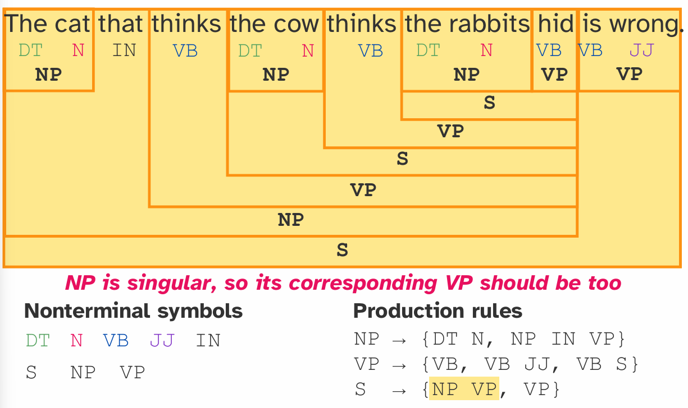
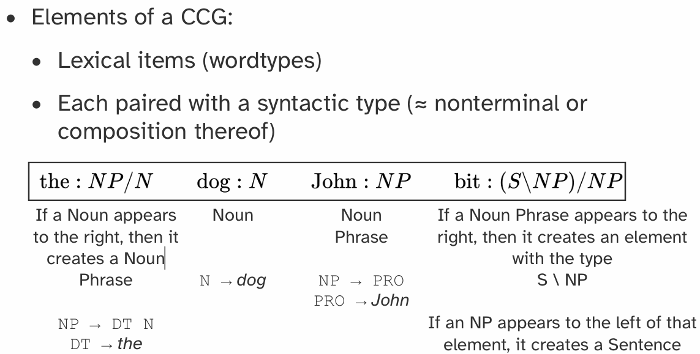
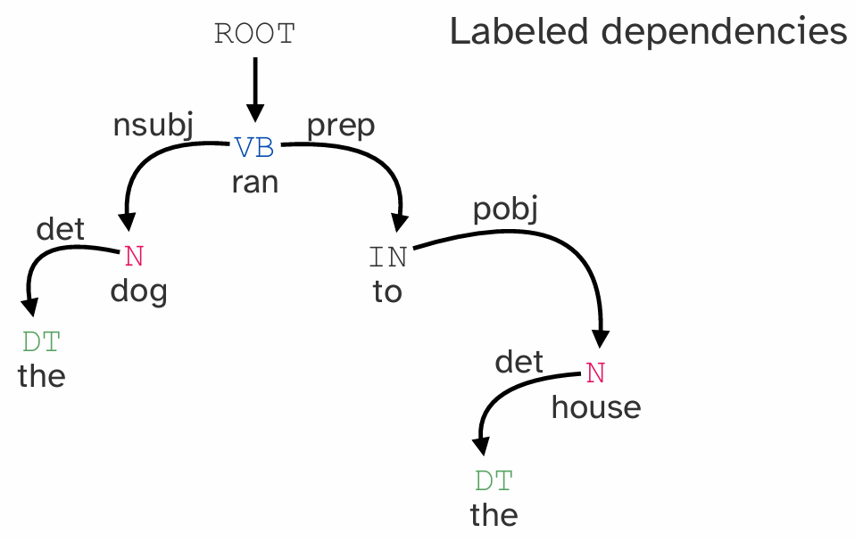

# Syntax

## Part 1: 语言模型面临的挑战

### 1.1 歧义性 (Ambiguity)
- **核心问题**: 一个句子可能有多种合法的解释。
- **句法歧义 (Syntactic Ambiguity)**: 句子的结构可以有多种解析方式，导致意义不同。
  - **示例**: "I'd like to buy a muffin with chocolate chips."
    - **解释1 (预期)**: 我想买一个“带有巧克力碎的松饼”。(a [muffin with chocolate chips])
    - **解释2 (字面)**: 我想用“巧克力碎”作为支付方式来买一个松饼。(buy a muffin [with chocolate chips])
- **句法形式主义 (Syntactic Formalisms)**: 使用句法分析树（如选区分析树）等形式化工具，可以明确地表示出不同的句子结构，从而消除歧义。

附：Constituency Parsing (选区句法分析) 

这是一种分析句子语法结构的方法，核心思想非常直观：**一个句子是由不同层次的“积木块”搭建而成的**。Constituency Parsing 的目标是将一个句子分解成一系列嵌套的、更小的语法单元。这些单元被称为 **“选区 (Constituents)”** 或 **“短语 (Phrases)”**。

可以把它想象成这样：

- **单词 (Words)** 是最小的积木块。

- 几个单词组合在一起，可以形成一个更大的积木块，比如 **名词短语 (Noun Phrase, NP)** 或 **动词短语 (Verb Phrase, VP)**。

- 这些中等大小的积木块又可以继续组合，最终搭建成一个完整的**句子 (Sentence, S)**。

  如："The cat sat on the mat."

````text
      S (句子)
     /   \
   NP     VP (动词短语)
  /  \    /      \
DT    N   V       PP (介词短语)
|     |   |      /     \
The  cat  sat   P       NP (名词短语)
                 |      /  \
                 on    DT   N
                       |    |
                       the  mat
````

### 1.2 合语法性 (Grammaticality)
- **定义**: 一个句子对于母语者来说听起来是否“正确”或自然。
- **关键特性**:
  - **非普适性**: 对于一个句子是否合乎语法的判断并不是绝对和普适的，它会因语言变体（方言、口音等）而异。不存在所谓的“坏语法”。
  - **与意义无关**: 一个合乎语法的句子不一定需要有明确或合理的意义。
    - **经典示例 (Chomsky, 1957)**: "Colorless green ideas sleep furiously" (无色的绿色思想愤怒地睡觉)。这个句子在语法上是完美的（形容词-名词-动词-副词），但语义上是无意义的。
    - 即使改变词序或动词形式（如 `sleeps` 或 `Green colorless`），我们依然能感知到其语法上的对错。
- **核心任务**: 对于一门语言 `L`，我们需要一个机制来判断一个新的句子 `x` 是否属于 `L` (即 `x ∈ L`)。

## Part 2: 形式语言与语法 (Formal Languages & Grammars)

### 2.1 如何表示一门语言？
- **有限集合**: 无法用一个有限的句子集合来表示一门语言，因为语言的创造性是无限的。
- **正则表达式 (Regular Expressions)**:
  - **适用场景**: 正则表达式可以很好地描述某些固定模式的语言结构，例如音节结构。
    - **示例**: 英语音节结构 `(C3)V(C4)` 可以用正则表达式表示，并生成未曾出现过但听起来合法的音节（如 `quaim`, `skoop`）。
  - **局限性**: 无法有效处理自然语言中复杂的**递归**和**嵌套**结构。
    - **示例**: 句子 "The cat that thinks the cow thinks the rabbits hid is wrong." 存在多层嵌套 `(DT N (IN VB (DT N ...)))`，用正则表达式来描述这种任意深度的嵌套会变得极其复杂甚至不可能。

### 2.2 上下文无关语法 (Context-Free Grammars - CFGs)
- **定义**: CFG 是一种更强大的形式化工具，通过**递归结构**提供了任意的表达能力，非常适合描述自然语言的句法。
- **历史**: 由诺姆·乔姆斯基 (Noam Chomsky) 首次形式化描述，但其核心的递归思想在古代语言学家（如帕尼尼 Pāṇini）的著作中已有体现。
- **CFG 的四个组成部分**:
  1.  **非终结符集合 (Nonterminal symbols)**: 表示抽象的语法类别，如 `S` (句子), `NP` (名词短语), `VP` (动词短语)。
  2.  **终结符集合 (Terminal symbols)**: 语言中的实际单词（词汇表），如 `cat`, `thinks`, `is`。
  3.  **产生式规则集合 (Production rules)**: 定义了非终结符如何由其他非终结符和终结符构成。
      - **示例规则**:
        - `S → NP VP` (一个句子由一个名词短语和一个动词短语构成)
        - `NP → DT N` (一个名词短语由一个限定词和一个名词构成)
        - `NP → NP IN VP` (递归规则，体现嵌套)
  4.  **起始符号 (Start symbol)**: 通常是 `S` (句子)。
- **句法分析 (Parsing)**: 使用 CFG 规则，可以自底向上地将一个句子（终结符序列）逐步规约为抽象的语法结构（非终结符），最终得到一个完整的句法分析树。如下图：

> 这个名字的关键在于“上下文无关”。它的意思是，当你在应用一条规则时（比如 `NP → DT N`），你**不需要考虑这个 `NP` 周围有什么其他的语法成分**。只要你看到了 `NP`，你就可以把它替换成 `DT N`，这条规则在任何上下文中都成立。



总而言之，**CFG (上下文无关语法)** 是一套强大的形式化规则，它通过定义“短语如何由更小的部分构成”，来描述句子的层次化和递归结构。它是计算语言学中理解和分析句法的基础工具。

- **CFG 的局限性**:
  - **“上下文无关”的含义**: 产生式规则的应用是独立的，不考虑周围的上下文。
  - **无法处理一致性 (Agreement)**: 标准的 CFG 无法处理主谓一致（如单数名词 `NP` 对应单数动词 `VP`）等依赖上下文的语法现象。一旦为 CFG 增加一致性约束，它就不再是“上下文无关”的了。
  - **语言覆盖范围**: 某些语言的句法结构甚至超越了 CFG 的表达能力。

### 2.3 概率上下文无关语法 (Probabilistic CFGs - PCFGs)
- **定义**: 为 CFG 的每条产生式规则赋予一个概率值 `p(rule | nonterminal)`。这个概率表示在给定一个非终结符时，选择某条特定规则进行展开的可能性。
- **作用**:
  - **解决歧义**: 当一个句子有多种可能的分析树时，PCFG 可以通过计算每棵树的概率（所有用到的规则概率的乘积），来找到**最可能**的那棵分析树。
  - **从数据中学习**: 这些规则的概率可以通过统计分析大型的、已标注语法树的语料库（如 Treebank）来学习得到。
- **挑战**: 句法分析任务变得更复杂：给定一个 PCFG，找到生成某个句子的最优规则应用序列。这是一个难题，因为可能的分析树数量会随着句子长度呈指数级增长。

## Part 3: 其他语法形式主义

### 3.1 选区语法 (Constituency Grammar)
- **别称**: CFG 通常也被称为短语结构语法 (Phrase Structure Grammar) 或选区语法。
- **选区 (Constituent)**: 句子中作为一个独立单元的一组词，可以由 CFG 中的一个非终结符表示。
- **检验选区的方法**:
  - **替代 (Substitution)**: 如果一个词串可以被一个代词（如 `it`）或固定短语（如 `do so`）替代，那么它很可能是一个选区。
    - `buy a muffin with chocolate chips` → `do so` (VP 选区)
    - `a muffin with chocolate chips` → `it` (NP 选区)
  - **省略/回答省略 (Answer Ellipsis)**: 如果一个词串可以作为问题的答案，它也可能是一个选区。
    - Q: "What would I like?" A: "To buy a muffin with chocolate chips" (VP 选区)

### 3.2 组合范畴语法 (Combinatory Categorial Grammar - CCG)
- **特点**: 一种自底向上 (bottom-up) 的选区语法表示方法。

- **组成元素**:
  1.  **词汇项 (Lexical items)**: 即单词。
  2.  **句法类型 (Syntactic type)**: 每个词汇项都配有一个句法类型，类似于非终结符或其组合。这些类型定义了单词如何与其他单词组合。
    - 示例: `the` 的类型可能是 `NP/N`，表示它需要右边一个 `N` (名词) 来组成一个 `NP` (名词短语)。



### 3.3 依存语法 (Dependency Grammar)
- **核心思想**: 句法结构由单词之间的**依存关系 (dependency)** 构成，这些关系通常是二元的、有向的，并且带有标签。
- **表示方法**: 句子被表示为一个由带标签的弧连接单词组成的图。弧从**头部词 (head)** 指向**依赖词 (dependent)**。
- **组成元素**:
  - 终结符（单词）。
  - 词性 (Parts of speech)。
  - 依存关系约束。
- **示例**: 在短语 `the dog` 中，`dog` 是核心词 (head)，`the` 是它的依赖词 (dependent)，关系标签是 `det` (限定词)。在 `dog ran` 中，`ran` 是核心词 (head)，`dog` 是它的主语依赖 (nsubj)。
- **通用依存 (Universal Dependencies)**: 一个大型的多语言项目，为全球约150种语言提供了统一标准的依存语法、词性和形态特征标注资源。

值得注意的是，通常语法树是有root的。

